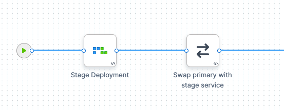

This topic will walk you through creating a Blue Green deployment in Harness for a Kubernetes Deployment workload.

For information on Blue/Green deployments, see [Deployment Concepts and Strategies](../../cd-deployments-category/deployment-concepts.md).

Harness Canary and Blue/Green strategies only support Kubernetes Deployment workloads. The Rolling strategy supports all other workloads, except Jobs. The [Apply Step](deploy-manifests-using-apply-step.md) can deploy any workloads or objects.

## Before You Begin

* [Kubernetes CD Quickstart](../../onboard-cd/cd-quickstarts/kubernetes-cd-quickstart.md)
* [Add Kubernetes Manifests](../../cd-advanced/cd-kubernetes-category/define-kubernetes-manifests.md)
* [Define Your Kubernetes Target Infrastructure](../../cd-infrastructure/kubernetes-infra/define-your-kubernetes-target-infrastructure.md)

## Review: What Workloads Can I Deploy?

See [What Can I Deploy in Kubernetes?](../../cd-technical-reference/cd-k8s-ref/what-can-i-deploy-in-kubernetes.md).

## Review: Harness Blue Green Deployments

Here's a quick summary of how Harness performs Blue Green deployments.

You can deploy one or two Kubernetes services as part of your Harness Blue Green deployment.

### Single Kubernetes service

Only one Kubernetes service is mandatory and it doesn’t need any annotations to establish if it is the primary (production) service.

Here is a very generic service example that uses a values.yaml file for its values:

```yaml
apiVersion: v1  
kind: Service  
metadata:  
  name: {{.Values.name}}-svc  
spec:  
  type: {{.Values.serviceType}}  
  ports:  
  - port: {{.Values.servicePort}}  
    targetPort: {{.Values.serviceTargetPort}}  
    protocol: TCP  
  selector:  
    app: {{.Values.name}}
```

This file and sample deployment and values.yaml files are publicly available on the [Harness Docs repo](https://github.com/wings-software/harness-docs/tree/main/k8s-bluegreen).

Note that there are no annotations to indicate that it is the primary service.

If you are using only one service in your manifest, Harness will create a duplicate of that service and name it with the `-stage` suffix.

### Two Kubernetes services

If you have more than one service, Harness does not automatically know which is the primary service unless you add the annotations like this: 

* The **primary** service uses this annotation: `annotations: harness.io/primary-service: "true"`. You must have this annotation added in your manifest.
* The **stage** service uses this annotation: `annotations: harness.io/stage-service: "true"`. You must have this annotation added in your manifest.

Here's an example:

```yaml
apiVersion: v1  
kind: Service  
metadata:  
  name: test-deploy-svc-1  
  annotations:  
    harness.io/primary-service: "true"  
spec:  
  type: ClusterIP  
  ports:  
  - port: 80  
    targetPort: 80  
    protocol: TCP  
  selector:  
    app: nginx  
---  
apiVersion: v1  
kind: Service  
metadata:  
  name: test-deploy-svc-2  
  annotations:  
    harness.io/stage-service: "true"  
spec:  
  type: ClusterIP  
  ports:  
  - port: 80  
    targetPort: 80  
    protocol: TCP  
  selector:  
    app: nginx
```
If you use two services, please annotate them as described.

Let's look at the deployment process using two Kubernetes services:  


1. **First deployment:**
	1. Harness creates two services (primary and stage) and one pod set for the app.
	2. The primary service uses this annotation: `annotations: harness.io/primary-service: "true"`. You must have this annotation added in your manifest.
	3. The stage service uses this annotation: `annotations: harness.io/stage-service: "true"`. You must have this annotation added in your manifest.
	4. The pod set is given an annotation of `harness.io/color: blue`.
	5. Harness points the stage service at the pod set and verifies that the set reached steady state.
	6. Harness swaps the primary service to pod set. Production traffic now flows to the app.
2. **Second deployment (new version of the same app):**
	1. Harness creates a new pod set for new app version. The pod set is given the annotation `harness.io/color: green`.
	2. Harness points the stage service at new pod set (with new app version) and verifies that the set reached steady state.
	3. Harness swaps the primary service to new pod set, stage service to old pod set.
3. **Third deployment:**
	1. Harness deploy new app version to the pod set not using the primary service.
	2. Harness points the stage service at new pod set (with new app version) and verifies that the set reached steady state.
	3. Harness swaps the primary service to new pod set, stage service to old pod set.

## Visual Summary

Here's a video walking through a simple Canary deployment. It's 10 minutes long but it covers set up and two deployments.

<!-- Video:
https://www.youtube.com/watch?v=0x2eHfpNv_o-->
<docvideo src="https://www.youtube.com/watch?v=0x2eHfpNv_o" />

## Step 1: Define the Service and Infrastructure

Create your CD Pipeline stage.

To set up your Service and Infrastructure in the stage, follow the steps in these topics:

* [Add Kubernetes Manifests](../../cd-advanced/cd-kubernetes-category/define-kubernetes-manifests.md)
* [Define Your Kubernetes Target Infrastructure](../../cd-infrastructure/kubernetes-infra/define-your-kubernetes-target-infrastructure.md)

Once the Service and Infrastructure are set up, you can add the execution steps.

## Step 2: Add the Execution Steps

In the stage's **Execution**, click **Add Step**, and select the **Blue Green** strategy.

Harness adds all the steps you need to perform the Blue Green strategy:



That's it. Harness will deploy the artifact using the stage service initially, and swap traffic to the primary service.

Let's look at the default settings for the Stage Deployment step.

## Step 3: Stage Deployment Step

The **Stage Deployment** step is added automatically when you apply the Blue Green strategy.

Click the **Stage Deployment** step. The step simply includes a name, timeout, and Skip Dry Run options.

**Skip Dry Run:** By default, Harness uses the `--dry-run` flag on the `kubectl apply` command during the **Initialize** step of this command, which prints the object that would be sent to the cluster without really sending it. If the **Skip Dry Run** option is selected, Harness will not use the `--dry-run` flag.The first time you deploy, the **Stage Deployment** step creates two Kubernetes services, a new pod set, and deploys your app to the pod set.

When you look at the **Stage Deployment** step in Harness **Deployments**, you will see the following log sections.

### Fetch Files

Harness pulls the manifests and values.yaml from your repo.

### Initialize

The Initialize stage initializes the two Kubernetes services and deployment object, validating their YAML.

### Prepare

Typically, in a **Prepare** section, you can see that each release of the resources is versioned. This is used in case Harness needs to rollback to a previous version.

In the case of Blue Green, the resources are not versioned because a Blue Green deployment uses **rapid rollback**: network traffic is simply routed back to the original instances.

You do not need to redeploy previous versions of the service/artifact and the instances that comprised their environment.

The **Prepare** section shows that Harness has prepared two services, identified the deployment as blue, and pointed the stage service (blue) at the blue pod set for the deployment:

This example uses one Kubernetes service, hence the use of the `-stage` suffix.

```
Manifests processed. Found following resources:   
  
Kind                Name                                    Versioned   
Service             bgdemo-svc                              false       
Deployment          bgdemo                                  false       
  
Primary Service is bgdemo-svc  
  
Created Stage service [bgdemo-svc-stage] using Spec from Primary Service [bgdemo-svc]  
  
Primary Service [bgdemo-svc] not found in cluster.  
  
Stage Service [bgdemo-svc-stage] not found in cluster.  
  
Primary Service is at color: green  
  
Stage Service is at color: blue  
  
Cleaning up non primary releases  
  
Current release number is: 1  
  
Versioning resources.  
  
Workload to deploy is: Deployment/bgdemo-blue  
  
Done.
```

### Apply

The Apply section applies a services and deployment from the Prepare section. It uses a combination of all of the manifests in the Service **Manifests** section as one file using `kubectl apply`.


```
kubectl --kubeconfig=config apply --filename=manifests.yaml --record  
  
service/bgdemo-svc created  
  
deployment.apps/bgdemo-blue created  
  
service/bgdemo-svc-stage created  
  
Done.
```

### Wait for Steady State

The Wait for Steady State section shows Harness confirming the rollout and that the pods have reached steady state.

Next, the **Swap Primary with Stage** step will swap the primary and stage services to route primary network traffic to the pod set for the app.

If this were the second deployment, Harness would also swap the stage service to the pod set for the old app version.

## Step 4: Swap Primary with Stage Step

Click the **Swap Primary with Stage** step.

In the Prepare step you saw the primary service pointing at the green pod set and the stage service pointing at blue pod set containing the app.

In **Swap Primary with Stage**, Harness swaps the primary service to the pod set running the app (blue) and the stage service to the other color (green). Since this is the first deployment, there is no actual green pod set.

Production traffic now flows to the app.

This example uses one Kubernetes service, hence the use of the `-stage` suffix.

```
Selectors for Service One : [name:bgdemo-svc]  
  
app: bgdemo  
  
harness.io/color: green  
  
Selectors for Service Two : [name:bgdemo-svc-stage]  
  
app: bgdemo  
  
harness.io/color: blue  
  
Swapping Service Selectors..  
  
Updated Selectors for Service One : [name:bgdemo-svc]  
  
app: bgdemo  
  
harness.io/color: blue  
  
Updated Selectors for Service Two : [name:bgdemo-svc-stage]  
  
app: bgdemo  
  
harness.io/color: green  
  
Done
```

The next time you deploy, the swap will point the primary service at the green pod set and the stage service at the blue pod set:


```
...  
Swapping Service Selectors..  
  
Updated Selectors for Service One : [name:bgdemo-svc]  
  
app: bgdemo  
  
harness.io/color: green  
  
Updated Selectors for Service Two : [name:bgdemo-svc-stage]  
  
app: bgdemo  
  
harness.io/color: blue  
  
Done
```

## Option: Scale Down Old Version

A great benefit of a Blue/Green deployment is rapid rollback: rolling back to the old version of an app is simple and reliable because network traffic is simply routed back to the previous pods.

You do not need to redeploy previous versions of the app and the pods that comprised their environment.

If you would like to scale down the old version, add a [Shell Script step](../cd-general-steps/using-shell-scripts.md) to the post-deployment steps of your stage.

Here's an example using `<+pipeline.stages.[stage_name].spec.execution.steps.stageDeployment.output.stageServiceName>` to reference the stage service name. The name of the stage is nginx so the reference is `<+pipeline.stages.nginx.spec.execution.steps.stageDeployment.output.stageServiceName>`.


```
export KUBECONFIG=${HARNESS_KUBE_CONFIG_PATH}  
kubectl scale deploy -n <+infra.namespace> $(kubectl get deploy -n <+infra.namespace> -o jsonpath='{.items[?(@.spec.selector.matchLabels.harness\.io/color=="'$(kubectl get service/<+pipeline.stages.nginx.spec.execution.steps.stageDeployment.output.stageServiceName> -n <+infra.namespace> -o jsonpath='{.spec.selector.harness\.io/color}')'")].metadata.name}') --replicas=0
```

If you use a Delegate installed outside of the target cluster, any scripts in your Pipeline need to use the `${HARNESS_KUBE_CONFIG_PATH}` expression to reference the path to a Harness-generated kubeconfig file containing the credentials you provided (`export KUBECONFIG=${HARNESS_KUBE_CONFIG_PATH}`).

For example:


```
export KUBECONFIG=${HARNESS_KUBE_CONFIG_PATH}  
kubectl scale deploy -n <+infra.namespace> $(kubectl get deploy -n <+infra.namespace> -o jsonpath='{.items[?(@.spec.selector.matchLabels.harness\.io/color=="'$(kubectl get service/${k8s.stageServiceName} -n <+infra.namespace> -o jsonpath='{.spec.selector.harness\.io/color}')'")].metadata.name}') --replicas=0
```

This example does not apply to scaling down multiple deployments in the same namespace. If you use the example and you have multiple deployments in the same namespace it will impact multiple deployments. You should also include a label (or another matchSelector) specific to the particular deployment, so it doesn’t scale down all the blue deployments in the namespace. For example, match `blue` and `my-specific-app`.### Option: Using the Horizontal Pod Autoscaler (HPA)

If you are using the Horizontal Pod Autoscaler with your deployment, create a `blue` and `green` HPA configuration that will point at your deployments.

templates/hpa-blue.yaml:


```yaml
apiVersion: autoscaling/v2beta2  
kind: HorizontalPodAutoscaler  
metadata:  
  name: {{.Values.name}}-blue  
  labels:  
    harness.io/color: blue  
spec:  
  scaleTargetRef:  
    apiVersion: apps/v1  
    kind: Deployment  
    name: {{.Values.name}}-blue  
  minReplicas: {{ .Values.autoscaling.minReplicas }}  
  maxReplicas: {{ .Values.autoscaling.maxReplicas }}  
  metrics:  
    {{- toYaml .Values.autoscaling.metrics | indent 4 }}
```

templates/hpa-green.yaml:

```yaml
apiVersion: autoscaling/v2beta2  
kind: HorizontalPodAutoscaler  
metadata:  
  name: {{.Values.name}}-green  
  labels:  
    harness.io/color: green  
spec:  
  scaleTargetRef:  
    apiVersion: apps/v1  
    kind: Deployment  
    name: {{.Values.name}}-green  
  minReplicas: {{ .Values.autoscaling.minReplicas }}  
  maxReplicas: {{ .Values.autoscaling.maxReplicas }}  
  metrics:  
    {{- toYaml .Values.autoscaling.metrics | indent 4 }}
```

You can add your scaling configuration to your manifest (or share it if you are using a Helm chart):


```yaml
autoscaling:  
  minReplicas: 1  
  maxReplicas: 5  
  metrics:  
  - type: Resource  
    resource:  
      name: cpu  
      target:  
        type: Utilization  
        averageUtilization: 20  
  - type: Resource  
    resource:  
      name: memory  
      target:  
        type: Utilization  
        averageUtilization: 20
```
When using this with a traffic splitting strategy, your pods will scale automatically as your new pods begin receiving heavier loads.

## Notes

* **Blue/Green Rollback** — A great benefit of a Blue/Green deployment is rapid rollback: rolling back to the old version of a service/artifact is simple and reliable because network traffic is simply routed back to the original instances. You do not need to redeploy previous versions of the service/artifact and the instances that comprised their environment.

## Next Steps

* [Create a Kubernetes Rolling Deployment](create-a-kubernetes-rolling-deployment.md)
* [Create a Kubernetes Canary Deployment](create-a-kubernetes-canary-deployment.md)

