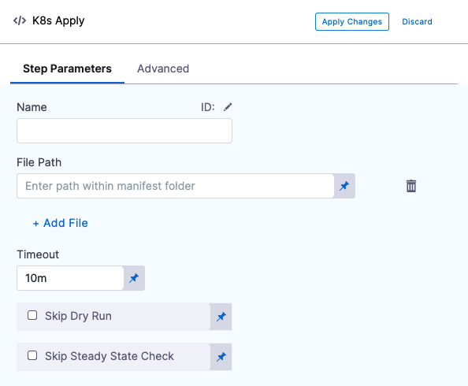
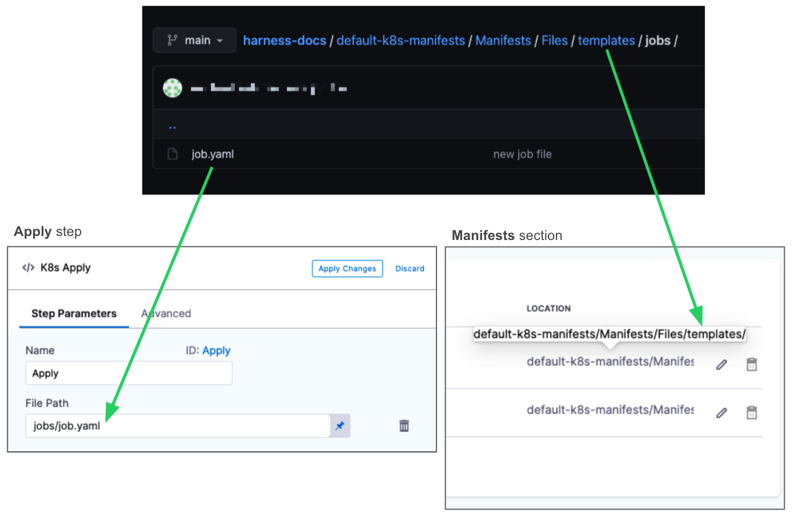
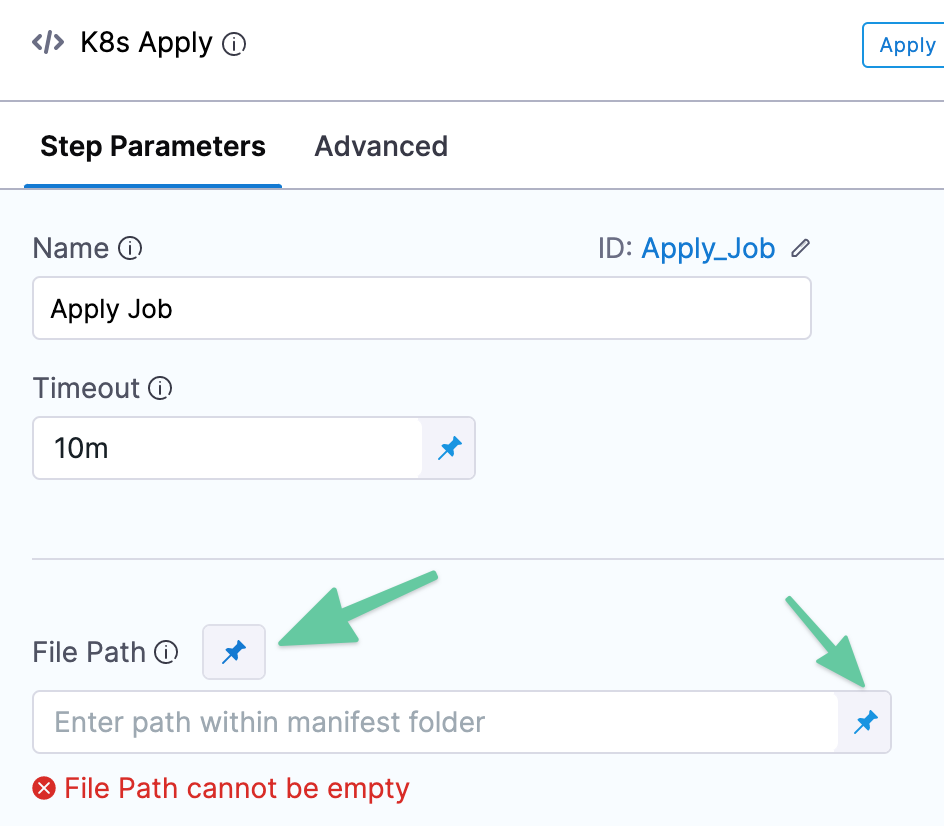
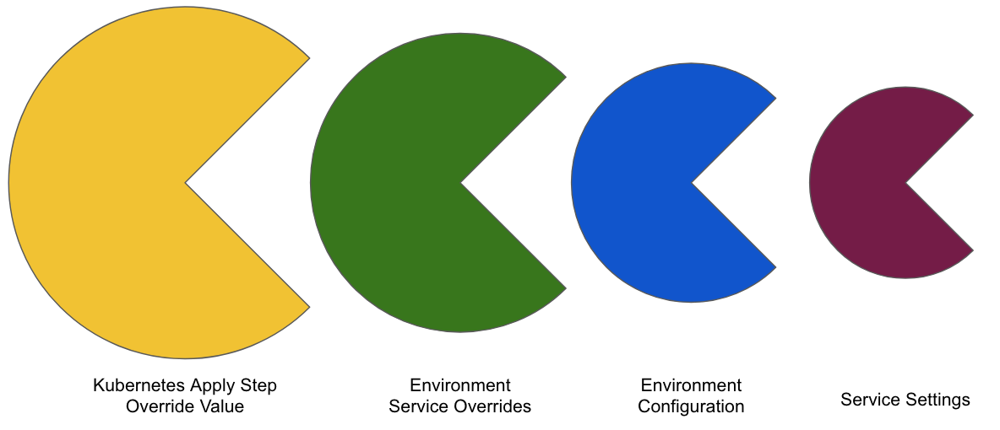
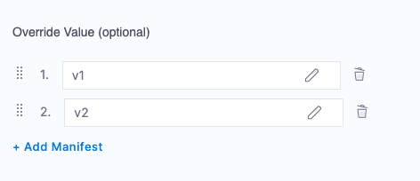
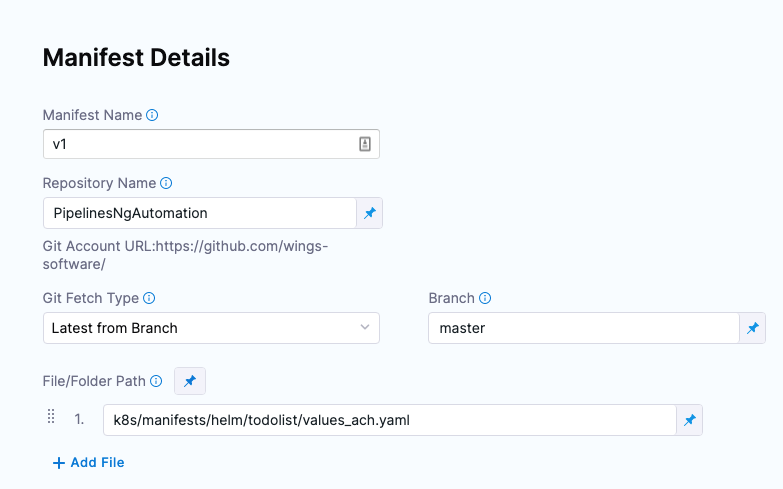
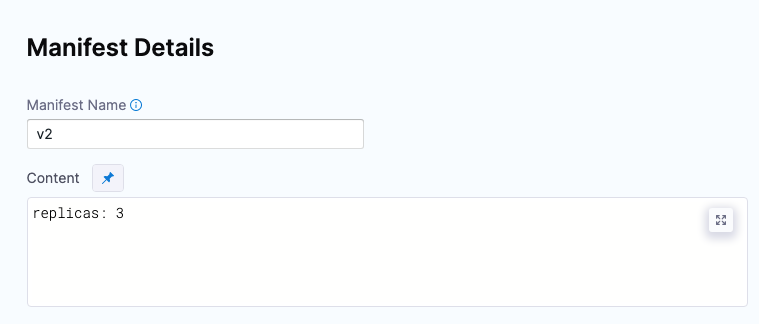

By default, the Harness Kubernetes Rolling, Canary, and Blue Green steps will deploy all of the resources you have set up in the Service Definition **Manifests** section.

In some cases, you might have resources in **Manifests** that you do not want to deploy as part of the main deployment, but want to apply as another step in the stage.

For example, you might want to deploy an additional resource only after Harness has verified the deployment of the main resources in the **Manifests** section.

CD stages include an **Apply** step that allows you to deploy any resource you have set up in the **Manifests** section.

## Before You Begin

* [Add Kubernetes Manifests](../../cd-advanced/cd-kubernetes-category/define-kubernetes-manifests.md)
* [Kubernetes CD Quickstart](../../onboard-cd/cd-quickstarts/kubernetes-cd-quickstart.md)

## What Kubernetes workloads can I include?

The **​Apply Step** can deploy all workload types, including Jobs.

All workloads deployed by the Apply step are managed workloads. Managed workloads are tracked until steady state is reached.

The Apply Step is primarily used for deploying Jobs controllers, but it can be used for other resources. Typically, when you want to deploy multiple workloads (Deployment, StatefulSet, and DaemonSet) you will use separate stages for each.Other Kubernetes steps, such as Rolling, are limited to specific workload types.

For a detailed list of what Kubernetes workloads you can deploy in Harness, see [What Can I Deploy in Kubernetes?](../../cd-technical-reference/cd-k8s-ref/what-can-i-deploy-in-kubernetes.md).

### Rolling vs Apply

The following table lists the differences between the Rolling Deployment step (default in a Rolling strategy) and the Apply step (which may be used with any strategy).

|  | **Jobs** | **Rollback** |
| --- | --- | --- |
| **Rolling Deployment step** | No | Yes |
| **Apply step** | Yes | No |

## Step 1: Skip a Specific Workload

By default, when you run a CD Pipeline, Harness will use all of the manifests in the **Manifests** section, and deploy all of its workloads.

To avoid having a specific workload deployed as part of the standard deployment, you add the Harness comment  `# harness.io/skip-file-for-deploy` to the **top** of the file.

This comment instructs Harness to ignore this manifest. Later, you will use the **Apply Step** to deploy this manifest.

For example, here is a ConfigMap file using the `# harness.io/skip-file-for-deploy` comment:


```go
# harness.io/skip-file-for-deploy  
  
{{- if .Values.env.config}}  
apiVersion: v1  
kind: ConfigMap  
metadata:  
  name: {{.Values.name}}  
data:  
{{.Values.env.config | toYaml | indent 2}}  
---  
{{- end}}
```
Now, when this Pipeline is executed, this ConfigMap resource will not be applied.

### Important

* The comment `# harness.io/skip-file-for-deploy` must be at the **top** of the file. If it is on the second line it will not work and the resource will be deployed as part of the main stage rollout.
* If you apply the ignore comment `# harness.io/skip-file-for-deploy` to a resource but do not use the resource in an **Apply** step, the resource is never deployed.

## Step 2: Add the Manifest

Add the commented manifest to the **Manifests** section of your CD stage.

See [Add Kubernetes Manifests](../../cd-advanced/cd-kubernetes-category/define-kubernetes-manifests.md).

## Step 3: Add the Apply Step

In your Pipeline, click **Add Step**, and then click **Apply**. The Apply step appears.



Enter a name for the step. Harness will create a step Id using the name, but you can change it.

## Step 4: Enter the Path and Name of the Manifest

In **File Path**, enter the path to a manifest file.

**File Path** has the following requirements:

* The path to the manifest for the Apply step must be subordinate to the path for the manifest in the **Manifests** section of the Service Definition. The manifest cannot be in the same folder as **Manifests**.
* The path must include the folder name and the file name.

In the following example, the path used in the **Manifests** section of the Service Definition is `default-k8s-manifests/Manifests/Files/templates/`. The **Apply** step uses a Job manifest in the subfolder `jobs/job.yaml`.



You can enter multiple file paths in File Path. Simply click **Add file**.

### File Path Runtime Inputs

You can set [Fixed Values, Runtime Inputs, and Expressions](../../../platform/20_References/runtime-inputs.md) for File Path settings:



Here are the options:

* **File Path setting:**
	+ **Fixed Value:** this is the default. Selecting **Fixed Value** means that you will set a static file path or expression in the step.
	+ **Runtime Input:** select this option if you want to enter a value at runtime or using [Input Sets and Overlays](../../../platform/8_Pipelines/input-sets.md).
* **File path field:**
	+ **Fixed Value:** this is the default. Selecting **Fixed Value** means that you will set a static file path in the step.
	+ **Expression:** Selecting **Expression** means that you will use a variable in the step, such as a [stage variable](../../../platform/8_Pipelines/add-a-stage.md).

## Option: Skip Dry Run

By default, Harness uses the `--dry-run` flag on the `kubectl apply` command, which prints the object that would be sent to the cluster without really sending it. If the **Skip Dry Run** option is selected, Harness will not use the `--dry-run` flag.

## Option: Skip Steady State Check

By default, Harness checks to see if a deployed workload has reached steady state.

If you select this option, Harness will not check that the workload has reached steady state.

## Option: Skip K8s Manifest(s) Rendering

By default, Harness uses Go templating and a values.yaml for templating manifest files. 

In some cases, you might not want to use Go templating because your manifests use some other formatting.

Use the **Skip K8s Manifest(s) Rendering** option if you want Harness to skip rendering your manifest files using Go templating.

For details, go to [Deploy Manifests Separately using Apply Step](deploy-manifests-using-apply-step.md).

## Option: Override Value

Values YAML files can be specified at several places in Harness:

* Environment Service Overrides (if you are using [Services and Environments v2](../../onboard-cd/cd-concepts/services-and-environments-overview.md))
* Environment Configuration (if you are using [Services and Environments v2](../../onboard-cd/cd-concepts/services-and-environments-overview.md))
* Service Definition Manifests

You can also add a Values YAML values and/or files in the Kubernetes Apply Step **Override Value**.

### Override Priority

At Pipeline runtime, Harness compiles a single Values YAML for the deployment using all of the Values YAML files you have set up across the stage's Service, Environment, and Kubernetes Apply.

Harness merges all of the Values YAML values/files into one file.

If two or more sources have the same name:values pairs (for example, `replicas`), that is a conflict that Harness resolves using the following priority order (from highest to lowest):

1. Kubernetes Apply Step **Override Value**.
2. Environment Service Overrides (if you are using [Services and Environments v2](../../onboard-cd/cd-concepts/services-and-environments-overview.md)).
3. Environment Configuration (if you are using [Services and Environments v2](../../onboard-cd/cd-concepts/services-and-environments-overview.md)).
4. Service Definition Manifests.



You can add multiple overrides to the Kubernetes Apply step:



The override priority for these is in reverse order, so 2 overrides 1 and so on.

### Remote and inline Values YAML

You can add remote or inline Values YAML files/values in the Kubernetes Apply Step **Override Value**.

Example remote Values YAML:



Example inline Values YAML:



## Apply Step Examples

Deploying a resource out of sync with the main resource deployment in a stage can be useful if a specific resource requires some external service processing that is orchestrated around your main rollout, such as database migration.

One reason why a Job controller object is a good use of the Kubernetes Apply step is that it represents a finite task that runs to completion rather than managing an ongoing desired state. You can run a Job to do perform work outside of the primary object deployment, such as large computation and batch-oriented tasks.

In another example, let's say you have two services, serviceA calls serviceB to populate a product page. The primary Deployment rollout deploys serviceB successfully and then the Apply step deploys serviceA next, ensuring serviceA only calls serviceB after serviceB is deployed successfully.

Another example of the use of the Apply step is service mesh traffic shifting. Your main workload rollout can deploy your services and then an Apply step can apply the resource that modifies the service mesh for the deployed services.

## Kustomize deployment with the Apply step

You can use the Apply step in your Kustomize deployments.

When you use Kustomize, the **File Path** in the Apply Step should be set according to how you set up the Manifest Details in the Service.

For details, see **Kustomize deployment with the Apply step** in [Use Kustomize for Kubernetes Deployments](../../cd-advanced/kustomize-howtos/use-kustomize-for-kubernetes-deployments.md).

## Notes

* The Apply step does not version ConfigMap and Secret objects. ConfigMap and Secret objects are overwritten on each deployment. This is the same as when ConfigMap and Secret objects are marked as unversioned in typical rollouts (`harness.io/skip-versioning: true`). See [Kubernetes Releases and Versioning](../../cd-technical-reference/cd-k8s-ref/kubernetes-releases-and-versioning.md).

## Next Steps

* [Kubernetes Annotations and Labels](../../cd-technical-reference/cd-k8s-ref/kubernetes-annotations-and-labels.md)

