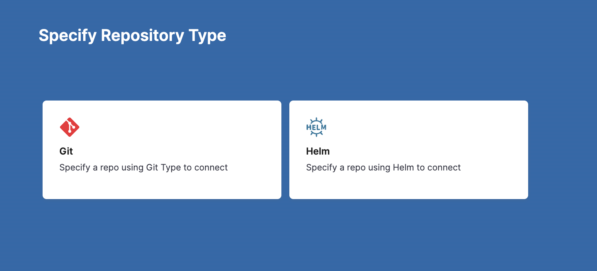
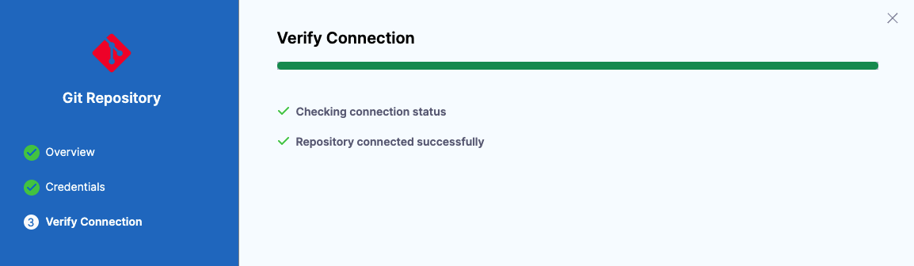
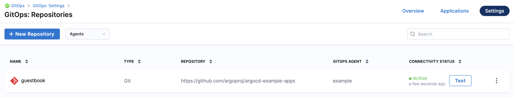

This topic describes how to add a Harness GitOps Repository containing the declarative description of a desired state.

Harness GitOps Repositories are connections to repos containing the declarative description of a desired state. The declarative description can be in Kubernetes manifests, Helm Chart, Kustomize manifests, etc.

A Harness GitOps Repository is used for Harness GitOps only. For other Harness features like CI, CD Pipelines, etc, use a standard [Git Connector](/docs/category/connectors).

## Before you begin

If you are new to Harness GitOps, familiarize yourself with the following topics:

* [Harness GitOps Basics](harness-git-ops-basics.md)
* [Harness CD GitOps Quickstart](harness-cd-git-ops-quickstart.md)
* [Install a Harness GitOps Agent](install-a-harness-git-ops-agent.md)

## Supported platforms

* Currently, only Git platforms and HTTP Helm servers are supported in a GitOps Repository.

## Add a Git repository

In the Repository setup, you will select the [Agent](install-a-harness-git-ops-agent.md) to use when synching state. Be sure you have a GitOps Agent set up already.

See [Install a Harness GitOps Agent](install-a-harness-git-ops-agent.md).

You will also provide the credentials to use when connecting to the Git repository. Ensure you have your credentials available.

If you use a [GitOps Repository Credentials Template](add-harness-git-ops-repository-credentials-template.md) with a GitOps Repository, then the repo path in the GitOps Repository must be a subfolder of the repo path in the Repository Credentials Template.

1. In your Harness Project, click **GitOps**, and then click **Settings**.
2. Click **Repositories**.
3. Click **New Repository**.

   

4. In **Specify Repository Type**, click **Git** or **Helm**.

## Option: Git providers

1. Click **Git**.
2. In **Repository Name**, enter a name.
3. In **GitOps Agent**, select or create the Agent you want to use to fetch manifests from this repo. See [Install a Harness GitOps Agent](install-a-harness-git-ops-agent.md).
4. In **Repository URL**, enter the URL to your repo. For example, `https://github.com/argoproj/argocd-example-apps.git`.
5. Click **Continue**.
6. In **Credentials**, select one of the following:

### Specify credentials for repository

1. In **Credentials**, in **Connection Type**, select **HTTPS**, or **SSH**, or **GitHub App**.
   - If you use Two-Factor Authentication for your Git repo, you connect over **HTTPS** or **SSH**.
   - For **SSH**, ensure that the key is not OpenSSH, but rather PEM format. To generate an SSHv2 key, use: `ssh-keygen -t rsa -m PEM` The `rsa` and `-m PEM` ensure the algorithm and that the key is PEM. Next, follow the prompts to create the PEM key. 
   - For more information, see the [ssh-keygen man page](https://linux.die.net/man/1/ssh-keygen).
   - **HTTP** also has the **Anonymous** option.
   - For steps on setting up the GitHub App, see [Use a GitHub App in a GitHub Connector](../../platform/7_Connectors/git-hub-app-support.md).
2. Click **Save & Continue**. Harness validates the connection.

### Use a Credentials Template

1. Select the GitOps Credentials Template to use.

See [Harness GitOps Repository Credentials Template](add-harness-git-ops-repository-credentials-template.md).

If you use a Repository Credentials Template for GitOps Repository authentication, then the repo path in the GitOps Repository must be a subfolder of the repo path in the Repository Credentials Template.

For example, if you created a Repository Credentials Template for the URL `https://something.com`, GitOps Repositories that have their URL as `https://something.com/*` are able to use that Repository Credentials Template.

Harness will auto-detect the Repository Credentials Template (if any) based on the GitOps Repository **URL** and auto-populate it. If Harness auto-populated the GitOps Repository, then you cannot edit the Repository Credentials Template setting.

### Skip Server Verification

Select this option to have the GitOps Agent skip verification of the URL and credentials.

Verification is only skipped when you create the GitOps Repository. Subsequent uses of the GitOps Repository are verified.

### Enable LFS support

Select the option to use [Git Large File Storage](https://github.com/git-lfs/git-lfs/).

### Proxy

A proxy for your repository can be specified in the Proxy setting.

Harness uses this proxy to access the repository. Harness looks for the standard proxy environment variables in the repository server if the custom proxy is absent.

An example repository with proxy:

```yaml
apiVersion: v1  
kind: Secret  
metadata:  
  name: private-repo  
  namespace: cd  
  labels:  
    argocd.argoproj.io/secret-type: repository  
stringData:  
  type: git  
  url: https://github.com/argoproj/private-repo  
  proxy: https://proxy-server-url:8888  
  password: my-password  
  username: my-username
```

## Option: HTTP Helm Repository

1. Click **Helm**.
2. In **Repository Name**, enter a name.
3. In **GitOps Agent**, select or create the Agent you want to use to fetch charts from this repo. See [Install a Harness GitOps Agent](install-a-harness-git-ops-agent.md).
4. In **Repository URL**, enter the URL to your HTTP Helm Repository. For example, `https://charts.bitnami.com/bitnami`.
5. Click **Continue**.
6. In **Credentials**, select one of the following:

### Specify Credentials for Repository

1. In **Credentials**, in **Connection Type**, select **HTTPS** or **SSH**.
   - If you use Two-Factor Authentication for your Git repo, you connect over **HTTPS** or **SSH**
   - For **SSH**, ensure that the key is not OpenSSH, but rather PEM format. To generate an SSHv2 key, use: `ssh-keygen -t rsa -m PEM`. The `rsa` and `-m PEM` ensure the algorithm and that the key is PEM. Next, follow the prompts to create the PEM key.
   - For more information, see the [ssh-keygen man page](https://linux.die.net/man/1/ssh-keygen).
   - **HTTP** also has the **Anonymous** option.
2. Click **Save & Continue**. Harness validates the connection.

### Use a Credentials Template

1. Select the GitOps Credentials Template to use.

See [Harness GitOps Repository Credentials Template](add-harness-git-ops-repository-credentials-template.md).

If you use a Repository Credentials Template for GitOps Repository authentication, then the repo path in the GitOps Repository must be a subfolder of the repo path in the Repository Credentials Template.

For example, if you created a Repository Credentials Template for the URL `https://something.com`, GitOps Repositories that have their URL as `https://something.com/*` are able to use that Repository Credentials Template.

Harness will auto-detect the Repository Credentials Template (if any) based on the GitOps Repository **URL** and auto-populate it. If Harness auto-populated the GitOps Repository, then you cannot edit the Repository Credentials Template setting.

## Option: Skip Server Verification

Select this option to have the GitOps Agent skip verification of the URL and credentials.

Verification is only skipped when you create the GitOps Repository. Subsequent uses of the GitOps Repository are verified.

### Step 3: Verify Connection

The connection is verified.



If you encounter errors, check that you have the correct repo URL and your authentication method has the required permissions.

1. Click **Finish**. You now have a Harness GitOps Repository added.

