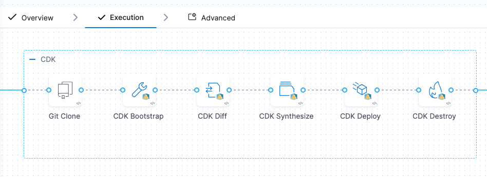
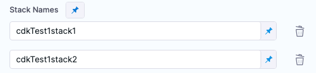
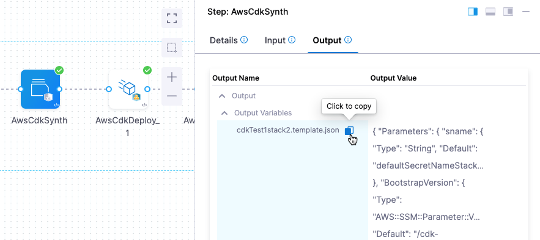
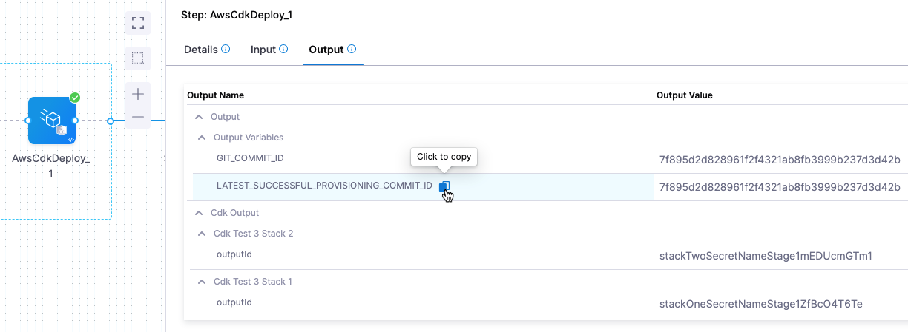

:::note

Currently, AWS CDK support is behind the feature flag `CDS_AWS_CDK`. Contact [Harness Support](mailto:support@harness.io) to enable the feature.

:::

AWS Cloud Development Kit (AWS CDK), is an open-source software development framework that allows developers to provision AWS infrastructure resources using familiar programming languages, such as Go, Python, Java, C#, etc. CDK simplifies infrastructure as code (IaC) by abstracting away many of the low-level details and providing a higher-level, programmatic approach.

This topic provides steps on using Harness to provision a target AWS environment or resources using AWS CDK.

## Important notes

- You can add AWS CDK provisioning steps to Harness Deploy and Custom stage types.
- You can perform ad hoc provisioning or provision the target environment for a deployment as part of the deployment stage.

## AWS permissions required

You connect Harness to your AWS account using a Harness AWS connector.

The AWS permissions required by the AWS account you use in the connector depend on what you are provisioning with CDK.

You should tailor the policy and roles to your specific CDK application's requirements. It's essential to follow the principle of least privilege and only grant the permissions necessary for your CDK application to function correctly and securely. Additionally, consider using AWS Managed Policies whenever possible to avoid creating custom policies with extensive permissions.

## Harness roles permissions required

- **Environments:** `View/Create`, `Edit`, `Access`, `Delete`.


## AWS CDK provisioning summary

Harness provisioning is categorized into the following use cases:

1. **Ad hoc provisioning:** temporary and on-demand provisioning of resources for specific tasks or purposes.
2. **Dynamic infrastructure provisioning:** provision the target deployment environment as part of the same deployment process. Typically, dynamic infrastructure provisioning is for temporary pre-production environments, such as dev, test, and qa. Production environments are usually pre-existing.

:::note

Currently, the dynamic provisioning documented in this topic is behind the feature flag `CD_NG_DYNAMIC_PROVISIONING_ENV_V2`. Contact [Harness Support](mailto:support@harness.io) to enable the feature.

:::

The provisioning pipeline steps are configured the same way for both use cases. These steps are covered later in this topic.

For details on Harness provisioning, go to [Provisioning overview](/docs/continuous-delivery/cd-infrastructure/provisioning-overview).


### Dynamic provisioning steps for different deployment types

:::note

Currently, the dynamic provisioning documented in this topic is behind the feature flag `CD_NG_DYNAMIC_PROVISIONING_ENV_V2`. Contact [Harness Support](mailto:support@harness.io) to enable the feature.

:::

Each of the deployment types Harness supports (Kubernetes, AWS ECS, etc.) require that you map different script outputs to the Harness infrastructure settings in the pipeline stage.

To see how to set up dynamic provisioning for each deployment type, go to the following topics:

- [Kubernetes infrastructure](/docs/continuous-delivery/deploy-srv-diff-platforms/kubernetes/define-your-kubernetes-target-infrastructure)
  - The Kubernetes infrastructure is also used for Helm, Native Helm, and Kustomize deployment types.
- [AWS ECS](/docs/continuous-delivery/deploy-srv-diff-platforms/aws/ecs/ecs-deployment-tutorial)
- [AWS Lambda](/docs/continuous-delivery/deploy-srv-diff-platforms/aws/aws-lambda-deployments)
- [Spot Elastigroup](/docs/continuous-delivery/deploy-srv-diff-platforms/aws/spot-deployment)
- [Serverless.com framework for AWS Lambda](/docs/continuous-delivery/deploy-srv-diff-platforms/serverless-lambda-cd-quickstart)
- [Tanzu Application Services](/docs/continuous-delivery/deploy-srv-diff-platforms/tanzu/tanzu-app-services-quickstart)
- [VM deployments using SSH](/docs/continuous-delivery/deploy-srv-diff-platforms/traditional/ssh-ng)	
- [Windows VM deployments using WinRM](/docs/continuous-delivery/deploy-srv-diff-platforms/traditional/win-rm-tutorial)

#### Dynamic provisioning example

Here's an AWS CDK TypeScript example that provisions the infrastructure for an ECS deployment and includes the required output of AWS region:

```TypeScript
import * as cdk from 'aws-cdk-lib';
import * as ecs from 'aws-cdk-lib/aws-ecs';
import * as ec2 from 'aws-cdk-lib/aws-ec2';
import * as ecs_patterns from 'aws-cdk-lib/aws-ecs-patterns';

class EcsCdkStack extends cdk.Stack {
  constructor(scope: cdk.Construct, id: string, props?: cdk.StackProps) {
    super(scope, id, props);

    // Define a VPC (Virtual Private Cloud)
    const vpc = new ec2.Vpc(this, 'MyVpc', {
      maxAzs: 2, // Specify the number of availability zones
    });

    // Create an ECS cluster
    const cluster = new ecs.Cluster(this, 'MyCluster', {
      vpc,
    });

    // Define an ECS Fargate service using a sample container image
    new ecs_patterns.ApplicationLoadBalancedFargateService(this, 'MyFargateService', {
      cluster,
      memoryLimitMiB: 512,
      cpu: 256,
      taskImageOptions: {
        image: ecs.ContainerImage.fromRegistry('amazon/amazon-ecs-sample'),
      },
    });

    // Define an output for the AWS region
    new cdk.CfnOutput(this, 'RegionOutput', {
      value: cdk.Aws.REGION,
      description: 'AWS region of the stack',
    });

    // Define an output for the ECS cluster name
    new cdk.CfnOutput(this, 'ClusterNameOutput', {
      value: cluster.clusterName,
      description: 'Name of the ECS cluster',
    });
  }
}

const app = new cdk.App();
new EcsCdkStack(app, 'EcsCdkStack');

```

In the Harness Infrastructure Definition, you map outputs to their corresponding settings using expressions in the format `<+provisioner.STACK_NAME.OUTPUT_NAME>`, such as `<+provisioner.EcsCdkStack.RegionOutput>`.

<docimage path={require('./static/0982655fcd2dfeb4043905e6f878f29c6005dd8d9e0d659898055fb2750d214f.png')} width="40%" height="40%" title="Click to view full size image" />  


### No artifact required

You don't need to deploy artifacts via Harness services to use AWS CDK provisioning in a stage.

You can simply set up an AWS CDK provisioner and use it in a stage to provision infrastructure without deploying any artifact.

### Service Instances (SIs) consumption

Harness Service Instances (SIs) aren't consumed and no other licensing is required when a Harness stage uses AWS CDK to provision resources.

When Harness deploys artifacts via Harness services to the provisioned infrastructure in the same stage or pipeline, SI licensing is consumed. 


## AWS CDK step group and step order

AWS CDK steps in Harness stages must be added in a [containerized step group](/docs/continuous-delivery/x-platform-cd-features/cd-steps/containerized-steps/containerized-step-groups). The steps cannot be selected outside of a containerized step group.

The step group contains the Harness connector to a Kubernetes cluster and namespace hosted in your environment. When the pipeline is run, the step group creates a container inside the cluster. Inside the container, a pod is created for each step in the step group using the image you provide in the step. The steps share a common disk space and can reference the same paths.

When you select AWS CDK as the provisioner on the CD stage **Environment** tab, Harness automatically generates a containerized [step group](/docs/continuous-delivery/x-platform-cd-features/cd-steps/step-groups) containing the steps needed for the AWS CDK.

If you add AWS CDK steps to a stage's **Execution** tab, you must add the containerized step group yourself. 

### AWS CDK step group settings

For AWS CDK, the step group setting **Enable container based execution** must be enabled. This setting configures the step group as containerized. 

:::tip Info

For more information on containerized step groups, go to [Containerize step groups](/docs/continuous-delivery/x-platform-cd-features/cd-steps/containerized-steps/containerized-step-groups).

:::

In the step group, you need to configure the following mandatory settings:

- **Kubernetes Cluster:** Add a [Harness Kubernetes Cluster connector](/docs/platform/connectors/cloud-providers/ref-cloud-providers/kubernetes-cluster-connector-settings-reference) to connect to the cluster that will be used as the runtime step infrastructure.
- **Namespace:** Enter the name of the cluster namespace to use.


### Step order

The AWS CDK steps in Harness are similar to the AWS CDK toolkit `cdk` commands. For information on the `cdk` commands, go to [AWS CDK Toolkit (cdk command)](https://docs.aws.amazon.com/cdk/v2/guide/cli.html) from AWS.

The AWS CDK steps in your stage **Environment** or **Execution** typically follow the logical order of the CDK commands:

  

Inside the step group, the following AWS CDK steps are used:

1. **Git Clone step:** Clones the CDK app repository into the CD stage's workspace. 
  
  By cloning the repository, you gain access to the necessary code, scripts, or configurations, enabling you to perform various actions and ensure a reliable and controlled deployment.
  
  The Git Clone step use case for CDK is described later in this document, but for more general information, go to [Git Clone step](/docs/continuous-delivery/x-platform-cd-features/cd-steps/containerized-steps/git-clone-step).
1. **AWS CDK Bootstrap step (optional):** Runs the `cdk bootstrap` command.

  This step sets up the necessary AWS resources and environment required for deploying CDK applications in a specific AWS region and AWS account. This command is typically run once per AWS account and region to prepare the environment for CDK deployments. 

  If the step group container already has the necessary AWS resources and environment required for deploying CDK applications, you can omit this step.
2. **AWS CDK Diff step:** Runs the `cdk diff` command.

  Compares the specified stack and its dependencies with the deployed stacks.
1. **AWS CDK Synth step:** Runs the `cdk synthesize` command.

  Synthesizes and prints the CloudFormation template for one or more stacks specified in the step.
2. **AWS CDK Deploy step:** Runs the `cdk deploy` command.

  Deploys the infrastructure defined in your CDK application to your AWS account. 
3. **AWS CDK Destroy step  (optional):** Runs the `cdk destroy` command.

  Deletes the AWS CloudFormation stacks that were previously created by a CDK application.
4. **AWS CDK rollback steps:**
   1. **Git Clone rollback step:** Typically, this step restores the Git branch/tag/commit of repo used in the last successful deployment. You can also choose to clone and branch/tag/commit as part of rollback.
   2. **AWS CDK Rollback step:** Rolls back the provisioned resources deployed by the failed **CDK Deploy** step to the state of the resources of the last successful deployment.

These steps are described in detail below.

## Docker image registry connector and image for all steps

The CDK steps in the step group are containerized. In the **Container Registry** and **Image** settings in each step, you must provide a Harness connector to a container registry and an image for the pod the step uses.

Harness provides the `aws-cdk-plugin` base image and custom images for different stacks (Java, .NET, Python, Go, etc.) They are located on the Docker Hub registry [aws-cdk-plugin](https://hub.docker.com/r/harness/aws-cdk-plugin/tags). For example, `harness/aws-cdk-plugin:1.0.0` is the base image that contains the CDK CLI and Node.js and `harness/aws-cdk-plugin:1.0.0-java` is the base image for Java.

You can use a Harness base image to create your own image and use that in a step. For example, if your CDK app uses a specific Java or Node.js version, you can use the base image provided by Harness and create your own image containing your dependencies.

The image you use should support the CDK operations you are running in your app.

## Git Clone step

The Git Clone step is the first stage **Execution** step added to the containerized step group for Harness CDK.

  


The Git Clone step clones the CDK repo containing your CDK app and adds it to a shared space in the container that can be used by all subsequent steps.

:::note

You can omit the Git Clone step if you have added the app files to the shared space on the container using some other means, such as a script in a Shell Script step.

:::

During rollback, the Git Clone rollback step deletes the Git branch/tag/commit that you used in the Git Clone step.

The Git Clone step is documented in detail in [Git Clone step](/docs/continuous-delivery/x-platform-cd-features/cd-steps/containerized-steps/git-clone-step), but let's review how the key settings for CDK.

- **Connector:** Select or add a Harness Git connector for the source control provider hosting the CDK app code repository that you want to use.
- **Repository name:** If the connector's [URL Type](/docs/platform/connectors/code-repositories/ref-source-repo-provider/git-connector-settings-reference#url-type) is **Repository**, then **Repository Name** is automatically populated based on the repository defined in the connector's configuration. If the connector's **URL Type** is **Account**, then you must specify the name of the code repository that you want to clone into the stage workspace.
- **Build type:** Select **Git Branch** if you want the step to clone code from a specific branch within the repository, or select **Git Tag** or **Commit SHA** if you want the step to clone code from a specific commit. Based on your selection, specify a **Branch Name**, **Tag Name**, **Commit SHA**.

  :::tip

  You can use [fixed values, runtime input, or variable expressions](/docs/platform/variables-and-expressions/runtime-inputs) for the branch and tag names. For example, you can enter `<+input>` for the branch or tag name to supply a branch or tag name at runtime.

  :::
- **Clone directory:** An optional target path in the stage workspace where you want to clone the repo.
- **Depth:** The number of commits to fetch when the step clones the repo. The default depth is 0, which fetches all commits from the relevant branch. For more information, go to the [git clone documentation](https://git-scm.com/docs/git-clone).
- **SSL Verify:** If you set this to **True**, which is the default value, the pipeline verifies your Git SSL certificates. The stage fails if the certificate check fails. Set this to **False** only if you have a known issue with the certificate and you are willing to run your stages anyway.

For the remaining settings, see [Step settings common to multiple steps](/docs/continuous-delivery/cd-infrastructure/aws-cdk#step-settings-common-to-multiple-steps) below.

<details>
<summary>Git Clone step log example</summary>

Here's a step log example that shows the tasks the step performs.

```
[DEBUG] setting default home directory
+ git init
hint: Using 'master' as the name for the initial branch. This default branch name
hint: is subject to change. To configure the initial branch name to use in all
hint: of your new repositories, which will suppress this warning, call:
hint: 
hint: 	git config --global init.defaultBranch <name>
hint: 
hint: Names commonly chosen instead of 'master' are 'main', 'trunk' and
hint: 'development'. The just-created branch can be renamed via this command:
hint: 
hint: 	git branch -m <name>
Initialized empty Git repository in /harness/hello-cdk/.git/
+ git remote add origin https://github.com/wings-software/hello-cdk.git
+ set +x
+ git fetch --depth=50 origin +refs/heads/main:
From https://github.com/wings-software/hello-cdk
 * branch            main       -> FETCH_HEAD
 * [new branch]      main       -> origin/main
+ git checkout -b main origin/main
Switched to a new branch 'main'
Branch 'main' set up to track remote branch 'main' from 'origin'.
+ exit 0
```

</details>


## AWS CDK Bootstrap step

Runs the `cdk bootstrap` command. For details on bootstrapping, go to [Bootstrapping your AWS environment](https://docs.aws.amazon.com/cdk/v2/guide/cli.html#cli-bootstrap) from AWS.

This step sets up the necessary AWS resources and environment required for deploying CDK applications in a specific AWS region and AWS account. This command is typically run once per AWS account and region to prepare the environment for CDK deployments. 

If the step group container already has the necessary AWS resources and environment required for deploying CDK applications, you can omit this step.

Step settings:

- **Container registry:** A Harness Docker registry connector for the registry hosting the image that you want Harness to run commands on, such as Docker Hub.
- **Image:** The image to use for this step. For example, `harness/aws-cdk-plugin:1.0.0-java`.
- **App Path:** The path to the CDK app fetched with the Git Clone step. The Git Clone step listed the app repository in its **Repository Name** setting. **App Path** must include the path to the app folder in that directory.
- **AWS CDK Bootstrap Command Options:** You can add any CDK parameters you can see in the `cdk bootstrap --help` command, just like you would in the `cdk` command-line tool. For example, `-c stack1_name=cdkTest1stack1`. For more information, go to [Parameters](https://docs.aws.amazon.com/cdk/v2/guide/parameters.html) from AWS.

For the remaining settings, see [Step settings common to multiple steps](/docs/continuous-delivery/cd-infrastructure/aws-cdk#step-settings-common-to-multiple-steps) below.


## AWS CDK Diff step

Runs the `cdk diff` command to compare the specified stack and its dependencies with the deployed stacks.

Step settings:

- **Container registry:** A Harness Docker registry connector for the registry hosting the image that you want Harness to run commands on, such as Docker Hub.
- **Image:** The image to use for this step. For example, `harness/aws-cdk-plugin:1.0`.0-java.
- **App Path:** The path to the CDK app fetched with the Git Clone step. The Git Clone step listed the app repository in its **Repository Name** setting. App Path must include the path to the app folder in that directory.
- **AWS CDK Diff Command Options:** You can add any CDK parameters you can see in the `cdk diff --help` command, just like you would in the `cdk` command-line tool. For example, `-c stack1_name=cdkTest1stack1`. For more information, go to [Parameters](https://docs.aws.amazon.com/cdk/v2/guide/parameters.html) from AWS.
- **Stack Names:** If you are using a multi-stack app, enter the names of each stack here. For example, if your stack names are `cdkTest1Stack1` and `cdkTest1Stack2`, you would select **Add** and enter two stack names, one for each stack.

    
  
  If you omit a stack name, it can cause a step failure. If your app uses only one stack, you do not need to enter its name.

For the remaining settings, see [Step settings common to multiple steps](/docs/continuous-delivery/cd-infrastructure/aws-cdk#step-settings-common-to-multiple-steps) below.


<details>
<summary>CDK Diff step log example</summary>

Here's a step log example that shows the tasks the step performs. You can see multiple stacks (`cdkTest1stack1`, `cdkTest1stack2`) in the log.

```
/usr/local/bin/cdk --version
2.90.0 (build 8c535e4)
Working directory: /harness
CDK app path:  hello-cdk
/usr/local/bin/cdk diff cdkTest1stack1 cdkTest1stack2 -c stack1_name=cdkTest1stack1 -c stack2_name=cdkTest1stack2
Stack cdkTest1stack1
Parameters
[+] Parameter sname sname: {"Type":"String","Default":"defaultSecretNameStack1"}
[+] Parameter BootstrapVersion BootstrapVersion: {"Type":"AWS::SSM::Parameter::Value<String>","Default":"/cdk-bootstrap/hnb659fds/version","Description":"Version of the CDK Bootstrap resources in this environment, automatically retrieved from SSM Parameter Store. [cdk:skip]"}

Conditions
[+] Condition CDKMetadata/Condition CDKMetadataAvailable: {"Fn::Or":[{"Fn::Or":[{"Fn::Equals":[{"Ref":"AWS::Region"},"af-south-1"]},{"Fn::Equals":[{"Ref":"AWS::Region"},"ap-east-1"]},{"Fn::Equals":[{"Ref":"AWS::Region"},"ap-northeast-1"]},{"Fn::Equals":[{"Ref":"AWS::Region"},"ap-northeast-2"]},{"Fn::Equals":[{"Ref":"AWS::Region"},"ap-south-1"]},{"Fn::Equals":[{"Ref":"AWS::Region"},"ap-southeast-1"]},{"Fn::Equals":[{"Ref":"AWS::Region"},"ap-southeast-2"]},{"Fn::Equals":[{"Ref":"AWS::Region"},"ca-central-1"]},{"Fn::Equals":[{"Ref":"AWS::Region"},"cn-north-1"]},{"Fn::Equals":[{"Ref":"AWS::Region"},"cn-northwest-1"]}]},{"Fn::Or":[{"Fn::Equals":[{"Ref":"AWS::Region"},"eu-central-1"]},{"Fn::Equals":[{"Ref":"AWS::Region"},"eu-north-1"]},{"Fn::Equals":[{"Ref":"AWS::Region"},"eu-south-1"]},{"Fn::Equals":[{"Ref":"AWS::Region"},"eu-west-1"]},{"Fn::Equals":[{"Ref":"AWS::Region"},"eu-west-2"]},{"Fn::Equals":[{"Ref":"AWS::Region"},"eu-west-3"]},{"Fn::Equals":[{"Ref":"AWS::Region"},"me-south-1"]},{"Fn::Equals":[{"Ref":"AWS::Region"},"sa-east-1"]},{"Fn::Equals":[{"Ref":"AWS::Region"},"us-east-1"]},{"Fn::Equals":[{"Ref":"AWS::Region"},"us-east-2"]}]},{"Fn::Or":[{"Fn::Equals":[{"Ref":"AWS::Region"},"us-west-1"]},{"Fn::Equals":[{"Ref":"AWS::Region"},"us-west-2"]}]}]}

Resources
[+] AWS::SecretsManager::Secret stack1secretId stack1secretId52B866E2 

Outputs
[+] Output outputId outputId: {"Value":{"Ref":"sname"},"Export":{"Name":"cdkTest1stack1-outputExportName"}}

Other Changes
[+] Unknown Rules: {"CheckBootstrapVersion":{"Assertions":[{"Assert":{"Fn::Not":[{"Fn::Contains":[["1","2","3","4","5"],{"Ref":"BootstrapVersion"}]}]},"AssertDescription":"CDK bootstrap stack version 6 required. Please run 'cdk bootstrap' with a recent version of the CDK CLI."}]}}

Stack cdkTest1stack2
Parameters
[+] Parameter sname sname: {"Type":"String","Default":"defaultSecretNameStack2"}
[+] Parameter BootstrapVersion BootstrapVersion: {"Type":"AWS::SSM::Parameter::Value<String>","Default":"/cdk-bootstrap/hnb659fds/version","Description":"Version of the CDK Bootstrap resources in this environment, automatically retrieved from SSM Parameter Store. [cdk:skip]"}

Conditions
[+] Condition CDKMetadata/Condition CDKMetadataAvailable: {"Fn::Or":[{"Fn::Or":[{"Fn::Equals":[{"Ref":"AWS::Region"},"af-south-1"]},{"Fn::Equals":[{"Ref":"AWS::Region"},"ap-east-1"]},{"Fn::Equals":[{"Ref":"AWS::Region"},"ap-northeast-1"]},{"Fn::Equals":[{"Ref":"AWS::Region"},"ap-northeast-2"]},{"Fn::Equals":[{"Ref":"AWS::Region"},"ap-south-1"]},{"Fn::Equals":[{"Ref":"AWS::Region"},"ap-southeast-1"]},{"Fn::Equals":[{"Ref":"AWS::Region"},"ap-southeast-2"]},{"Fn::Equals":[{"Ref":"AWS::Region"},"ca-central-1"]},{"Fn::Equals":[{"Ref":"AWS::Region"},"cn-north-1"]},{"Fn::Equals":[{"Ref":"AWS::Region"},"cn-northwest-1"]}]},{"Fn::Or":[{"Fn::Equals":[{"Ref":"AWS::Region"},"eu-central-1"]},{"Fn::Equals":[{"Ref":"AWS::Region"},"eu-north-1"]},{"Fn::Equals":[{"Ref":"AWS::Region"},"eu-south-1"]},{"Fn::Equals":[{"Ref":"AWS::Region"},"eu-west-1"]},{"Fn::Equals":[{"Ref":"AWS::Region"},"eu-west-2"]},{"Fn::Equals":[{"Ref":"AWS::Region"},"eu-west-3"]},{"Fn::Equals":[{"Ref":"AWS::Region"},"me-south-1"]},{"Fn::Equals":[{"Ref":"AWS::Region"},"sa-east-1"]},{"Fn::Equals":[{"Ref":"AWS::Region"},"us-east-1"]},{"Fn::Equals":[{"Ref":"AWS::Region"},"us-east-2"]}]},{"Fn::Or":[{"Fn::Equals":[{"Ref":"AWS::Region"},"us-west-1"]},{"Fn::Equals":[{"Ref":"AWS::Region"},"us-west-2"]}]}]}

Resources
[+] AWS::SecretsManager::Secret stack2secretId stack2secretId28EE5117 

Outputs
[+] Output outputId outputId: {"Value":{"Ref":"sname"},"Export":{"Name":"cdkTest1stack2-outputExportName"}}

Other Changes
[+] Unknown Rules: {"CheckBootstrapVersion":{"Assertions":[{"Assert":{"Fn::Not":[{"Fn::Contains":[["1","2","3","4","5"],{"Ref":"BootstrapVersion"}]}]},"AssertDescription":"CDK bootstrap stack version 6 required. Please run 'cdk bootstrap' with a recent version of the CDK CLI."}]}}


Number of stacks with differences: 12
```

</details>

## AWS CDK Synth step

Runs the `cdk synthesize` command. Synthesizes and prints the CloudFormation template for one or more stacks specified in the step. In the log for the executed step you will see the JSON file exported, for example, `Exporting template file:  hello-cdk/cdk.out/cdkTest1stack1.template.json`.

Step settings:

- **Container registry:** A Harness Docker registry connector for the registry hosting the image that you want Harness to run commands on, such as Docker Hub.
- **Image:** The image to use for this step. For example, `harness/aws-cdk-plugin:1.0`.0-java.
- **App Path:** The path to the CDK app fetched with the Git Clone step. The Git Clone step listed the app repository in its **Repository Name** setting. App Path must include the path to the app folder in that directory.
- **AWS CDK Synth Command Options:** You can add any CDK parameters you can see in the `cdk synthesize --help` command, just like you would in the `cdk` command-line tool. For example, `-c stack1_name=cdkTest1stack1`. For more information, go to [Parameters](https://docs.aws.amazon.com/cdk/v2/guide/parameters.html) from AWS.
- **Stack Names:** If you are using a multi-stack app, enter the names of each stack here. For example, if your stack names are `cdkTest1Stack1` and `cdkTest1Stack2`, you would select **Add** and enter two stack names, one for each stack.
- **Export Template:** Exports the JSON template(s) for the stacks entered in **Stack Names**. If no stacks are listed in Stack Names, and **Export Template** is enabled, Harness export templates for all stacks in the app.

For the remaining settings, see [Step settings common to multiple steps](/docs/continuous-delivery/cd-infrastructure/aws-cdk#step-settings-common-to-multiple-steps) below.


<details>
<summary>CDK Synth step log example</summary>

Here's a step log example that shows the tasks the step performs.

```

/usr/local/bin/cdk --version
2.90.0 (build 8c535e4)
Working directory: /harness
CDK app path:  hello-cdk
/usr/local/bin/cdk synth cdkTest1stack1 cdkTest1stack2 -c stack1_name=cdkTest1stack1 -c stack2_name=cdkTest1stack2
Successfully synthesized to /harness/hello-cdk/cdk.out
Supply a stack id (cdkTest1stack1, cdkTest1stack2) to display its template.

Exporting synth templates.
Exporting template file:  hello-cdk/cdk.out/cdkTest1stack1.template.json
Exporting template file:  hello-cdk/cdk.out/cdkTest1stack2.template.json
Adding to output: cdkTest1stack1.template.json
Adding to output: cdkTest1stack2.template.json
```
</details>

### Export and reference JSON templates

If the **Export Template** option is selected, the JSON templates for the stacks in the app are exported to the shared folder on the container.

You can reference the JSON template after the step has run using an expression in this format: 

```
<+pipeline.stages.STAGE_ID.spec.execution.steps.STEP_GROUP_ID.steps.STEP_ID.output.outputVariables.get("STACK_NAME.template.json")>
```

For example:

```
<+pipeline.stages.test.spec.execution.steps.test.steps.AwsCdkSynth.output.outputVariables.get("cdkTest1stack2.template.json")>
```

You can obtain the expression by copying it from the executed step **Outputs**.

  

#### Using the template expression in a script

You can use the expression in a Shell Script step to output the JSON template.

Do not echo the expression. The template is multiline json and contains special characters and this can cause issues with echo.

You can assign the value to a variable like this:

<details>
<summary>Using cat with the JSON template expression</summary>


stackOnetemplate=$(cat <<-END
"<+pipeline.stages.test.spec.execution.steps.test.steps.AwsCdkSynth.output.outputVariables.cdkTest1stack1>"
END
)


</details>


## AWS CDK Deploy step

Runs the `cdk deploy` command to deploy the infrastructure defined in your CDK application to your AWS account.

The CDK Deploy step includes a **Provisioner Identifier** setting to track the provisioning it performs. 

The **Provisioner Identifier** is used by the AWS CDK Rollback step to ensure that rollback is performed on the same infrastructure provisioned in the CDK Deploy step.

Harness determines what to roll back using a combination of **Provisioner Identifier** + Harness account id + Harness org id + Harness project id.

If you've made these settings expressions, Harness uses the values it obtains at runtime when it evaluates the expression.

Step settings:

- **Container registry:** A Harness Docker registry connector for the registry hosting the image that you want Harness to run commands on, such as Docker Hub.
- **Image:** The image to use for this step. For example, `harness/aws-cdk-plugin:1.0`.0-java.
- **Provisioner Identifier:** Enter a unique Id to identify the provisioning performed by this step.

  The **Provisioner Identifier** is a project-wide setting. You can reference it across pipelines in the same project.

  For this reason, it's important that all your project members know the provisioner identifiers. This will prevent one member building a pipeline from accidentally impacting the provisioning of another member's pipeline.
- **App Path:** The path to the CDK app fetched with the Git Clone step. The Git Clone step listed the app repository in its **Repository Name** setting. App Path must include the path to the app folder in that directory.
- **AWS CDK Deploy Command Options:** You can add any CDK parameters you can see in the `cdk deploy --help` command, just like you would in the `cdk` command-line tool. For example, `-c stack1_name=cdkTest1stack1`. For more information, go to [Parameters](https://docs.aws.amazon.com/cdk/v2/guide/parameters.html) from AWS.

  The `--all` command can be used to deploy all stacks in the app without having to name them in the **Stack Names** setting.
- **Stack Names:** If you are using a multi-stack app, enter the names of each stack here. For example, if your stack names are `cdkTest1Stack1` and `cdkTest1Stack2`, you would select **Add** and enter two stack names, one for each stack.

    
  
  If you omit a stack name, it can cause a step failure. If your app uses only one stack, you do not need to enter its name.
- **Parameters:** This setting is the same as the `--parameters` option for `cdk deploy` (for example, `cdk deploy MyStack --parameters uploadBucketName=UploadBucket`). 
  
  For more information, go to [Specifying AWS CloudFormation parameters](https://docs.aws.amazon.com/cdk/v2/guide/cli.html#cli-deploy) from AWS.
  
  Add any additional parameters to pass to CloudFormation at deploy time by adding the keys and values in **Parameters**.

  If the CDK app had a single stack, then you can enter the parameter name in **Key** and value in **Value**.

  If the CDK app has multiple stacks, then include the stack name as a prefix to the parameter in **Key** using a colon, in the format `STACK:KEY` (this is similar to the `STACK:KEY=VALUE` format in `cdk deploy --parameters`). For example, `mystack1:uploadBucketName`.

  In the log for the Harness CDK Deploy step, you will see the parameters added to the command, like this:

  ```
  /usr/local/bin/cdk deploy cdkTest3stack1 cdkTest3stack2 --parameters cdkTest3stack1:sname=stackOneSecretNameStage1ZfBcO4T6Te --parameters cdkTest3stack2:sname=stackTwoSecretNameStage1mEDUcmGTm1 -c stack1_name=cdkTest3stack1 -c stack2_name=cdkTest3stack2 --outputs-file cdk-outputs.json 
  ```

For the remaining settings, see [Step settings common to multiple steps](/docs/continuous-delivery/cd-infrastructure/aws-cdk#step-settings-common-to-multiple-steps) below.


<details>
<summary>CDK Deploy step log example</summary>

Here's a step log example that shows the tasks the step performs.

```
/usr/local/bin/cdk --version
2.90.0 (build 8c535e4)
Working directory: /harness
CDK app path:  hello-cdk
/usr/local/bin/cdk deploy cdkTest1stack1 cdkTest1stack2 --parameters cdkTest1stack1:sname=stackOneSecretNameAhOqGfAp09 --parameters cdkTest1stack2:sname=stackTwoSecretNametrGWY0Rh6J -c stack1_name=cdkTest1stack1 -c stack2_name=cdkTest1stack2 --outputs-file cdk-outputs.json

✨  Synthesis time: 46.37s

cdkTest1stack1
cdkTest1stack1: deploying... [1/2]
cdkTest1stack1: creating CloudFormation changeset...
cdkTest1stack1 | 0/3 | 12:44:24 PM | REVIEW_IN_PROGRESS   | AWS::CloudFormation::Stack  | cdkTest1stack1 User Initiated
cdkTest1stack1 | 0/3 | 12:44:30 PM | CREATE_IN_PROGRESS   | AWS::CloudFormation::Stack  | cdkTest1stack1 User Initiated
cdkTest1stack1 | 0/3 | 12:44:32 PM | CREATE_IN_PROGRESS   | AWS::SecretsManager::Secret | stack1secretId (stack1secretId52B866E2) 
cdkTest1stack1 | 0/3 | 12:44:32 PM | CREATE_IN_PROGRESS   | AWS::CDK::Metadata          | CDKMetadata/Default (CDKMetadata) 
cdkTest1stack1 | 0/3 | 12:44:34 PM | CREATE_IN_PROGRESS   | AWS::SecretsManager::Secret | stack1secretId (stack1secretId52B866E2) Resource creation Initiated
cdkTest1stack1 | 0/3 | 12:44:34 PM | CREATE_IN_PROGRESS   | AWS::CDK::Metadata          | CDKMetadata/Default (CDKMetadata) Resource creation Initiated
cdkTest1stack1 | 1/3 | 12:44:34 PM | CREATE_COMPLETE      | AWS::CDK::Metadata          | CDKMetadata/Default (CDKMetadata) 
cdkTest1stack1 | 2/3 | 12:44:34 PM | CREATE_COMPLETE      | AWS::SecretsManager::Secret | stack1secretId (stack1secretId52B866E2) 
cdkTest1stack1 | 3/3 | 12:44:35 PM | CREATE_COMPLETE      | AWS::CloudFormation::Stack  | cdkTest1stack1 

 ✅  cdkTest1stack1

✨  Deployment time: 12.53s

Outputs:
cdkTest1stack1.outputId = stackOneSecretNameAhOqGfAp09
Stack ARN:
arn:aws:cloudformation:us-east-2:1234567890:stack/cdkTest1stack1/950b6ea0-61ea-11ee-b4ad-06fb408549b7

✨  Total time: 58.9s

cdkTest1stack2
cdkTest1stack2: deploying... [2/2]
cdkTest1stack2: creating CloudFormation changeset...
cdkTest1stack2 | 0/3 | 12:44:37 PM | REVIEW_IN_PROGRESS   | AWS::CloudFormation::Stack  | cdkTest1stack2 User Initiated
cdkTest1stack2 | 0/3 | 12:44:42 PM | CREATE_IN_PROGRESS   | AWS::CloudFormation::Stack  | cdkTest1stack2 User Initiated
cdkTest1stack2 | 0/3 | 12:44:45 PM | CREATE_IN_PROGRESS   | AWS::CDK::Metadata          | CDKMetadata/Default (CDKMetadata) 
cdkTest1stack2 | 0/3 | 12:44:45 PM | CREATE_IN_PROGRESS   | AWS::SecretsManager::Secret | stack2secretId (stack2secretId28EE5117) 
cdkTest1stack2 | 0/3 | 12:44:46 PM | CREATE_IN_PROGRESS   | AWS::CDK::Metadata          | CDKMetadata/Default (CDKMetadata) Resource creation Initiated
cdkTest1stack2 | 1/3 | 12:44:46 PM | CREATE_COMPLETE      | AWS::CDK::Metadata          | CDKMetadata/Default (CDKMetadata) 
cdkTest1stack2 | 1/3 | 12:44:46 PM | CREATE_IN_PROGRESS   | AWS::SecretsManager::Secret | stack2secretId (stack2secretId28EE5117) Resource creation Initiated
cdkTest1stack2 | 2/3 | 12:44:46 PM | CREATE_COMPLETE      | AWS::SecretsManager::Secret | stack2secretId (stack2secretId28EE5117) 
cdkTest1stack2 | 3/3 | 12:44:47 PM | CREATE_COMPLETE      | AWS::CloudFormation::Stack  | cdkTest1stack2 

```

</details>

### Output variable expressions

After pipeline execution, the CDK Deploy step **Output** tab displays several output variables.

  


#### GIT_COMMIT_ID and LATEST_SUCCESSFUL_PROVISIONING_COMMIT_ID

This is the Git commit Id of the CDK app that was deployed.

You can reference this value using the expression:

```
<+pipeline.stages.STAGE_ID.spec.provisioner.steps.STEP_GROUP_ID.steps.STEP_ID.output.outputVariables.LATEST_SUCCESSFUL_PROVISIONING_COMMIT_ID>
```

For example:

```
<+pipeline.stages.s1.spec.provisioner.steps.test.steps.AwsCdkDeploy_1.output.outputVariables.LATEST_SUCCESSFUL_PROVISIONING_COMMIT_ID>
```

#### Stack(s) outputId

A CDK app stack output is a value or set of values that are exposed by an AWS CloudFormation stack created and managed by your CDK application. These outputs provide a way for other resources or applications to access and use information produced or computed by the CDK stack during its deployment.

For example, `BucketNameOutput` is the output that provides the AWS S3 bucket name used by the stack:


```
new cdk.CfnOutput(this, 'BucketNameOutput', {
  value: bucket.bucketName,
  description: 'Name of the S3 bucket',
});

```

Each CDK app stack output Id is listed in the CDK Deploy step **Output** tab.

You can reference this value using the expression:

```
<+pipeline.stages.STAGE_ID.spec.provisioner.steps.STEP_GROUP_ID.steps.STEP_ID.cdkOutput.STACK_NAME.outputId>
```

For example:

```
<+pipeline.stages.s1.spec.provisioner.steps.test.steps.AwsCdkDeploy_1.cdkOutput.cdkTest3stack2.outputId>
```


## AWS CDK Destroy step

Runs the `cdk destroy` command to destroy one or more specified stacks.

You can use this step to destroy ephemeral infrastructure provisioned by the AWS CDK Deploy step, or an stack in the CDK app in the container.

Step settings:

- **Container registry:** A Harness Docker registry connector for the registry hosting the image that you want Harness to run commands on, such as Docker Hub.
- **Image:** The image to use for this step. For example, `harness/aws-cdk-plugin:1.0`.0-java.
- **App Path:** The path to the CDK app fetched with the Git Clone step. The Git Clone step listed the app repository in its **Repository Name** setting. App Path must include the path to the app folder in that directory.
- **AWS CDK Destroy Command Options:** You can add any CDK parameters you can see in the `cdk destroy --help` command, just like you would in the `cdk` command-line tool. 
- **Stack Names:** If you are using a multi-stack app, enter the names of each stack you want to destroy here. For example, if your stack names are `cdkTest1Stack1` and `cdkTest1Stack2`, you would select **Add** and enter two stack names, one for each stack.

For the remaining settings, see [Step settings common to multiple steps](/docs/continuous-delivery/cd-infrastructure/aws-cdk#step-settings-common-to-multiple-steps) below.


<details>
<summary>CDK Destroy step log example</summary>

Here's a step log example that shows the tasks the step performs.

```
/usr/local/bin/cdk --version
2.90.0 (build 8c535e4)
Working directory: /harness
CDK app path:  hello-cdk
/usr/local/bin/cdk destroy cdkTest1stack1 cdkTest1stack2 -c stack1_name=cdkTest1stack1 -c stack2_name=cdkTest1stack2
Are you sure you want to delete: cdkTest1stack2, cdkTest1stack1 (y/n)? cdkTest1stack2: destroying... [1/2]
cdkTest1stack2 |   0 | 12:45:42 PM | DELETE_IN_PROGRESS   | AWS::CloudFormation::Stack  | cdkTest1stack2 User Initiated
cdkTest1stack2 |   0 | 12:45:44 PM | DELETE_IN_PROGRESS   | AWS::SecretsManager::Secret | stack2secretId (stack2secretId28EE5117) 
cdkTest1stack2 |   0 | 12:45:44 PM | DELETE_IN_PROGRESS   | AWS::CDK::Metadata          | CDKMetadata/Default (CDKMetadata) 
cdkTest1stack2 |   1 | 12:45:45 PM | DELETE_COMPLETE      | AWS::CDK::Metadata          | CDKMetadata/Default (CDKMetadata) 

 ✅  cdkTest1stack2: destroyed
cdkTest1stack1: destroying... [2/2]
cdkTest1stack1 |   0 | 12:45:54 PM | DELETE_IN_PROGRESS   | AWS::CloudFormation::Stack  | cdkTest1stack1 User Initiated
cdkTest1stack1 |   0 | 12:45:55 PM | DELETE_IN_PROGRESS   | AWS::SecretsManager::Secret | stack1secretId (stack1secretId52B866E2) 
cdkTest1stack1 |   0 | 12:45:55 PM | DELETE_IN_PROGRESS   | AWS::CDK::Metadata          | CDKMetadata/Default (CDKMetadata) 
cdkTest1stack1 |   1 | 12:45:56 PM | DELETE_COMPLETE      | AWS::CDK::Metadata          | CDKMetadata/Default (CDKMetadata) 

 ✅  cdkTest1stack1: destroyed
```

</details>

## AWS CDK rollback steps

Typically, the CDK rollback steps roll back the cloned repo of the CDK app to the last successful commit with a Git Clone step and then remove the infrastructure provisioned by the CDK Deploy step using a CDK Rollback step.

The CDK rollback steps are located in the **Rollback** section of the **Environment** or **Execution** sections where you added your CDK steps. 

:::note Tip

If you are using rollback steps in a Custom stage **Execution**, there is no **Rollback** section. You can add the rollback steps as the last steps and use the step's **Conditional Execution** settings. For example, select the **Execute this step only if prior step failed** setting and add the expression `<+pipeline.stages.STAGE_ID.spec.execution.steps.STEP_GROUP_ID.steps.STEP_ID.status> != "SUCCEEDED"` in the step's **And execute this step only if the following JEXL Condition evaluates to true** setting.

:::

### Rollback step group

AWS CDK rollback steps in Harness stages must be added in a [containerized step group](/docs/continuous-delivery/x-platform-cd-features/cd-steps/containerized-steps/containerized-step-groups). The steps cannot be selected outside of a containerized step group.

The step group contains the Harness connector to a Kubernetes cluster and namespace hosted in your environment. When the pipeline is run, the step group creates a container inside the cluster. Inside the container, a pod is created for each step in the step group using the image you provide in the step. The steps share a common disk space and can reference the same paths.

When you select AWS CDK as the provisioner on the CD stage **Environment** tab, Harness automatically generates a containerized [step group](/docs/continuous-delivery/x-platform-cd-features/cd-steps/step-groups) in **Rollback** containing the steps needed for the AWS CDK.

### Git Clone rollback step

The Git Clone rollback step is simply a Git Clone step used to roll back the Git repo in the container to the branch, tag, or commit SHA that you want to restore in the case of deployment failure.

Typically, the Git Clone rollback step is used to roll back the app source repo in the container to the last successful commit. You can also add Harness steps to manipulate the repo, such as Shell Script step.

When the CDK Deploy step runs, it outputs the Git commit Id of the CDK app repo commit it used. You can see this in the **Output** of the CDK Deploy step and reference it using the expression in the format `<+pipeline.stages.STAGE_ID.spec.provisioner.steps.STEP_GROUP_ID.steps.STEP_ID.output.outputVariables.LATEST_SUCCESSFUL_PROVISIONING_COMMIT_ID>`.

To ensure that the Git Clone step rolls back to the last successful commit, configure the step as follows:

- **Connector:** Select or add a Harness Git connector for the source control provider hosting the CDK app code repository that you want to use.
- **Repository Name:**  If the connector's **URL Type** is **Repository**, then **Repository Name** is automatically populated based on the repository defined in the connector's configuration. If the connector's **URL Type** is **Account**, then you must specify the name of the code repository that you want to clone into the stage workspace.
- **Build Type:** Select the branch, tag, or Git commit SHA of the commit you want to use.
- **Commit SHA:** If you use, **Git Commit SHA**, you can use the `LATEST_SUCCESSFUL_PROVISIONING_COMMIT_ID` expression from the last *successful* CDK Deploy step. For example, `<+pipeline.stages.s2.spec.provisioner.steps.test.steps.AwsCdkDeploy_2.output.outputVariables.LATEST_SUCCESSFUL_PROVISIONING_COMMIT_ID>`. This expression will ensure that the Git Clone step rolls back to the last successful commit.

  You do not have to use the Git commit used by the last successful CDK Deploy step. You can rollback to any branch, tag, or commit you like.

<details>
<summary>CDK Git Clone rollback step log example</summary>

Here's a step log example that shows the tasks the step performs.

```
[DEBUG] setting default home directory
+ git init
hint: Using 'master' as the name for the initial branch. This default branch name
hint: is subject to change. To configure the initial branch name to use in all
hint: of your new repositories, which will suppress this warning, call:
hint: 
hint: 	git config --global init.defaultBranch <name>
hint: 
hint: Names commonly chosen instead of 'master' are 'main', 'trunk' and
hint: 'development'. The just-created branch can be renamed via this command:
hint: 
hint: 	git branch -m <name>
Initialized empty Git repository in /harness/hello-cdk/.git/
+ git remote add origin https://github.com/wings-software/hello-cdk.git
+ set +x
+ git fetch origin
From https://github.com/wings-software/hello-cdk
 * [new branch]      main       -> origin/main
+ git checkout -qf 7f895d2d828961f2f4321ab8fb3999b237d3d42b
+ exit 0
```

</details>

### AWS CDK Rollback step

The CDK Rollback step rolls back the provisioned resources deployed by the CDK Deploy step to the last successful version. 

Step settings:

- **Provisioner Identifier:** In the CDK Rollback step, use the identical **Provisioner Identifier** as the CDK Deploy step to ensure that it rolls back the resources deployed by the failed CDK Deploy step.
  By using the same **Provisioner Identifier** in both the CDK Deploy and CDK Rollback step, you do not need to provide identical stack information to ensure that the provisioned resources are rolled back. Harness tracks the provisioned resources from each deployment using the **Provisioner Identifier**, and can roll back to the last successful provisioned resources.
- **Environment Variables:** You can change the values of environment variables in your CDK app.

<details>
<summary>CDK Rollback step log example</summary>

Here's a step log example that shows the tasks the step performs.

```
/usr/local/bin/cdk --version

2.90.0 (build 8c535e4)

Working directory: /harness

CDK app path:  hello-cdk

/usr/local/bin/cdk deploy cdkTest3stack1 cdkTest3stack2 --parameters cdkTest3stack2:sname=stackTwoSecretNameStage1mEDUcmGTm1 --parameters cdkTest3stack1:sname=stackOneSecretNameStage1ZfBcO4T6Te -c stack1_name=cdkTest3stack1 -c stack2_name=cdkTest3stack2 --outputs-file cdk-outputs.json


✨  Synthesis time: 49.2s

cdkTest3stack1

cdkTest3stack1: deploying... [1/2]

cdkTest3stack1: creating CloudFormation changeset...

cdkTest3stack1 | 0/3 | 1:00:34 PM | UPDATE_IN_PROGRESS   | AWS::CloudFormation::Stack  | cdkTest3stack1 User Initiated

cdkTest3stack1 | 0/3 | 1:00:37 PM | UPDATE_IN_PROGRESS   | AWS::SecretsManager::Secret | stack1secretId (stack1secretId52B866E2) Requested update requires the creation of a new physical resource; hence creating one.

cdkTest3stack1 | 0/3 | 1:00:39 PM | UPDATE_IN_PROGRESS   | AWS::SecretsManager::Secret | stack1secretId (stack1secretId52B866E2) Resource creation Initiated

cdkTest3stack1 | 1/3 | 1:00:39 PM | UPDATE_COMPLETE      | AWS::SecretsManager::Secret | stack1secretId (stack1secretId52B866E2) 

cdkTest3stack1 | 2/3 | 1:00:40 PM | UPDATE_COMPLETE_CLEA | AWS::CloudFormation::Stack  | cdkTest3stack1 

cdkTest3stack1 | 2/3 | 1:00:41 PM | DELETE_IN_PROGRESS   | AWS::SecretsManager::Secret | stack1secretId (stack1secretId52B866E2) 

cdkTest3stack1 | 1/3 | 1:00:47 PM | DELETE_COMPLETE      | AWS::SecretsManager::Secret | stack1secretId (stack1secretId52B866E2) 

cdkTest3stack1 | 2/3 | 1:00:47 PM | UPDATE_COMPLETE      | AWS::CloudFormation::Stack  | cdkTest3stack1 

 ✅  cdkTest3stack1

✨  Deployment time: 23.46s

Outputs:

cdkTest3stack1.outputId = stackOneSecretNameStage1ZfBcO4T6Te

Stack ARN:

arn:aws:cloudformation:us-east-2:479370281431:stack/cdkTest3stack1/b9b10d20-6120-11ee-8623-06ad759518fd

✨  Total time: 72.67s

cdkTest3stack2

cdkTest3stack2: deploying... [2/2]

cdkTest3stack2: creating CloudFormation changeset...

cdkTest3stack2 | 0/3 | 1:00:58 PM | UPDATE_IN_PROGRESS   | AWS::CloudFormation::Stack  | cdkTest3stack2 User Initiated

cdkTest3stack2 | 0/3 | 1:01:01 PM | UPDATE_IN_PROGRESS   | AWS::SecretsManager::Secret | stack2secretId (stack2secretId28EE5117) Requested update requires the creation of a new physical resource; hence creating one.

cdkTest3stack2 | 0/3 | 1:01:02 PM | UPDATE_IN_PROGRESS   | AWS::SecretsManager::Secret | stack2secretId (stack2secretId28EE5117) Resource creation Initiated

cdkTest3stack2 | 1/3 | 1:01:03 PM | UPDATE_COMPLETE      | AWS::SecretsManager::Secret | stack2secretId (stack2secretId28EE5117) 

cdkTest3stack2 | 2/3 | 1:01:04 PM | UPDATE_COMPLETE_CLEA | AWS::CloudFormation::Stack  | cdkTest3stack2 

cdkTest3stack2 | 2/3 | 1:01:05 PM | DELETE_IN_PROGRESS   | AWS::SecretsManager::Secret | stack2secretId (stack2secretId28EE5117) 

cdkTest3stack2 | 1/3 | 1:01:11 PM | DELETE_COMPLETE      | AWS::SecretsManager::Secret | stack2secretId (stack2secretId28EE5117) 

cdkTest3stack2 | 2/3 | 1:01:12 PM | UPDATE_COMPLETE      | AWS::CloudFormation::Stack  | cdkTest3stack2 


 ✅  cdkTest3stack2


✨  Deployment time: 22.79s

Outputs:

cdkTest3stack2.outputId = stackTwoSecretNameStage1mEDUcmGTm1

Stack ARN:

arn:aws:cloudformation:us-east-2:479370281431:stack/cdkTest3stack2/c10d5bf0-6120-11ee-a358-06dc8745c181

✨  Total time: 71.99s

/usr/bin/git rev-parse HEAD

7f895d2d828961f2f4321ab8fb3999b237d3d42b

```

</details>

## Step settings common to multiple steps

The followings settings are common to the CDK steps and configure the pods used for each step.

### Privileged

Enable this option to run the container with escalated privileges. This is equivalent to running a container with the Docker `--privileged` flag.

### Image Pull Policy

Select an option to set the pull policy for the image.

* **Always**: The kubelet queries the container image registry to resolve the name to an image digest every time the kubelet launches a container. If the kubelet encounters an exact digest cached locally, it uses its cached image; otherwise, the kubelet downloads (pulls) the image with the resolved digest, and uses that image to launch the container.
* **If Not Present**: The image is pulled only if it is not already present locally.
* **Never**: The image is assumed to exist locally. No attempt is made to pull the image.

### Run as User

The standard `runAsUser` setting for the `securityContext` property.

Specify the user ID (UID) under which the container should run.

### Limit Memory

Maximum memory that the container can use. You can express memory as a plain integer or as a fixed-point number with the suffixes G or M. You can also use the power-of-two equivalents, Gi or Mi. Do not include spaces when entering a fixed value. The default is 500Mi.

### Limit CPU

The maximum number of cores that the container can use. CPU limits are measured in CPU units. Fractional requests are allowed. For example, you can specify one hundred millicpu as 0.1 or 100m. The default is 400m. For more information, go to Resource units in Kubernetes.

### Environment Variables

You can change the values of environment variables used in the container. You must input a **Key** and **Value** for each variable.

Variable values can be [Fixed Values, Runtime Inputs, and Expressions](/docs/platform/variables-and-expressions/runtime-inputs). For example, if the value type is expression, you can input a value that references the value of some other setting in the stage or pipeline. 

### Advanced settings

In **Advanced**, you can use the following options:

* [Delegate Selector](/docs/platform/delegates/manage-delegates/select-delegates-with-selectors)
* [Conditional Execution](/docs/platform/pipelines/w_pipeline-steps-reference/step-skip-condition-settings)
* [Failure Strategy](/docs/platform/pipelines/w_pipeline-steps-reference/step-failure-strategy-settings)
* [Looping Strategy](/docs/platform/pipelines/looping-strategies/looping-strategies-matrix-repeat-and-parallelism)
