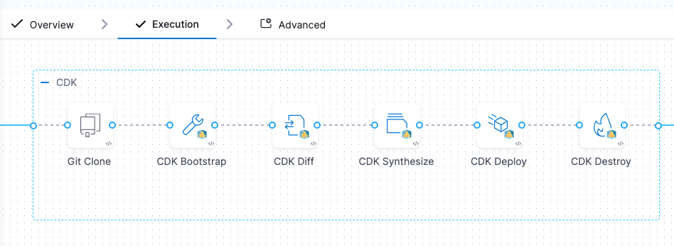
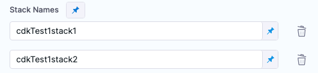
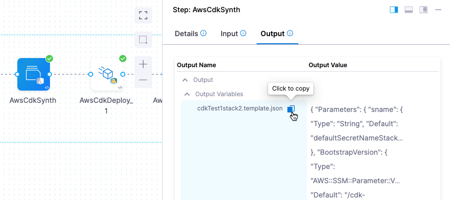
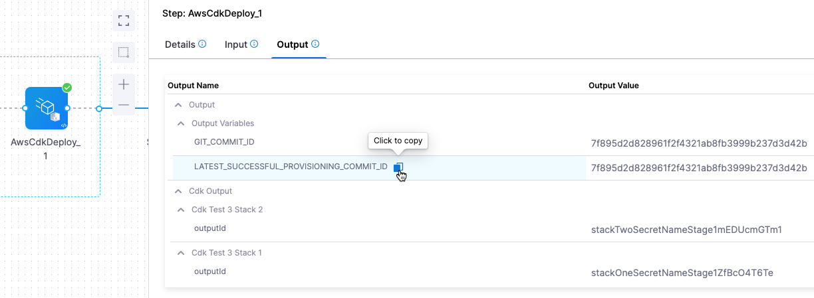

import { Troubleshoot } from '@site/src/components/AdaptiveAIContent';
import DocImage from '@site/src/components/DocImage';

AWS Cloud Development Kit (AWS CDK) is an open-source software development framework that allows developers to provision AWS infrastructure resources using familiar programming languages such as Go, Python, Java, and C#. CDK simplifies infrastructure as code (IaC) by abstracting away many of the low-level details and providing a higher-level, programmatic approach. Go to [AWS CDK Developer Guide](https://docs.aws.amazon.com/cdk/v2/guide/home.html) to learn CDK fundamentals.

This topic provides steps on using Harness to provision a target AWS environment or resources using AWS CDK. You can add AWS CDK provisioning steps to Harness Deploy and Custom stage types, and you can perform ad hoc provisioning or provision the target environment for a deployment as part of the deployment stage.

The following video demonstrates AWS CDK provisioning in Harness:

<DocVideo src="https://www.loom.com/share/5a118a7ace3e49819c697b7131468990?sid=36ae85f0-0a39-4c5c-ba62-0e1a9d52c4de" />

---

## Before you begin

- **Harness account with Continuous Delivery module enabled:** You need access to Harness with the CD module entitled on your account. Go to [Getting started with Harness Platform](/docs/platform/get-started/onboarding-guide) to create an account or access an existing account.

- **Pipeline permissions:** You need **View**, **Create/Edit**, and **Execute** permissions for [Pipelines](/docs/platform/role-based-access-control/permissions-reference#pipelines). An administrator must assign you a role that includes these permissions. Go to [RBAC in Harness](/docs/platform/role-based-access-control/rbac-in-harness) and [Manage roles](/docs/platform/role-based-access-control/add-manage-roles) to configure roles.

- **Environment permissions:** You need **View/Create**, **Edit**, **Access**, and **Delete** permissions for [Environments](/docs/platform/role-based-access-control/permissions-reference#environments).

- **AWS account access:** You need access to an AWS account where CDK will provision infrastructure. The AWS CDK CLI must be able to authenticate with the desired AWS account and have the necessary permissions for provisioning. You can set access keys, secret keys, and region as environment variables or let the CDK CLI inherit the IAM role from the EKS cluster where the containerized steps run. If the step group infrastructure points to EKS, a Kubernetes ServiceAccount can be set in the step group **Service Account Name** field. This way all containers created in that step group inherit the IAM role permissions of the corresponding ServiceAccount. Go to [IAM roles for service accounts](https://docs.aws.amazon.com/eks/latest/userguide/iam-roles-for-service-accounts.html) to understand EKS IAM roles for Kubernetes ServiceAccounts.

- **Kubernetes cluster for containerized step groups:** AWS CDK steps run in containerized step groups, which require a Kubernetes cluster and namespace. You need a Harness Kubernetes Cluster connector configured for the cluster that will serve as the runtime infrastructure. Go to [Kubernetes Cluster connector settings reference](/docs/platform/connectors/cloud-providers/ref-cloud-providers/kubernetes-cluster-connector-settings-reference) to create a connector.

- **Git repository containing CDK application:** You need a Git repository with your CDK application code. The CDK app defines the infrastructure resources to provision. Go to [Git connector settings reference](/docs/platform/connectors/code-repositories/ref-source-repo-provider/git-connector-settings-reference) to configure a Git connector.

- **Docker registry access (optional):** Harness provides pre-built CDK plugin images on Docker Hub. If you want to use custom images, you need access to a Docker registry. Go to [Docker connector settings reference](/docs/platform/connectors/cloud-providers/ref-cloud-providers/docker-registry-connector-settings-reference) to configure a Docker connector.

- **Delegate version:** AWS OIDC connectors are supported for CDK deployments starting with delegate version 85900 or later.

    :::info Check if AWS environment is bootstrapped

    CDK requires AWS environments to be bootstrapped before first use. To check if your environment is already bootstrapped, run `aws cloudformation describe-stacks --stack-name CDKToolkit --region <your-region>` in the AWS CLI. If the command returns stack details, the environment is bootstrapped. If it returns an error that the stack does not exist, you need to run the Bootstrap step. Go to [Bootstrapping your AWS environment](https://docs.aws.amazon.com/cdk/v2/guide/cli.html#cli-bootstrap) to learn about CDK bootstrapping.

    :::

---

## Provisioning use cases

Harness supports two AWS CDK provisioning patterns: ad hoc provisioning for standalone infrastructure management, and dynamic provisioning to create the target environment as part of your deployment workflow. You can provision infrastructure independently or combine it with Harness deployment services in a single pipeline. Go to [AWS CDK use cases and examples](/docs/continuous-delivery/cd-infrastructure/aws-cdk/aws-cdk-use-cases) to understand provisioning patterns, see code examples, and learn about dynamic provisioning for different deployment types.

---

## Set up CDK step groups

AWS CDK steps in Harness stages must be added in a containerized step group. The steps cannot be selected outside of a containerized step group. Go to [Containerize step groups](/docs/continuous-delivery/x-platform-cd-features/cd-steps/containerized-steps/containerized-step-groups) to learn about containerized step group configuration and infrastructure requirements.

The step group contains the Harness connector to a Kubernetes cluster and namespace hosted in your environment. When the pipeline runs, the step group creates a container inside the cluster. Inside the container, a pod is created for each step in the step group using the image you provide in the step. The steps share a common disk space and can reference the same paths.

When you select AWS CDK as the provisioner on the CD stage **Environment** tab, Harness automatically generates a containerized step group containing the steps needed for AWS CDK. If you add AWS CDK steps to a stage's **Execution** tab, you must add the containerized step group yourself.

### Configure step group settings

For AWS CDK, the step group setting **Enable container based execution** must be enabled. This setting configures the step group as containerized.

In the step group, configure the following mandatory settings:

- **Kubernetes Cluster:** Add a Harness Kubernetes Cluster connector to connect to the cluster that will be used as the runtime step infrastructure.
- **Namespace:** Enter the name of the cluster namespace to use.

### Order your CDK steps

The AWS CDK steps in Harness are similar to the AWS CDK toolkit `cdk` commands. The AWS CDK steps in your stage **Environment** or **Execution** typically follow the logical order of the CDK commands. Go to [AWS CDK Toolkit (cdk command)](https://docs.aws.amazon.com/cdk/v2/guide/cli.html) to understand CDK CLI commands.



Inside the step group, the following AWS CDK steps are used:

The following list summarizes the typical CDK step sequence:

1. **Git Clone step:** Clones the CDK app repository into the CD stage workspace. By cloning the repository, you gain access to the necessary code, scripts, or configurations, enabling you to perform various actions and ensure a reliable and controlled deployment. The Git Clone step use case for CDK is described later in this document. Go to [Git Clone step](/docs/continuous-delivery/x-platform-cd-features/cd-steps/containerized-steps/git-clone-step) for general information.

2. **AWS CDK Bootstrap step (optional):** Runs the `cdk bootstrap` command. This step sets up the necessary AWS resources and environment required for deploying CDK applications in a specific AWS region and AWS account. This command is typically run once per AWS account and region to prepare the environment for CDK deployments. If your AWS environment is already bootstrapped, you can skip this step.

3. **AWS CDK Diff step:** Runs the `cdk diff` command. Compares the specified stack and its dependencies with the deployed stacks.

4. **AWS CDK Synth step:** Runs the `cdk synthesize` command. Synthesizes and prints the CloudFormation template for one or more stacks specified in the step.

5. **AWS CDK Deploy step:** Runs the `cdk deploy` command. Deploys the infrastructure defined in your CDK application to your AWS account.

6. **AWS CDK Destroy step (optional):** Runs the `cdk destroy` command. Deletes the AWS CloudFormation stacks that were previously created by a CDK application.

7. **AWS CDK rollback steps:**
   - **Git Clone rollback step:** Typically, this step restores the Git branch/tag/commit of the repository used in the last successful deployment. You can also choose to clone any branch/tag/commit as part of rollback.
   - **AWS CDK Rollback step:** Rolls back the provisioned resources deployed by the failed CDK Deploy step to the state of the resources from the last successful deployment.

These steps are described in detail below.

---

## Configure Docker images for CDK steps

The CDK steps in the step group are containerized. In the **Container Registry** and **Image** settings in each step, you must provide a Harness connector to a container registry and an image for the pod the step uses.

Harness provides the `aws-cdk-plugin` base image and custom images for different stacks (Java, .NET, Python, Go, and others). They are located on the Docker Hub registry [aws-cdk-plugin](https://hub.docker.com/r/harness/aws-cdk-plugin/tags). For example, `harness/aws-cdk-plugin:1.0.0` is the base image that contains the CDK CLI and Node.js, and `harness/aws-cdk-plugin:1.3.0-java-linux-arm64` is the custom image for Java created by Harness. You can use a Harness custom image or create your own.

You can use a Harness base image to create your own image and use that in a step. For example, if your CDK app uses a specific Java or Node.js version, you can use the base image provided by Harness and create your own image containing your dependencies. You should never override the entry point. The image you use should support the CDK operations you are running in your app.

### Choose a CDK plugin image

The following table shows example CDK plugin images by runtime. Version numbers are examples and may not reflect the latest available versions. Check the Docker Hub links for the most current image tags.

| **Runtime**    | **Latest base image**                 | **Latest unified pipeline image**     | **CDK version**    |
|----------------|---------------------------------------|---------------------------------------|--------------------|
| dotnet         | [`harness/aws-cdk-plugin:1.4.0-2.1027.0-dotnet-linux-arm64`](https://hub.docker.com/layers/harness/aws-cdk-plugin/1.4.0-2.1027.0-dotnet-linux-arm64/images/sha256-6fc6bc95619746bb5e61b7351baf7e984b4fff2f971742944598b022003f1545) | [`harness/aws-cdk-plugin:1.4.0-2.1027.0-dotnet-linux-arm64-unified`](https://hub.docker.com/layers/harness/aws-cdk-plugin/1.4.0-2.1027.0-dotnet-linux-arm64-unified/images/sha256-649411a67e39f127736a262b5d97bbcf8928ba78815cc85ef5dbcda3c481be55) | 2.1027.0 | 
| python         | [`harness/aws-cdk-plugin:1.4.0-2.1027.0-python-linux-arm64`](https://hub.docker.com/layers/harness/aws-cdk-plugin/1.4.0-2.1027.0-python-linux-arm64/images/sha256-0b4ee6e368b27adb0f2a1daa1d7c7adb4f7a20cc1bd1ab7b637075b302d07336) | [`harness/aws-cdk-plugin:1.4.0-2.1027.0-python-linux-arm64-unified`](https://hub.docker.com/layers/harness/aws-cdk-plugin/1.4.0-2.1027.0-python-linux-arm64-unified/images/sha256-9176098ce5f9d9c8ba05ed47ed220191a3be48624eb083b451712ea07ecd7c74) | 2.1027.0 | 
| java           | [`harness/aws-cdk-plugin:1.3.0-java-linux-arm64`](https://hub.docker.com/layers/harness/aws-cdk-plugin/1.3.0-java-linux-arm64/images/sha256-bdec2192e5655939cb084a991339dac7251546e50fe811918cc347cda55d37b7)   | [`harness/aws-cdk-plugin:1.3.0-java-linux-arm64-unified`](https://hub.docker.com/layers/harness/aws-cdk-plugin/1.3.0-java-linux-arm64-unified/images/sha256-dc6fddeadd4d640e905ae4e557fe3b998138cc640014c7e4e9c019c74b19b026) | 2.1016.1 |
| go | [`harness/aws-cdk-plugin:1.4.0-2.1027.0-go-linux-arm64`](https://hub.docker.com/layers/harness/aws-cdk-plugin/1.4.0-2.1027.0-go-linux-arm64/images/sha256-fc54740abfb1fcfeef649ae133ba42f8709f4cc8578868c12575a59ed5b02d3b)                     | [`harness/aws-cdk-plugin:1.4.0-2.1027.0-go-linux-arm64-unified`](https://hub.docker.com/layers/harness/aws-cdk-plugin/1.4.0-2.1027.0-go-linux-arm64-unified/images/sha256-4f95dcec76ab0037d6ea7b986adcf7fb4ac9329b23ef86de6fa19ded463630d4) | 2.1027.0 |
| linux                 | [`harness/aws-cdk-plugin:1.4.0-2.1027.0-linux-arm64`](https://hub.docker.com/layers/harness/aws-cdk-plugin/1.4.0-2.1027.0-linux-arm64/images/sha256-7a3b4136519eebf5dd112ab755bb58b2e8fe2fec7a349e47d94b8727a4e5c1ba)                     | [`harness/aws-cdk-plugin:1.4.0-2.1027.0-linux-arm64-unified`](https://hub.docker.com/layers/harness/aws-cdk-plugin/1.4.0-2.1027.0-linux-arm64-unified/images/sha256-386370b163d75e05909d7a632bb859494f70c3ba469d363f7e8fc5ce29cf3a07) | 2.1027.0 |

**How to choose:**
- **Language-specific images (dotnet, python, java, go):** Use these if your CDK app is written in that specific language. Each includes the language runtime and CDK CLI.
- **Base image (linux):** Use this if your CDK app uses Node.js or TypeScript (the default CDK language). The base image already includes Node.js and JavaScript.
- **Unified pipeline images:** These images include additional tools for use in unified pipelines. If you are uncertain, start with the language-specific base image.

You can access the AWS CDK plugin images from the following repositories:

- Docker Hub: [aws-cdk-plugin](https://hub.docker.com/r/harness/aws-cdk-plugin/tags)
- GAR:
  - Europe region: [GAR Image Repository for AWS CDK Plugin (Europe)](https://console.cloud.google.com/artifacts/docker/gar-prod-setup/europe/harness-public/harness%2Faws-cdk-plugin?inv=1&invt=Ab5cNA)

Harness also supports **`amd64`** architecture for these plugin images. You can find the corresponding tags (such as `harness/aws-cdk-plugin:1.3.0-2.1019.2-linux-amd64-unified`) on [Docker Hub](https://hub.docker.com/r/harness/aws-cdk-plugin/tags?name=amd64).

Harness releases new AWS CDK Plugin images once every 3 months. If you want to use the latest AWS CDK Plugin images, you can build your own image using the [AWS CDK Plugin Image Builder](/docs/continuous-delivery/cd-infrastructure/aws-cdk/cdk-image-build).

### Build your own image

You can also build your own image based on the base image provided by Harness and use it in a step. For example, if your CDK app uses a specific CDK version, you can use the base image provided by Harness and create your own image containing your dependencies.

Go to [Build your own image](/docs/continuous-delivery/cd-infrastructure/aws-cdk/cdk-image-build) to learn how to customize CDK plugin images.

### Supported languages

Harness provides custom images for the following programming languages:

- Java
- Go
- Python 3
- .NET

The base image already includes Node.js and JavaScript.

Navigate to the [DockerHub Repository](https://hub.docker.com/r/harness/aws-cdk-plugin/tags) for the latest image tags for this feature.

---

## Git Clone step

The Git Clone step is the first stage **Execution** step added to the containerized step group for Harness CDK.


The Git Clone step clones the CDK repository containing your CDK app and adds it to a shared space in the container that can be used by all subsequent steps.

:::tip Flexible source management

Harness supports multiple approaches for providing your CDK application code. While the Git Clone step is the standard approach, you can also add app files to the shared container space using a Shell Script step or other custom methods.

:::

During rollback, the Git Clone rollback step can be used to replace the Git branch/tag/commit that you used in the Git Clone step. The Git Clone step is documented in detail in [Git Clone step](/docs/continuous-delivery/x-platform-cd-features/cd-steps/containerized-steps/git-clone-step), but the key settings for CDK are reviewed here.

### Configure the Git Clone step

The following settings are required for the Git Clone step:

- **Connector:** Select or add a Harness Git connector for the source control provider hosting the CDK app code repository that you want to use.
- **Repository name:** If the connector's [URL Type](/docs/platform/connectors/code-repositories/ref-source-repo-provider/git-connector-settings-reference#url-type) is **Repository**, then **Repository Name** is automatically populated based on the repository defined in the connector's configuration. If the connector's **URL Type** is **Account**, then you must specify the name of the code repository that you want to clone into the stage workspace.
- **Build type:** Select **Git Branch** if you want the step to clone code from a specific branch within the repository, or select **Git Tag** or **Commit SHA** if you want the step to clone code from a specific commit. Based on your selection, specify a **Branch Name**, **Tag Name**, or **Commit SHA**.

  :::tip

  You can use [fixed values, runtime input, or variable expressions](/docs/platform/variables-and-expressions/runtime-inputs) for the branch and tag names. For example, you can enter `<+input>` for the branch or tag name to supply a branch or tag name at runtime.

  :::

- **Clone directory:** An optional target path in the stage workspace where you want to clone the repository.
- **Depth:** The number of commits to fetch when the step clones the repository. The default depth is 0, which fetches all commits from the relevant branch. Go to the [git clone documentation](https://git-scm.com/docs/git-clone) for more information.
- **SSL Verify:** If you set this to **True**, which is the default value, the pipeline verifies your Git SSL certificates. The stage fails if the certificate check fails. Set this to **False** only if you have a known issue with the certificate and you are willing to run your stages anyway.

For the remaining settings, see [Step settings common to multiple steps](#step-settings-common-to-multiple-steps) below.

---

## AWS CDK Bootstrap step

Runs the `cdk bootstrap` command. Go to [Bootstrapping your AWS environment](https://docs.aws.amazon.com/cdk/v2/guide/cli.html#cli-bootstrap) to understand CDK bootstrapping.

This step sets up the necessary AWS resources and environment required for deploying CDK applications in a specific AWS region and AWS account. This command is typically run once per AWS account and region to prepare the environment for CDK deployments.

If your AWS environment is already bootstrapped, you can skip this step.

### Configure the Bootstrap step

The following settings are required for the AWS CDK Bootstrap step:

- **Container registry:** A Harness Docker registry connector for the registry hosting the image that you want Harness to run commands on, such as Docker Hub.
- **Image:** The image to use for this step. For example, `harness/aws-cdk-plugin:1.3.0-java-linux-arm64`.
- **App Path:** The path to the CDK app. The Git Clone step listed the app repository in its **Repository Name** setting. **App Path** must include the path to the app folder in that directory.
- **AWS CDK Bootstrap Command Options:** You can add any CDK parameters you can see in the `cdk bootstrap --help` command, just like you would in the `cdk` command-line tool. For example, `--verbose`. Go to [Parameters](https://docs.aws.amazon.com/cdk/v2/guide/parameters.html) to learn about CDK parameters.

For the remaining settings, including [AWS connector configuration](#aws-connector-configuration-optional), see [Step settings common to multiple steps](#step-settings-common-to-multiple-steps) below.

---

## AWS CDK Diff step

Runs the `cdk diff` command to compare the specified stack and its dependencies with the deployed stacks.

### Configure the Diff step

The following settings are required for the AWS CDK Diff step:

- **Container registry:** A Harness Docker registry connector for the registry hosting the image that you want Harness to run commands on, such as Docker Hub.
- **Image:** The image to use for this step. For example, `harness/aws-cdk-plugin:1.3.0-java-linux-arm64`.
- **App Path:** The path to the CDK app. The Git Clone step listed the app repository in its **Repository Name** setting. App Path must include the path to the app folder in that directory.
- **AWS CDK Diff Command Options:** You can add any CDK parameters you can see in the `cdk diff --help` command, just like you would in the `cdk` command-line tool. For example, `--verbose`. Go to [Parameters](https://docs.aws.amazon.com/cdk/v2/guide/parameters.html) to learn about CDK parameters.
- **Stack Names:** If you are using a multi-stack app, enter the names of each stack you want to pass to the `cdk` command. For example, if your stack names are `cdkTest1Stack1` and `cdkTest1Stack2`, you would select **Add** and enter two stack names, one for each stack.

  

  For multi-stack applications, specify each stack name to avoid step failures. Single-stack applications do not require a stack name.

For the remaining settings, including [AWS connector configuration](#aws-connector-configuration-optional), see [Step settings common to multiple steps](#step-settings-common-to-multiple-steps) below.

---

## AWS CDK Synth step

Runs the `cdk synthesize` command. Synthesizes and prints the CloudFormation template for one or more stacks specified in the step. In the log for the executed step you will see the JSON file exported, for example, `Exporting template file:  hello-cdk/cdk.out/cdkTest1stack1.template.json`.

### Configure the Synth step

The following settings are required for the AWS CDK Synth step:

- **Container registry:** A Harness Docker registry connector for the registry hosting the image that you want Harness to run commands on, such as Docker Hub.
- **Image:** The image to use for this step. For example, `harness/aws-cdk-plugin:1.3.0-java-linux-arm64`.
- **App Path:** The path to the CDK app. The Git Clone step listed the app repository in its **Repository Name** setting. App Path must include the path to the app folder in that directory.
- **AWS CDK Synth Command Options:** You can add any CDK parameters you can see in the `cdk synthesize --help` command, just like you would in the `cdk` command-line tool. For example, `--verbose`. Go to [Parameters](https://docs.aws.amazon.com/cdk/v2/guide/parameters.html) to learn about CDK parameters.
- **Stack Names:** If you are using a multi-stack app, enter the names of each stack you want to pass to the `cdk` command. For example, if your stack names are `cdkTest1Stack1` and `cdkTest1Stack2`, you would select **Add** and enter two stack names, one for each stack.
- **Export Template:** Exports the JSON template(s) for the stacks entered in **Stack Names**. If no stacks are listed in Stack Names, and **Export Template** is enabled, Harness exports templates for all stacks in the app.

For the remaining settings, including [AWS connector configuration](#aws-connector-configuration-optional), see [Step settings common to multiple steps](#step-settings-common-to-multiple-steps) below.

### Export and reference JSON templates

After this step, synthesized JSON templates will be available in the **cdk.out** folder. If the **Export Template** option is selected, the JSON templates for the stacks will be exported as step output.

You can reference the JSON template from the step output after the step has run using an expression in this format:

```
<+pipeline.stages.STAGE_ID.spec.execution.steps.STEP_GROUP_ID.steps.STEP_ID.output.outputVariables.STACK_NAME>
```

For example:

```
<+pipeline.stages.test.spec.execution.steps.test.steps.AwsCdkSynth.output.outputVariables.cdkTest1stack2>
```

You can obtain the expression by copying it from the executed step **Outputs**.



### Use the template expression in a script

You can use the expression in a Shell Script step to output the JSON template.

Do not echo the expression. The template is multiline JSON and contains special characters, and this can cause issues with echo. You can assign the value to a variable like this:

<details>
<summary>Using cat with the JSON template expression</summary>

`stackOnetemplate=$(cat <<-END"<+pipeline.stages.test.spec.execution.steps.test.steps.AwsCdkSynth.output.outputVariables.cdkTest1stack1>"END)`

</details>

---

## AWS CDK Deploy step

Runs the `cdk deploy` command to deploy the infrastructure defined in your CDK application to your AWS account.

The CDK Deploy step includes a **Provisioner Identifier** setting to track the provisioning it performs. The **Provisioner Identifier** is used by the AWS CDK Rollback step to ensure that the step uses the same parameters and inputs that were used by the last successful `cdk deploy` with the corresponding Provisioner Identifier (in the CDK Deploy step). The **Provisioner Identifier** must be unique per provisioned infrastructure at the Harness project level.

If you have made these settings expressions, Harness uses the values it obtains at runtime when it evaluates the expression.

### Configure the Deploy step

The following settings are required for the AWS CDK Deploy step:

- **Container registry:** A Harness Docker registry connector for the registry hosting the image that you want Harness to run commands on, such as Docker Hub.
- **Image:** The image to use for this step. For example, `harness/aws-cdk-plugin:1.3.0-java-linux-arm64`.
- **Provisioner Identifier:** Enter a unique ID to identify the provisioning performed by this step. The **Provisioner Identifier** is a project-wide setting. You can reference it across pipelines in the same project. For this reason, it is important that all your project members know the provisioner identifiers. This will prevent one member building a pipeline from accidentally impacting the provisioning of another member's pipeline.

- **App Path:** The path to the CDK app. The Git Clone step listed the app repository in its **Repository Name** setting. App Path must include the path to the app folder in that directory.
- **AWS CDK Deploy Command Options:** You can add any CDK parameters you can see in the `cdk deploy --help` command, just like you would in the `cdk` command-line tool. For example, `--verbose`. Go to [Parameters](https://docs.aws.amazon.com/cdk/v2/guide/parameters.html) to learn about CDK parameters. The `--all` command can be used to deploy all stacks in the app without having to name them in the **Stack Names** setting.

- **Stack Names:** If you are using a multi-stack app, enter the names of each stack you want to pass to the `cdk` command. For example, if your stack names are `cdkTest1Stack1` and `cdkTest1Stack2`, you would select **Add** and enter two stack names, one for each stack.

  

  For multi-stack applications, specify each stack name to avoid step failures. Single-stack applications do not require a stack name.

- **Parameters:** This setting is the same as the `--parameters` option for `cdk deploy` (for example, `cdk deploy MyStack --parameters uploadBucketName=UploadBucket`). Go to [Specifying AWS CloudFormation parameters](https://docs.aws.amazon.com/cdk/v2/guide/cli.html#cli-deploy) to learn about CloudFormation parameters.

  Add any additional parameters to pass to CloudFormation at deploy time by adding the keys and values in **Parameters**. If the CDK app has a single stack, then you can enter the parameter name in **Key** and value in **Value**. If the CDK app has multiple stacks, then include the stack name as a prefix to the parameter in **Key** using a colon, in the format `STACK:KEY` (this is similar to the `STACK:KEY=VALUE` format in `cdk deploy --parameters`). For example, `mystack1:uploadBucketName`.

  In the log for the Harness CDK Deploy step, you will see the parameters added to the command, like this:

  ```
  /usr/local/bin/cdk deploy cdkTest3stack1 cdkTest3stack2 --parameters cdkTest3stack1:sname=stackOneSecretNameStage1ZfBcO4T6Te --parameters cdkTest3stack2:sname=stackTwoSecretNameStage1mEDUcmGTm1 -c stack1_name=cdkTest3stack1 -c stack2_name=cdkTest3stack2 --outputs-file cdk-outputs.json
  ```

- **Always Deploy (ignore CDK diff result):** When enabled, the Deploy step runs regardless of whether a preceding CDK Diff step detected changes. When disabled (default), the Deploy step may be skipped automatically if no infrastructure changes were detected. Go to [Skip deployment when no changes are detected](#skip-deployment-when-no-changes-are-detected) for details.

:::note Multi-account deployments

You can deploy to different AWS accounts using the same connector by configuring the optional AWS connector settings. This allows you to override the region and assume a different IAM role at the step level. Go to [AWS connector configuration (optional)](#aws-connector-configuration-optional) for details.

:::

For the remaining settings, including [AWS connector configuration](#aws-connector-configuration-optional), see [Step settings common to multiple steps](#step-settings-common-to-multiple-steps) below.

### Skip deployment when no changes are detected

:::note
This feature is behind the feature flag `CDS_SKIP_CDK_DEPLOY_IF_NO_DIFF`. Contact [Harness Support](mailto:support@harness.io) to enable the feature.
:::

When the feature flag `CDS_SKIP_CDK_DEPLOY_IF_NO_DIFF` is enabled, Harness can automatically skip the CDK Deploy step if the preceding CDK Diff step detected no infrastructure changes. This optimization reduces pipeline execution time by avoiding unnecessary deployment operations when the infrastructure already matches the desired state defined in your CDK application.

The CDK Diff step outputs a variable `CDK_DIFF_FOUND` that indicates whether infrastructure changes were detected. When this variable is set to `false`, it means the current infrastructure state matches the CDK application definition, and no deployment is needed.

#### How it works

When the feature flag is enabled and the **Always Deploy (ignore CDK diff result)** checkbox is disabled (the default state), the CDK Deploy step checks the most recent CDK Diff step outcome in the same stage. If the Diff step reported no changes (`CDK_DIFF_FOUND=false`), the Deploy step automatically skips execution with a status of `SKIPPED`. The container for the Deploy step does not start, saving execution time and resources.

#### When the Deploy step runs

The Deploy step runs normally in the following cases:

- The feature flag `CDS_SKIP_CDK_DEPLOY_IF_NO_DIFF` is disabled (default behavior, no change from previous versions)
- The **Always Deploy (ignore CDK diff result)** checkbox is enabled on the Deploy step
- The CDK Diff step reported changes (`CDK_DIFF_FOUND=true`)
- The CDK Diff step was not run, failed, or was skipped
- No CDK Diff outcome is available in the current stage scope
- The CDK Diff step used an older plugin version that does not output `CDK_DIFF_FOUND`

#### When the Deploy step is skipped

The Deploy step is automatically skipped when all of the following conditions are met:

- The feature flag `CDS_SKIP_CDK_DEPLOY_IF_NO_DIFF` is enabled for your account
- The **Always Deploy (ignore CDK diff result)** checkbox is disabled on the Deploy step (default)
- A CDK Diff step was executed successfully earlier in the same stage
- The Diff step reported no infrastructure changes (`CDK_DIFF_FOUND=false`)

When a Deploy step is skipped, it does not save an `AwsCdkConfig` record or publish output variables such as `CDK_OUTPUT`, `GIT_COMMIT_ID`, or `LATEST_SUCCESSFUL_PROVISIONING_COMMIT_ID`. If downstream steps or pipelines reference these output variables using expressions like `<+execution.steps.deploy.output...>`, add conditional logic to handle cases where the Deploy step was skipped.

#### Multiple Diff steps in a stage

If your stage contains multiple CDK Diff steps, the Deploy step uses the outcome from the most recently executed Diff step. Harness recommends using a single sequential `Diff → Deploy` flow per stage to ensure predictable behavior. Avoid parallel branches, matrix strategies, or looping that produce concurrent diff outcomes for the same Deploy step.

#### Example pipeline structure

A typical pipeline structure with automatic skip logic:

1. Git Clone step
2. AWS CDK Diff step (reports `CDK_DIFF_FOUND=false` if no changes)
3. AWS CDK Deploy step (automatically skips when no diff found)

This structure ensures that deployment only occurs when infrastructure changes are detected, optimizing pipeline execution time while maintaining infrastructure consistency.

### Verify successful deployment

After the CDK Deploy step completes successfully, CloudFormation stacks are created in your AWS account. To view the deployed resources, go to the [AWS CloudFormation console](https://console.aws.amazon.com/cloudformation/) and select your region. You will see the stacks listed with their creation status. Select a stack to view the resources it created under the **Resources** tab.

:::warning User ID mismatch error

Ensure that the user ID used in the Git Clone step and steps that call Git commands in the step group is the same as the user ID specified in the [Run as User](#run-as-user) setting. Your step will fail if the user ID used in the Git Clone command and the user that calls the Git Clone command are different.

This issue can also occur for existing pipelines for users who have turned on the `CDS_CONTAINER_STEP_GROUP_RUN_AS_USER_AND_PRIVILEGED_FIX` feature flag, as it changes the behavior of certain settings including `Run as User` when it is not configured. To fix this issue, set `Run as User` in your Git Clone step and CDK Deploy step to `0`.

:::

:::tip Install dependencies before CDK commands

CDK commands require application dependencies to be installed beforehand. You can handle dependency installation using one of the following approaches:

1. **Add a Run Step for Installing Dependencies:**
   Add a Run Step prior to the CDK Deploy step where you can execute the commands to install the dependencies, such as `npm install`. This ensures that when the CDK step runs, all necessary dependencies are already installed.

2. **Update the `cdk.json` File:**
   Update the `cdk.json` file to define a custom build command that includes dependency installation, such as `npm install`, before deployment. For example:
   ```json
   {
   "app": "npx ts-node -P tsconfig.json --prefer-ts-exts src/ec2-instance.ts",
   "output": "cdk.out",
   "build": "npm install --verbose && npx projen bundle"
   }
   ```

:::

### Output variable expressions

After pipeline execution, the CDK Deploy step **Output** tab displays several output variables.



### GIT_COMMIT_ID and LATEST_SUCCESSFUL_PROVISIONING_COMMIT_ID

This is the Git commit ID of the CDK app that was deployed. After every successful `cdk deploy`, Harness attempts to obtain the commit SHA from the App path directory. This commit ID is saved and exported in step output `GIT_COMMIT_ID`.

Also, the CDK Deploy step outputs the commit SHA of the latest successful `cdk deploy` from a previous stage execution in the output `LATEST_SUCCESSFUL_PROVISIONING_COMMIT_ID`. You can reference this value using the expression:

```
<+pipeline.stages.STAGE_ID.spec.provisioner.steps.STEP_GROUP_ID.steps.STEP_ID.output.outputVariables.LATEST_SUCCESSFUL_PROVISIONING_COMMIT_ID>
```

For example:

```
<+pipeline.stages.s1.spec.provisioner.steps.test.steps.AwsCdkDeploy_1.output.outputVariables.LATEST_SUCCESSFUL_PROVISIONING_COMMIT_ID>
```

### Stack(s) outputId

A CDK app stack output is a value or set of values that are exposed by an AWS CloudFormation stack created and managed by your CDK application. These outputs provide a way for other resources or applications to access and use information produced or computed by the CDK stack during its deployment.

For example, `BucketNameOutput` is the output that provides the AWS S3 bucket name used by the stack:

```
new cdk.CfnOutput(this, 'BucketNameOutput', {
  value: bucket.bucketName,
  description: 'Name of the S3 bucket',
});

```

Each CDK app stack output ID is listed in the CDK Deploy step **Output** tab. You can reference this value using the expression:

```
<+pipeline.stages.STAGE_ID.spec.provisioner.steps.STEP_GROUP_ID.steps.STEP_ID.cdkOutput.STACK_NAME.OUTPUT_ID>
```

For example:

```
<+pipeline.stages.s1.spec.provisioner.steps.test.steps.AwsCdkDeploy_1.cdkOutput.cdkTest3stack2.BucketNameOutput>
```

---

## AWS CDK Destroy step

Runs the `cdk destroy` command to destroy one or more specified stacks. You can use this step to destroy one or more stacks defined in the CDK application.

### Configure the Destroy step

The following settings are required for the AWS CDK Destroy step:

- **Container registry:** A Harness Docker registry connector for the registry hosting the image that you want Harness to run commands on, such as Docker Hub.
- **Image:** The image to use for this step. For example, `harness/aws-cdk-plugin:1.3.0-java-linux-arm64`.
- **App Path:** The path to the CDK app. The Git Clone step listed the app repository in its **Repository Name** setting. App Path must include the path to the app folder in that directory.
- **AWS CDK Destroy Command Options:** You can add any CDK parameters you can see in the `cdk destroy --help` command, just like you would in the `cdk` command-line tool.
- **Stack Names:** If you are using a multi-stack app, enter the names of each stack you want to destroy here. For example, if your stack names are `cdkTest1Stack1` and `cdkTest1Stack2`, you would select **Add** and enter two stack names, one for each stack.

For the remaining settings, including [AWS connector configuration](#aws-connector-configuration-optional), see [Step settings common to multiple steps](#step-settings-common-to-multiple-steps) below.

---

## AWS CDK rollback steps

The CDK Rollback step runs `cdk deploy` using the saved inputs and parameters used in the last successful `cdk deploy` from a previous stage execution. The CDK Rollback step references the latest successful deploy using its **Provisioner identifier**.

The CDK rollback steps are located in the **Rollback** section of the **Environment** or **Execution** sections where you added your CDK steps.

:::note Tip

If you are using rollback steps in a Custom stage **Execution**, there is no **Rollback** section. You can add the rollback steps as the last steps and use the step's **Conditional Execution** settings. For example, select the **Execute this step only if prior step failed** setting and add the expression `<+pipeline.stages.STAGE_ID.spec.execution.steps.STEP_GROUP_ID.steps.STEP_ID.status> != "SUCCEEDED"` in the step's **And execute this step only if the following JEXL Condition evaluates to true** setting.

:::

Rollback occurs automatically when a deployment failure is detected in the pipeline. Manual rollback can be triggered by running the rollback steps in the **Rollback** section of your stage.

### Configure rollback step group

AWS CDK rollback steps in Harness stages must be added in a containerized step group. The steps cannot be selected outside of a containerized step group. Go to [Containerize step groups](/docs/continuous-delivery/x-platform-cd-features/cd-steps/containerized-steps/containerized-step-groups) to learn about containerized step group configuration.

The step group contains the Harness connector to a Kubernetes cluster and namespace hosted in your environment. When the pipeline runs, the step group creates a container inside the cluster. Inside the container, a pod is created for each step in the step group using the image you provide in the step. The steps share a common disk space and can reference the same paths.

When you select AWS CDK as the provisioner on the CD stage **Environment** tab, Harness automatically generates a containerized step group in **Rollback** containing the steps needed for AWS CDK.

### Configure Git Clone step in rollback

The Git Clone step is simply a Git Clone step used to roll back the Git repository in the container to the branch, tag, or commit SHA that you want to restore in the case of deployment failure.

Typically, the Git Clone step is used to roll back the app source repository in the container to the last successful commit. You can also add Harness steps to manipulate the repository, such as a Shell Script step.

Ensure that the CDK application on the shared disk space is at the revision you want to roll back to. The Git Clone step can be added with the specific commit SHA to use for rollback.

When the CDK Deploy step runs, it outputs the Git commit ID of the CDK app repository commit it used. You can see this in the **Output** of the CDK Deploy step and reference it using the expression in the format `<+pipeline.stages.STAGE_ID.spec.provisioner.steps.STEP_GROUP_ID.steps.STEP_ID.output.outputVariables.LATEST_SUCCESSFUL_PROVISIONING_COMMIT_ID>`.

To ensure that the Git Clone step rolls back to the last successful commit, configure the step as follows:

- **Connector:** Select or add a Harness Git connector for the source control provider hosting the CDK app code repository that you want to use.
- **Repository Name:** If the connector's **URL Type** is **Repository**, then **Repository Name** is automatically populated based on the repository defined in the connector's configuration. If the connector's **URL Type** is **Account**, then you must specify the name of the code repository that you want to clone into the stage workspace.
- **Build Type:** Select the branch, tag, or Git commit SHA of the commit you want to use.
- **Commit SHA:** If you use **Git Commit SHA**, you can use the `LATEST_SUCCESSFUL_PROVISIONING_COMMIT_ID` expression from the last _successful_ CDK Deploy step. For example, `<+pipeline.stages.s2.spec.provisioner.steps.test.steps.AwsCdkDeploy_2.output.outputVariables.LATEST_SUCCESSFUL_PROVISIONING_COMMIT_ID>`. In this example, this expression will resolve to the commit SHA from the latest successful execution of the `AwsCdkDeploy_2` step from a previous stage. The Git Clone step will check out that specific commit SHA.

  You do not have to use the Git commit used by the last successful CDK Deploy step. You can roll back to any branch, tag, or commit you like.

### Configure AWS CDK Rollback step

The CDK Rollback step rolls back the provisioned resources deployed by the CDK Deploy step to the last successful version.

The following settings are required for the AWS CDK Rollback step:

- **Provisioner Identifier:** The **Provisioner Identifier** setting is used to link CDK Deploy and CDK Rollback steps. In the CDK Rollback step, use the identical **Provisioner Identifier** as the CDK Deploy step to ensure that it rolls back the resources deployed by the failed CDK Deploy step. By using the same **Provisioner Identifier** in both the CDK Deploy and CDK Rollback steps, you ensure that CDK Rollback uses the data from the corresponding `cdk deploy`. After each successful `cdk deploy`, Harness stores the details using the **Provisioner Identifier** so they can be used for rollback.
- **Environment Variables:** You can change or add environment variables in your CDK app.

---

## Step settings common to multiple steps

The following settings are common to the CDK steps and configure the pods used for each step.

### AWS connector configuration (optional)

These optional settings enable multi-account deployments by allowing you to override the default AWS connector settings. When you configure an AWS connector in Harness, it typically connects to a specific AWS account. With these settings, you can deploy to different AWS accounts using the same connector by overriding the region and assuming a different IAM role at the step level.

<div align="center">
  <DocImage path={require('./static/connector-credentials.png')} width="60%" height="60%" title="Click to view full size image" />
</div>

- **AWS Connector (optional):** Select a Harness AWS connector to use for this step. When specified, this connector provides the credentials for AWS authentication.
- **Region (optional):** Override the region configured in the selected AWS connector. Use this to perform CDK operations in a different region.
- **Role ARN (optional):** Specify an IAM role ARN that the connector should assume. The role must have a trust policy that allows the connector's account to assume it. This enables performing CDK operations in different AWS accounts.

For example, if you have an AWS connector configured for Account A, you can deploy CDK stacks to Account B by providing the Region and Role ARN for Account B in the step configuration. The connector from Account A will assume the specified role in Account B to perform the deployment.

### Set up cross-account access

To enable cross-account deployments, configure a trust policy on the target account's IAM role. This policy must allow the source account (where your AWS connector is configured) to assume the role.

Here is an example trust policy for the target Role ARN:

```json
{
  "Version": "2012-10-17",
  "Statement": [
    {
      "Effect": "Allow",
      "Principal": {
        "AWS": "arn:aws:iam::1234xxxx:root"
      },
      "Action": "sts:AssumeRole",
      "Condition": {}
    }
  ]
}
```

Replace `1234xxxx` with the AWS account ID of your source account (the account associated with your Harness AWS connector). The IAM role you specify in **Role ARN** must have sufficient permissions to perform the CDK operations (bootstrap, deploy, destroy, and so on) in the target account. Go to [IAM tutorial: Delegate access across AWS accounts using IAM roles](https://docs.aws.amazon.com/IAM/latest/UserGuide/tutorial_cross-account-with-roles.html) to learn about cross-account IAM roles.

### Additional containerized step settings

Each CDK step supports additional configuration options common to all containerized steps in Harness, including privileged mode, image pull policy, run as user, resource limits (memory and CPU), environment variables, and advanced settings (delegate selector, conditional execution, failure strategy, looping strategy). Go to [Containerize step groups](/docs/continuous-delivery/x-platform-cd-features/cd-steps/containerized-steps/containerized-step-groups) to review containerized step configuration options.

---

## Troubleshooting

<Troubleshoot
  issue="AWS CDK step fails when passing Secret output variables from previous containerized step group"
  mode="docs"
  fallback="Secret output variables from containerized step groups are not supported as CDK step credentials. Use environment variables or AWS connector configuration instead."
/>

<Troubleshoot
  issue="CDK Deploy step fails with Git context lost error when steps are split across multiple containerized step groups"
  mode="docs"
  fallback="Git Clone, CDK Diff, and CDK Deploy steps must be in the same containerized step group. Git context cannot be transferred between step groups."
/>

<Troubleshoot
  issue="User ID mismatch error in Git Clone step and CDK Deploy step causing step failure"
  mode="docs"
  fallback="Ensure that the user ID used in the Git Clone step matches the user ID specified in the Run as User setting. Set Run as User to 0 in both Git Clone and CDK Deploy steps."
/>

<Troubleshoot
  issue="CDK Deploy step fails when checking if AWS environment is already bootstrapped"
  mode="docs"
  fallback="Run aws cloudformation describe-stacks --stack-name CDKToolkit --region your-region in the AWS CLI. If the command returns stack details, the environment is bootstrapped. If it returns an error, run the Bootstrap step."
/>

<Troubleshoot
  issue="Output variable expression not resolving in subsequent pipeline steps"
  mode="docs"
  fallback="Verify that the expression format matches the documented pattern. Copy the expression from the CDK Deploy step Outputs tab to ensure correct syntax. Check that the step ID, stage ID, and output variable name are correct."
/>

---

## Next steps

You have configured AWS CDK provisioning in Harness and understand how to deploy infrastructure using familiar programming languages. You can now provision AWS resources as part of your deployment pipelines or on-demand.

- Go to [Build your own CDK image](/docs/continuous-delivery/cd-infrastructure/aws-cdk/cdk-image-build) to customize CDK plugin images with specific versions and dependencies.
- Go to [Kubernetes infrastructure](/docs/continuous-delivery/deploy-srv-diff-platforms/kubernetes/define-your-kubernetes-target-infrastructure) to configure dynamic infrastructure provisioning for Kubernetes deployments.
- Go to [AWS ECS deployment tutorial](/docs/continuous-delivery/deploy-srv-diff-platforms/aws/ecs/ecs-deployment-tutorial) to provision ECS infrastructure with CDK and deploy containerized applications.
