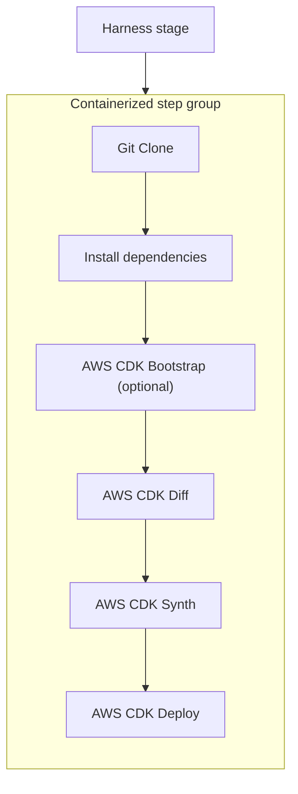

import { Troubleshoot } from '@site/src/components/AdaptiveAIContent';
import DocImage from '@site/src/components/DocImage';

AWS Cloud Development Kit (AWS CDK) is an open-source software development framework that allows developers to provision AWS infrastructure resources using familiar programming languages such as Go, Python, Java, and C#. CDK simplifies infrastructure as code (IaC) by abstracting away many of the low-level details and providing a higher-level, programmatic approach. Go to [AWS CDK Developer Guide](https://docs.aws.amazon.com/cdk/v2/guide/home.html) to learn CDK fundamentals.

This topic provides steps on using Harness to provision a target AWS environment or resources using AWS CDK. You can add AWS CDK provisioning steps to Harness Deploy and Custom stage types, and you can provision infrastructure in two modes:

- **Ad hoc provisioning**: Provision infrastructure as a standalone task without deploying an application in the same flow.
- **Dynamic provisioning**: Provision the target infrastructure and deploy your application to it in the same stage.

Go to [AWS CDK use cases and examples](/docs/continuous-delivery/cd-infrastructure/aws-cdk/aws-cdk-use-cases) to compare the provisioning modes and review code examples.

---

## What will you learn in this topic?

- How the [containerized step group](#how-aws-cdk-provisioning-works) runs your CDK steps.
- How to satisfy the [prerequisites](#before-you-begin) and [prepare the AWS environment](#prepare-the-aws-environment).
- How to [build the AWS CDK pipeline](#build-the-aws-cdk-pipeline), from the step group and image through Git Clone, dependency installation, optional Bootstrap, Diff, Synth, and Deploy.
- How to [destroy](#aws-cdk-destroy-step) provisioned stacks and [roll back](#aws-cdk-rollback-steps) a failed deployment.
- How to configure the [settings common to multiple steps](#step-settings-common-to-multiple-steps) and [troubleshoot](#troubleshooting) common issues.

---

## Before you begin

- **Harness account with Continuous Delivery module enabled**: You need access to Harness with the CD module entitled on your account. Go to [Getting started with Harness Platform](/docs/platform/get-started/onboarding-guide) to create an account or access an existing account.

- **Pipeline permissions**: You need **View**, **Create/Edit**, and **Execute** permissions for [Pipelines](/docs/platform/role-based-access-control/permissions-reference#pipelines). An administrator must assign you a role that includes these permissions. Go to [RBAC in Harness](/docs/platform/role-based-access-control/rbac-in-harness) and [Manage roles](/docs/platform/role-based-access-control/add-manage-roles) to configure roles.

- **Environment permissions**: You need **View/Create**, **Edit**, **Access**, and **Delete** permissions for [Environments](/docs/platform/role-based-access-control/permissions-reference#environments).

- **AWS account access**: You need access to an AWS account where CDK will provision infrastructure. The AWS CDK CLI must be able to authenticate with the desired AWS account and have the necessary permissions for provisioning. You can set access keys, secret keys, and region as environment variables or let the CDK CLI inherit the IAM role from the EKS cluster where the containerized steps run. If the step group infrastructure points to EKS, a Kubernetes ServiceAccount can be set in the step group **Service Account Name** field. This way all containers created in that step group inherit the IAM role permissions of the corresponding ServiceAccount. Go to [IAM roles for service accounts](https://docs.aws.amazon.com/eks/latest/userguide/iam-roles-for-service-accounts.html) to understand EKS IAM roles for Kubernetes ServiceAccounts.

- **Kubernetes cluster for containerized step groups**: AWS CDK steps run in containerized step groups, which require a Kubernetes cluster and namespace. You need a Harness Kubernetes Cluster connector configured for the cluster that will serve as the runtime infrastructure. Go to [Kubernetes Cluster connector settings reference](/docs/platform/connectors/cloud-providers/ref-cloud-providers/kubernetes-cluster-connector-settings-reference) to create a connector.

- **Git repository containing CDK application**: You need a Git repository with your CDK application code. The CDK app defines the infrastructure resources to provision. Go to [Git connector settings reference](/docs/platform/connectors/code-repositories/ref-source-repo-provider/git-connector-settings-reference) to configure a Git connector.

- **Docker registry access (optional)**: Harness provides pre-built CDK plugin images on Docker Hub. If you want to use custom images, you need access to a Docker registry. Go to [Docker connector settings reference](/docs/platform/connectors/cloud-providers/ref-cloud-providers/docker-registry-connector-settings-reference) to configure a Docker connector.

- **Delegate version**: AWS OIDC connectors are supported for CDK deployments starting with delegate version 85900 or later.

---

## Prepare the AWS environment

CDK requires AWS environments to be bootstrapped before first use. Bootstrapping provisions the AWS resources (such as the `CDKToolkit` CloudFormation stack) that CDK needs to deploy into a specific account and region.

To check whether an account and region are already bootstrapped, run the following command in the AWS CLI:

```bash
aws cloudformation describe-stacks --stack-name CDKToolkit --region <your-region>
```

- If the command returns stack details, the environment is bootstrapped and you can skip the Bootstrap step.
- If it returns an error that the stack does not exist, add the [AWS CDK Bootstrap step](#add-the-aws-cdk-bootstrap-step-optional) to your pipeline, or bootstrap manually.

Go to [Bootstrap your AWS environment](https://docs.aws.amazon.com/cdk/v2/guide/cli.html#cli-bootstrap) to understand CDK bootstrapping.

---

## How AWS CDK provisioning works

AWS CDK steps in Harness stages run inside a containerized step group. The steps cannot be selected outside of a containerized step group. Go to [Containerize step groups](/docs/continuous-delivery/x-platform-cd-features/cd-steps/containerized-steps/containerized-step-groups) to understand containerized step group configuration and infrastructure requirements.

The step group contains the Harness connector to a Kubernetes cluster and namespace hosted in your environment. When the pipeline runs, the step group creates a container inside the cluster. Inside the container, a pod is created for each step in the step group using the image you provide in the step. The steps share a common disk space and can reference the same paths.

The Harness AWS CDK steps map to the AWS CDK toolkit `cdk` commands and typically run in the logical order of those commands. Go to [AWS CDK Toolkit (cdk command)](https://docs.aws.amazon.com/cdk/v2/guide/cli.html) to understand CDK CLI commands.

<div align="center">
  <DocImage path={require('./static/099abb22f98f11fa6f14026bf9c825bbc5586eb1ea22fe5c1c72668283c8aca8.png')} alt="AWS CDK step group in the Execution tab showing the Git Clone, CDK Bootstrap, CDK Diff, CDK Synthesize, CDK Deploy, and CDK Destroy steps in order" width="90%" />
</div>

The following video demonstrates AWS CDK provisioning in Harness:

<DocVideo src="https://www.loom.com/share/5a118a7ace3e49819c697b7131468990?sid=36ae85f0-0a39-4c5c-ba62-0e1a9d52c4de" />

The following AWS CDK steps run in the typical provisioning sequence:

1. **Git Clone step**: Clones the CDK application repository into the CD stage workspace, giving subsequent steps access to the code, scripts, and configuration.
2. **AWS CDK Bootstrap step (optional)**: Runs `cdk bootstrap` to set up the AWS resources CDK needs in a specific account and region. Run once per account and region. Skip this step if the environment is already bootstrapped.
3. **AWS CDK Diff step**: Runs `cdk diff` to compare the specified stack and its dependencies with the deployed stacks.
4. **AWS CDK Synth step**: Runs `cdk synthesize` to generate the CloudFormation template for one or more stacks.
5. **AWS CDK Deploy step**: Runs `cdk deploy` to deploy the infrastructure defined in the CDK application to the AWS account.

Two more steps handle post-deployment operations and are not part of the normal provisioning sequence:

- **AWS CDK Destroy step (optional)**: Runs `cdk destroy` to delete CloudFormation stacks previously created by the application.
- **AWS CDK rollback steps**: Restore the Git revision from the last successful deployment and roll the provisioned resources back to their last successful state.

---

## Build the AWS CDK pipeline

Build the pipeline by creating a containerized step group and then adding the CDK steps inside it, in the order they run:


```mermaid
flowchart TD
    stage["Harness stage"] --> sg
    subgraph sg["Containerized step group"]
        direction TB
        a["Git Clone"] --> b["Install dependencies"]
        b --> c["AWS CDK Bootstrap (optional)"]
        c --> d["AWS CDK Diff"]
        d --> e["AWS CDK Synth"]
        e --> f["AWS CDK Deploy"]
    end
```

Bootstrap is required only if the target AWS account and region have not already been bootstrapped. Go to [Prepare the AWS environment](#prepare-the-aws-environment) to check.

Each of the following sections adds one part of this structure.

:::note Where do the CDK steps go?

- **Ad hoc provisioning**: Use a Custom stage and add the containerized step group under **Execution**.
- **Dynamic provisioning**: Use a Deploy stage, select **AWS CDK** as the provisioner from the **Environment** configuration, and add the provisioning steps there.

The individual CDK step settings are the same in both modes unless noted otherwise. The following sections focus on building the CDK flow manually.

:::

### Create the containerized step group

AWS CDK steps run inside a containerized step group. The step group connects to a Kubernetes cluster and namespace, creates a container in that cluster when the pipeline runs, and starts a pod for each step using the image you provide. The steps share a common disk space so later steps can access files that earlier steps produced.

Perform the following steps to create the step group:

1. In the stage **Execution** (ad hoc) or **Environment** (dynamic) section, select **Add Step**, then select **Add Step Group**.
2. Enable **Enable container based execution**.
3. In **Kubernetes Cluster**, select the Harness Kubernetes Cluster connector for the runtime infrastructure.
4. In **Namespace**, enter the namespace to run the step pods in, for example `aws-cdk`.
5. Save the step group. Add the CDK steps inside it in the following sections.

<details>
<summary>Step group YAML</summary>

```yaml
- stepGroup:
    name: CDK
    identifier: CDK
    steps:
      # Add the Git Clone, Install dependencies, and CDK steps shown in the following sections.
    stepGroupInfra:
      type: KubernetesDirect
      spec:
        connectorRef: your_k8s_connector    # Replace with your Kubernetes Cluster connector
        namespace: default                  # Replace with your namespace
```

</details>

### Choose the CDK plugin image

Each CDK step is containerized. In the **Container Registry** and **Image** settings of every CDK step, provide a Harness connector to a container registry and an image for the pod the step uses.

Harness provides the `aws-cdk-plugin` base image and custom images for different runtimes (Java, .NET, Python, Go, and others) on the Docker Hub registry [aws-cdk-plugin](https://hub.docker.com/r/harness/aws-cdk-plugin/tags). Choose an image using the following rule:

- **CDK app in Node.js or TypeScript**: Use the base image (for example, `harness/aws-cdk-plugin:1.4.0-2.1027.0-linux-arm64`). The base image already includes Node.js, JavaScript, and the CDK CLI.
- **CDK app in Java, .NET, Python, or Go**: Use the language-specific image (for example, `harness/aws-cdk-plugin:1.3.0-java-linux-arm64`). Each includes the language runtime and the CDK CLI.
- **Custom runtime or newer CDK version**: Build your own image from a Harness base image. Do not override the entry point. Go to [Build your own CDK image](/docs/continuous-delivery/cd-infrastructure/aws-cdk/cdk-image-build) to customize CDK plugin images.

If you are uncertain, start with the base or language-specific image. To pin a specific tag, expand the following reference for example tags by runtime.

<details>
<summary>Example image tags by runtime</summary>

Version numbers are examples only. Check the Docker Hub links for the current tags.

| **Runtime**    | **Example base image**                 | **Example unified pipeline image**     | **CDK version**    |
|----------------|---------------------------------------|---------------------------------------|--------------------|
| dotnet         | [`harness/aws-cdk-plugin:1.4.0-2.1027.0-dotnet-linux-arm64`](https://hub.docker.com/layers/harness/aws-cdk-plugin/1.4.0-2.1027.0-dotnet-linux-arm64/images/sha256-6fc6bc95619746bb5e61b7351baf7e984b4fff2f971742944598b022003f1545) | [`harness/aws-cdk-plugin:1.4.0-2.1027.0-dotnet-linux-arm64-unified`](https://hub.docker.com/layers/harness/aws-cdk-plugin/1.4.0-2.1027.0-dotnet-linux-arm64-unified/images/sha256-649411a67e39f127736a262b5d97bbcf8928ba78815cc85ef5dbcda3c481be55) | 2.1027.0 | 
| python         | [`harness/aws-cdk-plugin:1.4.0-2.1027.0-python-linux-arm64`](https://hub.docker.com/layers/harness/aws-cdk-plugin/1.4.0-2.1027.0-python-linux-arm64/images/sha256-0b4ee6e368b27adb0f2a1daa1d7c7adb4f7a20cc1bd1ab7b637075b302d07336) | [`harness/aws-cdk-plugin:1.4.0-2.1027.0-python-linux-arm64-unified`](https://hub.docker.com/layers/harness/aws-cdk-plugin/1.4.0-2.1027.0-python-linux-arm64-unified/images/sha256-9176098ce5f9d9c8ba05ed47ed220191a3be48624eb083b451712ea07ecd7c74) | 2.1027.0 | 
| java           | [`harness/aws-cdk-plugin:1.3.0-java-linux-arm64`](https://hub.docker.com/layers/harness/aws-cdk-plugin/1.3.0-java-linux-arm64/images/sha256-bdec2192e5655939cb084a991339dac7251546e50fe811918cc347cda55d37b7)   | [`harness/aws-cdk-plugin:1.3.0-java-linux-arm64-unified`](https://hub.docker.com/layers/harness/aws-cdk-plugin/1.3.0-java-linux-arm64-unified/images/sha256-dc6fddeadd4d640e905ae4e557fe3b998138cc640014c7e4e9c019c74b19b026) | 2.1016.1 |
| go | [`harness/aws-cdk-plugin:1.4.0-2.1027.0-go-linux-arm64`](https://hub.docker.com/layers/harness/aws-cdk-plugin/1.4.0-2.1027.0-go-linux-arm64/images/sha256-fc54740abfb1fcfeef649ae133ba42f8709f4cc8578868c12575a59ed5b02d3b)                     | [`harness/aws-cdk-plugin:1.4.0-2.1027.0-go-linux-arm64-unified`](https://hub.docker.com/layers/harness/aws-cdk-plugin/1.4.0-2.1027.0-go-linux-arm64-unified/images/sha256-4f95dcec76ab0037d6ea7b986adcf7fb4ac9329b23ef86de6fa19ded463630d4) | 2.1027.0 |
| linux                 | [`harness/aws-cdk-plugin:1.4.0-2.1027.0-linux-arm64`](https://hub.docker.com/layers/harness/aws-cdk-plugin/1.4.0-2.1027.0-linux-arm64/images/sha256-7a3b4136519eebf5dd112ab755bb58b2e8fe2fec7a349e47d94b8727a4e5c1ba)                     | [`harness/aws-cdk-plugin:1.4.0-2.1027.0-linux-arm64-unified`](https://hub.docker.com/layers/harness/aws-cdk-plugin/1.4.0-2.1027.0-linux-arm64-unified/images/sha256-386370b163d75e05909d7a632bb859494f70c3ba469d363f7e8fc5ce29cf3a07) | 2.1027.0 |

Unified pipeline images include additional tools for use in unified pipelines. Harness also supports the `amd64` architecture (for example, `harness/aws-cdk-plugin:1.3.0-2.1019.2-linux-amd64-unified`); find the corresponding tags on [Docker Hub](https://hub.docker.com/r/harness/aws-cdk-plugin/tags?name=amd64).

You can also access the images from Google Artifact Registry (GAR): [GAR image repository for AWS CDK Plugin (Europe)](https://console.cloud.google.com/artifacts/docker/gar-prod-setup/europe/harness-public/harness%2Faws-cdk-plugin?inv=1&invt=Ab5cNA).

</details>

Harness releases new AWS CDK plugin images once every three months. To use a newer CDK version, build your own image with the [AWS CDK plugin image builder](/docs/continuous-delivery/cd-infrastructure/aws-cdk/cdk-image-build).

### Add the Git Clone step

The Git Clone step clones the repository containing your CDK application into the shared container space so that all subsequent steps can access the code, scripts, and configuration.

:::tip Flexible source management

The Git Clone step is the standard approach, but you can also add app files to the shared container space using a Shell Script step or other custom methods.

:::

Perform the following steps to add and configure the Git Clone step. Go to [Git Clone step](/docs/continuous-delivery/x-platform-cd-features/cd-steps/containerized-steps/git-clone-step) to review the full step reference.

1. Inside the containerized step group, select **Add Step**, then select **Git Clone**.
2. Configure the following settings:
   - **Connector**: Select or add a Harness Git connector for the source control provider hosting the CDK app code repository that you want to use.
   - **Repository name**: If the connector's [URL Type](/docs/platform/connectors/code-repositories/ref-source-repo-provider/git-connector-settings-reference#url-type) is **Repository**, then **Repository Name** is automatically populated based on the repository defined in the connector's configuration. If the connector's **URL Type** is **Account**, then you must specify the name of the code repository that you want to clone into the stage workspace.
   - **Build type**: Select **Git Branch** if you want the step to clone code from a specific branch within the repository, or select **Git Tag** or **Commit SHA** if you want the step to clone code from a specific commit. Based on your selection, specify a **Branch Name**, **Tag Name**, or **Commit SHA**. You can use [fixed values, runtime input, or variable expressions](/docs/platform/variables-and-expressions/runtime-inputs) for the branch and tag names. For example, you can enter `<+input>` to supply a branch or tag name at runtime.
   - **Clone directory**: An optional target path in the stage workspace where you want to clone the repository.
   - **Depth**: The number of commits to fetch when the step clones the repository. The default depth is 0, which fetches all commits from the relevant branch. Go to the [git clone documentation](https://git-scm.com/docs/git-clone) to understand clone depth.
   - **SSL Verify**: If you set this to **True**, which is the default value, the pipeline verifies your Git SSL certificates. The stage fails if the certificate check fails. Set this to **False** only if you have a known issue with the certificate and you are willing to run your stages anyway.
3. Configure the [settings common to multiple steps](#step-settings-common-to-multiple-steps), then save the step.

When the step runs, it clones the repository into the shared container space so that the later CDK steps can read the app code from the **App Path**.

<details>
<summary>Git Clone step YAML</summary>

```yaml
- step:
    type: GitClone
    name: Git Clone
    identifier: Git_Clone
    timeout: 5m
    spec:
      connectorRef: your_git_connector       # Replace with your Git connector to the CDK app repo
      runAsUser: "0"
      build:
        type: branch
        spec:
          branch: main                        # Replace with your branch
```

</details>

### Add the Install dependencies step

The CDK plugin image already includes the CDK CLI and language runtime. This step installs your CDK application's own dependencies, such as the packages listed in `package.json`. Add this step immediately after Git Clone so the dependencies are present before the Diff, Synth, and Deploy steps run.

Perform the following steps to install dependencies with a Run step:

1. Inside the containerized step group, select **Add Step**, then select **Run**.
2. In **Container Registry** and **Image**, set the image as described in [Choose the CDK plugin image](#choose-the-cdk-plugin-image).
3. In **Command**, enter the install command for your runtime, such as `npm install`.
4. Save the step.

Alternatively, update the `cdk.json` file to define a custom build command that installs dependencies before deployment:

```json
{
"app": "npx ts-node -P tsconfig.json --prefer-ts-exts src/ec2-instance.ts",
"output": "cdk.out",
"build": "npm install --verbose && npx projen bundle"
}
```

<details>
<summary>Install dependencies step YAML</summary>

```yaml
- step:
    type: Run
    name: Install Dependencies
    identifier: Install_Dependencies
    timeout: 10m
    spec:
      connectorRef: your_docker_connector    # Replace with your Docker connector
      image: harness/aws-cdk-plugin:1.4.0-2.1027.0-linux-amd64   # Replace with a current CDK plugin image
      shell: Sh
      command: |-
        cd hello-cdk                          # Replace with the path to your CDK app in the repo
        npm install
```

</details>

### Add the AWS CDK Bootstrap step (optional)

The AWS CDK Bootstrap step runs the `cdk bootstrap` command to set up the AWS resources CDK needs in a specific account and region. This command is typically run once per account and region. Skip this step if the environment is already bootstrapped. Go to [Bootstrap your AWS environment](https://docs.aws.amazon.com/cdk/v2/guide/cli.html#cli-bootstrap) to understand CDK bootstrapping.

Perform the following steps to add and configure the Bootstrap step:

1. Inside the containerized step group, select **Add Step**, then select **AWS CDK Bootstrap**.
2. In **Container Registry** and **Image**, set the image as described in [Choose the CDK plugin image](#choose-the-cdk-plugin-image).
3. Configure the following settings:
   - **App Path**: The path to the CDK app relative to the cloned repository root. For example, if the Git Clone step clones the `infrastructure` repository and the CDK app lives in `apps/network`, set **App Path** to `infrastructure/apps/network`. The other CDK steps use the same **App Path** value.
   - **AWS CDK Bootstrap Command Options**: Add any parameter from the `cdk bootstrap --help` command, just as you would in the `cdk` command-line tool. For example, `--verbose`. Go to [Parameters](https://docs.aws.amazon.com/cdk/v2/guide/parameters.html) to learn about CDK parameters.
4. Configure the [settings common to multiple steps](#step-settings-common-to-multiple-steps), including the optional [AWS connector configuration](#aws-connector-configuration-optional), then save the step.

<details>
<summary>AWS CDK Bootstrap step YAML</summary>

```yaml
- step:
    type: AwsCdkBootstrap
    name: CDK Bootstrap
    identifier: CDK_Bootstrap
    timeout: 10m
    spec:
      connectorRef: your_docker_connector    # Replace with your Docker connector
      image: harness/aws-cdk-plugin:1.4.0-2.1027.0-linux-amd64
      appPath: hello-cdk                      # Replace with the path to your CDK app in the repo
      resources:
        limits:
          memory: 1G
          cpu: "1"
      envVariables:
        AWS_DEFAULT_REGION: us-east-2         # Replace with your AWS region
      awsConnectorRef: your_aws_connector     # Replace with your AWS connector
```

</details>

---

### Add the AWS CDK Diff step

The AWS CDK Diff step runs the `cdk diff` command to compare the specified stack and its dependencies with the deployed stacks.

Perform the following steps to add and configure the Diff step:

1. Inside the containerized step group, select **Add Step**, then select **AWS CDK Diff**.
2. In **Container Registry** and **Image**, set the image as described in [Choose the CDK plugin image](#choose-the-cdk-plugin-image).
3. Configure the following settings:
   - **App Path**: The path to the CDK app relative to the cloned repository root, as described in [Add the AWS CDK Bootstrap step](#add-the-aws-cdk-bootstrap-step-optional).
   - **AWS CDK Diff Command Options**: Add any parameter from the `cdk diff --help` command, just as you would in the `cdk` command-line tool. For example, `--verbose`. Go to [Parameters](https://docs.aws.amazon.com/cdk/v2/guide/parameters.html) to learn about CDK parameters.
   - **Stack Names**: If you are using a multi-stack app, enter the names of each stack you want to pass to the `cdk` command. For example, if your stack names are `cdkTest1Stack1` and `cdkTest1Stack2`, you would select **Add** and enter two stack names, one for each stack. For multi-stack applications, specify each stack name to avoid step failures. Single-stack applications do not require a stack name.

     <div align="center">
       <DocImage path={require('./static/8be0b8f77211f4eabf068c7b6a19bffb0a1ce86a6fe26b7bc0fc4ed3f1a1d8f3.png')} alt="Stack Names setting with two entries, cdkTest1stack1 and cdkTest1stack2, added for a multi-stack CDK app" width="80%" />
     </div>

4. Configure the [settings common to multiple steps](#step-settings-common-to-multiple-steps), including the optional [AWS connector configuration](#aws-connector-configuration-optional), then save the step.

The step logs the resource changes between your CDK app and the deployed stacks, and outputs `CDK_DIFF_FOUND` to indicate whether changes were detected. Go to [Skip Deploy when no changes are detected](#skip-deploy-when-no-changes-are-detected) to use this output.

<details>
<summary>AWS CDK Diff step YAML</summary>

```yaml
- step:
    type: AwsCdkDiff
    name: CDK Diff
    identifier: CDK_Diff
    timeout: 10m
    spec:
      connectorRef: your_docker_connector
      image: harness/aws-cdk-plugin:1.4.0-2.1027.0-linux-amd64
      appPath: hello-cdk
      resources:
        limits:
          memory: 1G
          cpu: "1"
      envVariables:
        AWS_DEFAULT_REGION: us-east-2
      awsConnectorRef: your_aws_connector
```

</details>

### Add the AWS CDK Synth step

The AWS CDK Synth step runs the `cdk synthesize` command to synthesize and print the CloudFormation template for one or more stacks specified in the step. In the log for the executed step, you see the JSON file exported, for example, `Exporting template file:  hello-cdk/cdk.out/cdkTest1stack1.template.json`.

Perform the following steps to add and configure the Synth step:

1. Inside the containerized step group, select **Add Step**, then select **AWS CDK Synth**.
2. In **Container Registry** and **Image**, set the image as described in [Choose the CDK plugin image](#choose-the-cdk-plugin-image).
3. Configure the following settings:
   - **App Path**: The path to the CDK app relative to the cloned repository root, as described in [Add the AWS CDK Bootstrap step](#add-the-aws-cdk-bootstrap-step-optional).
   - **AWS CDK Synth Command Options**: Add any parameter from the `cdk synthesize --help` command, just as you would in the `cdk` command-line tool. For example, `--verbose`. Go to [Parameters](https://docs.aws.amazon.com/cdk/v2/guide/parameters.html) to learn about CDK parameters.
   - **Stack Names**: If you are using a multi-stack app, enter the names of each stack you want to pass to the `cdk` command. For example, if your stack names are `cdkTest1Stack1` and `cdkTest1Stack2`, you would select **Add** and enter two stack names, one for each stack.
   - **Export Template**: Exports the JSON templates for the stacks entered in **Stack Names**. If no stacks are listed in **Stack Names** and **Export Template** is enabled, Harness exports templates for all stacks in the app.
4. Configure the [settings common to multiple steps](#step-settings-common-to-multiple-steps), including the optional [AWS connector configuration](#aws-connector-configuration-optional), then save the step.

<details>
<summary>AWS CDK Synth step YAML</summary>

```yaml
- step:
    type: AwsCdkSynth
    name: CDK Synthesize
    identifier: CDK_Synthesize
    timeout: 10m
    spec:
      connectorRef: your_docker_connector
      image: harness/aws-cdk-plugin:1.4.0-2.1027.0-linux-amd64
      appPath: hello-cdk
      resources:
        limits:
          memory: 1G
          cpu: "1"
      envVariables:
        AWS_DEFAULT_REGION: us-east-2
      awsConnectorRef: your_aws_connector
      exportTemplate: true
```

</details>

#### Export and reference JSON templates

After this step, synthesized JSON templates will be available in the **cdk.out** folder. If the **Export Template** option is selected, the JSON templates for the stacks will be exported as step output.

You can reference the JSON template from the step output after the step has run using an expression in this format:

```text
<+pipeline.stages.STAGE_ID.spec.execution.steps.STEP_GROUP_ID.steps.STEP_ID.output.outputVariables.STACK_NAME>
```

For example:

```text
<+pipeline.stages.test.spec.execution.steps.test.steps.AwsCdkSynth.output.outputVariables.cdkTest1stack2>
```

You can obtain the expression by copying it from the executed step **Outputs**.

<div align="center">
  <DocImage path={require('./static/b36f4fa4dce007edfc19a2f807b2d866b2427ea0f51ebdd1714340c037f42396.png')} alt="Output tab of the AWS CDK Synth step showing the synthesized template output variable cdkTest1stack2.template.json with a copy button" width="90%" />
</div>

#### Use the template expression in a script

You can use the expression in a Shell Script step to output the JSON template.

Do not echo the expression. The template is multiline JSON and contains special characters, and this can cause issues with echo. You can assign the value to a variable like this:

<details>
<summary>Using cat with the JSON template expression</summary>

`stackOnetemplate=$(cat <<-END"<+pipeline.stages.test.spec.execution.steps.test.steps.AwsCdkSynth.output.outputVariables.cdkTest1stack1>"END)`

</details>

### Add the AWS CDK Deploy step

The AWS CDK Deploy step runs the `cdk deploy` command to deploy the infrastructure defined in your CDK application to your AWS account.

The Deploy step includes a **Provisioner Identifier** setting to track the provisioning it performs. The AWS CDK Rollback step uses this identifier to reuse the parameters and inputs from the last successful `cdk deploy` with the same **Provisioner Identifier**. The **Provisioner Identifier** must be unique per provisioned infrastructure at the Harness project level. If you configure these settings as expressions, Harness uses the values it obtains at runtime when it evaluates the expression.

Perform the following steps to add and configure the Deploy step:

1. Inside the containerized step group, select **Add Step**, then select **AWS CDK Deploy**.
2. In **Container Registry** and **Image**, set the image as described in [Choose the CDK plugin image](#choose-the-cdk-plugin-image).
3. Configure the following settings:
   - **Provisioner Identifier**: Enter a unique ID to identify the provisioning performed by this step. The **Provisioner Identifier** is a project-wide setting. You can reference it across pipelines in the same project. For this reason, it is important that all your project members know the provisioner identifiers. This prevents one member building a pipeline from accidentally impacting the provisioning of another member's pipeline.
   - **App Path**: The path to the CDK app relative to the cloned repository root, as described in [Add the AWS CDK Bootstrap step](#add-the-aws-cdk-bootstrap-step-optional).
   - **AWS CDK Deploy Command Options**: Add any parameter from the `cdk deploy --help` command, just as you would in the `cdk` command-line tool. For example, `--verbose`. Go to [Parameters](https://docs.aws.amazon.com/cdk/v2/guide/parameters.html) to learn about CDK parameters. Use the `--all` option to deploy all stacks in the app without naming them in the **Stack Names** setting.
   - **Stack Names**: If you are using a multi-stack app, enter the names of each stack you want to pass to the `cdk` command. For example, if your stack names are `cdkTest1Stack1` and `cdkTest1Stack2`, you would select **Add** and enter two stack names, one for each stack. For multi-stack applications, specify each stack name to avoid step failures. Single-stack applications do not require a stack name.

     <div align="center">
       <DocImage path={require('./static/8be0b8f77211f4eabf068c7b6a19bffb0a1ce86a6fe26b7bc0fc4ed3f1a1d8f3.png')} alt="Stack Names setting with two entries, cdkTest1stack1 and cdkTest1stack2, added for a multi-stack CDK app" width="80%" />
     </div>

   - **Parameters**: This setting is the same as the `--parameters` option for `cdk deploy` (for example, `cdk deploy MyStack --parameters uploadBucketName=UploadBucket`). Go to [Specifying AWS CloudFormation parameters](https://docs.aws.amazon.com/cdk/v2/guide/cli.html#cli-deploy) to learn about CloudFormation parameters. Add any additional parameters to pass to CloudFormation at deploy time by adding the keys and values in **Parameters**. If the CDK app has a single stack, then you can enter the parameter name in **Key** and value in **Value**. If the CDK app has multiple stacks, then include the stack name as a prefix to the parameter in **Key** using a colon, in the format `STACK:KEY` (this is similar to the `STACK:KEY=VALUE` format in `cdk deploy --parameters`). For example, `mystack1:uploadBucketName`. In the log for the Harness CDK Deploy step, you will see the parameters added to the command, like this:

     ```bash
     /usr/local/bin/cdk deploy cdkTest3stack1 cdkTest3stack2 --parameters cdkTest3stack1:sname=stackOneSecretNameStage1ZfBcO4T6Te --parameters cdkTest3stack2:sname=stackTwoSecretNameStage1mEDUcmGTm1 -c stack1_name=cdkTest3stack1 -c stack2_name=cdkTest3stack2 --outputs-file cdk-outputs.json
     ```

   - **Always Deploy (ignore CDK diff result)** (optional): When enabled, the Deploy step runs regardless of whether a preceding CDK Diff step detected changes. When disabled (default), the Deploy step may be skipped automatically if no infrastructure changes were detected. Go to [Skip Deploy when no changes are detected](#skip-deploy-when-no-changes-are-detected) for details.
4. Configure the [settings common to multiple steps](#step-settings-common-to-multiple-steps), including the optional [AWS connector configuration](#aws-connector-configuration-optional), then save the step.

:::note Multi-account deployments

You can deploy to different AWS accounts using the same connector by configuring the optional AWS connector settings. This allows you to override the region and assume a different IAM role at the step level. Go to [AWS connector configuration (optional)](#aws-connector-configuration-optional) for details.

:::

<details>
<summary>AWS CDK Deploy step YAML</summary>

```yaml
- step:
    type: AwsCdkDeploy
    name: CDK Deploy
    identifier: CDK_Deploy
    timeout: 10m
    spec:
      connectorRef: your_docker_connector
      image: harness/aws-cdk-plugin:1.4.0-2.1027.0-linux-amd64
      provisionerIdentifier: awscdk          # Replace with a unique identifier used for rollback
      appPath: hello-cdk
      commandOptions:
        - "--require-approval"
        - never
      resources:
        limits:
          memory: 1G
          cpu: "1"
      envVariables:
        AWS_DEFAULT_REGION: us-east-2
      awsConnectorRef: your_aws_connector
```

</details>

### Skip Deploy when no changes are detected

:::note
This feature is behind the feature flag `CDS_SKIP_CDK_DEPLOY_IF_NO_DIFF`. Contact [Harness Support](mailto:support@harness.io) to enable the feature.
:::

When the feature flag `CDS_SKIP_CDK_DEPLOY_IF_NO_DIFF` is enabled and the **Always Deploy (ignore CDK diff result)** checkbox is disabled (the default), the Deploy step checks the most recent CDK Diff step outcome in the same stage. The Diff step outputs `CDK_DIFF_FOUND` to indicate whether changes were detected. If the Diff step reported no changes (`CDK_DIFF_FOUND=false`), the Deploy step skips execution with a status of `SKIPPED`, its container does not start, and pipeline execution time is reduced.

The Deploy step runs normally when the feature flag is disabled, when **Always Deploy** is enabled, when the Diff step reported changes (`CDK_DIFF_FOUND=true`), or when no CDK Diff outcome is available (the Diff step did not run, failed, was skipped, or used an older plugin version that does not output `CDK_DIFF_FOUND`).

:::warning Skipped Deploy step publishes no output variables

When the Deploy step is skipped, it does not save an `AwsCdkConfig` record or publish output variables such as `CDK_OUTPUT`, `GIT_COMMIT_ID`, or `LATEST_SUCCESSFUL_PROVISIONING_COMMIT_ID`. If downstream steps or pipelines reference these output variables using expressions such as `<+execution.steps.deploy.output...>`, add conditional logic to handle the skipped case.

:::

Use a single sequential `Diff → Deploy` flow per stage to ensure predictable behavior. If a stage contains multiple CDK Diff steps, the Deploy step uses the outcome from the most recently executed Diff step. Avoid parallel branches, matrix strategies, or looping that produce concurrent diff outcomes for the same Deploy step.

---

## Run and verify the pipeline

After you build the step group and CDK steps, run the pipeline and verify that the infrastructure is provisioned as expected.

### Verify successful deployment

After the CDK Deploy step completes successfully, CloudFormation stacks are created in your AWS account. To view the deployed resources, go to the [AWS CloudFormation console](https://console.aws.amazon.com/cloudformation/) and select your region. You will see the stacks listed with their creation status. Select a stack to view the resources it created under the **Resources** tab.

### Reference CDK Deploy output variables

After pipeline execution, the CDK Deploy step **Output** tab displays several output variables.

<div align="center">
  <DocImage path={require('./static/29275e4d5bc3a244d2c934e36dd611fb13004a7f3887d277923f22d0236f43b3.png')} alt="Output tab of the AWS CDK Deploy step showing GIT_COMMIT_ID, LATEST_SUCCESSFUL_PROVISIONING_COMMIT_ID, and each stack outputId output variable" width="90%" />
</div>

#### Commit ID output variables

This is the Git commit ID of the CDK app that was deployed. After every successful `cdk deploy`, Harness attempts to obtain the commit SHA from the App path directory. This commit ID is saved and exported in step output `GIT_COMMIT_ID`.

Also, the CDK Deploy step outputs the commit SHA of the latest successful `cdk deploy` from a previous stage execution in the output `LATEST_SUCCESSFUL_PROVISIONING_COMMIT_ID`. You can reference this value using the expression:

```text
<+pipeline.stages.STAGE_ID.spec.provisioner.steps.STEP_GROUP_ID.steps.STEP_ID.output.outputVariables.LATEST_SUCCESSFUL_PROVISIONING_COMMIT_ID>
```

For example:

```text
<+pipeline.stages.s1.spec.provisioner.steps.test.steps.AwsCdkDeploy_1.output.outputVariables.LATEST_SUCCESSFUL_PROVISIONING_COMMIT_ID>
```

#### Stack output variables

A CDK app stack output is a value or set of values that are exposed by an AWS CloudFormation stack created and managed by your CDK application. These outputs provide a way for other resources or applications to access and use information produced or computed by the CDK stack during its deployment.

For example, `BucketNameOutput` is the output that provides the AWS S3 bucket name used by the stack:

```typescript
new cdk.CfnOutput(this, 'BucketNameOutput', {
  value: bucket.bucketName,
  description: 'Name of the S3 bucket',
});
```

Each CDK app stack output ID is listed in the CDK Deploy step **Output** tab. You can reference this value using the expression:

```text
<+pipeline.stages.STAGE_ID.spec.provisioner.steps.STEP_GROUP_ID.steps.STEP_ID.cdkOutput.STACK_NAME.OUTPUT_ID>
```

For example:

```text
<+pipeline.stages.s1.spec.provisioner.steps.test.steps.AwsCdkDeploy_1.cdkOutput.cdkTest3stack2.BucketNameOutput>
```

---

## Destroy and roll back

Use the AWS CDK Destroy step to tear down provisioned stacks, and the AWS CDK Rollback steps to return provisioned resources to their last successful state after a failed deployment.

### AWS CDK Destroy step

The AWS CDK Destroy step runs the `cdk destroy` command to destroy one or more stacks defined in the CDK application.

Perform the following steps to add and configure the Destroy step:

1. Inside the containerized step group, select **Add Step**, then select **AWS CDK Destroy**.
2. In **Container Registry** and **Image**, set the image as described in [Choose the CDK plugin image](#choose-the-cdk-plugin-image).
3. Configure the following settings:
   - **App Path**: The path to the CDK app relative to the cloned repository root, as described in [Add the AWS CDK Bootstrap step](#add-the-aws-cdk-bootstrap-step-optional).
   - **AWS CDK Destroy Command Options**: Add any parameter from the `cdk destroy --help` command, just as you would in the `cdk` command-line tool.
   - **Stack Names**: If you are using a multi-stack app, enter the names of each stack you want to destroy. For example, if your stack names are `cdkTest1Stack1` and `cdkTest1Stack2`, you would select **Add** and enter two stack names, one for each stack.
4. Configure the [settings common to multiple steps](#step-settings-common-to-multiple-steps), including the optional [AWS connector configuration](#aws-connector-configuration-optional), then save the step.

<details>
<summary>AWS CDK Destroy step YAML</summary>

```yaml
- step:
    type: AwsCdkDestroy
    name: CDK Destroy
    identifier: CDK_Destroy
    timeout: 10m
    spec:
      connectorRef: your_docker_connector
      image: harness/aws-cdk-plugin:1.4.0-2.1027.0-linux-amd64
      appPath: hello-cdk
      resources:
        limits:
          memory: 1G
          cpu: "1"
      envVariables:
        AWS_DEFAULT_REGION: us-east-2
      awsConnectorRef: your_aws_connector
```

</details>

### AWS CDK rollback steps

The CDK Rollback step runs `cdk deploy` using the saved inputs and parameters used in the last successful `cdk deploy` from a previous stage execution. The CDK Rollback step references the latest successful deploy using its **Provisioner identifier**.

The CDK rollback steps are located in the **Rollback** section of the **Environment** or **Execution** sections where you added your CDK steps.

:::tip Rollback in a Custom stage

If you are using rollback steps in a Custom stage **Execution**, there is no **Rollback** section. You can add the rollback steps as the last steps and use the step's **Conditional Execution** settings. For example, select the **Execute this step only if prior step failed** setting and add the expression `<+pipeline.stages.STAGE_ID.spec.execution.steps.STEP_GROUP_ID.steps.STEP_ID.status> != "SUCCEEDED"` in the step's **And execute this step only if the following JEXL Condition evaluates to true** setting.

:::

Rollback occurs automatically when a deployment failure is detected in the pipeline. Manual rollback can be triggered by running the rollback steps in the **Rollback** section of your stage.

#### Rollback step group

The rollback steps run in a containerized step group, the same as the provisioning steps described in [How AWS CDK provisioning works](#how-aws-cdk-provisioning-works). When you select AWS CDK as the provisioner on the CD stage **Environment** tab, Harness automatically generates a containerized step group in **Rollback** containing the steps needed for AWS CDK.

#### Git Clone step in rollback

The Git Clone step is simply a Git Clone step used to roll back the Git repository in the container to the branch, tag, or commit SHA that you want to restore in the case of deployment failure.

Typically, the Git Clone step is used to roll back the app source repository in the container to the last successful commit. You can also add Harness steps to manipulate the repository, such as a Shell Script step.

Ensure that the CDK application on the shared disk space is at the revision you want to roll back to. The Git Clone step can be added with the specific commit SHA to use for rollback.

When the CDK Deploy step runs, it outputs the Git commit ID of the CDK app repository commit it used. You can see this in the **Output** of the CDK Deploy step and reference it using the expression in the format `<+pipeline.stages.STAGE_ID.spec.provisioner.steps.STEP_GROUP_ID.steps.STEP_ID.output.outputVariables.LATEST_SUCCESSFUL_PROVISIONING_COMMIT_ID>`.

To ensure that the Git Clone step rolls back to the last successful commit, configure the step as follows:

- **Connector**: Select or add a Harness Git connector for the source control provider hosting the CDK app code repository that you want to use.
- **Repository Name**: If the connector's **URL Type** is **Repository**, then **Repository Name** is automatically populated based on the repository defined in the connector's configuration. If the connector's **URL Type** is **Account**, then you must specify the name of the code repository that you want to clone into the stage workspace.
- **Build Type**: Select the branch, tag, or Git commit SHA of the commit you want to use.
- **Commit SHA**: If you use **Git Commit SHA**, you can use the `LATEST_SUCCESSFUL_PROVISIONING_COMMIT_ID` expression from the last _successful_ CDK Deploy step. For example, `<+pipeline.stages.s2.spec.provisioner.steps.test.steps.AwsCdkDeploy_2.output.outputVariables.LATEST_SUCCESSFUL_PROVISIONING_COMMIT_ID>`. In this example, this expression will resolve to the commit SHA from the latest successful execution of the `AwsCdkDeploy_2` step from a previous stage. The Git Clone step will check out that specific commit SHA.

  You do not have to use the Git commit used by the last successful CDK Deploy step. You can roll back to any branch, tag, or commit you like.

<details>
<summary>Git Clone rollback step YAML</summary>

```yaml
- step:
    type: GitClone
    name: Git Clone Rollback
    identifier: Git_Clone_Rollback
    timeout: 5m
    spec:
      connectorRef: your_git_connector
      runAsUser: "0"
      build:
        type: commitSha
        spec:
          # Roll back to the commit deployed by the last successful CDK Deploy step.
          commitSha: <+pipeline.stages.STAGE_ID.spec.provisioner.steps.CDK.steps.CDK_Deploy.output.outputVariables.LATEST_SUCCESSFUL_PROVISIONING_COMMIT_ID>
```

</details>

#### AWS CDK Rollback step

The CDK Rollback step rolls back the provisioned resources deployed by the CDK Deploy step to the last successful version.

The following settings are required for the AWS CDK Rollback step:

- **Provisioner Identifier**: The **Provisioner Identifier** setting is used to link CDK Deploy and CDK Rollback steps. In the CDK Rollback step, use the identical **Provisioner Identifier** as the CDK Deploy step to ensure that it rolls back the resources deployed by the failed CDK Deploy step. By using the same **Provisioner Identifier** in both the CDK Deploy and CDK Rollback steps, you ensure that CDK Rollback uses the data from the corresponding `cdk deploy`. After each successful `cdk deploy`, Harness stores the details using the **Provisioner Identifier** so they can be used for rollback.
- **Environment Variables**: You can change or add environment variables in your CDK app.

<details>
<summary>AWS CDK Rollback step YAML</summary>

```yaml
- step:
    type: AwsCdkRollback
    name: AWS CDK Rollback
    identifier: AwsCdkRollback
    timeout: 10m
    spec:
      provisionerIdentifier: awscdk          # Must match the Deploy step Provisioner Identifier
```

</details>

---

## Complete pipeline example

The following examples assemble the CDK steps into a full pipeline. Use the ad hoc example to provision infrastructure as a standalone task, or the dynamic example to provision infrastructure and deploy to it in the same stage.

### Ad hoc provisioning

This example runs the full AWS CDK step sequence (Git Clone, Install dependencies, Bootstrap, Diff, Synth, Deploy, and Destroy) inside a single containerized step group in the **Execution** section of a CD Deploy stage. Each CDK step authenticates to AWS through an `awsConnectorRef`, so no access keys are stored in the pipeline. It includes the optional Bootstrap and Destroy steps; remove Bootstrap if your account and region are already bootstrapped, and remove Destroy if you want the provisioned infrastructure to remain after the pipeline completes. Copy the YAML into a Harness pipeline and replace the connectors, namespace, region, and app path with your own values.

<details>
<summary>Ad hoc provisioning pipeline YAML</summary>

```yaml
pipeline:
  name: AWS CDK Ad Hoc Provisioning
  identifier: AWS_CDK_AdHoc_Provisioning
  projectIdentifier: CD_Docs                             # Replace with your project
  orgIdentifier: default                                 # Replace with your org
  tags: {}
  stages:
    - stage:
        name: CDK Ad Hoc
        identifier: CDK_Ad_Hoc
        description: ""
        type: Deployment
        spec:
          deploymentType: AwsLambda
          service:
            serviceRef: your_service                      # Replace with your service
          environment:
            environmentRef: your_environment              # Replace with your environment
            deployToAll: false
            infrastructureDefinitions:
              - identifier: your_infra                     # Replace with your infrastructure definition
          execution:
            steps:
              - stepGroup:
                  name: CDK
                  identifier: CDK
                  steps:
                    - step:
                        type: GitClone
                        name: Git Clone
                        identifier: Git_Clone
                        timeout: 5m
                        spec:
                          connectorRef: your_git_connector    # Replace with your Git connector to the CDK app repo
                          runAsUser: "0"
                          build:
                            type: branch
                            spec:
                              branch: main                    # Replace with your branch
                    - step:
                        type: Run
                        name: Install Dependencies
                        identifier: Install_Dependencies
                        timeout: 10m
                        spec:
                          connectorRef: your_docker_connector    # Replace with your Docker connector
                          image: harness/aws-cdk-plugin:1.4.0-2.1027.0-linux-amd64   # Replace with a current CDK plugin image
                          shell: Sh
                          command: |-
                            cd hello-cdk                        # Replace with the path to your CDK app in the repo
                            npm install
                    - step:
                        type: AwsCdkBootstrap
                        name: CDK Bootstrap
                        identifier: CDK_Bootstrap
                        timeout: 10m
                        spec:
                          connectorRef: your_docker_connector
                          image: harness/aws-cdk-plugin:1.4.0-2.1027.0-linux-amd64
                          appPath: hello-cdk                    # Replace with the path to your CDK app in the repo
                          resources:
                            limits:
                              memory: 1G
                              cpu: "1"
                          envVariables:
                            AWS_DEFAULT_REGION: us-east-2       # Replace with your AWS region
                          awsConnectorRef: your_aws_connector   # Replace with your AWS connector
                    - step:
                        type: AwsCdkDiff
                        name: CDK Diff
                        identifier: CDK_Diff
                        timeout: 10m
                        spec:
                          connectorRef: your_docker_connector
                          image: harness/aws-cdk-plugin:1.4.0-2.1027.0-linux-amd64
                          appPath: hello-cdk
                          resources:
                            limits:
                              memory: 1G
                              cpu: "1"
                          envVariables:
                            AWS_DEFAULT_REGION: us-east-2
                          awsConnectorRef: your_aws_connector
                    - step:
                        type: AwsCdkSynth
                        name: CDK Synthesize
                        identifier: CDK_Synthesize
                        timeout: 10m
                        spec:
                          connectorRef: your_docker_connector
                          image: harness/aws-cdk-plugin:1.4.0-2.1027.0-linux-amd64
                          appPath: hello-cdk
                          resources:
                            limits:
                              memory: 1G
                              cpu: "1"
                          envVariables:
                            AWS_DEFAULT_REGION: us-east-2
                          awsConnectorRef: your_aws_connector
                          exportTemplate: true
                    - step:
                        type: AwsCdkDeploy
                        name: CDK Deploy
                        identifier: CDK_Deploy
                        timeout: 10m
                        spec:
                          connectorRef: your_docker_connector
                          image: harness/aws-cdk-plugin:1.4.0-2.1027.0-linux-amd64
                          provisionerIdentifier: awscdk         # Replace with a unique identifier used for rollback
                          appPath: hello-cdk
                          commandOptions:
                            - "--require-approval"
                            - never
                          resources:
                            limits:
                              memory: 1G
                              cpu: "1"
                          envVariables:
                            AWS_DEFAULT_REGION: us-east-2
                          awsConnectorRef: your_aws_connector
                    - step:
                        type: AwsCdkDestroy
                        name: CDK Destroy
                        identifier: CDK_Destroy
                        timeout: 10m
                        spec:
                          connectorRef: your_docker_connector
                          image: harness/aws-cdk-plugin:1.4.0-2.1027.0-linux-amd64
                          appPath: hello-cdk
                          resources:
                            limits:
                              memory: 1G
                              cpu: "1"
                          envVariables:
                            AWS_DEFAULT_REGION: us-east-2
                          awsConnectorRef: your_aws_connector
                  stepGroupInfra:
                    type: KubernetesDirect
                    spec:
                      connectorRef: your_k8s_connector       # Replace with your Kubernetes Cluster connector
                      namespace: default                     # Replace with your namespace
            rollbackSteps: []
        tags: {}
        failureStrategies:
          - onFailure:
              errors:
                - AllErrors
              action:
                type: StageRollback
```

</details>

### Dynamic provisioning

In dynamic provisioning, the CDK step group runs in the stage **Environment** section, and the CDK stack outputs feed the Infrastructure Definition that the application deploys onto in the same stage. This example uses the ECS CDK application from [AWS CDK use cases and examples](/docs/continuous-delivery/cd-infrastructure/aws-cdk/aws-cdk-use-cases#example-ecs-infrastructure-provisioning), which provisions a VPC and an ECS cluster and exports the `RegionOutput` and `ClusterNameOutput` stack outputs.

Three parts connect the CDK provisioning to the deployment:

1. **Provisioner**: The CDK step group runs in `environment.provisioner` and deploys the `EcsCdkStack`, which creates the ECS cluster.
2. **Infrastructure Definition**: The ECS Infrastructure Definition sets its **Region** and **Cluster** fields to `<+provisioner.EcsCdkStack.RegionOutput>` and `<+provisioner.EcsCdkStack.ClusterNameOutput>`, so it consumes the values the CDK stack produced. Enable **Map Dynamically Provisioned Infrastructure** on the Infrastructure Definition and set the provisioner-driven fields as runtime inputs. Go to [Reference CDK outputs in Harness](/docs/continuous-delivery/cd-infrastructure/aws-cdk/aws-cdk-use-cases#reference-cdk-outputs-in-harness) to review the mapping.
3. **Execution**: The ECS deployment steps run after provisioning and deploy the service to the newly provisioned cluster.

<details>
<summary>Dynamic provisioning pipeline YAML</summary>

```yaml
pipeline:
  name: AWS CDK Dynamic Provisioning
  identifier: AWS_CDK_Dynamic_Provisioning
  projectIdentifier: CD_Docs                             # Replace with your project
  orgIdentifier: default                                 # Replace with your org
  tags: {}
  stages:
    - stage:
        name: CDK Dynamic
        identifier: CDK_Dynamic
        description: ""
        type: Deployment
        spec:
          deploymentType: ECS
          service:
            serviceRef: your_ecs_service                 # Replace with your ECS service
          environment:
            environmentRef: your_environment             # Replace with your environment
            deployToAll: false
            # The CDK step group runs in the provisioner section and provisions the ECS cluster.
            provisioner:
              steps:
                - stepGroup:
                    name: CDK
                    identifier: CDK
                    steps:
                      - step:
                          type: GitClone
                          name: Git Clone
                          identifier: Git_Clone
                          timeout: 5m
                          spec:
                            connectorRef: your_git_connector    # Replace with your Git connector to the CDK app repo
                            runAsUser: "0"
                            build:
                              type: branch
                              spec:
                                branch: main                    # Replace with your branch
                      - step:
                          type: Run
                          name: Install Dependencies
                          identifier: Install_Dependencies
                          timeout: 10m
                          spec:
                            connectorRef: your_docker_connector    # Replace with your Docker connector
                            image: harness/aws-cdk-plugin:1.4.0-2.1027.0-linux-amd64   # Replace with a current CDK plugin image
                            shell: Sh
                            command: |-
                              cd ecs-cdk                          # Replace with the path to your CDK app in the repo
                              npm install
                      - step:
                          type: AwsCdkDiff
                          name: CDK Diff
                          identifier: CDK_Diff
                          timeout: 10m
                          spec:
                            connectorRef: your_docker_connector
                            image: harness/aws-cdk-plugin:1.4.0-2.1027.0-linux-amd64
                            appPath: ecs-cdk
                            resources:
                              limits:
                                memory: 1G
                                cpu: "1"
                            envVariables:
                              AWS_DEFAULT_REGION: us-east-2       # Replace with your AWS region
                            awsConnectorRef: your_aws_connector   # Replace with your AWS connector
                            stackNames:
                              - EcsCdkStack
                      - step:
                          type: AwsCdkSynth
                          name: CDK Synthesize
                          identifier: CDK_Synthesize
                          timeout: 10m
                          spec:
                            connectorRef: your_docker_connector
                            image: harness/aws-cdk-plugin:1.4.0-2.1027.0-linux-amd64
                            appPath: ecs-cdk
                            resources:
                              limits:
                                memory: 1G
                                cpu: "1"
                            envVariables:
                              AWS_DEFAULT_REGION: us-east-2
                            awsConnectorRef: your_aws_connector
                            exportTemplate: true
                            stackNames:
                              - EcsCdkStack
                      - step:
                          type: AwsCdkDeploy
                          name: CDK Deploy
                          identifier: CDK_Deploy
                          timeout: 15m
                          spec:
                            connectorRef: your_docker_connector
                            image: harness/aws-cdk-plugin:1.4.0-2.1027.0-linux-amd64
                            provisionerIdentifier: awscdk         # Must match the identifier used by the rollback step
                            appPath: ecs-cdk
                            commandOptions:
                              - "--require-approval"
                              - never
                            resources:
                              limits:
                                memory: 1G
                                cpu: "1"
                            envVariables:
                              AWS_DEFAULT_REGION: us-east-2
                            awsConnectorRef: your_aws_connector
                            stackNames:
                              - EcsCdkStack
                            exportOutputs: true                   # Required: publishes stack outputs to the provisioner namespace
                            ignoreDiffResult: true                # Required: ensures Deploy runs even when no CDK diff is detected
                    stepGroupInfra:
                      type: KubernetesDirect
                      spec:
                        connectorRef: your_k8s_connector          # Replace with your Kubernetes Cluster connector
                        namespace: default                        # Replace with your namespace
              # Harness generates the rollback step group when you select AWS CDK as the provisioner.
              rollbackSteps:
                - stepGroup:
                    name: CDK Rollback
                    identifier: CDK_Rollback
                    steps:
                      - step:
                          type: GitClone
                          name: Git Clone Rollback
                          identifier: Git_Clone_Rollback
                          timeout: 5m
                          spec:
                            connectorRef: your_git_connector
                            runAsUser: "0"
                            build:
                              type: commitSha
                              spec:
                                # Roll back to the commit deployed by the last successful CDK Deploy step.
                                commitSha: <+pipeline.stages.CDK_Dynamic.spec.environment.provisioner.steps.CDK.steps.CDK_Deploy.output.outputVariables.LATEST_SUCCESSFUL_PROVISIONING_COMMIT_ID>
                      - step:
                          type: AwsCdkRollback
                          name: AWS CDK Rollback
                          identifier: AwsCdkRollback
                          timeout: 10m
                          spec:
                            provisionerIdentifier: awscdk         # Must match the Deploy step Provisioner Identifier
                    stepGroupInfra:
                      type: KubernetesDirect
                      spec:
                        connectorRef: your_k8s_connector
                        namespace: default
            infrastructureDefinitions:
              # The ECS Infrastructure Definition maps the CDK stack outputs to its Region and
              # Cluster fields using <+provisioner.EcsCdkStack.RegionOutput> and
              # <+provisioner.EcsCdkStack.ClusterNameOutput>. Enable "Map Dynamically Provisioned
              # Infrastructure" on the definition and set those fields as runtime inputs (<+input>).
              - identifier: your_ecs_infra                 # Replace with your ECS infrastructure definition
                inputs:
                  identifier: your_ecs_infra
                  type: ECS
                  spec:
                    provisioner: awscdk                     # Must match the Deploy step provisionerIdentifier
                    region: <+provisioner.EcsCdkStack.RegionOutput>
                    cluster: <+provisioner.EcsCdkStack.ClusterNameOutput>
          execution:
            steps:
              # ECS deployment steps run after provisioning and deploy the service to the
              # newly provisioned cluster.
              - step:
                  type: EcsRollingDeploy
                  name: ECS Rolling Deploy
                  identifier: ECS_Rolling_Deploy
                  timeout: 10m
                  spec:
                    sameAsAlreadyRunningInstances: false
                    forceNewDeployment: false
            rollbackSteps:
              - step:
                  type: EcsRollingRollback
                  name: ECS Rolling Rollback
                  identifier: ECS_Rolling_Rollback
                  timeout: 10m
                  spec: {}
        tags: {}
        failureStrategies:
          - onFailure:
              errors:
                - AllErrors
              action:
                type: StageRollback
```

</details>

---

## Step settings common to multiple steps

The following settings are common to the CDK steps and configure the pods used for each step.

### AWS connector configuration (optional)

These optional settings enable multi-account deployments by allowing you to override the default AWS connector settings. When you configure an AWS connector in Harness, it typically connects to a specific AWS account. With these settings, you can deploy to different AWS accounts using the same connector by overriding the region and assuming a different IAM role at the step level.

<div align="center">
  <DocImage path={require('./static/connector-credentials.png')} alt="Optional AWS connector settings on a CDK step showing the AWS Connector, Region, and Role ARN fields used for multi-account deployments" width="80%" />
</div>

- **AWS Connector (optional)**: Select a Harness AWS connector to use for this step. When specified, this connector provides the credentials for AWS authentication.
- **Region (optional)**: Override the region configured in the selected AWS connector. Use this to perform CDK operations in a different region.
- **Role ARN (optional)**: Specify an IAM role ARN that the connector should assume. The role must have a trust policy that allows the connector's account to assume it. This enables performing CDK operations in different AWS accounts.

For example, if you have an AWS connector configured for Account A, you can deploy CDK stacks to Account B by providing the Region and Role ARN for Account B in the step configuration. The connector from Account A will assume the specified role in Account B to perform the deployment.

### Set up cross-account access

To enable cross-account deployments, configure a trust policy on the target account's IAM role. This policy must allow the source account (where your AWS connector is configured) to assume the role.

Here is an example trust policy for the target Role ARN:

```json
{
  "Version": "2012-10-17",
  "Statement": [
    {
      "Effect": "Allow",
      "Principal": {
        "AWS": "arn:aws:iam::1234xxxx:root"
      },
      "Action": "sts:AssumeRole",
      "Condition": {}
    }
  ]
}
```

Replace `1234xxxx` with the AWS account ID of your source account (the account associated with your Harness AWS connector). The IAM role you specify in **Role ARN** must have sufficient permissions to perform the CDK operations (bootstrap, deploy, destroy, and so on) in the target account. Go to [IAM tutorial: Delegate access across AWS accounts using IAM roles](https://docs.aws.amazon.com/IAM/latest/UserGuide/tutorial_cross-account-with-roles.html) to learn about cross-account IAM roles.

### Additional containerized step settings

Each CDK step supports additional configuration options common to all containerized steps in Harness, including privileged mode, image pull policy, run as user, resource limits (memory and CPU), environment variables, and advanced settings (delegate selector, conditional execution, failure strategy, looping strategy). Go to [Containerize step groups](/docs/continuous-delivery/x-platform-cd-features/cd-steps/containerized-steps/containerized-step-groups) to review containerized step configuration options.

---

## Troubleshooting

<Troubleshoot
  issue="AWS CDK step fails when passing Secret output variables from previous containerized step group"
  mode="docs"
  fallback="Secret output variables from containerized step groups are not supported as CDK step credentials. Use environment variables or AWS connector configuration instead."
/>

<Troubleshoot
  issue="CDK Deploy step fails with Git context lost error when steps are split across multiple containerized step groups"
  mode="docs"
  fallback="Git Clone, CDK Diff, and CDK Deploy steps must be in the same containerized step group. Git context cannot be transferred between step groups."
/>

<Troubleshoot
  issue="User ID mismatch error in Git Clone step and CDK Deploy step causing step failure"
  mode="docs"
  fallback="Ensure that the user ID used in the Git Clone step and steps that call Git commands matches the user ID specified in the Run as User setting. This can also occur for existing pipelines when the CDS_CONTAINER_STEP_GROUP_RUN_AS_USER_AND_PRIVILEGED_FIX feature flag is enabled, since it changes the behavior of Run as User when it is not configured. Set Run as User to 0 in both the Git Clone and CDK Deploy steps."
/>

<Troubleshoot
  issue="CDK Deploy step fails when checking if AWS environment is already bootstrapped"
  mode="docs"
  fallback="Run aws cloudformation describe-stacks --stack-name CDKToolkit --region your-region in the AWS CLI. If the command returns stack details, the environment is bootstrapped. If it returns an error, run the Bootstrap step."
/>

<Troubleshoot
  issue="Output variable expression not resolving in subsequent pipeline steps"
  mode="docs"
  fallback="Verify that the expression format matches the documented pattern. Copy the expression from the CDK Deploy step Outputs tab to ensure correct syntax. Check that the step ID, stage ID, and output variable name are correct."
/>

<Troubleshoot
  issue="Dynamic provisioning fails with 'Not found provisioner output' for a provisioner identifier that matches the CDK Deploy step"
  mode="docs"
  fallback="This occurs when the CDK Deploy step was skipped and therefore saved no provisioner output. When the CDS_SKIP_CDK_DEPLOY_IF_NO_DIFF feature flag is enabled and Always Deploy is disabled, the Deploy step is skipped if the CDK Diff step detects no changes (CDK_DIFF_FOUND=false), which happens when the stack is already deployed. Enable the Always Deploy (ignore CDK diff result) checkbox on the CDK Deploy step so it runs and saves the output, or destroy the existing stack so the next Diff detects changes. Also confirm the Infrastructure Definition sets provisioner to the same identifier as the Deploy step."
/>

---

## Next steps

- Go to [Build your own CDK image](/docs/continuous-delivery/cd-infrastructure/aws-cdk/cdk-image-build) to customize CDK plugin images with specific versions and dependencies.
- Go to [Kubernetes infrastructure](/docs/continuous-delivery/deploy-srv-diff-platforms/kubernetes/define-your-kubernetes-target-infrastructure) to configure dynamic infrastructure provisioning for Kubernetes deployments.
- Go to [AWS ECS deployment tutorial](/docs/continuous-delivery/deploy-srv-diff-platforms/aws/ecs/ecs-deployment-tutorial) to provision ECS infrastructure with CDK and deploy containerized applications.
