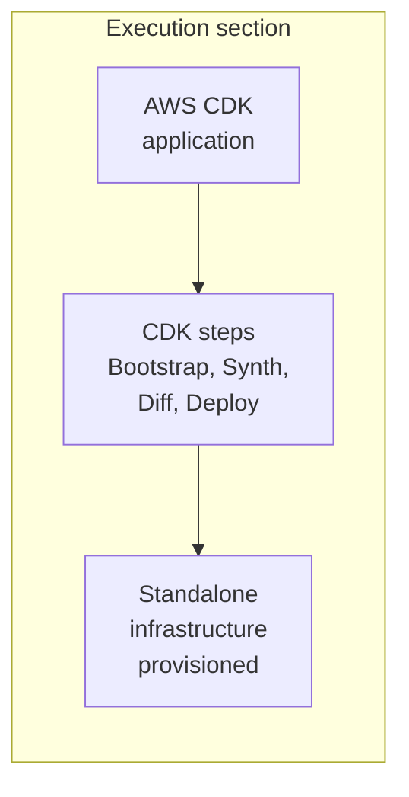
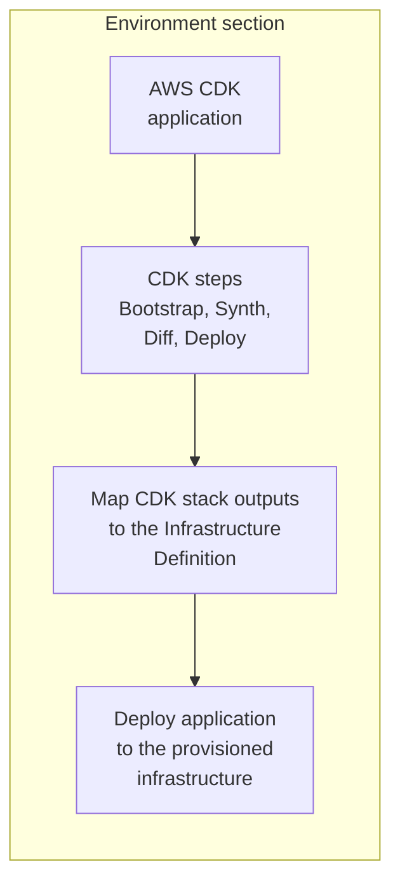

import DocImage from '@site/src/components/DocImage';

This topic explains AWS Cloud Development Kit (AWS CDK) provisioning modes in Harness and provides code examples for common deployment scenarios. AWS CDK allows you to provision infrastructure using familiar programming languages, either independently or as part of a deployment workflow.

---

## What will you learn in this topic?

- How to choose between [ad hoc provisioning](#ad-hoc-provisioning) and [dynamic provisioning](#dynamic-provisioning) for AWS CDK.
- How [dynamic provisioning maps CDK stack outputs](#dynamic-provisioning-by-deployment-type) for each supported deployment type.
- How to structure a CDK application and [reference its outputs in Harness](#example-ecs-infrastructure-provisioning) through an ECS example.

---

## Provisioning modes

Harness supports two AWS CDK provisioning modes:

- [Ad hoc provisioning](#ad-hoc-provisioning): Provision infrastructure as a standalone task without deploying an application in the same flow.
- [Dynamic provisioning](#dynamic-provisioning): Provision the target infrastructure and deploy your application to it in the same stage.

The pipeline steps are configured the same way for both modes. Choose the mode that matches your goal: use ad hoc provisioning to manage infrastructure on its own, and dynamic provisioning to provision and deploy in one stage. Multi-account deployments are supported, allowing you to deploy to different AWS accounts using a single connector by overriding the region and assuming a different IAM role. Go to [AWS CDK Provisioning](/docs/continuous-delivery/cd-infrastructure/aws-cdk/aws-cdk-provisioning#aws-connector-configuration-optional) to configure multi-account deployments.

:::note Service Instance licensing

Harness does not consume Service Instances (SIs) when you use AWS CDK for infrastructure provisioning alone, so you can provision infrastructure at no additional licensing cost. SI licensing applies only when Harness deploys an application to the provisioned infrastructure in the same stage or pipeline.

:::

Go to [Provisioning overview](/docs/continuous-delivery/cd-infrastructure/provisioning-overview) to understand Harness provisioning concepts and use cases.

---

## Ad hoc provisioning

Ad hoc provisioning lets you provision infrastructure as a standalone workflow without deploying an application in the same flow. This mode is useful to create test environments, set up shared resources, or make infrastructure changes independently of application deployments.

For ad hoc provisioning, add the AWS CDK steps to the **Execution** section of a CD Deploy stage. The steps provision your resources when the stage runs.



Example use cases:

- Provision a shared VPC or IAM resources that other pipelines consume.
- Stand up a temporary test environment for validation, then destroy it in a later step.
- Run a one-time infrastructure change defined in a CDK stack.

Go to [AWS CDK Provisioning](/docs/continuous-delivery/cd-infrastructure/aws-cdk/aws-cdk-provisioning) to configure the CDK steps in your pipeline.

---

## Dynamic provisioning

Dynamic provisioning creates the target infrastructure as part of the application deployment. Harness provisions the infrastructure first and then deploys the application to the newly created resources. Typically, dynamic provisioning is for temporary pre-production environments such as development, test, and QA. Production environments are usually pre-existing.

For dynamic provisioning, add the AWS CDK steps to the **Environment** section of a CD Deploy stage and map the CDK stack outputs to the Infrastructure Definition. Harness then deploys your application to the provisioned infrastructure in the same stage.



Example use cases:

- Provision an ECS cluster and deploy a containerized application to it in a single pipeline.
- Create an ephemeral Kubernetes namespace per pull request, deploy to it, and tear it down afterward.
- Provision AWS Lambda infrastructure and deploy the function in the same stage.

### Dynamic provisioning by deployment type

Each Harness deployment type, such as Kubernetes or AWS ECS, requires different CDK stack outputs to be mapped to its infrastructure settings. The following deployment types support dynamic provisioning with AWS CDK. Go to the topic for your deployment type to understand which CDK stack outputs are required.

- [Kubernetes infrastructure](/docs/continuous-delivery/deploy-srv-diff-platforms/kubernetes/define-your-kubernetes-target-infrastructure): Also used for Helm, Native Helm, and Kustomize deployment types.
- [AWS ECS](/docs/continuous-delivery/deploy-srv-diff-platforms/aws/ecs/ecs-deployment-tutorial): Elastic Container Service deployments.
- [AWS Lambda](/docs/continuous-delivery/deploy-srv-diff-platforms/aws/aws-lambda-deployments): Serverless function deployments.
- [Spot Elastigroup](/docs/continuous-delivery/deploy-srv-diff-platforms/aws/spot/spot-deployment): Spot instance group deployments.
- [Serverless.com framework for AWS Lambda](/docs/continuous-delivery/deploy-srv-diff-platforms/serverless/serverless-lambda-cd-quickstart): Serverless Framework deployments on AWS Lambda.
- [Tanzu Application Services](/docs/continuous-delivery/deploy-srv-diff-platforms/tanzu/tanzu-app-services-quickstart): Tanzu (Pivotal Cloud Foundry) deployments.
- [VM deployments using SSH](/docs/continuous-delivery/deploy-srv-diff-platforms/traditional/ssh-ng): Traditional virtual machine deployments over SSH.
- [Windows VM deployments using WinRM](/docs/continuous-delivery/deploy-srv-diff-platforms/traditional/win-rm-tutorial): Windows virtual machine deployments over WinRM.

To configure dynamic provisioning, go to the stage **Environment** tab in your Harness pipeline and select **AWS CDK** as the provisioner.

### Example: ECS infrastructure provisioning

The following example shows an AWS CDK TypeScript application that provisions infrastructure for an ECS deployment and exposes the stack outputs required by the Harness Infrastructure Definition. Expand the section to review the full application.

<details>
<summary>ECS CDK application (TypeScript)</summary>

```typescript
import * as cdk from 'aws-cdk-lib';
import { Construct } from 'constructs';
import * as ecs from 'aws-cdk-lib/aws-ecs';
import * as ec2 from 'aws-cdk-lib/aws-ec2';
import * as ecs_patterns from 'aws-cdk-lib/aws-ecs-patterns';

class EcsCdkStack extends cdk.Stack {
  constructor(scope: Construct, id: string, props?: cdk.StackProps) {
    super(scope, id, props);

    // Define a VPC (Virtual Private Cloud)
    const vpc = new ec2.Vpc(this, 'MyVpc', {
      maxAzs: 2, // Specify the number of availability zones
    });

    // Create an ECS cluster
    const cluster = new ecs.Cluster(this, 'MyCluster', {
      vpc,
    });

    // Define an ECS Fargate service using a sample container image
    new ecs_patterns.ApplicationLoadBalancedFargateService(this, 'MyFargateService', {
      cluster,
      memoryLimitMiB: 512,
      cpu: 256,
      taskImageOptions: {
        image: ecs.ContainerImage.fromRegistry('amazon/amazon-ecs-sample'),
      },
    });

    // Define an output for the AWS region (CfnOutput exports stack values)
    new cdk.CfnOutput(this, 'RegionOutput', {
      value: cdk.Aws.REGION,
      description: 'AWS region of the stack',
    });

    // Define an output for the ECS cluster name
    new cdk.CfnOutput(this, 'ClusterNameOutput', {
      value: cluster.clusterName,
      description: 'Name of the ECS cluster',
    });
  }
}

const app = new cdk.App();
new EcsCdkStack(app, 'EcsCdkStack');
```

</details>

### Reference CDK outputs in Harness

In the Harness Infrastructure Definition, you map CDK stack outputs to their corresponding settings using expressions in the format `<+provisioner.STACK_NAME.OUTPUT_NAME>`. For example:

- `<+provisioner.EcsCdkStack.RegionOutput>` references the AWS region output.
- `<+provisioner.EcsCdkStack.ClusterNameOutput>` references the ECS cluster name output.

The `CfnOutput` construct in your CDK application exports stack values that Harness can reference. Each output you define becomes available as an expression variable after the CDK Deploy step completes successfully.

:::note Two ways to reference stack outputs

Use the short `<+provisioner.STACK_NAME.OUTPUT_NAME>` form to map an output to an Infrastructure Definition setting during dynamic provisioning. To reference a Deploy step output elsewhere in the pipeline, use the full step path instead, as described in [Reference CDK Deploy output variables](/docs/continuous-delivery/cd-infrastructure/aws-cdk/aws-cdk-provisioning#reference-cdk-deploy-output-variables).

:::

<div align="center">
  <DocImage path={require('./static/0982655fcd2dfeb4043905e6f878f29c6005dd8d9e0d659898055fb2750d214f.png')} alt="Cluster Details settings with Map Dynamically Provisioned Infrastructure enabled and the Region and Cluster fields mapped to the EcsCdkStack.RegionOutput and EcsCdkStack.ClusterNameOutput expressions" width="80%" />
</div>

Go to [Use Harness expressions](/docs/platform/variables-and-expressions/harness-variables) to understand Harness expression syntax.

---

## Next steps

- [AWS CDK Provisioning](/docs/continuous-delivery/cd-infrastructure/aws-cdk/aws-cdk-provisioning): Configure the CDK steps in your pipeline.
- [Build your own CDK image](/docs/continuous-delivery/cd-infrastructure/aws-cdk/cdk-image-build): Customize CDK plugin images with specific versions and dependencies.
- [AWS ECS deployment tutorial](/docs/continuous-delivery/deploy-srv-diff-platforms/aws/ecs/ecs-deployment-tutorial): Provision ECS infrastructure with CDK and deploy containerized applications.
