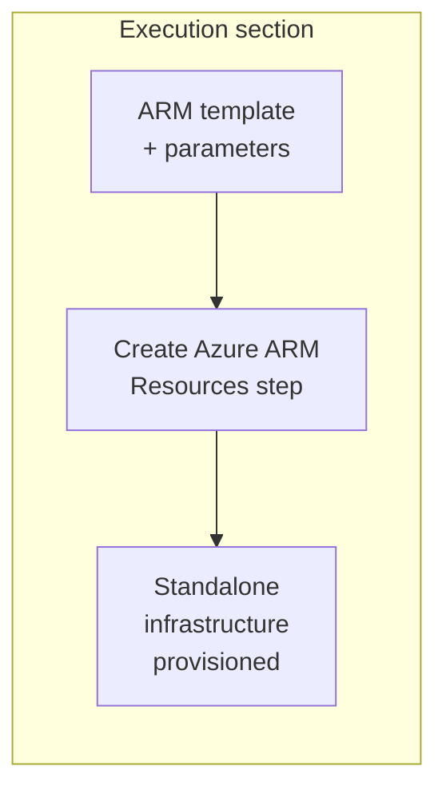
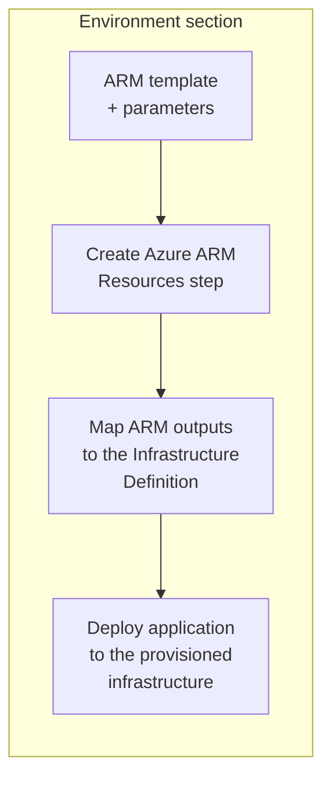

import Tabs from '@theme/Tabs';
import TabItem from '@theme/TabItem';

<style>
{`
  .tabs--full-width {
    width: 100%;
  }
  .tabs--full-width .tabs__item {
    flex: 1;
    text-align: center;
    justify-content: center;
  }
`}
</style>

Harness supports <a href="https://learn.microsoft.com/en-us/azure/azure-resource-manager/templates/overview" target="_blank" rel="noopener noreferrer">Azure Resource Manager (ARM) templates</a> as an infrastructure provisioner. You can use ARM templates to provision deployment target infrastructure in Azure or to provision any Azure resources.

This topic provides steps on using Harness to provision target environment resources using ARM templates.

<div style={{position: 'relative', paddingBottom: 'calc(52.2756% + 41px)', height: 0, width: '100%'}}>
  <iframe 
    src="https://demo.arcade.software/57cRTChuObO6aXqkuQFV?embed&embed_mobile=tab&embed_desktop=inline&show_copy_link=true" 
    title="Create an Azure ARM Provisioning Pipeline in Harness" 
    frameBorder="0" 
    loading="lazy" 
    webkitallowfullscreen="true" 
    mozallowfullscreen="true" 
    allowFullScreen={true}
    allow="clipboard-write; autoplay" 
    style={{position: 'absolute', top: 0, left: 0, width: '100%', height: '100%', colorScheme: 'light'}}
  />
</div>

---

## What you will learn from this topic

- How to understand the [supported deployment types, scopes, and deployment modes](#supported-deployment-types-scopes-and-modes) for Azure ARM provisioning.
- How to choose between [ad hoc provisioning](#ad-hoc-provisioning) and [dynamic provisioning](#dynamic-provisioning) for Azure ARM.
- How to [create the Azure ARM Resources step](#create-an-azure-arm-resources-step) and configure ARM templates and parameters.
- How to [roll back ARM provisioning](#create-an-azure-arm-rollback-step) using the Azure ARM Rollback step.
- How to [assemble complete pipeline examples](#pipeline-examples) for ad hoc and dynamic provisioning.

---

## Supported deployment types, scopes, and modes

- Harness ARM provisioning is supported in the following deployment types:
  - Basic
  - Canary
  - Blue-Green

  Harness ARM provisioning is used to <a href="/docs/continuous-delivery/deploy-srv-diff-platforms/azure/azure-web-apps-tutorial" target="_blank" rel="noopener noreferrer">deploy Azure Web Apps</a>. You can use ARM templates to provision any Azure resources, but deployment target provisioning is limited to Azure Web App deployments.

- Harness supports the following Azure ARM deployment scopes:
  - Tenant
  - Management Group
  - Subscription
  - Resource Group

- Harness supports the following deployment modes (configurable in YAML):  
  - **Incremental mode (default):** Supported for all scope types (Tenant, Management Group, Subscription, Resource Group). In Incremental mode, Resource Manager leaves unchanged resources that exist in the resource group but are not specified in the template.
  - **Complete mode:** Supported for Resource Group scope only. In Complete mode, Resource Manager deletes resources that exist in the resource group but are not specified in the template.

  For more information, go to <a href="https://docs.microsoft.com/en-us/azure/azure-resource-manager/templates/deployment-modes" target="_blank" rel="noopener noreferrer">Azure Resource Manager deployment modes</a> in the Azure documentation.

:::note Service Instance licensing

Harness does not consume Service Instances (SIs) when you use Azure ARM for infrastructure provisioning alone, so you can provision infrastructure at no additional licensing cost. SI licensing applies only when Harness deploys an application to the provisioned infrastructure in the same stage or pipeline.

:::

---

## Before you begin

- **Harness project access:** View, Create/Edit, and Execute permissions on Pipelines, Environments, and Infrastructure Definitions. Go to <a href="/docs/platform/role-based-access-control/rbac-in-harness" target="_blank" rel="noopener noreferrer">RBAC in Harness</a> to configure roles.
- **Azure connector:** A Harness Azure connector with permissions to provision resources in your target subscription or resource group. Go to <a href="/docs/platform/connectors/cloud-providers/add-a-microsoft-azure-connector" target="_blank" rel="noopener noreferrer">Add Microsoft Azure connector</a> to configure the connector and review required Azure roles for ARM provisioning.
- **Harness Delegate:** A delegate installed in an environment that can connect to Azure. Go to <a href="/docs/platform/delegates/install-delegates/overview" target="_blank" rel="noopener noreferrer">Delegate installation overview</a> to install a delegate.
- **ARM template file:** A JSON ARM template that defines the resources to provision. ARM templates must be in JSON format; Bicep is not supported.

---

## Provisioning modes

Harness supports two Azure ARM provisioning modes:

- [Ad hoc provisioning](#ad-hoc-provisioning): Provision infrastructure as a standalone task without deploying an application in the same flow.
- [Dynamic provisioning](#dynamic-provisioning): Provision the target infrastructure and deploy your application to it in the same stage.

The pipeline steps are configured the same way for both modes. Choose the mode that matches your goal: use ad hoc provisioning to manage infrastructure on its own, and dynamic provisioning to provision and deploy in one stage.

Go to <a href="/docs/continuous-delivery/cd-infrastructure/provisioning-overview" target="_blank" rel="noopener noreferrer">Provisioning overview</a> to understand Harness provisioning concepts and use cases.

### Ad hoc provisioning

Ad hoc provisioning lets you provision infrastructure as a standalone workflow without deploying an application in the same flow. This mode is useful to create test environments, set up shared resources, or make infrastructure changes independently of application deployments.

For ad hoc provisioning, add the Azure ARM Resources step to the **Execution** section of a CD Deploy stage. The step provisions your resources when the stage runs.



Example use cases:

- Provision a shared Azure resource group or storage account that other pipelines consume.
- Stand up a temporary test environment for validation, then destroy it in a later step.
- Run a one-time infrastructure change defined in an ARM template.

To configure ad hoc provisioning, go to [Create Azure ARM Resources step](#create-an-azure-arm-resources-step) and [Pipeline examples](#pipeline-examples).

### Dynamic provisioning

For dynamic provisioning, add the Azure ARM Resources step to the **Environment** section of a CD Deploy stage and map the ARM template outputs to the Infrastructure Definition. Harness then deploys your application to the provisioned infrastructure in the same stage.



Example use cases:

- Provision an Azure Web App resource group and deploy a containerized application to it in a single pipeline.
- Create ephemeral Azure resources per pull request, deploy to them, and tear them down afterward.

Each Harness deployment type requires different ARM template outputs to be mapped to its infrastructure settings. Go to the topic for your deployment type to understand which ARM template outputs are required:

- <a href="/docs/continuous-delivery/deploy-srv-diff-platforms/azure/azure-web-apps-tutorial" target="_blank" rel="noopener noreferrer">Azure Web Apps</a>: Web App deployments.
- <a href="/docs/continuous-delivery/deploy-srv-diff-platforms/tanzu/tanzu-app-services-quickstart" target="_blank" rel="noopener noreferrer">Tanzu Application Services</a>: Tanzu (Pivotal Cloud Foundry) deployments.
- <a href="/docs/continuous-delivery/deploy-srv-diff-platforms/traditional/ssh-ng" target="_blank" rel="noopener noreferrer">VM deployments using SSH</a>: Traditional virtual machine deployments over SSH.
- <a href="/docs/continuous-delivery/deploy-srv-diff-platforms/traditional/win-rm-tutorial" target="_blank" rel="noopener noreferrer">Windows VM deployments using WinRM</a>: Windows virtual machine deployments over WinRM.

To configure dynamic provisioning, go to [Create Azure ARM Resources step](#create-an-azure-arm-resources-step) and [Pipeline examples](#pipeline-examples).

---

## Create an Azure ARM Resources step

The Create Azure ARM Resources step provisions infrastructure resources using the ARM template file you provide.

Perform the following steps to add and configure the Create Azure ARM Resources step:

1. In your Harness CD Deploy stage, add the **Create Azure ARM Resources** step.
   - If you are using the step for dynamic infrastructure provisioning, add the step in the stage **Environment** tab.
   - If you are using the step for ad hoc provisioning, add the step in the stage **Execution** tab.
2. In **Name**, enter a name for the step.
3. Configure the step settings described in the sections below.
4. Select **Apply Changes**.

### Provisioner Identifier

In **Provisioner Identifier**, enter a unique value to reference the provisioning performed by this step in subsequent steps. The **Provisioner Identifier** is used by the Azure ARM Rollback step to identify which ARM deployment to roll back.

The **Provisioner Identifier** is project-wide, so ensure it is unique across all pipelines in the project. Coordinate with your team to prevent one pipeline from accidentally impacting the provisioning state of another pipeline.

### Azure Connector

In **Azure Connector**, select or create a Harness Azure connector that Harness will use to connect to Azure and provision the template. Go to <a href="/docs/platform/connectors/cloud-providers/add-a-microsoft-azure-connector" target="_blank" rel="noopener noreferrer">Add Microsoft Azure connector</a> to configure the connector.

### ARM Template File

In **ARM Template File**, provide the ARM template file to use for provisioning. The template must be in JSON format. You can store the template in the <a href="/docs/continuous-delivery/x-platform-cd-features/services/add-inline-manifests-using-file-store" target="_blank" rel="noopener noreferrer">Harness File Store</a>, a Git repository, or inline.

<details>
<summary>Example ARM template file for Azure Web App</summary>

This ARM template provisions a storage account, an App Service Plan, and an Azure Web App. Replace the placeholder values with your own.

```json
{
  "$schema": "https://schema.management.azure.com/schemas/2019-04-01/deploymentTemplate.json#",
  "contentVersion": "1.0.0.0",
  "parameters": {
    "storagePrefix": {
      "type": "string",
      "minLength": 3,
      "maxLength": 11
    },
    "storageSKU": {
      "type": "string",
      "defaultValue": "Standard_LRS",
      "allowedValues": [
        "Standard_LRS",
        "Standard_GRS",
        "Standard_RAGRS",
        "Standard_ZRS",
        "Premium_LRS",
        "Premium_ZRS",
        "Standard_GZRS",
        "Standard_RAGZRS"
      ]
    },
    "location": {
      "type": "string",
      "defaultValue": "ukwest"
    },
    "appServicePlanName": {
      "type": "string",
      "defaultValue": "exampleplan"
    },
    "webAppName": {
      "type": "string",
      "metadata": {
        "description": "Base name for the web app and app service plan"
      },
      "minLength": 2
    },
    "linuxFxVersion": {
      "type": "string",
      "defaultValue": "php|7.0",
      "metadata": {
        "description": "The runtime stack for the web app"
      }
    },
    "resourceTags": {
      "type": "object",
      "defaultValue": {
        "Environment": "Dev",
        "Project": "Tutorial"
      }
    }
  },
  "variables": {
    "uniqueStorageName": "[concat(parameters('storagePrefix'), uniqueString(resourceGroup().id))]",
    "webAppPortalName": "[concat(parameters('webAppName'), '-webapp')]"
  },
  "resources": [
    {
      "type": "Microsoft.Storage/storageAccounts",
      "apiVersion": "2021-09-01",
      "name": "[variables('uniqueStorageName')]",
      "location": "[parameters('location')]",
      "tags": "[parameters('resourceTags')]",
      "sku": {
        "name": "[parameters('storageSKU')]"
      },
      "kind": "StorageV2",
      "properties": {
        "supportsHttpsTrafficOnly": true
      }
    },
    {
      "type": "Microsoft.Web/serverfarms",
      "apiVersion": "2021-03-01",
      "name": "[parameters('appServicePlanName')]",
      "location": "[parameters('location')]",
      "tags": "[parameters('resourceTags')]",
      "sku": {
        "name": "B1",
        "tier": "Basic",
        "capacity": 1
      },
      "kind": "linux",
      "properties": {
        "reserved": true,
        "targetWorkerCount": 1,
        "targetWorkerSizeId": 0
      }
    },
    {
      "type": "Microsoft.Web/sites",
      "apiVersion": "2021-03-01",
      "name": "[variables('webAppPortalName')]",
      "location": "[parameters('location')]",
      "dependsOn": [
        "[parameters('appServicePlanName')]"
      ],
      "tags": "[parameters('resourceTags')]",
      "kind": "app",
      "properties": {
        "serverFarmId": "[resourceId('Microsoft.Web/serverfarms', parameters('appServicePlanName'))]",
        "siteConfig": {
          "linuxFxVersion": "[parameters('linuxFxVersion')]"
        }
      }
    }
  ],
  "outputs": {
    "storageEndpoint": {
      "type": "object",
      "value": "[reference(variables('uniqueStorageName')).primaryEndpoints]"
    }
  }
}
```

</details>

### ARM Parameter File

In **ARM Parameter File**, link the template parameters. Harness accepts ARM template parameters in a specific JSON format.

Harness provisioning requires you to remove the `$schema` and `contentVersion` keys from the parameters JSON due to limitations in the Azure Java SDK and REST APIs. Only the `parameters` object with key-value pairs is allowed.

<details>
<summary>Standard ARM parameter file format</summary>

Typically, an ARM parameters JSON file includes a `$schema` key that specifies the location of the JSON schema file, and a `contentVersion` key that specifies the version of the template:

```json
{
  "$schema": "https://schema.management.azure.com/schemas/2019-04-01/deploymentParameters.json#",
  "contentVersion": "1.0.0.0",
  "parameters": {
    "adminUsername": {
      "value": "johnsmith"
    },
    "adminPassword": {
      "value": "m2y&oD7k5$eE"
    },
    "dnsLabelPrefix": {
      "value": "genunique"
    }
  }
}
```

</details>

When you use parameters in Harness, remove the `$schema` and `contentVersion` keys. Provide only the `parameters` object:

```json
{
  "parameters": {
    "adminUsername": {
      "value": "johnsmith"
    },
    "adminPassword": {
      "value": "m2y&oD7k5$eE"
    },
    "dnsLabelPrefix": {
      "value": "genunique"
    }
  }
}
```

You can store the parameters file in the Harness File Store, a Git repository, or inline.

### Scope

In **Scope**, select the Azure scope for the deployment: **Tenant**, **Management Group**, **Subscription**, or **Resource Group**.

The scope you select determines which Azure resources can be provisioned and what additional configuration is required.

:::note Scope and template schema

The scope you select in the Create Azure ARM Resources step must match the `$schema` value in your ARM template file:

- **Resource Group:** `https://schema.management.azure.com/schemas/2019-04-01/deploymentTemplate.json#`
- **Subscription:** `https://schema.management.azure.com/schemas/2018-05-01/subscriptionDeploymentTemplate.json#`
- **Management Group:** `https://schema.management.azure.com/schemas/2019-08-01/managementGroupDeploymentTemplate.json#`
- **Tenant:** `https://schema.management.azure.com/schemas/2019-08-01/tenantDeploymentTemplate.json#`

:::

#### Subscription

When you select **Subscription** scope, provide:

- **Subscription ID:** The Azure subscription where the resources will be provisioned.
- **Location:** The Azure region for the deployment (for example, `South India`, `East US`, `West Europe`).

#### Resource Group

When you select **Resource Group** scope, provide:

- **Subscription ID:** The Azure subscription that contains the resource group.
- **Resource Group:** The resource group for the provisioned resources.

:::note Deployment mode

The deployment mode (Incremental or Complete) can be configured in the YAML. By default, Harness uses **Incremental** mode for all scope types. Complete mode is supported for Resource Group scope only.

- **Incremental mode:** Resource Manager leaves unchanged resources that exist in the resource group but are not specified in the template.
- **Complete mode:** Resource Manager deletes resources that exist in the resource group but are not specified in the template.

For more information, go to <a href="https://docs.microsoft.com/en-us/azure/azure-resource-manager/templates/deployment-modes" target="_blank" rel="noopener noreferrer">Azure Resource Manager deployment modes</a> in the Azure documentation.

:::

### ARM template outputs for dynamic provisioning

When using dynamic provisioning, your ARM template must include an `outputs` section that exports the values required by the Infrastructure Definition. Harness references these outputs using the expression `<+provisioner.PROVISIONER_ID.OUTPUT_NAME>`.

For example, for Azure Web App deployments, your ARM template should export the web app name and deployment slot:

```json
{
  "$schema": "https://schema.management.azure.com/schemas/2018-05-01/subscriptionDeploymentTemplate.json#",
  "contentVersion": "1.0.0.0",
  "resources": [
    // Your resource definitions here
  ],
  "outputs": {
    "webAppName": {
      "type": "string",
      "value": "[variables('webAppName')]"
    },
    "slotName": {
      "type": "string",
      "value": "staging"
    },
    "resourceGroupName": {
      "type": "string",
      "value": "[resourceGroup().name]"
    }
  }
}
```

In the Infrastructure Definition, reference these outputs:

- **Web App:** `<+provisioner.dynamicarm.webAppName>`
- **Deployment Slot:** `<+provisioner.dynamicarm.slotName>`

Replace `dynamicarm` with your **Provisioner Identifier** value from the Create Azure ARM Resources step.

### Azure ARM Resources step - YAML example

The following YAML examples demonstrate different scope configurations. Replace the placeholder values with your own.

<Tabs className="tabs--full-width">
  <TabItem value="subscription" label="Subscription scope" default>

```yaml
- step:
    type: AzureCreateARMResource
    name: Azure Create ARM Resource
    identifier: AzureCreateARMResource_1
    spec:
      provisionerIdentifier: arm_subscription_001     # Replace with a unique provisioner ID
      configuration:
        connectorRef: your_azure_connector            # Replace with your Azure connector
        template:
          store:
            type: Harness
            spec:
              files:
                - /arm-template.json                  # Replace with your template path
        scope:
          type: Subscription
          spec:
            subscription: 12d2db62-5aa9-471d-84bb-faa489b3e319  # Replace with your subscription ID
            location: South India                     # Replace with your Azure region
        parameters:
          store:
            type: Harness
            spec:
              files:
                - /arm-parameters.json                # Replace with your parameters path
    timeout: 10m
```

  </TabItem>
  <TabItem value="resourcegroup" label="Resource Group scope">

```yaml
- step:
    type: AzureCreateARMResource
    name: Azure Create ARM Resource
    identifier: AzureCreateARMResource_1
    spec:
      provisionerIdentifier: arm_rg_001               # Replace with a unique provisioner ID
      configuration:
        connectorRef: your_azure_connector            # Replace with your Azure connector
        template:
          store:
            type: Harness
            spec:
              files:
                - /Azure ARM/azuredeploy.json         # Replace with your template path
        scope:
          type: ResourceGroup
          spec:
            subscription: <+input>
            resourceGroup: <+input>
            mode: Incremental                         # Or Complete for Resource Group scope
        parameters:
          store:
            type: Harness
            spec:
              files:
                - /Azure ARM/azuredeploy.parameters.json  # Replace with your parameters path
    timeout: 10m
```

  </TabItem>
</Tabs>
---

## Create an Azure ARM Rollback step

The Azure ARM Rollback step rolls back the provisioning performed by a Create Azure ARM Resources step. Rollback is supported for Resource Group scope only.

To roll back Azure ARM provisioning performed by a Create Azure ARM Resources step, add an Azure ARM Rollback step and reference the **Provisioner Identifier** from the Create Azure ARM Resources step.

:::note Rollback support

Rollback is supported for Resource Group scope only. If you select a scope other than Resource Group in the Create Azure ARM Resources step, the Azure ARM Rollback step will fail. ARM templates that create a resource group with a storage account (`Microsoft.Storage/storageAccounts`) cannot be rolled back successfully due to limitations in the Azure-generated rollback template.

:::

Perform the following steps to add and configure the Azure ARM Rollback step:

1. In your Harness CD Deploy stage, add the **Azure ARM Rollback** step to the **Rollback** section.
2. In **Name**, enter a name for the step.
3. In **Provisioner Identifier**, enter the same **Provisioner Identifier** value you used in the Create Azure ARM Resources step.
4. Select **Apply Changes**.

<details>
<summary>Azure ARM Rollback step YAML example</summary>

```yaml
- step:
    type: AzureARMRollback
    name: Azure ARM Rollback
    identifier: AzureARMRollback_1
    spec:
      provisionerIdentifier: arm_webapp_001          # Must match the Create step Provisioner Identifier
    timeout: 10m
```
</details>

When Harness runs a stage that performs provisioning using an ARM template, Harness generates a template for the existing resource group and saves it before starting the ARM deployment. During rollback, this template is used to restore the resource group to its state before the deployment started.

<details>
<summary>Example rollback log output</summary>

**During deployment:**

```
[harness-arm-test]
Starting ARM Deployment for Resource Group scope ...
Resource Group - [harness-arm-test]
Mode - [INCREMENTAL]
Deployment Name - [harness_558_1616014910588]
ARM Deployment request sent successfully
```

**During rollback:**

```
Starting ARM Rollback for Resource Group scope ...
Resource Group - [anil-harness-arm-test]
Mode - [COMPLETE]
Deployment Name - [harness_rollback_367_1616019421845]
ARM Rollback request sent successfully
```

</details>

---

## Advanced step settings

In the **Advanced** tab of the Create Azure ARM Resources and Azure ARM Rollback steps, you can configure the following options:

- <a href="/docs/platform/delegates/manage-delegates/select-delegates-with-selectors" target="_blank" rel="noopener noreferrer">Delegate Selector</a>
- <a href="/docs/platform/pipelines/step-skip-condition-settings" target="_blank" rel="noopener noreferrer">Conditional Execution</a>
- <a href="/docs/platform/pipelines/failure-handling/define-a-failure-strategy-on-stages-and-steps" target="_blank" rel="noopener noreferrer">Failure Strategy</a>
- <a href="/docs/platform/pipelines/looping-strategies/looping-strategies-matrix-repeat-and-parallelism" target="_blank" rel="noopener noreferrer">Looping Strategy</a>
- <a href="/docs/platform/governance/policy-as-code/harness-governance-overview" target="_blank" rel="noopener noreferrer">Policy Enforcement</a>

---

## Pipeline examples

The following examples demonstrate ad hoc and dynamic provisioning with the Create Azure ARM Resources step. Replace the connector references, subscription, resource group, and file paths with your own values.

### Ad hoc provisioning

The following example demonstrates ad hoc provisioning with the Create Azure ARM Resources step in the **Execution** section of a CD Deploy stage. This example uses a minimal ARM template at Subscription scope that outputs parameter values.

<details>
<summary>Ad hoc provisioning pipeline YAML</summary>

```yaml
pipeline:
  name: Azure ARM Ad Hoc Provisioning
  identifier: Azure_ARM_AdHoc_Provisioning
  projectIdentifier: DoNotDeleteKrishna              # Replace with your project
  orgIdentifier: default                              # Replace with your org
  tags: {}
  stages:
    - stage:
        name: ARM Provisioning
        identifier: ARM_Provisioning
        description: ""
        type: Deployment
        spec:
          deploymentType: AzureWebApp
          service:
            serviceRef: Azure_Shell_Provision_Service  # Replace with your service
          environment:
            environmentRef: CDK_Dev_Environment        # Replace with your environment
            deployToAll: false
            infrastructureDefinitions:
              - identifier: your_infra                 # Replace with your infrastructure definition
          execution:
            steps:
              - step:
                  type: AzureCreateARMResource
                  name: Provision Azure Resources
                  identifier: ARMStep
                  spec:
                    provisionerIdentifier: adhocarm
                    configuration:
                      connectorRef: account.AzureFunctionSupportForAutomationTest  # Replace with your Azure connector
                      template:
                        store:
                          type: Harness
                          spec:
                            files:
                              - /arm-template.json     # Path to your ARM template in Harness File Store
                      scope:
                        type: Subscription
                        spec:
                          subscription: 12d2db62-5aa9-471d-84bb-faa489b3e319  # Replace with your subscription ID
                          location: South India        # Replace with your Azure region
                      parameters:
                        store:
                          type: Harness
                          spec:
                            files:
                              - /arm-parameters.json   # Path to your parameters file in Harness File Store
                  timeout: 10m
            rollbackSteps:
              - step:
                  type: AzureARMRollback
                  name: Rollback ARM Provisioning
                  identifier: Rollback_ARM_Provisioning
                  spec:
                    provisionerIdentifier: adhocarm
                  timeout: 10m
        tags: {}
        failureStrategies:
          - onFailure:
              errors:
                - AllErrors
              action:
                type: StageRollback
```

**ARM Template (`/arm-template.json`):**

```json
{
  "$schema": "https://schema.management.azure.com/schemas/2018-05-01/subscriptionDeploymentTemplate.json#",
  "contentVersion": "1.0.0.0",
  "parameters": {
    "key1": {
      "type": "string",
      "defaultValue": "defaultValue1",
      "metadata": {
        "description": "Sample parameter 1"
      }
    },
    "key2": {
      "type": "string",
      "defaultValue": "defaultValue2",
      "metadata": {
        "description": "Sample parameter 2"
      }
    }
  },
  "variables": {},
  "resources": [],
  "outputs": {
    "key1Output": {
      "type": "string",
      "value": "[parameters('key1')]"
    },
    "key2Output": {
      "type": "string",
      "value": "[parameters('key2')]"
    }
  }
}
```

**ARM Parameters (`/arm-parameters.json`):**

```json
{
  "key1": {
    "value": "value10000000"
  },
  "key2": {
    "value": "value2"
  }
}
```

</details>

### Dynamic provisioning

The following example demonstrates dynamic provisioning with the Create Azure ARM Resources step in the **Environment** section of a CD Deploy stage. The ARM template outputs are mapped to the Infrastructure Definition, allowing Harness to deploy to the provisioned resources.

:::warning Map ARM outputs to Infrastructure Definition

For dynamic provisioning to work, you must map ARM template **outputs** to the Infrastructure Definition fields. The example below shows how to reference template outputs using `<+provisioner.PROVISIONER_ID.OUTPUT_NAME>`.

If you use `<+input>` for infrastructure fields in dynamic provisioning, the deployment will fail with `ResourceNotFound` errors because Harness cannot resolve the resource names.

:::

<details>
<summary>Dynamic provisioning pipeline YAML</summary>

```yaml
pipeline:
  name: Azure ARM Dynamic Provisioning
  identifier: Azure_ARM_Dynamic_Provisioning
  projectIdentifier: DoNotDeleteKrishna              # Replace with your project
  orgIdentifier: default                              # Replace with your org
  tags: {}
  stages:
    - stage:
        name: ARM Dynamic Provisioning
        identifier: ARM_Dynamic_Provisioning
        description: ""
        type: Deployment
        spec:
          deploymentType: AzureWebApp
          service:
            serviceRef: Azure_Shell_Provision_Service  # Replace with your service
          environment:
            environmentRef: CDK_Dev_Environment        # Replace with your environment
            deployToAll: false
            provisioner:
              steps:
                - step:
                    type: AzureCreateARMResource
                    name: Provision Azure Resources
                    identifier: ARMStep
                    spec:
                      provisionerIdentifier: dynamicarm
                      configuration:
                        connectorRef: account.AzureFunctionSupportForAutomationTest  # Replace with your Azure connector
                        template:
                          store:
                            type: Harness
                            spec:
                              files:
                                - /arm-template.json          # Path to your ARM template in Harness File Store
                        scope:
                          type: Subscription
                          spec:
                            subscription: 12d2db62-5aa9-471d-84bb-faa489b3e319  # Replace with your subscription ID
                            location: South India             # Replace with your Azure region
                        parameters:
                          store:
                            type: Harness
                            spec:
                              files:
                                - /arm-parameters.json        # Path to your parameters file in Harness File Store
                    timeout: 10m
              rollbackSteps:
                - step:
                    type: AzureARMRollback
                    name: Rollback
                    identifier: Rollback
                    spec:
                      provisionerIdentifier: dynamicarm
                    timeout: 10m
            infrastructureDefinitions:
              - identifier: Testinfra
                inputs:
                  identifier: Testinfra
                  type: AzureWebApp
                  spec:
                    # Map ARM template outputs to infrastructure fields
                    # In this example, we reference the key1Output and key2Output from the ARM template
                    connectorRef: account.AzureFunctionSupportForAutomationTest
                    subscriptionId: 12d2db62-5aa9-471d-84bb-faa489b3e319
                    resourceGroup: <+provisioner.dynamicarm.key1Output>  # References ARM template output
                    webApp: <+provisioner.dynamicarm.key2Output>         # References ARM template output
          execution:
            steps:
              - step:
                  type: AzureSlotDeployment
                  name: Deploy to Azure Web App
                  identifier: AzureSlotDeployment_1
                  spec:
                    webApp: <+infra.webApp>
                    deploymentSlot: production
                  timeout: 20m
            rollbackSteps:
              - step:
                  type: AzureWebAppRollback
                  name: WebApp rollback
                  identifier: webAppRollback
                  timeout: 20m
                  spec: {}
        tags: {}
        failureStrategies:
          - onFailure:
              errors:
                - AllErrors
              action:
                type: StageRollback
```

**ARM Template (`/arm-template.json`) for Dynamic Provisioning:**

For dynamic provisioning with Azure Web Apps, your ARM template should provision the Web App and export its name. Here is an extended example:

```json
{
  "$schema": "https://schema.management.azure.com/schemas/2018-05-01/subscriptionDeploymentTemplate.json#",
  "contentVersion": "1.0.0.0",
  "parameters": {
    "webAppName": {
      "type": "string",
      "metadata": {
        "description": "Name of the Azure Web App"
      }
    },
    "resourceGroupName": {
      "type": "string",
      "metadata": {
        "description": "Name of the resource group"
      }
    },
    "location": {
      "type": "string",
      "defaultValue": "southindia",
      "metadata": {
        "description": "Location for all resources"
      }
    }
  },
  "variables": {
    "appServicePlanName": "[concat(parameters('webAppName'), '-plan')]"
  },
  "resources": [
    {
      "type": "Microsoft.Resources/resourceGroups",
      "apiVersion": "2021-04-01",
      "name": "[parameters('resourceGroupName')]",
      "location": "[parameters('location')]",
      "properties": {}
    },
    {
      "type": "Microsoft.Resources/deployments",
      "apiVersion": "2021-04-01",
      "name": "webAppDeployment",
      "resourceGroup": "[parameters('resourceGroupName')]",
      "dependsOn": [
        "[resourceId('Microsoft.Resources/resourceGroups', parameters('resourceGroupName'))]"
      ],
      "properties": {
        "mode": "Incremental",
        "template": {
          "$schema": "https://schema.management.azure.com/schemas/2019-04-01/deploymentTemplate.json#",
          "contentVersion": "1.0.0.0",
          "resources": [
            {
              "type": "Microsoft.Web/serverfarms",
              "apiVersion": "2021-02-01",
              "name": "[variables('appServicePlanName')]",
              "location": "[parameters('location')]",
              "sku": {
                "name": "B1",
                "tier": "Basic"
              },
              "kind": "linux",
              "properties": {
                "reserved": true
              }
            },
            {
              "type": "Microsoft.Web/sites",
              "apiVersion": "2021-02-01",
              "name": "[parameters('webAppName')]",
              "location": "[parameters('location')]",
              "dependsOn": [
                "[resourceId('Microsoft.Web/serverfarms', variables('appServicePlanName'))]"
              ],
              "properties": {
                "serverFarmId": "[resourceId('Microsoft.Web/serverfarms', variables('appServicePlanName'))]",
                "siteConfig": {
                  "linuxFxVersion": "NODE|14-lts"
                }
              }
            }
          ]
        }
      }
    }
  ],
  "outputs": {
    "webAppName": {
      "type": "string",
      "value": "[parameters('webAppName')]"
    },
    "resourceGroupName": {
      "type": "string",
      "value": "[parameters('resourceGroupName')]"
    }
  }
}
```

**ARM Parameters for Dynamic Provisioning:**

```json
{
  "webAppName": {
    "value": "mywebapp12345"
  },
  "resourceGroupName": {
    "value": "harness-arm-rg"
  },
  "location": {
    "value": "southindia"
  }
}
```

</details>

---

## Next steps

- Go to <a href="/docs/continuous-delivery/deploy-srv-diff-platforms/azure/azure-web-apps-tutorial" target="_blank" rel="noopener noreferrer">Azure Web Apps deployment tutorial</a> to provision Azure Web App infrastructure with ARM and deploy applications.
- Go to <a href="/docs/continuous-delivery/cd-infrastructure/provisioning-overview" target="_blank" rel="noopener noreferrer">Provisioning overview</a> to understand Harness provisioning concepts and use cases across all supported provisioners.
