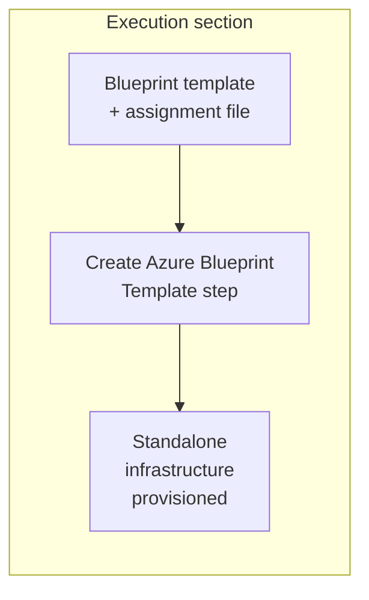
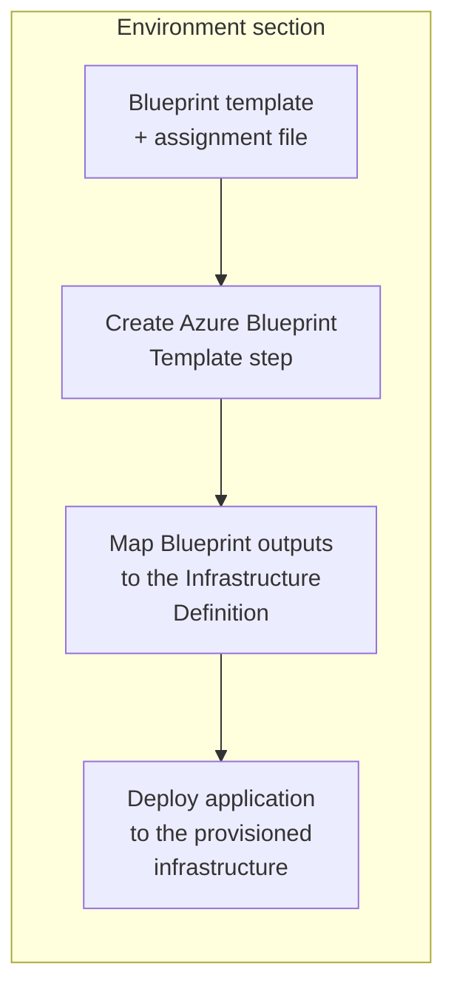

import Tabs from '@theme/Tabs';
import TabItem from '@theme/TabItem';

<style>
{`
  .tabs--full-width {
    width: 100%;
  }
  .tabs--full-width .tabs__item {
    flex: 1;
    text-align: center;
    justify-content: center;
  }
`}
</style>

Harness supports <a href="https://learn.microsoft.com/en-us/azure/governance/blueprints/overview" target="_blank" rel="noopener noreferrer">Azure Blueprints</a> as an infrastructure provisioner. You can use Azure Blueprints to provision resources that adhere to your organization's standards, patterns, and requirements. You can package ARM templates, resource groups, policy and role assignments, and much more into a Blueprint. See <a href="https://www.youtube.com/watch?v=cQ9D-d6KkMY" target="_blank" rel="noopener noreferrer">this video</a> from Microsoft Developer for more details.

This topic provides steps on using Harness to provision target environment resources using Azure Blueprints.

---

## What you will learn from this topic

- How to understand the [supported deployment types and scopes](#supported-deployment-types-and-scopes) for Azure Blueprint provisioning.
- How to choose between [ad hoc provisioning](#ad-hoc-provisioning) and [dynamic provisioning](#dynamic-provisioning) for Azure Blueprints.
- How to [create an Azure Blueprint Template step](#create-an-azure-bp-resources-step) and configure Blueprint templates and assignment files.
- How to [assemble complete pipeline examples](#pipeline-examples) for ad hoc and dynamic provisioning.

---

## Supported deployment types and scopes

- Harness Azure Blueprint provisioning supports the following deployment types:
  - **Basic**
  - **Canary**
  - **Blue-Green** for Azure Web Apps

  Harness Azure Blueprint provisioning is used to <a href="/docs/continuous-delivery/deploy-srv-diff-platforms/azure/azure-web-apps-tutorial" target="_blank" rel="noopener noreferrer">deploy Azure Web Apps</a>. You can use Azure Blueprints to provision any Azure resources, but deployment target provisioning is limited to Azure Web App deployments.

- Harness supports the following Azure Blueprint assignment scopes:
  - Tenant
  - Management Group
  - Subscription
  - Resource Group

  The **Create Azure BP Resources** step supports selecting **Subscription** or **Management Group** as the assignment scope.

- Blueprint templates must be in JSON format. Bicep is not supported.
- Incremental mode is supported for Subscription, Resource Group, Management Group, and Tenant scopes.
- Complete mode is supported only for Resource Group scope.
- Blueprint rollback is supported only for Resource Group scope.

:::note Service Instance licensing

Harness does not consume Service Instances (SIs) when you use Azure Blueprints for infrastructure provisioning alone, so you can provision infrastructure at no additional licensing cost. SI licensing applies only when Harness deploys an application to the provisioned infrastructure in the same stage or pipeline.

:::

---

## Before you begin

- **Harness project access:** View, Create/Edit, and Execute permissions on Pipelines, Environments, and Infrastructure Definitions. Go to <a href="/docs/platform/role-based-access-control/rbac-in-harness" target="_blank" rel="noopener noreferrer">RBAC in Harness</a> to configure roles.
- **Azure connector:** A Harness Azure connector with permissions to provision resources in your target subscription or resource group. Go to <a href="/docs/platform/connectors/cloud-providers/add-a-microsoft-azure-connector" target="_blank" rel="noopener noreferrer">Add Microsoft Azure connector</a> to configure the connector and review required Azure roles for Blueprint provisioning.
- **Harness Delegate:** A delegate installed in an environment that can connect to Azure. Go to <a href="/docs/platform/delegates/install-delegates/overview" target="_blank" rel="noopener noreferrer">Delegate installation overview</a> to install a delegate.
- **Azure Blueprint template:** A JSON Blueprint template that defines the resources to provision. Blueprint templates must be in JSON format; Bicep is not supported.

---

## Provisioning modes

Harness supports two Azure Blueprint provisioning modes:

- [Ad hoc provisioning](#ad-hoc-provisioning): Provision infrastructure as a standalone task without deploying an application in the same flow.
- [Dynamic provisioning](#dynamic-provisioning): Provision the target infrastructure and deploy your application to it in the same stage.

The **Create Azure BP Resources** step is configured similarly for both modes, but it is added in different sections of the stage.

Go to <a href="/docs/continuous-delivery/cd-infrastructure/provisioning-overview" target="_blank" rel="noopener noreferrer">Provisioning overview</a> to understand Harness provisioning concepts and use cases.

### Ad hoc provisioning

Ad hoc provisioning lets you provision infrastructure as a standalone workflow without deploying an application in the same flow. This mode is useful to create test environments, set up shared resources, or make infrastructure changes independently of application deployments.

For ad hoc provisioning, add the Azure Blueprint Template step to the **Execution** section of a CD Deploy stage. The step provisions your resources when the stage runs.



Example use cases:

- Provision a shared Azure resource group that adheres to organizational policies.
- Stand up a temporary test environment for validation, then destroy it in a later step.
- Run a one-time infrastructure change defined in a Blueprint template.

To configure ad hoc provisioning, go to [Create Azure Blueprint Template step](#create-an-azure-bp-resources-step) and [Pipeline examples](#pipeline-examples).

### Dynamic provisioning

Dynamic provisioning provisions the target infrastructure as part of the deployment process and then deploys the application to the provisioned infrastructure in the same stage.

The dynamic provisioning workflow consists of the following steps:

1. **Provision the target infrastructure:** The **Create Azure BP Resources** step provisions the infrastructure using the Azure Blueprint.
2. **Obtain Blueprint outputs:** The provisioning step generates outputs that identify or provide details about the provisioned infrastructure.
3. **Map the outputs to the Infrastructure Definition:** Use the provisioner outputs to dynamically configure the Infrastructure Definition for the deployment target.
4. **Deploy the application:** Harness deploys the application to the provisioned infrastructure.


For dynamic provisioning, add the **Create Azure BP Resources** step to the **Environment** section of the Deploy stage. Configure the Infrastructure Definition to use outputs from the provisioning step.

For example, if the Blueprint provisioning step produces `namespace` and `releaseName` outputs, you can reference them in the Infrastructure Definition using Harness expressions:

```yaml
namespace: <+provisioner.namespace>
releaseName: <+provisioner.releaseName>
```

The output names depend on the resources provisioned by your Azure Blueprint and the deployment target. `namespace` and `releaseName` are examples for a Kubernetes deployment and are not predefined Azure Blueprint outputs.

Example use cases:

- Provision an Azure Web App resource group and deploy a containerized application to it in a single pipeline.
- Create ephemeral Azure resources per pull request, deploy to them, and tear them down afterward.

Each Harness deployment type requires different Blueprint outputs to be mapped to its infrastructure settings. Go to the topic for your deployment type to understand which Blueprint outputs are required:

- <a href="/docs/continuous-delivery/deploy-srv-diff-platforms/azure/azure-web-apps-tutorial" target="_blank" rel="noopener noreferrer">Azure Web Apps</a>: Web App deployments.
- <a href="/docs/continuous-delivery/deploy-srv-diff-platforms/tanzu/tanzu-app-services-quickstart" target="_blank" rel="noopener noreferrer">Tanzu Application Services</a>: Tanzu (Pivotal Cloud Foundry) deployments.
- <a href="/docs/continuous-delivery/deploy-srv-diff-platforms/traditional/ssh-ng" target="_blank" rel="noopener noreferrer">VM deployments using SSH</a>: Traditional virtual machine deployments over SSH.
- <a href="/docs/continuous-delivery/deploy-srv-diff-platforms/traditional/win-rm-tutorial" target="_blank" rel="noopener noreferrer">Windows VM deployments using WinRM</a>: Windows virtual machine deployments over WinRM.

To configure dynamic provisioning, go to [Create Azure Blueprint Template step](#create-an-azure-bp-resources-step) and [Pipeline examples](#pipeline-examples).

---

## Create an Azure BP Resources step

The **Create Azure BP Resources** step provisions infrastructure resources using the Blueprint template file and assignment file you provide.

Perform the following steps to add and configure the Create Azure BP Resources step:

1. In your Harness CD Deploy stage, add the **Create Azure BP Resources** step.
   - If you are using the step for dynamic infrastructure provisioning, add the step in the stage **Environment** tab.
   - If you are using the step for ad hoc provisioning, add the step in the stage **Execution** tab.
2. In **Name**, enter a name for the step.
3. Configure the step settings described in the sections below.
4. Select **Apply Changes**.

### Azure Connector

In **Azure Connector**, select or create a Harness Azure connector that Harness will use to connect to Azure and provision the Blueprint. Go to <a href="/docs/platform/connectors/cloud-providers/add-a-microsoft-azure-connector" target="_blank" rel="noopener noreferrer">Add Microsoft Azure connector</a> to configure the connector.

### Scope

Select the scope for your Blueprint assignment:

- **Subscriptions**: Assign the Blueprint at the subscription level.
- **Management Groups**: Assign the Blueprint at the management group level.

The `targetScope` property in your Blueprint template identifies the scope.

:::note Management group scope requirements

When assigning a Blueprint at the management group level, your assignment file (`assign.json`) must include a `scope` property (`properties.scope`). The scope is the target subscription of the Blueprint assignment in the format `/subscriptions/{subscriptionId}`. For management group level assignments, this property is required.

:::

### Assignment Name

In **Assignment Name**, enter a unique name to give the assignment of the Blueprint.

When you assign a Blueprint to a subscription, you provide an assignment name to identify that specific assignment instance. The **Assignment Name** should be unique within the scope of the subscription where the Blueprint is being assigned.

The Blueprint assignment configuration determines how the Blueprint is assigned, including the assignment name, scope, parameters, and other assignment properties. Depending on the configuration and source used in Pipeline Studio, these values can be provided through the step configuration and the Blueprint template source.

### Azure Blueprint Template

In **Azure Blueprint Template**, provide the Blueprint template used for provisioning. The Blueprint template defines the resources, parameters, and other configuration for the Blueprint.

The Blueprint assignment configuration determines how the Blueprint is assigned, including the assignment name, scope, parameters, and other assignment properties.

When you store the Blueprint template in Git, configure the following:

- **Git Connector:** Select the connector used to access the repository.
- **Repository:** Enter the Git repository containing the Blueprint template.
- **Branch:** Select the branch containing the template.
- **Folder Path:** Enter the path to the folder containing the Blueprint template.

<details>
<summary>Example Blueprint assignment file</summary>

The following example shows a management group level assignment file with identity, location, Blueprint ID, resource groups, parameters, and scope properties.

```json
{  
    "identity": {  
        "type": "SystemAssigned"  
    },  
    "location": "westus2",  
    "properties": {  
        "blueprintId": "/providers/Microsoft.Management/managementGroups/HarnessARMTest/providers/Microsoft.Blueprint/blueprints/101-boilerplate-mng/versions/v2",  
        "resourceGroups": {  
            "SingleRG": {  
                "name": "mng-001",  
                "location": "eastus"  
            }  
        },  
        "locks": {  
            "mode": "none"  
        },  
        "parameters": {  
            "principalIds": {  
                "value": "0000000-0000-0000-0000-0000000000"  
            },  
            "genericBlueprintParameter": {  
                "value": "test"  
            }  
        },  
        "scope": "/subscriptions/0000000-0000-0000-0000-0000000000"  
    }  
}
```

By assigning the Blueprint at the subscription level, the resources and configurations defined within the Blueprint are applied to that particular subscription. This allows you to enforce standardization and consistency within the specific Azure environment you are targeting.

While Azure Management Groups provide a way to organize and manage multiple subscriptions, the Blueprint itself is not directly assigned to a Management Group. However, the policies and RBAC assignments within the Blueprint can be inherited by Management Groups and their associated subscriptions.

</details>

### Create Azure BP Resources step - YAML example

The following YAML example demonstrates a Git resource configuration. Replace the placeholder values with your own.

<details>
<summary>YAML example</summary>

```yaml
- step:
    type: AzureCreateBPResource
    name: Azure Create Blueprint Resource # Replace with your step name
    identifier: AzureCreateBPResource_1 # Replace with a unique step identifier
    spec:
      configuration:
        connectorRef: account.azure_connector # Replace with your Azure connector
        assignmentName: blueprint-assignment-001 # Replace with a unique Blueprint assignment name
        scope: Subscription # Replace with the required scope: Subscription or Management Group
        template:
          store:
            type: Git
            spec:
              connectorRef: account.git_connector # Replace with your Git connector
              gitFetchType: Branch
              folderPath: infra/blueprints/subscription/ # Replace with the folder containing your Blueprint template
              repoName: azure_arm_templates # Replace with your Git repository name
              branch: main # Replace with your Git branch
    timeout: 10m # Replace with the required timeout
```
</details>

### Advanced step settings

In **Advanced** tab, you can use the following options:

- <a href="/docs/platform/delegates/manage-delegates/select-delegates-with-selectors" target="_blank" rel="noopener noreferrer">Delegate Selector</a>
- <a href="/docs/platform/pipelines/step-skip-condition-settings" target="_blank" rel="noopener noreferrer">Conditional Execution</a>
- <a href="/docs/platform/pipelines/failure-handling/define-a-failure-strategy-on-stages-and-steps" target="_blank" rel="noopener noreferrer">Failure Strategy</a>
- <a href="/docs/platform/pipelines/looping-strategies/looping-strategies-matrix-repeat-and-parallelism" target="_blank" rel="noopener noreferrer">Looping Strategy</a>
- <a href="/docs/platform/governance/policy-as-code/harness-governance-overview" target="_blank" rel="noopener noreferrer">Policy Enforcement</a>

---

## Pipeline examples

The following examples show complete pipeline YAML for ad hoc provisioning and dynamic provisioning using Azure Blueprints.

### Ad hoc provisioning example

This example provisions infrastructure using Azure Blueprints without deploying an application. The Create Azure Blueprint Template step is in the **Execution** section of the stage.

<details>
<summary>Ad hoc provisioning pipeline YAML</summary>

```yaml
pipeline:
  name: Azure Blueprint Ad hoc Provisioning # Replace with your pipeline name
  identifier: Azure_Blueprint_Ad_hoc_Provisioning # Replace with a unique pipeline identifier
  projectIdentifier: default_project # Replace with your Harness project identifier
  orgIdentifier: default # Replace with your Harness organization identifier
  tags: {}
  stages:
    - stage:
        name: Provision Blueprint # Replace with your stage name
        identifier: Provision_Blueprint # Replace with a unique stage identifier
        type: Deployment
        spec:
          serviceConfig:
            serviceDefinition:
              type: Kubernetes
              spec:
                artifacts:
                  sidecars: []
                manifests: []
            service:
              name: service2 # Replace with your service name
              identifier: service2 # Replace with your service identifier
          infrastructure:
            infrastructureDefinition:
              type: KubernetesDirect
              spec:
                connectorRef: account.K8sConnector # Replace with your Kubernetes connector
                namespace: default # Replace with your Kubernetes namespace
                releaseName: azure-blueprint # Replace with your release name
            environment:
              name: env2 # Replace with your environment name
              identifier: env2 # Replace with your environment identifier
              type: Production # Replace with the appropriate environment type
            allowSimultaneousDeployments: true
          execution:
            steps:
              - step:
                  type: AzureCreateBPResource
                  name: Azure Create Blueprint Resource # Replace with your step name
                  identifier: AzureCreateBPResource_1 # Replace with a unique step identifier
                  spec:
                    configuration:
                      connectorRef: account.azure_connector # Replace with your Azure connector
                      assignmentName: blueprint-assignment-001 # Replace with a unique Blueprint assignment name
                      scope: Subscription # Replace with Subscription or Management Group
                      template:
                        store:
                          type: Git
                          spec:
                            connectorRef: account.git_connector # Replace with your Git connector
                            gitFetchType: Branch
                            folderPath: infra/blueprints/subscription/ # Replace with the folder containing your Blueprint template
                            repoName: azure_arm_templates # Replace with your Git repository name
                            branch: main # Replace with your Git branch
                  timeout: 10m # Replace with the required timeout
            rollbackSteps:
              - step:
                  type: ShellScript
                  name: Rollback # Replace with your rollback step name
                  identifier: Rollback # Replace with a unique step identifier
                  spec:
                    shell: Bash
                    executionTarget: {}
                    source:
                      type: Inline
                      spec:
                        script: echo rollback
                    environmentVariables: []
                    outputVariables: []
                  timeout: 10m # Replace with the required timeout
        failureStrategies:
          - onFailure:
              errors:
                - AllErrors
              action:
                type: StageRollback
        variables:
          - name: resourceNamePrefix # Replace with your variable name
            type: String
            default: ""
            value: cdpsanitysuites-rollingdeploy # Replace with your variable value
```

</details>

### Dynamic provisioning example

This example provisions infrastructure using Azure Blueprints in the **Environment** section and maps the Blueprint outputs to the Infrastructure Definition. The application is then deployed to the provisioned infrastructure in the **Execution** section.

<details>
<summary>Dynamic provisioning pipeline YAML</summary>

This example uses a Shell Script Provision bridge step after Azure Blueprint because Azure Blueprint does not emit outputs in the format that Infrastructure Definitions require (`namespace`, `releaseName`, `resourceGroup`, etc.). The Shell Script step captures or queries the provisioned resource details and writes them to `$PROVISIONER_OUTPUT_PATH`.

```yaml
pipeline:
  name: AzureBP_K8s_Dynamic_Provisioning
  identifier: AzureBP_K8s_Dynamic_Provisioning
  tags:
    provisioner: azure-blueprint
    deployment: kubernetes
  projectIdentifier: default_project              # Replace with your project identifier
  orgIdentifier: default                           # Replace with your organization identifier
  stages:
    - stage:
        name: Provision and Deploy to K8s
        identifier: Provision_and_Deploy_to_K8s
        description: "Azure Blueprint + K8s deployment with dynamic provisioning"
        type: Deployment
        spec:
          deploymentType: Kubernetes
          service:
            serviceRef: k8s_service                 # Replace with your Kubernetes service reference
          environment:
            environmentRef: k8s_env                 # Replace with your environment reference
            deployToAll: false
            provisioner:
              steps:
                - step:
                    type: AzureCreateBPResource
                    name: Provision Azure Blueprint
                    identifier: Provision_Azure_Blueprint
                    spec:
                      configuration:
                        connectorRef: account.azure_connector    # Replace with your Azure connector
                        assignmentName: k8s-blueprint-assignment  # Replace with a unique assignment name
                        scope: Subscription
                        template:
                          store:
                            type: Git
                            spec:
                              connectorRef: account.git_connector  # Replace with your Git connector
                              gitFetchType: Branch
                              folderPath: infra/blueprints/subscription/
                              repoName: azure_arm_templates        # Replace with your Git repository
                              branch: main
                    timeout: 10m
                - step:
                    type: ShellScriptProvision
                    name: Capture Kubernetes Outputs
                    identifier: Capture_K8s_Outputs
                    spec:
                      source:
                        type: Inline
                        spec:
                          script: |
                            echo "=== Capturing outputs for Kubernetes Infrastructure Definition ==="
                            
                            # Generate Kubernetes namespace and release name
                            # These can be derived from Azure Blueprint outputs or generated dynamically
                            NAMESPACE="bp-k8s-${HARNESS_BUILD_ID:-$(date +%s)}"
                            RELEASE_NAME="azure-bp-rel-${HARNESS_BUILD_ID:-$(date +%s)}"
                            
                            echo "Namespace: $NAMESPACE"
                            echo "Release Name: $RELEASE_NAME"
                            
                            # Write outputs to $PROVISIONER_OUTPUT_PATH in JSON format
                            echo "{\"namespace\": \"$NAMESPACE\", \"releaseName\": \"$RELEASE_NAME\"}" > "$PROVISIONER_OUTPUT_PATH"
                            
                            echo "=== Outputs written to $PROVISIONER_OUTPUT_PATH ==="
                            cat "$PROVISIONER_OUTPUT_PATH"
                      environmentVariables: []
                    timeout: 10m
              rollbackSteps:
                - step:
                    type: ShellScript
                    name: Rollback Azure Blueprint
                    identifier: Rollback_Azure_Blueprint
                    spec:
                      shell: Bash
                      onDelegate: true
                      source:
                        type: Inline
                        spec:
                          script: |
                            echo "=== Rolling back Azure Blueprint provisioning ==="
                            echo "Blueprint Assignment: k8s-blueprint-assignment"
                            echo "Namespace: <+pipeline.stages.Provision_and_Deploy_to_K8s.spec.provisioner.steps.Capture_K8s_Outputs.output.namespace>"
                            echo "Cleaning up dynamically provisioned infrastructure..."
                      environmentVariables: []
                      outputVariables: []
                    timeout: 10m
            infrastructureDefinitions:
              - identifier: k8s_dynamic_infra
                inputs:
                  identifier: k8s_dynamic_infra
                  type: KubernetesDirect
                  spec:
                    connectorRef: account.k8s_connector           # Replace with your Kubernetes connector
                    namespace: <+provisioner.namespace>            # From Shell Script Provision step output
                    releaseName: <+provisioner.releaseName>        # From Shell Script Provision step output
                    provisioner: Capture_K8s_Outputs               # REQUIRED: Identifies which provisioner step to use
          execution:
            steps:
              - step:
                  type: ShellScript
                  name: Verify Provisioned Infrastructure
                  identifier: Verify_Provisioned_Infrastructure
                  spec:
                    shell: Bash
                    onDelegate: true
                    source:
                      type: Inline
                      spec:
                        script: |
                          echo "=== Dynamically provisioned infrastructure verified ==="
                          echo "Azure Blueprint Assignment: k8s-blueprint-assignment"
                          echo "K8s Namespace: <+pipeline.stages.Provision_and_Deploy_to_K8s.spec.provisioner.steps.Capture_K8s_Outputs.output.namespace>"
                          echo "K8s Release: <+pipeline.stages.Provision_and_Deploy_to_K8s.spec.provisioner.steps.Capture_K8s_Outputs.output.releaseName>"
                          echo "Infrastructure resolved successfully."
                    environmentVariables: []
                    outputVariables: []
                  timeout: 10m
            rollbackSteps: []
        tags: {}
        failureStrategies:
          - onFailure:
              errors:
                - AllErrors
              action:
                type: StageRollback
```

</details>

---

## Next steps

- Go to <a href="/docs/continuous-delivery/deploy-srv-diff-platforms/azure/azure-web-apps-tutorial" target="_blank" rel="noopener noreferrer">Deploy Azure Web Apps</a> to understand how to deploy applications to Azure Web App infrastructure provisioned with Blueprints.
- Go to <a href="/docs/continuous-delivery/cd-infrastructure/provisioning-overview" target="_blank" rel="noopener noreferrer">Provisioning overview</a> to understand Harness provisioning concepts across all cloud providers.
