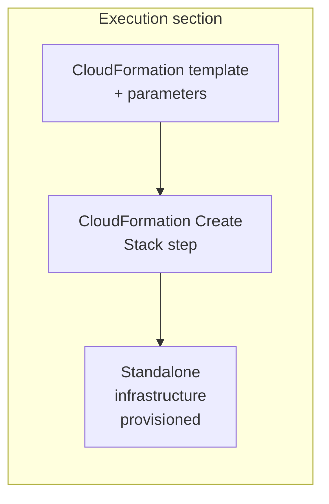
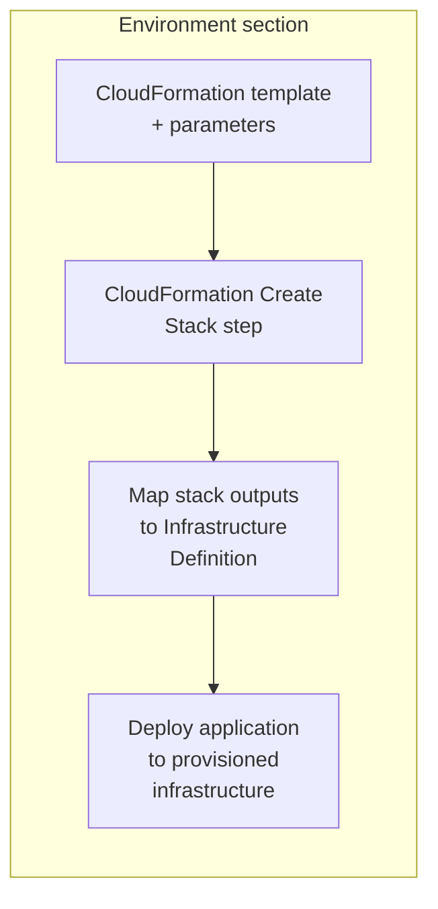

import Tabs from '@theme/Tabs';
import TabItem from '@theme/TabItem';

<style>
{`
  .tabs--full-width {
    width: 100%;
  }
  .tabs--full-width .tabs__item {
    flex: 1;
    text-align: center;
    justify-content: center;
  }
`}
</style>

Harness supports <a href="https://aws.amazon.com/cloudformation/" target="_blank" rel="noopener noreferrer">AWS CloudFormation</a> as an infrastructure provisioner. You can use CloudFormation templates to provision AWS resources as part of your deployment process.

Harness can provision any AWS resource that is supported by CloudFormation. You can use CloudFormation to provision infrastructure for deployments or to provision any AWS resources on demand.

---

## What you will learn from this topic

- How to understand the [supported deployment types and provisioning modes](#supported-deployment-types-and-modes) for CloudFormation provisioning.
- How to choose between [ad hoc provisioning](#ad-hoc-provisioning) and [dynamic provisioning](#dynamic-provisioning) for CloudFormation.
- How to use CloudFormation steps to [create](#cloudformation-steps), [delete](#cloudformation-steps), and [rollback](#cloudformation-steps) stacks in your pipelines.
- How to configure [complete pipeline examples](#pipeline-examples) for both ad hoc and dynamic provisioning modes.

---

## Supported deployment types and modes

- Harness CloudFormation provisioning is supported in the following deployment types:
  - Basic
  - Canary
  - Blue-Green

- Harness can provision any AWS resource that is supported by CloudFormation.

- CloudFormation templates must be in JSON or YAML format.

:::note Service Instance licensing

Harness does not consume Service Instances (SIs) when you use CloudFormation for infrastructure provisioning alone, so you can provision infrastructure at no additional licensing cost. SI licensing applies only when Harness deploys an application to the provisioned infrastructure in the same stage or pipeline.

:::

:::note AWS OIDC connector support

CloudFormation provisioning supports AWS connectors with OIDC authentication. This requires Delegate version `854xx` or later. For more information, refer to <a href="/docs/platform/connectors/cloud-providers/ref-cloud-providers/aws-connector-settings-reference" target="_blank" rel="noopener noreferrer">AWS connector settings reference</a>.

:::

---

## Before you begin

- **Harness project access:** View, Create/Edit, and Execute permissions on Pipelines, Environments, and Infrastructure Definitions. For more information, refer to <a href="/docs/platform/role-based-access-control/rbac-in-harness" target="_blank" rel="noopener noreferrer">RBAC in Harness</a> to configure roles.
- **AWS connector:** A Harness AWS connector with permissions to provision resources in your target AWS account. For more information, refer to <a href="/docs/platform/connectors/cloud-providers/ref-cloud-providers/aws-connector-settings-reference" target="_blank" rel="noopener noreferrer">AWS connector settings reference</a> to configure the connector and review required AWS IAM roles for CloudFormation provisioning.
- **Harness Delegate:** A delegate installed in an environment that can connect to AWS. For more information, refer to <a href="/docs/platform/delegates/install-delegates/overview" target="_blank" rel="noopener noreferrer">Delegate installation overview</a> to install a delegate.
- **CloudFormation template:** A JSON or YAML CloudFormation template that defines the AWS resources to provision.

---

## Provisioning modes

Harness supports two CloudFormation provisioning modes:

- [Ad hoc provisioning](#ad-hoc-provisioning): Provision infrastructure as a standalone task without deploying an application in the same flow.
- [Dynamic provisioning](#dynamic-provisioning): Provision the target infrastructure and deploy your application to it in the same stage.

The pipeline steps are configured the same way for both modes. Choose the mode that matches your goal: use ad hoc provisioning to manage infrastructure on its own, and dynamic provisioning to provision and deploy in one stage.

For more information, refer to <a href="/docs/continuous-delivery/cd-infrastructure/provisioning-overview" target="_blank" rel="noopener noreferrer">Provisioning overview</a> to understand Harness provisioning concepts and use cases.

### Ad hoc provisioning

Ad hoc provisioning lets you provision infrastructure as a standalone workflow without deploying an application in the same flow. This mode is useful to create test environments, set up shared resources, or make infrastructure changes independently of application deployments.

For ad hoc provisioning, add the CloudFormation Create Stack step to the **Execution** section of a CD Deploy stage. The step provisions your resources when the stage runs.



Example use cases:

- Provision a shared AWS VPC, subnets, and security groups that other pipelines consume.
- Stand up a temporary test environment for validation, then destroy it in a later step.
- Run a one-time infrastructure change defined in a CloudFormation template.

### Dynamic provisioning

For dynamic provisioning, add the CloudFormation Create Stack step to the **Environment** section of a CD Deploy stage and map the CloudFormation stack outputs to the Infrastructure Definition. Harness then deploys your application to the provisioned infrastructure in the same stage.



Example use cases:

- Provision an AWS EC2 instance and deploy your application to it in a single pipeline.
- Create ephemeral AWS resources per pull request, deploy to them, and tear them down afterward.

For detailed steps on configuring dynamic provisioning, refer to <a href="/docs/continuous-delivery/cd-infrastructure/cloudformation-infra/provision-target-deployment-infra-dynamically-with-cloud-formation" target="_blank" rel="noopener noreferrer">Provision target deployment infrastructure dynamically with CloudFormation</a>.

---

## CloudFormation steps

Harness provides the following CloudFormation steps for your CD pipelines:

- **CloudFormation Create Stack:** Provisions AWS resources using a CloudFormation template. For more information, refer to <a href="/docs/continuous-delivery/cd-infrastructure/cloudformation-infra/provision-with-the-cloud-formation-create-stack-step" target="_blank" rel="noopener noreferrer">Provision with the CloudFormation Create Stack step</a>.

- **CloudFormation Delete Stack:** Deletes a CloudFormation stack to clean up provisioned resources. For more information, refer to <a href="/docs/continuous-delivery/cd-infrastructure/cloudformation-infra/remove-provisioned-infra-with-the-cloud-formation-delete-step" target="_blank" rel="noopener noreferrer">Remove provisioned infrastructure with the CloudFormation Delete step</a>.

- **CloudFormation Rollback Stack:** Rolls back a CloudFormation stack to the last successfully provisioned version. For more information, refer to <a href="/docs/continuous-delivery/cd-infrastructure/cloudformation-infra/rollback-provisioned-infra-with-the-cloud-formation-rollback-step" target="_blank" rel="noopener noreferrer">Rollback provisioned infrastructure with the CloudFormation Rollback step</a>.

---

## Pipeline examples

The following examples show complete pipeline YAML for ad hoc provisioning and dynamic provisioning using CloudFormation.

### Ad hoc provisioning example

This example provisions infrastructure using CloudFormation without deploying an application. The CloudFormation Create Stack step is in the **Execution** section of the stage.

<details>
<summary>Ad hoc provisioning pipeline YAML</summary>

```yaml
# CloudFormation Ad Hoc Provisioning Pipeline
# This pipeline demonstrates ad hoc provisioning: CloudFormation provisions infrastructure
# as a standalone task in the Execution section without deploying an application.

pipeline:
  name: CloudFormation Ad Hoc Provisioning
  identifier: CloudFormation_Ad_Hoc_Provisioning
  projectIdentifier: your_project  # Replace with your project identifier
  orgIdentifier: default
  tags:
    provisioner: cloudformation

  # Pipeline variables for CloudFormation stack configuration
  variables:
    - name: stack_name
      type: String
      description: CloudFormation stack name
      required: true
      value: my-adhoc-stack
    - name: aws_region
      type: String
      description: AWS Region for stack deployment
      required: true
      value: us-east-2

  stages:
    - stage:
        name: Provision Infrastructure
        identifier: Provision_Infrastructure
        description: Ad hoc CloudFormation provisioning in Deploy stage
        type: Deployment
        spec:
          deploymentType: AwsLambda
          service:
            serviceRef: your_service         # Replace with your service reference
            serviceInputs:
              serviceDefinition:
                type: AwsLambda
                spec:
                  artifacts:
                    primary:
                      primaryArtifactRef: <+input>
                      sources: <+input>

          environment:
            environmentRef: your_environment  # Replace with your environment reference
            deployToAll: false
            infrastructureDefinitions:
              - identifier: your_infrastructure  # Replace with your infrastructure definition

          # Execution section: CloudFormation steps run here for ad hoc provisioning
          execution:
            steps:
              # Step 1: Create CloudFormation Stack
              - step:
                  type: CreateStack           # CloudFormation Create Stack step type
                  name: Create S3 Bucket Stack
                  identifier: Create_Stack
                  spec:
                    # Provisioner Identifier links Create, Delete, and Rollback steps
                    provisionerIdentifier: s3_provisioner
                    configuration:
                      connectorRef: your_aws_connector  # AWS connector reference
                      region: <+pipeline.variables.aws_region>
                      stackName: <+pipeline.variables.stack_name>

                      # Template file configuration - using inline template
                      templateFile:
                        type: Inline           # Options: Inline, S3Url, Git
                        spec:
                          templateBody: |
                            AWSTemplateFormatVersion: '2010-09-09'
                            Description: Ad hoc S3 bucket provisioning example

                            # CloudFormation Resources section
                            Resources:
                              S3Bucket:
                                Type: AWS::S3::Bucket
                                Properties:
                                  BucketName: !Sub 'my-bucket-${AWS::AccountId}'
                                  Tags:
                                    - Key: ManagedBy
                                      Value: Harness
                                    - Key: Purpose
                                      Value: AdHoc-Provisioning

                            # Outputs section: Required for Harness to access CloudFormation stack outputs
                            Outputs:
                              BucketName:
                                Description: Name of the S3 bucket
                                Value: !Ref S3Bucket
                              BucketArn:
                                Description: ARN of the S3 bucket
                                Value: !GetAtt S3Bucket.Arn
                              Region:
                                Description: AWS Region
                                Value: !Ref AWS::Region
                  timeout: 10m

              # Step 2: Display CloudFormation Stack Outputs
              - step:
                  type: ShellScript
                  name: Display Stack Outputs
                  identifier: Display_Stack_Outputs
                  spec:
                    shell: Bash
                    executionTarget: {}
                    source:
                      type: Inline
                      spec:
                        script: |
                          echo "=========================================="
                          echo "CloudFormation Stack Outputs"
                          echo "=========================================="
                          echo "Stack Name:    <+pipeline.variables.stack_name>"
                          echo "Region:        <+pipeline.variables.aws_region>"
                          echo ""
                          echo "=== CloudFormation Outputs ==="
                          # Ad hoc provisioning expression format:
                          # <+pipeline.stages.STAGE_ID.spec.execution.steps.STEP_ID.output.OUTPUT_NAME>
                          echo "Bucket Name:   <+pipeline.stages.Provision_Infrastructure.spec.execution.steps.Create_Stack.output.BucketName>"
                          echo "Bucket ARN:    <+pipeline.stages.Provision_Infrastructure.spec.execution.steps.Create_Stack.output.BucketArn>"
                          echo "Region:        <+pipeline.stages.Provision_Infrastructure.spec.execution.steps.Create_Stack.output.Region>"
                          echo "=========================================="
                  timeout: 10m

              # Step 3: Delete CloudFormation Stack
              - step:
                  type: DeleteStack           # CloudFormation Delete Stack step type
                  name: Delete S3 Bucket Stack
                  identifier: Delete_Stack
                  spec:
                    configuration:
                      type: Inline             # Options: Inline, InheritFromCreate
                      spec:
                        connectorRef: your_aws_connector
                        region: <+pipeline.variables.aws_region>
                        stackName: <+pipeline.variables.stack_name>
                      connectorRef: your_aws_connector  # Required at configuration level
                  timeout: 10m

            # Rollback steps: Execute if any step in execution fails
            rollbackSteps:
              - step:
                  type: RollbackStack         # CloudFormation Rollback Stack step type
                  name: Rollback Stack
                  identifier: Rollback_Stack
                  spec:
                    configuration:
                      # Must match the Create Stack provisionerIdentifier
                      provisionerIdentifier: s3_provisioner
                  timeout: 10m

        tags: {}
        failureStrategies:
          - onFailure:
              errors:
                - AllErrors
              action:
                type: StageRollback  # Triggers rollback steps on failure
```

</details>

### Dynamic provisioning example

This example provisions infrastructure using CloudFormation in the **Environment** section. CloudFormation stack outputs are accessible in execution steps. The application is then deployed to the provisioned infrastructure in the **Execution** section.

:::info CloudFormation dynamic provisioning limitations
CloudFormation does **not** automatically map stack outputs to infrastructure definition fields (unlike AWS CDK). Infrastructure definitions must be pre-configured in the environment. CloudFormation outputs are accessible in execution steps via expressions.
:::

<details>
<summary>Dynamic provisioning pipeline YAML</summary>

```yaml
# CloudFormation Dynamic Provisioning Pipeline - Working Example
# This pipeline demonstrates dynamic provisioning: CloudFormation provisions infrastructure
# in the environment.provisioner section, and CloudFormation outputs are accessible in execution steps.

pipeline:
  name: CloudFormation Dynamic Provisioning
  identifier: CloudFormation_Dynamic_Provisioning
  projectIdentifier: your_project  # Replace with your project identifier
  orgIdentifier: default
  tags:
    provisioner: cloudformation

  # Pipeline variables for CloudFormation stack configuration
  variables:
    - name: stack_name
      type: String
      value: my-dynamic-stack
    - name: aws_region
      type: String
      value: us-east-2

  stages:
    - stage:
        name: Dynamic Provision and Deploy
        identifier: Dynamic_Provision_Deploy
        type: Deployment
        spec:
          deploymentType: AwsLambda
          service:
            serviceRef: your_service         # Replace with your service reference
            serviceInputs:
              serviceDefinition:
                type: AwsLambda
                spec:
                  artifacts:
                    primary:
                      primaryArtifactRef: <+input>
                      sources: <+input>

          # Environment configuration with provisioner section
          # This is where "dynamic provisioning" happens - CloudFormation runs BEFORE execution
          environment:
            environmentRef: your_environment  # Replace with your environment reference
            deployToAll: false

            # PROVISIONER SECTION: CloudFormation runs here (before execution section)
            # This is the key difference between ad hoc and dynamic provisioning
            provisioner:
              steps:
                # CloudFormation Create Stack step
                - step:
                    type: CreateStack                      # CloudFormation Create Stack step type
                    name: Create Lambda Infrastructure
                    identifier: Create_Stack               # Used in expressions to reference outputs
                    timeout: 10m
                    spec:
                      # Provisioner Identifier: Links Create Stack and Rollback Stack
                      provisionerIdentifier: lambda_provisioner

                      configuration:
                        connectorRef: your_aws_connector             # AWS connector reference
                        region: <+pipeline.variables.aws_region>     # AWS region for stack deployment
                        stackName: <+pipeline.variables.stack_name>  # CloudFormation stack name

                        # CloudFormation template configuration
                        templateFile:
                          type: Inline  # Options: Inline, S3Url, Git
                          spec:
                            templateBody: |
                              AWSTemplateFormatVersion: '2010-09-09'
                              Description: Dynamic Lambda infrastructure provisioning

                              # Parameters allow runtime configuration
                              Parameters:
                                EnvironmentStage:
                                  Type: String
                                  Default: dev
                                  Description: Environment stage name

                              # CloudFormation Resources section
                              Resources:
                                LambdaExecutionRole:
                                  Type: AWS::IAM::Role
                                  Properties:
                                    AssumeRolePolicyDocument:
                                      Version: '2012-10-17'
                                      Statement:
                                        - Effect: Allow
                                          Principal:
                                            Service: lambda.amazonaws.com
                                          Action: sts:AssumeRole
                                    ManagedPolicyArns:
                                      - arn:aws:iam::aws:policy/service-role/AWSLambdaBasicExecutionRole
                                    Tags:
                                      - Key: ManagedBy
                                        Value: Harness

                              # Outputs section: REQUIRED to access CloudFormation stack values in Harness
                              # These outputs become available in execution steps via expressions
                              Outputs:
                                Region:
                                  Description: AWS Region for Lambda deployment
                                  Value: !Ref AWS::Region
                                Stage:
                                  Description: Environment stage
                                  Value: !Ref EnvironmentStage
                                RoleArn:
                                  Description: Lambda execution role ARN
                                  Value: !GetAtt LambdaExecutionRole.Arn

              # Rollback steps: Execute if Create Stack or any Execution step fails
              rollbackSteps:
                - step:
                    type: RollbackStack                    # CloudFormation Rollback Stack step type
                    name: Rollback Lambda Infrastructure
                    identifier: Rollback_Stack
                    timeout: 10m
                    spec:
                      configuration:
                        # Must match the Create Stack provisionerIdentifier
                        provisionerIdentifier: lambda_provisioner

            # Infrastructure Definition: References pre-configured infrastructure in the environment
            # IMPORTANT: For CloudFormation, the infrastructure definition must be stored in the
            # environment and cannot be dynamically mapped from CloudFormation outputs
            infrastructureDefinitions:
              - identifier: your_infrastructure  # Must match infrastructure definition ID in environment

          # EXECUTION SECTION: Runs AFTER infrastructure is provisioned
          # At this point, CloudFormation stack is already created
          execution:
            steps:
              # Display provisioned infrastructure details
              - step:
                  type: ShellScript
                  name: Display Provisioned Infrastructure
                  identifier: Display_Provisioned_Infrastructure
                  timeout: 10m
                  spec:
                    shell: Bash
                    executionTarget: {}
                    source:
                      type: Inline
                      spec:
                        script: |
                          echo "=========================================="
                          echo "CloudFormation Dynamic Provisioning"
                          echo "=========================================="
                          echo ""
                          echo "=== CloudFormation Outputs (from provisioner) ==="
                          # Dynamic provisioning expression format for Execution section:
                          # <+stage.spec.provisioner.steps.STEP_ID.output.OUTPUT_NAME>
                          echo "Region:    <+stage.spec.provisioner.steps.Create_Stack.output.Region>"
                          echo "Stage:     <+stage.spec.provisioner.steps.Create_Stack.output.Stage>"
                          echo "Role ARN:  <+stage.spec.provisioner.steps.Create_Stack.output.RoleArn>"
                          echo ""
                          echo "=== Infrastructure Definition ==="
                          echo "Infra Name: <+infra.name>"
                          echo "Infra ID:   <+infra.identifier>"
                          echo "Connector:  <+infra.connectorRef>"
                          echo "Region:     <+infra.region>"
                          echo ""
                          echo "=== Pipeline Execution ==="
                          echo "Stack Name:    <+pipeline.variables.stack_name>"
                          echo "Pipeline:      <+pipeline.name>"
                          echo "Execution ID:  <+pipeline.executionId>"
                          echo "=========================================="

            rollbackSteps: []

        failureStrategies:
          - onFailure:
              errors:
                - AllErrors
              action:
                type: StageRollback  # Triggers provisioner rollback steps on failure
```

</details>

---

## Next steps

- <a href="/docs/continuous-delivery/cd-infrastructure/cloudformation-infra/provision-target-deployment-infra-dynamically-with-cloud-formation" target="_blank" rel="noopener noreferrer">Provision target deployment infrastructure dynamically with CloudFormation</a>: Configure dynamic provisioning to create infrastructure at runtime.
- <a href="/docs/continuous-delivery/deploy-srv-diff-platforms/kubernetes/kubernetes-deployments-overview" target="_blank" rel="noopener noreferrer">Kubernetes deployments</a>: Deploy applications to Kubernetes infrastructure provisioned with CloudFormation.
- <a href="/docs/continuous-delivery/cd-infrastructure/provisioning-overview" target="_blank" rel="noopener noreferrer">Provisioning overview</a>: Understand Harness provisioning concepts across all cloud providers.
