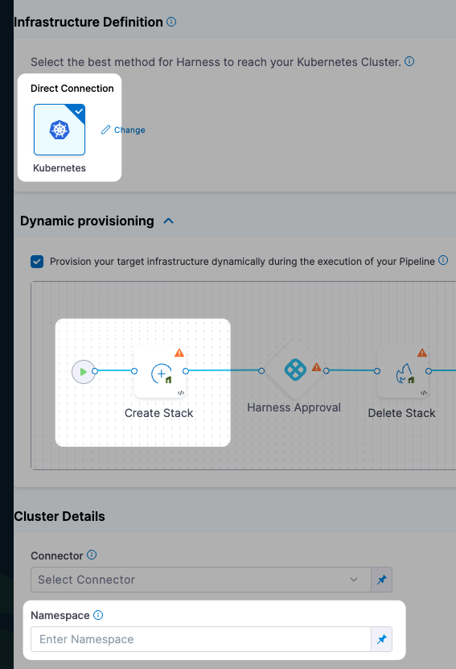
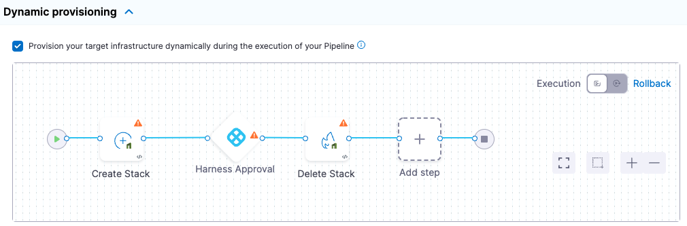
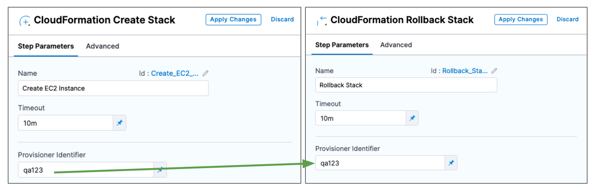
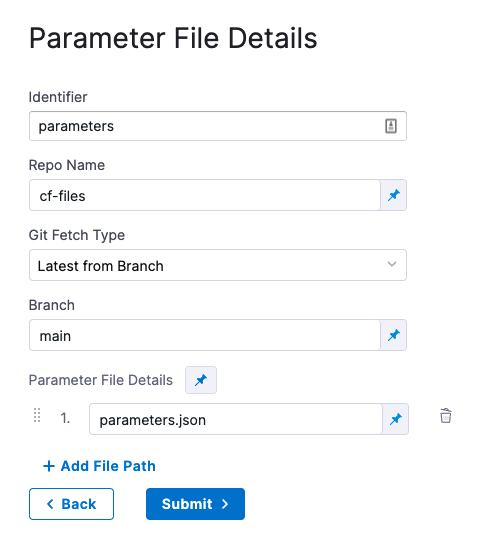
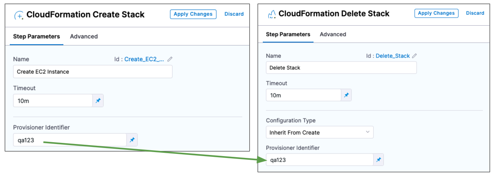
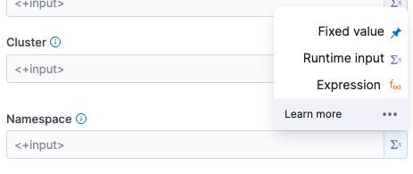
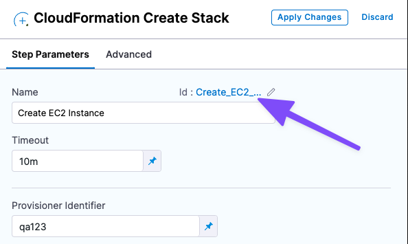
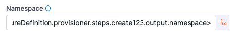
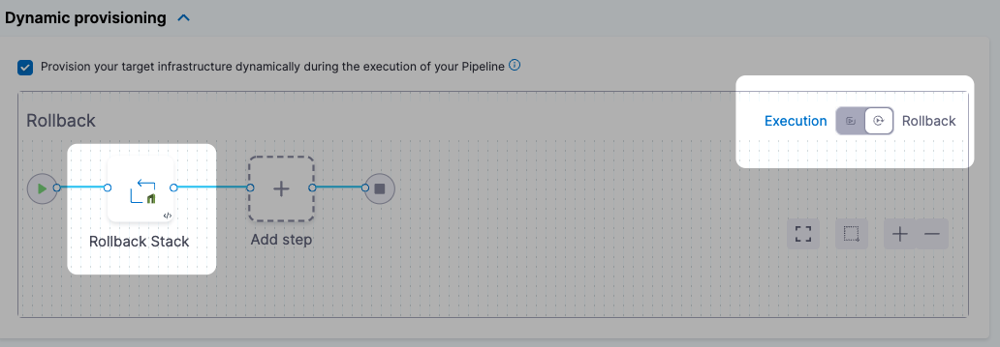

:::info

Dynamic provisioning is only supported in [Service and Environments v1](../../get-started/upgrading/upgrade-cd-v2). Dynamic provisioning will be added to Service and Environments v2 soon. Until then, you can create a stage to provision the target infrastructure and then a subsequent stage to deploy to that provisioned infrastructure.

:::

This topic describes how to provision a CD stage's deployment infrastructure resources using the CloudFormation **Create Stack**, **Delete Stack**, and **Rollback Stack** steps.

You can use these steps in a CD stage's **Execution** section as part of the deployment process, but this topic describes how to use them in the **Infrastructure** section to provision resources before deployment.

You use the CloudFormation **Create Stack** step to run a CloudFormation template and supporting files inline or from your repos (Git, AWS S3).

When you use **Create Stack** in **Infrastructure**, you also have the option to map the CloudFormation outputs and target the provisioned infrastructure. During deployment, Harness first provisions the target deployment infrastructure and then the stage's Execution steps deploy to the provisioned infrastructure.

To provision non-target infrastructure resources, add the CloudFormation Create Stack step to the stage **Execution** section instead of the **Infrastructure** section.### Before You Begin

* [CloudFormation Provisioning with Harness](./cloud-formation-provisioning-with-harness.md)

## Important notes

Target infrastructure provisioning is limited to what is available in the target environment.

For example, the cloud-agnostic Kubernetes Cluster Connector requires that you have an existing cluster, so you cannot provision a new cluster. But it does let you provision a namespace.



## Enable dynamic provisioning

These steps assume you've created a Harness CD stage before. If Harness CD is new to you, see [Kubernetes CD Quickstart](/docs/continuous-delivery/deploy-srv-diff-platforms/kubernetes/kubernetes-cd-quickstart.md).

We'll start in the stage's **Infrastructure** section because the **Service** settings of the stage don't have specific settings for CloudFormation provisioning. The Service manifests and artifacts will be deployed to the infrastructure defined in **Infrastructure**.

1. In the CD stage, click **Infrastructure**. If you haven't already specified your **Environment**, and selected the **Infrastructure Definition**, do so.
   
   If you want to map CloudFormation outputs to the **Infrastructure Definition**, the type of **Infrastructure Definition** you select determines what CloudFormation outputs you can map later.
2. In **Dynamic provisioning**, click **Provision your target infrastructure dynamically during the execution of your Pipeline**.

The default CloudFormation provisioning steps appear:



Harness automatically adds the **Create Stack**, [Harness Approval](../../x-platform-cd-features/cd-steps/approvals/using-harness-approval-steps-in-cd-stages.md), and **Delete Stack** steps in **Execution**, and the **Rollback Stack** step in **Rollback**. You can change these steps, but **Create Stack** is required to run your CloudFormation template.

## CloudFormation Create Stack step

The **Create Stack** step is where you connect Harness to your templates and provide additional settings.

### Name

1. In **Name**, enter a name for the step, for example, **C****reate EC2 Instance**.

Harness will create an [Entity Id](/docs/platform/20_References/entity-identifier-reference.md) using the name. The Id is very important. You can use a Harness expression and Id to refer to settings in this step from another step.

See [Built-in and Custom Harness Variables Reference](/docs/platform/12_Variables-and-Expressions/harness-variables.md).

### Timeout

1. In **Timeout**, enter how long Harness should wait to complete the step before failing the step and initiating the [Step and Stage Failure Strategy](/docs/platform/8_Pipelines/w_pipeline-steps-reference/step-failure-strategy-settings.md).

### Provisioner Identifier

1. Enter a unique value in **Provisioner Identifier**.

The **Provisioner Identifier** identifies the provisioning done by this step. You reference the **Provisioner Identifier** in other steps to refer to the provisioning done by this step.

Only one **Create Stack** step with a specific **Provisioner Identifier** can be added in the same stage. If you add multiple **Create Stack** steps with the same **Provisioner Identifier**, only the first **Create Stack** step will be successful.The most common use of **Provisioner Identifier** is between the Create Stack, Delete Stack, and Rollback Stack steps.

For example, in the case of a **Create Stack** failure, the **Rollback Stack** step rolls back the provisioning from the **Create Stack** step using its **Provisioner Identifier**.



#### Provisioner Identifier Scope

The **Provisioner Identifier** is a Project-wide setting. You can reference it across Pipelines in the same Project.

For this reason, it's important that all your Project members know the Provisioner Identifiers. This will prevent one member building a Pipeline from accidentally impacting the provisioning of another member's Pipeline.

### AWS Connector

1. Add or select the Harness [AWS Connector](/docs/platform/Connectors/Cloud-providers/ref-cloud-providers/aws-connector-settings-reference) that will be used for this step. The AWS Connector will include the credentials needed to perform the provisioning.

The credentials required for provisioning depend on what you are provisioning.

For example, if you wanted to give full access to create and manage EKS clusters, you could use a policy like this:


```json
{  
     "Version": "2012-10-17",  
     "Statement": [  
         {  
             "Effect": "Allow",  
             "Action": [  
                 "autoscaling:*",  
                 "cloudformation:*",  
                 "ec2:*",  
                 "eks:*",  
                 "iam:*",  
                 "ssm:*"  
             ],  
             "Resource": "*"  
         }  
     ]  
 }
```
Ensure that the credentials include the `ec2:DescribeRegions` policy described in [AWS Connector](/docs/platform/Connectors/Cloud-providers/ref-cloud-providers/aws-connector-settings-reference).

See [AWS CloudFormation service role](https://docs.aws.amazon.com/AWSCloudFormation/latest/UserGuide/using-iam-servicerole.html) from AWS.

### Region

1. Select the region for the resources you are provisioning.

### Template File

You can add your template in the following ways:

* **Inline:** just enter the template in **Template File**. You can use CloudFormation-compliant JSON or YAML.
* **AWS S3:** enter the URL of the S3 bucket containing the template file. This can be a public or private URL. If you use a private URL, the AWS credentials in the **AWS Connector** setting are used for authentication. Ensure that the credentials include the **AmazonS3ReadOnlyAccess** policy and the `ec2:DescribeRegions` policy described in [AWS Connector](/docs/platform/Connectors/Cloud-providers/ref-cloud-providers/aws-connector-settings-reference).
* **Remote:** select a Git repo where you template is located. You'll add or select a Harness Git Connector for the repo. See [Code Repo Connectors](https://newdocs.helpdocs.io/category/xyexvcc206).

#### Expression and Secret Support in Templates

Harness expressions and secrets can be used in templates. They are resolved at runtime.

See:

* [Add and Reference Text Secrets](/docs/platform/Secrets/add-use-text-secrets)
* [Built-in and Custom Harness Variables Reference](/docs/platform/12_Variables-and-Expressions/harness-variables.md)

### Stack Name

1. Enter a name for the CloudFormation stack Harness will create.

This is the same as the `--stack-name` option in the `aws cloudformation create-stack` command.

```
aws cloudformation create-stack --stack-name test --template-body file://eks.yml
```

### CloudFormation Parameter Files

You can use CloudFormation parameters files to specify input parameters for the stack.

This is the same as using the AWS CloudFormation CLI `create-stack` option `--parameters` and a JSON parameters file:


```
aws cloudformation create-stack --stackname startmyinstance  
--template-body file:///some/local/path/templates/startmyinstance.json  
--parameters https://your-bucket-name.s3.amazonaws.com/params/startmyinstance-parameters.json
```

Where the JSON file contains parameters such as these:

```json
[  
  {  
    "ParameterKey": "KeyPairName",  
    "ParameterValue": "MyKey"  
  },   
  {  
    "ParameterKey": "InstanceType",  
    "ParameterValue": "m1.micro"  
  }  
]
```

1. In **Cloud Formation Parameter Files**, click **Add**.
2. In **Parameter File Connector**, select your Git platform, and the select or add a Git Connector. See [Code Repo Connectors](https://newdocs.helpdocs.io/category/xyexvcc206) for steps on adding a Git Connector.
   
   For AWS S3, see [Add an AWS Connector](/docs/platform/Connectors/Cloud-providers/add-aws-connector).
3. In **Parameter File Details**, enter the following:

   + **Identifier:** enter an Identifier for the file. This is just a name that indicates what the parameters are for.
   + **Repo Name:** if the Git Connector does not have the repo path, enter it here.
   + **Git Fetch Type:** select **Latest from Branch** or use a Git commit Id or tag.
   + **Parameter File Details:** enter the path to the file from the root of the repo. To add multiple files, click **Add Path File**.

Here's an example:



#### Encrypted Text Secrets and Expressions in Parameter Files and Settings

Harness expressions and secrets can be used in parameter files and in the **Parameter File Details** settings. They are resolved at runtime.

See:

* [Add and Reference Text Secrets](/docs/platform/Secrets/add-use-text-secrets)
* [Built-in and Custom Harness Variables Reference](/docs/platform/12_Variables-and-Expressions/harness-variables.md)

### CloudFormation Parameters Overrides

You can override parameters added in **Parameter File Details**.

In **CloudFormation Parameters Overrides**, click **Specify Inline Parameters**.

In **CloudFormation Parameters Overrides**, click **Retrieve Names from template** to retrieve the parameters from the JSON file. You can also manually enter the names and values.

For each parameter you want to override, enter a new values in **Value**.

Harness text secrets are supported. See [Add and Reference Text Secrets](/docs/platform/Secrets/add-use-text-secrets).

### Role ARN

Enter the AWS Role ARN to use when creating the stack. Use an existing AWS Identity and Access Management (IAM) service role that CloudFormation can assume.

This is the same as the role you would use when creating a stack using the AWS console [Permissions](https://docs.aws.amazon.com/AWSCloudFormation/latest/UserGuide/cfn-console-add-tags.html) setting or CLI.

See [AWS CloudFormation service role](https://docs.aws.amazon.com/AWSCloudFormation/latest/UserGuide/using-iam-servicerole.html) from AWS.

### Specify Capabilities

To acknowledge the capabilities in the CloudFormation template, click in **Specify Capabilities** and select capabilities.

This acknowledges that the template contains certain capabilities (for example, `CAPABILITY_AUTO_EXPAND`), giving AWS CloudFormation the specified capabilities before it creates the stack. This is the same as using the `--capabilities` option in the `aws cloudformation create-stack` CLI command. See [create-stack](https://docs.aws.amazon.com/cli/latest/reference/cloudformation/create-stack.html).

### Tags

Tags are arbitrary key-value pairs that can be used to identify your stack for purposes such as cost allocation.

A **Key** consists of any alphanumeric characters or spaces. Tag keys can be up to 127 characters long.

A **Value** consists of any alphanumeric characters or spaces. Tag values can be up to 255 characters long.

1. Enter the tags in JSON or YAML (lowercase is required).

JSON example:

```json
{
  "Key" : String,
  "Value" : String
}
```

YAML example:

```yaml
Key: String
Value: String
```

Harness supports [CloudFormation-compliant JSON or YAML for tags](https://docs.aws.amazon.com/AWSCloudFormation/latest/UserGuide/aws-properties-resource-tags.html).

### Continue based on stack statuses

In **Continue Based on Stack Statuses**, you can add the stack states that allow provisioning.

Harness checks if the stack is in `ROLLBACK_COMPLETE` state before the deployment. If present, Harness deletes the stack and then triggers the deployment.

## Advanced settings

In **Advanced**, you can use the following options:

* [Delegate Selector](https://developer.harness.io/docs/platform/delegates/manage-delegates/select-delegates-with-selectors/)
* [Conditional Execution](https://developer.harness.io/docs/platform/pipelines/w_pipeline-steps-reference/step-skip-condition-settings/)
* [Failure Strategy](https://developer.harness.io/docs/platform/pipelines/w_pipeline-steps-reference/step-failure-strategy-settings/)
* [Looping Strategy](https://developer.harness.io/docs/platform/pipelines/looping-strategies-matrix-repeat-and-parallelism/)
* [Policy Enforcement](https://developer.harness.io/docs/platform/Governance/Policy-as-code/harness-governance-overview)

## Approval step

By default, Harness adds an Approval step between the Create Stack and Delete Stack steps. You can remove this step or follow the steps in [Using Manual Harness Approval Steps in CD Stages](../../x-platform-cd-features/cd-steps/approvals/using-harness-approval-steps-in-cd-stages.md) to configure the step.

You can also use other Approval step types.

See:

* [Create Jira Issues in CD Stages](../../x-platform-cd-features/cd-steps/ticketing-systems/create-jira-issues-in-cd-stages.md)
* [Create ServiceNow Tickets in CD Stages](../../x-platform-cd-features/cd-steps/ticketing-systems/create-service-now-tickets-in-cd-stages.md)

## Delete Stack step

The Delete Stack step is added by default.

You can use the Delete Stack step to remove resources provisioned by the Create Stack step or any resources created by CloudFormation.

### Configuration type

There are two options:

* **Inline:** similar to `aws cloudformation delete-stack --stack-name my-stack`. **Inline** removes the stack you identify using these settings:
	+ **AWS Connector:** add or select the Harness AWS Connector for connecting to AWS. Ensure its credentials have the permissions needed to remove the resources. See [AWS Connector](/docs/platform/Connectors/Cloud-providers/ref-cloud-providers/aws-connector-settings-reference).
	+ **Region:** select the region for the resources you are removing.
	+ **Role ARN:** enter the AWS Role ARN to use when deleting the stack. This is the same as the role you would use when deleting a stack using the AWS console or CLI.
	+ **Stack Name:** enter the name of the stack to delete.
* **Inherit from Create:** removes the resources defined in the Harness **Create Stack** step that you identify using **Provisioner Identifier**.



## Map outputs to target infra settings

Now that the Create Stack step is set up in **Dynamic provisioning**, Harness is configured to provision the infrastructure defined in your CloudFormation template.

There are two options:

1. If you are simply provisioning a resource in your deployment infrastructure that is not intended as the deployment target, such as an AWS secret, you can define the deployment target in **Infrastructure Definition** as you would if you were not provisioning anything.
2. If you will deploy directly into the provisioned resource as part of the deployment target, you need to provide the required **Infrastructure Definition** settings so Harness can target and deploy to the provisioned infrastructure.

We'll cover option 2.

The required settings are specific outputs from your CloudFormation template. Which settings are required depends on the type of target infrastructure you are provisioning/targeting.

For example, a platform-agnostic Kubernetes cluster infrastructure only requires the target namespace in the target cluster.

To map the CloudFormation template output to the Infrastructure Definition setting, ensure that the template has the CloudFormation Output defined.

In the **Infrastructure Definition** setting, select **Expression**:



In the setting, enter a Harness expression that references the output.

The expressions follow the format:

`<+infrastructureDefinition.provisioner.steps.[Create Stack step Id].output.[output name]>`

You can find the Id in the step:



For example, for a Kubernetes deployment, you need to map the `namespace` output to the **Namespace** setting in Infrastructure Definition.

So for a Create Stack step with the Id **create123** and an output named **namespace**, the expression is:

`<+infrastructureDefinition.provisioner.steps.create123.output.namespace>`



Now Harness has the provisioned target infrastructure set up.

## CloudFormation Rollback Stack step

The CloudFormation Rollback Step is automatically added to the **Rollback** section.



When rollback happens, Harness runs the last successfully provisioned version of the stack.

Open **CloudFormation Rollback Stack**.

Enter a name and timeout for the step.

In **Provisioner Identifier**, enter the same Provisioner Identifier you used in the Create Stack step.

Harness determines what to rollback using a combination of `Provisioner Identifier + Harness account id + Harness org id + Harness project id`.

If you've made these settings expressions, Harness uses the values it obtains at runtime when it evaluates the expression.

## Summary

Now that you have the Create Stack and Rollback Stack steps set up, when you run your Pipeline Harness will provision your CloudFormation stack and perform rollback on failure.

