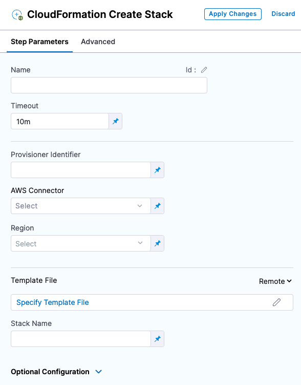
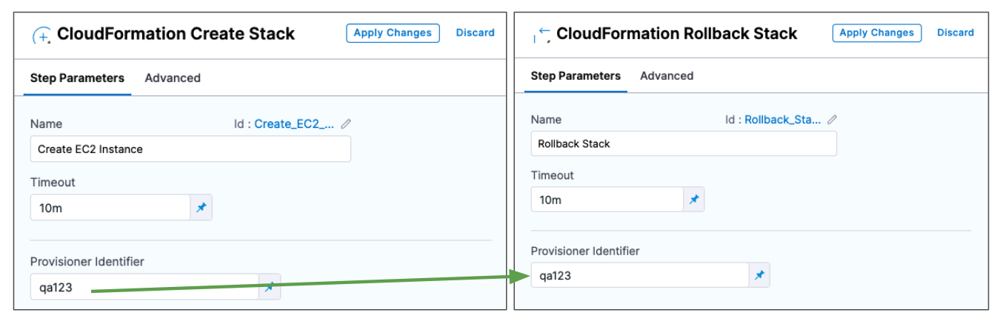
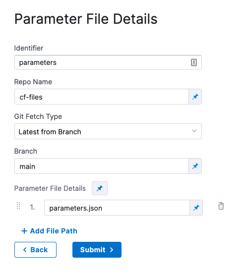

This topic describes how to provision resources in a CD stage's deployment infrastructure using the CloudFormation **Create Stack** step.

You use the CloudFormation **Create Stack** step in a CD stage's **Execution** section as part of the deployment process. The **Create Stack** step runs the CloudFormation template and supporting files that you supply inline or from your repos (Git, AWS S3). Harness provisions the CloudFormation stack defined in the template as part of the stage's **Execution**.

You can also use **Create Stack** in the **Infrastructure** section of a CD stage. You can even map the CloudFormation template outputs to the target infrastructure in **Infrastructure**. 

During deployment, Harness first provisions the target deployment infrastructure and then the stage's Execution steps deploy to the provisioned infrastructure. 

For steps on this process, see [Provision Target Deployment Infra Dynamically with CloudFormation](./provision-target-deployment-infra-dynamically-with-cloud-formation.md).

## Before You Begin

* [CloudFormation Provisioning with Harness](./cloud-formation-provisioning-with-harness.md)

## Step 1: Add the CloudFormation Create Stack Step

In the **Execution** section of your Deploy stage, click **Add Step**, and then select the **CloudFormation Create Stack** step.



The **Create Stack** step is where you connect Harness to your templates and provide additional settings.

### Name

In **Name**, enter a name for the step, for example, **C****reate EC2 Instance**.

Harness will create an [Entity Id](/docs/platform/20_References/entity-identifier-reference.md) using the name. The Id is very important. You can use an Harness expression and Id to refer to settings in this step from another step.

See [Built-in and Custom Harness Variables Reference](/docs/platform/12_Variables-and-Expressions/harness-variables.md).

### Timeout

In **Timeout**, enter how long Harness should wait to complete the step before failing the step and initiating the [Step and Stage Failure Strategy](/docs/platform/8_Pipelines/w_pipeline-steps-reference/step-failure-strategy-settings.md).

### Provisioner Identifier

Enter a unique value in **Provisioner Identifier**.

The **Provisioner Identifier** identifies the provisioning done by this step. You reference the **Provisioner Identifier** in other steps to refer to the provisioning done by this step.

Only one **Create Stack** step with a specific **Provisioner Identifier** can be added in the same stage. If you add multiple **Create Stack** steps with the same **Provisioner Identifier**, only the first **Create Stack** step will be successful.The most common use of **Provisioner Identifier** is between the Create Stack, Delete Stack, and Rollback Stack steps.

For example, in the case of a **Create Stack** failure, the **Rollback Stack** step rolls back the provisioning from the **Create Stack** step using its **Provisioner Identifier**.



Ultimately, Harness determines what stack to roll back to using a combination of `Provisioner Identifier + Harness account id + Harness org id + Harness project id`.

#### Provisioner Identifier Scope

The **Provisioner Identifier** is a Project-wide setting. You can reference it across Pipelines in the same Project.

For this reason, it's important that all your Project members know the Provisioner Identifiers. This will prevent one member building a Pipeline from accidentally impacting the provisioning of another member's Pipeline.

### AWS Connector

Add or select the Harness [AWS Connector](/docs/platform/connectors/cloud-providers/ref-cloud-providers/aws-connector-settings-reference/) that will be used for this step. The AWS Connector will include the credentials needed to perform the provisioning.

The credentials required for provisioning depend on what you are provisioning.

For example, if you wanted to give full access to create and manage EKS clusters, you could use a policy like this:


```json
{  
     "Version": "2012-10-17",  
     "Statement": [  
         {  
             "Effect": "Allow",  
             "Action": [  
                 "autoscaling:*",  
                 "cloudformation:*",  
                 "ec2:*",  
                 "eks:*",  
                 "iam:*",  
                 "ssm:*"  
             ],  
             "Resource": "*"  
         }  
     ]  
 }
```

Ensure that the credentials include the `ec2:DescribeRegions` policy described in [AWS Connector](/docs/platform/connectors/cloud-providers/ref-cloud-providers/aws-connector-settings-reference/). See [AWS CloudFormation service role](https://docs.aws.amazon.com/AWSCloudFormation/latest/UserGuide/using-iam-servicerole.html) from AWS.

### Region

Select the region for the resources you are provisioning.

### Template File

You can add your template in the following ways:

* **Inline:** just enter the template in **Template File**. You can use CloudFormation-compliant JSON or YAML.
* **AWS S3:** enter the URL of the S3 bucket containing the template file. This can be a public or private URL. If you use a private URL, the AWS credentials in the **AWS Connector** setting are used for authentication. Ensure that the credentials include the **AmazonS3ReadOnlyAccess** policy and the `ec2:DescribeRegions` policy described in [AWS Connector](/docs/platform/connectors/cloud-providers/ref-cloud-providers/aws-connector-settings-reference/).
* **Remote:** select a Git repo where you template is located. You'll add or select a Harness Git Connector for the repo. See [Code Repo Connectors](https://newdocs.helpdocs.io/category/xyexvcc206).

#### Expression and Secret Support in Templates

Harness expressions and secrets can be used in templates. They are resolved at runtime.

See:

* [Add and Reference Text Secrets](/docs/platform/Secrets/add-use-text-secrets)
* [Built-in and Custom Harness Variables Reference](/docs/platform/12_Variables-and-Expressions/harness-variables.md)

### Stack Name

Enter a name for the CloudFormation stack Harness will create.

This is the same as the `--stack-name` option in the `aws cloudformation create-stack` command.


```bash
aws cloudformation create-stack --stack-name test --template-body file://eks.yml
```

### Option: CloudFormation Parameter Files

You can use CloudFormation parameters files to specify input parameters for the stack.

This is the same as using the AWS CloudFormation CLI `create-stack` option `--parameters` and a JSON parameters file...


```bash
aws cloudformation create-stack --stackname startmyinstance  
--template-body file:///some/local/path/templates/startmyinstance.json  
--parameters https://your-bucket-name.s3.amazonaws.com/params/startmyinstance-parameters.json
```
...where the JSON file contains parameters such as these:


```json
[  
  {  
    "ParameterKey": "KeyPairName",  
    "ParameterValue": "MyKey"  
  },   
  {  
    "ParameterKey": "InstanceType",  
    "ParameterValue": "m1.micro"  
  }  
]
```

In **Cloud Formation Parameter Files**, click **Add**.

In **Parameter File Connector**, select your Git platform, and the select or add a Git Connector. See [Code Repo Connectors](https://newdocs.helpdocs.io/category/xyexvcc206) for steps on adding a Git Connector.

For AWS S3, see [Add an AWS Connector](/docs/platform/Connectors/Cloud-providers/add-aws-connector).

In **Parameter File Details**, enter the following:

* **Identifier:** enter an Identifier for the file. This is just a name that indicates what the parameters are for.
* **Repo Name:** if the Git Connector does not have the repo path, enter it here.
* **Git Fetch Type:** select **Latest from Branch** or use a Git commit Id or tag.
* **Parameter File Details:** enter the path to the file from the root of the repo. To add multiple files, click **Add Path File**.

Here's an example:



#### Encrypted Text Secrets and Expressions in Parameter Files and Settings

Harness expressions and secrets can be used in parameter files and in the **Parameter File Details** settings. They are resolved at runtime.

See:

* [Add and Reference Text Secrets](/docs/platform/Secrets/add-use-text-secrets)
* [Built-in and Custom Harness Variables Reference](/docs/platform/12_Variables-and-Expressions/harness-variables.md)

### Option: CloudFormation Parameters Overrides

You can override parameters added in **Parameter File Details**.

In **CloudFormation Parameters Overrides**, click **Specify Inline Parameters**.

In **CloudFormation Parameters Overrides**, click **Retrieve Names from template** to retrieve the parameters from the JSON file. You can also manually enter the names and values.

For each parameter you want to override, enter a new values in **Value**.

Harness text secrets are supported. See [Add and Reference Text Secrets](/docs/platform/Secrets/add-use-text-secrets).

### Option: Role ARN

Enter the AWS Role ARN to use when creating the stack. Use an existing AWS Identity and Access Management (IAM) service role that CloudFormation can assume.

This is the same as the role you would use when creating a stack using the AWS console [Permissions](https://docs.aws.amazon.com/AWSCloudFormation/latest/UserGuide/cfn-console-add-tags.html) setting or CLI.

See [AWS CloudFormation service role](https://docs.aws.amazon.com/AWSCloudFormation/latest/UserGuide/using-iam-servicerole.html) from AWS.

### Option: Specify Capabilities

To acknowledge the capabilities in the CloudFormation template, click in **Specify Capabilities** and select capabilities.

This acknowledges that the template contains certain capabilities (for example, `CAPABILITY_AUTO_EXPAND`), giving AWS CloudFormation the specified capabilities before it creates the stack. This is the same as using the `--capabilities` option in the `aws cloudformation create-stack` CLI command. See [create-stack](https://docs.aws.amazon.com/cli/latest/reference/cloudformation/create-stack.html).

### Option: Tags

Tags are arbitrary key-value pairs that can be used to identify your stack for purposes such as cost allocation.

A **Key** consists of any alphanumeric characters or spaces. Tag keys can be up to 127 characters long.

A **Value** consists of any alphanumeric characters or spaces. Tag values can be up to 255 characters long.

Enter the tags in JSON or YAML (lowercase is required):


```json
[{  
    "key": "string",  
    "value": "string"  
},{  
    "key": "string",  
    "value": "string"  
}]
```
### Option: Continue Based on Stack Statuses

In **Continue Based on Stack Statuses**, you can add the stack states that allow provisioning.

Harness checks if the stack is in `ROLLBACK_COMPLETE` state before the deployment. If present, Harness deletes the stack and then triggers the deployment.

### Option: Advanced Settings

In **Advanced**, you can use the following options:

* [Delegate Selector](https://developer.harness.io/docs/platform/delegates/manage-delegates/select-delegates-with-selectors/)
* [Conditional Execution](https://developer.harness.io/docs/platform/pipelines/w_pipeline-steps-reference/step-skip-condition-settings/)
* [Failure Strategy](https://developer.harness.io/docs/platform/pipelines/w_pipeline-steps-reference/step-failure-strategy-settings/)
* [Looping Strategy](https://developer.harness.io/docs/platform/pipelines/looping-strategies-matrix-repeat-and-parallelism/)
* [Policy Enforcement](https://developer.harness.io/docs/platform/Governance/Policy-as-code/harness-governance-overview)

