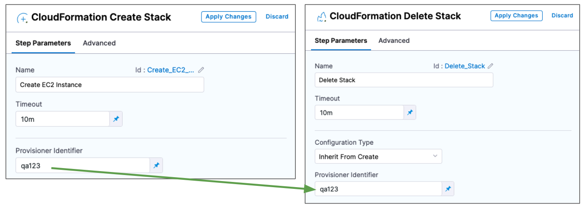

This topic describes how to use the CloudFormation **Delete Stack** step to remove a stack provisioned using the CloudFormation **Create Stack** step in a Harness Continuous Delivery stage or any resources created by CloudFormation.

You use the CloudFormation **Create Stack** step in a CD stage's **Execution** section as part of the deployment process. The **Create Stack** step runs the CloudFormation template and supporting files that you supply inline or from your repos (Git, AWS S3). Harness provisions the CloudFormation stack defined in the template as part of the stage's **Execution**.

You can remove the stack you provisioned using the **Create Stack** step by using a subsequent **Delete Stack** step in the same stage, or in any Pipeline in the Harness Project. You simply need to ensure that the **Create Stack** and **Delete Stack** steps use the same **Provision Identifier**.

You can also use **Create Stack** and **Delete Stack** in the **Infrastructure** section of a CD stage. You can even map the CloudFormation template outputs to the target infrastructure in **Infrastructure**. During deployment, Harness first provisions the target deployment infrastructure and then the stage's Execution steps deploy to the provisioned infrastructure. For steps on this process, see [Provision Target Deployment Infra Dynamically with CloudFormation](./provision-target-deployment-infra-dynamically-with-cloud-formation.md).

## Before You Begin

* [CloudFormation Provisioning with Harness](./cloud-formation-provisioning-with-harness.md)
* [Provision with the CloudFormation Create Stack Step](./provision-with-the-cloud-formation-create-stack-step.md)

## Step 1: Add the Delete Stack Step

You can use the Delete Stack step to remove resources provisioned by the Create Stack step or any resources created by CloudFormation.

In the **Execution** section of your Deploy stage, click **Add Step**, and then select the **CloudFormation Delete Stack** step.

### Configuration Type

There are two options:

* **Inline:** removes the resources you identify using these settings:
	+ **AWS Connector:** add or select the Harness AWS Connector for connecting to AWS. Ensure its credentials have the permissions needed to remove the resources. See [AWS Connector](/docs/platform/Connectors/Cloud-providers/ref-cloud-providers/aws-connector-settings-reference).
	+ **Region:** select the region for the resources you are removing.
	+ **Role ARN:** enter the AWS Role ARN to use when deleting the stack. This is the same as the role you would use when deleting a stack using the AWS console or CLI.
	+ **Stack Name:** enter the name of the stack to delete.
* **Inherit from Create:** removes the resources defined in the Harness **Create Stack** step that you identify using the same **Provisioner Identifier**.

### Provisioner Identifier Scope

The **Provisioner Identifier** is a Project-wide setting. You can reference it across Pipelines in the same Project.

For this reason, it's important that all your Project members know the Provisioner Identifiers. This will prevent one member building a Pipeline from accidentally impacting the provisioning of another member's Pipeline.

