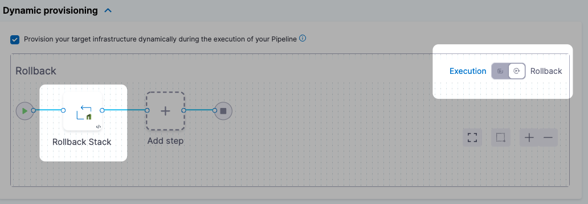

This topic describes how to use the CloudFormation **Rollback Stack** step to roll back to the last stack that was successfully provisioned by the CloudFormation **Create Stack** step.

## Before You Begin

* [CloudFormation Provisioning with Harness](./cloud-formation-provisioning-with-harness.md)
* [Provision with the CloudFormation Create Stack Step](./provision-with-the-cloud-formation-create-stack-step.md)

## Limitations

* You can only roll back to stacks provisioned by Harness.

## Step 1: Add the CloudFormation Rollback Stack

In the **Rollback** section of your Deploy stage, click **Add Step**, and then select the **CloudFormation Rollback Stack** step.

When rollback happens, Harness runs the last successfully provisioned version of the stack.

Open **CloudFormation Rollback Stack**.

Enter a name and timeout for the step.

In **Provisioner Identifier**, enter the same Provisioner Identifier you used in the **Create Stack** step.

Harness determines what to rollback using a combination of `Provisioner Identifier + Harness account id + Harness org id + Harness project id`.

If you've made these settings expressions, Harness uses the values it obtains at runtime when it evaluates the expression.

