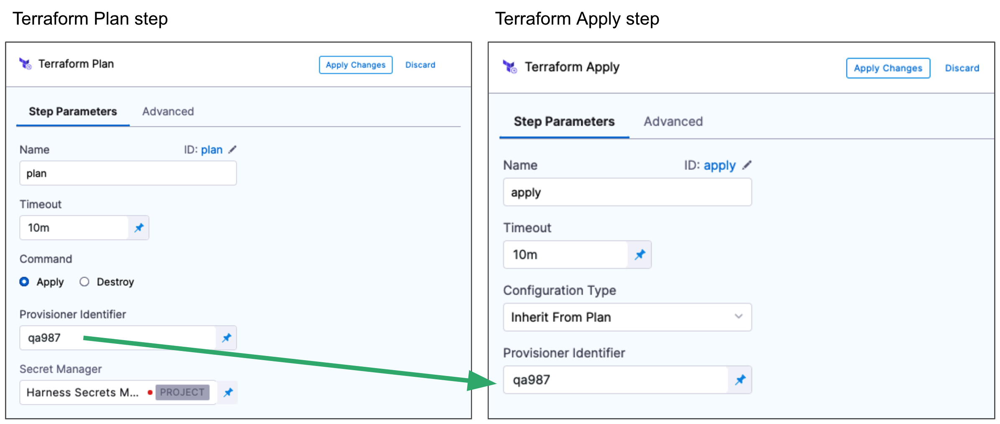

This article addresses some frequently asked questions about Harness provisioning.

### What if I have a custom provisioning tool, how can Harness support this?

Harness has first-class support for Terraform, Terragrunt, AWS CloudFormation, Azure ARM, and Blueprint provisioners, but to support different provisioners, or your existing shell script implementations, Harness includes Shell Script provisioning.
More details here [here](https://developer.harness.io/docs/continuous-delivery/cd-infrastructure/shell-script-provisioning).

### Does Harness support Cosmos DB?

Harness doesn’t do database orchestration out of the box today. To orchestrate the SQL Changes to the database, you need to customize our functionality using the following:

- [Container step](/docs/continuous-delivery/x-platform-cd-features/cd-steps/utilities/container-step)
- [Container step group](/docs/continuous-delivery/x-platform-cd-features/cd-steps/containerized-steps/containerized-step-groups) 
- [Shell Script step](/docs/continuous-delivery/x-platform-cd-features/cd-steps/utilities/shell-script-step) 
- [Shell Script Provisioner](/docs/continuous-delivery/cd-infrastructure/shell-script-provisioning) 

To create a Cosmos DB, we support the creation via:

- [Azure ARM](/docs/continuous-delivery/cd-infrastructure/azure-arm-provisioning) 
- [Azure Blueprint](/docs/continuous-delivery/cd-infrastructure/azure-blueprint-provisioning) 
- [Terraform](/docs/continuous-delivery/cd-infrastructure/terraform-infra/terraform-provisioning-with-harness)

### Does Harness support Azure Cache?

Azure Cache is not an application that a user deploys. It’s a managed Redis service by Azure. Harness can assist in spinning up Azure Cache by our infrastructure provisioning capabilities:

- [Azure ARM](/docs/continuous-delivery/cd-infrastructure/azure-arm-provisioning) 
- [Azure Blueprint](/docs/continuous-delivery/cd-infrastructure/azure-blueprint-provisioning) 
- [Terraform](/docs/continuous-delivery/cd-infrastructure/terraform-infra/terraform-provisioning-with-harness) 

### Does Harness support Azure App Services?

No, we do not support Azure App Services as a native swimlane like Azure Web Apps.

We do support [deployment templates](/docs/continuous-delivery/deploy-srv-diff-platforms/custom/custom-deployment-tutorial) to achieve the use case.

Or you can orchestrate the release via: 

- [Azure ARM](/docs/continuous-delivery/cd-infrastructure/azure-arm-provisioning) 
- [Azure Blueprint](/docs/continuous-delivery/cd-infrastructure/azure-blueprint-provisioning) 
- [Terraform](/docs/continuous-delivery/cd-infrastructure/terraform-infra/terraform-provisioning-with-harness)

### Does Shell Script provisioning step has built in output variables?

Shell Script Provisioning step does not have script output variables similar to Shell Script step. Their variable configuration step only have option for input variables.

### How to access output variables from Shell Script Provisioning step?

The Shell Script Provisioning step expects the output to be put to a json form inside the file `$PROVISIONER_OUTPUT_PATH`. This is then subsequently accessed in next step with Instance variable like below:
 
`<+pipeline.stages.shellscriptprovision.spec.execution.steps.shell1.output.Instances>`

### To store my shell script when I use Harness File Store I don't see any option like Bitbucket, or GitHub.

As of today, we have only two options to select the shell script provision script. That is inline and Harness file store.


### Do we have predefined rollback step while using Shell Script provisioning?

No, Out for the box Rollback step is not available and you need to add your own scripts under Rollback section of the stage Environment.

### Why can't I deploy an ARM template?

If you are getting the below error when attempting to deploy ARM templates, it might be because `$schema` and `contentVersion` parameters have not been removed from the Parameters File yet. This is due to a limitation in the Azure Java SDK and REST API.

```
Status code 400, "{"error":{"code":"InvalidRequestContent","message":"The request content was invalid and could not be deserialized: 'Error converting value \"https://schema.management.azure.com/schemas/2015-01-01/deploymentParameters.json#\" to type 'Azure.Deployments.Core.Definitions.DeploymentParameterDefinition'. Path 'properties.parameters.$schema', line 1, position 6636.'."}}"
```

For an example of a valid Parameters File, go to [ARM parameter file](/docs/continuous-delivery/cd-infrastructure/azure-arm-provisioning/#arm-parameter-file).

### Is there a method to simulate CloudFormation changes without actually applying them?

Yes, you can achieve this by utilizing the Change Set Feature. First, create a change set to preview the changes that will be made. Once you are satisfied with the preview, you can execute the change set using the command: [aws cloudformation execute-change-set](https://docs.aws.amazon.com/cli/latest/reference/cloudformation/execute-change-set.html). This allows you to assess the impact of the changes before applying them.

### How can you use CloudFormation with Harness?

You can use Harness with CloudFormation in two ways:
Dynamic infrastructure provisioning: you can provision the target infrastructure for a deployment as part of the stage's Environment settings, and then deploy to that provisioned infrastructure in the same stage.
Ad hoc provisioning: provision any resources other than the target infrastructure for the deployment.

### How does Harness support Terraform?

Harness lets you use Terraform to provision infrastructure as part of your deployment process. Harness can provision any resource that is supported by a Terraform [provider or plugin](https://www.terraform.io/docs/configuration/providers.html).

For an overview of the process see [Terraform provisioning with Harness](/docs/continuous-delivery/cd-infrastructure/terraform-infra/terraform-provisioning-with-harness). 

### How can I ensure the state file is properly saved in the Terraform Enterprise (TFE) workspace when running a Terraform apply script locally on the Harness delegate?

One thing to check is whether the Harness delegate has the necessary permissions to write to the `dev-workflow-aws-harness` workspace. If the delegate lacks the required permissions, the state file won't be uploaded to the TFE workspace.

### Do I need to deploy an application to use Terraform?

No. You do not need to deploy artifacts through Harness services to use Terraform provisioning in a workflow. You can use Terraform to provision infrastructure without deploying any artifact.

### Are Harness service instances counted with Terraform provisioning?

Harness service instances (SIs) are not consumed and no additional licensing is required when a Harness pipeline uses Terraform to provision resources. When Harness deploys artifacts through Harness services to the provisioned infrastructure in the same pipeline, SI licensing is consumed.

### What deployment strategies can I use Terraform with?

You can use Terraform with all strategies.

### Can I perform a Terraform dry run?

Yes. The Terraform Plan and Terraform Apply steps can be executed as a dry run, just like running the [terraform plan](https://www.terraform.io/docs/commands/plan.html) command.

First, you add the Terraform Plan step and define the Terraform script for it to use.

Next, you add the Terraform Apply step, select **Inherit from Plan** in **Configuration Type**, and reference the Terraform Plan step using the same **Provisioner Identifier.**



### Can I remove resources provisioned with Terraform?

Yes. You can add a **Terraform Destroy** step to remove any provisioned infrastructure, just like running the `terraform destroy` command. See [destroy](https://www.terraform.io/docs/commands/destroy.html) from Terraform.

See [Remove provisioned infrastructure with the Terraform Destroy step](/docs/continuous-delivery/cd-infrastructure/terraform-infra/remove-provisioned-infra-with-terraform-destroy.md).

### Can Terraform vars in Terraform step contain hyphen ?

Terraform vars are exported as shell environment variables. The shell variables itself has a restriction in their naming coonvention that it should not contain hyphen and hence this is not supported.


### In Harness FirstGen, how can I remove the old plan-file and start again with a fresh plan to make the workflow run successfully?

You can [enable the Skip Terraform Refresh when inheriting Terraform plan option](https://developer.harness.io/docs/first-gen/continuous-delivery/Terraform-category/add-Terraform-scripts#option-2-skip-Terraform-refresh-when-inheriting-Terraform-plan).


### How can we assign Terraform output (e.g. VPC CIDR) to harness Pipeline or stage variable?

We have implemented a feature for capturing the the output of the Apply step.
You can use something like this to copy the json output in a file - 
```echo "<+pipeline.stages.EC2_deploy.spec.execution.steps.TerraformApply_1.output.TF_JSON_OUTPUT_ENCRYPTED>" > /opt/harness-delegate/aaabbb.txt```

Doc for reference - [here](https://developer.harness.io/docs/continuous-delivery/cd-infrastructure/Terraform-infra/run-a-Terraform-plan-with-the-Terraform-apply-step/#encrypt-the-Terraform-apply-json-outputs)


### What is the correct way to specify org or account level connectors in Terraform resources ?
We should always prefix the scope of the connector ref before providing them in the resource file. For example if it is a org level conncetor the correct way to specify it is `org.myconnectorref`


### Why do we get error in Terraform provider that a project level resource can not be used at org level?
We have a top down hierarchy of the resources which goes account > org > project . You can refer any parent level resource at the child level but the reverse is not true. SO you should be able to reference a account level resource while creating a project level resource but not a project level resource while creating an account level resource.


### Can we use Terraform plan from one stage in apply step in another stage ?

The inherit from plan option for the Terraform apply step can be used only within same stage. It is not possible to run plan step in one stage and then use inherit from plan option for apply step in another stage.


### What is the recommended way to save the state file for Terraform pipelines?

For testing scenarios you can run the Terraform without remote backend for saving the Terraform state file however for prodcution runs it is always recommended to start with a remote backend configured from first run.

### Is there a way to cache Terraform plugins in delegates?

Yes, one can try to set this environment variable `TF_PLUGIN_CACHE_DIR` . Also refer the following [Documentation](https://developer.hashicorp.com/Terraform/cli/config/config-file#provider-plugin-cache).


###  I am working on overrides creation using Terraform. As I see according to the latest update overrides were moved from the Environments tab to a separate tab. We have a use case where I must create all the 3 types provided under service-specific overrides. How to get YAML representation for all 3 types of override

You can get the the detail under the example usage [here](https://registry.Terraform.io/providers/harness/harness/latest/docs/resources/platform_service_overrides_v2).


### How can I deploy infrastructure using a scripted method as part of my CD Stage?

One method is to use the Harness Terraform Provider. 
More information about this can be found at this link: [here](https://developer.harness.io/docs/continuous-delivery/cd-infrastructure/Terraform-infra/Terraform-provisioning-with-harness)


### I am getting "Backend not initialised error" when running terragrunt plan with specific module?

When dealing with specific modules, we don't initiate Terraform init directly; instead, we use the terragrunt terragrunt-info command. 
To initialize the backend properly, you need to run Terraform init, and this initialization process is triggered automatically when you select the "All modules" option.

### Does Terraform step keep the working directory persistence?
In the both plan and apply step we clean up the directories of Terraform.
 

### How do I access files created during plan step of Terraform for Apply step?
Workspace gets cleaned after every run of Plan or Apply step.
version control can be used to store these files and later reference them.


### Is there a way persist Terraform steps working directory?
This is by design we always clean the working directory on each Terraform step and working directory cannot be persisted.


### Is there a way to cache Terraform plugins for Harness Terraform pipeline executions?

We can use the caching functionality provided by Terraform for this purpose. We need to set the below environment variable for the Terraform pipelines:

```
TF_PLUGIN_CACHE_DIR=/opt/harness-delegate/<plugincachedirectory>
```


### How can one utilize outputs from the Terraform/Terragrunt apply steps effectively?

utilizing outputs from Terraform/Terragrunt apply steps follows a similar approach. After executing the Terraform/Terragrunt apply step, the outputs are accessible in the 'Step Output' section. These outputs can be accessed using expressions. For instance, one can access an output using `<+pipeline.stages.stag1.spec.execution.steps.TerraformApply_4.output.get("test-output-name2")>`
Please read more on this in the following [Documentation](https://developer.harness.io/docs/continuous-delivery/cd-infrastructure/Terraform-infra/run-a-Terraform-plan-with-the-Terraform-apply-step).


### Do we allow rotation of harness_platform_token in Terraform resource management?

No, we don't. Please refer more on this in the Terraform-Harness[Documentation](https://registry.Terraform.io/providers/harness/harness/latest/docs/resources/platform_token).


### How can one fetch the provisioner Id in a pipeline using Terraform with an expression?

One can fetch the provisioner Id in a pipeline using expression `<+stage.pipeline.variables.HARNESS_PROVISIONER_ID>`.
Please read more on how to provision target deployment infrastructure dynamically with Terraform in the following [Documentation](https://developer.harness.io/docs/continuous-delivery/cd-infrastructure/Terraform-infra/provision-infra-dynamically-with-Terraform/)


### Can we use our vault for storing Terraform Apply step output?

Currently, only the Harness secret manager is supported.


### How do I encrypt for my Terraform output?

Terraform output can be encrypted once you configure a secret manager for the "Encrypt JSON output" field under the optional configuration of Terraform apply step.


### Can you please provide the info on how long the secret created from the Terraform Apply step stays in place and how it gets overridden?

The secret will be always unique but the expression of it is the same depending on the Terraform Apply step. It is stored in the secrets at the project level. The secret exists till the pipeline is not finished.
Once the pipeline failed|passed|aborted… it means the pipeline finished the execution and we clean the secret.
There is no way to control how long it is kept.


### Are there any limitations to Terraform rollback?
There are limitations to rollbacks. If, for example, modules 1 and 2 were successfully deployed, and module 3 failed, the rollback will only revert to the successful state of modules 1 and 2. However, if module 3 succeeds, and the subsequent deployment fails, the rollback will only include the state with module 3 deployed, excluding modules 1 and 2. Additionally, rollback is not possible if the Terraform Apply step is run with the Skip state storage option enabled and no Terraform backend is configured in the Terraform files. In such a scenario, using the Rollback step would be incorrectly set up and could lead to unexpected results.


### Can one define an optional tfvar files in Terraform support ?

Yes, with minimal delegate version requested `816xx` one can do so. Please read more on this in the following [Documentation](https://developer.harness.io/docs/continuous-delivery/cd-infrastructure/Terraform-infra/optional-tf-var-files)


### How to fetch API status for adding any automation based on API result?

For example, delegate token creation API :

```
curl -i -X POST 'https://app.harness.io/ng/api/delegate-token-ng?accountIdentifier=xxxxxxxxxxxxxxxxxxx&orgIdentifier=string&projectIdentifier=string&tokenName=tokendelnew&revokeAfter=0' 
-H 'x-api-key: xxxxxxxxxxxxxxxxxxxxxxxxxxxxxxxxxxxxx'
```

We get the output as : 
```
{
"metaData": { },
"resource": {
"uuid": null,
"accountId": "jxxxxxxxxxxxxxhg",
"name": "tokendelnew",
"createdBy": null,
"createdByNgUser": {
"type": "SERVICE_ACCOUNT",
"name": "Terraformrpoviderusheer",
"email": "terrio",
"username": "Terraformrpoviderusheer",
"accountId": "jxxxxxxxxxxxxxxxx_hg",
"jwtclaims": {}
},
"createdAt": 17xxxxxxxxxxx,
"status": "ACTIVE",
"value": "OTxxxxxxxxxxxxxxxxxxxxxxxg=",
"ownerIdentifier": null,
"revokeAfter": 0
},
"responseMessages": [ ]
}
```

We can use use the status from the above output, in case of failure it will be "ERROR", we can also use the HTTP output codes such as `200` for success and `400` for failure.

### I have a Terraform code which I will need to use to deploy resources for a Fastly service. And, I would like to know should I create a pipeline in CI or CD module and what's the reasoning behind it?

The decision on whether to create your pipeline in the Continuous Deployment (CD) module or Continuous Integration (CI) module depends on your specific use case and deployment strategy.

If your goal is to automate the deployment of infrastructure whenever there are changes in your code, and you are using Terraform for provisioning, it is advisable to create a pipeline in the CD module. This ensures that your application's infrastructure stays current with any code modifications, providing seamless and automated deployment.

Alternatively, if your use of Terraform is focused on provisioning infrastructure for your CI/CD pipeline itself, it is recommended to establish a pipeline in the CI module. This allows you to automate the provisioning of your pipeline infrastructure, ensuring its availability and keeping it up-to-date.

In broad terms, the CI module is typically dedicated to building and testing code, while the CD module is designed for deploying code to production. However, the specific use case and deployment strategy will guide your decision on where to create your pipeline.

It's worth noting that you also have the option to incorporate both types of processes within a single pipeline, depending on your requirements and preferences.


### We would like to run Terraform step in a pipeline with specific version of Terraform and another pipelines Terraform step with different version of Terraform.

To achieve this use case you will need to use two different delegates with the required Terraform version installed.


### Why Terraform script file is initializing with null value in the path?

Terraform script directory on delegate is based on some default values like org project however it also has the provisioner identifier in the path. If we are using provisioner identifier with an expression and for some reason the expression resolves to null, we will see a null in the path initialized as well.


### Why Terraform provider does not allow to change pipeline name in the input set created using Terraform provider?

The input set is associated with specific pipelines. So once it is created it can not be associated with other pipelines. That is why when you are changing the pipeline identifier it is giving you the corresponding error. I can see the same error at my end also if I try to change the pipeline identifier.

The other attributes of input set you can change in the yaml like what are the variables and their value but not the pipeline tagged.

### Which certificate harness uses to validate connectivity to Terraform Cloud end point while using Terraform cloud provider?

The Terraform cloud connector will use the delegate to test the connectivity and for any task run by delegate itself it will be utilizing the jvm trustStore for ssl validation of the connection. So if the Terraform cloud endpoint is using a self-signed cert we need to update the delegate trustStore with the cert detail for the same.


### Can I run multiple Terraform pipeline concurrently?

Terraform init command does not work if we run init for the same work directory in parallel. Hence such concurrent execution will fail with the error 'Failed to Install Provider'.


### How many versions of Terraform does Harness support ?

Harness supports the following Terraform versions: `v1.3.5, v1.1.9, v1.0.0, v0.15.5, v0.15.0 and v0.14.0`
Please read more on this in the following [Documentation](https://developer.harness.io/docs/continuous-delivery/cd-integrations#Terraform-version-support)


### What is the use of Terraform-config-inspect binary in delegates?

This binary is used for rendering the Terraform code in the CG version and is not used for NG-related deployments.


### What are the best possible ways to create harness deployment secrets, connectors, pipelines, etc?

Creating resources is totally up to the customer's requirement, we provide all three ways to create harness resources -
* Via Terraform
* Via UI
* Via API

The docs for API and Terraform resource provider and harness docs. Please go through it and choose the one which best suits your needs -
* [API docs](https://apidocs.harness.io/)
* [Terraform provider](https://registry.Terraform.io/providers/harness/harness/latest/docs)
* [Harness docs](https://developer.harness.io/docs/continuous-delivery)


### Can we connect to a Databricks cluster?

No, we do not have a native integration. If one is using Terraform, they need to define the access block by following the [Terraform Docs](https://registry.Terraform.io/providers/databricks/databricks/0.2.4/docs#authentication)
Wherever the delegate is hosted it needs network access to reach out and communicate to databricks.


### I have a Terraform Apply step inside a stage with matrix or loop, I want to know if that means the underlying repo will be cloned every time the step runs for each matrix/loop item?

Yes, the underlying repo will be cloned for each run of the step in looping.

### How can one migrate a service to a higher scope (if available at project level)?

Currently, there's no built-in way to move or upgrade services to higher levels. When sharing a service, it needs to have a scope at either the organizational or account level. Fortunately, you can always use the Terraform provider to recreate those services at a higher level.
Please read more on how to use Terraform provider in the following [Documentation](https://developer.harness.io/docs/platform/get-started/tutorials/onboard-Terraform-provider).


### Is there a way to switch AWS accounts while using native Terraform step?

Yes, Harness supports an AWS Connector to have the Terraform plan and apply step assume a role to perform the provisioning of infrastructure.
Please read more on this in the following [Documentation](https://developer.harness.io/docs/continuous-delivery/cd-infrastructure/Terraform-infra/run-a-Terraform-plan-with-the-Terraform-apply-step/#aws-connector-provider-credential-authentication-for-Terraform-plan-and-apply-steps).

### Are there any access permissions or restrictions that might be affecting the execution of Python commands within Terraform?

No We don't have any restrictions on running the python in Terraform.


### How to create a Harness project from Terraform?

You need to prepare a Terraform script of the resources you want to create in your project. Before that, if you want to create a project with Terraform in an org then you need to set up all the required resources using the Terraform Provider script.  You can reference the Terraform resources from the [Harness Terraform Provider API documentation](https://registry.Terraform.io/providers/harness/harness/latest/docs).


### In Terraform, how do you return a null value from a for_each?

In Terraform, you can return a null value from a `for_each` expression by using the `null` function or the `null` literal directly.
Here's an example of how you can use both approaches:

Using the `null` function:
```
variable "my_map" {
  type = map(any)
  default = {
    key1 = "value1"
    key2 = null
  }
}

resource "aws_instance" "my_instances" {
  for_each = var.my_map

  # Other resource attributes...
}
```

Using the `null` literal directly:
```
variable "my_map" {
  type = map(any)
  default = {
    key1 = "value1"
    key2 = null
  }
}

resource "aws_instance" "my_instances" {
  for_each = var.my_map

  # Other resource attributes...
}
```
Both approaches will result in `key2` in the `my_map` variable being set to a `null` value, causing Terraform to not create an instance for that key when using `for_each`.


### How does the Encrypt JSON output setting work in the Terraform Apply stage?

This setting will temporarily create a secret that stores the Terraform output JSON. The secret will be created using the Harness Secret Manager provider and will be available for use during the pipeline execution. The secret is then deleted at the end of the execution. For more information, go to [Encrypt the Terraform Apply JSON outputs](https://developer.harness.io/docs/continuous-delivery/cd-infrastructure/Terraform-infra/run-a-Terraform-plan-with-the-Terraform-apply-step/#encrypt-the-Terraform-apply-json-outputs).


### How do I retrieve encrypted Terraform Output data from a Terraform Apply stage?

To retrieve encrypted Terraform Output data, find the `TF_JSON_OUTPUT_ENCRYPTED` output variable and reference it using a Harness expression. For example, `<+pipeline.stages.stage1.spec.execution.steps.TerraformApply_1.output.TF_JSON_OUTPUT_ENCRYPTED>`. The value will be encrypted in the Harness UI but, the values will be available in downstream steps and stages. For more information, go to [Encrypt the Terraform Apply JSON outputs](https://developer.harness.io/docs/continuous-delivery/cd-infrastructure/Terraform-infra/run-a-Terraform-plan-with-the-Terraform-apply-step/#encrypt-the-Terraform-apply-json-outputs).


### Does Harness support storing the Terraform Plan on the Harness Delegate temporarily?

Yes, users can now store the Terraform plan on the delegate and leverage it in the apply step. This now bypasses the restriction to store the plan in a secrets manager and let users store it locally.
This feature is behind the feature flag, `CDS_STORE_TERRAFORM_PLAN_FILE_LOCALLY_ON_DELEGATE`. Harness Delegate version 827xx or later is required for this feature.
Go to [Store Terraform Plan on Harness Delegate](https://developer.harness.io/docs/continuous-delivery/cd-infrastructure/Terraform-infra/run-a-Terraform-plan-with-the-Terraform-plan-step/#store-Terraform-plan-on-harness-delegate) and [Demo Video](https://www.loom.com/share/bc5a4f382d584b228b4ea2c82eb94a7c?sid=b9fac5c3-c11b-4f50-acff-f4fd2b3cc83a) for more information.


### How do I get a file from a different source and use it in a Terraform step during runtime?

You can have a shell script step in which you fetch the file from your corresponding source and have it stored on the delegate at any specific path and refer that path in your Terraform config. You just need to ensure that your plan and apply runs on the same delegate. For more details, go to [Run all pipeline steps in one pod](https://developer.harness.io/docs/platform/delegates/manage-delegates/run-all-pipeline-steps-in-one-pod/).

### How do I use a custom stage to do the Terraform Cloud Run step?

The Run step is only supported in the CI and CD stages. For the custom stage, please use the Shell Script step.

### Is the state file fully and uniquely identified by the combination of "provisioner ID" and "workspace name"?

Yes, State files are uniquely identifiable using "provisionerID" and "Workspace Name" that is why the provisioner ID should always be unique.

### How can one use `AWS CDK Infra Provisioning Support` on Harness?

Harness lets users run AWS CDK Workloads via the Container Based Steps.
Please follow more on this [Documentation](https://developer.harness.io/docs/continuous-delivery/cd-infrastructure/aws-cdk/)


### Why isn't my environment variable working in Terraform Plan or Apply?

Some environment variables are exclusive to Terraform Enterprise or Terraform Cloud. For example, `TFE_PARALLLELISM` is a Terraform Enterprise environment variable that is not supported by the Terraform CLI. In order to use these environment variables, please make sure to use either Terraform Enterprise or Terraform Cloud.

### Does AWS CDK still require feature flags to be set in order to use?

AWS CDK is globally available and does not require any feature flags to enable and use. For more information, please go to [AWS CDK Provisioning](/docs/continuous-delivery/cd-infrastructure/aws-cdk/).

### Why is my CloudFormation create stack operation failing with the error **Exception: Invalid request: Parameter 'InsufficientDataHealthStatus' must be one of AllowedValues (Service: AmazonCloudFormation; Status Code: 400; Error Code: ValidationError; Request ID: ...; Proxy: null) while creating stack: HarnessStack-route53**?

So it looks like the parameter value InsufficientDataHealthStatus is not below the allowed values as per the Amazon document:
```
Healthy: Route 53 considers the health check to be healthy.
Unhealthy: Route 53 considers the health check to be unhealthy.
LastKnownStatus: Route 53 uses the status of the health check from the last time that CloudWatch had sufficient data to determine the alarm state. For new health checks that have no last known status, the default status for the health check is healthy.
```
https://docs.aws.amazon.com/AWSCloudFormation/latest/UserGuide/aws-properties-route53-healthcheck-healthcheckconfig.html

#### Why is the Resource Constraint holding the deployment for two pipelines with different infrastructures but the same service?

The deployment might being held because the infrastructure key is created from the service ID + environment ID + connector ID. Since the connector ID is missing, the infrastructure key remains the same for both pipelines.

To resolve such issues and allow simultaneous deployment, you can:

- Add a Connector: In the "Select Host" field, specify a connector.
- Change the Secret Identifier: Ensure the secret ID is different for each pipeline.

This approach prevents parallel deployments when a pipeline is triggered both from the API and manually at the same time.

#### How can I configure and use custom runners with specific resource requirements in Harness for specific pipelines?
You can select infrastructure per pipeline in Harness. For Harness Cloud, you can scale resources as needed. Alternatively, if you run builds on your own EKS cluster, you can define CPU and memory requirements within the pipeline.

For more details on setting up build resources in your Kubernetes cluster for Harness builds, refer to [our documentation](https://developer.harness.io/docs/continuous-integration/use-ci/set-up-build-infrastructure/k8s-build-infrastructure/set-up-a-kubernetes-cluster-build-infrastructure/).