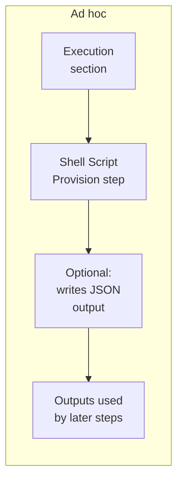
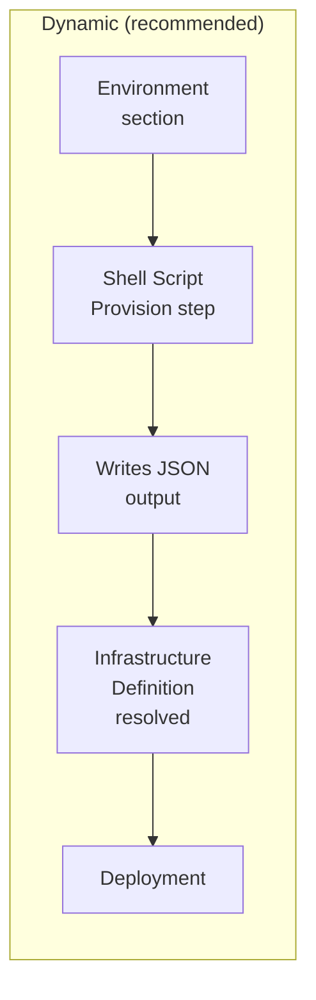

Harness supports infrastructure provisioning through Shell Scripts, making it easy to work with existing shell-based workflows or custom provisioners. For Infrastructure as Code (IaC) use cases, Harness also supports Terraform, Terragrunt, AWS CloudFormation, Azure ARM, and Azure Blueprints.

Use Shell Script provisioning to run inline or remote Bash scripts that provision target environments or resources, either on demand (ad hoc) or as part of the deployment that consumes them (dynamic).

For details on Harness provisioning, go to [Provisioning overview](/docs/continuous-delivery/cd-infrastructure/provisioning-overview).

---

## What will you learn in this topic?

- How to [provision resources ad hoc or dynamically](#provisioning-modes) with your own inline or remote shell scripts.
- How to [add a Shell Script Provision step](#create-a-shell-script-provision-step) with a script and input variables.
- How to [map script outputs to the Infrastructure Definition](#map-script-outputs) for each supported deployment type.
- How to use the [`$PROVISIONER_OUTPUT_PATH` variable](#provisioner-output-path-variable) to capture your script's JSON output and reference it in later steps.

---

## Before you begin

Ensure you have the following:

- **Role permissions**: You need `View/Create`, `Edit`, `Access`, and `Delete` on **Environments**. Go to [RBAC in Harness](/docs/platform/role-based-access-control/rbac-in-harness) to configure roles and permissions.
- **Target environment access**: Ensure the credentials your provisioner script uses (for example, a cloud provider connector or service account) have the permissions needed to provision resources in the target environment.
- **Secrets**: Store any secret text or files your script uses in a secret manager. Go to [Harness secrets management overview](/docs/platform/secrets/secrets-management/harness-secret-manager-overview) to get started, then [add text secrets](/docs/platform/secrets/add-use-text-secrets) or [add file secrets](/docs/platform/secrets/add-file-secrets).

---

## Provisioning modes

Harness Shell Script provisioning supports two provisioning modes. The two modes differ in where you add the Shell Script Provision step and how Harness uses its outputs.                                                 

### Ad hoc provisioning

Ad hoc provisioning creates temporary, pipeline-scoped resources that are not part of the deployment target. You add the Shell Script Provision step to the stage **Execution** section, so it runs during pipeline execution. Outputs from the step can be used by later pipeline steps, but they are not mapped to the Infrastructure Definition.

The following diagram shows how ad hoc provisioning runs in the pipeline:



The example use cases include:

- Creating a temporary AWS EC2 instance for testing.
- Creating a temporary Kubernetes namespace.
- Provisioning resources for a one-time validation or experiment.

If your script writes outputs to `$PROVISIONER_OUTPUT_PATH`, reference them in later pipeline steps with the fully qualified step-output path. For example, for a step named `Ad_Hoc_Provision` in a stage named `Deploy`, reference the `server` output as `<+pipeline.stages.Deploy.spec.execution.steps.Ad_Hoc_Provision.output.server>`. The `<+provisioner.KEY>` shorthand resolves only inside the Infrastructure Definition mapping, which ad hoc provisioning does not use.

To configure ad hoc provisioning, go to [Configure ad hoc provisioning](#configure-ad-hoc-provisioning).

### Dynamic infrastructure provisioning

Dynamic infrastructure provisioning is the recommended provisioning mode for deployments. You add the Shell Script Provision step to the stage **Environment** section. The step writes provisioning outputs that you map to the Infrastructure Definition. Harness uses these outputs to resolve the deployment infrastructure before the deployment runs.

The following diagram shows how dynamic provisioning runs in the pipeline:



Your script provisions the infrastructure (for example, by calling Terraform or a cloud CLI) and writes the resulting values to `$PROVISIONER_OUTPUT_PATH`. Harness uses those values to resolve the Infrastructure Definition before deployment starts.

For example, your script can:

- Create an AWS EC2 instance.
- Create a Kubernetes cluster or namespace.
- Provision Azure resources.
- Run Terraform to create infrastructure.

Use dynamic provisioning whenever your pipeline needs to provision the deployment target. Common use cases include temporary development, test, and QA environments. Production environments are typically pre-existing.

To configure dynamic provisioning, go to [Configure dynamic provisioning](#configure-dynamic-provisioning).

---

## Create a Shell Script Provision step

The Shell Script Provision step runs an inline or remote Bash script to provision your target environment or resources.

Perform the following steps to add a Shell Script Provision step:

1. In your pipeline, open the section where you want to provision:
   - For ad hoc provisioning, open the **Execution** section of a Continuous Delivery (CD) **Deploy** stage or a **Custom** stage.
   - For dynamic provisioning, open the **Environment** section and enable dynamic provisioning. Go to [Configure dynamic provisioning](#configure-dynamic-provisioning) to set this up.
2. Select **Add Step**, then select **Shell Script Provision**.
3. In **Name**, enter a name for the step.
4. In **Script**, set the script source:
   - **Inline**: enter your Bash script directly in the step.
   - **File Store**: select a script stored in the [Harness File Store](/docs/continuous-delivery/x-platform-cd-features/services/add-inline-manifests-using-file-store).
5. (Optional) To parameterize your script, expand **Optional Configuration** and add **Script Input Variables**. Go to [Script input variables](#script-input-variables) to configure them.
6. If your script produces outputs, write them to `$PROVISIONER_OUTPUT_PATH`. Go to [Provisioner output path variable](#provisioner-output-path-variable) to reference the output in later steps.
7. In **Timeout**, set the maximum run time, then select **Apply Changes**.

<details>
<summary>YAML example: Shell Script Provision step</summary>

```yaml
- step:
    type: ShellScriptProvision
    name: Ad Hoc Provision              # Replace with a name for your step
    identifier: Ad_Hoc_Provision        # Replace with a unique identifier
    spec:
      source:
        type: Inline                    # Use "Inline" for an inline script, or "Harness" for a File Store script
        spec:
          script: |-
            # Ad Hoc Provisioning Example
            # Access environment variables defined below using $VARIABLE_NAME
            echo "Ad Hoc Provisioning"
            echo "Environment Variable Key: $Key"    # Replace $Key with your variable name
            
            # Write JSON output to $PROVISIONER_OUTPUT_PATH for use in later steps
            # Reference outputs in later steps using the fully qualified step-output path.
            # For this step (identifier Ad_Hoc_Provision) in a stage with identifier Deploy:
            # <+pipeline.stages.Deploy.spec.execution.steps.Ad_Hoc_Provision.output.server>
            echo '{"server": "app-server-01", "port": 8080}' > "$PROVISIONER_OUTPUT_PATH"   # Replace with your actual JSON output
            cat "$PROVISIONER_OUTPUT_PATH"
      environmentVariables:             # Add Script Input Variables here, if your script needs them
        - name: Key                     # Replace with your variable name
          type: String                  # String or Secret
          value: Test                   # Replace with your value or use <+expression>
    timeout: 10m                        # Set the maximum run time

```

</details>

### Script input variables

Use Script Input Variables to pass values into your shell script without hardcoding them. This makes your script reusable and allows you to pass Harness expressions or other values into the script.

Perform the following steps to add an input variable:
1. Expand **Optional Configuration**.
2. Under **Script Input Variables**, enter a **Name** and **Value**.
3. Reference the variable in your script using `$<name>`.

If the value comes from a Harness expression, select **Expression** for **Value** and paste the expression. 

<div style={{ textAlign: 'center' }}>
  <DocImage path={require('./static/c5ff60a733dfa1801e34139a940b279ea0f3d0df1f9b7873a7ca58085066f695.png')} alt="Script Input Variables with an expression selected in the Value field" width="80%" height="80%" title="Click to view full size image" />
</div>

In the **Script**, you declare the variable using the **Name** from **Script Input Variables** (in this example, `foo`).

<div style={{ textAlign: 'center' }}>
  <DocImage path={require('./static/f06e24abdcd1f20681d0ff4f223409f1789bd210ed9ddb254675965a6d5ed090.png')} alt="Script referencing the input variable name foo" width="80%" height="80%" title="Click to view full size image" />
</div>

---

## Configure ad hoc provisioning

Perform the following steps to configure ad hoc provisioning:

1. Open a CD **Deploy** stage or a **Custom** stage.
2. In the **Execution** section, select **Add Step**, then select **Shell Script Provision**.
3. Configure the step with your provisioning script. Go to [Create a Shell Script Provision step](#create-a-shell-script-provision-step) to set the script and input variables.
4. If your script produces outputs, write them to `$PROVISIONER_OUTPUT_PATH` and reference them in later steps. Go to [Provisioner output path variable](#provisioner-output-path-variable) to reference the output.

:::note

For ad hoc provisioning, `$PROVISIONER_OUTPUT_PATH` is optional. Use it only when you need to expose script outputs to later steps.

:::

<details>
<summary>YAML example: ad hoc provisioning stage (placed in Execution)</summary>

```yaml
stage:
  name: Deploy                          # Replace with your stage name
  identifier: Deploy                    # Replace with a unique identifier
  type: Deployment
  spec:
    deploymentType: Kubernetes          # Replace with your deployment type
    service:
      serviceRef: my_service            # Replace with your service reference
    environment:
      environmentRef: my_environment    # Replace with your environment reference
      infrastructureDefinitions:
        - identifier: my_infra          # Replace with your infrastructure definition
    execution:
      steps:
        - step:
            type: ShellScriptProvision
            name: Ad Hoc Provision              # Replace with a name for your step
            identifier: Ad_Hoc_Provision        # Replace with a unique identifier
            spec:
              source:
                type: Inline                    # Use "Inline" for an inline script, or "Harness" for a File Store script
                spec:
                  script: |-
                    # Ad Hoc Provisioning Example
                    # Access environment variables defined below using $VARIABLE_NAME
                    echo "Ad Hoc Provisioning"
                    echo "Environment Variable Key: $Key"    # Replace $Key with your variable name
                    
                    # Write JSON output to $PROVISIONER_OUTPUT_PATH for use in later steps
                    # Reference outputs in later steps using the fully qualified step-output path.
                    # For this step (identifier Ad_Hoc_Provision) in a stage with identifier Deploy:
                    # <+pipeline.stages.Deploy.spec.execution.steps.Ad_Hoc_Provision.output.server>
                    echo '{"server": "app-server-01", "port": 8080}' > "$PROVISIONER_OUTPUT_PATH"   # Replace with your actual JSON output
                    cat "$PROVISIONER_OUTPUT_PATH"
              environmentVariables:             # Add Script Input Variables here, if your script needs them
                - name: Key                     # Replace with your variable name
                  type: String                  # String or Secret
                  value: Test                   # Replace with your value or use <+expression>
            timeout: 10m                        # Set the maximum run time
      rollbackSteps: []
```

</details>

<details>
<summary>YAML example: complete ad hoc provisioning pipeline</summary>

```yaml
pipeline:
  name: AdHocProvisioningPipeline
  identifier: AdHocProvisioningPipeline
  projectIdentifier: my_project                 # Replace with your project identifier
  orgIdentifier: my_org                         # Replace with your organization identifier
  tags: {}
  stages:
    - stage:
        name: Deploy
        identifier: Deploy
        description: "Stage with ad hoc Shell Script provisioning"
        type: Deployment
        spec:
          deploymentType: Kubernetes            # Replace with your deployment type
          service:
            serviceRef: my_service              # Replace with your service reference
          environment:
            environmentRef: my_environment      # Replace with your environment reference
            deployToAll: false
            infrastructureDefinitions:
              - identifier: my_infra            # Replace with your infrastructure definition
          execution:
            steps:
              - step:
                  type: ShellScriptProvision
                  name: Ad Hoc Provision
                  identifier: Ad_Hoc_Provision
                  spec:
                    source:
                      type: Inline
                      spec:
                        script: |-
                          echo "Ad Hoc Provisioning"
                          echo '{"server": "app-server-01", "port": 8080}' > "$PROVISIONER_OUTPUT_PATH"   # Replace with your actual JSON output
                          cat "$PROVISIONER_OUTPUT_PATH"
                    environmentVariables: []
                  timeout: 10m
              - step:
                  type: ShellScript
                  name: Use Provisioner Output
                  identifier: Use_Provisioner_Output
                  spec:
                    shell: Bash
                    source:
                      type: Inline
                      spec:
                        script: |-
                          echo "Server: <+pipeline.stages.Deploy.spec.execution.steps.Ad_Hoc_Provision.output.server>"
                          echo "Port: <+pipeline.stages.Deploy.spec.execution.steps.Ad_Hoc_Provision.output.port>"
                    onDelegate: true
                  timeout: 10m
            rollbackSteps: []
        tags: {}
        failureStrategies:
          - onFailure:
              errors:
                - AllErrors
              action:
                type: StageRollback
```

</details>

---

## Configure dynamic provisioning

Add a **Shell Script Provision** step to the **Environment** section of a CD Deploy stage and map the script outputs to the Infrastructure Definition.

Before deployment starts, Harness runs the provisioning script, uses its outputs to resolve the Infrastructure Definition, and then deploys to the provisioned target. 

The Infrastructure Definition is still required because Harness uses it to identify the deployment target. Your script provisions the infrastructure (for example, by calling Terraform or a cloud CLI) and writes the resulting values to `$PROVISIONER_OUTPUT_PATH`.

Perform the following steps to configure dynamic provisioning:

1. In the CD **Deploy** stage, open the **Environment** section and enable the **Provision your target infrastructure dynamically during the execution of your Pipeline** option.
2. In **What type of provisioner do you want to use?**, select **Script**.
   
   The Shell Script Provision step is added.
3. Configure the Shell Script Provision step with your provisioning script. Go to [Create a Shell Script Provision step](#create-a-shell-script-provision-step) to set the script and input variables.
4. Map the outputs from your script to the Infrastructure Definition. Harness **recommends dynamic mapping**, where the Infrastructure Definition is resolved from the provisioner outputs at runtime.

   Set the required Infrastructure Definition fields to runtime inputs (`<+input>`), then map each field to the corresponding `<+provisioner.KEY>` expression. For example, if your script outputs `{"namespace":"prod"}`, set the **Namespace** field to `<+input>` and provide `<+provisioner.namespace>` at runtime.
  
   Go to [Map script outputs](#map-script-outputs) for the settings each deployment type requires, and [Dynamic provisioning by deployment type](#dynamic-provisioning-by-deployment-type) for the per-platform setup steps.

:::note

     - For dynamic provisioning, `$PROVISIONER_OUTPUT_PATH` is required.

   - If your Infrastructure Definition already contains the required values, you don't need to map provisioner outputs. Your script must still write valid JSON (for example, `{}`) to `$PROVISIONER_OUTPUT_PATH`.

:::  

<details>
<summary>YAML example: complete dynamic provisioning pipeline (Kubernetes)</summary>

This is a complete Kubernetes pipeline. It runs a Shell Script Provision step in the **Environment** section, then populates the Infrastructure Definition fields from the provisioner outputs with `<+provisioner.KEY>` expressions. In later execution steps, reference the outputs with the fully qualified step-output path. For the provisioner step below (identifier `ProvisionInfra`) in the stage with identifier `ShellScriptDeployDynamic`, the `namespace` output is `<+pipeline.stages.ShellScriptDeployDynamic.spec.provisioner.steps.ProvisionInfra.output.namespace>`.

```yaml
pipeline:
  name: DynamicProvisioningPipeline
  identifier: DynamicProvisioningPipeline
  projectIdentifier: my_project                 # Replace with your project identifier
  orgIdentifier: my_org                         # Replace with your organization identifier
  tags: {}
  stages:
    - stage:
        name: ShellScriptDeployDynamic
        identifier: ShellScriptDeployDynamic
        description: "Kubernetes deployment with dynamic Shell Script provisioning"
        type: Deployment
        spec:
          deploymentType: Kubernetes            # Replace with your deployment type
          service:
            serviceRef: my_service              # Replace with your service reference
          environment:
            environmentRef: my_environment      # Replace with your environment reference
            deployToAll: false
            provisioner:
              steps:
                - step:
                    type: ShellScriptProvision
                    name: ProvisionInfra
                    identifier: ProvisionInfra
                    spec:
                      source:
                        type: Inline
                        spec:
                          script: |-
                            # Provision your infrastructure, then output the values the
                            # Infrastructure Definition needs as JSON.
                            echo '{"namespace": "app-<+pipeline.sequenceId>", "releaseName": "rel-<+pipeline.sequenceId>"}' > "$PROVISIONER_OUTPUT_PATH"
                            cat "$PROVISIONER_OUTPUT_PATH"
                      environmentVariables: []
                    timeout: 10m
              rollbackSteps: []
            infrastructureDefinitions:
              - identifier: my_infra            # Fields set to <+input> in the Infrastructure Definition
                inputs:
                  identifier: my_infra
                  type: KubernetesDirect
                  spec:
                    namespace: <+provisioner.namespace>       # from the provisioner output
                    releaseName: <+provisioner.releaseName>
          execution:
            steps:
              - step:
                  type: ShellScript
                  name: Use Provisioner Output
                  identifier: Use_Provisioner_Output
                  spec:
                    shell: Bash
                    source:
                      type: Inline
                      spec:
                        script: |-
                          echo "Namespace: <+pipeline.stages.ShellScriptDeployDynamic.spec.provisioner.steps.ProvisionInfra.output.namespace>"
                          echo "Release: <+pipeline.stages.ShellScriptDeployDynamic.spec.provisioner.steps.ProvisionInfra.output.releaseName>"
                    environmentVariables: []
                    outputVariables: []
                  timeout: 10m
            rollbackSteps: []
        tags: {}
        failureStrategies:
          - onFailure:
              errors:
                - AllErrors
              action:
                type: StageRollback
```

</details>

### Map script outputs

Once you have added dynamic provisioning to the **Environment** section of the stage, you must map specific script outputs to the required Harness Infrastructure Definition used by the stage.

Each deployment type maps different script outputs to its Infrastructure Definition settings. The following table shows the settings to map for each infrastructure type:

| **Infra type**             | **Infra settings that require mapping**                 |
| -------------------------- | ------------------------------------------------------- |
| Kubernetes Direct          | **Namespace**, **Release Name** (optional)              |
| Kubernetes GCP             | **Namespace**, **Cluster**, **Release Name** (optional) |
| Kubernetes Azure           | **Namespace**, **Cluster**                              |
| Kubernetes AWS             | **Namespace**, **Cluster**, **Release Name** (optional) |
| Physical Data Center       | **Host Array Path**, **Host Attributes**                |
| SSH and WinRM on AWS       | **Region**, **Tags**                                    |
| SSH and WinRM on Azure     | **Subscription Id**, **Resource Group**, **Tags**       |
| Azure Web App              | **Subscription**, **Resource Group**                    |
| Google Cloud Functions     | **Region**, **Project**                                 |
| AWS Lambda                 | **Region**                                              |
| AWS ECS                    | **Region**, **Cluster**                                 |
| Tanzu Application Services | **Organization**, **Space**                             |
| Serverless.com AWS Lambda  | **Region**, **Stage**                                   |

For the setup steps for your deployment type, go to [Dynamic provisioning by deployment type](#dynamic-provisioning-by-deployment-type).

### Dynamic provisioning by deployment type

Each deployment type maps different script outputs to the Harness infrastructure settings in the pipeline stage. 

For some deployment types, the full pipeline YAML is given here for your reference. You can set up the other deployment types the same way, using these examples as a reference. 

In each example, replace the project, organization, service, environment, and infrastructure identifiers with your own.

- [Azure Web Apps](/docs/continuous-delivery/deploy-srv-diff-platforms/azure/azure-web-apps-tutorial):

<details>
<summary>Pipeline YAML - Azure Web App</summary>

:::note
The execution step in this example is an on-delegate `ShellScript` step that prints the dynamically provisioned outputs. It stands in for a real `AzureSlotDeployment` step so you can verify provisioning end to end without a live Azure Web App. Replace it with your actual `AzureSlotDeployment` step when you deploy to a real web app.

Reference provisioner outputs outside the Infrastructure Definition with the fully qualified path. In this example, the `subscriptionId` output is `<+pipeline.stages.AzureWebAppDeploy.spec.provisioner.steps.shellprovision.output.subscriptionId>`. The `<+provisioner.KEY>` shorthand resolves only inside the Infrastructure Definition mapping.
:::

```yaml
pipeline:
  name: AzureWebApp_ShellScript_DynamicProvisioning       # Replace with your pipeline name
  identifier: AzureWebApp_ShellScript_DynamicProvisioning
  projectIdentifier: KrishShellScriptProvisioning          # Replace with your project identifier
  orgIdentifier: Ng_Pipelines_K8s_Organisations            # Replace with your organization identifier
  description: Azure Web App deployment with Shell Script dynamic infrastructure provisioning
  tags:
    provisioner: shellscript
    deployment: azurewebapp
  stages:
    - stage:
        name: AzureWebAppDeploy
        identifier: AzureWebAppDeploy
        description: Azure Web App deployment with dynamic provisioning using Shell Script
        type: Deployment
        spec:
          deploymentType: AzureWebApp
          service:
            serviceRef: AzureWebApps                         # Replace with your service reference
            serviceInputs:
              serviceDefinition:
                type: AzureWebApp
                spec:
                  artifacts:
                    primary:
                      primaryArtifactRef: <+input>
                      sources: <+input>
          environment:
            environmentRef: AzureWebApp_Env                  # Replace with your environment reference
            deployToAll: false
            provisioner:
              steps:
                - step:
                    type: ShellScriptProvision
                    name: shellprovision
                    identifier: shellprovision
                    timeout: 10m
                    spec:
                      source:
                        type: Inline
                        spec:
                          # Emits subscriptionId and resourceGroup consumed by the AzureWebApp infrastructure
                          script: |-
                            # Replace the values below with your Azure subscription ID and resource group
                            echo "{
                                \"subscriptionId\": \"<YOUR_SUBSCRIPTION_ID>\",
                                \"resourceGroup\": \"<YOUR_RESOURCE_GROUP>\"
                            }" >> "$PROVISIONER_OUTPUT_PATH"
                      environmentVariables: []
              rollbackSteps:
                - step:
                    type: ShellScript
                    name: Rollback_Provisioner
                    identifier: Rollback_Provisioner
                    spec:
                      shell: Bash
                      onDelegate: true
                      source:
                        type: Inline
                        spec:
                          script: |
                            echo "=== Rollback: Cleaning up provisioned Azure infrastructure ==="
                            echo "Subscription: <+pipeline.stages.AzureWebAppDeploy.spec.provisioner.steps.shellprovision.output.subscriptionId>"
                            echo "Resource Group: <+pipeline.stages.AzureWebAppDeploy.spec.provisioner.steps.shellprovision.output.resourceGroup>"
                            echo "Rolling back Azure Web App infrastructure provisioning..."
                      environmentVariables: []
                      outputVariables: []
                    timeout: 10m
            infrastructureDefinitions:
              - identifier: AzureWebApp_DynamicInfra         # Replace with your infrastructure definition identifier
                inputs:
                  identifier: AzureWebApp_DynamicInfra
                  type: AzureWebApp
                  spec:
                    provisioner: shellprovision
          execution:
            steps:
              - step:
                  type: ShellScript
                  name: Verify Provisioned Infrastructure
                  identifier: Verify_Provisioned_Infrastructure
                  timeout: 10m
                  spec:
                    shell: Bash
                    onDelegate: true
                    source:
                      type: Inline
                      spec:
                        # Simulation stand-in for the real AzureSlotDeployment step
                        script: |
                          echo "=== Dynamically provisioned Azure Web App infrastructure ==="
                          echo "Subscription:  <+pipeline.stages.AzureWebAppDeploy.spec.provisioner.steps.shellprovision.output.subscriptionId>"
                          echo "ResourceGroup: <+pipeline.stages.AzureWebAppDeploy.spec.provisioner.steps.shellprovision.output.resourceGroup>"
                          echo "Service:       <+service.name>"
                          echo "Environment:   <+env.name>"
                          echo "Provisioned infrastructure resolved successfully."
                    environmentVariables: []
                    outputVariables: []
            rollbackSteps: []
        tags: {}
        failureStrategies:
          - onFailure:
              errors:
                - AllErrors
              action:
                type: StageRollback
        delegateSelectors:
          - cdng-automation                                  # Replace with a delegate selector available in your project
```

</details>

- [AWS SAM](/docs/continuous-delivery/deploy-srv-diff-platforms/aws/aws-sam-deployments):

<details>
<summary>Pipeline YAML - AWS SAM</summary>

```yaml
pipeline:
  name: AWSSAMDynamicProvisioning                     # Replace with your pipeline name
  identifier: AWSSAMDynamicProvisioning
  tags: {}
  projectIdentifier: KrishShellScriptProvisioning     # Replace with your project identifier
  orgIdentifier: Ng_Pipelines_K8s_Organisations       # Replace with your organization identifier
  stages:
    - stage:
        name: stage
        identifier: stage
        description: ""
        type: Deployment
        spec:
          deploymentType: AWS_SAM
          service:
            serviceRef: awssrv                         # Replace with your service reference
          environment:
            environmentRef: awssam_env                 # Replace with your environment reference
            deployToAll: false
            provisioner:
              steps:
                - step:
                    type: ShellScriptProvision
                    name: AWS Region Provisioner
                    identifier: AWS_Region_Provisioner
                    spec:
                      source:
                        type: Inline
                        spec:
                          script: |-
                            # Dynamic provisioning script for AWS SAM
                            # Set the AWS region for deployment
                            REGION="us-east-1"

                            # Output provisioner variables
                            echo "{\"region\": \"$REGION\"}" > "$PROVISIONER_OUTPUT_PATH"
                      environmentVariables: []
                    timeout: 10m
              rollbackSteps: []
            infrastructureDefinitions:
              - identifier: awssam_infra_new           # Replace with your infrastructure definition
                inputs:
                  identifier: awssam_infra_new
                  type: AWS_SAM
                  spec:
                    provisioner: <+input>
          execution:
            steps:
              - stepGroup:
                  steps:
                    - step:
                        type: Background
                        name: dind
                        identifier: dind
                        spec:
                          connectorRef: account.harnessImage
                          image: docker:28-dind
                          shell: Sh
                          privileged: true
                        when:
                          stageStatus: Success
                    - step:
                        type: DownloadManifests
                        name: DownloadManifests
                        identifier: DownloadManifests
                        spec: {}
                        failureStrategies: []
                    - step:
                        type: AwsSamBuild
                        name: SAM Build
                        identifier: SAM_Build
                        spec:
                          connectorRef: account.harnessImage
                          image: harness/aws-sam-plugin:nodejs20.x-1.120.0-1.0.1-beta-linux-amd64
                          imagePullPolicy: Always
                          samBuildDockerRegistryConnectorRef: account.harnessImage
                          settings: {}
                          buildCommandOptions:
                            - "--use-container"
                        when:
                          stageStatus: Success
                        timeout: 10m
                    - step:
                        type: AwsSamDeploy
                        name: SAM Deploy
                        identifier: SAM_Deploy
                        spec:
                          connectorRef: account.harnessImage
                          image: harness/aws-sam-plugin:nodejs20.x-1.120.0-1.0.1-beta-linux-amd64
                          stackName: tryingdynamicprovisioning
                          imagePullPolicy: Always
                          settings: {}
                          deployCommandOptions:
                            - "--capabilities CAPABILITY_IAM --resolve-s3 --no-fail-on-empty-changeset"
                          samVersion: v1.1
                        when:
                          stageStatus: Success
                        timeout: 10m
                  name: SAM Step Group
                  identifier: sam_step_group
                  stepGroupInfra:
                    type: KubernetesDirect
                    spec:
                      connectorRef: org.KubernetesConnectorWithInclusterDelegateForSamAutomationTest
                      namespace: harness-delegate-ng
                      initTimeout: 10m
                      harnessImageConnectorRef: org.KubernetesConnectorWithInclusterDelegateForSamAutomationTest
                  sharedPaths:
                    - /var/run
                    - /var/lib/docker
            rollbackSteps: []
        tags: {}
        failureStrategies:
          - onFailure:
              errors:
                - AllErrors
              action:
                type: StageRollback
```

</details>

- [AWS ECS](/docs/continuous-delivery/deploy-srv-diff-platforms/aws/ecs/ecs-deployment-tutorial):

<details>
<summary>Pipeline YAML - AWS ECS</summary>

```yaml
pipeline:
  orgIdentifier: Ng_Pipelines_K8s_Organisations       # Replace with your organization identifier
  tags: {}
  stages:
    - stage:
        name: ecs
        identifier: ecs
        type: Deployment
        spec:
          deploymentType: ECS
          service:
            serviceRef: EcsService_ZT                  # Replace with your service reference
            serviceInputs:
              serviceDefinition:
                spec:
                  artifacts:
                    primary:
                      primaryArtifactRef: artifact
                type: ECS
          execution:
            steps:
              - step:
                  type: EcsRollingDeploy
                  name: Rolling
                  identifier: Rolling
                  spec:
                    sameAsAlreadyRunningInstances: false
                    forceNewDeployment: false
                  timeout: 15m
            rollbackSteps:
              - step:
                  name: ECS Rolling Rollback
                  identifier: ecsRollingRollback
                  type: EcsRollingRollback
                  timeout: 10m
                  spec: {}
          environment:
            environmentRef: EcsEnv_TA                  # Replace with your environment reference
            deployToAll: false
            provisioner:
              rollbackSteps: []
              steps:
                - step:
                    identifier: Shell_Script_Provision
                    name: Shell Script Provision
                    spec:
                      environmentVariables: []
                      source:
                        spec:
                          script: |2-
                             #Hardcoded region
                            REGION="us-east-1"
                            CLUSTER="ecs-cluster-3"

                            # Set the region environment variable
                            echo "{\"region\": \"$REGION\",\"cluster\": \"$CLUSTER\"}" > "$PROVISIONER_OUTPUT_PATH"
                        type: Inline
                    timeout: 10m
                    type: ShellScriptProvision
            infrastructureDefinitions:
              - identifier: EcsInfra_FF                # Replace with your infrastructure definition
                inputs:
                  identifier: EcsInfra_FF
                  type: ECS
                  spec:
                    provisioner: <+input>
        tags: {}
        failureStrategies:
          - onFailure:
              errors:
                - AllErrors
              action:
                type: StageRollback
        variables:
          - name: var1
            type: String
            required: false
            value: ecs-auto-Yj
  projectIdentifier: KrishShellScriptProvisioning      # Replace with your project identifier
  identifier: AWSECSprovisioning
  name: AWSECSprovisioning
```

</details>

- [AWS Lambda](/docs/continuous-delivery/deploy-srv-diff-platforms/aws/aws-lambda-deployments):

<details>
<summary>Pipeline YAML - AWS Lambda</summary>

```yaml
pipeline:
  name: ShellscriptProvisioningAWSLamda                # Replace with your pipeline name
  identifier: ShellscriptProvisioningAWSLamda
  projectIdentifier: KrishShellScriptProvisioning      # Replace with your project identifier
  orgIdentifier: Ng_Pipelines_K8s_Organisations        # Replace with your organization identifier
  tags: {}
  stages:
    - stage:
        name: lambda
        identifier: lambda
        description: ""
        type: Deployment
        spec:
          deploymentType: AwsLambda
          service:
            serviceRef: LambdaECRiqU                    # Replace with your service reference
            serviceInputs:
              serviceDefinition:
                type: AwsLambda
                spec:
                  artifacts:
                    primary:
                      primaryArtifactRef: handler
          environment:
            environmentRef: CDPLambda3VL                # Replace with your environment reference
            deployToAll: false
            provisioner:
              steps:
                - step:
                    type: ShellScriptProvision
                    name: Shell Script Provisioner
                    identifier: Shell_Script_Provisioner
                    spec:
                      source:
                        type: Inline
                        spec:
                          script: |2-
                             #Hardcoded region
                            REGION="us-east-1"

                            # Set the region environment variable
                            echo "{\"region\": \"$REGION\"}" > "$PROVISIONER_OUTPUT_PATH"
                      environmentVariables: []
                    timeout: 10m
            infrastructureDefinitions:
              - identifier: lambdaInfra                  # Replace with your infrastructure definition
                inputs:
                  identifier: lambdaInfra
                  type: AwsLambda
                  spec:
                    provisioner: <+input>
          execution:
            steps:
              - step:
                  name: Deploy Aws Lambda
                  identifier: deployawslambda
                  type: AwsLambdaDeploy
                  timeout: 10m
                  spec: {}
            rollbackSteps:
              - step:
                  name: Aws Lambda rollback
                  identifier: awslambdarollback
                  type: AwsLambdaRollback
                  timeout: 10m
                  spec: {}
        tags: {}
        failureStrategies:
          - onFailure:
              errors:
                - AllErrors
              action:
                type: StageRollback
        variables:
          - name: runtime
            type: String
            description: ""
            required: false
            value: nodejs16.x
```

</details>

- [Helm](/docs/continuous-delivery/deploy-srv-diff-platforms/helm/helm-cd-quickstart):

<details>
<summary>Pipeline YAML - Native Helm</summary>

:::note

Reference provisioner outputs outside the Infrastructure Definition with the fully qualified path. In this example, the `namespace` output is `<+pipeline.stages.HelmDeploy.spec.provisioner.steps.K8s_Shell_Provisioner.output.namespace>`. The `<+provisioner.KEY>` shorthand resolves only inside the Infrastructure Definition mapping.

:::

```yaml
pipeline:
  name: NativeHelm_DynamicInfraProv                     # Replace with your pipeline name
  identifier: NativeHelm_DynamicInfraProv
  projectIdentifier: KrishShellScriptProvisioning       # Replace with your project identifier
  orgIdentifier: Ng_Pipelines_K8s_Organisations         # Replace with your organization identifier
  description: Native Helm deployment with Shell Script dynamic infrastructure provisioning
  tags:
    provisioner: shellscript
  stages:
    - stage:
        name: HelmDeploy
        identifier: HelmDeploy
        description: Native Helm deployment with dynamic infrastructure provisioning using Shell Script
        type: Deployment
        spec:
          deploymentType: NativeHelm
          service:
            serviceRef: svc5w1                            # Replace with your service reference
            serviceInputs:
              serviceDefinition:
                type: NativeHelm
                spec:
                  artifacts:
                    primary:
                      primaryArtifactRef: Test
                      sources: <+input>
          environment:
            environmentRef: envDYv                        # Replace with your environment reference
            deployToAll: false
            provisioner:
              steps:
                - step:
                    type: ShellScriptProvision
                    name: K8s_Shell_Provisioner
                    identifier: K8s_Shell_Provisioner
                    spec:
                      source:
                        type: Inline
                        spec:
                          script: |
                            #!/bin/bash
                            # Shell Script Provisioner for Native Helm Dynamic Infrastructure
                            # Outputs JSON to $PROVISIONER_OUTPUT_PATH for infrastructure mapping

                            echo "=== Shell Script Provisioner for Native Helm ==="
                            echo ""

                            # Define dynamic infrastructure values
                            # Using an existing namespace for demo purposes
                            # In production, you could create the namespace here using kubectl
                            NAMESPACE="cd-k8s-qa-sanity"
                            RELEASE_NAME="helm-release-<+pipeline.sequenceId>"

                            echo "Provisioning namespace: $NAMESPACE"
                            echo "Release name: $RELEASE_NAME"

                            # Write provisioner outputs as JSON
                            # Keys map to <+provisioner.KEY_NAME> expressions in Infrastructure Definition
                            cat > "$PROVISIONER_OUTPUT_PATH" << EOF
                            {
                              "namespace": "$NAMESPACE",
                              "releaseName": "$RELEASE_NAME",
                              "provisionedAt": "$(date -Iseconds)"
                            }
                            EOF

                            echo ""
                            echo "=== Provisioner Output ==="
                            cat "$PROVISIONER_OUTPUT_PATH"
                            echo ""
                            echo "Shell Script Provisioning completed successfully"
                      environmentVariables: []
                    timeout: 10m
              rollbackSteps:
                - step:
                    type: ShellScript
                    name: Rollback_Provisioner
                    identifier: Rollback_Provisioner
                    spec:
                      shell: Bash
                      executionTarget: {}
                      source:
                        type: Inline
                        spec:
                          script: |
                            echo "=== Rollback: Cleaning up provisioned infrastructure ==="
                            echo "Namespace: <+pipeline.stages.HelmDeploy.spec.provisioner.steps.K8s_Shell_Provisioner.output.namespace>"
                            echo "Release: <+pipeline.stages.HelmDeploy.spec.provisioner.steps.K8s_Shell_Provisioner.output.releaseName>"
                            # Add cleanup commands here (helm uninstall, etc.)
                      environmentVariables: []
                      outputVariables: []
                    timeout: 10m
            infrastructureDefinitions:
              - identifier: Infra                         # Replace with your infrastructure definition
                inputs:
                  identifier: Infra
                  type: KubernetesDirect
                  spec:
                    provisioner: K8s_Shell_Provisioner
          execution:
            steps:
              - step:
                  name: Helm Deployment
                  identifier: helmDeployment
                  type: HelmDeploy
                  timeout: 10m
                  spec:
                    skipDryRun: false
                    ignoreReleaseHistFailStatus: true
                    useUpgradeInstall: true
                    skipSteadyStateCheck: true
            rollbackSteps:
              - step:
                  name: Helm Rollback
                  identifier: helmRollback
                  type: HelmRollback
                  timeout: 10m
                  spec: {}
        tags: {}
        failureStrategies:
          - onFailure:
              errors:
                - AllErrors
              action:
                type: StageRollback
        delegateSelectors:
          - automation-pipeline-cdng-delegate
        variables:
          - name: resourceNamePrefix
            type: String
            description: Resource name prefix used by Helm chart values
            required: false
            value: helm-app
```

</details>

- [Google Cloud Functions](/docs/continuous-delivery/deploy-srv-diff-platforms/google-cloud-functions/google-functions):

<details>
<summary>Pipeline YAML - Google Cloud Functions</summary>

```yaml
pipeline:
  name: GCF_DEPLOY_Dotnet_Function                    # Replace with your pipeline name
  identifier: GCF_DEPLOY_Dotnet_Function
  projectIdentifier: KrishShellScriptProvisioning     # Replace with your project identifier
  orgIdentifier: Ng_Pipelines_K8s_Organisations       # Replace with your organization identifier
  tags: {}
  stages:
    - stage:
        name: gcfBasicDeploy
        identifier: gcfBasicDeploy
        description: ""
        type: Deployment
        spec:
          deploymentType: GoogleCloudFunctions
          deploymentMetadata:
            environmentType: GenOne
          service:
            serviceRef: gcfDotnet                       # Replace with your service reference
            serviceInputs:
              serviceDefinition:
                type: GoogleCloudFunctions
                spec:
                  artifacts:
                    primary:
                      primaryArtifactRef: <+input>
                      sources: <+input>
          environment:
            environmentRef: env                         # Replace with your environment reference
            deployToAll: false
            provisioner:
              steps:
                - step:
                    type: ShellScriptProvision
                    name: Shell Script Provision
                    identifier: Shell_Script_Provision
                    spec:
                      source:
                        type: Inline
                        spec:
                          script: |-
                            #Hardcoded region
                            REGION="us-west1"
                            PROJECT="qa-target"

                            # Set the region environment variable
                            echo "{\"region\": \"$REGION\",\"project\": \"$PROJECT\"}" > "$PROVISIONER_OUTPUT_PATH"
                      environmentVariables: []
                    timeout: 10m
              rollbackSteps: []
            infrastructureDefinitions:
              - identifier: google_functions_infra      # Replace with your infrastructure definition
                inputs:
                  identifier: google_functions_infra
                  type: GoogleCloudFunctions
                  spec:
                    provisioner: <+input>
          execution:
            steps:
              - step:
                  name: Deploy Cloud Function
                  identifier: deployCloudFunction
                  type: ShellScript
                  timeout: 10m
                  spec:
                    shell: Bash
                    executionTarget: {}
                    source:
                      type: Inline
                      spec:
                        script: |-
                          echo "=== GCF Deployment Output Expressions ==="
                          echo ""
                          echo "Pipeline Expressions:"
                          echo "  Pipeline Name: <+pipeline.name>"
                          echo "  Pipeline ID: <+pipeline.identifier>"
                          echo "  Execution ID: <+pipeline.executionId>"
                          echo "  Trigger Type: <+pipeline.triggerType>"
                          echo ""
                          echo "Stage Expressions:"
                          echo "  Stage Name: <+stage.name>"
                          echo "  Stage ID: <+stage.identifier>"
                          echo ""
                          echo "Service Expressions:"
                          echo "  Service Name: <+service.name>"
                          echo "  Service ID: <+service.identifier>"
                          echo ""
                          echo "Environment Expressions:"
                          echo "  Environment Name: <+env.name>"
                          echo "  Environment ID: <+env.identifier>"
                          echo ""
                          echo "Infrastructure Expressions:"
                          echo "  Infra Name: <+infra.name>"
                          echo "  Infra ID: <+infra.identifier>"
                          echo "  Connector Ref: <+infra.connectorRef>"
                          echo "  Project: <+infra.project>"
                          echo "  Region: <+infra.region>"
                          echo ""
                          echo "Artifact Expressions:"
                          echo "  Artifact Path: <+artifact.filePath>"
                          echo "  Artifact Tag: <+artifact.tag>"
                          echo ""
                          echo "=== Deployment Simulation Complete ==="
                    environmentVariables: []
                    outputVariables: []
            rollbackSteps:
              - step:
                  name: Rollback Cloud Function
                  identifier: cloudFunctionRollback
                  type: ShellScript
                  timeout: 10m
                  spec:
                    shell: Bash
                    executionTarget: {}
                    source:
                      type: Inline
                      spec:
                        script: |-
                          echo "=== Rollback Triggered ==="
                          echo "Rolling back deployment..."
                    environmentVariables: []
                    outputVariables: []
        tags: {}
        failureStrategies:
          - onFailure:
              errors:
                - AllErrors
              action:
                type: StageRollback
```

</details>

- [Serverless.com framework for AWS Lambda](/docs/continuous-delivery/deploy-srv-diff-platforms/serverless/serverless-lambda-cd-quickstart):

<details>
<summary>Pipeline YAML - Serverless.com framework for AWS Lambda</summary>

```yaml
pipeline:
  name: Serverless_SSH_Dynamic_Provisioning           # Replace with your pipeline name
  identifier: Serverless_SSH_Dynamic_Provisioning
  projectIdentifier: KrishShellScriptProvisioning     # Replace with your project identifier
  orgIdentifier: Ng_Pipelines_K8s_Organisations       # Replace with your organization identifier
  tags: {}
  stages:
    - stage:
        name: sls
        identifier: sls
        description: ""
        type: Deployment
        spec:
          deploymentType: ServerlessAwsLambda
          execution:
            steps:
              - step:
                  name: Serverless Lambda Deploy
                  identifier: ServerlessLambdaDeploy
                  type: ServerlessAwsLambdaDeploy
                  timeout: 10m
                  spec:
                    commandOptions: ""
            rollbackSteps:
              - step:
                  name: Serverless Lambda Rollback
                  identifier: ServerlessLambdaRollback
                  type: ServerlessAwsLambdaRollback
                  timeout: 10m
                  spec: {}
          service:
            serviceRef: serv_artifactory               # Replace with your service reference
            serviceInputs:
              serviceDefinition:
                type: ServerlessAwsLambda
                spec:
                  artifacts:
                    primary:
                      primaryArtifactRef: <+input>
                      sources: <+input>
          environment:
            environmentRef: env1                       # Replace with your environment reference
            deployToAll: false
            infrastructureDefinitions:
              - identifier: serverless_infra           # Replace with your infrastructure definition
            provisioner:
              rollbackSteps: []
              steps:
                - step:
                    identifier: Shell_Script_Provision
                    name: Shell Script Provision
                    spec:
                      environmentVariables: []
                      source:
                        spec:
                          script: |-
                            #Hardcoded region
                            REGION="us-east-1"
                            STAGE="automation"
                            # Set the region environment variable
                            echo "{\"region\": \"$REGION\",\"stage\": \"$STAGE\"}" > "$PROVISIONER_OUTPUT_PATH"
                        type: Inline
                    timeout: 10m
                    type: ShellScriptProvision
        tags: {}
        failureStrategies:
          - onFailure:
              errors:
                - AllErrors
              action:
                type: StageRollback
        variables:
          - name: serviceName
            type: String
            description: ""
            value: serverless
```

</details>

- [Tanzu Application Services](/docs/continuous-delivery/deploy-srv-diff-platforms/tanzu/tanzu-app-services-quickstart):

<details>
<summary>Pipeline YAML - Tanzu Application Services</summary>

:::note

Reference provisioner outputs outside the Infrastructure Definition with the fully qualified path. In this example, the `organization` output is `<+pipeline.stages.s1.spec.provisioner.steps.TAS_Infrastructure_Provisioner.output.organization>`. The `<+provisioner.KEY>` shorthand resolves only inside the Infrastructure Definition mapping.

:::

```yaml
pipeline:
  name: TASShellscriptprovisioning                    # Replace with your pipeline name
  identifier: TASShellscriptprovisioning
  projectIdentifier: KrishShellScriptProvisioning     # Replace with your project identifier
  orgIdentifier: Ng_Pipelines_K8s_Organisations       # Replace with your organization identifier
  tags: {}
  delegateSelectors:
    - automation-pipeline-cdng-delegate
  stages:
    - stage:
        name: s1
        identifier: s1
        description: ""
        type: Deployment
        spec:
          deploymentType: TAS
          service:
            serviceRef: CDPAutomationTasGCRSvcF5m       # Replace with your service reference
            serviceInputs:
              serviceDefinition:
                type: TAS
                spec:
                  artifacts:
                    primary:
                      primaryArtifactRef: <+input>
                      sources: <+input>
          environment:
            environmentRef: env                         # Replace with your environment reference
            deployToAll: false
            provisioner:
              steps:
                - step:
                    type: ShellScriptProvision
                    name: TAS Infrastructure Provisioner
                    identifier: TAS_Infrastructure_Provisioner
                    spec:
                      source:
                        type: Inline
                        spec:
                          script: |
                            # Dynamic provisioning script for TAS
                            # These values would typically come from Terraform, API calls, or other dynamic sources

                            # TAS Organization and Space configuration
                            ORGANIZATION="harness"
                            SPACE="Qa_Verification_workflow_space"

                            # Output provisioner variables in JSON format
                            # These keys must match the infrastructure definition fields
                            echo "{\"organization\": \"$ORGANIZATION\", \"space\": \"$SPACE\"}" > "$PROVISIONER_OUTPUT_PATH"

                            echo "=== TAS Provisioner Output ==="
                            echo "Organization: $ORGANIZATION"
                            echo "Space: $SPACE"
                            cat $PROVISIONER_OUTPUT_PATH
                      environmentVariables: []
                    timeout: 10m
              rollbackSteps: []
            infrastructureDefinitions:
              - identifier: infraOuB                    # Replace with your infrastructure definition
          execution:
            steps:
              - step:
                  type: ShellScript
                  name: DisplayInfraExpressions
                  identifier: DisplayInfraExpressions
                  spec:
                    shell: Bash
                    executionTarget: {}
                    source:
                      type: Inline
                      spec:
                        script: |
                          echo "=== TAS Infrastructure Details ==="
                          echo "Connector Ref: <+infra.connectorRef>"
                          echo "Organization: <+infra.organization>"
                          echo "Space: <+infra.space>"
                          echo ""
                          echo "=== Provisioner Outputs ==="
                          echo "Provisioned Organization: <+pipeline.stages.s1.spec.provisioner.steps.TAS_Infrastructure_Provisioner.output.organization>"
                          echo "Provisioned Space: <+pipeline.stages.s1.spec.provisioner.steps.TAS_Infrastructure_Provisioner.output.space>"
                          echo ""
                          echo "=== Stage Variables ==="
                          echo "Service Name: <+stage.variables.serviceName>"
                          echo "Route Name: <+stage.variables.routeName>"
                          echo ""
                          echo "=== Environment Details ==="
                          echo "Environment Identifier: <+env.identifier>"
                          echo "Environment Name: <+env.name>"
                          echo ""
                          echo "=== Infrastructure Details ==="
                          echo "Infrastructure Identifier: <+infra.identifier>"
                          echo "Infrastructure Name: <+infra.name>"
                    environmentVariables: []
                    outputVariables: []
                  timeout: 10m
            rollbackSteps: []
        tags: {}
        failureStrategies:
          - onFailure:
              errors:
                - AllErrors
              action:
                type: StageRollback
        variables:
          - name: serviceName
            type: String
            description: ""
            required: false
            value: <+input>
          - name: routeName
            type: String
            description: ""
            value: <+input>
```

</details>

- [VM deployments using SSH](/docs/continuous-delivery/deploy-srv-diff-platforms/traditional/ssh-ng): Also covers Physical Data Center.

<details>
<summary>Pipeline YAML - SSH on AWS</summary>

:::note
The execution step in this example is an on-delegate `ShellScript` step that prints the dynamically provisioned outputs and the resolved hosts. It stands in for a real SSH `Command` step so you can verify provisioning end to end without reachable target VMs. Replace it with your actual SSH `Command` deploy step when you target live instances.

Reference provisioner outputs outside the Infrastructure Definition with the fully qualified path. In this example, the `region` output is `<+pipeline.stages.SSHDeploy.spec.provisioner.steps.ShellScriptProvision_1.output.region>`. The `<+provisioner.KEY>` shorthand resolves only inside the Infrastructure Definition mapping.
:::

```yaml
pipeline:
  name: SSH_ShellScript_DynamicProvisioning              # Replace with your pipeline name
  identifier: SshDynamicInfraTFTest
  projectIdentifier: KrishShellScriptProvisioning         # Replace with your project identifier
  orgIdentifier: Ng_Pipelines_K8s_Organisations           # Replace with your organization identifier
  description: SSH deployment on AWS with Shell Script dynamic infrastructure provisioning
  tags:
    provisioner: shellscript
  stages:
    - stage:
        name: SSHDeploy
        identifier: SSHDeploy
        description: SSH deployment with dynamic AWS infrastructure provisioning using Shell Script
        type: Deployment
        spec:
          deploymentType: Ssh
          service:
            serviceRef: sshServiceyu8                       # Replace with your service reference
            serviceInputs:
              serviceDefinition:
                type: Ssh
                spec:
                  artifacts:
                    primary:
                      primaryArtifactRef: <+input>
                      sources: <+input>
          environment:
            environmentRef: sshenv1Ay                       # Replace with your environment reference
            deployToAll: false
            provisioner:
              steps:
                - step:
                    type: ShellScriptProvision
                    name: ShellScriptProvision_1
                    identifier: ShellScriptProvision_1
                    timeout: 10m
                    spec:
                      source:
                        type: Inline
                        spec:
                          # Emits region, cluster, and AwsConnectorName consumed by the SshWinRmAws infrastructure
                          script: "echo \"{\\\"region\\\": \\\"us-east-1\\\", \\\"cluster\\\": \\\"ecs-tutorial\\\", \\\"AwsConnectorName\\\": \\\"org.ECRConnectorForAutomationTest\\\"}\" >> \"$PROVISIONER_OUTPUT_PATH\""
                      environmentVariables: []
              rollbackSteps:
                - step:
                    type: ShellScript
                    name: SSH_Rollback_Provisioner
                    identifier: SSH_Rollback_Provisioner
                    spec:
                      shell: Bash
                      onDelegate: true
                      source:
                        type: Inline
                        spec:
                          script: |
                            echo "=== Rollback: Cleaning up provisioned SSH infrastructure ==="
                            echo "Region: <+pipeline.stages.SSHDeploy.spec.provisioner.steps.ShellScriptProvision_1.output.region>"
                            echo "Rolling back SSH infrastructure provisioning..."
                      environmentVariables: []
                      outputVariables: []
                    timeout: 10m
            infrastructureDefinitions:
              - identifier: sshAwsDynamicInfra              # Replace with your infrastructure definition identifier
                inputs:
                  identifier: sshAwsDynamicInfra
                  type: SshWinRmAws
                  spec:
                    provisioner: ShellScriptProvision_1
          execution:
            steps:
              - step:
                  type: ShellScript
                  name: Verify Provisioned Infrastructure
                  identifier: Verify_Provisioned_Infrastructure
                  timeout: 10m
                  spec:
                    shell: Bash
                    onDelegate: true
                    source:
                      type: Inline
                      spec:
                        # Simulation stand-in for the real SSH Command deploy step
                        script: |
                          echo "=== Dynamically provisioned SSH infrastructure ==="
                          echo "Region:        <+pipeline.stages.SSHDeploy.spec.provisioner.steps.ShellScriptProvision_1.output.region>"
                          echo "Cluster:       <+pipeline.stages.SSHDeploy.spec.provisioner.steps.ShellScriptProvision_1.output.cluster>"
                          echo "AWS Connector: <+pipeline.stages.SSHDeploy.spec.provisioner.steps.ShellScriptProvision_1.output.AwsConnectorName>"
                          echo "Service:       <+service.name>"
                          echo "Environment:   <+env.name>"
                          echo "Resolved hosts: <+stage.output.hosts>"
                    environmentVariables: []
                    outputVariables: []
            rollbackSteps:
              - step:
                  type: ShellScript
                  name: Rollback
                  identifier: Rollback
                  timeout: 10m
                  spec:
                    shell: Bash
                    onDelegate: true
                    source:
                      type: Inline
                      spec:
                        script: |
                          echo "Rolling back service..."
                    environmentVariables: []
                    outputVariables: []
        tags: {}
        failureStrategies:
          - onFailure:
              errors:
                - AllErrors
              action:
                type: StageRollback
        delegateSelectors:
          - cdng-automation                                # Replace with a delegate selector available in your project
```

</details>

- [Windows VM deployments using WinRM](/docs/continuous-delivery/deploy-srv-diff-platforms/traditional/win-rm-tutorial): Also covers Physical Data Center.

<details>
<summary>Pipeline YAML - WinRM on AWS</summary>

```yaml
pipeline:
  name: WinRM_DynamicInfraTest                          # Replace with your pipeline name
  identifier: WinRM_DynamicInfraTest
  projectIdentifier: KrishShellScriptProvisioning       # Replace with your project identifier
  orgIdentifier: Ng_Pipelines_K8s_Organisations         # Replace with your organization identifier
  tags: {}
  stages:
    - stage:
        name: Basic IIS APP
        identifier: Basic_IIS_APP_NTLM
        description: ""
        type: Deployment
        spec:
          deploymentType: WinRm
          service:
            serviceRef: sshServicerCn                     # Replace with your service reference
            serviceInputs:
              serviceDefinition:
                type: WinRm
                spec:
                  artifacts:
                    primary:
                      primaryArtifactRef: <+input>
                      sources: <+input>
          execution:
            steps:
              - step:
                  name: Deploy
                  identifier: Deploy
                  type: Command
                  timeout: 10m
                  strategy:
                    repeat:
                      items: <+stage.output.hosts>
                  spec:
                    onDelegate: false
                    environmentVariables:
                      - name: AppPoolName
                        type: String
                        value: DefaultAppPool
                      - name: AppPoolDotNetVersion
                        type: String
                        value: v4.0
                      - name: DownloadDirectory
                        type: String
                        value: $env:TEMP
                      - name: AppPhysicalDirectory
                        type: String
                        value: $env:SYSTEMDRIVE
                    outputVariables: []
                    commandUnits:
                      - identifier: Download_Artifact
                        name: Download Artifact
                        type: DownloadArtifact
                        spec:
                          destinationPath: "%temp%"
                      - identifier: Expand_Artifact
                        name: Expand Artifact
                        type: Script
                        spec:
                          workingDirectory: ""
                          shell: PowerShell
                          source:
                            type: Inline
                            spec:
                              script: Write-Host "Done."
                      - identifier: Copy_Config
                        name: Copy Config
                        type: Copy
                        spec:
                          sourceType: Config
                          destinationPath: "%temp%"
                      - identifier: Create_Virtual_Directory
                        name: Create Virtual Directory
                        type: Script
                        spec:
                          workingDirectory: ""
                          shell: PowerShell
                          source:
                            type: Inline
                            spec:
                              script: Write-Host "Done."
            rollbackSteps:
              - step:
                  name: Rollback
                  identifier: Rollback
                  type: Command
                  timeout: 10m
                  strategy:
                    repeat:
                      items: <+stage.output.hosts>
                  spec:
                    onDelegate: false
                    environmentVariables:
                      - name: ReleaseNo
                        type: String
                        value: ""
                      - name: ServiceName
                        type: String
                        value: ""
                      - name: AppPoolName
                        type: String
                        value: DefaultAppPool
                      - name: AppPoolDotNetVersion
                        type: String
                        value: v4.0
                      - name: DownloadDirectory
                        type: String
                        value: $env:TEMP
                      - name: AppPhysicalDirectory
                        type: String
                        value: $env:SYSTEMDRIVE
                    outputVariables: []
                    commandUnits:
                      - identifier: Download_Artifact_Rollback
                        name: DownloadArtifact Artifact Rollback
                        type: DownloadArtifact
                        spec:
                          destinationPath: "%USERPROFILE%\\<+service.name>\\<+env.name>"
                      - identifier: Expand_Artifact_Rollback
                        name: Expand Artifact Rollback
                        type: Script
                        spec:
                          shell: PowerShell
                          source:
                            type: Inline
                            spec:
                              script: |-
                                $serviceName="<+service.name>"
                                $releaseId="$env:ReleaseNo"
                                $artifactJustFileName = Split-Path "<+artifact.artifactPath>" -leaf
                                $artifactFilename = "$HOME\<+service.name>\<+env.name>" + "\" + $artifactJustFileName
                                $appPhysicalDirectory="$env:AppPhysicalDirectory" + "\Artifacts\" + $serviceName + "\release-" + $releaseId

                                $isFile = Test-Path -Path $artifactFilename -PathType Leaf
                                $isFolder = Test-Path -Path $artifactFilename -PathType Container
                                if ($isFile -and ([IO.Path]::GetExtension($artifactFilename) -eq ".zip" ))
                                {
                                Write-Host "Extracting package from" $artifactFilename "to" $appPhysicalDirectory
                                Expand-Archive -Path $artifactFilename -DestinationPath $appPhysicalDirectory -Force
                                }
                                else
                                {
                                Write-Host "Artifact type is not a zip file. Skipping extract."
                                }
                                if ($isFolder)
                                {
                                Write-Host "Copying folder from" $artifactFilename "to" $appPhysicalDirectory
                                Copy-Item -Path $artifactFilename -Filter "*.*" -Recurse -Destination $appPhysicalDirectory -Container
                                }
                                Write-Host "Done."
                      - identifier: Copy_ConfigRollback
                        name: Copy Config Rollback
                        type: Copy
                        spec:
                          sourceType: Config
                          destinationPath: "%USERPROFILE%\\<+service.name>\\<+env.name>"
                      - identifier: Create_Virtual_Directory_Rollback
                        name: Create Virtual Directory Rollback
                        type: Script
                        spec:
                          shell: PowerShell
                          source:
                            type: Inline
                            spec:
                              script: |-
                                Import-Module WebAdministration

                                $siteName="Default Web Site"
                                $releaseId="$env:ReleaseNo"
                                $virtualDirectoryName="<+service.name>"
                                $appPhysicalDirectory="$env:AppPhysicalDirectory" + "\Artifacts\" + $virtualDirectoryName + "\release-" + $releaseId

                                $userProfile = "$env:userprofile"
                                $targetPath="$userProfile\\<+service.name>\\<+env.name>\\runtime"
                                if(!(Test-Path "$targetPath"))
                                {
                                New-Item -ItemType Directory -Path "$targetPath"
                                Write-Host "$targetPath Folder Created Successfully."
                                }
                                else
                                {
                                Write-Host "$targetPath Folder already exists."
                                }
                                Copy-Item -Path "$targetPath\\*.config" -Destination $appPhysicalDirectory -Force

                                Write-Host "Creating Virtual Directory" $virtualDirectoryName ".."
                                $VirtualDirPath = 'IIS:\Sites\' + $siteName + '\' + $virtualDirectoryName
                                if(Test-Path "$VirtualDirPath")
                                {
                                New-Item -Path $VirtualDirPath -Type VirtualDirectory -PhysicalPath $appPhysicalDirectory -Force
                                } else {
                                Write-Host "Virtual dir not found:" $VirtualDirPath
                                }

                                Write-Host "Done."
          environment:
            environmentRef: winrmenvPrU                   # Replace with your environment reference
            deployToAll: false
            provisioner:
              steps:
                - step:
                    type: ShellScriptProvision
                    name: ShellScriptProvision_1
                    identifier: ShellScriptProvision_1
                    timeout: 10m
                    spec:
                      source:
                        type: Inline
                        spec:
                          # Emits region, cluster, AwsConnectorName, and a tagWinRMAws object used by the AWS instance filter
                          script: "echo \"{\\\"region\\\": \\\"us-east-1\\\", \\\"cluster\\\": \\\"ecs-tutorial\\\", \\\"AwsConnectorName\\\": \\\"org.ECRConnectorForAutomationTest\\\", \\\"tagWinRMAws\\\": {\\\"type\\\":\\\"winrm\\\"}}\" >> \"$PROVISIONER_OUTPUT_PATH\""
                      environmentVariables: []
              rollbackSteps: []
            infrastructureDefinitions:
              - identifier: sshinfraz8g                    # Replace with your infrastructure definition identifier
                inputs:
                  identifier: sshinfraz8g
                  type: SshWinRmAws
                  spec:
                    provisioner: <+input>
        tags: {}
        failureStrategies:
          - onFailure:
              errors:
                - AllErrors
              action:
                type: StageRollback
        delegateSelectors:
          - terraform_v1_3_6                               # Replace with a delegate selector available in your project
```

</details>

---

## Provisioner output path variable

Harness automatically injects the `$PROVISIONER_OUTPUT_PATH` environment variable into every Shell Script Provision step. Use this variable to write your script's JSON output so it can be referenced in later pipeline steps. It is available only in the Shell Script Provision step, not in a regular Shell Script step.

:::tip

Put quotes around `$PROVISIONER_OUTPUT_PATH` as a best practice. The quotes are only required if the value has spaces, but they cause no problem in any case.

:::

For example, this script writes a JSON object to `$PROVISIONER_OUTPUT_PATH`:

```bash
# Write your provisioning output as JSON to $PROVISIONER_OUTPUT_PATH.
echo '{"server": "app-server-01", "port": 8080}' > "$PROVISIONER_OUTPUT_PATH"
```

Harness captures this JSON automatically. Later pipeline steps reference individual fields with the fully qualified step-output path. For an ad hoc step in the **Execution** section, the path is `<+pipeline.stages.<STAGE_ID>.spec.execution.steps.<STEP_ID>.output.server>`, where `<STAGE_ID>` and `<STEP_ID>` are the identifiers of your stage and Shell Script Provision step. For a dynamic step in the **Environment** section, the path is `<+pipeline.stages.<STAGE_ID>.spec.provisioner.steps.<STEP_ID>.output.server>`. The `<+provisioner.KEY>` shorthand resolves only inside the Infrastructure Definition mapping.

### View provisioner outputs

After a **Shell Script Provision** step runs, Harness captures the JSON written to `$PROVISIONER_OUTPUT_PATH` and makes the outputs available in the pipeline.

When the step starts, the log includes a message similar to the following:

```text
"PROVISIONER_OUTPUT_PATH" has been initialized to "/opt/harness-delegate/shellScriptProvisioner/F__QtYt1QdOyAc3QKUFIIA-zTte04H7SsG6iU9VIRxOAA-shell1/output.json"
```

:::note

The path shown in the log is an example. Do not rely on a specific file location. Always write your JSON output to `$PROVISIONER_OUTPUT_PATH`.

:::

After the step completes, select the **Output** tab to view the values Harness captured from the JSON written to `$PROVISIONER_OUTPUT_PATH`.

<div style={{ textAlign: 'center' }}>
  <DocImage path={require('./static/022c39d944a9829d9b73ef453a979ab64a510e71bdb9378844d3a687d369b177.png')} alt="Output tab for the Shell Script Provision step" width="80%" height="80%" title="Click to view full size image" />
</div>

To reference an output in a later pipeline step, copy its **Output Name** from the **Output** tab. For example:

```text
<+pipeline.stages.shellscriptprovision.spec.execution.steps.shell1.output.Instances[0].Hostname>
```

---

## Rollback support

Shell Script provisioning does not provide built-in rollback like the Terraform or AWS CloudFormation provisioners.

:::warning

You must add your own rollback scripts. Add them to the **Rollback** section of the stage **Environment** (dynamic provisioning) or **Execution** (ad hoc provisioning).

:::

---

## Next steps

You have learned how Shell Script provisioning works and how to map its outputs to the Infrastructure Definition. Continue with the following:

- [Provisioning overview](/docs/continuous-delivery/cd-infrastructure/provisioning-overview): Compare Shell Script provisioning with the other Harness provisioners.
- [Kubernetes infrastructure](/docs/continuous-delivery/deploy-srv-diff-platforms/kubernetes/define-your-kubernetes-target-infrastructure): Map shell script outputs for Kubernetes, Helm, Kustomize, and Native Helm deployments.
- [Provisioning FAQs](/docs/continuous-delivery/cd-infrastructure/provisioning-faqs): Review common questions about Harness provisioning.
