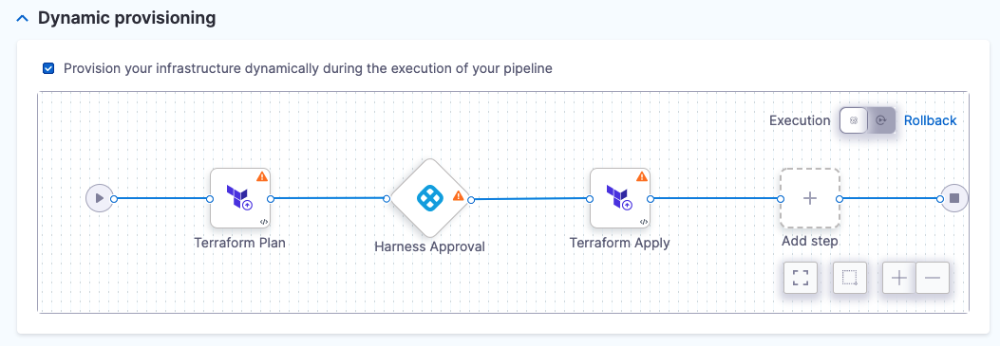
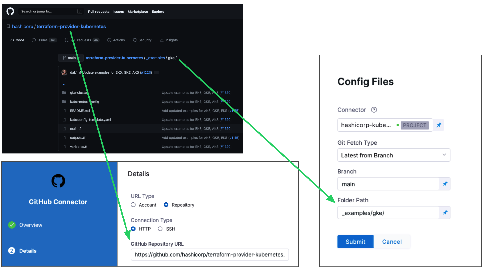
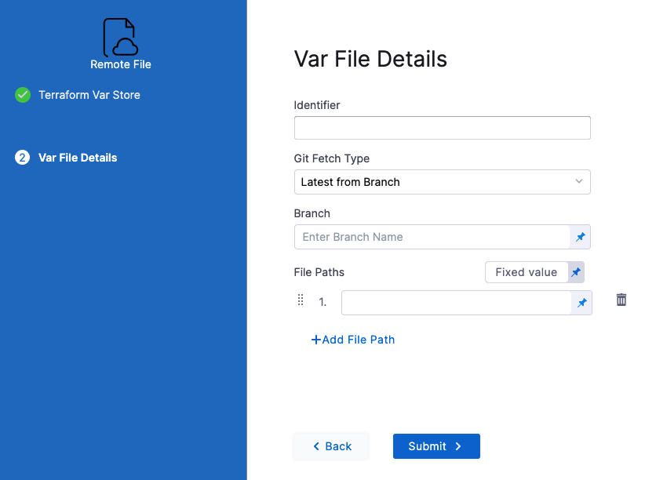
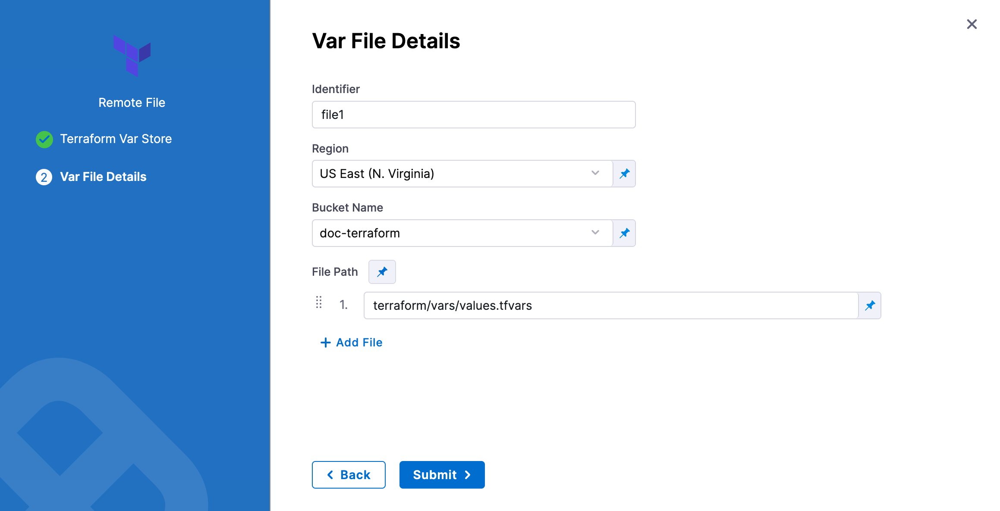
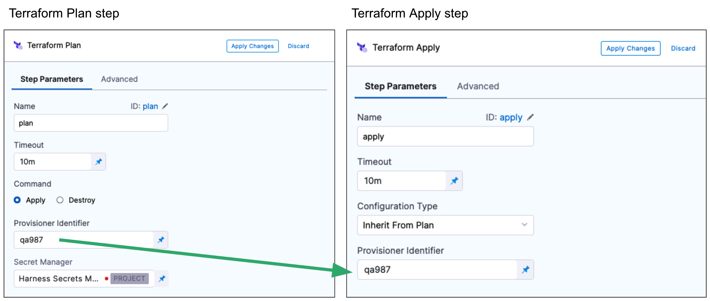
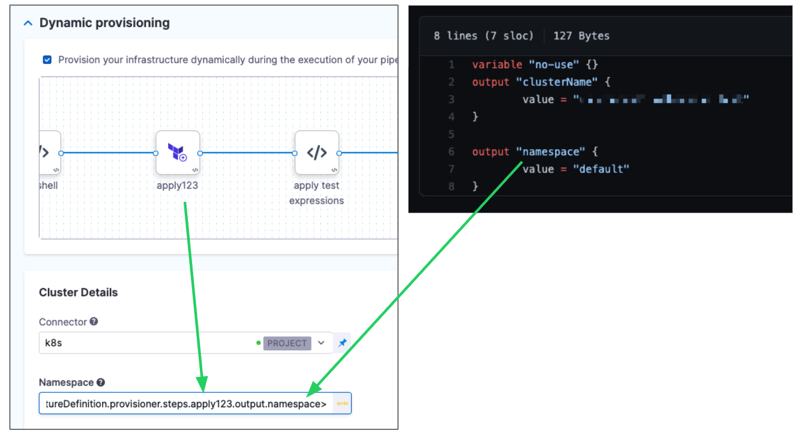
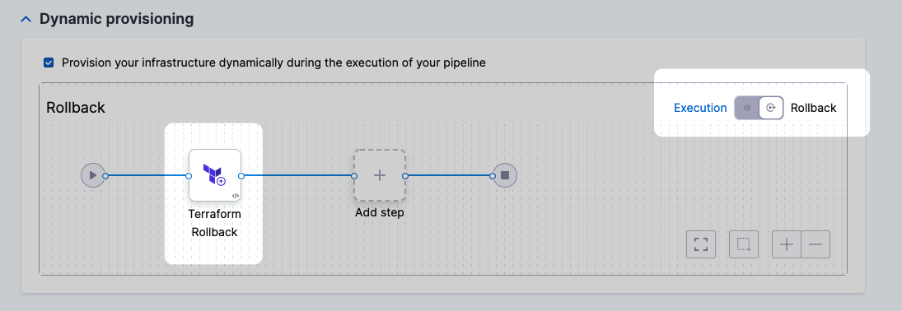
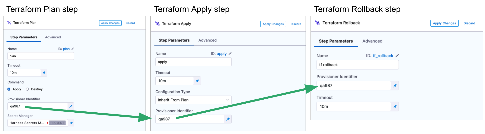

:::info

Dynamic provisioning is only supported in [Service and Environments v1](../../get-started/upgrading/upgrade-cd-v2). Dynamic provisioning will be added to Service and Environments v2 soon. Until then, you can create a stage to provision the target infrastructure and then a subsequent stage to deploy to that provisioned infrastructure.

:::

This topic describes how to provision a CD stage's target deployment infrastructure using the **Terraform Plan** and **Apply** steps.

You use the Terraform steps to run the Terraform script and supporting files from your repo. Harness uses the files to create the infrastructure that your Pipeline will deploy to.

Next, you map the script outputs Harness requires to target the provisioned infrastructure, such as namespace.

During deployment, Harness provisions the target deployment infrastructure and then the stage's Execution steps deploy to the provisioned infrastructure.

To provision non-target infrastructure, add the Terraform Plan and Apply steps to the stage **Execution** section instead of the **Infrastructure** section.

## Before you begin

* [Terraform Provisioning with Harness](terraform-provisioning-with-harness)
* [Kubernetes CD Quickstart](/docs/continuous-delivery/deploy-srv-diff-platforms/kubernetes/kubernetes-cd-quickstart)

## Important: install Terraform on delegates

Terraform must be installed on the Delegate to use a Harness Terraform Provisioner. You can install Terraform manually or use the `INIT_SCRIPT` environment variable in the Delegate YAML.

See [Build custom delegate images with third-party tools](https://developer.harness.io/docs/platform/Delegates/install-delegates/build-custom-delegate-images-with-third-party-tools).


```bash
#!/bin/bash

# Check if microdnf is installed
if ! command -v microdnf &> /dev/null
then
    echo "microdnf could not be found. Installing..."
    yum install -y microdnf
fi

# Update package cache
microdnf update

# Install Terraform
microdnf install -y terraform

```

## Enable dynamic provisioning

These steps assume you've created a Harness CD stage before. If Harness CD is new to you, see [Kubernetes CD Quickstart](/docs/continuous-delivery/deploy-srv-diff-platforms/kubernetes/kubernetes-cd-quickstart).

We'll start in the stage's **Infrastructure** section because the **Service** settings of the stage don't have specific settings for Terraform provisioning. The Service manifests and artifacts will be deployed to the infrastructure provisioned by Harness and Terraform.

1. In the CD stage, click **Infrastructure**. If you haven't already specified your Environment, and selected the Infrastructure Definition, do so.
   
   The type of Infrastructure Definition you select determines what Terraform outputs you'll need to map later.
2. In **Dynamic provisioning**, click **Provision your infrastructure dynamically during the execution of your pipeline**.

The default Terraform provisioning steps appear:



Harness automatically adds the Terraform Plan, [Harness Approval](../../x-platform-cd-features/cd-steps/approvals/using-harness-approval-steps-in-cd-stages), and Terraform Apply steps. You can change these steps, but plan, approve, and apply is the most common process. We use that process in our Terraform documentation.

## Terraform Plan step

The Terraform Plan step is where you connect Harness to your repo and add your Terraform scripts.

### Name

1. In **Name**, enter a name for the step, for example, **plan**.

Harness will create an [Entity Id](/docs/platform/References/entity-identifier-reference) using the name. The Id is very important. It's used to refer to settings in this step.

For example, if the Id of the stage is **terraform** and the Id of the step is **plan**, and you want to echo its timeout setting, you would use:

`<+pipeline.stages.Terraform.spec.infrastructure.infrastructureDefinition.provisioner.steps.plan.timeout>`

### Timeout

1. In **Timeout**, enter how long Harness should wait to complete the Terraform Plan step before failing the step.

### Command

1. In **Command**, select **Apply**. Even though you are only running a Terraform plan in this step, you identify that this step can be used with a Terraform Apply step later.

### Provisioner Identifier

1. Enter a unique value in **Provisioner Identifier**.

The Provisioner Identifier identifies the provisioning done in this step. You use the Provisioner Identifier in additional steps to refer to the provisioning done in this step.

The most common use of Provisioner Identifier is between the Terraform Plan and Terraform Apply steps. To have the Terraform Apply step apply the provisioning from this Terraform Plan step, you use the same Provisioner Identifier in both steps.


#### Provisioner Identifier Scope

The Provisioner Identifier is a Project-wide setting. You can reference it across Pipelines in the same Project.

For this reason, it's important that all your Project members know the Provisioner Identifiers. This will prevent one member building a Pipeline from accidentally impacting the provisioning of another member's Pipeline.

### Secret Manager

1. Select a Secrets Manager to use for encrypting/decrypting and saving the Terraform plan file.

See [Harness Secrets Manager Overview](/docs/platform/Secrets/Secrets-Management/harness-secret-manager-overview).

A Terraform plan is a sensitive file that could be misused to alter resources if someone has access to it. Harness avoids this issue by never passing the Terraform plan file as plain text.

Harness only passes the Terraform plan between the Harness Manager and Delegate as an encrypted file using a Secrets Manager.

Some third-party secret managers, such as HashiCorp Vault, Azure Key Vault, and AWS Secrets Manager, have a maximum secret size limitation. If the size of the secret you want to store exceeds this limit, an error will be thrown by the corresponding third-party system. Therefore, it's crucial to check the maximum secret size supported by your chosen secret manager and ensure that your secrets are within the size limit.

In contrast, key management services like Google Cloud KMS or AWS KMS do not have the same limitation as they are primarily designed for managing encryption keys, not arbitrary secret data. However, it's still essential to check the specific limitations of your chosen key management service and ensure that your secrets meet their requirements.

When designing your secret management strategy and selecting a secret management solution, consider the maximum secret size limit and other limitations that may affect your use case. You may need to choose a secret manager that can handle larger secret sizes or find alternative strategies for managing secrets that exceed the maximum size limit of your chosen secret manager.
 
When the `terraform plan` command runs on the Harness Delegate, the Delegate encrypts the plan and saves it to the Secrets Manager you selected. The encrypted data is passed to the Harness Manager.

When the plan is applied, the Harness Manager passes the encrypted data to the Delegate.

The Delegate decrypts the encrypted plan and applies it using the `terraform apply` command.

### Configuration File Repository

**Configuration File Repository** is where the Terraform script and files you want to use are located.

Here, you'll add a connection to the Terraform script repo.

1. Click **Specify Config File** or edit icon.
   
   The **Terraform Config File Store** settings appear.
2. Click the provider where your files are hosted.
   
   
3. Select or create a Connector for your repo. For steps, see [Connect to a Git Repo](/docs/platform/Connectors/Code-Repositories/connect-to-code-repo),  [Artifactory Connector Settings Reference](/docs/platform/Connectors/Cloud-providers/ref-cloud-providers/artifactory-connector-settings-reference) (see **Artifactory with Terraform Scripts and Variable Definitions (.tfvars) Files**) or [AWS Connector Settings Reference](/docs/platform/Connectors/Cloud-providers/ref-cloud-providers/aws-connector-settings-reference)

If you're simply experimenting, you can use [HashiCorp's Kubernetes repo](https://github.com/hashicorp/terraform-provider-kubernetes/tree/main/_examples/gke).

### Git providers

1. In **Git Fetch Type**, select **Latest from Branch** or **Specific Commit ID**. When you run the Pipeline, Harness will fetch the script from the repo.
2. **Specific Commit ID** also supports [Git tags](https://git-scm.com/book/en/v2/Git-Basics-Tagging).If you think the script might change often, you might want to use **Specific Commit ID**. For example, if you are going to be fetching the script multiple times in your Pipeline, Harness will fetch the script each time. If you select **Latest from Branch** and the branch changes between fetches, different scripts are run.
3. In **Branch**, enter the name of the branch to use.
4. In **Folder Path**, enter the path from the root of the repo to the folder containing the script.
   
   For example, here's a Terraform script repo, the Harness Connector to the repo, and the **Config Files** settings for the branch and folder path:
   
   <!--  -->
   
   <docimage path={require('./static/provision-infra-dynamically-with-terraform-03.png')} />
5. Click **Submit**.

Your Terraform Plan step is now ready. You can now configure the Terraform Apply step that will inherit the Terraform script and settings from this Terraform Plan step.

You can jump ahead to the Terraform Apply step below. The following sections cover common Terraform Plan step options.

### Artifactory

See [Artifactory Connector Settings Reference](/docs/platform/Connectors/Cloud-providers/ref-cloud-providers/artifactory-connector-settings-reference) (see **Artifactory with Terraform Scripts and Variable Definitions (.tfvars) Files**).

### AWS S3

1. In **Region**, select the region where your bucket is stored.
2. In **Bucket**, select the bucket where your Terraform files are stored (all buckets from the selected region that are available to the connector will be fetched).
3. In **Folder Path**, enter the path from the root of the repo to the folder containing the script.

   

Harness will fetch all files from the specified folder.

### Source Module

When you set up the file repo in **Configuration File Repository**, you use a Harness Connector to connect to the repo where the Terraform scripts are located.

Some scripts will reference module sources in other repos and Harness will pull the source code for the desired child module at runtime (during `terraform init`).

In **Source Module**, you can select **Use Connector credentials** to have Harness use the credentials of the Connector to pull the source code for the desired child module(s).

If you do not select **Use Connector credentials**, Terraform will use the credentials that have been set up in the system.

The **Use Connector credentials** setting is limited to Harness Git Connectors using SSH authentication (not HTTPS) and a token.

When configuring the SSH key for the connector, exporting an SSH key with a passphrase for the module source is not supported. Configure an SSH Key without the passphrase.

Here are some syntax examples to reference the Terraform module using the SSH protocol:

```bash
source = "git@github.com:your-username/your-private-module.git"
## Workspace

Harness supports Terraform [workspaces](https://www.terraform.io/docs/state/workspaces.html). A Terraform workspace is a logical representation of one your infrastructures, such as Dev, QA, Stage, Production.

Workspaces are useful when testing changes before moving to a production infrastructure. To test the changes, you create separate workspaces for Dev and Production.

A workspace is really a different state file. Each workspace isolates its state from other workspaces. For more information, see [When to use Multiple Workspaces](https://www.terraform.io/docs/state/workspaces.html#when-to-use-multiple-workspaces) from Hashicorp.

Here's an example script where a local value names two workspaces, **default** and **production**, and associates different instance counts with each:


```json
locals {  
  counts = {  
      "default"=1  
      "production"=3  
  }  
}  
  
resource "aws_instance" "my_service" {  
  ami="ami-7b4d7900"  
  instance_type="t2.micro"  
  count="${lookup(local.counts, terraform.workspace, 2)}"  
  tags {  
         Name = "${terraform.workspace}"  
    }  
}
```

In the workspace interpolation sequence, you can see the count is assigned by applying it to the Terraform workspace variable (`terraform.workspace`) and that the tag is applied using the variable also.

Harness will pass the workspace name you provide to the `terraform.workspace` variable, thus determining the count. If you provide the name **production**, the count will be **3**.

In the **Workspace** setting, you can simply select the name of the workspace to use.

You can also use a [stage variable](/docs/platform/Variables-and-Expressions/harness-variables) in **Workspace**.

Later, when the Pipeline is deployed, you specify the value for the stage variable and it is used in **Workspace**.

This allows you to specify a different workspace name each time the Pipeline is run.

You can even set a Harness Trigger where you can set the workspace name used in **Workspace**.

## Terraform Var Files

The **Terraform Var Files** section is for entering and/or linking to Terraform script Input variables.

You can use inline or remote var files.

Harness supports all [Terraform input types and values](https://www.terraform.io/docs/language/expressions/types.html).

### Inline Variables

You can add inline variables just like you would in a tfvar file.

1. Click **Add Terraform Var File**, and then click **Add Inline**.
2. The **Add Inline Terraform Var File** settings appear.
3. In **Identifier**, enter an identifier so you can refer to variables using expressions if needed.

This Identifier is a [Harness Identifier](/docs/platform/References/entity-identifier-reference), not a Terraform identifier.For example, if the **Identifier** is **myvars** you could refer to its content like this:

`<+pipeline.stages.MyStage.spec.infrastructure.infrastructureDefinition.provisioner.steps.plan.spec.configuration.varFiles.myvars.spec.content>`

Provide the input variables and values for your Terraform script. Harness follows the same format as Terraform.

For example, if your Terraform script has the following:


```json
variable "region" {  
  type = string  
}
```

In **Add Inline Terraform Var File**, you could enter:


```
region = "asia-east1-a"
```

#### Inline variable secrets

If you are entering secrets (for credentials, etc.), use Harness secret references in the value of the variable:


```
secrets_encryption_kms_key = "<+secrets.getValue("org.kms_key")>"
```

See [Add Text Secrets](/docs/platform/Secrets/add-use-text-secrets).

### Remote variables

You can connect Harness to remote variable files.

1. Click **Add Terraform Var File**, and then click **Add Remote**.
2. Select your provider (GitHub, Artifactory, S3, etc.) and then select or create a Connector to the repo where the files are located. Typically, this is the same repo where your Terraform script is located, so you can use the same Connector.
3. Click **Continue**. The **Var File Details** settings appear.


#### Git providers
   

1. In **Identifier**, enter an identifier so you can refer to variables using expressions if needed.
   
   For example, if the **Identifier** is **myremotevars** you could refer to its content like this:
   
   `<+pipeline.stages.MyStage.spec.infrastructure.infrastructureDefinition.provisioner.steps.plan.spec.configuration.varFiles.myremotevars.spec.store.spec.paths>`
2. In **Git Fetch Type**, select **Latest from Branch** or **Specific Commit ID**.
3. In **Branch**, enter the name of the branch.
4. In **File Paths**, add one or more file paths from the root of the repo to the variable file.
5. Click **Submit**. The remote file(s) are added.

#### Artifactory

See [Artifactory Connector Settings Reference](/docs/platform/Connectors/Cloud-providers/ref-cloud-providers/artifactory-connector-settings-reference) (see **Artifactory with Terraform Scripts and Variable Definitions (.tfvars) Files**).

#### AWS S3

1. In **Identifier**, enter an identifier so you can refer to variables using expressions if needed.
2. In **Region**, select the region where your bucket is stored.
3. In **Bucket**, select the bucket where your Terraform var files are stored (all buckets from the selected region that are available to the connector will be fetched).
4. In **File Paths**, add one or more file paths from the root of the bucket to the variable file.

   

 Click **Submit**. The remote file(s) are added.

## Backend Configuration

The **Backend Configuration** section contains the [remote state](https://www.terraform.io/docs/language/state/remote.html) values.

Enter values for each backend config (remote state variable).

For example, if your config.tf file has the following backend:

```json
terraform {  
  backend "gcs" {  
    bucket  = "tf-state-prod"  
    prefix  = "terraform/state"  
  }  
}
```

In **Backend Configuration**, you provide the required configuration variables for the backend type. 

For a remote backend configuration, the variables should be in .tfvars file.

Example:

```json
bucket  = "tf-state-prod"  
prefix  = "terraform/state"
```

In your Terraform .tf config file, only the definition of the Terraform backend is required:

```json
terraform {  
  backend "gcs" {}
}
```

See **Configuration variables** in Terraform's [gcs Standard Backend doc](https://www.terraform.io/docs/language/settings/backends/gcs.html#configuration-variables).

You can use Harness secrets for credentials. See [Add Text Secrets](/docs/platform/Secrets/add-use-text-secrets).

## Targets

You can use the **Targets** setting to target one or more specific modules in your Terraform script, just like using the `terraform plan -target` command. See [Resource Targeting](https://www.terraform.io/docs/commands/plan.html#resource-targeting) from Terraform.

You simply identify the module using the standard format `module.name`, like you would using `terraform plan -target="module.s3_bucket"`.

If you have multiple modules in your script and you don't select one in **Targets**, all modules are used.

## Environment Variables

If your Terraform script uses [environment variables](https://www.terraform.io/docs/cli/config/environment-variables.html), you can provide values for those variables here.

For example:

```bash
TF_LOG_PATH=./terraform.log  
TF_VAR_alist='[1,2,3]'
```
You can use Harness encrypted text for values. See [Add Text Secrets](/docs/platform/Secrets/add-use-text-secrets).

## Advanced settings

In **Advanced**, you can use the following options:

* [Delegate Selector](https://developer.harness.io/docs/platform/delegates/manage-delegates/select-delegates-with-selectors/)
* [Conditional Execution](https://developer.harness.io/docs/platform/pipelines/w_pipeline-steps-reference/step-skip-condition-settings/)
* [Failure Strategy](https://developer.harness.io/docs/platform/pipelines/w_pipeline-steps-reference/step-failure-strategy-settings/)
* [Looping Strategy](https://developer.harness.io/docs/platform/pipelines/looping-strategies-matrix-repeat-and-parallelism/)
* [Policy Enforcement](https://developer.harness.io/docs/platform/Governance/Policy-as-code/harness-governance-overview)

## Approval step

By default, Harness adds an Approval step between the Terraform Plan and Terraform Apply steps. You can remove this step or follow the steps in [Using Manual Harness Approval Steps in CD Stages](../../x-platform-cd-features/cd-steps/approvals/using-harness-approval-steps-in-cd-stages) to configure the step.

You can also use a Jira Approval step. See [Adding Jira Approval Stages and Steps](/docs/platform/Approvals/adding-jira-approval-stages).

## Terraform Apply Step

The Terraform Apply step simply inherits its configuration from the Terraform Plan step you already configured.

As stated earlier, you use the same **Provisioner Identifier** in the Terraform Plan and Terraform Apply steps:



1. In **Terraform Apply**, enter a name for the step. The name is very important, as you'll use it to select the outputs from the Terraform apply operation.
   
   You'll use the outputs when mapping the provisioned infrastructure to the target Infrastructure Definition.
   For example, if you name the Terraform Apply step **apply123** and you want to reference the **region** output in your script, you'd use the expression:
   `<+infrastructureDefinition.provisioner.steps.apply123.output.region>`
   The mapping is explained in the next step.
2. In **Timeout**, enter how long Harness should wait to complete the Terraform Apply step before failing the step.
3. In **Configuration Type**, select **Inherit From Plan**. If you select **Inline**, then you aren't using the previous Terraform Plan step. You are entering separate Terraform files and settings.
4. In **Provisioner Identifier**, enter the same Provisioner Identifier you entered in the Terraform Plan step.
5. Click **Apply Changes**.

## Map outputs to target infra settings

Now that the Terraform Plan and Terraform Apply steps are set up in **Dynamic provisioning**, Harness is configured to provision the infrastructure defined in your Terraform script.

Next, in the **Infrastructure Definition**, you need to provide the required Infrastructure Definition settings so Harness can target and deploy to the provisioned infrastructure.

The required settings are specific outputs from your Terraform script. Which settings are required depends on the type of target infrastructure you are provisioning/targeting.

For example, a platform-agnostic Kubernetes cluster infrastructure only requires the target namespace in the target cluster.

Gather the following:

* The name you gave the Terraform Apply step.
* The names of the required outputs from your Terraform script.

Create the FQN expression for each output.

The expressions follow the format:

`<+infrastructureDefinition.provisioner.steps.[Apply Step Id].output.[output name]>`

For example, for a Kubernetes deployment, you need to map the `namespace` output to the **Namespace** setting in Infrastructure Definition.

So for a Terraform Apply step with the Id **apply123** and an output named **namespace**, the expression is:

`<+infrastructureDefinition.provisioner.steps.apply123.output.namespace>`

Here you can see how the expression is created from the Terraform Apply step name and the Terraform script (output.tf, config.tf, etc):

Use the expressions to map the outputs in the required Infrastructure Definition settings, such as **namespace** in **Cluster Details**.

<!--  -->

<docimage path={require('./static/provision-infra-dynamically-with-terraform-06.png')} />

Now Harness has the provisioned target infrastructure set up.

You can complete your Pipeline and then run it.

Harness will provision the target infrastructure and then deploy to it.

Terraform steps also output the commit Id of config files stored on Git. The outputs are available using expressions. 

For example, for a Terraform Apply step with the identifier `TerraformApply` and with config files, backend config files, and var files stored in git, the expressions would look like this:

- **Config files**: `<+pipeline.stages.test.spec.execution.steps.TerraformApply.git.revisions.TF_CONFIG_FILES>`
- **Backend config files**: `<+pipeline.stages.test.spec.execution.steps.TerraformApply.git.revisions.TF_BACKEND_CONFIG_FILE>`
- **Var file** with identifier `varfile1`: `<+pipeline.stages.test.spec.execution.steps.TerraformApply.git.revisions.varfile1>`

## Terraform Rollback

The **Terraform Rollback** step is automatically added to the **Rollback** section.



1. Open **Terraform Rollback**.
2. Enter a name for the step.
3. In **Provisioner Identifier**, enter the same Provisioner Identifier you used in the Terraform Plan and Apply steps.
   
   <!--  -->
   
   <docimage path={require('./static/provision-infra-dynamically-with-terraform-08.png')} />
4. Click **Apply Changes**.

When rollback happens, Harness rolls back the provisioned infrastructure to the previous successful version of the Terraform state.

Harness won't increment the serial in the state, but perform a hard rollback to the exact version of the state provided.

Harness determines what to rollback using the **Provisioner Identifier**.

If you've made these settings expressions, Harness uses the values it obtains at runtime when it evaluates the expression.

### Rollback limitations

Let's say you deployed two modules successfully already: module1 and module2. Next, you try to deploy module3, but deployment failed. Harness will roll back to the successful state of module1 and module2.

However, let's look at the situation where module3 succeeds and now you have module1, module2, and module3 deployed. If the next deployment fails, the rollback will only roll back to the Terraform state with module3 deployed. Module1 and module2 weren't in the previous Terraform state, so the rollback excludes them.

## See also

* [Apply a Terraform Plan with the Terraform Apply Step](/docs/continuous-delivery/cd-infrastructure/terraform-infra/run-a-terraform-plan-with-the-terraform-apply-step)

