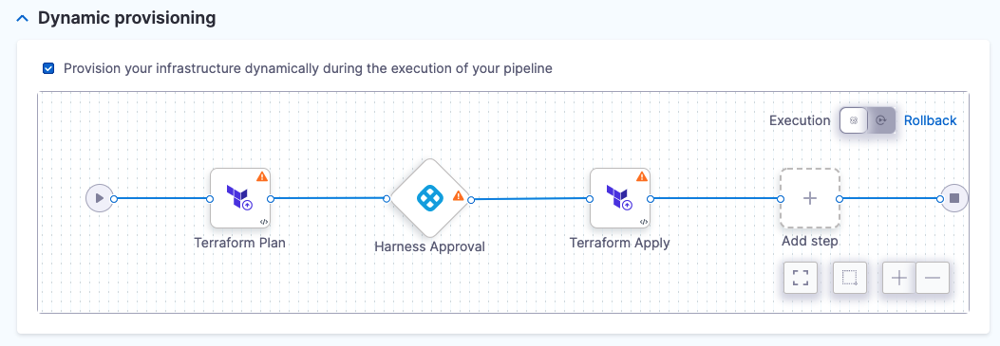
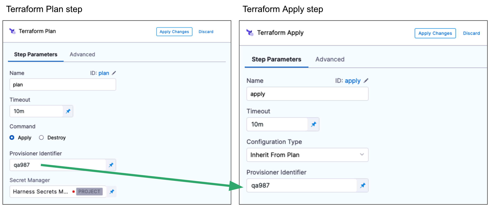

import DocImage from '@site/src/components/DocImage';
import { Troubleshoot } from '@site/src/components/AdaptiveAIContent';

Dynamic provisioning means Harness creates the target infrastructure on-demand during pipeline execution, rather than deploying to pre-existing infrastructure. You configure Terraform Plan and Apply steps in your CD stage's Environment settings to run your Terraform scripts, map outputs to your Infrastructure Definition, and then deploy your application to the newly provisioned infrastructure.

---

## Before you begin

- **Harness account with Continuous Delivery module enabled:** You need **Continuous Delivery** under **Deployments** in Harness when it is entitled on your account. Go to [Getting started with Harness Platform](/docs/platform/get-started/onboarding-guide) to learn how to access or create a Harness account.

    :::info Contact Harness support:

    If the Continuous Delivery module does not appear, contact your account administrator or [Harness Support](mailto:support@harness.io).

    :::

- **Pipeline and environment permissions:** You need **View**, **Create/Edit**, and **Execute** for [Pipelines](/docs/platform/role-based-access-control/permissions-reference#pipelines), and **View** and **Create/Edit** for [Environments](/docs/platform/role-based-access-control/permissions-reference#environments). To get these permissions, an administrator must assign you a role that includes them. Go to [RBAC in Harness](/docs/platform/role-based-access-control/rbac-in-harness) and [Manage roles](/docs/platform/role-based-access-control/add-manage-roles) to understand how roles and permissions work.

- **Terraform or OpenTofu installed on Harness Delegate:** Terraform or OpenTofu must be installed on the delegate to execute provisioning commands. Go to [Build custom delegate images with third-party tools](/docs/platform/delegates/install-delegates/build-custom-delegate-images-with-third-party-tools) to install Terraform or OpenTofu via the `INIT_SCRIPT` environment variable.

    <details>
    <summary>Example delegate installation script for Terraform</summary>

    ```bash
    #!/bin/bash

    # Check if microdnf is installed
    if ! command -v microdnf &> /dev/null
    then
        echo "microdnf could not be found. Installing..."
        yum install -y microdnf
    fi

    # Update package cache
    microdnf update

    # Install Terraform
    microdnf install -y terraform
    ```

    </details>

- **Terraform configuration files in a Git repository or cloud storage:** Your Terraform scripts must be accessible via a Harness connector. Go to [Connect to a Git repo](/docs/platform/connectors/code-repositories/connect-to-code-repo) to create a Git connector, or go to [Artifactory Connector Settings Reference](/docs/platform/connectors/cloud-providers/ref-cloud-providers/artifactory-connector-settings-reference) and [AWS Connector Settings Reference](/docs/platform/connectors/cloud-providers/ref-cloud-providers/aws-connector-settings-reference) for cloud storage options.

- **Harness Secret Manager configured:** Harness encrypts Terraform plan files using a Secret Manager before passing them between the Harness Manager and delegates. Go to [Harness Secrets Manager Overview](/docs/platform/secrets/secrets-management/harness-secret-manager-overview) to set up a Secret Manager if you do not have one configured.

---

## Configure Terraform Plan and Apply steps

These steps guide you through configuring dynamic provisioning in a CD stage's **Environment** settings. If Harness CD is new to you, go to [Kubernetes CD Quickstart](/docs/continuous-delivery/deploy-srv-diff-platforms/kubernetes/kubernetes-cd-quickstart) to learn how to create a CD pipeline and stage.

The **Service** settings of the stage do not have specific settings for Terraform provisioning. The Service manifests and artifacts are deployed to the infrastructure provisioned by Harness and Terraform.

1. In the CD stage, click **Infrastructure**. If you have not already specified your Environment and selected the Infrastructure Definition, do so.
   
   The type of Infrastructure Definition you select determines what Terraform outputs (values exported from your Terraform configuration) you will need to map later.

2. In **Dynamic provisioning**, click **Provision your infrastructure dynamically during the execution of your pipeline**.

The default Terraform provisioning steps appear:



Harness automatically adds the Terraform Plan, [Harness Approval](/docs/continuous-delivery/x-platform-cd-features/cd-steps/approvals/using-harness-approval-steps-in-cd-stages), and Terraform Apply steps. You can change these steps, but plan, approve, and apply is the most common process.

---

## Configure the Terraform Plan step

The Terraform Plan step is where you connect Harness to your repo and add your Terraform scripts.

### Step name

1. In **Name**, enter a name for the step, for example, **plan**.

Harness will create an [Entity Id](/docs/platform/references/entity-identifier-reference) using the name. The Id is very important. It is used to refer to settings in this step.

For example, if the Id of the stage is **terraform** and the Id of the step is **plan**, and you want to echo its timeout setting, you would use:

`<+pipeline.stages.Terraform.spec.infrastructure.infrastructureDefinition.provisioner.steps.plan.timeout>`

### Set the timeout

1. In **Timeout**, enter how long Harness should wait to complete the Terraform Plan step before failing the step.

### Select the command

1. In **Command**, select **Apply**. Even though you are only running a Terraform plan in this step, you identify that this step can be used with a Terraform Apply step later.

### Set the Provisioner Identifier

1. Enter a unique value in **Provisioner Identifier**.

The Provisioner Identifier is a unique label that links the Terraform Plan step to the Terraform Apply step, allowing the Apply step to inherit the plan configuration. You use the Provisioner Identifier in additional steps to refer to the provisioning done in this step.

The most common use of Provisioner Identifier is between the Terraform Plan and Terraform Apply steps. To have the Terraform Apply step apply the provisioning from this Terraform Plan step, you use the same Provisioner Identifier in both steps.



#### Provisioner Identifier scope

The Provisioner Identifier is a Project-wide setting. You can reference it across Pipelines in the same Project.

For this reason, it is important that all your Project members know the Provisioner Identifiers. This will prevent one member building a Pipeline from accidentally impacting the provisioning of another member's Pipeline.

### Select a Secret Manager

1. Select a Secrets Manager to use for encrypting, decrypting, and saving the Terraform plan file. If you do not have a Secret Manager configured, go to [Harness Secrets Manager Overview](/docs/platform/secrets/secrets-management/harness-secret-manager-overview) to set one up.

A Terraform plan is a sensitive file that could be misused to alter resources if someone has access to it. Harness avoids this issue by never passing the Terraform plan file as plain text.

Harness only passes the Terraform plan between the Harness Manager and Delegate as an encrypted file using a Secrets Manager.

Some third-party secret managers, such as HashiCorp Vault, Azure Key Vault, and AWS Secrets Manager, have a maximum secret size limitation. If the size of the secret you want to store exceeds this limit, an error will be thrown by the corresponding third-party system. Therefore, it is crucial to check the maximum secret size supported by your chosen secret manager and ensure that your secrets are within the size limit.

In contrast, key management services like Google Cloud KMS or AWS KMS do not have the same limitation as they are primarily designed for managing encryption keys, not arbitrary secret data. However, it is still essential to check the specific limitations of your chosen key management service and ensure that your secrets meet their requirements.

When designing your secret management strategy and selecting a secret management solution, consider the maximum secret size limit and other limitations that may affect your use case. You may need to choose a secret manager that can handle larger secret sizes or find alternative strategies for managing secrets that exceed the maximum size limit of your chosen secret manager.
 
When the `terraform plan` command runs on the Harness Delegate, the Delegate encrypts the plan and saves it to the Secrets Manager you selected. The encrypted data is passed to the Harness Manager.

When the plan is applied, the Harness Manager passes the encrypted data to the Delegate.

The Delegate decrypts the encrypted plan and applies it using the `terraform apply` command.

### Connect to your Terraform script repository

**Configuration File Repository** is where the Terraform script and files you want to use are located.

Here, you will add a connection to the Terraform script repo.

1. Click **Specify Config File** or edit icon.
   
   The **Terraform Config File Store** settings appear.

2. Click the provider where your files are hosted.
   
   

3. Select or create a Connector for your repo. Go to [Connect to a Git Repo](/docs/platform/connectors/code-repositories/connect-to-code-repo) to create a Git connector, go to [Artifactory Connector Settings Reference](/docs/platform/connectors/cloud-providers/ref-cloud-providers/artifactory-connector-settings-reference) (see **Artifactory with Terraform Scripts and Variable Definitions (.tfvars) Files**) to configure Artifactory, or go to [AWS Connector Settings Reference](/docs/platform/connectors/cloud-providers/ref-cloud-providers/aws-connector-settings-reference) to configure AWS S3.

If you are simply experimenting, you can use [HashiCorp's Kubernetes repo](https://github.com/hashicorp/terraform-provider-kubernetes/tree/main/_examples/gke).

#### For Git providers

1. In **Git Fetch Type**, select **Latest from Branch** or **Specific Commit ID**. When you run the Pipeline, Harness will fetch the script from the repo.

2. **Specific Commit ID** also supports [Git tags](https://git-scm.com/book/en/v2/Git-Basics-Tagging). If you think the script might change often, you might want to use **Specific Commit ID**. For example, if you are going to be fetching the script multiple times in your Pipeline, Harness will fetch the script each time. If you select **Latest from Branch** and the branch changes between fetches, different scripts are run.

3. In **Branch**, enter the name of the branch to use.

4. In **Folder Path**, enter the path from the root of the repo to the folder containing the script.
   
   For example, here is a Terraform script repo, the Harness Connector to the repo, and the **Config Files** settings for the branch and folder path:
   
   <DocImage path={require('./static/provision-infra-dynamically-with-terraform-03.png')} />

5. Click **Submit**.

Your Terraform Plan step is now ready. You can now configure the Terraform Apply step that will inherit the Terraform script and settings from this Terraform Plan step.

You can jump ahead to the Terraform Apply step below. The following sections cover common Terraform Plan step options.

#### For Artifactory

Go to [Artifactory Connector Settings Reference](/docs/platform/connectors/cloud-providers/ref-cloud-providers/artifactory-connector-settings-reference) (see **Artifactory with Terraform Scripts and Variable Definitions (.tfvars) Files**) to configure Artifactory for Terraform scripts.

#### For AWS S3

1. In **Region**, select the region where your bucket is stored.

2. In **Bucket**, select the bucket where your Terraform files are stored (all buckets from the selected region that are available to the connector will be fetched).

3. In **Folder Path**, enter the path from the root of the repo to the folder containing the script.

   

Harness will fetch all files from the specified folder.

### Configure module source credentials

When you set up the file repo in **Configuration File Repository**, you use a Harness Connector to connect to the repo where the Terraform scripts are located.

Some scripts will reference module sources in other repos and Harness will pull the source code for the desired child module at runtime (during `terraform init`).

In **Source Module**, you can select **Use Connector credentials** to have Harness use the credentials of the Connector to pull the source code for the desired child module(s).

If you do not select **Use Connector credentials**, Terraform will use the credentials that have been set up in the system.

The **Use Connector credentials** setting allows Harness Git Connectors using SSH and HTTPS authentication.

When configuring the SSH key for the connector, exporting an SSH key with a passphrase for the module source is not supported. Configure an SSH Key without the passphrase.

Here is a syntax example to reference the Terraform module using the SSH protocol:

```bash
source = "git@github.com:your-username/your-private-module.git"
```

Here is a syntax example to reference the Terraform module using the HTTPS protocol:

```bash
source = "git::https://github.com/your-organization/your-private-module.git"
```

:::tip

The ability to authenticate with HTTPS is new! The Minimum required delegate version is: 83401. Here is a demo on its functionality:

<DocVideo src="https://www.loom.com/share/bb8b9e4996f14bf0a16839849b0b72e4?sid=3befc405-7c4d-4f21-afe0-c36e2962b566" />

:::

### Configure workspace settings

Harness supports Terraform [workspaces](https://www.terraform.io/docs/state/workspaces.html). A Terraform workspace is a logical representation of one your infrastructures, such as Dev, QA, Stage, Production.

Workspaces are useful when testing changes before moving to a production infrastructure. To test the changes, you create separate workspaces for Dev and Production.

A workspace is really a different state file. Each workspace isolates its state from other workspaces. For more information, go to [When to use Multiple Workspaces](https://www.terraform.io/docs/state/workspaces.html#when-to-use-multiple-workspaces) from Hashicorp to learn about workspace best practices.

Harness will create the workspace if it does not exist, or switch to it if it already exists.

Here is an example script where a local value names two workspaces, **default** and **production**, and associates different instance counts with each:


```json
locals {  
  counts = {  
      "default"=1  
      "production"=3  
  }  
}  
  
resource "aws_instance" "my_service" {  
  ami="ami-7b4d7900"  
  instance_type="t2.micro"  
  count="${lookup(local.counts, terraform.workspace, 2)}"  
  tags {  
         Name = "${terraform.workspace}"  
    }  
}
```

In the workspace interpolation sequence, you can see the count is assigned by applying it to the Terraform workspace variable (`terraform.workspace`) and that the tag is applied using the variable also.

Harness will pass the workspace name you provide to the `terraform.workspace` variable, thus determining the count. If you provide the name **production**, the count will be **3**.

In the **Workspace** setting, you can simply select the name of the workspace to use.

You can also use a [stage variable](/docs/platform/variables-and-expressions/harness-variables) in **Workspace**.

Later, when the Pipeline is deployed, you specify the value for the stage variable and it is used in **Workspace**.

This allows you to specify a different workspace name each time the Pipeline is run.

You can even set a Harness Trigger where you can set the workspace name used in **Workspace**.

### Add Terraform variable files

The **Terraform Var Files** section is for entering and linking to Terraform script Input variables.

You can use inline or remote var files.

Harness supports all [Terraform input types and values](https://www.terraform.io/docs/language/expressions/types.html).

#### For inline variables

You can add inline variables just like you would in a tfvar file.

1. Click **Add Terraform Var File**, and then click **Add Inline**.

2. The **Add Inline Terraform Var File** settings appear.

3. In **Identifier**, enter an identifier so you can refer to variables using expressions if needed.

This Identifier is a [Harness Identifier](/docs/platform/references/entity-identifier-reference), not a Terraform identifier. For example, if the **Identifier** is **myvars** you could refer to its content like this:

`<+pipeline.stages.MyStage.spec.infrastructure.infrastructureDefinition.provisioner.steps.plan.spec.configuration.varFiles.myvars.spec.content>`

Provide the input variables and values for your Terraform script. Harness follows the same format as Terraform.

For example, if your Terraform script has the following:


```json
variable "region" {  
  type = string  
}
```

In **Add Inline Terraform Var File**, you could enter:


```
region = "asia-east1-a"
```

##### Inline variable secrets

If you are entering secrets (for credentials, etc.), use Harness secret references in the value of the variable:


```
secrets_encryption_kms_key = "<+secrets.getValue("org.kms_key")>"
```

Go to [Add Text Secrets](/docs/platform/secrets/add-use-text-secrets) to create encrypted variables in Harness Secret Manager.

#### For remote variable files

You can connect Harness to remote variable files.

1. Click **Add Terraform Var File**, and then click **Add Remote**.

2. Select your provider (GitHub, Artifactory, S3, etc.) and then select or create a Connector to the repo where the files are located. Typically, this is the same repo where your Terraform script is located, so you can use the same Connector.

3. Click **Continue**. The **Var File Details** settings appear.


##### Git providers
   

1. In **Identifier**, enter an identifier so you can refer to variables using expressions if needed.
   
   For example, if the **Identifier** is **myremotevars** you could refer to its content like this:
   
   `<+pipeline.stages.MyStage.spec.infrastructure.infrastructureDefinition.provisioner.steps.plan.spec.configuration.varFiles.myremotevars.spec.store.spec.paths>`

2. In **Git Fetch Type**, select **Latest from Branch** or **Specific Commit ID**.

3. In **Branch**, enter the name of the branch.

4. In **File Paths**, add one or more file paths from the root of the repo to the variable file.

5. Click **Submit**. The remote file(s) are added.

##### Artifactory

Go to [Artifactory Connector Settings Reference](/docs/platform/connectors/cloud-providers/ref-cloud-providers/artifactory-connector-settings-reference) (see **Artifactory with Terraform Scripts and Variable Definitions (.tfvars) Files**) to configure Artifactory for Terraform variable files.

##### AWS S3

1. In **Identifier**, enter an identifier so you can refer to variables using expressions if needed.

2. In **Region**, select the region where your bucket is stored.

3. In **Bucket**, select the bucket where your Terraform var files are stored (all buckets from the selected region that are available to the connector will be fetched).

4. In **File Paths**, add one or more file paths from the root of the bucket to the variable file.

   

 Click **Submit**. The remote file(s) are added.

### Configure the remote backend

The **Backend Configuration** section contains the [remote state](https://www.terraform.io/docs/language/state/remote.html) values.

Enter values for each backend config (remote state variable).

For example, if your config.tf file has the following backend:

```json
terraform {  
  backend "gcs" {  
    bucket  = "tf-state-prod"  
    prefix  = "terraform/state"  
  }  
}
```

In **Backend Configuration**, you provide the required configuration variables for the backend type. 

For a remote backend configuration, the variables should be in .tfvars file.

Example:

```json
bucket  = "tf-state-prod"  
prefix  = "terraform/state"
```

In your Terraform .tf config file, only the definition of the Terraform backend is required:

```json
terraform {  
  backend "gcs" {}
}
```

Go to Terraform's [gcs Standard Backend doc](https://www.terraform.io/docs/language/settings/backends/gcs.html#configuration-variables) to review configuration variables for the GCS backend.

You can use Harness secrets for credentials. Go to [Add Text Secrets](/docs/platform/secrets/add-use-text-secrets) to create encrypted variables in Harness Secret Manager.

### Specify Terraform targets

You can use the **Targets** setting to target one or more specific modules in your Terraform script, just like using the `terraform plan -target` command. Go to [Resource Targeting](https://www.terraform.io/docs/commands/plan.html#resource-targeting) from Terraform to learn about targeting specific modules.

You simply identify the module using the standard format `module.name`, like you would using `terraform plan -target="module.s3_bucket"`.

If you have multiple modules in your script and you do not select one in **Targets**, all modules are used.

### Add environment variables

If your Terraform script uses [environment variables](https://www.terraform.io/docs/cli/config/environment-variables.html), you can provide values for those variables here.

For example:

```bash
TF_LOG_PATH=./terraform.log  
TF_VAR_alist='[1,2,3]'
```
You can use Harness encrypted text for values. Go to [Add Text Secrets](/docs/platform/secrets/add-use-text-secrets) to create encrypted variables in Harness Secret Manager.

### Configure advanced settings

In **Advanced**, you can use the following options:

* [Delegate Selector](/docs/platform/delegates/manage-delegates/select-delegates-with-selectors)
* [Conditional Execution](/docs/platform/pipelines/step-skip-condition-settings)
* [Failure Strategy](/docs/platform/pipelines/failure-handling/define-a-failure-strategy-on-stages-and-steps)
* [Looping Strategy](/docs/platform/pipelines/looping-strategies/looping-strategies-matrix-repeat-and-parallelism)
* [Policy Enforcement](/docs/platform/governance/policy-as-code/harness-governance-overview)

---

## Configure the Approval step

When you enable dynamic provisioning in a CD Deploy stage's **Environment** settings, Harness automatically adds the necessary Harness Terraform steps:

- **Terraform Plan step**: the Terraform Plan step connects Harness to your repo and pulls your Terraform scripts.
- **Approval step**: Harness adds a Manual Approval step between the Terraform Plan and Terraform Apply steps. You can remove this step or go to [Using Manual Harness Approval Steps in CD Stages](/docs/continuous-delivery/x-platform-cd-features/cd-steps/approvals/using-harness-approval-steps-in-cd-stages) to configure the step.
  - You can also use a [Jira or ServiceNow Approval](/docs/continuous-delivery/x-platform-cd-features/cd-steps/approvals/using-jira-and-service-now-approval-steps-in-cd-stages) step.
- **Terraform Apply step**: the Terraform Apply step simply inherits its configuration from the Terraform Plan step you already configured and applies it.

:::important

You must use the same **Provisioner Identifier** in the Terraform Plan and Terraform Apply steps:  

<DocImage path={require('./static/provision-infra-dynamically-with-terraform-05.png')} width="80%" height="80%" title="Click to view full size image" /> 

:::

For details on configuring the Terraform steps, go to:

- [Terraform Plan](/docs/continuous-delivery/cd-infrastructure/terraform-infra/run-a-terraform-plan-with-the-terraform-plan-step)
- [Terraform Apply](/docs/continuous-delivery/cd-infrastructure/terraform-infra/run-a-terraform-plan-with-the-terraform-apply-step)

---

## Terraform Rollback step

Terraform steps also output the commit Id of config files stored on Git. The outputs are available using expressions. 

For example, for a Terraform Apply step with the identifier `TerraformApply` and with config files, backend config files, and var files stored in git, the expressions would look like this:

- **Config files**: `<+pipeline.stages.test.spec.execution.steps.TerraformApply.git.revisions.TF_CONFIG_FILES>`
- **Backend config files**: `<+pipeline.stages.test.spec.execution.steps.TerraformApply.git.revisions.TF_BACKEND_CONFIG_FILE>`
- **Var file** with identifier `varfile1`: `<+pipeline.stages.test.spec.execution.steps.TerraformApply.git.revisions.varfile1>`

The **Terraform Rollback** step is automatically added to the **Rollback** section.


Go to [Terraform Rollback](/docs/continuous-delivery/cd-infrastructure/terraform-infra/rollback-provisioned-infra-with-the-terraform-rollback-step) to configure the Terraform Rollback step. 

When rollback happens, Harness rolls back the provisioned infrastructure to the previous successful version of the Terraform state.

Harness will not increment the serial in the state, but perform a hard rollback to the exact version of the state provided.

Harness determines what to roll back using the **Provisioner Identifier**.

If you have made these settings expressions, Harness uses the values it obtains at runtime when it evaluates the expression.

### Rollback limitations

Harness rolls back to the most recent successful Terraform state for the Provisioner Identifier. If your current deployment includes new modules not present in the previous successful state, those modules will not be rolled back.

For example, if your previous successful deployment had module1 and module2, and the current deployment added module3 but failed, Harness will roll back to the successful state that included module1 and module2.

However, if module3 succeeds and you now have module1, module2, and module3 deployed, the next failure will roll back only to the Terraform state with module3 deployed. Module1 and module2 are not included in that rollback because they were not part of the most recent successful state.

---

## Troubleshooting

<Troubleshoot
  issue="Error acquiring the state lock in Harness CD Terraform Plan step with remote backend"
  mode="docs"
  fallback="Ensure no other process is holding a lock. Harness retries state lock acquisition automatically."
/>

<Troubleshoot
  issue="Terraform plan file exceeds Secret Manager size limit in Harness CD"
  mode="docs"
  fallback="Switch to a KMS-based Secret Manager (Google Cloud KMS, AWS KMS) which do not have the same size limitations as vault-based secret managers."
/>

<Troubleshoot
  issue="Terraform module source authentication fails in Harness with private Git repos"
  mode="docs"
  fallback="In the Terraform Plan step, enable 'Use Connector credentials' under Source Module and ensure your Harness Git Connector uses SSH or HTTPS authentication."
/>

<Troubleshoot
  issue="Provisioner Identifier conflict across multiple Harness pipelines"
  mode="docs"
  fallback="Provisioner Identifiers are project-wide. Use unique identifiers for each pipeline or coordinate with your team to avoid reusing identifiers."
/>

---

## Next steps

You have configured Terraform Plan and Apply steps to dynamically provision infrastructure in a CD pipeline. Harness will now provision the target infrastructure using your Terraform scripts before deploying your application.

Each deployment type requires different Terraform script outputs to be mapped to the Harness Infrastructure Definition. Go to the following topics to learn how to map outputs for your deployment type:

- [Kubernetes infrastructure](/docs/continuous-delivery/deploy-srv-diff-platforms/kubernetes/define-your-kubernetes-target-infrastructure): Also used for Helm, Native Helm, and Kustomize deployment types
- [Azure Web Apps](/docs/continuous-delivery/deploy-srv-diff-platforms/azure/azure-web-apps-tutorial)
- [AWS ASG](/docs/continuous-delivery/deploy-srv-diff-platforms/aws/asg/asg-tutorial)
- [AWS ECS](/docs/continuous-delivery/deploy-srv-diff-platforms/aws/ecs/ecs-deployment-tutorial)
- [AWS Lambda](/docs/continuous-delivery/deploy-srv-diff-platforms/aws/aws-lambda-deployments)
- [Spot Elastigroup](/docs/continuous-delivery/deploy-srv-diff-platforms/aws/spot/spot-deployment)
- [Google Cloud Functions](/docs/continuous-delivery/deploy-srv-diff-platforms/google-cloud-functions/google-functions)
- [Serverless.com framework for AWS Lambda](/docs/continuous-delivery/deploy-srv-diff-platforms/serverless/serverless-lambda-cd-quickstart)
- [Tanzu Application Services](/docs/continuous-delivery/deploy-srv-diff-platforms/tanzu/tanzu-app-services-quickstart)
- [VM deployments using SSH](/docs/continuous-delivery/deploy-srv-diff-platforms/traditional/ssh-ng)
- [Windows VM deployments using WinRM](/docs/continuous-delivery/deploy-srv-diff-platforms/traditional/win-rm-tutorial)

For more details on the Terraform steps, go to:

- [Terraform Apply step reference](/docs/continuous-delivery/cd-infrastructure/terraform-infra/run-a-terraform-plan-with-the-terraform-apply-step)
- [Terraform Rollback step reference](/docs/continuous-delivery/cd-infrastructure/terraform-infra/rollback-provisioned-infra-with-the-terraform-rollback-step)
- [Terraform Plan step reference](/docs/continuous-delivery/cd-infrastructure/terraform-infra/run-a-terraform-plan-with-the-terraform-plan-step)
