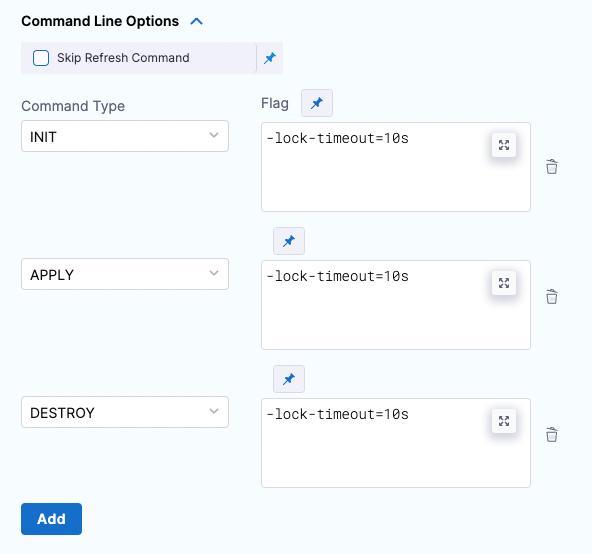

This topic describes how to roll back your provisioned infrastructure and resources and return your environment to its pre-deployment state.

## Before You Begin

* [Terraform Provisioning with Harness](terraform-provisioning-with-harness)
* [Provision Target Deployment Infra Dynamically with Terraform](/docs/continuous-delivery/cd-infrastructure/terraform-infra/provision-infra-dynamically-with-terraform)
* [Provision with the Terraform Apply Step](run-a-terraform-plan-with-the-terraform-apply-step)

## Important: Install Terraform on Delegates

Terraform must be installed on the Delegate to use a Harness Terraform Provisioner. You can install Terraform manually or use the `INIT_SCRIPT` environment variable in the Delegate YAML.

See [Build custom delegate images with third-party tools](https://developer.harness.io/docs/platform/Delegates/install-delegates/build-custom-delegate-images-with-third-party-tools).


```bash
# Install TF  
curl -O -L  https://releases.hashicorp.com/terraform/0.12.25/terraform_0.12.25_linux_amd64.zip  
unzip terraform_0.12.25_linux_amd64.zip  
mv ./terraform /usr/bin/  
# Check TF install  
terraform --version
```

## Review: Terraform Rollback

When rollback happens, Harness rolls back the provisioned infrastructure to the previous successful version of the Terraform state.

Harness won't increment the serial in the state, but perform a hard rollback to the exact version of the state provided.

Harness determines what to rollback using the **Provisioner Identifier**.

If you've made these settings expressions, Harness uses the values it obtains at runtime when it evaluates the expression.

### Rollback Limitations

Let's say you deployed two modules successfully already: module1 and module2. Next, you try to deploy module3, but deployment failed. Harness will roll back to the successful state of module1 and module2.

However, let's look at the situation where module3 succeeds and now you have module1, module2, and module3 deployed. If the next deployment fails, the rollback will only roll back to the Terraform state with module3 deployed. Module1 and module2 weren't in the previous Terraform state, so the rollback excludes them.

## Step 1: Add the Terraform Rollback Step

You can add the Terraform Rollback step in two places:

* The **Rollback** steps of a stage's Infrastructure, in **Dynamic Provisioning**:


* The **Rollback** steps of a stage's **Execution**:


Add the **Terraform Rollback** step.

In **Name**, enter a name for the step. You can use the name to reference the Terraform Rollback settings.

## Step 2: Reference the Provisioner Identifier

In **Provisioner Identifier**, enter the same Provisioner Identifier you used in the Terraform Plan and Apply steps.


Click **Apply Changes**.

The Terraform Rollback step is added to the **Rollback** steps.

## Command line options

:::note

Currently, FEATURE_NAME is behind the feature flag `CDS_TERRAFORM_CLI_OPTIONS_NG`. Contact [Harness Support](mailto:support@harness.io) to enable the feature.

:::

This setting allows you to set the Terraform CLI options for Terraform commands depending on the Terraform step type. For example: `-lock=false`, `-lock-timeout=0s`.




## Skip Terraform Refresh

Terraform refresh command won't be running when this setting is selected.


## See Also

* [Remove Provisioned Infra with Terraform Destroy](remove-provisioned-infra-with-terraform-destroy)

