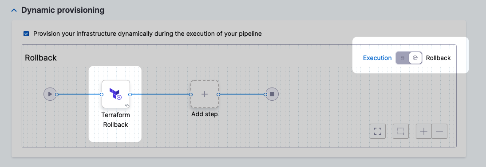
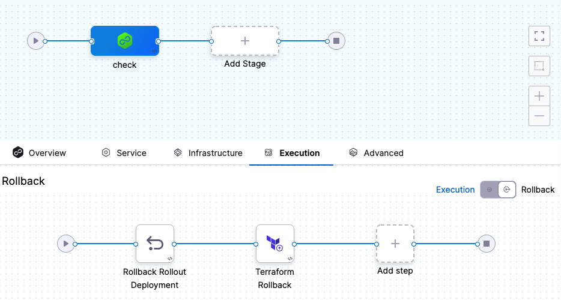
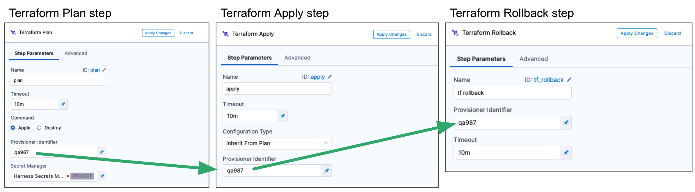
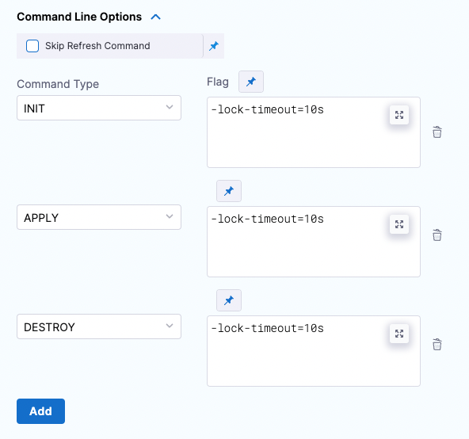

import { Troubleshoot } from '@site/src/components/AdaptiveAIContent';

This topic describes how to roll back your provisioned infrastructure and resources and return your environment to its pre-deployment state.

---

## What will you learn?

- **Add Terraform Rollback steps:** Configure rollback steps in pipeline rollback sections to handle failed deployments.
- **Reference Provisioner Identifiers:** Link rollback steps to the infrastructure provisioned by Apply steps.
- **Understand rollback limitations:** Learn when rollback can and cannot be performed based on Terraform state.

---

## Before you begin

Before using the Terraform Rollback step, ensure you have the following:

- **Terraform provisioning knowledge:** Familiarity with how Harness provisions infrastructure using Terraform. Go to [Terraform provisioning overview](/docs/continuous-delivery/cd-infrastructure/terraform-infra/terraform-provisioning-with-harness) to understand the provisioning workflow.
- **Provisioner Identifier:** The same Provisioner Identifier used in your Terraform Apply step. Go to [Provision with the Terraform Apply step](/docs/continuous-delivery/cd-infrastructure/terraform-infra/run-a-terraform-plan-with-the-terraform-apply-step) to learn how to set up provisioning.
- **Terraform installation:** Terraform must be installed on your delegates. Go to [Build custom delegate images with third-party tools](/docs/platform/delegates/install-delegates/build-custom-delegate-images-with-third-party-tools) to install Terraform on delegates.

---

## Terraform rollback

When rollback is performed, Harness rolls back the provisioned infrastructure to the previous successful version of the Terraform state using config files or the Terraform configuration from the latest successful deployment with a matching **Provisioner Identifier**. The Provisioner Identifier is a unique label that links Terraform Plan, Apply, and Rollback steps to the same configuration.

Harness will not increment the serial number in the Terraform state file but performs a hard rollback to the exact version of the state from the previous successful deployment.

Harness determines what to rollback using the **Provisioner Identifier**.

If you have made these settings expressions, Harness uses the values it obtains at runtime when it evaluates the expression.

### Rollback limitations

Let us say you deployed two modules successfully already: module1 and module2. Next, you try to deploy module3, but deployment failed. Harness will roll back to the successful state of module1 and module2.

However, let us look at the situation where module3 succeeds and now you have module1, module2, and module3 deployed. If the next deployment fails, the rollback will only roll back to the Terraform state with module3 deployed. Module1 and module2 were not in the previous Terraform state, so the rollback excludes them.

Rollback is not possible if you run the Terraform Apply step with the **Skip state storage** option enabled and no Terraform backend is configured in your Terraform files. Using the Rollback step in such a scenario would be an incorrect setup and might cause an unexpected result.

---

## Add the Terraform Rollback step

You can add the Terraform Rollback step in the following rollback sections:

* Go to **Pipelines** > select a pipeline > select a stage > **Infrastructure** > **Dynamic Provisioning** > **Rollback** steps:

* Go to **Pipelines** > select a pipeline > select a stage > **Execution** > **Rollback** steps:

Add the **Terraform Rollback** step.

In **Name**, enter a name for the step. You can use the name to reference the Terraform Rollback settings.

---

## Reference the Provisioner Identifier

In **Provisioner Identifier**, enter the same Provisioner Identifier you used in the Terraform Plan and Apply steps.

Click **Apply Changes**.

The Terraform Rollback step is added to the **Rollback** steps. When rollback succeeds, view execution logs in the pipeline execution details page to confirm the state was reverted.

---

## Command line options

:::note

Currently, the command line options feature is behind the feature flag `CDS_TERRAFORM_CLI_OPTIONS_NG`. Contact [Harness Support](mailto:support@harness.io) to enable the feature.

:::

This setting allows you to set the Terraform CLI options for Terraform commands depending on the Terraform step type. For example: `-lock=false`, `-lock-timeout=0s`.

---

## Skip Terraform refresh

Terraform refresh command will not run when this setting is selected.

---

## Troubleshooting

<Troubleshoot
  issue="Terraform rollback fails with state mismatch error in Harness CD pipeline"
  mode="docs"
  fallback="Verify the Provisioner Identifier matches the Apply step that created the infrastructure. Check that a previous successful Terraform state exists for the rollback to target."
/>

<Troubleshoot
  issue="Permission denied when rolling back infrastructure with Terraform Rollback step"
  mode="docs"
  fallback="Verify the connector used in the rollback step has permissions to modify the target resources. Check cloud provider IAM roles and policies."
/>

<Troubleshoot
  issue="Terraform rollback step cannot find previous successful state"
  mode="docs"
  fallback="Check that the Terraform Apply step completed successfully at least once before the rollback. Verify state storage is configured and accessible. Rollback requires a previous successful state to revert to."
/>

<Troubleshoot
  issue="Rollback step shows Provisioner Identifier mismatch"
  mode="docs"
  fallback="Ensure the Provisioner Identifier in the Rollback step exactly matches the identifier used in the Terraform Plan and Apply steps. Check for typos or case sensitivity issues."
/>

---

## Next steps

You have configured a Terraform Rollback step to handle failed provisioning. The rollback step automatically reverts infrastructure to the previous successful state when deployments fail.

- Go to [Provision with the Terraform Apply step](/docs/continuous-delivery/cd-infrastructure/terraform-infra/run-a-terraform-plan-with-the-terraform-apply-step) to understand the Apply workflow that rollback reverts.
- Go to [Remove infrastructure with the Terraform Destroy step](/docs/continuous-delivery/cd-infrastructure/terraform-infra/remove-provisioned-infra-with-terraform-destroy) to permanently remove provisioned infrastructure.
- Go to [Terraform provisioning overview](/docs/continuous-delivery/cd-infrastructure/terraform-infra/terraform-provisioning-with-harness) to understand rollback behavior and limitations.
