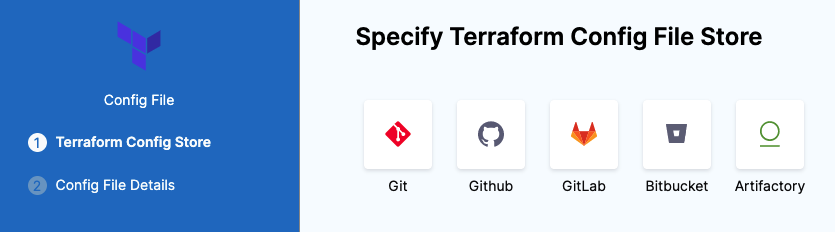
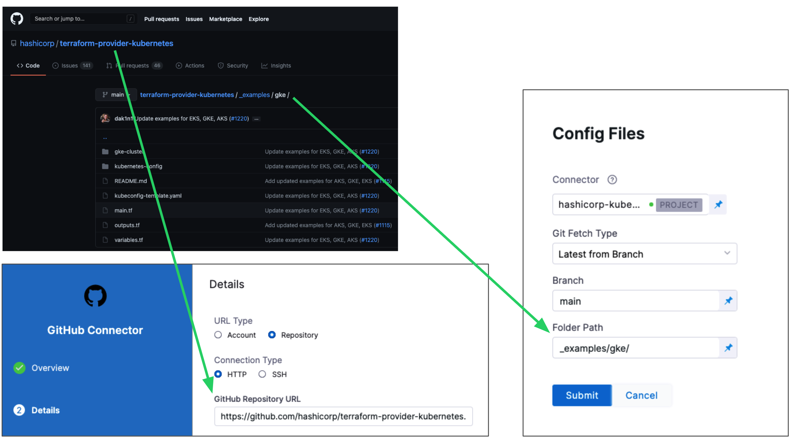
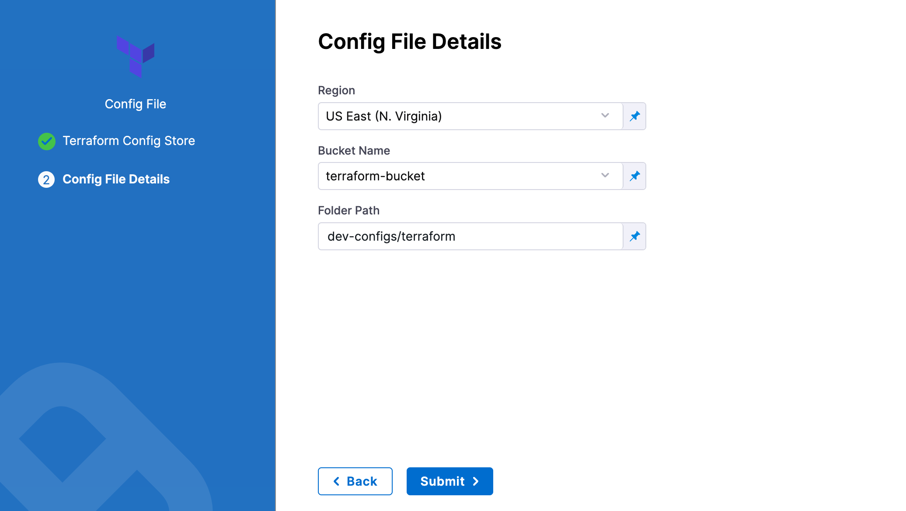
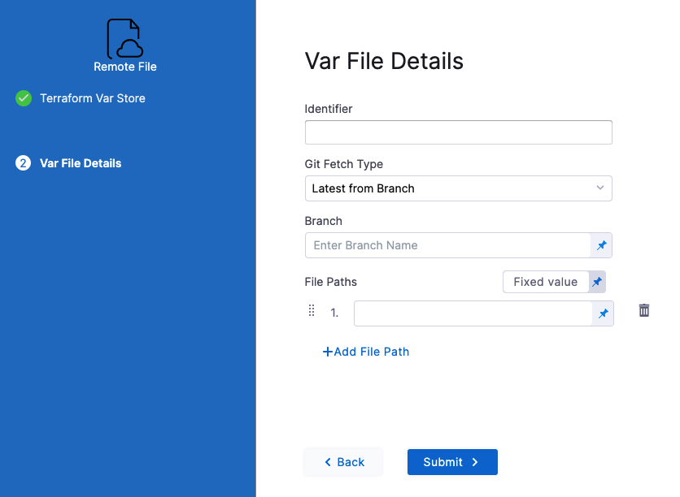
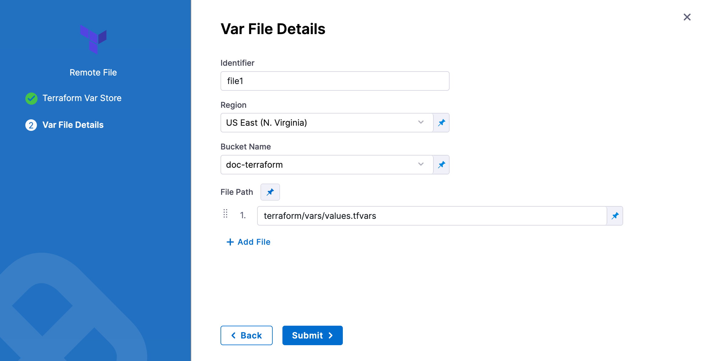
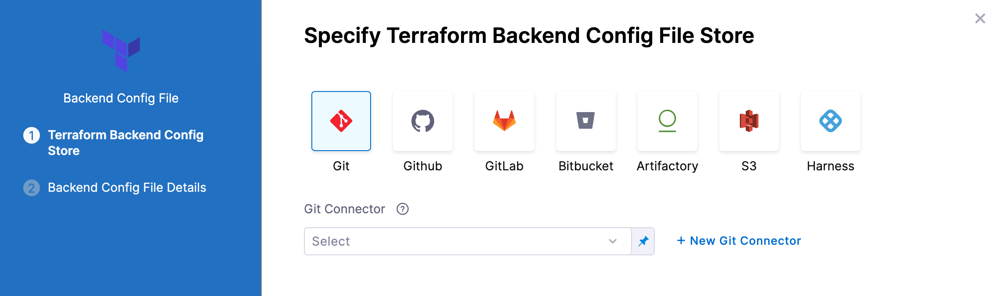
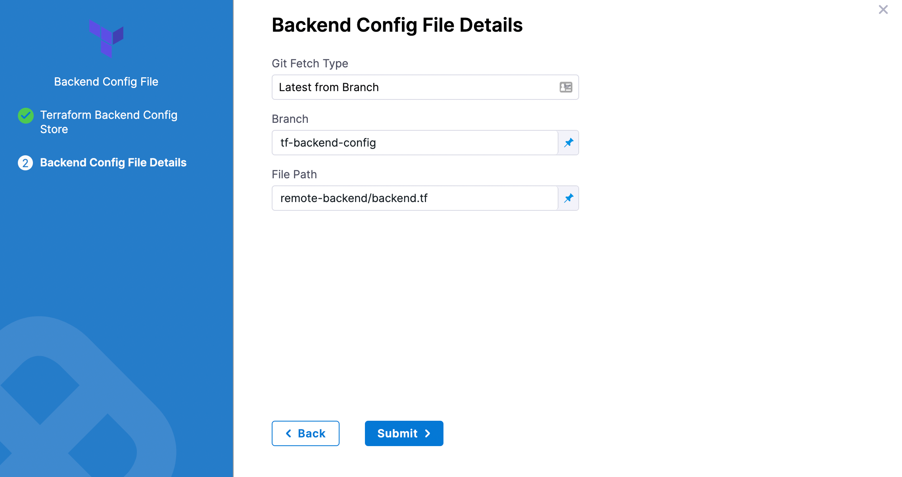
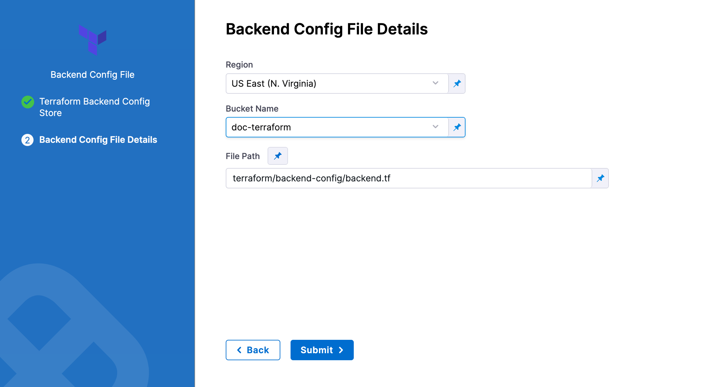
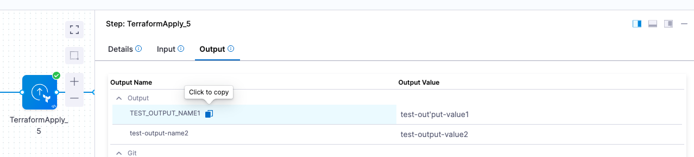
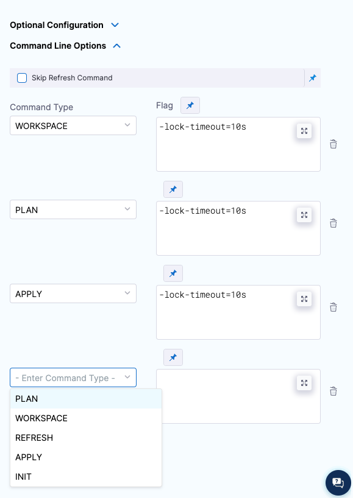

import { Troubleshoot } from '@site/src/components/AdaptiveAIContent';

The Terraform Apply step applies a Terraform plan or script to provision infrastructure in your CD pipeline. You can use it with a Terraform Plan step (Inherit from Plan configuration) to apply a previously generated plan, or standalone (Inline configuration) to configure and apply Terraform scripts directly. This page explains how to configure the Terraform Apply step in your CD pipeline.

---

## Before you begin

- **Harness account with Continuous Delivery module enabled:** You need access to **Continuous Delivery** in Harness. For how to access or create a Harness account, go to [Getting started with Harness Platform](/docs/platform/get-started/onboarding-guide).

    :::info Contact Harness support:

    If the Continuous Delivery module does not appear, contact your account administrator or [Harness Support](mailto:support@harness.io).

    :::

- **Pipeline and environment permissions:** You need **View**, **Create/Edit**, and **Execute** for [Pipelines](/docs/platform/role-based-access-control/permissions-reference#pipelines), and **View** and **Create/Edit** for [Environments](/docs/platform/role-based-access-control/permissions-reference#environments). To get these permissions, an administrator must assign you a role that includes them. Go to [RBAC in Harness](/docs/platform/role-based-access-control/rbac-in-harness) and [Manage roles](/docs/platform/role-based-access-control/add-manage-roles) to understand how permissions are assigned.

- **Terraform or OpenTofu installed on Harness Delegate:** Terraform must be installed on the delegate to use a Harness Terraform provisioner. You can install Terraform manually or use the `INIT_SCRIPT` environment variable in the delegate YAML.

    <details>
    <summary>Install Terraform on delegates</summary>

    Go to [Build custom delegate images with third-party tools](/docs/platform/delegates/install-delegates/build-custom-delegate-images-with-third-party-tools) to learn how to install Terraform on delegates.

    Here is an example installation script:

    ```bash
    # Install Terraform
    microdnf install unzip
    curl -O -L https://releases.hashicorp.com/terraform/<VERSION>/terraform_<VERSION>_linux_amd64.zip
    unzip terraform_<VERSION>_linux_amd64.zip
    unzip terraform_1.9.8_linux_amd64.zip
    mv ./terraform /usr/bin/
    # Check Terraform install
    terraform --version
    ```

    </details>

- **Terraform configuration files in a Git repository or cloud storage:** Your Terraform scripts must be accessible via a Harness connector. Go to [Connect to a Git Repo](/docs/platform/connectors/code-repositories/connect-to-code-repo), [Artifactory Connector Settings Reference](/docs/platform/connectors/cloud-providers/ref-cloud-providers/artifactory-connector-settings-reference), or [AWS Connector Settings Reference](/docs/platform/connectors/cloud-providers/ref-cloud-providers/aws-connector-settings-reference) to create connectors.

- **Understanding of Terraform concepts:** This guide assumes familiarity with Terraform workspaces, backends, modules, and state files. Go to [Terraform documentation](https://developer.hashicorp.com/terraform/docs) to learn more.

- **Terraform Plan step (optional):** If you want to apply a plan generated by a Terraform Plan step, go to [Plan Terraform Provisioning with the Terraform Plan Step](/docs/continuous-delivery/cd-infrastructure/terraform-infra/run-a-terraform-plan-with-the-terraform-plan-step) to configure the Plan step first.

---

## Configure the Terraform Apply step

You can add the Terraform Apply step in two locations: in the stage's **Infrastructure** > **Dynamic Provisioning** section (when provisioning target infrastructure for deployment), or anywhere in the **Execution** steps (for ad-hoc provisioning).

When you use the Terraform Apply step without a Terraform Plan step, you configure the Terraform Apply step to connect Harness to your repo and add Terraform scripts directly. When you use it with a Terraform Plan step, you set **Configuration Type** to **Inherit from Plan** and reference the Plan step using the same **Provisioner Identifier**.

Go to [Provision Target Deployment Infra Dynamically with Terraform](/docs/continuous-delivery/cd-infrastructure/terraform-infra/provision-infra-dynamically-with-terraform) to learn how to provision target infrastructure for deployments.

---

### Set the step name

In **Name**, enter a name for the step, for example, **apply**.

The name is important because you can use it in [expressions](/docs/platform/variables-and-expressions/harness-variables) to refer to settings in this step.

For example, if the name of the stage is **Terraform** and the name of the step is **apply**, and you want to echo its timeout setting, you would use:

`<+pipeline.stages.Terraform.spec.execution.steps.apply.timeout>`

or simply `<+execution.steps.apply.timeout>`.

---

### Set the timeout

In **Timeout**, enter how long Harness should wait to complete the Terraform Apply step before failing the step.

---

### Enable remote workspace

Enable this option to identify whether the Terraform configuration uses a Terraform remote backend.

When enabled, you cannot provide the workspace input in Harness. The workspace will be outlined in your configuration for the remote backend.

The remote backend is supported only when the **Configuration Type** is **Inline**.

```
terraform {
  backend "remote" {
    hostname     = "app.terraform.io"
    organization = "your-organization"
    workspaces {
      name = "your-workspace"
    }
  }
}
```

:::warning
**Configuration Type** cannot be set to **Inherit from Plan** if the **Run on Remote Workspace** checkbox is checked.
:::

---

### Select the configuration type

**Configuration Type** determines whether this step uses its own Terraform configuration (**Inline**) or inherits settings from a previous Terraform Plan step (**Inherit from Plan**).

In **Configuration Type**, select **Inline** or **Inherit from Plan**.

- **Inherit from Plan:** Use this option when you have a Terraform Plan step earlier in the pipeline and want to apply that plan. You will enter the unique Id used by a [Terraform Plan](/docs/continuous-delivery/cd-infrastructure/terraform-infra/run-a-terraform-plan-with-the-terraform-plan-step) step in **Provisioner Identifier**.

- **Inline:** Use this option to configure and run Terraform Apply without a separate Plan step. You will configure this Terraform Apply step to use a Terraform script without any Terraform Plan step.

The sections below cover the **Inline** settings.

---

### Set the Provisioner Identifier

The **Provisioner Identifier** is a unique label that links this Terraform Apply step to a Terraform Plan step (when using Inherit from Plan) or to other Terraform steps like Rollback and Destroy.

Enter a unique value in **Provisioner Identifier**.

The most common use of Provisioner Identifier is between the Terraform Plan and Terraform Apply steps. For the Terraform Apply step, to apply the provisioning from the Terraform Plan step, you use the same Provisioner Identifier.


You also use the same Provisioner Identifier with the [Terraform Destroy](/docs/continuous-delivery/cd-infrastructure/terraform-infra/remove-provisioned-infra-with-terraform-destroy) step to remove the provisioned resources.


You also use the same Provisioner Identifier with the [Terraform Rollback](/docs/continuous-delivery/cd-infrastructure/terraform-infra/rollback-provisioned-infra-with-the-terraform-rollback-step) step to rollback the provisioned resources.

#### Provisioner identifier scope

The Provisioner Identifier is a Project-wide setting. You can reference it across Pipelines in the same Project.

For this reason, it is important that all your Project members know the Provisioner Identifiers. This will prevent one member building a Pipeline from accidentally impacting the provisioning of another member's Pipeline.

---

### Connect to your Terraform script repository

**Configuration File Repository** is where the Terraform script and files you want to use are located.

Here, you will add a connection to the Terraform script repo.

Click **Specify Config File** or edit icon.

The **Terraform Config File Store** settings appear.

Click the provider where your files are hosted.



Select or create a Connector for your repo. Go to [Connect to a Git Repo](/docs/platform/connectors/code-repositories/connect-to-code-repo) to create a Git connector. Go to [Artifactory Connector Settings Reference](/docs/platform/connectors/cloud-providers/ref-cloud-providers/artifactory-connector-settings-reference) to configure Artifactory. Go to [AWS Connector Settings Reference](/docs/platform/connectors/cloud-providers/ref-cloud-providers/aws-connector-settings-reference) to configure AWS S3.

---

#### For Git providers

In **Git Fetch Type**, select **Latest from Branch** or **Specific Commit ID**. When you run the Pipeline, Harness will fetch the script from the repo.

**Specific Commit ID** also supports [Git tags](https://git-scm.com/book/en/v2/Git-Basics-Tagging). If you think the script might change often, you might want to use **Specific Commit ID**. For example, if you are going to be fetching the script multiple times in your Pipeline, Harness will fetch the script each time. If you select **Latest from Branch** and the branch changes between fetches, different scripts are run.

In **Branch**, enter the name of the branch to use.

In **Folder Path**, enter the path from the root of the repo to the folder containing the script.

For example, here is a Terraform script repo, the Harness Connector to the repo, and the **Config Files** settings for the branch and folder path:



Click **Submit**.

Your Terraform Apply step is now ready. You can now configure a Terraform Destroy or Rollback step that can use the Terraform script from this Terraform Apply step.

The following sections cover common Terraform Apply step options.

---

#### For Artifactory

Go to [Artifactory Connector Settings Reference](/docs/platform/connectors/cloud-providers/ref-cloud-providers/artifactory-connector-settings-reference) to configure Artifactory connectors.

---

#### For AWS S3

1. In **Region**, select the region where your bucket is stored.
2. In **Bucket**, select the bucket where your Terraform files are stored (all buckets from the selected region that are available to the connector will be fetched).
3. In **Folder Path**, enter the path from the root of the repo to the folder containing the script.

   

Harness will fetch all files from specified folder.

---

### Configure module source credentials

When you set up the file repo in **Configuration File Repository**, you use a Harness Connector to connect to the repo where the Terraform scripts are located.

Some scripts will reference module sources in other repos and Harness will pull the source code for the desired child module at runtime (during `terraform init`).

In **Source Module**, you can select **Use Connector credentials** to have Harness use the credentials of the Connector to pull the source code for the desired child module(s).

If you do not select **Use Connector credentials**, Terraform will use the credentials that have been set up in the system.

The **Use Connector credentials** setting is available to Harness Git Connectors using SSH authentication or HTTPS.

When configuring the SSH key for the connector, exporting an SSH key with a passphrase for the module source is not supported. Configure an SSH Key without the passphrase.

Here is a syntax example to reference the Terraform module using the SSH protocol:

```bash
source = "git@github.com:your-username/your-private-module.git"
```

Here is a syntax example to reference the Terraform module using the HTTPS protocol:

```bash
source = "git::https://github.com/your-organization/your-private-module.git"
```

:::tip

The ability to authenticate with HTTPS is new! The Minimum required delegate version is: 83401. Here is a demo on its functionality:

<DocVideo src="https://www.loom.com/share/bb8b9e4996f14bf0a16839849b0b72e4?sid=3befc405-7c4d-4f21-afe0-c36e2962b566" />

:::

---

### Configure workspace settings

A Terraform workspace is a separate instance of state data, allowing you to manage multiple environments (Dev, QA, Production) from the same Terraform configuration.

Harness supports Terraform [workspaces](https://www.terraform.io/docs/state/workspaces.html). A Terraform workspace is a logical representation of one your infrastructures, such as Dev, QA, Stage, Production.

Workspaces are useful when testing changes before moving to a production infrastructure. To test the changes, you create separate workspaces for Dev and Production.

A workspace is really a different state file. Each workspace isolates its state from other workspaces. For more information, go to [When to use Multiple Workspaces](https://www.terraform.io/docs/state/workspaces.html#when-to-use-multiple-workspaces) from Hashicorp.

Here is an example script where a local value names two workspaces, **default** and **production**, and associates different instance counts with each:

```json
locals {  
  counts = {  
      "default"=1  
      "production"=3  
  }  
}  
  
resource "aws_instance" "my_service" {  
  ami="ami-7b4d7900"  
  instance_type="t2.micro"  
  count="${lookup(local.counts, terraform.workspace, 2)}"  
  tags {  
         Name = "${terraform.workspace}"  
    }  
}
```

In the workspace interpolation sequence, you can see the count is assigned by applying it to the Terraform workspace variable (`terraform.workspace`) and that the tag is applied using the variable also.

Harness will pass the workspace name you provide to the `terraform.workspace` variable, thus determining the count. If you provide the name **production**, the count will be **3**.

In the **Workspace** setting, you can simply select the name of the workspace to use.

You can also use a [stage variable](/docs/platform/variables-and-expressions/harness-variables) in **Workspace**.

Later, when the Pipeline is deployed, you specify the value for the stage variable and it is used in **Workspace**.

This allows you to specify a different workspace name each time the Pipeline is run.

You can even set a Harness Trigger where you can set the workspace name used in **Workspace**.

---

### Configure connector credentials

You can use a connector to authenticate with the target cloud provider. This is an optional configuration that takes the connector reference. The Terraform step uses this connector to authenticate with the cloud provider targeted for infrastructure provisioning.

This connector configuration is available in the **Terraform Apply** step when the **Configuration Type** is set to **Inline**.

---

#### AWS Connector

Use an AWS connector to authenticate with AWS and provision infrastructure using an assumed IAM role.

:::note
This feature requires Harness Delegate version 81202. This feature is available only to paid customers. Contact [Harness Support](mailto:support@harness.io) to enable the feature.
:::

You can use an AWS connector to have the Terraform Plan and Apply step assume a role to perform infrastructure provisioning. It is an optional configuration that takes the AWS connector, a region and Role ARN. The Terraform step uses these parameters to authenticate the AWS account targeted for infrastructure provisioning.

By default, AWS assumes the role session duration as 900 seconds. To increase the AWS role session duration, a  built-in environment variable, `HARNESS_AWS_ASSUME_ROLE_DURATION` is introduced, which can be used to override the assume role session duration. `HARNESS_AWS_ASSUME_ROLE_DURATION` is designed for use in Terraform steps in the environment variable section. The value must be set in seconds. This new environment variable requires Harness Delegate version 82700.

When configured the optional configuration for AWS Connector these fields can be passed as a fixed value, runtime input, or an expression.

<details>
<summary>Sample YAML</summary>

```YAML
- step:
    type: TerraformApply
    name: Apply
    identifier: Apply
    spec:
      provisionerIdentifier: provision
      configuration:
        type: Inline
        spec:
          workspace: <+input>
          configFiles: {}
          providerCredential:
            type: Aws
            spec:
              connectorRef: <+input>
              region: <+input>
              roleArn: <+input>
    timeout: 10m
```
</details>

##### Terraform variable files

You can specify Terraform variables inline and fetch remote variable files during run time. For more information, go to [Specify Terraform variables](/docs/continuous-delivery/cd-infrastructure/terraform-infra/optional-tf-var-files).

###### Git providers



In **Identifier**, enter an identifier so you can refer to variables using expressions if needed.

In **Git Fetch Type**, select **Latest from Branch** or **Specific Commit ID**.

In **Branch**, enter the name of the branch.

In **File Paths**, add one or more file paths from the root of the repo to the variable file.

Click **Submit**. The remote file(s) are added.

###### Artifactory

Go to [Artifactory Connector Settings Reference](/docs/platform/connectors/cloud-providers/ref-cloud-providers/artifactory-connector-settings-reference) to configure Artifactory connectors.

###### S3 provider

In **Identifier**, enter an identifier, so you can refer to variables using expressions if needed.

In **Region**, select the region where your bucket is stored.

In **Bucket**, select the bucket where your Terraform var files are stored (all buckets from the selected region that are available to the connector will be fetched).

In **File Paths**, add one or more file paths from the root of the bucket to the variable file.

   

Click **Submit**. The remote file(s) are added.

---

#### Azure Connector

Use an Azure connector to authenticate with Azure for target infrastructure provisioning.

Harness Terraform steps now support authenticating with Azure using Azure connectors for target provisioning. This enables seamless integration with Azure infrastructure when running Terraform Plan, Apply, and Destroy steps with inline Terraform configuration.

##### Key Features

- **Azure Connector support:** Authenticate Terraform operations using Azure connectors configured in Harness.
- **Authentication methods:** Manual credentials, Delegate-based credentials, OIDC token-based authentication and Certificate-based authentication are supported.
- **Additional options:** Default configuration can be overridden with environment variables like ARM_TENANT_ID and ARM_MSI_ENDPOINT for advanced scenarios.

For more information on how to setup an Azure connector, go to [Azure Connector Settings Reference](/docs/platform/connectors/cloud-providers/add-a-microsoft-azure-connector).

##### YAML Configuration Example

<details>
<summary>Sample YAML</summary>

```yaml
- step:
    type: TerraformPlan
    name: TerraformPlan_1
    identifier: TerraformPlan_1
    spec:
      provisionerIdentifier: planoidc
      configuration:
        command: Apply
        configFiles:
          store:
            spec:
              connectorRef: githubConnector
              repoName: play
              gitFetchType: Branch
              branch: main
              folderPath: tf/azure
            type: Github
        providerCredential:
          type: Azure
          spec:
            connectorRef: AzureConnector
            subscriptionId: 20xxxxxx-xxxx-xxxx-xxxx-xxxxxxxxxxxx
```
</details>

---

#### GCP Connector

Use a GCP connector to authenticate with Google Cloud Platform for infrastructure provisioning.

:::note
This feature requires Harness Delegate version 88303 or later.
:::

Harness Terraform steps support authenticating with Google Cloud Platform (GCP) using GCP connectors for target infrastructure provisioning. This enables seamless integration with GCP resources when running Terraform Plan, Apply, and Destroy steps with inline Terraform configuration.

For information on setting up a GCP connector, go to [Connect to Google Cloud Platform (GCP)](/docs/platform/connectors/cloud-providers/connect-to-google-cloud-platform-gcp).

##### Authentication Methods

GCP connectors support three authentication methods for Terraform steps:

**Manual Credentials (ManualConfig)**

Use this method to explicitly provide GCP service account credentials stored in Harness Secret Manager. The connector references a secret containing the GCP Service Account Key in JSON format. This approach gives you direct control over which credentials are used for provisioning.

**Inherit From Delegate (InheritFromDelegate)**

This method uses credentials from the delegate's IAM role, such as a GCE instance service account or GKE workload identity. At least one delegate selector must be specified for this configuration. This is ideal when your delegates already have appropriate GCP permissions attached.

**OIDC Authentication (OidcAuthentication)**

This method enables federated authentication using OpenID Connect for workload identity federation. It requires configuring a GCP Workload Identity Pool, an OIDC Provider, and a service account for impersonation. This is the recommended approach for production environments as it eliminates the need to manage long-lived credentials.

##### YAML Configuration Example

<details>
<summary>Sample YAML</summary>

```yaml
- step:
    type: TerraformApply
    name: TerraformApply_1
    identifier: TerraformApply_1
    spec:
      provisionerIdentifier: gcp_terraform_provision
      configuration:
        type: Inline
        spec:
          configFiles:
            store:
              spec:
                connectorRef: githubConnector
                repoName: terraform-repo
                gitFetchType: Branch
                branch: main
                folderPath: tf/gcp
              type: Github
          providerCredential:
            type: Gcp
            spec:
              connectorRef: gcpOidcConnector
              project: cd-play
    timeout: 10m
```
</details>

##### GCP Connector Configuration Examples

The following examples show how to configure GCP connectors for different authentication methods:

<details>
<summary>Manual Credentials Connector</summary>

```yaml
connector:
  type: Gcp
  spec:
    credential:
      type: ManualConfig
      spec:
        secretKeyRef: account.gcp_service_account_key
    delegateSelectors:
      - gcp-delegate
```
</details>

<details>
<summary>Inherit From Delegate Connector</summary>

```yaml
connector:
  type: Gcp
  spec:
    credential:
      type: InheritFromDelegate
      spec:
        delegateSelectors:
          - gcp-delegate-with-iam
```
</details>

<details>
<summary>OIDC Authentication Connector</summary>

```yaml
connector:
  type: Gcp
  spec:
    credential:
      type: OidcAuthentication
      spec:
        workloadPoolId: projects/123456789/locations/global/workloadIdentityPools/harness-pool
        providerId: harness-oidc-provider
        gcpProjectId: my-gcp-project-id
        serviceAccountEmail: harness-workload-identity@my-gcp-project-id.iam.gserviceaccount.com
```
</details>

---

### Configure the backend

The **Backend Configuration** section contains the [remote state](https://www.terraform.io/docs/language/state/remote.html) values.

You can use an inline or remote state file.

---

#### Using a remote state file with Terraform Apply

1. In Backend Configuration, select **Remote**.
2. Click **Specify Backend Config File**
3. Select your provider (GitHub, Artifactory, S3, etc.) and then select or create a Connector to the repo where the files are located. Typically, this is the same repo where your Terraform script is located, so you can use the same Connector.
   

##### Git providers

1. In **Git Fetch Type**, select **Latest from Branch** or **Specific Commit ID**.
2. In **Branch**, enter the name of the branch.
3. In **File Path**, add file path from the root of the repo to the backend config file.
4. Click **Submit**. The remote file(s) are added.

   

##### Artifactory

Go to [Artifactory Connector Settings Reference](/docs/platform/connectors/cloud-providers/ref-cloud-providers/artifactory-connector-settings-reference) to configure Artifactory connectors.

##### AWS S3

1. In **Region**, select the region where your bucket is stored.
2. In **Bucket**, select the bucket where your backend config file is stored (all buckets from the selected region that are available to the connector will be fetched).
3. In **File Path**, add file path from the root of the bucket to the backend config file.

    

You can also use files in the [Harness File Store](/docs/continuous-delivery/x-platform-cd-features/services/add-inline-manifests-using-file-store).

To use the same remote state file set in the Terraform Plan step, Terraform Apply steps must use the same Provisioner Identifier.

For an example of how the config file should look, go to [Backend Configuration](https://developer.hashicorp.com/terraform/language/settings/backends/configuration#file) from HashiCorp.

Here is an example.

main.tf (note the empty backend S3 block):

```json
variable "global_access_key" {type="string"}  
variable "global_secret_key" {type="string"}  
  
variable "env" {  
    default= "test"  
}  
provider "aws" {  
  access_key = "${var.global_access_key}"  
  secret_key = "${var.global_secret_key}"  
  region = "us-east-1"  
      
}  
  
resource "aws_s3_bucket" "bucket" {  
  bucket = "prannoy-test-bucket"  
}  
  
terraform {  
backend "s3" {  
      
  }  
}
```

backend.tf:

```json
access_key = "1234567890"  
secret_key = "abcdefghij"  
bucket = "terraform-backend-config-test"  
key    = "remotedemo.tfstate"  
region = "us-east-1"
```

---

#### Using inline state with Terraform Apply

Enter values for each backend config (remote state variable).

For example, if your config.tf file has the following backend:

```json
terraform {
   backend "gcs" {
     bucket  = "tf-state-prod"
     prefix  = "terraform/state"
   }
}
```

In **Backend Configuration**, you provide the required configuration variables for the backend type. 

For a remote backend configuration, the variables should be in .tfvars file.

Example:
```json
bucket  = "tf-state-prod"  
prefix  = "terraform/state"
```

In your Terraform .tf config file, only the definition of the Terraform backend is required:

```json
terraform {  
  backend "gcs" {}
}
```

Go to **Configuration variables** in Terraform's [gcs Standard Backend doc](https://www.terraform.io/docs/language/settings/backends/gcs.html#configuration-variables) to understand backend configuration variables.

---

### Specify Terraform targets

You can use the **Targets** setting to target one or more specific modules in your Terraform script, just like using the `terraform plan -target` command. Go to [Resource Targeting](https://www.terraform.io/docs/commands/plan.html#resource-targeting) from Terraform to understand resource targeting.

You simply identify the module using the standard format `module.name`, like you would using `terraform plan -target="module.s3_bucket"`.

If you have multiple modules in your script and you do not select one in **Targets**, all modules are used.

---

### Add environment variables

If your Terraform script uses [environment variables](https://www.terraform.io/docs/cli/config/environment-variables.html), you can provide values for those variables here.

For example:

```bash
TF_LOG_PATH=./terraform.log  
TF_VAR_alist='[1,2,3]'
```

You can use Harness encrypted text for values. Go to [Add Text Secrets](/docs/platform/secrets/add-use-text-secrets) to learn how to create encrypted text secrets.

---

### Access step outputs

Terraform Apply step output is available after the Terraform Apply step has completed. The output can be exposed to other steps or resources in Harness.

You can find the output in the Output area of the step. To use the output, copy the expression path to the output key as shown in the following image:



The expression is of the form `<+pipeline.stages.stage-provisioning.spec.execution.steps.TerraformApply_5.output.TEST_OUTPUT_NAME1>`

When you use this expression in another step, the expression resolves to its value.

---

### Encrypt JSON outputs

The **Encrypt json output** setting encrypts the Terraform JSON output as a Harness secret. Only Harness Secret Manager is supported.

The secret is ephemeral and is created and deleted during the execution of the pipeline. After execution completes, the secret is deleted.

The secret is stored in the **Secrets** list in Harness, at the project level.

You can use an expression to retrieve the secret and its Terraform JSON output during pipeline execution.

This secret expression can be used in other steps that can parse, validate, and extract the required output values from the JSON.

In **Encrypt json output**, select or create a secret manager to use for encryption/decryption.

To obtain the expression, do the following:

1. In a pipeline execution that uses this feature, select the **Terraform Apply** step.
2. In the step details, select **Output**.
3. In **Output Name**, locate `TF_JSON_OUTPUT_ENCRYPTED`.
4. Copy the expression. When you paste it, it will look something like `<+pipeline.stages.stage1.spec.execution.steps.TerraformApply_1.output.TF_JSON_OUTPUT_ENCRYPTED>`.

Do not use the **Output Value**, for example `<+secrets.getValue("terraform_output_df1ds123331123122123_LYF5b3")>`.

A secret is masked in Harness logs, but you can write it to a file like this:

```
cat <<EOF > apply_outputs.json
<+pipeline.stages.stage1.spec.execution.steps.TerraformApply_1.output.TF_JSON_OUTPUT_ENCRYPTED>
EOF
```

Above example will pass the content of Terraform apply outputs as-is into the file including quotes, etc.

Here is an example of decrypted Terraform JSON output:

```json
{
  "test-output-name1": {
    "sensitive": false,
    "type": "string",
    "value": "test-output-value1"
  },
  "test-output-name2": {
    "sensitive": false,
    "type": "string",
    "value": "test-output-value2"
  }
}
```

**Handling sensitive Terraform outputs**

To extract specific values from the encrypted Terraform output, users can use tools like jq to parse and retrieve individual values from the JSON output.

To parse a file using the jq tool, its content must be in a valid JSON format. jq binary should be installed on the delegate.

For example, use the following command to extract the value for `test-output-name1`:
```
jq '.["test-output-name1"].value' file.json
```

---

### Mask sensitive outputs

When a Terraform output is marked `sensitive = true` in your `main.tf` file, Harness automatically detects that flag and masks the value in the **Output** tab. Non-sensitive outputs continue to appear as plain text.

Sensitive values are displayed as encrypted expressions in the output:

```
db_password = ${sweepingOutputSecrets.obtain("db_password","...")}
```

Sensitive outputs remain fully usable in downstream steps using the same expression syntax as non-sensitive outputs:

```
<+pipeline.stages.STAGE_ID.spec.execution.steps.STEP_ID.output.OUTPUT_NAME>
```

When Harness resolves the expression in a downstream step, the value is decrypted and injected at runtime but stays masked in logs.

:::note
This feature applies when the **Encrypt json output** secret manager is **not** configured. If a secret manager is set, Harness encrypts the entire JSON output using that path instead.
:::

---

### Skip state storage

The following feature requires a minimum Harness Delegate version of 812xx.

While running Terraform commands on the delegate, Harness by default will try to detect if there is a local state file in the Terraform working directory.

If local state file is identified, at the end of the execution it is saved on Harness storage with a key based on the provisioner identifier.

That state file is downloaded in the Terraform working directory for subsequent executions, and the updated state is uploaded after execution ends.

This method allows the maintaining of the state of the infrastructure even if there is no Terraform backend configured.

This is more for testing purposes. For production environments, Harness advises you configure a backend in your Terraform config files. For information, go to [Backend Configuration](https://developer.hashicorp.com/terraform/language/settings/backends/configuration).

With the **Skip state storage** option enabled, Harness allows you to skip the local state upload and download operations mentioned above.

This option makes is useful only if you do not have a Terraform backed configured in your Terraform config files. If you have a Terraform backed configured, then the Terraform CLI will not create any local state files.

**Implications of enabling Skip state storage:**

If you enable this option and there is no backend configured in your Terraform files, Harness will not maintain state between executions. This means:

- You cannot roll back changes (no state history exists)
- You should not add a Terraform Rollback step (rollback is impossible without state)
- Each execution will not know about previous infrastructure changes
- This setup is only suitable for testing, not production

If the Terraform Apply step is configured to skip state storage, and there is no backend configured in your Terraform files, you should not add a rollback step, as this is an invalid setup. Rollback is impossible if there is no state file.

---

### Create remote workspace with prefix

:::note
This setting is only available when the Configuration Type is **Inline**.

This option is available only on delegate version `86400` or later.
:::

When using a [remote backend](https://developer.hashicorp.com/terraform/language/backend/remote) with a workspace **prefix**, Terraform does not automatically create the workspace if it does not already exist. This can cause pipeline failures with errors like:

`Error: Currently selected workspace "my-app-dev" does not exist`

To address this, Harness provides the **Create remote workspace with prefix** option. When this option is enabled:

- If the remote workspace does **not** exist, Harness automatically creates it and continues the execution.
- If the remote workspace **does** exist, Harness exports it to the `TF_WORKSPACE` environment variable so Terraform uses it.
- If both the step configuration and environment variable specify a workspace, the **step configuration takes precedence**.

:::info
To enable automatic workspace selection when a workspace is configured in the step settings, this flag **must** be enabled.

If you prefer not to use this flag, you can manually configure the workspace using the `TF_WORKSPACE` environment variable.

**Rollback does not delete workspaces** created using this option. Workspace cleanup must be handled manually.

:::

<details>
<summary>This is how the YAML would look like</summary>

```yaml
- step:
    type: TerraformApply
    name: Terraform Apply
    identifier: Terraform_Apply
    timeout: 10m
    spec:
      provisionerIdentifier: test
      configuration:
        type: Inline
        createRemoteWorkspaceWithPrefix: true
        spec:
          configFiles: {}
```
</details>

---

### Add command line options

This setting allows you to set the Terraform CLI options for Terraform commands depending on the Terraform step type. For example: `-lock=false`, `-lock-timeout=0s`.



---

### Skip Terraform refresh

Terraform refresh command will not be running when this setting is selected.

---

### Understand working directory cleanup

Each Terraform step runs in a specific working directory on the delegate.

The Terraform working directory is located at `/opt/harness-delegate/./terraform-working-dir/`.

To that directory path, Harness adds additional directories that are named after the organization, account, project, and provisionerId (from the step) such that the final working directory is `/opt/harness-delegate/./terraform-working-dir/org-name/account-name/project-name/provisionerId/`.

In this final working directory, Harness stores the Terraform configuration and all fetched files such as var-files and backend-config.

Once the Terraform step execution is complete, Harness cleans up the main working directory `/opt/harness-delegate/./terraform-working-dir/`. This cleanup happens immediately after the step completes successfully or fails.

If you generate any local resources on the delegate in the directory where Terraform configurations are located, those resources are also removed. If you need those resources, make sure to generate them outside the Terraform working directory.

---

### Configure advanced settings

In **Advanced**, you can use the following options:

* [Delegate Selector](/docs/platform/delegates/manage-delegates/select-delegates-with-selectors)
* [Conditional Execution](/docs/platform/pipelines/step-skip-condition-settings)
* [Failure Strategy](/docs/platform/pipelines/failure-handling/define-a-failure-strategy-on-stages-and-steps)
* [Looping Strategy](/docs/platform/pipelines/looping-strategies/looping-strategies-matrix-repeat-and-parallelism)
* [Policy Enforcement](/docs/platform/governance/policy-as-code/harness-governance-overview)

---

## Troubleshooting

<Troubleshoot
  issue="Terraform Apply step fails with 'Provisioner Identifier not found' error in Harness CD"
  mode="docs"
  fallback="Ensure the Provisioner Identifier in the Terraform Apply step exactly matches the identifier in the Terraform Plan step. Provisioner Identifiers are case-sensitive."
/>

<Troubleshoot
  issue="Configuration Type set to Inherit from Plan but Terraform Apply cannot find the plan"
  mode="docs"
  fallback="Verify that the Terraform Plan step completed successfully and used the same Provisioner Identifier. Check that both steps are in the same pipeline stage."
/>

<Troubleshoot
  issue="Remote workspace does not exist error when using Terraform Apply with remote backend"
  mode="docs"
  fallback="Enable 'Create remote workspace with prefix' in the Terraform Apply step settings, or manually create the workspace in your Terraform Cloud/Enterprise instance before running the pipeline."
/>

<Troubleshoot
  issue="Terraform Apply state lock timeout in Harness CD pipeline"
  mode="docs"
  fallback="Another process or pipeline may be holding the state lock. Wait for the lock to be released, or use Terraform CLI to manually unlock the state if the lock is stale."
/>

---

## Next steps

You have configured the Terraform Apply step to provision infrastructure in your CD pipeline. Harness will now execute your Terraform script and apply the planned changes to your target environment.

- [Plan Terraform Provisioning with the Terraform Plan Step](/docs/continuous-delivery/cd-infrastructure/terraform-infra/run-a-terraform-plan-with-the-terraform-plan-step)
- [Rollback Provisioned Infra with the Terraform Rollback Step](/docs/continuous-delivery/cd-infrastructure/terraform-infra/rollback-provisioned-infra-with-the-terraform-rollback-step)
- [Remove Provisioned Infra with Terraform Destroy](/docs/continuous-delivery/cd-infrastructure/terraform-infra/remove-provisioned-infra-with-terraform-destroy)
- [Provision Target Deployment Infra Dynamically with Terraform](/docs/continuous-delivery/cd-infrastructure/terraform-infra/provision-infra-dynamically-with-terraform)
