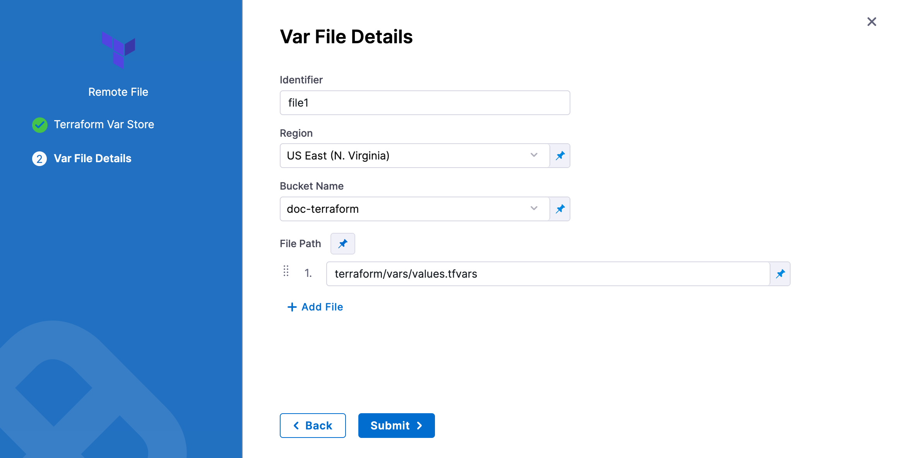

This topic describes how to apply a Terraform plan or script using the Terraform Apply step.

The Terraform Apply step can apply a Terraform script with or without the Terraform Plan step.

Typically the Terraform Apply step is used with the Terraform Plan step to apply a plan. For steps on using the Terraform Plan step, see [Plan Terraform Provisioning with the Terraform Plan Step](run-a-terraform-plan-with-the-terraform-plan-step).

The Terraform Apply step can provision any resource, including the target infrastructure for a CD deployment. For steps on provisioning the target infrastructure for a CD deployment, see [Provision Target Deployment Infra Dynamically with Terraform](/docs/continuous-delivery/cd-infrastructure/terraform-infra/provision-infra-dynamically-with-terraform).

## Before you begin

* [Terraform Provisioning with Harness](terraform-provisioning-with-harness)
* [Kubernetes CD Quickstart](/docs/continuous-delivery/deploy-srv-diff-platforms/kubernetes/kubernetes-cd-quickstart)

## Install Terraform on delegates

Terraform must be installed on the Delegate to use a Harness Terraform Provisioner. You can install Terraform manually or use the `INIT_SCRIPT` environment variable in the Delegate YAML.

See [Build custom delegate images with third-party tools](https://developer.harness.io/docs/platform/Delegates/install-delegates/build-custom-delegate-images-with-third-party-tools).


```bash
# Install TF  
microdnf install unzip
curl -O -L https://releases.hashicorp.com/terraform/1.3.5/terraform_1.3.5_darwin_amd64.zip
unzip terraform_1.3.5_darwin_amd64.zip
mv ./terraform /usr/bin/
# Check TF install
terraform --version
```

## Terraform Plan and Apply steps

Typically the Terraform Plan step is used with the Terraform Apply step.

First, you add the Terraform Plan step and define the Terraform script for it to use.

Next, you add the Terraform Apply step, select **Inherit from Plan** in **Configuration Type**, and reference the Terraform Plan step using the same **Provisioner Identifier.**


For steps on using the Terraform Plan with the Apply step, see:

* [Provision Target Deployment Infra Dynamically with Terraform](/docs/continuous-delivery/cd-infrastructure/terraform-infra/provision-infra-dynamically-with-terraform)

You can also simply run the Terraform Apply step without applying the plan from the Terraform Plan step.

In that case, you simply add the Terraform Apply step and select the **Inline** option in **Configuration Type**. Next, you add the Terraform script and settings in Terraform Apply. This scenario is described below.

## Add the Terraform Apply step

When you are provisioning the target infrastructure for a deployment, you add the Terraform Plan step in the stage's Infrastructure in **Dynamic Provisioning**. Dynamic Provisioning is used to provision the target infrastructure for the stage's deployment. Consequently, if you add Terraform Plan there, you must use a Terraform Apply step to apply the plan.

See [Provision Target Deployment Infra Dynamically with Terraform](/docs/continuous-delivery/cd-infrastructure/terraform-infra/provision-infra-dynamically-with-terraform).

You can also add a Terraform Apply step anywhere in the **Execution** steps for the stage. In that case, you can use a Terraform Plan step but it's not required.

When you use the Terraform Apply step without using the Terraform Plan step, you set up the Terraform Apply step to connect Harness to your repo and add Terraform scripts.

The Terraform Apply step has the following settings.

### Name

In **Name**, enter a name for the step, for example, **apply**.

The name is very important. You can use the name in [expressions](/docs/platform/Variables-and-Expressions/harness-variables) to refer to settings in this step.

For example, if the name of the stage is **Terraform** and the name of the step is **apply**, and you want to echo its timeout setting, you would use:

`<+pipeline.stages.Terraform.spec.execution.steps.apply.timeout>`

or simply `<+execution.steps.apply.timeout>`.

### Timeout

In **Timeout**, enter how long Harness should wait to complete the Terraform Apply step before failing the step.

### Run on remote workspace

:::note

Currently, this feature is behind the feature flag `CD_TERRAFORM_CLOUD_CLI_NG`. Contact [Harness Support](mailto:support@harness.io) to enable the feature.

:::

Enable this option to identify whether the Terraform configuration uses a Terraform remote backend.

When enabled, you cannot provide the workspace input in Harness. The workspace will be outlined in your configuration for the remote backend.

Also, the remote backend is supported only when the **Configuration Type** is **Inline**.

```
terraform {
  backend "remote" {
    hostname     = "app.terraform.io"
    organization = "your-organization"
    workspaces {
      name = "your-workspace"
    }
  }
}
```

### Configuration type

In **Configuration Type**, select **Inline** or **Inherit from Plan**.

If you select **Inherit from Plan**, you'll enter the unique Id used by a [Terraform Plan](run-a-terraform-plan-with-the-terraform-plan-step) step in **Provisioner Identifier**.

If you select **Inline**, you'll configure this Terraform Apply step to use a Terraform script without any Terraform Plan step.

We'll cover the **Inline** settings below.

### Provisioner identifier

Enter a unique value in **Provisioner Identifier**.

The Provisioner Identifier identifies the provisioning done in this step. You use the Provisioner Identifier in additional steps to refer to the provisioning done in this step.

The most common use of Provisioner Identifier is between the Terraform Plan and Terraform Apply steps. For the Terraform Apply step, to apply the provisioning from the Terraform Plan step, you use the same Provisioner Identifier.


You also use the same Provisioner Identifier with the [Terraform Destroy](remove-provisioned-infra-with-terraform-destroy) step to remove the provisioned resources.


You also use the same Provisioner Identifier with the [Terraform Rollback](rollback-provisioned-infra-with-the-terraform-rollback-step) step to rollback the provisioned resources.

#### Provisioner identifier scope

The Provisioner Identifier is a Project-wide setting. You can reference it across Pipelines in the same Project.

For this reason, it's important that all your Project members know the Provisioner Identifiers. This will prevent one member building a Pipeline from accidentally impacting the provisioning of another member's Pipeline.

### Configuration file repository

**Configuration File Repository** is where the Terraform script and files you want to use are located.

Here, you'll add a connection to the Terraform script repo.

Click **Specify Config File** or edit icon.

The **Terraform Config File Store** settings appear.

Click the provider where your files are hosted.


Select or create a Connector for your repo. For steps, see [Connect to a Git Repo](/docs/platform/Connectors/Code-Repositories/connect-to-code-repo), [Artifactory Connector Settings Reference](/docs/platform/Connectors/Cloud-providers/ref-cloud-providers/artifactory-connector-settings-reference) (see **Artifactory with Terraform Scripts and Variable Definitions (.tfvars) Files**) or [AWS Connector Settings Reference](/docs/platform/Connectors/Cloud-providers/ref-cloud-providers/aws-connector-settings-reference).

### Git

In **Git Fetch Type**, select **Latest from Branch** or **Specific Commit ID**. When you run the Pipeline, Harness will fetch the script from the repo.

**Specific Commit ID** also supports [Git tags](https://git-scm.com/book/en/v2/Git-Basics-Tagging). If you think the script might change often, you might want to use **Specific Commit ID**. For example, if you are going to be fetching the script multiple times in your Pipeline, Harness will fetch the script each time. If you select **Latest from Branch** and the branch changes between fetches, different scripts are run.

In **Branch**, enter the name of the branch to use.

In **Folder Path**, enter the path from the root of the repo to the folder containing the script.

For example, here's a Terraform script repo, the Harness Connector to the repo, and the **Config Files** settings for the branch and folder path:


Click **Submit**.

Your Terraform Apply step is now ready. You can now configure a Terraform Destory or Rollback step that can use the Terraform script from this Terraform Apply step.

The following sections cover common Terraform Apply step options.

### Artifactory

See [Artifactory Connector Settings Reference](/docs/platform/Connectors/Cloud-providers/ref-cloud-providers/artifactory-connector-settings-reference) (see **Artifactory with Terraform Scripts and Variable Definitions (.tfvars) Files**).

### AWS S3

1. In **Region**, select the region where your bucket is stored.
2. In **Bucket**, select the bucket where your Terraform files are stored (all buckets from the selected region that are available to the connector will be fetched).
3. In **Folder Path**, enter the path from the root of the repo to the folder containing the script.

   

Harness will fetch all files from specified folder.

### Source module

When you set up the file repo in **Configuration File Repository**, you use a Harness Connector to connect to the repo where the Terraform scripts are located.

Some scripts will reference module sources in other repos and Harness will pull the source code for the desired child module at runtime (during `terraform init`).

In **Source Module**, you can select **Use Connector credentials** to have Harness use the credentials of the Connector to pull the source code for the desired child module(s).

If you do not select **Use Connector credentials**, Terraform will use the credentials that have been set up in the system.

The **Use Connector credentials** setting is limited to Harness Git Connectors using SSH authentication (not HTTPS) and a token.

When configuring the SSH key for the connector, exporting an SSH key with a passphrase for the module source is not supported. Configure an SSH Key without the passphrase.

Here are some syntax examples to reference the Terraform module using the SSH protocol:

```bash
source = "git@github.com:your-username/your-private-module.git"
## Workspace

Harness supports Terraform [workspaces](https://www.terraform.io/docs/state/workspaces.html). A Terraform workspace is a logical representation of one your infrastructures, such as Dev, QA, Stage, Production.

Workspaces are useful when testing changes before moving to a production infrastructure. To test the changes, you create separate workspaces for Dev and Production.

A workspace is really a different state file. Each workspace isolates its state from other workspaces. For more information, see [When to use Multiple Workspaces](https://www.terraform.io/docs/state/workspaces.html#when-to-use-multiple-workspaces) from Hashicorp.

Here's an example script where a local value names two workspaces, **default** and **production**, and associates different instance counts with each:


```json
locals {  
  counts = {  
      "default"=1  
      "production"=3  
  }  
}  
  
resource "aws_instance" "my_service" {  
  ami="ami-7b4d7900"  
  instance_type="t2.micro"  
  count="${lookup(local.counts, terraform.workspace, 2)}"  
  tags {  
         Name = "${terraform.workspace}"  
    }  
}
```

In the workspace interpolation sequence, you can see the count is assigned by applying it to the Terraform workspace variable (`terraform.workspace`) and that the tag is applied using the variable also.

Harness will pass the workspace name you provide to the `terraform.workspace` variable, thus determining the count. If you provide the name **production**, the count will be **3**.

In the **Workspace** setting, you can simply select the name of the workspace to use.

You can also use a [stage variable](/docs/platform/Variables-and-Expressions/harness-variables) in **Workspace**.

Later, when the Pipeline is deployed, you specify the value for the stage variable and it is used in **Workspace**.

This allows you to specify a different workspace name each time the Pipeline is run.

You can even set a Harness Trigger where you can set the workspace name used in **Workspace**.

## Terraform var files

The **Terraform Var Files** section is for entering and/or linking to Terraform script Input variables.

You can use inline or remote var files.

Harness supports all [Terraform input types and values](https://www.terraform.io/docs/language/expressions/types.html).

### Inline variables

You can add inline variables just like you would in a tfvar file.

Click **Add Terraform Var File**, and then click **Add Inline**.

The **Add Inline Terraform Var File** settings appear.

In **Identifier**, enter an identifier so you can refer to variables using expressions if needed.

For example, if the **Identifier** is **myvars** you could refer to its content like this:

`<+pipeline.stages.MyStage.spec.infrastructure.infrastructureDefinition.provisioner.steps.plan.spec.configuration.varFiles.myvars.spec.content>`

Provide the input variables and values for your Terraform script. Harness follows the same format as Terraform.

For example, if your Terraform script has the following:


```json
variable "region" {  
  type = string  
}
```
In **Add Inline Terraform Var File**, you could enter:


```json
region = "asia-east1-a"
```

#### Inline variable secrets

If you are entering secrets (for credentials, etc.), use Harness secret references in the value of the variable:


```bash
secrets_encryption_kms_key = "<+secrets.getValue("org.kms_key")>"
```
See [Add Text Secrets](/docs/platform/Secrets/add-use-text-secrets).

### Remote variables

You can connect Harness to remote variable files.

Click **Add Terraform Var File**, and then click **Add Remote**.

Select your Git provider (GitHub, Artifactory, S3, etc.) and then select or create a Connector to the repo where the files are located. Typically, this is the same repo where your Terraform script is located, so you can use the same Connector.

Click **Continue**. The **Var File Details** settings appear.

##### Git providers


In **Identifier**, enter an identifier so you can refer to variables using expressions if needed.

In **Git Fetch Type**, select **Latest from Branch** or **Specific Commit ID**.

In **Branch**, enter the name of the branch.

In **File Paths**, add one or more file paths from the root of the repo to the variable file.

Click **Submit**. The remote file(s) are added.

##### Artifactory

See [Artifactory Connector Settings Reference](/docs/platform/Connectors/Cloud-providers/ref-cloud-providers/artifactory-connector-settings-reference) (see **Artifactory with Terraform Scripts and Variable Definitions (.tfvars) Files**).

##### S3 provider

In **Identifier**, enter an identifier, so you can refer to variables using expressions if needed.

In **Region**, select the region where your bucket is stored.

In **Bucket**, select the bucket where your Terraform var files are stored (all buckets from the selected region that are available to the connector will be fetched).

In **File Paths**, add one or more file paths from the root of the bucket to the variable file.

   

Click **Submit**. The remote file(s) are added.

## Backend configuration

The **Backend Configuration** section contains the [remote state](https://www.terraform.io/docs/language/state/remote.html) values.

You can use an inline or remote state file.

### Using a remote state file with Terraform Apply

:::note

Currently, remote state file support is behind the feature flag `TERRAFORM_REMOTE_BACKEND_CONFIG`. Contact [Harness Support](mailto:support@harness.io) to enable the feature.

:::

1. In Backend Configuration, select **Remote**.
2. Click **Specify Backend Config File**
3. Select your provider (GitHub, Artifactory, S3, etc.) and then select or create a Connector to the repo where the files are located. Typically, this is the same repo where your Terraform script is located, so you can use the same Connector.
   

#### Git providers

1. In **Git Fetch Type**, select **Latest from Branch** or **Specific Commit ID**.
2. In **Branch**, enter the name of the branch.
3. In **File Path**, add file path from the root of the repo to the backend config file.
4. Click **Submit**. The remote file(s) are added.

   

##### Artifactory

See [Artifactory Connector Settings Reference](/docs/platform/Connectors/Cloud-providers/ref-cloud-providers/artifactory-connector-settings-reference) (see **Artifactory with Terraform Scripts and Variable Definitions (.tfvars) Files**).

#### AWS S3

1. In **Region**, select the region where your bucket is stored.
2. In **Bucket**, select the bucket where your backend config file is stored (all buckets from the selected region that are available to the connector will be fetched).
3. In **File Path**, add file path from the root of the bucket to the backend config file.

    

You can also use files in the [Harness File Store](/docs/continuous-delivery/x-platform-cd-features/services/add-inline-manifests-using-file-store).

To use the same remote state file set in the Terraform Plan step, Terraform Apply steps must use the same Provisioner Identifier.

For an example of how the config file should look, please see [Backend Configuration](https://developer.hashicorp.com/terraform/language/settings/backends/configuration#file) from HashiCorp.

Here's an example.

main.tf (note the empty backend S3 block):


```json
variable "global_access_key" {type="string"}  
variable "global_secret_key" {type="string"}  
  
variable "env" {  
    default= "test"  
}  
provider "aws" {  
  access_key = "${var.global_access_key}"  
  secret_key = "${var.global_secret_key}"  
  region = "us-east-1"  
      
}  
  
resource "aws_s3_bucket" "bucket" {  
  bucket = "prannoy-test-bucket"  
}  
  
terraform {  
backend "s3" {  
      
  }  
}
```

backend.tf:

```json
access_key = "1234567890"  
secret_key = "abcdefghij"  
bucket = "terraform-backend-config-test"  
key    = "remotedemo.tfstate"  
region = "us-east-1"
```

### Using inline state with Terraform Apply

Enter values for each backend config (remote state variable).

For example, if your config.tf file has the following backend:


```json
terraform {
   backend "gcs" {
     bucket  = "tf-state-prod"
     prefix  = "terraform/state"
   }
}
```

In **Backend Configuration**, you provide the required configuration variables for the backend type. 

For a remote backend configuration, the variables should be in .tfvars file.

Example:
```json
bucket  = "tf-state-prod"  
prefix  = "terraform/state"
```

In your Terraform .tf config file, only the definition of the Terraform backend is required:

```json
terraform {  
  backend "gcs" {}
}
```


See **Configuration variables** in Terraform's [gcs Standard Backend doc](https://www.terraform.io/docs/language/settings/backends/gcs.html#configuration-variables).

## Targets

You can use the **Targets** setting to target one or more specific modules in your Terraform script, just like using the `terraform plan -target` command. See [Resource Targeting](https://www.terraform.io/docs/commands/plan.html#resource-targeting) from Terraform.

You simply identify the module using the standard format `module.name`, like you would using `terraform plan -target="module.s3_bucket"`.

If you have multiple modules in your script and you don't select one in **Targets**, all modules are used.


## Environment variables

If your Terraform script uses [environment variables](https://www.terraform.io/docs/cli/config/environment-variables.html), you can provide values for those variables here.

For example:


```bash
TF_LOG_PATH=./terraform.log  
TF_VAR_alist='[1,2,3]'
```
You can use Harness encrypted text for values. See [Add Text Secrets](/docs/platform/Secrets/add-use-text-secrets).

## Encrypt the Terraform Apply JSON outputs

:::note

Currently, this feature is behind the flag, `CDS_ENCRYPT_TERRAFORM_APPLY_JSON_OUTPUT`. Contact [Harness Support](mailto:support@harness.io) to enable the feature.

:::

The **Encrypt json output** setting encrypts the Terraform JSON output as a Harness secret using the secret manager you select. 

The secret is ephemeral and is created and deleted during the pipeline execution. The secret is not added to the **Secrets** list in Harness.

You can use an expression to retrieve the secret and its Terraform JSON output during pipeline execution.

This secret expression can be used in other steps that can parse, validate, and extract the required output values from the JSON.

In **Encrypt json output**, select or create a secret manager to use for encryption/decryption.

To obtain the expression, do the following:

1. In a pipeline execution that uses this feature, select the **Terraform Apply** step.
2. In the step details, select **Output**.
3. In **Output Name**, locate `TF_JSON_OUTPUT_ENCRYPTED`.
4. Copy the expression. When you paste it, it will look something like `<+pipeline.stages.stage1.spec.execution.steps.TerraformApply_1.output.TF_JSON_OUTPUT_ENCRYPTED>`.

Do not use the **Output Value**, for example `<+secrets.getValue("terraform_output_df1ds123331123122123_LYF5b3")>`.

A secret is masked in Harness logs, but you can write it to a file like this:

```
echo <+pipeline.stages.stage1.spec.execution.steps.TerraformApply_1.output.TF_JSON_OUTPUT_ENCRYPTED> | base64 -d > /path/to/file.txt
```

Here's an example of encrypted Terraform JSON output decoded from base64:

```json
{
  test-output-name1: {
    sensitive: false,
    type: string,
    value: test-output-value1
  },
  test-output-name2: {
    sensitive: false,
    type: string,
    value: test-output-value2
  }
}
```


## Command line options

:::note

Currently, FEATURE_NAME is behind the feature flag `CDS_TERRAFORM_CLI_OPTIONS_NG`. Contact [Harness Support](mailto:support@harness.io) to enable the feature.

:::

This setting allows you to set the Terraform CLI options for Terraform commands depending on the Terraform step type. For example: `-lock=false`, `-lock-timeout=0s`.


## Skip Terraform refresh

Terraform refresh command won't be running when this setting is selected.

## Advanced settings

In **Advanced**, you can use the following options:

* [Delegate Selector](https://developer.harness.io/docs/platform/delegates/manage-delegates/select-delegates-with-selectors/)
* [Conditional Execution](https://developer.harness.io/docs/platform/pipelines/w_pipeline-steps-reference/step-skip-condition-settings/)
* [Failure Strategy](https://developer.harness.io/docs/platform/pipelines/w_pipeline-steps-reference/step-failure-strategy-settings/)
* [Looping Strategy](https://developer.harness.io/docs/platform/pipelines/looping-strategies-matrix-repeat-and-parallelism/)
* [Policy Enforcement](https://developer.harness.io/docs/platform/Governance/Policy-as-code/harness-governance-overview)

## See also

* [Plan Terraform Provisioning with the Terraform Plan Step](run-a-terraform-plan-with-the-terraform-plan-step)

