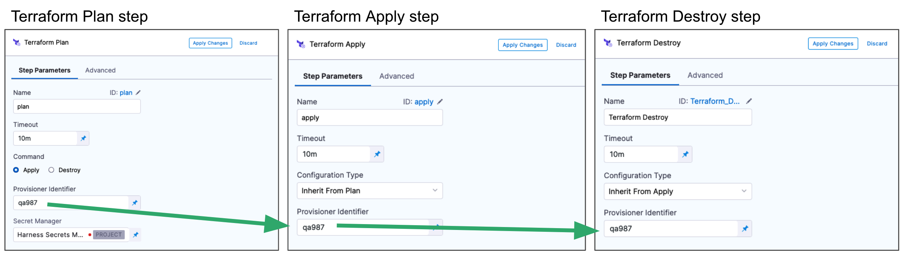
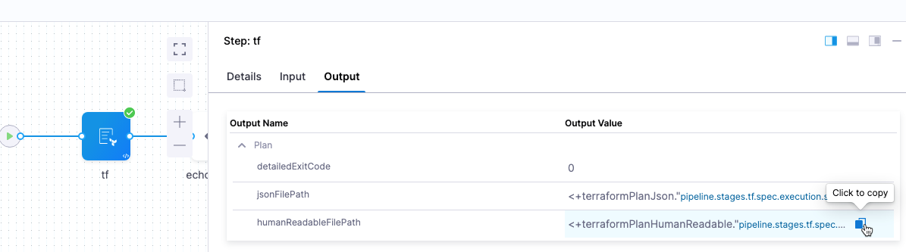
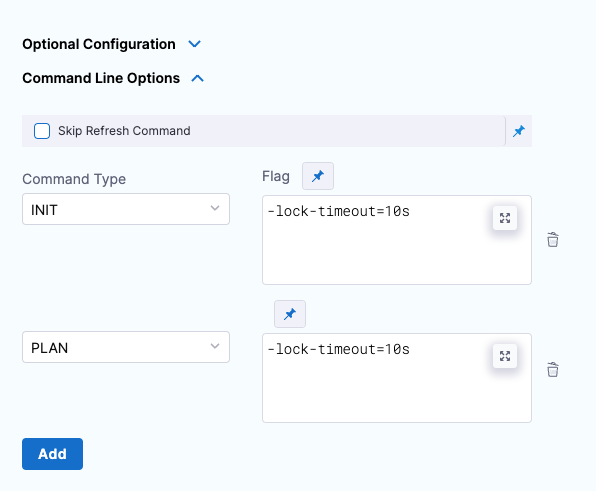

This topic describes how to run a Terraform script as a Terraform plan using the Harness Terraform Plan step.

You can run the Terraform Plan step to provision any resource, including the target infrastructure for a deployment.

This topic covers using the Terraform Plan step for **non-target** infrastructure.

For steps on using the Terraform Plan to provision the target infrastructure for a deployment, see [Provision Target Deployment Infra Dynamically with Terraform](/docs/continuous-delivery/cd-infrastructure/terraform-infra/provision-infra-dynamically-with-terraform).

## Before You Begin

* [Terraform Provisioning with Harness](/docs/continuous-delivery/cd-infrastructure/terraform-infra/terraform-provisioning-with-harness)
* [Kubernetes CD Quickstart](/docs/continuous-delivery/deploy-srv-diff-platforms/kubernetes/kubernetes-cd-quickstart)

## Important: Install Terraform on Delegates

Terraform must be installed on the Delegate to use a Harness Terraform Provisioner. You can install Terraform manually or use the `INIT_SCRIPT` environment variable in the Delegate YAML.

See [Build custom delegate images with third-party tools](/docs/platform/delegates/install-delegates/build-custom-delegate-images-with-third-party-tools).

## Review: Terraform Plan and Apply Steps

Typically the Terraform Plan step is used with the Terraform Apply step.

First, you add the Terraform Plan step and define the Terraform script for it to use.

Next, you add the Terraform Apply step, select **Inherit from Plan** in **Configuration Type**, and reference the Terraform Plan step using the same **Provisioner Identifier.**


For steps on using the Terraform Apply step, see:

* [Provision Target Deployment Infra Dynamically with Terraform](/docs/continuous-delivery/cd-infrastructure/terraform-infra/provision-infra-dynamically-with-terraform)
* [Provision with the Terraform Apply Step](run-a-terraform-plan-with-the-terraform-apply-step)

You can also simply run the Terraform Plan without applying the plan using the Terraform Apply step.

## Step 1: Add the Terraform Plan Step

In the Terraform Plan step, you connect Harness to your repo and add Terraform scripts.

You can add the Terraform Plan step in the stage's Infrastructure in **Dynamic Provisioning**. Dynamic Provisioning is used to provision the target infrastructure for the stage's deployment. Consequently, if you add Terraform Plan there, you must use a Terraform Apply step to apply the plan.

See [Provision Target Deployment Infra Dynamically with Terraform](/docs/continuous-delivery/cd-infrastructure/terraform-infra/provision-infra-dynamically-with-terraform).

You can also add a Terraform Plan step anywhere in the **Execution** steps for the stage. In that case, you aren't required to use a Terraform Apply step.

The Terraform Plan step has the following settings.

### Name

In **Name**, enter a name for the step, for example, **plan**.

The name is very important. It's used to refer to settings in this step.

For example, if the name of the stage is **Terraform** and the name of the step is **plan**, and you want to echo its timeout setting, you would use:

`<+pipeline.stages.Terraform.spec.execution.steps.plan.timeout>`

### Timeout

In **Timeout**, enter how long Harness should wait to complete the Terraform Plan step before failing the step.

### Run on Remote Workspace

Enable this option to identify whether the Terraform configuration uses a Terraform remote backend.

When enabled, you cannot provide the workspace input in Harness. The workspace will be outlined in your configuration for the remote backend.

Also, the remote backend is supported only when the **Configuration Type** is **Inline**.

```
terraform {
  backend "remote" {
    hostname     = "app.terraform.io"
    organization = "your-organization"
    workspaces {
      name = "your-workspace"
    }
  }
}
```

### Command

In **Command**, select **Apply or Destroy**.

* **Apply:** The plan will be applied by a [Terraform Apply](run-a-terraform-plan-with-the-terraform-apply-step) step later in your stage. Even though you are only running a Terraform plan in this step, you identify that this step can be used with a Terraform Apply step later.
* **Destroy:** The plan will be applied by a [Terraform Destroy](remove-provisioned-infra-with-terraform-destroy) step later in your stage.

### Provisioner Identifier

Enter a unique value in **Provisioner Identifier**.

The Provisioner Identifier identifies the provisioning done in this step. You use the Provisioner Identifier in additional steps to refer to the provisioning done in this step.

The most common use of Provisioner Identifier is between the Terraform Plan and Terraform Apply steps. For the Terraform Apply step, to apply the provisioning from the Terraform Plan step, you use the same Provisioner Identifier.


You also use the same Provisioner Identifier with the [Terraform Destroy](remove-provisioned-infra-with-terraform-destroy) step to remove the provisioned resources.



You also use the same Provisioner Identifier with the [Terraform Rollback](rollback-provisioned-infra-with-the-terraform-rollback-step) step to rollback the provisioned resources.

#### Provisioner Identifier Scope

The Provisioner Identifier is a Project-wide setting. You can reference it across Pipelines in the same Project.

For this reason, it's important that all your Project members know the Provisioner Identifiers. This will prevent one member building a Pipeline from accidentally impacting the provisioning of another member's Pipeline.

### Secret Manager

Select a Secrets Manager to use for encrypting/decrypting and saving the Terraform plan file.

See [Harness Secrets Manager Overview](/docs/platform/secrets/secrets-management/harness-secret-manager-overview).

A Terraform plan is a sensitive file that could be misused to alter resources if someone has access to it. Harness avoids this issue by never passing the Terraform plan file as plain text.

Harness only passes the Terraform plan between the Harness Manager and Delegate as an encrypted file using a Secrets Manager.

When the `terraform plan` command runs on the Harness Delegate, the Delegate encrypts the plan and saves it to the Secrets Manager you selected. The encrypted data is passed to the Harness Manager.

When the plan is applied, the Harness Manager passes the encrypted data to the Delegate.

The Delegate decrypts the encrypted plan and applies it using the `terraform apply` command.

#### Limitations

The Terraform plan size must not exceed the secret size limit for secrets in your default Harness secret manager. For example, the AWS secrets manager has a limitation of 64KB. Other supported secrets managers support larger file sizes, typically, 256KB.

### Configuration File Repository

**Configuration File Repository** is where the Terraform script and files you want to use are located.

Here, you'll add a connection to the Terraform script repo.

Click **Specify Config File** or edit icon.

The **Terraform Config File Store** settings appear.

Click the provider where your files are hosted.


Select or create a Connector for your repo. For steps, see [Connect to a Git Repo](/docs/platform/connectors/code-repositories/connect-to-code-repo) or [Artifactory Connector Settings Reference](/docs/platform/connectors/cloud-providers/ref-cloud-providers/artifactory-connector-settings-reference) (see **Artifactory with Terraform Scripts and Variable Definitions (.tfvars) Files**).

In **Git Fetch Type**, select **Latest from Branch** or **Specific Commit ID**. When you run the Pipeline, Harness will fetch the script from the repo.

**Specific Commit ID** also supports [Git tags](https://git-scm.com/book/en/v2/Git-Basics-Tagging). If you think the script might change often, you might want to use **Specific Commit ID**. For example, if you are going to be fetching the script multiple times in your Pipeline, Harness will fetch the script each time. If you select **Latest from Branch** and the branch changes between fetches, different scripts are run.

In **Branch**, enter the name of the branch to use.

In **Folder Path**, enter the path from the root of the repo to the folder containing the script.

For example, here's a Terraform script repo, the Harness Connector to the repo, and the **Config Files** settings for the branch and folder path:


Click **Submit**.

Your Terraform Plan step is now ready. You can now configure a Terraform Apply, Destory, or Rollback step that can use the Terraform script from this Terraform Plan step.

The following sections cover common Terraform Plan step options.

### Artifactory

See [Artifactory Connector Settings Reference](/docs/platform/connectors/cloud-providers/ref-cloud-providers/artifactory-connector-settings-reference) (see **Artifactory with Terraform Scripts and Variable Definitions (.tfvars) Files**).

### AWS S3

1. In **Region**, select the region where your bucket is stored.
2. In **Bucket**, select the bucket where your Terraform files are stored (all buckets from the selected region that are available to the connector will be fetched).
3. In **Folder Path**, enter the path from the root of the repo to the folder containing the script.

   

Harness will fetch all files from specified folder.

### Source Module

When you set up the file repo in **Configuration File Repository**, you use a Harness Connector to connect to the repo where the Terraform scripts are located.

Some scripts will reference module sources in other repos and Harness will pull the source code for the desired child module at runtime (during `terraform init`).

In **Source Module**, you can select **Use Connector credentials** to have Harness use the credentials of the Connector to pull the source code for the desired child module(s).

If you do not select **Use Connector credentials**, Terraform will use the credentials that have been set up in the system.

The **Use Connector credentials** setting is available to Harness Git Connectors using SSH authentication or HTTPS.

When configuring the SSH key for the connector, exporting an SSH key with a passphrase for the module source is not supported. Configure an SSH Key without the passphrase.

Here is a syntax example to reference the Terraform module using the SSH protocol:

```bash
source = "git@github.com:your-username/your-private-module.git"
```

Here is a syntax example to reference the Terraform module using the HTTPS protocol:

```bash
source = "git::https://github.com/your-organization/your-private-module.git"
```

:::tip

The ability to authenticate with HTTPS is new! Here is a demo on its functionality:

<DocVideo src="https://www.loom.com/share/bb8b9e4996f14bf0a16839849b0b72e4?sid=3befc405-7c4d-4f21-afe0-c36e2962b566" />

:::

## Workspace

Harness supports Terraform [workspaces](https://www.terraform.io/docs/state/workspaces.html). A Terraform workspace is a logical representation of one your infrastructures, such as Dev, QA, Stage, Production.

Workspaces are useful when testing changes before moving to a production infrastructure. To test the changes, you create separate workspaces for Dev and Production.

A workspace is really a different state file. Each workspace isolates its state from other workspaces. For more information, see [When to use Multiple Workspaces](https://www.terraform.io/docs/state/workspaces.html#when-to-use-multiple-workspaces) from Hashicorp.

Here's an example script where a local value names two workspaces, **default** and **production**, and associates different instance counts with each:

```json
locals {  
  counts = {  
      "default"=1  
      "production"=3  
  }  
}  
  
resource "aws_instance" "my_service" {  
  ami="ami-7b4d7900"  
  instance_type="t2.micro"  
  count="${lookup(local.counts, terraform.workspace, 2)}"  
  tags {  
         Name = "${terraform.workspace}"  
    }  
}
```


In the workspace interpolation sequence, you can see the count is assigned by applying it to the Terraform workspace variable (`terraform.workspace`) and that the tag is applied using the variable also.

Harness will pass the workspace name you provide to the `terraform.workspace` variable, thus determining the count. If you provide the name **production**, the count will be **3**.

In the **Workspace** setting, you can simply select the name of the workspace to use.

You can also use a [stage variable](/docs/platform/variables-and-expressions/harness-variables) in **Workspace**.

Later, when the Pipeline is deployed, you specify the value for the stage variable and it is used in **Workspace**.

This allows you to specify a different workspace name each time the Pipeline is run.

You can even set a Harness Trigger where you can set the workspace name used in **Workspace**.

## AWS Connector Provider Credential Authentication for Terraform Plan and Apply Steps

:::note
This feature requires Harness Delegate version 81202. This feature is available only to paid customers. Contact [Harness Support](mailto:support@harness.io) to enable the feature.
:::


You can use an AWS connector to have the Terraform Plan and Apply step assume a role to perform infrastructure provisioning. It's an optional configuration that takes the AWS connector, a region and Role ARN. The Terraform step uses these parameters to authenticate the AWS account targeted for infrastructure provisioning.

By default, AWS assumes the role session duration as 900 seconds. To increase the AWS role session duration, a  built-in environment variable, `HARNESS_AWS_ASSUME_ROLE_DURATION` is introduced, which can be used to override the assume role session duration. `HARNESS_AWS_ASSUME_ROLE_DURATION` is designed for use in Terraform steps in the environment variable section. The value must be set in seconds. This new environment variable requires Harness Delegate version 82700.

When configured the optional configuration for AWS Connector these fields can be passed as a fixed value, runtime input, or an expression

```YAML
- step:
    type: TerraformApply
    name: Apply
    identifier: Apply
    spec:
      provisionerIdentifier: provision
      configuration:
        type: Inline
        spec:
          workspace: <+input>
          configFiles: {}
          providerCredential:
            type: Aws
            spec:
              connectorRef: <+input>
              region: <+input>
              roleArn: <+input>
    timeout: 10m
```

#### Terraform variable files

You can specify Terraform variables inline and fetch remote variable files during run time. For more information, go to [Specify Terraform variables](/docs/continuous-delivery/cd-infrastructure/terraform-infra/optional-tf-var-files).

#### Artifactory

See [Artifactory Connector Settings Reference](/docs/platform/connectors/cloud-providers/ref-cloud-providers/artifactory-connector-settings-reference) (see **Artifactory with Terraform Scripts and Variable Definitions (.tfvars) Files**).

#### AWS S3

1. In **Identifier**, enter an identifier, so you can refer to variables using expressions if needed.
2. In **Region**, select the region where your bucket is stored.
3. In **Bucket**, select the bucket where your Terraform var files are stored (all buckets from the selected region that are available to the connector will be fetched).
4. In **File Paths**, add one or more file paths from the root of the bucket to the variable file.

   

Click **Submit**. The remote file(s) are added.

## Backend Configuration

The **Backend Configuration** section contains the [remote state](https://www.terraform.io/docs/language/state/remote.html) values.

You can use an inline or remote state file.

### Using a remote Backend Config File

1. In Backend Configuration, select **Remote**.
2. Click **Specify Backend Config File**
3. Select your provider (GitHub, Artifactory, S3, etc.) and then select or create a Connector to the repo where the files are located. Typically, this is the same repo where your Terraform script is located, so you can use the same Connector.
   

#### Git providers

1. In **Git Fetch Type**, select **Latest from Branch** or **Specific Commit ID**.
2. In **Branch**, enter the name of the branch.
3. In **File Path**, add file path from the root of the repo to the backend config file.
4. Click **Submit**. The remote file(s) are added.

   

#### Artifactory

See [Artifactory Connector Settings Reference](/docs/platform/connectors/cloud-providers/ref-cloud-providers/artifactory-connector-settings-reference) (see **Artifactory with Terraform Scripts and Variable Definitions (.tfvars) Files**).

#### AWS S3

1. In **Region**, select the region where your bucket is stored.
2. In **Bucket**, select the bucket where your backend config file is stored (all buckets from the selected region that are available to the connector will be fetched).
3. In **File Path**, add file path from the root of the bucket to the backend config file.

   

You can also use files in the [Harness File Store](/docs/continuous-delivery/x-platform-cd-features/services/add-inline-manifests-using-file-store).

To use the same remote state file set in the Terraform Plan step, Terraform Apply steps must use the same Provisioner Identifier.

For an example of how the config file should look, please see [Backend Configuration](https://developer.hashicorp.com/terraform/language/settings/backends/configuration#file) from HashiCorp.

Here's an example.

main.tf (note the empty backend S3 block):


```json
variable "global_access_key" {type="string"}  
variable "global_secret_key" {type="string"}  
  
variable "env" {  
    default= "test"  
}  
provider "aws" {  
  access_key = "${var.global_access_key}"  
  secret_key = "${var.global_secret_key}"  
  region = "us-east-1"  
      
}  
  
resource "aws_s3_bucket" "bucket" {  
  bucket = "prannoy-test-bucket"  
}  
  
terraform {  
backend "s3" {  
      
  }  
}
```


backend.tf:

```json
access_key = "1234567890"  
secret_key = "abcdefghij"  
bucket = "terraform-backend-config-test"  
key    = "remotedemo.tfstate"  
region = "us-east-1"
```

### Using Inline State

Enter values for each backend config (remote state variable).

For example, if your config.tf file has the following backend:


```json
terraform {
  backend "gcs" {
    bucket  = "tf-state-prod"
    prefix  = "terraform/state"
    }
}
```

In **Backend Configuration**, you provide the required configuration variables for the backend type. 

For a remote backend configuration, the variables should be in .tfvars file.

Example:
```json
bucket  = "tf-state-prod"  
prefix  = "terraform/state"
```

In your Terraform .tf config file, only the definition of the Terraform backend is required:

```json
terraform {  
  backend "gcs" {}
}
```

See **Configuration variables** in Terraform's [gcs Standard Backend doc](https://www.terraform.io/docs/language/settings/backends/gcs.html#configuration-variables).

## Targets

You can use the **Targets** setting to target one or more specific modules in your Terraform script, just like using the `terraform plan -target` command. See [Resource Targeting](https://www.terraform.io/docs/commands/plan.html#resource-targeting) from Terraform.

You simply identify the module using the standard format `module.name`, like you would using `terraform plan -target="module.s3_bucket"`.

If you have multiple modules in your script and you don't select one in **Targets**, all modules are used.

## Environment Variables

If your Terraform script uses [environment variables](https://www.terraform.io/docs/cli/config/environment-variables.html), you can provide values for those variables here.

For example:


```bash
TF_LOG_PATH=./terraform.log  
TF_VAR_alist='[1,2,3]'
```
You can use Harness encrypted text for values. See [Add Text Secrets](/docs/platform/secrets/add-use-text-secrets).

## Export JSON representation of Terraform Plan

Enable this setting to use a JSON representation of the Terraform plan that is implemented in a Terraform Plan step.

In subsequent **Execution** steps, such as a [Shell Script](/docs/continuous-delivery/x-platform-cd-features/cd-steps/utilities/shell-script-step) step, you can reference the Terraform plan using this expression format:

`<+execution.steps.[Terraform Plan step Id].plan.jsonFilePath>`

For example, if you had a Terraform Plan step with the [Id](/docs/platform/references/entity-identifier-reference) `Plan_Step`, you could use the expression in a Shell Script step like this:


```bash
cat "<+execution.steps.Plan_Step.plan.jsonFilePath>"
```

If the Terraform Plan step is located in **Dynamic Provisioning** steps in **Infrastructure**, and the Terraform Plan step Id is `TfPlan`, then expression is:

`<+infrastructure.infrastructureDefinition.provisioner.steps.TfPlan.plan.jsonFilePath>`

For information on Terraform Plan in the **Dynamic Provisioning** steps in **Infrastructure**, see [Provision Target Deployment Infra Dynamically with Terraform](/docs/continuous-delivery/cd-infrastructure/terraform-infra/provision-infra-dynamically-with-terraform).JSON representation of Terraform plan can be accessed across different stages as well. In this case, the FQN for the step is required in the expression.

For example, if the Terraform Plan step with the Id `TfPlan` is in the **Execution** steps of a stage with the Id `TfStage`, then the expression is like this:

`<+pipeline.stages.TfStage.spec.execution.steps.TfPlan.plan.jsonFilePath>`

When Terraform plan is present in a step group, then the expression to access jsonFilePath is like this:

`<+pipeline.stages.[stage name].spec.execution.steps.[step group name].steps.[step name].plan.jsonFilePath>`

:::note
When the `Run on Remote Workspace` option is selected, you will not be able to export the JSON representation of terraform plan.
:::

### Scope of Expression

JSON representation of the Terraform plan is available only between the Terraform Plan step and subsequent Terraform Apply step. The expression will fail to resolve if used after the Terraform Apply step.

If used across stages, the Terraform Plan step can be used in one stage and the Terraform Apply step can be used in a subsequent stage. The expression will resolve successfully in this case.

The JSON of the Terraform Plan step is not available after Rollback.

## Export Human Readable representation of Terraform Plan

Enable this option to view the Terraform plan file path and contents as human-readable JSON is subsequent steps, such as a [Shell Script step](/docs/continuous-delivery/x-platform-cd-features/cd-steps/utilities/shell-script-step).

Once you enable this option and run a CD stage with the Terraform Plan step, you can click in the Terraform Plan step's **Output** tab and copy the **Output Value** for the **humanReadableFilePath** output.



The format for the expression is:
- **humanReadableFilePath**:
  - `<+terraformPlanHumanReadable."pipeline.stages.[stage Id].spec.execution.steps.[step Id].[Provisioner Identifier]_planHumanReadable">`

For example, if the Terraform Plan stage, step Ids, and Terraform provisioner identifier are `tf` then you would get the following expressions:

- **humanReadableFilePath**:
  - `<+terraformPlanHumanReadable."pipeline.stages.tf.spec.execution.steps.tf.tf_planHumanReadable">`

Next, you can enter those expressions in a subsequent [Shell Script step](/docs/continuous-delivery/x-platform-cd-features/cd-steps/utilities/shell-script-step) step and Harness will resolve them to the human-readable paths and JSON.

For example, here is a script using the variables:

```bash
echo "<+terraformPlanHumanReadable."pipeline.stages.tf.spec.execution.steps.tf.tf_planHumanReadable">"
echo "Plan is"
cat "<+terraformPlanHumanReadable."pipeline.stages.tf.spec.execution.steps.tf.tf_planHumanReadable">"
```
Note that if there are no changes in the plan, the standard Terraform message is shown in the Shell Step's logs:

```
No changes. Your infrastructure matches the configuration.
Terraform has compared your real infrastructure against your configuration
and found no differences, so no changes are needed.
```

## Store Terraform Plan on Harness Delegate

:::important
* This feature is behind the feature flag, `CDS_STORE_TERRAFORM_PLAN_FILE_LOCALLY_ON_DELEGATE`. Contact [Harness Support](mailto:support@harness.io) to enable this feature.

* This option requires Harness Delegate version 24.04.82705 or later.
:::

Enable the **Store terraform plan on delegate** option on the Terraform Plan step to store the Terraform Plan on Harness Delegate temporarily. This is particularly useful if you don't want to save the Terraform Plan files on Secrets Manager or if there is a file size limit on Secrets Manager. 

After you enable this option, select the **Inherit From Plan** option in the **Apply Inherit** or **Destroy Inherit** steps' **Configuration Type** field and enter the Provisioner Id used by the Terraform Plan step.

**Important notes**

* You must execute the Terraform Plan and Terraform Apply/Destroy steps on the same pod to be able to use the stored plan file. If your delegate has multiple pod replicas, make sure to [Run the Terraform steps on the pod](https://developer.harness.io/docs/platform/delegates/manage-delegates/run-all-pipeline-steps-in-one-pod/).
* Harness stores the Terraform Plan files at the `./tf-plan/` directory inside the working directory (default path, `/opt/harness-delegate/`) of the delegate, i.e., the files are stored at, `/opt/harness-delegate/./tf-plan/`.
* If the delegate pods are restarted, the Terraform plan files disappear from the location where they are stored. To not lose the Terraform plan files during the new delegate deployment rollout or restart, you have to set up a persistent volume and mount the directory where the Terraform plan files are stored. If your delegate has multiple pod replicas, you must set up a persistent volume with the access mode, `ReadWriteMany`. Go to this [example](https://medium.com/@Sushil_Kumar/readwritemany-persistent-volumes-in-google-kubernetes-engine-a0b93e203180) to learn how to set the persistent volume for Google GKE.
* The Terraform plan file is cleaned up after the Terraform Apply/Destroy step is executed or after the pipeline execution is complete.

Here's a video demo of how to store Terraform Plan files on delegate: 

<!-- Video:
https://www.loom.com/share/f8cf2e7abe094d08829902831a4081b5?sid=f522eb06-4a86-416a-94ac-24f2a86f7a88-->
<DocVideo src="https://www.loom.com/share/bc5a4f382d584b228b4ea2c82eb94a7c?sid=60467f35-e0d6-43c8-93cc-538668cc4c21" />

## Skip state storage

The following feature requires a minimum Harness Delegate version of 812xx.

While running Terraform commands on the delegate, Harness by default will try to detect if there is a local state file in the Terraform working directory.

If local state file is identified, at the end of the execution it is saved on Harness storage with a key based on the provisioner identifier.

That state file is downloaded in the Terraform working directory for subsequent executions, and the updated state is uploaded after execution ends.

This method allows the maintaining of the state of the infrastructure even if there is no Terraform backend configured.

This is more for testing purposes. For production environments, Harness advises you configure a backend in your Terraform config files. For information, go to [Backend Configuration](https://developer.hashicorp.com/terraform/language/settings/backends/configuration).

With the **Skip state storage** option enabled, Harness allows you to skip the local state upload and download operations mentioned above.

This option makes is useful only if you do not have a Terraform backed configured in your Terraform config files. If you have a Terraform backed configured, then the Terraform CLI will not create any local state files.


## Command line options

This setting allows you to set the Terraform CLI options for Terraform commands depending on the Terraform step type. For example: `-lock=false`, `-lock-timeout=0s`.




## Skip Terraform Refresh

Terraform refresh command won't be running when this setting is selected.

## Option: Terraform Plan detailed-exitcode

You can use the standard `terraform plan` command option [detailed-exitcode](https://www.terraform.io/cli/commands/plan#other-options) with the Harness Terraform Plan step.

If you use the `-detailed-exitcode` option in a step that follows the Harness Terraform Plan step, such as a [Shell Script](/docs/continuous-delivery/x-platform-cd-features/cd-steps/utilities/shell-script-step) step, Harness will return a detailed exit code:

* `0`: succeeded with empty diff (no changes)
* `1`: error
* `2`: succeeded with non-empty diff (changes present)|

Exit codes are available as Terraform Plan step outputs that can be accessed using expressions with the following format:

```
<+pipeline.stages.STAGE_ID.spec.execution.steps.STEP_ID.plan.detailedExitCode>
```

For example:

```
<+pipeline.stages.TfStage.spec.execution.steps.TfPlan.plan.detailedExitCode>
```

## Working directory cleanup
Each Terraform step runs in a specific working directory on the delegate.

The Terraform working directory is located at `/opt/harness-delegate/./terraform-working-dir/`.

To that directory path, Harness adds additional directories that are named after the organization, account, project, and provisionerId (from the step) such that the final working directory is `/opt/harness-delegate/./terraform-working-dir/org-name/account-name/project-name/provisionerId/`.

In this final working directory, Harness stores the Terraform configuration and all fetched files such as var-files and backend-config.

Once the Terraform step execution is complete, Harness cleans up the main working directory `/opt/harness-delegate/./terraform-working-dir/`.

If you generate any local resources on the delegate in the directory where Terraform configurations are located, those resources are also removed. If you need those resources, make sure to generate them outside the Terraform working directory.

## Option: Advanced Settings

In **Advanced**, you can use the following options:

* [Delegate Selector](/docs/platform/delegates/manage-delegates/select-delegates-with-selectors)
* [Conditional Execution](/docs/platform/pipelines/step-skip-condition-settings)
* [Failure Strategy](/docs/platform/pipelines/failure-handling/define-a-failure-strategy-on-stages-and-steps)
* [Looping Strategy](/docs/platform/pipelines/looping-strategies/looping-strategies-matrix-repeat-and-parallelism)
* [Policy Enforcement](/docs/platform/governance/policy-as-code/harness-governance-overview)

## Troubleshooting Terraform execution on a Docker delegate managed by ECS

When using a Docker delegate with ECS, you might encounter the following error : `NoCredentialProviders: no valid providers in chain`.

When your Docker delegate is managed by ECS, and is set to assume an IAM role for components such as the delegate and Terraform settings from Terraform configs, please ensure that the delegate has the permissions to assume the role.

If your Docker delegate is set to use a proxy, ensure that the proxy instance also has permissions to assume the role. Also, try to set the proxy environment variable for the Terraform steps:

In case your delegate is set to use a proxy, make sure that proxy also has permissions to assume the role, and also try to set environment variables for the Terraform steps:

- `HTTP_PROXY=http://proxy.example.com:8080`
- `HTTPS_PROXY=http://proxy.example.com:8080`

If your ECS delegate is set with this environment variable: **AWS_CONTAINER_CREDENTIALS_RELATIVE_URI** and you intend to use AWS ECS container credentials, ensure your delegate has access to all of the required AWS services that need to provide credentials, such as STS, Metadata Service, etc.


## See Also

* [Provision with the Terraform Apply Step](run-a-terraform-plan-with-the-terraform-apply-step)

