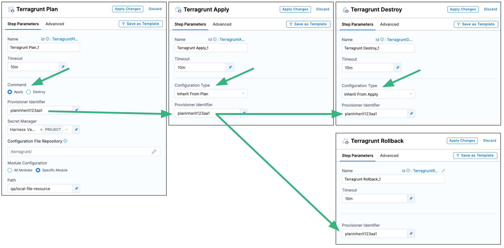
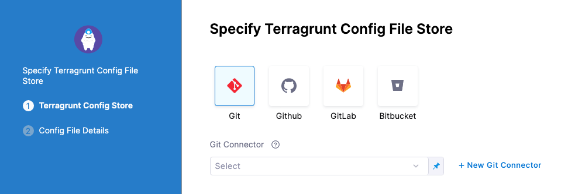

# Terragrunt provisioning

Harness has first-class support for [Terragrunt](https://terragrunt.gruntwork.io/docs/) as an infrastructure provisioner.

This topic describes each of the Terragrunt steps you can use in you CD stage, and how these steps are commonly used together.

## Summary

Harness lets you use Terragrunt to provision infrastructure as part of your deployment process. 

Harness can provision any resource that is supported by Terragrunt and the related Terraform provider or plugin.

If you want to use Terraform without Terragrunt, Harness supports that, too. See [Terraform how-tos](./terraform-infra/terraform-how-tos).

### Using Terragrunt steps together

The Terragrunt steps can be used independently or you can connect them by using the same **Provisioner Identifier** in all of the steps.

Here's how to use all the steps together:

1. Terragrunt Plan step:
   1. Add the Terragrunt Plan step and define the Terragrunt script for it to use.
   2. Select **Apply** in **Command**. 
   3. Enter a **Provisioner Identifier**.
2. Terragrunt Apply step:
   1. Select **Inherit from Plan** in **Configuration Type**.
   2. Reference the Terragrunt Plan step using the same **Provisioner Identifier**.
3. Terragrunt Destroy step:
   1. Select **Inherit from Apply** or **Inherit from Plan** in **Configuration Type**.
   1. Reference the Terragrunt Apply or Plan step using the same **Provisioner Identifier**.
4. Terragrunt Rollback step:
   1. Reference the Terragrunt Apply or Plan step using the same **Provisioner Identifier**.

<!--  -->

<docimage path={require('./static/2161eed44e5b1ef3369542d40747af39160c7a25b71f03f160ce1e29329c6bab.png')} />

Each of these steps is described below in [Terragrunt steps](#terragrunt-steps).


## Important: Install Terraform and Terragrunt on delegates

Terraform and Terragrunt must be installed on the Harness delegates used for deployment. You can install Terraform and Terragrunt manually or use the `INIT_SCRIPT` environment variable in the Delegate YAML.

For steps on using the `INIT_SCRIPT` environment variable, see [Build custom delegate images with third-party tools](/docs/platform/2_Delegates/install-delegates/build-custom-delegate-images-with-third-party-tools/).

Here's an example of the installation script to install Terraform and Terragrunt:

```bash
## Terraform installation
set +x  
apt-get update  
apt-get install wget  
apt-get -y install git  
wget https://releases.hashicorp.com/terraform/0.13.3/terraform_0.13.3_linux_amd64.zip apt-get install unzip  
unzip terraform_0.13.3_linux_amd64.zip  
cp terraform /usr/bin/  
terraform --version  

## Terragrunt installation
wget https://github.com/gruntwork-io/terragrunt/releases/download/v0.28.0/terragrunt_linux_amd64  
mv terragrunt_linux_amd64 terragrunt  
chmod u+x terragrunt  
mv terragrunt /usr/local/bin/terragrunt  
terragrunt --version
```

### Supported Terragrunt and Terraform versions

Terragrunt maintains a Terraform version compatibility table to help ensure that you have the correct versions of Terragrunt and Terraform running together.

For the Terraform versions supported by Terragrunt, go to [Terraform Version Compatibility Table](https://terragrunt.gruntwork.io/docs/getting-started/supported-terraform-versions/).

## Permissions

The Harness delegate requires permissions according to the deployment platform and the operations of the Terragrunt and Terraform scripts.

In some cases, access keys, secrets, and SSH keys are needed. You can add these in [Harness secrets management](https://developer.harness.io/docs/first-gen/firstgen-platform/security/secrets-management/secret-management). You can then select them in the Terragrunt Provisioner step.

## Terragrunt steps

:::note 
Terragrunt steps are available in Deploy and Custom stages only.
:::

You can add Terragrunt steps anywhere in your CD stage's **Execution**. The most common order is Terragrunt Plan -> Terragrunt Apply -> Terragrunt Destroy. 

You add the Terragrunt Rollback step in the stage **Rollback** section.

The following sections describe how to set up each of the Terragrunt steps in your CD stage.

```mdx-code-block
import Tabs from '@theme/Tabs';
import TabItem from '@theme/TabItem';
```
```mdx-code-block
<Tabs>
  <TabItem value="Terragrunt Plan" label="Terragrunt Plan" default>
```

To add a Terragrunt Plan step, do the following:

1. Do the following if you haven't yet done so:
   1. [Add a Deploy or Custom stage](/docs/platform/pipelines/add-a-stage/) to your pipeline.
   2. If you're setting up a Deploy stage, add a [service](https://developer.harness.io/docs/category/services) and [environment](/docs/continuous-delivery/x-platform-cd-features/environments/create-environments/).
2. In the **Execution** tab, click **Add Step**, and then click **Terragrunt Plan**.
3. Enter the following Terragrunt Plan settings.

#### Name

* In **Name**, enter a name for the step. Use a name that describes the infrastructure the step plans to provision.

#### Timeout

* Enter how long you want Harness to try to complete the step before failing and initiating the stage or step [failure strategy](https://developer.harness.io/docs/platform/pipelines/define-a-failure-strategy-on-stages-and-steps/).

   You can use:

   - `w` for weeks.
   - `d` for days.
   - `h` for hours.
   - `m` for minutes.
   - `s` for seconds.
   - `ms` for milliseconds.

   The maximum is `53w`.

   Timeouts can be set at the pipeline-level also, **Advanced Options**.

Provisioning can be time-consuming so use at least `5m`.

#### Command

The **Command** setting indicates how this plan will be used later in the stage. 

There are two options:
- **Apply**. Select this option if you will apply the plan with a subsequent Terragrunt Apply step.
- **Destroy**. Select this option if you will destroy the plan with a subsequent Terragrunt Destroy step.

:::info

  Terragrunt Apply and Destroy steps do not support inheriting from a Terragrunt Plan step when **All Modules** is selected in the Terragrunt Plan step's **Module Configuration**.

:::

#### Provisioner Identifier

You use the **Provisioner Identifier** in subsequent steps to refer to the plan run in this step.

* Enter a unique value in Provisioner Identifier.

The most common use of **Provisioner Identifier** is between the Terragrunt Plan and Terragrunt Apply or Terragrunt Destroy steps. 

For the Terragrunt Apply step to apply the plan from the Terragrunt Plan step, it uses the same **Provisioner Identifier**.

For the Terragrunt Destroy step to destroy the plan from the Terragrunt Plan step, it uses the same **Provisioner Identifier**.

Here's an example of how the **Provisioner Identifier** is used across steps:

<!--  -->

<docimage path={require('./static/2161eed44e5b1ef3369542d40747af39160c7a25b71f03f160ce1e29329c6bab.png')} />

##### Provisioner Identifier scope

The **Provisioner Identifier** is a project-wide setting. You can reference it across pipelines in the same project.

For this reason, it's important that all your project members know the provisioner identifiers. Sharing this information will prevent one member building a pipeline from accidentally impacting the provisioning of another member's pipeline.

#### Secret Manager

* Select a Harness [secrets manager](https://developer.harness.io/docs/platform/Secrets/Secrets-Management/harness-secret-manager-overview) to use for encrypting/decrypting and saving the Terragrunt plan file.

A Terragrunt plan is a sensitive file that could be misused to alter resources if someone has access to it. Harness avoids this issue by never passing the Terragrunt plan file as plain text.

Harness only passes the Terragrunt plan between the Harness Manager and delegate as an encrypted file using a secrets manager.

Some third-party secret managers, such as HashiCorp Vault, Azure Key Vault, and AWS Secrets Manager, have a maximum secret size limitation. If the size of the secret you want to store exceeds this limit, an error will be thrown by the corresponding third-party system. Therefore, it's crucial to check the maximum secret size supported by your chosen secret manager and ensure that your secrets are within the size limit.

In contrast, key management services like Google Cloud KMS or AWS KMS do not have the same limitation as they are primarily designed for managing encryption keys, not arbitrary secret data. However, it's still essential to check the specific limitations of your chosen key management service and ensure that your secrets meet their requirements.

When designing your secret management strategy and selecting a secret management solution, consider the maximum secret size limit and other limitations that may affect your use case. You may need to choose a secret manager that can handle larger secret sizes or find alternative strategies for managing secrets that exceed the maximum size limit of your chosen secret manager.

When the `terragrunt plan` command runs on the Harness delegate, the delegate encrypts the plan and saves it to the secrets manager you selected. The encrypted data is passed to the Harness Manager.

When the plan is applied, the Harness manager passes the encrypted data to the delegate.

The delegate decrypts the encrypted plan and runs it.

Your Terragrunt Plan step is now ready. 

You can now configure a Terragrunt Apply, Destroy, or Rollback step to use the Terragrunt script from this Terragrunt Plan step.

```mdx-code-block
  </TabItem>
  <TabItem value="Terragrunt Apply" label="Terragrunt Apply">
```


To add a Terragrunt Apply step, do the following:

1. Do the following if you haven't yet done so:
   1. [Add a Deploy or Custom stage](/docs/platform/pipelines/add-a-stage/) to your pipeline.
   2. If you're setting up a Deploy stage, add a [service](https://developer.harness.io/docs/category/services) and [environment](/docs/continuous-delivery/x-platform-cd-features/environments/create-environments/).
2. In your CD stage Execution, click **Add Step**, and then click **Terragrunt Apply**.
3. Enter the following Terragrunt Apply settings.

#### Name

* In **Name**, enter a name for the step. Use a name that describes the infrastructure the step plans to provision.

#### Timeout

* Enter how long you want Harness to try to complete the step before failing and initiating the stage or step [failure strategy](https://developer.harness.io/docs/platform/pipelines/define-a-failure-strategy-on-stages-and-steps/).

   You can use:

   - `w` for weeks.
   - `d` for days.
   - `h` for hours.
   - `m` for minutes.
   - `s` for seconds.
   - `ms` for milliseconds.

   The maximum is `53w`.

   Timeouts can be set at the pipeline-level also, **Advanced Options**.

Provisioning can be time-consuming. Use at least `5m`.

#### Configuration Type

This setting determines whether you want to apply a Terragrunt plan from a previous Terragrunt Plan step or run a separate Terragrunt script.

There are two options:

- **Inline**.
  - Select this option to add your Terragrunt script and apply it.
- **Inherit From Plan**.
  - Select this option to apply the Terragrunt plan implemented in a previous Terragrunt Plan step.
  - To identify the plan used in a previous Terragrunt Plan step, use the same **Provisioner Identifier** as that previous Terragrunt Plan step.


:::info

  Terragrunt Apply and Destroy steps do not support inheriting from a Terragrunt Plan step when **All Modules** is selected in the Terragrunt Plan step's **Module Configuration**.

:::

#### Provisioner Identifier

The **Provisioner Identifier** identifies the provisioning performed in this step.

* Enter a unique value in **Provisioner Identifier**.

The **Provisioner Identifier** can be used with other steps to perform common Terragrunt tasks:

- Apply a Terragrunt plan:
  - Use the same **Provisioner Identifier** from a previous Terraform Plan step.
  - Set **Configuration Type** in this Terraform Apply step to **Inherit From Plan**. 
- Destroy resources provisioned by this Terragrunt Apply step:
  - Use the same **Provisioner Identifier** in this Terragrunt Apply step and a subsequent Terragrunt Destroy step.
- Roll back the provisioning performed by this Terragrunt Apply step:
  - Use the same **Provisioner Identifier** in this Terragrunt Apply step and a Terragrunt Rollback step (in the **Rollback** section of **Execution**).


Here's an example of how the **Provisioner Identifier** is used across steps:

<!--  -->

<docimage path={require('./static/2161eed44e5b1ef3369542d40747af39160c7a25b71f03f160ce1e29329c6bab.png')} />

##### Provisioner Identifier Scope

The **Provisioner Identifier** is a project-wide setting. You can reference it across pipelines in the same project.

For this reason, it's important that all your project members know the provisioner identifiers. Sharing this information will prevent one member building a pipeline from accidentally impacting the provisioning of another member's pipeline.

#### Configuration File Repository

**Configuration File Repository** is where the Terragrunt script and files you want to use are located.

Here, you'll add a connection to the Terragrunt script repo.

1. Click **Specify Config File** or click the edit icon. The **Terragrunt Config File Store** settings appear.
2. Click the provider where your files are hosted.
    
     for your repo.
4. Once you have selected a connector, click **Continue**.
5. In **Config File Details**, provide the Git repo details.
6. In **Git Fetch Type**, select **Latest from Branch** or **Specific Commit Id**.
   
   When you run the Pipeline, Harness will fetch the script from the repo.
   
   **Specific Commit Id** also supports Git tags. If you think the script might change often, you might want to use **Specific Commit Id**. For example, if you are going to be fetching the script multiple times in your pipeline, Harness will fetch the script each time. If you select **Latest from Branch** and the branch changes between fetches, different scripts are run.
7. In **Branch**, enter the name of the branch to use.
8. In **File Path**, enter the path from the root of the repo to the file containing the script.
9. Click **Submit**.

Your Terragrunt Apply step is now ready. 

You can now configure a Terragrunt Destroy or Rollback step to use the Terragrunt provisioning from this Terragrunt Apply step.

```mdx-code-block
  </TabItem>
  <TabItem value="Terragrunt Destroy" label="Terragrunt Destroy">
```

To add a Terragrunt Destroy step, do the following:

1. Do the following if you haven't yet done so:
   1. [Add a Deploy or Custom stage](/docs/platform/pipelines/add-a-stage/) to your pipeline.
   2. If you're setting up a Deploy stage, add a [service](https://developer.harness.io/docs/category/services) and [environment](/docs/continuous-delivery/x-platform-cd-features/environments/create-environments/).
2. In your CD stage **Execution**, click **Add Step**, and then click **Terragrunt Destroy**.
3. Enter the following Terragrunt Destroy settings.

#### Name

* In Name, enter a name for the step. Use a name that describes the infrastructure the step plans to provision.

#### Timeout

* Enter how long you want Harness to try to complete the step before failing and initiating the stage or step [failure strategy](https://developer.harness.io/docs/platform/pipelines/define-a-failure-strategy-on-stages-and-steps/).

   You can use:

   - `w` for weeks.
   - `d` for days.
   - `h` for hours.
   - `m` for minutes.
   - `s` for seconds.
   - `ms` for milliseconds.

   The maximum is `53w`.

   Timeouts can be set at the pipeline-level also, **Advanced Options**.

Destroying resources can be time-consuming. Use at least `5m`.

#### Configuration Type

You can add a Terragrunt Destroy step to remove any provisioned infrastructure, just like running the `terragrunt run-all destroy` command. See [destroy](https://terragrunt.gruntwork.io/docs/features/execute-terraform-commands-on-multiple-modules-at-once/#the-run-all-command) from Terragrunt.

* In **Configuration Type**, select how you want to destroy resources:

    - **Inherit From Plan**. Destroy the resources from a Terraform Plan step.
        - Using the Terragrunt Destroy step with a previous Terragrunt Plan step is the same as using the `terragrunt plan` command with the `-destroy` flag.
        - To use this Terraform Destroy step with a Terraform Plan step, you must select **Destroy** in the **Command** setting of the **Terraform Plan** step.
     - **Inherit From Apply**. Destroy the resources from a Terraform Apply step.
        - Using the Terragrunt Destroy step with a previous Terragrunt Apply step is the same as using the `terragrunt apply` command with the `-destroy` flag.
    - **Inline**. Destroy any resources using a Terragrunt script.

#### Provisioner Identifier

There are two options for **Provisioner Identifier**:

- If you are destroying the resources from a previous Terragrunt Plan or Terragrunt Apply step, enter the **Provisioner Identifier** from that step in **Provisioner Identifier** in this Terragrunt Destroy step.
- If you are using the **Inline** option in **Configuration Type**, enter a unique value in **Provisioner Identifier**.

The most common use of **Provisioner Identifier** is to destroy resources from a Terragrunt Plan or Terragrunt Apply step. 

Here's an example of how the **Provisioner Identifier** is used across steps:

<!--  -->

<docimage path={require('./static/2161eed44e5b1ef3369542d40747af39160c7a25b71f03f160ce1e29329c6bab.png')} />

##### Provisioner Identifier scope

The **Provisioner Identifier** is a project-wide setting. You can reference it across pipelines in the same project.

For this reason, it's important that all your project members know the provisioner identifiers. Sharing this information will prevent one member building a pipeline from accidentally impacting the provisioning of another member's pipeline.

```mdx-code-block
  </TabItem>
  <TabItem value="Terragrunt Rollback" label="Terragrunt Rollback">
```

To add a Terragrunt Rollback step, do the following:
1. Do the following if you haven't yet done so:
   1. [Add a Deploy or Custom stage](/docs/platform/pipelines/add-a-stage/) to your pipeline.
   2. If you're setting up a Deploy stage, add a [service](https://developer.harness.io/docs/category/services) and [environment](/docs/continuous-delivery/x-platform-cd-features/environments/create-environments/).
2. In your CD stage **Execution**, click **Add Step** and then **Terragrunt Rollback**.
3. Enter the following Terragrunt Rollback settings.

#### Name

* In **Name**, enter a name for the step. Use a name that describes the infrastructure the step plans to roll back.

#### Timeout

* Enter how long you want Harness to try to complete the step before failing and initiating the stage or step [failure strategy](https://developer.harness.io/docs/platform/pipelines/define-a-failure-strategy-on-stages-and-steps/).

   You can use:

   - `w` for weeks.
   - `d` for days.
   - `h` for hours.
   - `m` for minutes.
   - `s` for seconds.
   - `ms` for milliseconds.

   The maximum is `53w`.

   Timeouts can be set at the pipeline-level also, **Advanced Options**.

Provisioning can be time-consuming so use at least `5m`.

#### Provisioner Identifier

* Enter the **Provisioner Identifier** from a previous Terragrunt Plan or Apply step to roll back its provisioning.

Here's an example of how the **Provisioner Identifier** is used across steps:

<!--  -->

<docimage path={require('./static/2161eed44e5b1ef3369542d40747af39160c7a25b71f03f160ce1e29329c6bab.png')} />

##### Provisioner Identifier scope

The **Provisioner Identifier** is a project-wide setting. You can reference it across pipelines in the same project.

For this reason, it's important that all your project members know the provisioner identifiers. Sharing this information will prevent one member building a pipeline from accidentally impacting the provisioning of another member's pipeline.

#### Notes

The following notes discuss Terragrunt rollback scenarios.

- Deployment rollback.
  - If you have successfully deployed Terraform modules and on the next deployment there is an error that initiates a rollback, Harness will roll back the provisioned infrastructure to the previous, successful version of the Terraform state.
  - Harness will not increment the serial in the state, but perform a hard rollback to the exact version of the state provided.
- Rollback limitations.
  - If you deployed two modules successfully already, module1 and module2, and then attempted to deploy module3, but failed, Harness will roll back to the successful state of module1 and module2.
  - However, let's look at the situation where module3 succeeds and now you have module1, module2, and module3 deployed. If the next deployment fails, the rollback will only roll back to the Terraform state with module3 deployed. Module1 and module2 were not in the previous Terraform state, so the rollback excludes them.

```mdx-code-block
  </TabItem>    
</Tabs>
```
## Settings common to all steps

The following settings are common to the Terragrunt Plan, Apply, and Destroy steps.

These settings are always available in the Terragrunt Plan step, and available in the Apply and Destroy steps when **Inline** is selected in **Configuration Type**.

### Configuration File Repository

**Configuration File Repository** is where you add a connection to the Terragrunt script repo hosting the scripts and files for this step.

The **Configuration File Repository** setting is available in the Terragrunt Plan step. It is available in the Terragrunt Apply and Destroy steps when **Inline** is selected in **Configuration Type**. 

1. Click **Specify Config File** or click the edit icon. The **Terragrunt Config File Store** settings appear.
2. Click the provider where your files are hosted.
    
    
3. Select or create a [Git connector](https://developer.harness.io/docs/platform/Connectors/Code-Repositories/connect-to-code-repo) for your repo.
4. Once you have selected a connector, click **Continue**.
   
   In **Config File Details**, provide the Git repo details.
5. In **Git Fetch Type**, select **Latest from Branch** or **Specific Commit Id**.
   
   When you run the Pipeline, Harness will fetch the script from the repo.
   
   **Specific Commit Id** also supports Git tags. If you think the script might change often, you might want to use **Specific Commit Id**. For example, if you are going to be fetching the script multiple times in your pipeline, Harness will fetch the script each time. If you select **Latest from Branch** and the branch changes between fetches, different scripts are run.
6. In **Branch**, enter the name of the branch to use.
7. In **File Path**, enter the path from the root of the repo to the file containing the script.
8. Click **Submit**.

#### Source Module

When you set up the file repo in **Configuration File Repository**, you use a Harness Connector to connect to the repo where the Terraform scripts are located.

Some scripts will reference module sources in other repos and Harness will pull the source code for the desired child module at runtime (during `terraform init`).

In **Source Module**, you can select **Use Connector credentials** to have Harness use the credentials of the Connector to pull the source code for the desired child module(s).

If you do not select **Use Connector credentials**, Terraform will use the credentials that have been set up in the system.

The **Use Connector credentials** setting is limited to Harness Git Connectors using SSH authentication (not HTTPS) and a token.

When configuring the SSH key for the connector, exporting an SSH key with a passphrase for the module source is not supported. Configure an SSH Key without the passphrase.

Here are some syntax examples to reference the Terraform module using the SSH protocol:

```bash
source = "git@github.com:your-username/your-private-module.git"

### Module Configuration

Use this setting to specify the Terraform modules you want Terragrunt to use.

In **Module Configuration**, you are telling Harness where to locate your [terragrunt.hcl file](https://terragrunt.gruntwork.io/docs/getting-started/configuration/). The terragrunt.hcl itself will point to a Terraform module using the source parameter like this:

```
locals {  
}  
  
terraform {  
//  source = "git::git@github.com:Tathagat-289/terraformResources.git//module3"  
  source = "github.com/Tathagat-289/terraformResources//module3"  
}  
  
# Include all settings from the root terragrunt.hcl file  
include {  
  path = find_in_parent_folders()  
}  
  
inputs = {  
  tfmodule3 = "tfmodule4"  
  slmodule3 = "sleepmodule4"  
  tfv = "tfversion1"  
  sl = "sl1"  
}
```

You have two options:

- **All Modules**. Harness will use all of the terragrunt.hcl files starting from the *folder* you specify in **Path**.
  
  If you select **All Modules**, you might want to use **Backend Configuration** to store your state file. Harness will not sync with the current state when **All Modules** is selected. Instead, Harness simply applies the terragrunt.hcl files.

  :::info
  
   - When **All Modules** is selected, the **Export JSON representation of Terragrunt Plan** option is not supported.
   - Terragrunt Apply and Destroy steps do not support inheriting from a Terragrunt Plan step when **All Modules** is selected in the Terragrunt Plan step's **Module Configuration**.
  
  :::
- **Specific Module**. Harness will use a single terragrunt.hcl file in the folder you specify in **Path**.

The **Path** setting supports [fixed values, runtime inputs, and expressions](https://developer.harness.io/docs/platform/references/runtime-inputs/).


### Workspace

Harness supports Terraform workspaces.

A Terraform workspace allows you to maintain separate state files for different environments, such as dev, staging, and production. This way, you can run Terraform commands for each environment without impacting the state of the other environments.

When you use Terragrunt with Terraform workspaces, Terragrunt automatically creates and switches between the workspaces for each environment based on the configuration specified in the terragrunt.hcl file.

Workspaces are useful when testing changes before moving to a production infrastructure. To test the changes, you create separate workspaces for Dev and Production.

A workspace is really a different state file. Each workspace isolates its state from other workspaces. For more information, see [When to use Multiple Workspaces](https://www.terraform.io/docs/state/workspaces.html#when-to-use-multiple-workspaces) from Hashicorp.

Here is an example script where a local value names two workspaces, default and production, and associates different instance counts with each:

```
locals {  
  counts = {  
      "default"=1  
      "production"=3  
  }  
}  
  
resource "aws_instance" "my_service" {  
  ami="ami-7b4d7900"  
  instance_type="t2.micro"  
  count="${lookup(local.counts, terraform.workspace, 2)}"  
  tags {  
         Name = "${terraform.workspace}"  
    }  
}
```

In the workspace interpolation sequence you can see the count is assigned by applying it to the workspace variable (`terraform.workspace`) and that the tag is applied using the variable also.

* In **Workspace**, enter the name of the workspace to use.

    Terraform will pass the workspace name you provide to the `terraform.workspace` variable, thus determining the count. This is the same as the `terraform workspace select` command.
    
    Using the example above, if you provide the name `production`, the count will be 3.

    You can also set **Workspace** as a [runtime inputs or expression](https://developer.harness.io/docs/platform/references/runtime-inputs/) and use a different workspace name each time the pipeline is run.


### Terraform Var Files

* In **Terraform Var Files**, provide values for the Terraform input variables in the Terraform module (config.tf) that your Terragrunt config file uses.

For example, here's a Terraform config.tf file with variables for access and secret key:

```
variable "access_key" {}
variable "secret_key" {}  
  
provider "aws" {  
  access_key = var.access_key  
  secret_key = var.secret_key  
  region = "us-east-1"  
}  
...
```

You can use inline or remote tfvar settings.

If you use inline, you can paste in the input variables, like this:

```
count_of_null_resources = "7"
file_message = "testing tvar"
```

You can Harness [variable](https://developer.harness.io/docs/platform/Variables-and-Expressions/harness-variables) and [secret](https://developer.harness.io/docs/first-gen/firstgen-platform/security/secrets-management/use-encrypted-text-secrets) expressions in the inputs also.


### Backend Configuration

Depending on which platform you store your remote state data, Terragrunt and Terraform allow you to pass many different credentials and configuration settings, such as access and secret keys. 

For example, if your terragrunt.hcl file has the following backend:

```json
 remote_state {
   backend = "azurerm"
   config = {
     key = "${path_relative_to_include()}/terraform.tfstate"
     subscription_id = "abcdefg123456"
     resource_group_name  = "tfResourceGroup"
     storage_account_name = "terraformremotebackend"
     container_name       = "azure-backend"
   }
   generate = {
     path      = "_backend.tf"
     if_exists = "overwrite"
   }
 }
 ```


In **Backend Configuration**, for this case you provide the required configuration variables for that backend type.
For remote backend-configuration the variables should be in .tfvars file.

Example:
```
subscription_id = "abcdefg123456"
resource_group_name  = "tfResourceGroup"
storage_account_name = "myterraformremotebackend"
container_name       = "azure-backend"
```
In your terragrunt .hcl config file it would require to have only the rest of the terraform remote state:

```json
 remote_state {
   backend = "azurerm"
   config = {
     key = "${path_relative_to_include()}/terraform.tfstate"
   }
   generate = {
     path      = "_backend.tf"
     if_exists = "overwrite"
   }
 }
 ```

For examples, see the settings available for [AWS S3](https://www.terraform.io/docs/backends/types/s3.html#configuration) from Terraform and review [Keep your remote state configuration DRY](https://terragrunt.gruntwork.io/docs/features/keep-your-remote-state-configuration-dry/) from Terragrunt.

* In **Backend Configuration**, enter values for each backend config (remote state variable) in the Terragrunt config (.hcl) or Terraform script (config.tf) file.

### Targets

* In **Target**, target one or more specific modules in your Terraform script, just like using the `terraform plan -target`, `terraform apply -target`, or `terraform destroy -target` commands. See [Resource Targeting](https://www.terraform.io/docs/commands/plan.html#resource-targeting) from Terraform.

  If you have multiple modules in your script and you do not select one in **Targets**, all modules are used.

  You can also use [runtime inputs or expressions](https://developer.harness.io/docs/platform/references/runtime-inputs/) for your targets. 

  For example, you can create a stage variable named `module` and then enter the variable `<+stage.variables.module>` in **Targets**. 

### Environment Variables

In **Environment Variables**, you can reference additional environment variables in the Terraform script ultimately used by the Terragrunt plan. These are in addition to any variables already in the script.

* Click **Add** and enter a name and value for the environment variable.
    
    For example, the name `TF_LOG` and the value `TRACE`, or the name `ARM_CLIENT_ID` and the value `<+secrets.getValue("account.tg_azure_client_id")>`.

You can use Harness variables and secrets for the name and value.

Environment variables can also be deleted using the Terragrunt Destroy step.

### Export JSON representation of Terragrunt Plan

:::info

When **All Modules** is selected in **Module Configuration**, the **Export JSON representation of Terragrunt Plan** option is not supported.

:::

Enable this setting to use a JSON representation of the plan implemented in this step.

In subsequent **Execution** steps, such as a Shell Script step, you can reference the plan using this expression format:

```
<+execution.steps.[Terragrunt step Id].plan.jsonFilePath>
```

For example, if you had a Terragrunt Plan step with the Id `Plan_Step`, you could use the expression in a Shell Script step like this:

```
cat "<+execution.steps.Plan_Step.plan.jsonFilePath>"
```

##### Scope of expression

**Export JSON representation of the Terragrunt Plan** is available only between the Terragrunt Plan step and subsequent Terragrunt Apply or Destroy steps. The expression will fail to resolve if used after the Terragrunt Apply or Destroy steps.

If used across stages, the Terragrunt Plan step can be used in one stage and the Terragrunt Apply or Destroy step can be used in a subsequent stage. The expression will resolve successfully in this case.

The JSON of the Terragrunt Plan step is not available after rollback.

## Advanced settings

In **Advanced**, you can use the following options:

* [Delegate Selector](https://developer.harness.io/docs/platform/delegates/manage-delegates/select-delegates-with-selectors/)
* [Conditional Execution](https://developer.harness.io/docs/platform/pipelines/w_pipeline-steps-reference/step-skip-condition-settings/)
* [Failure Strategy](https://developer.harness.io/docs/platform/pipelines/w_pipeline-steps-reference/step-failure-strategy-settings/)
* [Looping Strategy](https://developer.harness.io/docs/platform/pipelines/looping-strategies-matrix-repeat-and-parallelism/)

## YAML examples

The following YAML examples shows you how to quickly add Terragrunt steps into your CD stages.

```mdx-code-block
import Tabs2 from '@theme/Tabs';
import TabItem2 from '@theme/TabItem';
```
```mdx-code-block
<Tabs2>
  <TabItem2 value="Terragrunt Plan" label="Terragrunt Plan" default>
```

Here is an example of the YAML for a Terragrunt Plan step:

```yaml
              - step:
                  type: TerragruntPlan
                  name: Terragrunt Plan_1
                  identifier: TerragruntPlan_1
                  spec:
                    configuration:
                      command: Apply
                      configFiles:
                        store:
                          type: Github
                          spec:
                            gitFetchType: Branch
                            connectorRef: vlprerequisites
                            branch: main
                            folderPath: terragrunt/
                      moduleConfig:
                        terragruntRunType: RunModule
                        path: qa/local-file-resource
                      secretManagerRef: harnessSecretManager
                      backendConfig:
                        type: Inline
                        spec:
                          content: |-
                            resource_group_name  = "tfResourceGroup"
                            storage_account_name = "vlicaterraformremoteback"
                            container_name       = "azure-backend"
                      environmentVariables:
                        - name: ARM_CLIENT_ID
                          value: <+secrets.getValue("account.vl_tg_azure_client_id")>
                          type: String
                        - name: ARM_CLIENT_SECRET
                          value: <+secrets.getValue("account.vl_tg_azure_client_secret")>
                          type: String
                        - name: ARM_TENANT_ID
                          value: <+secrets.getValue("account.vl_tg_azure_tenant_id")>
                          type: String
                      varFiles:
                        - varFile:
                            identifier: vasd12312311
                            spec:
                              content: |-
                                count_of_null_resources = "7"
                                file_message = "testing inherit 111"
                            type: Inline
                    provisionerIdentifier: planinherit123aa1
                  timeout: 10m
```

```mdx-code-block
  </TabItem2>
  <TabItem2 value="Terragrunt Apply" label="Terragrunt Apply">
```

Here is an example of the YAML for a Terragrunt Apply step that inherits from the previous Terragrunt Plan step:

```yaml
              - step:
                  type: TerragruntApply
                  name: Terragrunt Apply_1
                  identifier: TerragruntApply_1
                  spec:
                    configuration:
                      type: InheritFromPlan
                    provisionerIdentifier: planinherit123aa1
                  timeout: 10m
```

```mdx-code-block
  </TabItem2>
  <TabItem2 value="Terragrunt Destroy" label="Terragrunt Destroy">
```

Here is an example of the YAML for a Terragrunt Destroy step that inherits from the previous Terragrunt Apply step:

```yaml
              - step:
                  type: TerragruntDestroy
                  name: Terragrunt Destroy_1
                  identifier: TerragruntDestroy_1
                  spec:
                    provisionerIdentifier: planinherit123aa1
                    configuration:
                      type: InheritFromApply
                  timeout: 10m
```

```mdx-code-block
  </TabItem2>
  <TabItem2 value="Terragrunt Rollback" label="Terragrunt Rollback">
```
Here is an example of the YAML for a Terragrunt Rollback step:

```yaml
            rollbackSteps:
              - step:
                  type: TerragruntRollback
                  name: Terragrunt Rollback_1
                  identifier: TerragruntRollback_1
                  spec:
                    provisionerIdentifier: abc123abc
                    delegateSelectors: []
                  timeout: 10m
```


```mdx-code-block
  </TabItem2>

</Tabs2>
```

