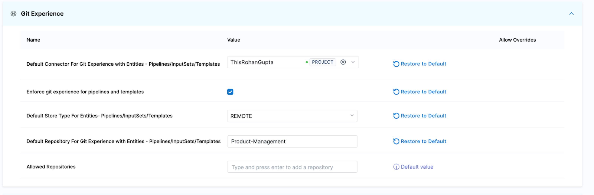

Harness Continuous Delivery (CD) has evolved to seamlessly integrate with modern DevOps tools, notably Git and Terraform. This article will guide you through backing up your Harness CD configurations to GitHub using the Harness Git Experience and Harness Terraform Provider.

To learn more, go to:
- [Harness Git Experience overview](/docs/platform/git-experience/git-experience-overview) 
- [Onboard with Terraform Provider](https://developer.harness.io/tutorials/platform/onboard-terraform-provider/)


## Harness Git Experience Setup

Harness Git Experience allows you to treat your CD configurations as code stored in a Git repository. When integrated with GitHub, every change made in the Harness platform can be version-controlled in a GitHub repository. In addition, with bidirectional sync enabled, you can have Git Experience sync two-way (bidirectionally) between Harness and your Git repo.

Harness Git Experience supports the following key entities:

- Pipeline
- Templates
- Input Sets 
- Governance Policies

To set up Harness Git Experience for backups, do the following:

1. **Create a GitHub repository:** If you haven't already, set up a dedicated repository in GitHub for your Harness configurations.
2. **Connect Harness with GitHub:**

   1. Please follow the steps in the [Harness Git Experience quickstart](https://developer.harness.io/docs/platform/git-experience/configure-git-experience-for-harness-entities).
3. **Sync configurations with GitHub:**

   1.  In Harness, enable Git Experience for your entities.
   2. Specify the GitHub repository, branch, and file paths for synchronization.

By navigating to your account/project settings, you can enforce that all Harness project pipelines, templates, and input sets are backed up in GitHub. 

  

You can organize the repo to look like this:

```
├── Pipeline
│   ├── dev_pipeline.yaml
│   ├── qa_pipeline.yaml
│   ├── prod_pipeline.yaml
├── Templates
│   ├── Step_Templates
│   │   ├── bash_job_step.yaml
│   ├── Stage_Templates
|   |   |-- deploy_stage.yaml
│   ├── Piprline_Templates
│   ├── Step_Group_Templates
├── Input Sets
|   |- Prod_Inputs.yaml
└── .gitignore
```


## Harness Terraform Provider Setup

The Harness Terraform Provider takes backup further by allowing you to define and manage Harness resources using Terraform. This enables an Infrastructure as Code (IaC) approach. 

You can manage the other Harness resources like connectors, secrets, projects, etc., via the Terraform Provider. 

Using this approach requires you to manage all resources and onboarding via Terraform. This is to ensure that the Terraform state file is the same as the Harness state. 

To set up the Harness Terraform Provider for backups, do the following:

1. Install the Harness Terraform Provider: Add the Harness provider to your Terraform configuration. For more information, go to the [Terraform Provider docs](https://registry.terraform.io/providers/harness/harness/latest/docs/resources/platform_pipeline).
   
   ```json
   terraform {
     required_providers {
       harness = {
         source = "harness/harness"
         version = "0.28.2"
       }
     }
   }

   provider "harness" {
     # Configuration options
   }
   ```
2. Define Harness Resources: Write Terraform configurations that describe your Harness resources. For instance, you can define an application in Harness as:

  ```json
  resource "harness_platform_pipeline" "example" {
    identifier = "identifier"
    org_id     = "orgIdentifier"
    project_id = "projectIdentifier"
    name       = "name"
    git_details {
      branch_name    = "branchName"
      commit_message = "commitMessage"
      file_path      = "filePath"
      connector_ref  = "connectorRef"
      store_type     = "REMOTE"
      repo_name      = "repoName"
    }

    yaml = <<-EOT
        pipeline:
            name: name
            identifier: identifier
            allowStageExecutions: false
            projectIdentifier: projectIdentifier
            orgIdentifier: orgIdentifier
            tags: {}
            stages:
                - stage:
                    name: dep
                    identifier: dep
                    description: ""
                    type: Deployment
                    spec:
                        serviceConfig:
                            serviceRef: service
                            serviceDefinition:
                                type: Kubernetes
                                spec:
                                    variables: []
                        infrastructure:
                            environmentRef: testenv
                            infrastructureDefinition:
                                type: KubernetesDirect
                                spec:
                                    connectorRef: testconf
                                    namespace: test
                                    releaseName: release-<+INFRA_KEY>
                            allowSimultaneousDeployments: false
                        execution:
                            steps:
                                - stepGroup:
                                        name: Canary Deployment
                                        identifier: canaryDepoyment
                                        steps:
                                            - step:
                                                name: Canary Deployment
                                                identifier: canaryDeployment
                                                type: K8sCanaryDeploy
                                                timeout: 10m
                                                spec:
                                                    instanceSelection:
                                                        type: Count
                                                        spec:
                                                            count: 1
                                                    skipDryRun: false
                                            - step:
                                                name: Canary Delete
                                                identifier: canaryDelete
                                                type: K8sCanaryDelete
                                                timeout: 10m
                                                spec: {}
                                        rollbackSteps:
                                            - step:
                                                name: Canary Delete
                                                identifier: rollbackCanaryDelete
                                                type: K8sCanaryDelete
                                                timeout: 10m
                                                spec: {}
                                - stepGroup:
                                        name: Primary Deployment
                                        identifier: primaryDepoyment
                                        steps:
                                            - step:
                                                name: Rolling Deployment
                                                identifier: rollingDeployment
                                                type: K8sRollingDeploy
                                                timeout: 10m
                                                spec:
                                                    skipDryRun: false
                                        rollbackSteps:
                                            - step:
                                                name: Rolling Rollback
                                                identifier: rollingRollback
                                                type: K8sRollingRollback
                                                timeout: 10m
                                                spec: {}
                            rollbackSteps: []
                    tags: {}
                    failureStrategies:
                        - onFailure:
                                errors:
                                    - AllErrors
                                action:
                                    type: StageRollback
    EOT
  }

  ```
1. Version control with GitHub: Push your Terraform configurations to your GitHub repository. Any change in the configurations can be tracked via git commits, pull requests, and more.
   
   Here's an example repo setup:

  ```
  ├── project
  |   |-- connectors
  │   |		├── connetor_k8s.tf
  │   |		|── connector_github.tf
  │   |		|── connector_docker.tf
  |   |--- secrets
  │   ├── ssh_secret_text
  │   │   ├── git_secret.tf
  │   ├── ssh_key
  |   |   |-- deploy_key.tf
  │   ├── 
  │   ├── pipelines
  ├	|--templates
  |   |- servies
  |	|- environments
  |	|- infrastructure_definition
  └── project.tf
  ```   


For more information follow our [Solutions Architecture Team’s repo](https://github.com/harness-community/solutions-architecture/tree/main/terraform-development-factory).


### Conclusion

Using a combination of Harness Git Experience and the Harness Terraform Provider, you can successfully back up your projects and resources and restore what was potentially lost. 

We recommend using the Git Experience to back up and save pipelines, templates, input sets, and policies.

You can use the Terraform Provider to manage services, environments, connectors and infrastructure definitions in Harness.

Harness CD integration with tools like Git and Terraform empowers DevOps teams to manage and back up configurations with efficiency and precision. By leveraging GitHub and the Harness Terraform Provider, you can adopt a robust version control and IaC strategy, ensuring that your CD processes are resilient, traceable, and restorable.
