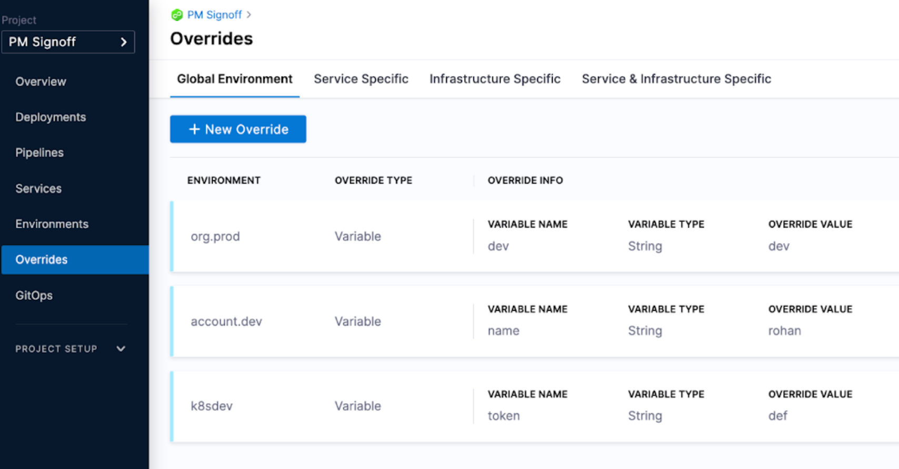

This topic provides some best practices to help with the management of input sets as their use increases.

[Input sets](/docs/platform/pipelines/input-sets) are collections of pipeline settings and parameters that are passed into a pipeline at runtime. [Runtime inputs](/docs/platform/variables-and-expressions/runtime-inputs) provide placeholders with the expectation that you'll define those values at runtime manually or using input sets. 

For example, if the pipeline deploys Kubernetes manifests, the input set could be the values.yaml used in the pipeline. 

Input Sets are a great way to also reduce manual input from developers and avoid human error.  

As you configure input sets for your pipelines there might be a lot of input set variations and the number of inputs needed to be filled out can increase. See the following practices for help with the management of input sets.

## Reduce the number of inputs needed for the input set

Evaluate what settings/parameters need to be exposed as runtime inputs. 

If some inputs are tied to when services are deployed to different environments, it can be helpful to use overrides. Overrides make the pipeline automatically compute these parameters based on the context of where the service is being deployed.

  

For more information, go to [Overrides](/docs/continuous-delivery/x-platform-cd-features/overrides-v2).

