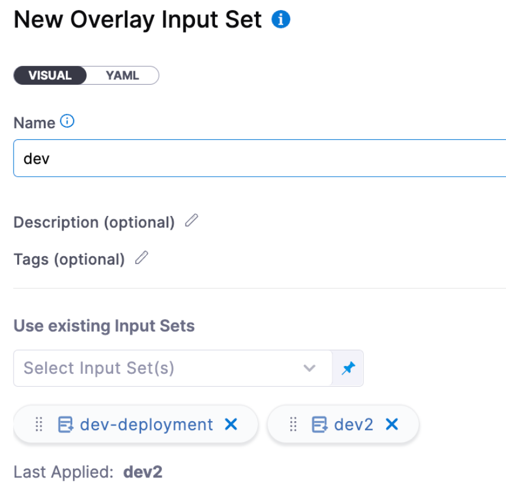
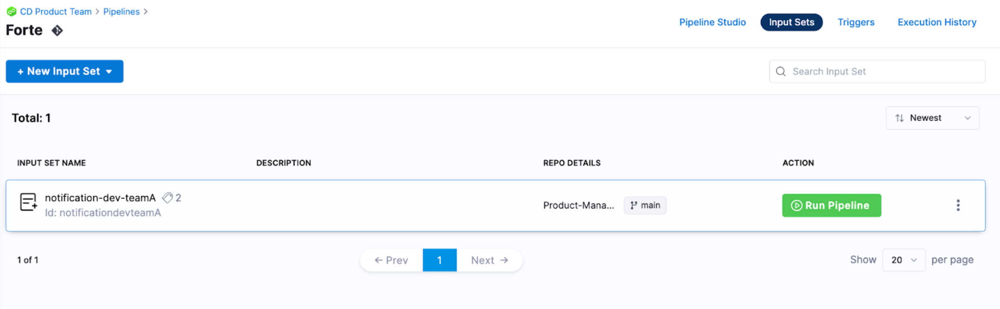
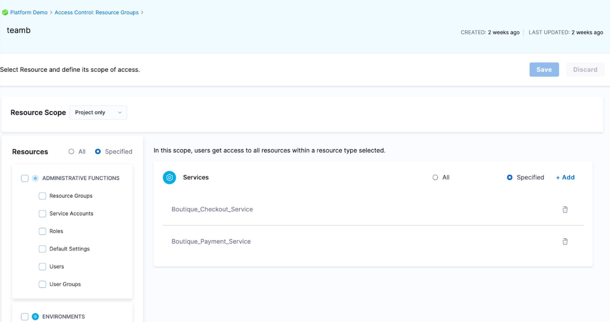

This topic provides some best practices to help with the management of input sets as their use increases.

[Input sets](/docs/platform/pipelines/input-sets) are collections of pipeline settings and parameters that are passed into a pipeline at runtime. [Runtime inputs](/docs/platform/variables-and-expressions/runtime-inputs) provide placeholders with the expectation that you'll define those values at runtime manually or using input sets. 

For example, if the pipeline deploys Kubernetes manifests, the input set could be the values.yaml used in the pipeline. 

Input Sets are a great way to also reduce manual input from developers and avoid human error.  

As you configure input sets for your pipelines there might be a lot of input set variations and the number of inputs needed to be filled out can increase. See the following practices for help with the management of input sets.

## Reduce the number of inputs needed for the input set

Evaluate what settings/parameters need to be exposed as runtime inputs. 

If some inputs are tied to when services are deployed to different environments, it can be helpful to use overrides. Overrides make the pipeline automatically compute these parameters based on the context of where the service is being deployed.

  

For more information, go to [Overrides](/docs/continuous-delivery/x-platform-cd-features/overrides-v2).

## Review what parameters are required

If some inputs can be fixed, this reduces the number of fields developer needs to fill out. In this scenario, you can configure a partially completed input set and then let developers enter only the inputs they need. 

## Overlays

You can combine multiple input sets into overlays. When you run the pipeline, you choose which input sets to use for that run. 

  

With overlays, you don't have to define every runtime input value in every input set, providing a flexible, "build-your-own" input set experience.

Overlays are a great way to manage groups of input sets. At runtime, users can provide an overlay input set to fill out all the pipeline configurations needed to be passed at runtime.

## Manage multiple input sets for a pipeline

Multiple teams might use the same pipeline to deploy their services. 

We have seen users have a generic pipeline that has numerous input sets per team. For example, in Harness, each team has 7 input sets, 1 per environment. 

Managing the input sets in Git allows users to audit and make changes via code. Every edit to an input set is done through a PR process where release leads can review the changes before approving them to be propagated to Harness. 

For more information on input sets in Git, go to [Harness Git Experience overview](/docs/platform/git-experience/git-experience-overview).

  

## Manage input set access

To manage access, we recommend using resource groups and roles. 

With resource groups, you can provide access control to the resources that the input set impacts, such as services, environments, and pipelines. 

You can allow users to execute the pipeline and access certain services and environments but remove their pipeline create/edit access to the pipeline. 

This access method ensures that changes are done through Git and reviewed as a PR. Developers also cannot run pipelines with input sets to resources they do not have access to.

  

For more information on resource groups, go to [Manage resource groups](/docs/platform/role-based-access-control/add-resource-groups).

