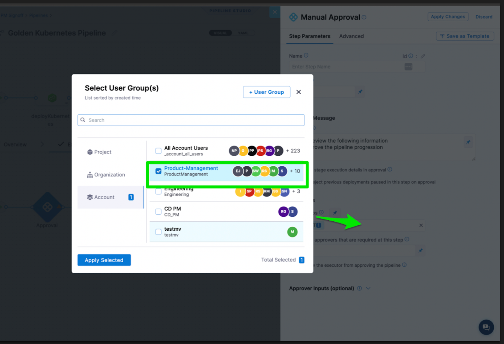
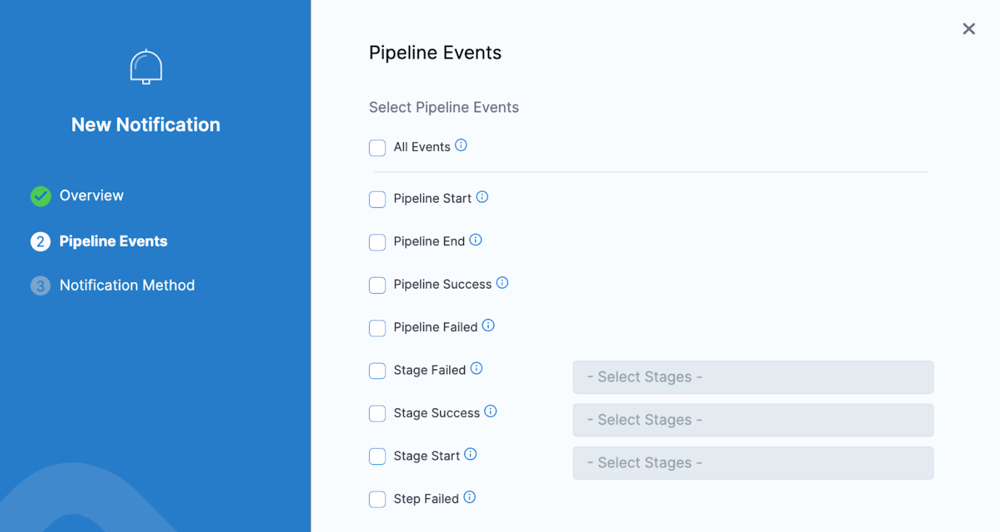
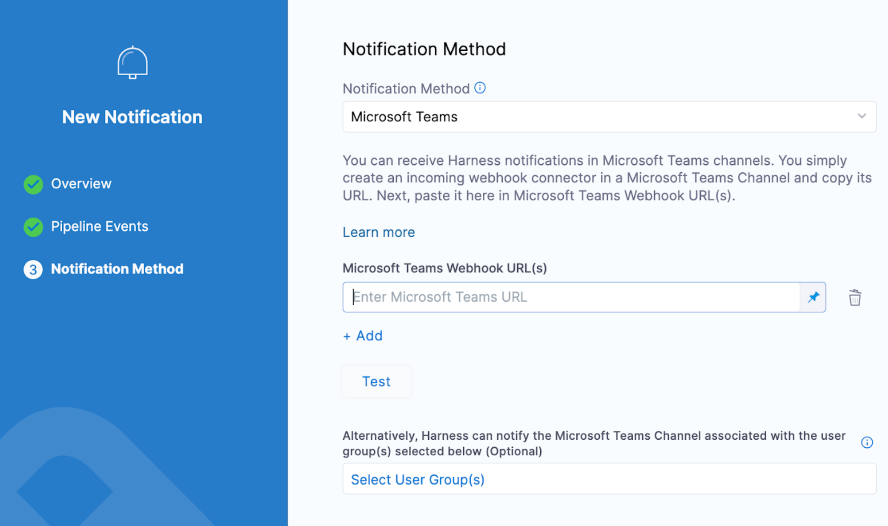

You can integrate your Harness User Group with Microsoft Teams and receive pipeline status updates and approval notifications in Teams channels.

Using MS Teams integration, developers can log into Harness and approve deployments.

Setup is a simple process of generating a Webhook in Microsoft Teams and adding it to a Harness User Group's Notification Preferences.

## Set up MS Teams pipeline approvals

There are three key steps to perform this task: 
- Configure a Harness user group.
- Configure your [user group notification preference](/docs/platform/role-based-access-control/add-user-groups/#edit-notification-preferences) using MS Teams.
- Configure [pipeline notifications](/docs/continuous-delivery/x-platform-cd-features/cd-steps/notify-users-of-pipeline-events/#microsoft-teams-notifications) using MS Teams.

To set up MS Teams pipeline approvals, do the following:

1. Configure a Harness user group.
   1. Harness user groups are one way Harness sends notifications to users. Harness users must be in a user group to receive notifications. You specify the notification method for each user group and all of the group's users are notified using the method you select.
   
   For information on configuring a user group, go to [Create user groups manually](/docs/platform/role-based-access-control/add-user-groups/#create-user-groups-manually).
2. Configure user group notification.
   1. Harness sends notifications based off two configurations, the user group and pipeline notifications. When you configure a user group, you can select the notification method. If you select Microsoft Teams, notifications for approvals will go to the teams channel configured for a particular user group. 
   
   For information on configuring a notification channel for the user group, go to [Edit notification preferences](/docs/platform/role-based-access-control/add-user-groups/#edit-notification-preferences).
3. Configure the approval step in your pipeline.
   1. Configure a Harness Manual Approval step using the user group with the MS teams notification channel configured.
   
   When you configure the Approval step in your pipeline, you add the user group to the list of approvers.
   
   When the pipeline execution reaches the Approval step, Harness will send a message to a user group that there is a pending approval. In MS Teams, you will receive a URL taking you to the pipeline to approve it.

  

For more information on Manual Approvals in a CD or Approval stage, go to [Using manual Harness approval steps in CD stages](/docs/continuous-delivery/x-platform-cd-features/cd-steps/approvals/using-harness-approval-steps-in-cd-stages).

## (Optional) Add more notifications to the channel

If you want to send more notifications to your MS Teams channel, you can configure pipeline notifications based on specific events.

  

You can specify a specific MS Teams channel or assign a user group to receive the notification.

  

