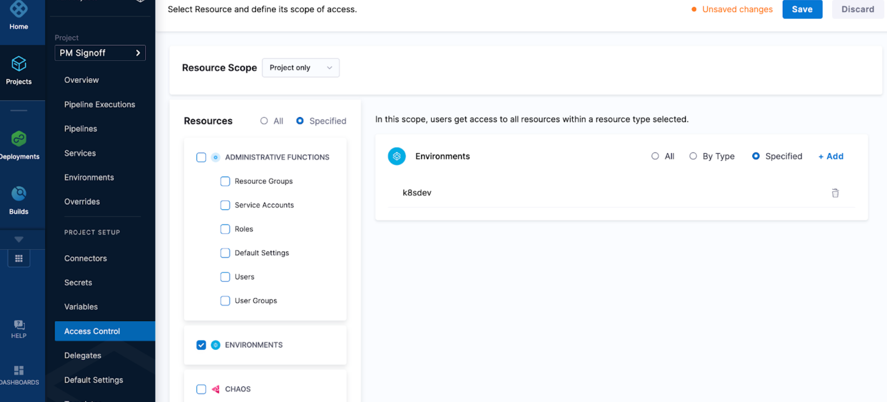
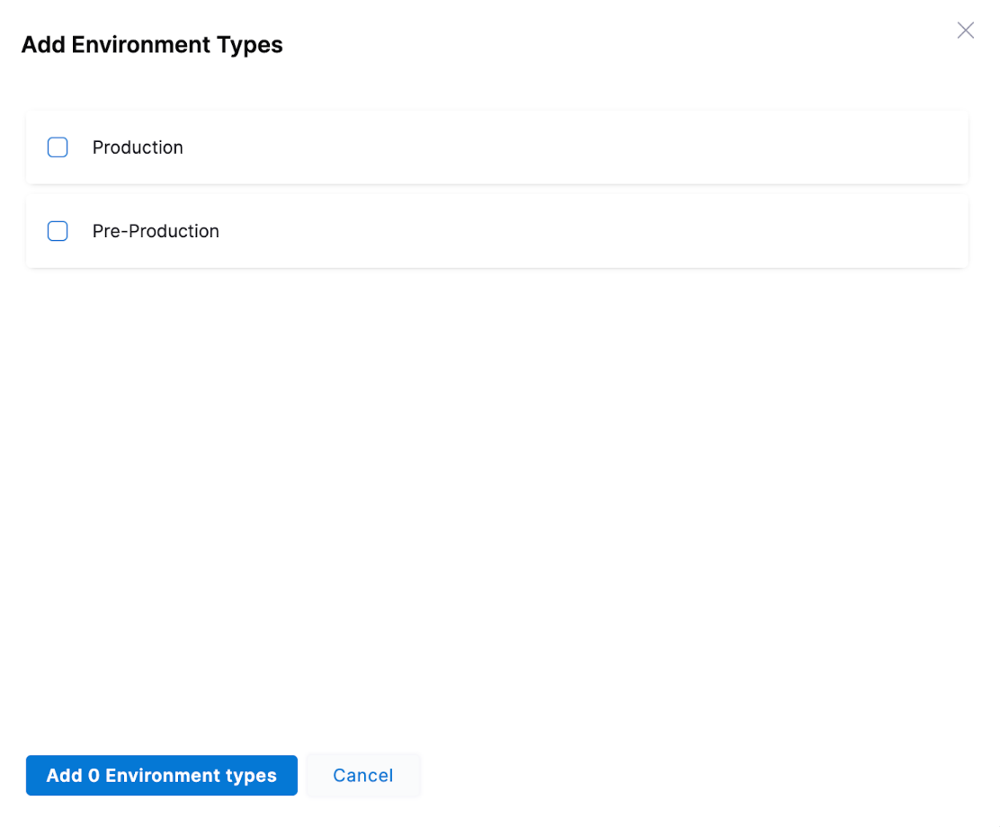
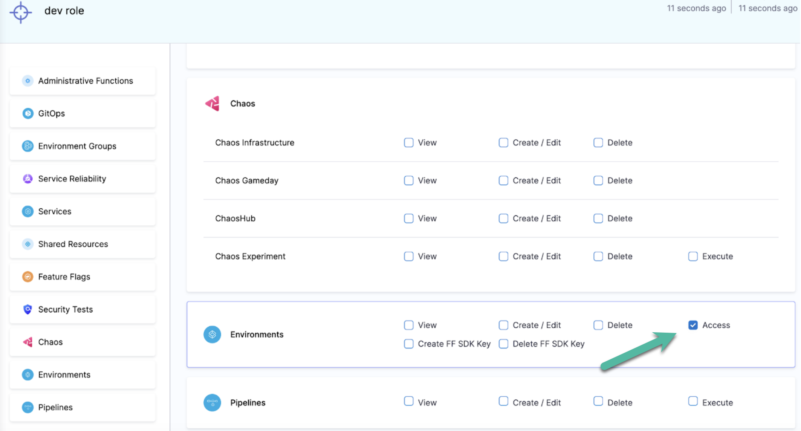
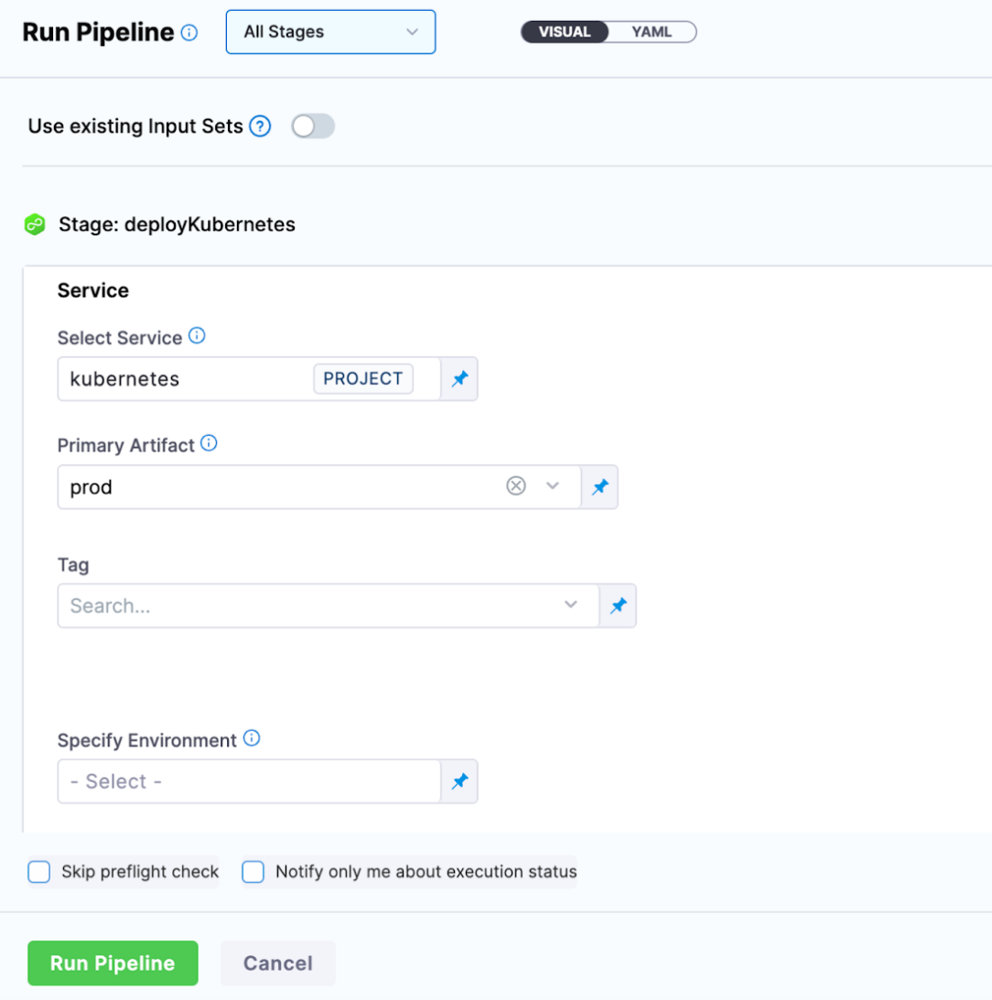
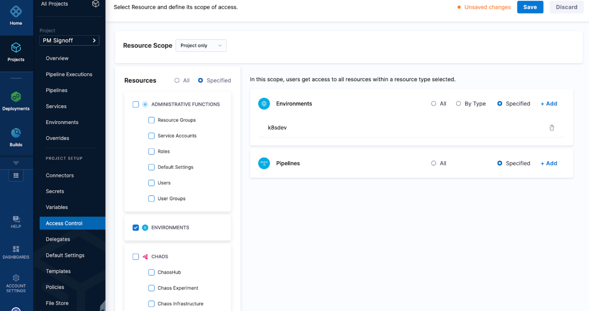
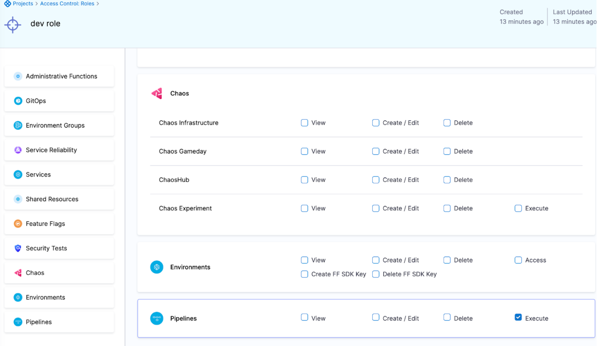
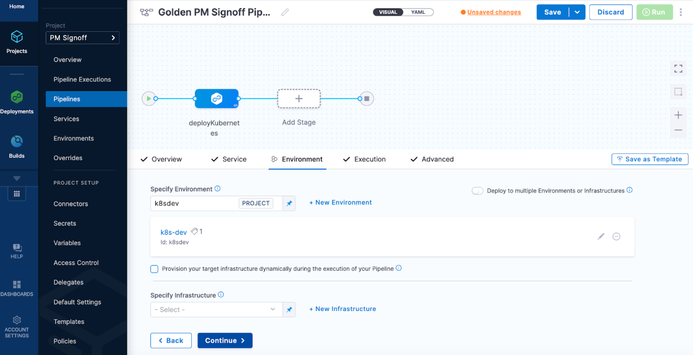
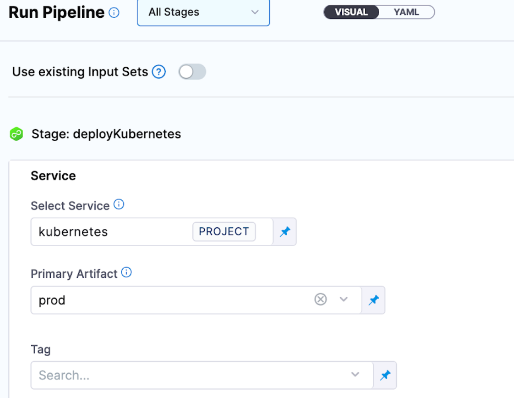

There are scenarios where you want to control which environments devs can access for deployments:

- Harness administrators do not want application teams to deploy to higher level environments.
- A team uses one pipeline to deploy to multiple environments because it keeps their configuration dry and reusable. They want the way they deploy to production to be similar to their lower environments.

There are a couple solutions you can use to support these scenarios.

## Resource groups and roles

Resource Groups and RBAC manage who has access to Harness resources. You can configure a resource group that only grants access to specific environments. This means that the role configured with that resource group will only have permissions to access that particular resource.

You can navigate to a resource groups and specify what actual resources a user has access to.

You can select resources by **Type** or **Specified**.

**Specified** lets you pick the specific environments users have access to.

  


**Type** lets you pick the environment type.

  

In **Roles Configuration**, you can configure the specific permissions for a user in the environments you selected.

  

The options are:
- **View**: Users can see the environment in the Harness UI.
- **Create/Edit**: Users can create new environments and edit existing environments.
- **Delete**: Users can delete the environment.
- **Access**: Users can select the environment for deployment at runtime.

If you have a pipeline that has its service and environments templated, you can now enforce what environment parameters the user has access to at runtime.

  

<details>
<summary>Sample pipeline YAML</summary>

```yaml
pipeline:
  name: Golden PM Signoff Pipeline
  identifier: Golden_PM_Signoff_Pipeline
  projectIdentifier: PM_Signoff
  orgIdentifier: default
  tags: {}
  stages:
    - stage:
        name: deployKubernetes
        identifier: Deploy_Kubernetes
        description: ""
        type: Deployment
        spec:
          deploymentType: Kubernetes
          service:
            serviceRef: <+input>
            serviceInputs: <+input>
          execution:
            steps:
              - step:
                  type: K8sDryRun
                  name: Dry Run
                  identifier: Dry_Run
                  spec: {}
                  timeout: 10m
              - step:
                  type: HarnessApproval
                  name: Approval
                  identifier: Approval
                  spec:
                    approvalMessage: Please review the following information and approve the pipeline progression
                    includePipelineExecutionHistory: true
                    isAutoRejectEnabled: false
                    approvers:
                      userGroups:
                        - account._account_all_users
                      minimumCount: 1
                      disallowPipelineExecutor: false
                    approverInputs: []
                  timeout: 1d
              - step:
                  type: K8sRollingDeploy
                  name: Rolling Deployment
                  identifier: RRolling_Deployment
                  spec:
                    skipDryRun: false
                    pruningEnabled: false
                  timeout: 10m
              - step:
                  type: K8sDelete
                  name: Cleanup
                  identifier: Cleanup
                  spec:
                    deleteResources:
                      type: ReleaseName
                      spec:
                        deleteNamespace: false
                  timeout: 10m
            rollbackSteps:
              - step:
                  name: Rollback Rollout Deployment
                  identifier: rollbackRolloutDeployment
                  type: K8sRollingRollback
                  timeout: 10m
                  spec:
                    pruningEnabled: false
          environment:
            environmentRef: <+input>
            deployToAll: false
            environmentInputs: <+input>
            serviceOverrideInputs: <+input>
            infrastructureDefinitions: <+input>
        tags: {}
        failureStrategies:
          - onFailure:
              errors:
                - PolicyEvaluationFailure
              action:
                type: MarkAsSuccess
          - onFailure:
              errors:
                - AllErrors
              action:
                type: StageRollback
        when:
          pipelineStatus: Success
  allowStageExecutions: true
```

</details>


## Separate pipelines and resource groups via RBAC

Using the Resource Group construct, you can specify the pipelines you want to grant developers access to.

  

In **Roles**, you can configure **execute** for the the pipeline resource.

  

**Execute** grants permissions to run the pipeline.

The pipeline design is now impacted because you are forcing the pipeline environment as fixed. In this example, devs can only access the pipeline that deploys to **dev**.

  

At pipeline runtime, devs only need to select a service.

  


