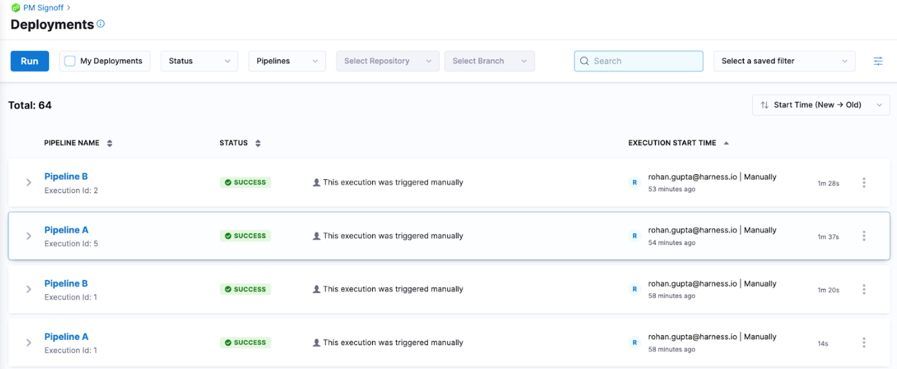
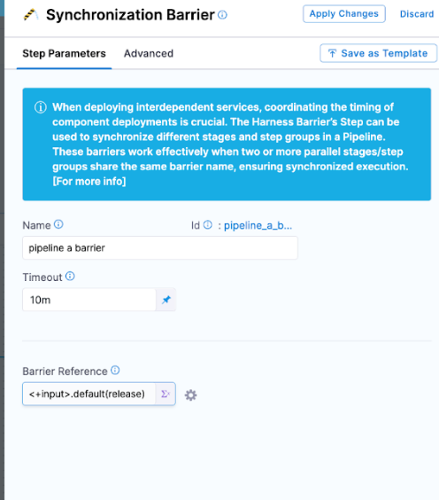
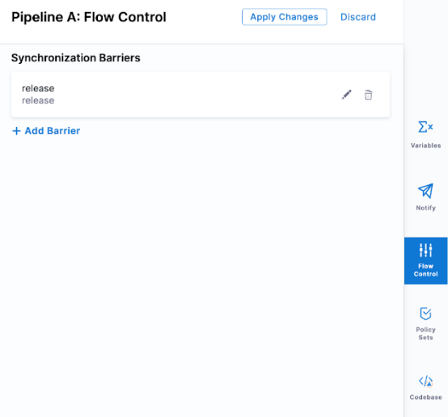
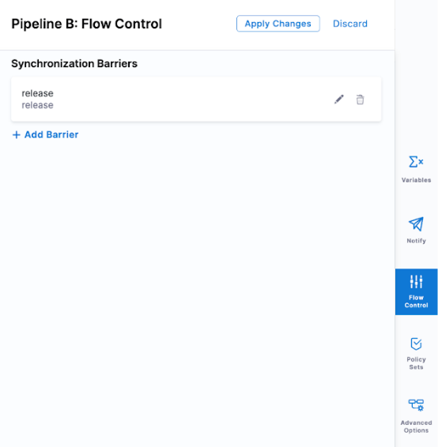

This topic describes how to use barriers to synchronize different pipeline stages.

When deploying interdependent services, such as microservices or a large and complicated application, there might be a need to coordinate the timing of the different components' deployments. A common example is the need to verify a group of services only after all the services are deployed successfully.

Harness addresses this scenario using Barriers. Barriers allow you to synchronize different stages and step groups in your pipeline, and control the flow of your deployment systematically.

Barrier steps are a powerful flow control capability that lets you gate pipeline executions until a certain criteria is met. Barriers are useful in managing and sequencing out service deployments within the same pipeline or in separate pipelines in a given project. 

Barriers can be configured in any stage or step of the pipeline. Barriers use an identifier (a key) that links barrier steps and pipelines together. Using the Id, barriers become contextually aware of one another’s progress and wait till all pipelines reach a certain barrier and key before continuing with further steps. 

Barriers are used in the following scenarios: 

1. Barriers are used in different parallel stages in the same pipeline.
2. Barriers are used different pipelines within the same project.

For more information on barriers, go to [Synchronize parallel stages and step groups using Barriers](/docs/continuous-delivery/x-platform-cd-features/cd-steps/flow-control/synchronize-deployments-using-barriers).

## Set up barriers using two pipelines

In this example, two pipelines, A and B, are used to demonstrate barriers.

  

### Add the Barrier step in a stage template

This example uses a stage template with two Shell Script steps and a Barrier step. The Barrier step has an Id named `release`. 

The Id ensures that when the pipeline executes and reaches the Barrier step, Harness looks for other Barriers steps with the same Id. If there are no Barrier steps with the Id `release` are found, the pipeline will wait and eventually timeout. 

Here is the Barrier step configuration in the stage template.

  

A runtime input with the default parameter `<+input>.default(release)` is used to ensure there is always an Id set to connect stages and pipelines together.

<details>
<summary>Example stage template YAML</summary>

```yaml
template:
  name: Barrier Demo
  type: Stage
  projectIdentifier: default
  orgIdentifier: default
  spec:
    type: Custom
    spec:
      execution:
        steps:
          - step:
              type: ShellScript
              name: Hello
              identifier: Hello
              spec:
                shell: Bash
                onDelegate: true
                source:
                  type: Inline
                  spec:
                    script: echo "Hello"
                environmentVariables: []
                outputVariables: []
              timeout: 10m
          - step:
              type: Barrier
              name: pipeline a barrier
              identifier: pipeline_a_barrier
              spec:
                barrierRef: <+input>.default(release)
              timeout: 10m
          - step:
              type: ShellScript
              name: Done
              identifier: Done
              spec:
                shell: Bash
                onDelegate: true
                source:
                  type: Inline
                  spec:
                    script: echo "Everyone completed the barrier!"
                environmentVariables: []
                outputVariables: []
              timeout: 10m
          - step:
              type: ShellScript
              name: Failure
              identifier: Failure
              spec:
                shell: Bash
                onDelegate: true
                source:
                  type: Inline
                  spec:
                    script: echo "We failed to reach the barrier"
                environmentVariables: []
                outputVariables: []
              when:
                stageStatus: Failure
              timeout: 10m
  identifier: Barrier_Demo
  versionLabel: "1.0"
```
</details>

## Add the stage template to the pipelines

Next, we can add these stage templates to both pipelines A and B by referencing them (`templateRef: Barrier_Demo`).

<details>
<summary>YAML for pipelines A and B</summary>

Pipeline A:

```yaml
pipeline:
  name: Pipeline A
  identifier: Pipeline_A
  projectIdentifier: PM_Signoff
  orgIdentifier: default
  tags: {}
  stages:
    - stage:
        name: deploy
        identifier: deploy
        template:
          templateRef: Barrier_Demo
          versionLabel: "1.0"
          templateInputs:
            type: Custom
            spec:
              execution:
                steps:
                  - step:
                      identifier: pipeline_a_barrier
                      type: Barrier
                      spec:
                        barrierRef: <+input>.default(release)
  flowControl:
    barriers:
      - name: release
        identifier: release
```

Pipeline B:

```yaml
pipeline:
  name: Pipeline B
  identifier: Pipeline_B
  projectIdentifier: PM_Signoff
  orgIdentifier: default
  tags: {}
  flowControl:
    barriers:
      - name: release
        identifier: release
  stages:
    - stage:
        name: deploy
        identifier: deploy
        template:
          templateRef: Barrier_Demo
          versionLabel: "1.0"
          templateInputs:
            type: Custom
            spec:
              execution:
                steps:
                  - step:
                      identifier: pipeline_a_barrier
                      type: Barrier
                      spec:
                        barrierRef: <+input>.default(release)
```

</details>

## Add the barrier key to the pipeline

In each pipeline, navigate to Flow Control and configure a barrier key. This key links the pipelines together. 

Pipeline A:

  


Pipeline B:

  

## Run the pipelines

Run pipeline A first and then pipeline B immediately after. 

When you run pipeline A, it will execute the Shell Script step echo command and then wait. The barrier will release when pipeline B executes the Shell Script step and also arrives at the barrier. 

Pipeline A will release and progress forward with the execution, pipeline B will continue to execute as it was the pipeline that was being waited on.


