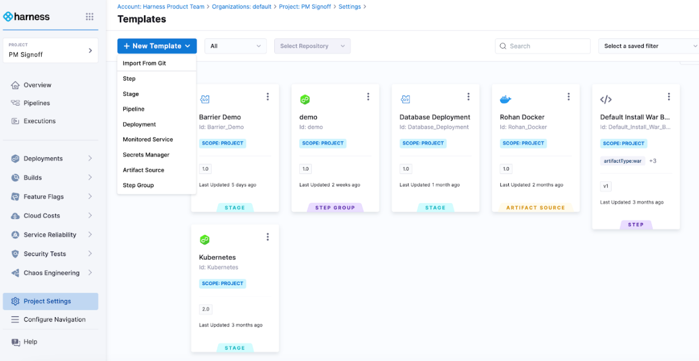
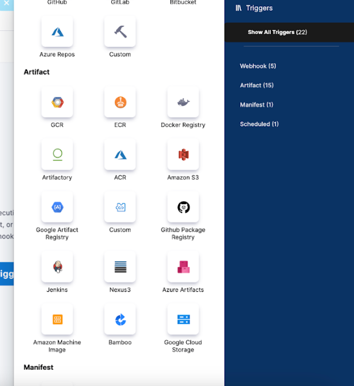
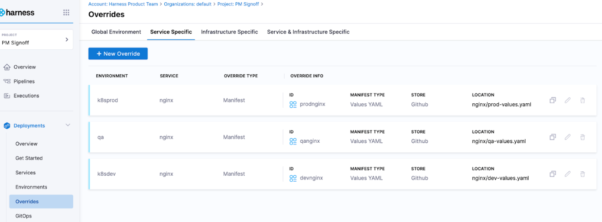

Many organizations start their CI/CD journey with Jenkins due to its open source nature and vast plugin ecosystem. However, as they scale, the need for a more streamlined, manageable, and automated solution becomes apparent. 

That’s where Harness Continuous Delivery comes into play with its intelligent automation capabilities and a abundance of built-in features, making the migration a logical step forward.

In the guide we will cover various topics to ensure a smooth migration from Jenkins to Harness:

1. **Preparation Steps:** Understanding the existing Jenkins setup, identifying the components to be migrated, and preparing the environment in Harness CD.

2. **Migration Process:** A step-by-step guide on migrating pipelines, configurations, and other assets from Jenkins to Harness CD.

3. **Verification and Testing:** Ensuring that the migrated setups work as expected in the new environment.

4. **Optimization:** Utilizing Harness features to optimize the CI/CD workflows further.

5. **Training and Documentation:** Ensuring that the team is well trained on Harness and creating documentation for the new CI/CD workflows.


## Preparation Steps

When beginning migration from Jenkins to Harness, we recommend targeting migration based on the application teams you want to enable on Harness CD. Based of the applications picked, you can identify specific patterns and environments you wish to migrate first.

**Key Questions to answer:**

- Which applications do we wish to migrate?
- How many pipelines do these application teams have?
- Are there common pipelines that apply to all these applications? 
- Which environments do we want to target first for migration?
- What are the supplemental tools (GitHub, Bitbucket, PagerDuty, etc.) that these application teams use in their deployments? 

**Recommendations:**

- Target the lower environments first (dev, qa, uat, etc.).
- Pick applications that are not business critical in order to quickly iterate and deploy with low risk.
- Pick app teams that have similar pipelines. This choice allows you to validate more application teams' pipelines and processes at the same time, reducing future efforts in migration

**Setting up the Infrastructure:**

- Harness doesn’t use workers and primary nodes to orchestrate jobs. The benefit of Harness is that there is no node management needed. Harness requires an agent, called the delegate, to be installed on the target deployment environment and infrastructure. 
- Based on your modeling, you can have a fleet of delegates manage and connect to numerous environments to perform deployment.
- Delegates do not need to be deployed to each target cluster or host for deployment. The delegate can access from a central location.

For more information on delegate, go to [Delegate Overview](/docs/platform/delegates/delegate-concepts/delegate-overview). 


## Migration process

### Sample Jenkins deployment setup

In the scenario provided, the `Jenkinsfile` is built to handle deployment to three different environments: dev, qa, and prod. This example assumes that you have a Dockerized NGINX setup and a Kubernetes cluster for each environment. Each environment will have its own K8s configuration file (`k8s-config-dev.yaml`, `k8s-config-qa.yaml`, `k8s-config-prod.yaml`).

```python
groovy
pipeline {
    agent any

    stages {
        stage('Checkout') {
            steps {
                checkout scm
            }
        }

        stage('Build Docker Image') {
            steps {
                script {
                    def appImage = docker.build('nginx-image')
                }
            }
        }

        stage('Push Docker Image') {
            steps {
                script {
                    docker.withRegistry('https://registry.example.com', 'docker-registry-credentials-id') {
                        appImage.push("${env.BUILD_NUMBER}")
                        appImage.push("latest")
                    }
                }
            }
        }

        stage('Deploy to Dev') {
            steps {
                script {
                    withKubeConfig([credentialsId: 'kubeconfig-dev', serverUrl: 'https://dev-k8s-cluster.example.com']) {
                        sh 'kubectl apply -f k8s-config-dev.yaml'
                    }
                }
            }
        }

        stage('Deploy to QA') {
            when {
                expression { currentBuild.resultIsBetterOrEqualTo('SUCCESS') }
            }
            steps {
                script {
                    withKubeConfig([credentialsId: 'kubeconfig-qa', serverUrl: 'https://qa-k8s-cluster.example.com']) {
                        sh 'kubectl apply -f k8s-config-qa.yaml'
                    }
                }
            }
        }

        stage('Deploy to Prod') {
            when {
                expression { currentBuild.resultIsBetterOrEqualTo('SUCCESS') }
            }
            steps {
                script {
                    withKubeConfig([credentialsId: 'kubeconfig-prod', serverUrl: 'https://prod-k8s-cluster.example.com']) {
                        sh 'kubectl apply -f k8s-config-prod.yaml'
                    }
                }
            }
        }
    }
}
```

Explanation of the **Jenkinsfile**:

1. The **Checkout** stage pulls the latest code from your source control management system.
2. The **Build Docker Image** stage creates a Docker image of your NGINX setup.
3. The **Push Docker Image** stage pushes the Docker image to a Docker registry.
4. The **_Deploy to Dev_**, **_Deploy to QA_**, and **_Deploy to Prod_** stages deploy the NGINX setup to the respective Kubernetes clusters using **kubectl apply**. 
   - Note that **withKubeConfig** is a hypothetical step to demonstrate the use of different kubeconfigs or credentials for different clusters/environments. You might need to adjust this to match your actual Jenkins and Kubernetes setup.
   -  We use the **when** directive to only proceed with QA and Prod deployments if the previous stages were successful. This helps prevent potentially broken deployments from reaching these environments.

## Converting to Harness CD

The following Harness CD pipeline is designed to perform the same Build and Deployment of Nginx across the Dev, Qa, and Prod environments.

```yaml
pipeline:
  name: Harness CD
  identifier: Harness_CD
  projectIdentifier: default
  orgIdentifier: default
  tags: {}
  stages:
    - stage:
        name: Build
        identifier: Build
        description: ""
        type: CI
        spec:
          cloneCodebase: true
          infrastructure:
            type: KubernetesDirect
            spec:
              connectorRef: account.Harness_Kubernetes_Cluster
              namespace: build
              automountServiceAccountToken: true
              nodeSelector: {}
              os: Linux
          execution:
            steps:
              - step:
                  type: BuildAndPushDockerRegistry
                  name: "Build And Push Docker Registry "
                  identifier: Build_And_Push_Docker_Registry
                  spec:
                    connectorRef: account.harnessImage
                    repo: harness/nginx
                    tags:
                      - latest
    - stage:
        name: Deploy To Dev
        identifier: Deploy_To_Dev
        description: "Deploy NGINX Service to Dev Environment"
        type: Deployment
        spec:
          deploymentType: Kubernetes
          service:
            serviceRef: nginx
          environment:
            environmentRef: k8sdev
            deployToAll: false
            infrastructureDefinitions:
              - identifier: dev
                inputs:
                  identifier: dev
                  type: KubernetesDirect
                  spec:
                    namespace: <+input>
          execution:
            steps:
              - step:
                  name: Rollout Deployment
                  identifier: rolloutDeployment
                  type: K8sRollingDeploy
                  timeout: 10m
                  spec:
                    skipDryRun: false
                    pruningEnabled: false
            rollbackSteps:
              - step:
                  name: Rollback Rollout Deployment
                  identifier: rollbackRolloutDeployment
                  type: K8sRollingRollback
                  timeout: 10m
                  spec:
                    pruningEnabled: false
        tags: {}
        failureStrategies:
          - onFailure:
              errors:
                - AllErrors
              action:
                type: StageRollback
    - stage:
        name: Deploy to QA
        identifier: Deploy_to_QA
        description: "Deploy NGINX Service to QA Environment"
        type: Deployment
        spec:
          deploymentType: Kubernetes
          service:
            useFromStage:
              stage: Deploy_To_Dev
          execution:
            steps:
              - step:
                  name: Rollout Deployment
                  identifier: rolloutDeployment
                  type: K8sRollingDeploy
                  timeout: 10m
                  spec:
                    skipDryRun: false
                    pruningEnabled: false
            rollbackSteps:
              - step:
                  name: Rollback Rollout Deployment
                  identifier: rollbackRolloutDeployment
                  type: K8sRollingRollback
                  timeout: 10m
                  spec:
                    pruningEnabled: false
          environment:
            environmentRef: qa
            deployToAll: false
            infrastructureDefinitions: <+input>
        tags: {}
        failureStrategies:
          - onFailure:
              errors:
                - AllErrors
              action:
                type: StageRollback
    - stage:
        name: Deploy to Prod
        identifier: Deploy_to_Prod
        description: "Deploy NGINX Service to Prod Environment"
        type: Deployment
        spec:
          deploymentType: Kubernetes
          service:
            useFromStage:
              stage: Deploy_To_Dev
          execution:
            steps:
              - step:
                  name: Rollout Deployment
                  identifier: rolloutDeployment
                  type: K8sRollingDeploy
                  timeout: 10m
                  spec:
                    skipDryRun: false
                    pruningEnabled: false
            rollbackSteps:
              - step:
                  name: Rollback Rollout Deployment
                  identifier: rollbackRolloutDeployment
                  type: K8sRollingRollback
                  timeout: 10m
                  spec:
                    pruningEnabled: false
          environment:
            environmentRef: k8sprod
            deployToAll: false
            infrastructureDefinitions:
              - identifier: prod
        tags: {}
        failureStrategies:
          - onFailure:
              errors:
                - AllErrors
              action:
                type: StageRollback
  properties:
    ci:
      codebase:
        connectorRef: <+input>
        repoName: <+input>
        build: <+input>
```

Explanation of the **Harness CD pipeline.yaml**:

1. The **Build** stage:
   * Pulls the latest code from your source control management system at the start of stage execution.
   * The ****Build and Push Docker Step creates a Docker image of your NGINX setup and pushes the Docker image to a Docker registry.
2. The **Deploy to Dev stage:**
   * Harness will fetch, from your source repo, the nginx manifest yaml and deploy it to the dev environment. If the nginx manifest has go templating syntax, Harness associate a values.yaml per environment along with the base nginx manifest. Alternatively, Harness can deploy the nginx.yaml based on the environment. 
   * Harness will perform a Rolling Deployment which performs the **kubectl apply -f nginx.yaml** to the target environment and kubernetes cluster’s namespace.
   * In case of deployment failure, Harness will automatically perform rollback to the previous version / revision of the application. 
3. The **Deploy to QA Stage:**
   * Harness will deploy the nginx service defined and used in the dev stage (previous stage) and will fetch the qa values.yaml for deployment
   * Harness will again do the same rolling deployment to deploy the service.
   * Rollback is already configured by default in case of failure
4. The **Deploy to Prod Stage:**
   * Harness will deploy the nginx service defined and used in the prod stage (1st stage) and will fetch the prod values.yaml for deployment
   * Harness will again do the same rolling deployment to deploy the service.
   * Rollback is already configured by default in case of failure


### What is a Service?

Services represent your microservices and other workloads. For more information, go to [Create Services](/docs/continuous-delivery/x-platform-cd-features/services/create-services).

```yaml
service:
  name: nginx
  identifier: nginx
  serviceDefinition:
    type: Kubernetes
    spec:
      manifests:
        - manifest:
            identifier: nginx
            type: K8sManifest
            spec:
              store:
                type: Harness
                spec:
                  files:
                    - /deployment.yaml
                    - /namespace.yaml
                    - /service.yaml
              valuesPaths:
                - /values_nginx_<+env.name>.yaml

              skipResourceVersioning: false
              enableDeclarativeRollback: false
  gitOpsEnabled: false
```

### What is an Environment?

Environments represent your deployment targets (QA, Prod, etc). For more information, go to [Create Environments](/docs/continuous-delivery/x-platform-cd-features/environments/create-environments). 

### What is an Infrastructure Definition?

Infrastructure definitions represent an environment's infrastructures physically. They are the actual clusters, hosts, namespaces, etc., where you are deploying a service. For more information, go to [Add Infrastructure Definitions](/docs/continuous-delivery/x-platform-cd-features/environments/create-environments/#add-infrastructure-definitions).

## Verification and testing

- After onboarding and successfully deploying your application with Harness, it’s important to start **planning a cutover** from Jenkins to Harness.
- Users should **validate each of their application and ensure they are behaving properly** in each environment. Post validation, the team should plan to cut access to the Jenkins Pipeline.
- The team driving Harness adoption should **make internal announcements and timelines** to ensure that teams test their pipelines in a timely manner and **plan to cutover and only use Harness for deployments**.
- **Deprecate any triggers** that application teams are using to trigger their Jenkins deployments.

## Optimization

- **Using Templates:** Templates can help you reduce the number of stages, steps, or pipelines you need to define. You can reference templates to reuse and share similar configuration across various pipelines. For more information, go to [Templates](/docs/platform/templates/template).
  
    
- **On Artifact Triggers:** Triggers help automate application deployments. With triggers, you can decouple your build process from your deployment process. Once the code is built and a specific tag is published, the artifact can be polled and used to trigger CD pipeline deployments. For more information, go to [Trigger on a new Artifact](/docs/platform/triggers/trigger-on-a-new-artifact).
  
    
- **Using Overrides:** You can use overrides to define environment variables and override them at particular environments. Overrides let your manifests reference one variable and Harness can override and provide the correct value in a given environment context.  For more information, go to [Overrides](https://developer.harness.io/docs/continuous-delivery/x-platform-cd-features/overrides-v2).
  
    


## Training and Documentation

All Harness documentation can be found at [https://developer.harness.io](https://developer.harness.io). The Developer Hub is for all Harness developers to get content, training, and guidance on the platform and information on new features and releases.

1. Orientation session
   - [Harness CD Key Concepts](/docs/continuous-delivery/get-started/key-concepts) 
   - [CD Pipeline Modeling Overview](/docs/continuous-delivery/get-started/cd-pipeline-modeling-overview)
2. Technical Training
   - [Tutorials](https://developer.harness.io/tutorials/cd-pipelines). Harness offers a wide variety of tutorials to help users get started.
   - [Certifications](https://developer.harness.io/certifications/continuous-delivery/). Harness has certifications to help train and certify your developers with Harness CD.
3. Ramp Up Guides.
   * [New users](https://developer.harness.io/docs/category/new-users)
   * [Existing users](https://developer.harness.io/docs/category/existing-users)


