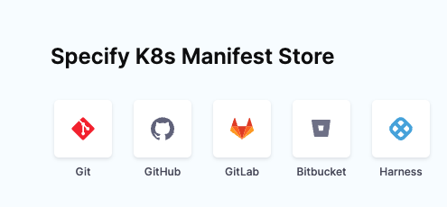
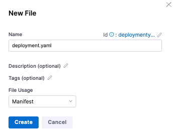
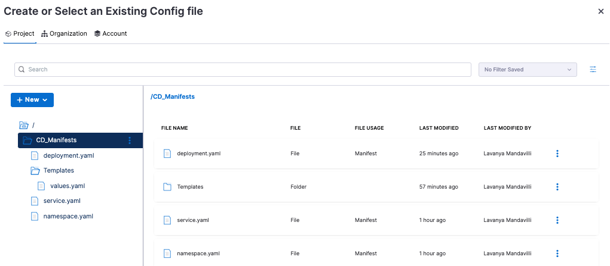
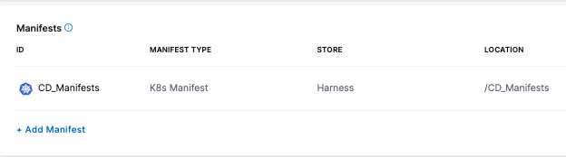

You can use Kubernetes manifests and other configuration files in Git repos or in the Harness File Store. If you use a Git repo, Harness fetches files from the remote repo during deployment runtime.

If you use the Harness File Store, you can store files in Harness and select them in your Services. At deployment runtime, Harness simply uses the files from the Harness File Store.

File Store lets you share files with your team without managing remote repos.

For Kubernetes, the following configuration files are supported for File Store:

* Kubernetes Manifest
* Helm Chart
* OpenShift Template and OpenShift Param
* Kustomize and Kustomize Patches

Other configuration files for other integrations, such as Azure Web Apps, etc, are supported as those integrations are released.You can access File Store from **Project Setup** in Harness or via the **Add Manifest** step during Pipeline creation.

Before You Begin

* [Kubernetes CD Quickstart](../../onboard-cd/cd-quickstarts/kubernetes-cd-quickstart.md)
* [Kubernetes Deployments Overview](../../cd-advanced/cd-kubernetes-category/kubernetes-deployments-overview.md)
* [Add Kubernetes Manifests](../../cd-advanced/cd-kubernetes-category/define-kubernetes-manifests.md)
* [Add Container Images as Artifacts for Kubernetes Deployments](../../cd-advanced/cd-kubernetes-category/add-artifacts-for-kubernetes-deployments.md)

## Review: File Store

File Store is a hierarchical file manager in Harness for managing configuration files used in Pipelines.

With File Store, you can perform all of the standard file manager tasks:

* Create and edit folders and files at the Account, Organization, or Project level.
* Upload existing configuration files from your machine to a folder in File Store.
* Select configuration files or folders for deployments.

You can use a combination of File Store and remote repos for your configuration files. You aren't limited to one method. 

## Requirements

* File Store requires the Account Admin role for Read/Write access to modify folders and files. The Account Viewer role allows you to view folders and files.

## Limitations

* You can upload only a single file into the File Store folder. Support for uploading multiple configuration files concurrently is not available.
* The maximum file size cannot exceed 100MB.

## Start a Pipeline

This topic assumes that you have a Harness Project set up. See Create Organizations and Projects.

1. In Harness Manager, select Pipelines and click **New Pipeline**.
2. Enter a name in **Create new Pipeline** and click **Start**.

## Add a Deploy Stage

For steps on adding a stage, see Add a Stage.

1. Click **Add Stage** and select **Deploy**.
2. Name the stage, and select what you’d like to deploy. For example, select **Service**.
3. Click **Set Up Stage**. The new stage settings appear.

## Create the Harness Service

In Service, you can define or select the Service and Service Definition.

1. In **Specify Service**, click **New Service** and enter a name for this service and click **Save**.
2. Select a **K8s** Service or create a new Service for **K8s**.
3. For **Service Definition**, select **Kubernetes**.

To add your manifests, go to **Manifests** in the Service Definition.

## Add Kubernetes Manifests and Values YAML to File Store

You can create folders in File Store, add manifests to those folder, and Harness will use them at runtime. 

Let’s create a new folder called CD\_Manifests for three manifests (deployment.yaml, service.yaml, and namespace.yaml) and a folder named Templates for the values.yaml file. In the blank file that appears for each of these manifests in File Store, we can copy the contents of a sample manifest file into each of these blank files and save them in File Store.

Note: You can create a single folder and save all of the manifest files in that folder. Or you can store the values.yaml file in a folder that is separate from a Templates folder where the deployment.yaml, service.yaml, and namespace.yaml files are stored.

You can access sample manifest files at:

1. In Manifests, click **Add Manifest**.
2. In **Specify Manifest Type**, select **K8s Manifest** and then click **Continue**.
3. In the **Specify K8s Manifest Store**, select **Harness** and click **Continue**.

   

1. In the **Manifest Details** dialog, enter a name for this manifest: CD\_Manifests.
4. In the field under **File Store**, click the down arrow.
5. In the **Create or Select an Existing Config File** dialog, select **Project**.
6. Click **New**, select **New Folder**, enter a name for the folder (for example, Templates), and click **Save**.
7. With this new folder selected, click **New File**.
8. Enter the file name deployment.yaml, select **Manifest for File Usage**, and click **Create**.
   
   
1. When Harness displays the blank deployment.yaml manifest, copy the contents of the sample deployment.yaml manifest, and paste it in the blank file. Click **Save**.
9.  Create the namespace.yaml and service.yaml manifests by copying, pasting, and saving the manifests in File Store.
10. Click New, select **New Folder**, name the new folder (for example, Files) and click **Create**.
11. With the Templates folder selected, click **New** and select **New File**.
12. In **New File**, enter values.yaml as the manifest name, select **Manifest for File Usage**, and click **Create**.
13. When the blank values.yaml manifest appears, copy the contents of the values.yaml file, and paste it in the blank file. Click **Save**.



You have now completed adding folders and manifests to File Store.

## Selecting Kubernetes Manifests and Values YAML File from File Store

You can select and apply the File Store folder with the Kubernetes manifests and the values.yaml file to your pipeline.

1. In File Store, select the CD\_Manifests folder that contains the manifests, and click **Apply Selected**. File Store in **Manifest Details** is populated with the /CD\_Manifests folder and the manifests within that folder.
2. In **Manifest Details**, select Values.yaml.
3. In **Create or Select an Existing Config file**, click **Project**, and navigate to the CD\_Manifests/Templates folder. Select values.yaml and click **Apply Selected**.
4. **Manifest Details** is now populated with the values.yaml file. Click **Submit**. The manifests that you created for this service are now applied to the service.



## Example Manifests

Manifests can use hardcoded values or a Value YAML file and templating. Harness supports Go templating. See [Example Kubernetes Manifests using Go Templating](../../cd-technical-reference/cd-k8s-ref/example-kubernetes-manifests-using-go-templating.md).

Use the following manifests to copy into your blank manifest files in File Store and save them. Then, customize them for your environment, and apply them to your Pipelines.

### values.yaml

```yaml
name: example  
replicas: 2  
  
image: <+artifact.image>  
# dockercfg: <+artifact.imagePullSecret>  
  
createNamespace: true  
namespace: <+infra.namespace>  
  
# Service Type allow you to specify what kind of service you want.  
# Possible values for ServiceType are:  
# ClusterIP | NodePort | LoadBalancer | ExternalName  
serviceType: LoadBalancer  
  
# A Service can map an incoming port to any targetPort.  
# targetPort is where application is listening on inside the container.  
servicePort: 80  
serviceTargetPort: 80  
  
# Specify all environment variables to be added to the container.  
# The following two maps, config and secrets, are put into a ConfigMap  
# and a Secret, respectively.  
# Both are added to the container environment in podSpec as envFrom source.  
env:  
  config:  
    key1: value10  
  secrets:  
    key2: value2
```

### deployment.yaml

```yaml
{{- if .Values.env.config}}  
apiVersion: v1  
kind: ConfigMap  
metadata:  
  name: {{.Values.name}}  
data:  
{{.Values.env.config | toYaml | indent 2}}  
---  
{{- end}}  
  
{{- if .Values.env.secrets}}  
apiVersion: v1  
kind: Secret  
metadata:  
  name: {{.Values.name}}  
stringData:  
{{.Values.env.secrets | toYaml | indent 2}}  
---  
{{- end}}  
  
{{- if .Values.dockercfg}}  
apiVersion: v1  
kind: Secret  
metadata:  
  name: {{.Values.name}}-dockercfg  
  annotations:  
    harness.io/skip-versioning: true  
data:  
  .dockercfg: {{.Values.dockercfg}}  
type: kubernetes.io/dockercfg  
---  
{{- end}}  
  
apiVersion: apps/v1  
kind: Deployment  
metadata:  
  name: {{.Values.name}}-deployment  
spec:  
  replicas: {{int .Values.replicas}}  
  selector:  
    matchLabels:  
      app: {{.Values.name}}  
  template:  
    metadata:  
      labels:  
        app: {{.Values.name}}  
    spec:  
      {{- if .Values.dockercfg}}  
      imagePullSecrets:  
      - name: {{.Values.name}}-dockercfg  
      {{- end}}  
      containers:  
      - name: {{.Values.name}}  
        image: {{.Values.image}}  
        {{- if or .Values.env.config .Values.env.secrets}}  
        envFrom:  
        {{- if .Values.env.config}}  
        - configMapRef:  
            name: {{.Values.name}}  
        {{- end}}  
        {{- if .Values.env.secrets}}  
        - secretRef:  
            name: {{.Values.name}}  
        {{- end}}  
        {{- end}}
```

### service.yaml

```yaml
apiVersion: v1  
kind: Service  
metadata:  
  name: {{.Values.name}}-svc  
spec:  
  type: {{.Values.serviceType}}  
  ports:  
  - port: {{.Values.servicePort}}  
    targetPort: {{.Values.serviceTargetPort}}  
    protocol: TCP  
  selector:  
    app: {{.Values.name}}
```

### namespace.yaml

```yaml
{{- if .Values.createNamespace}}  
apiVersion: v1  
kind: Namespace  
metadata:  
  name: {{.Values.namespace}}  
{{- end}}
```
  


