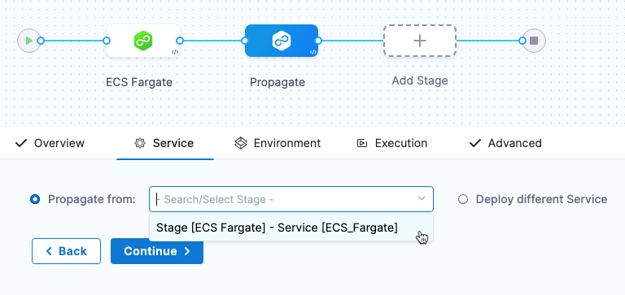
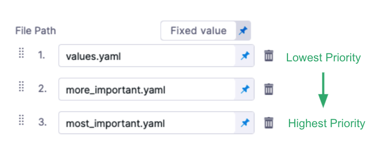

This topic describes how to propagate CD services between stages.

You can use the same CD stage services across your pipeline stages. Once you have added a stage with a services, you can select the same service in subsequent stages using the **Propagate from** option.

  

You can also use Harness input sets and overlays to select from different collections of settings at runtime. See [Input sets and overlays](../../../platform/8_Pipelines/input-sets.md) and [Run pipelines using input sets and overlays](../../../platform/8_Pipelines/run-pipelines-using-input-sets-and-overlays.md).

## Before you begin

* [Add a Stage](../../../platform/8_Pipelines/add-a-stage.md)

## Important notes

* Service propagation is not supported when using multiple services in a single stage (multi service deployments).
  * For details on using multiple services, go to [Use multiple services and multiple environments in a deployment](../cd-services-general/../../cd-deployments-category/multiserv-multienv.md).
* Service propagation is progressive: you can only propagate services from stage to stage in a forward direction in your pipeline. For example, Stage 2 cannot propagate a Service from a subsequent Stage 3.
* In a pipeline's **Advanced Options**, in **Stage Execution Settings**, you can set up selective stage executions. This allows you to select which stage(s) to deploy at runtime.
  * If you select a stage that uses a propagated service (a child service) it will not work. 
  * This is because the parent service's settings must be resolved as part of the deployment. Additionally, if the child service is overriding the parent service's settings, harness cannot ensure that the settings can be overridden correctly without deploying the parent service.
* When propagation is set up between a parent stage and child stage, moving the parent or child stage out of sequence resets any propagated settings to their defaults.
  * If you do this, you will be prompted to confirm. If you confirm, the stages are reset to their defaults.
  

### Propagation and input sets

When you propagate a service from one stage to another, the stages must use the same input set.

For example, if you have Stage 1 using Input Set A, and you propagate its service to Stage 2, Stage 2 must use Input Set A.

If you want Stage 2 to use a different input set, it cannot propagate from Stage 1.

## Propagate a service

1. Open or create a pipeline with at least one stage.
2. Select the plus sign (+) or select **Add Stage** after the first stage to add another stage to the pipeline and select **Deploy**.
   
   
3. Enter a stage name and select **Set Up Stage**.
   
   The new stage is added to the Pipeline.
4. Select the **Service** tab if it is not already selected.
   
   The propagation option appears.
   
   
5. Select **Propagate from** and then select the stage with the service you want to use.
   
   
   
   You can see the stage name and Service name.

This stage now uses the exact same Service as the stage you selected.

## Multiple service deployments

:::info

Multiple service deployments do not support service propagation.

:::

If you select multiple services in a stage you cannot propagate them to subsequent stages.

For information on multiple service deployments, go to [Use multiple services and multiple environments in a deployment](../../cd-deployments-category/multiserv-multienv.md).

## Override service settings

 You can override a service's setting using **Environment Overrides** and by overlaying values YAML files.
 
For details on **Environment Overrides**, see [Services and environments overview](../../onboard-cd/cd-concepts/services-and-environments-overview.md).The following information covers overriding Services in Services and Environments v1 only.

A common method for overriding values YAML files is to use the `<+env.name>` Harness expression in the **File Path** of the values YAML file and then map that to different environments.

<!--  -->

<docimage path={require('./static/6cffc4e7fc1159c37eece2bb6cc2a7e76a115652155fe93c91a3f80a68328112.png')} />

There are other ways to override the values.yaml files without using environments.

You can overlay values files in Harness by adding multiple files or you can replace file paths dynamically at runtime.

See [Add and override values YAML files](../../cd-advanced/cd-kubernetes-category/add-and-override-values-yaml-files.md).

