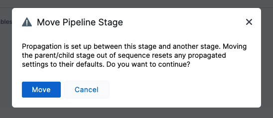
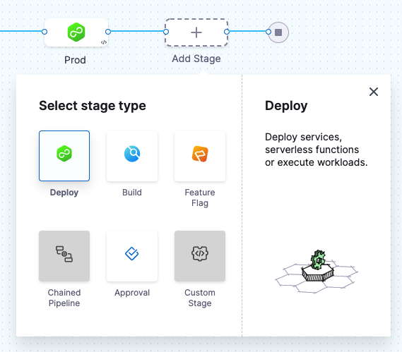
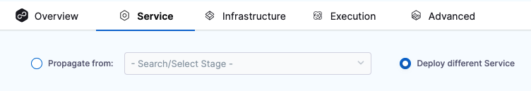
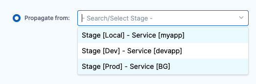
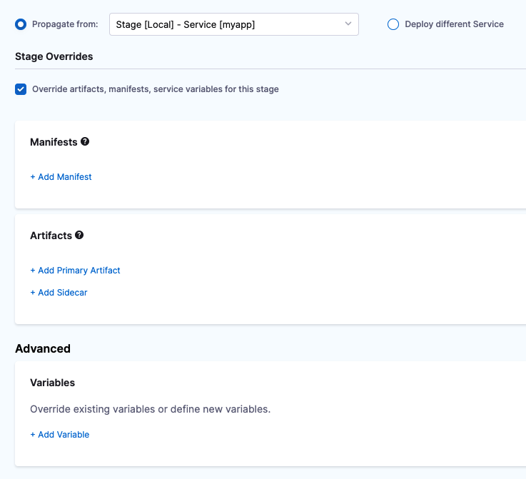
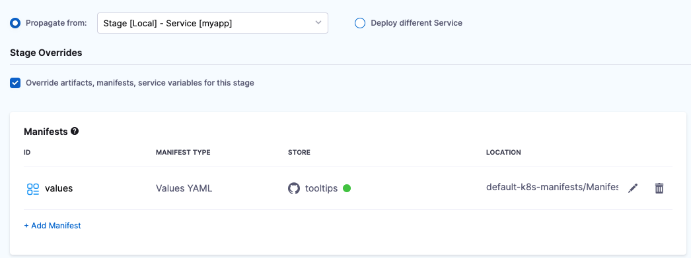
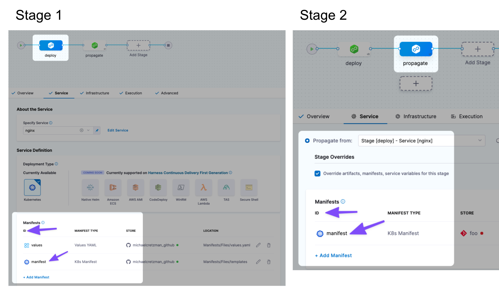

You can use the same CD stage Services across your Pipeline stages. Once you have multiple Services, Harness lets you select from these Services in any stage.

This topic describes how to propagate and override Services.

You can also use Harness Input Sets and Overlays to select from different collections of settings at runtime. See [Input Sets and Overlays](../../../platform/8_Pipelines/input-sets.md) and [Run Pipelines using Input Sets and Overlays](../../../platform/8_Pipelines/run-pipelines-using-input-sets-and-overlays.md).

## Before You Begin

* [Kubernetes CD Quickstart](../../onboard-cd/cd-quickstarts/kubernetes-cd-quickstart.md)
* [Add a Stage](../../../platform/8_Pipelines/add-a-stage.md)

## Services and Environments v2

Currently, there are two versions of Services and Environments, v1 and v2. Services and Environments v1 is being replaced by Services and Environments v2.

Propagation works the same in v1 and v2, but overriding does not. For v2, you override Service settings using Environments.

For details on Service overrides, see [Services and Environments Overview](../../onboard-cd/cd-concepts/services-and-environments-overview.md).

## Limitations

* Service propagation is progressive: you can only propagate Services from stage to stage in a forward direction in your Pipeline. For example, Stage 2 cannot propagate a Service from Stage 3.
* In a pipeline's **Advanced Options**, in **Stage Execution Settings**, you can set up selective stage executions. This allows you to select which stage(s) to deploy at runtime. If you select a stage that uses a propagated Service (a child Service) it will not work. This is because the parent Service's settings must be resolved as part of the deployment. Additionally, if the child Service is overriding the parent Service's settings, Harness cannot ensure that the settings can be overriden correctly without deploying the parent Service.
* When propagation is set up between a parent stage and child stage, moving the parent or child stage out of sequence resets any propagated settings to their defaults. If you do this, you will be prompted to confirm. If you confirm, the stages are reset to their defaults.
  


### Propagation and Input Sets

When you propagate a Service from one stage to another, the stages must use the same Input Set.

For example, if you have Stage 1 using Input Set A, and you propagate its Service to Stage 2, Stage 2 must use Input Set A.

If you want Stage 2 to use a different Input Set, it cannot propagate from Stage 1.

## Visual Summary

The following video provides a quick overview of Service propagation and overriding.

<!-- Video:
https://www.youtube.com/watch?v=wtTiL21cb78-->
<docvideo src="https://www.youtube.com/watch?v=wtTiL21cb78" />


## Step: Propagate a Service

Open or create a Pipeline with at least one stage.

Click the plus sign (+) or click **Add Stage** after the first stage to add another stage to the Pipeline and click **Deploy**.



Enter a stage name and click **Set Up Stage**.

The new stage is added to the Pipeline.

Click the **Service** tab if it is not already selected.

The propagation option appears.



Click **Propagate from** and then select the stage with the Service you want to use.



You can see the stage name and Service name.

This stage now uses the exact same Service as the stage you selected.

## Multi Service deployments

If you select multiple Services in a stage, you can propagate them all to a subsequent child stage.

For information on Multi Service deployments, go to [Use multiple Services and multiple Environments in a deployment](../../cd-deployments-category/multiserv-multienv.md).

## Option: Override Service Settings

**Services and Environments v2:** Currently, there are two versions of Services and Environments, v1 and v2. Services and Environments v1 is being replaced by Services and Environments v2. Propagation works the same in v1 and v2, but overriding does not. For v2, you override Service settings using Environments.  
  
For details on Service overrides, see [Services and Environments Overview](../../onboard-cd/cd-concepts/services-and-environments-overview.md).The following information covers overriding Services in Services and Environments v1 only.Once you select a stage, the **Override artifacts, manifests, service variables for this stage** option appears.

Enable this option.

Now Service settings appear.



Any settings you configure here will override their corresponding settings in the propagated Service.

A common example is to add a new values.yaml file for this stage's Service:



This values.yaml file will override the values.yaml file from the propagated Service.

## Overriding Manifests

If you want to override the Kubernetes manifest, Helm Chart, Kustomize manifest, or OpenShift Template from the Service you are propagating, you must match the Id used by the manifest in the Service you are propagating.

Here you can see the same Id used in the parent stage and the child stage that propagates and overrides:



If you do not use the same Id, you will see an error like the following during deployment:

```
"Invalid request: There can be only a single manifest. Select one from K8sManifest, HelmChart, Kustomize, OpenshiftTemplate"
```

## YAML Example

When you propagate a stage's Service, the child stage's settings in YAML indicate propagation with `useFromStage` and overrides are indicated with `stageOverrides`.


```yaml
...  
        - stage:  
              name: Tests  
              identifier: Tests  
              description: ""  
              type: Deployment  
              spec:  
                  serviceConfig:  
                      useFromStage:  
                          stage: Local  
                      stageOverrides:  
                          artifacts:  
                              sidecars: []  
                          manifests:  
                              - manifest:  
                                    identifier: values  
                                    type: Values  
                                    spec:  
                                        store:  
                                            type: Github  
                                            spec:  
                                                connectorRef: tooltips  
                                                gitFetchType: Branch  
                                                paths:  
                                                    - default-k8s-manifests/Manifests/Files/ng-values-noart.yaml  
                                                branch: main  
                          variables: []  
...
```

## Option: Overriding Values without Propagation

There are other ways to override the values.yaml file without propagation.

You can overlay values files in Harness by adding multiple files or you can replace file paths dynamically at runtime.

See [Add and Override Values YAML Files](../../cd-advanced/cd-kubernetes-category/add-and-override-values-yaml-files.md).

