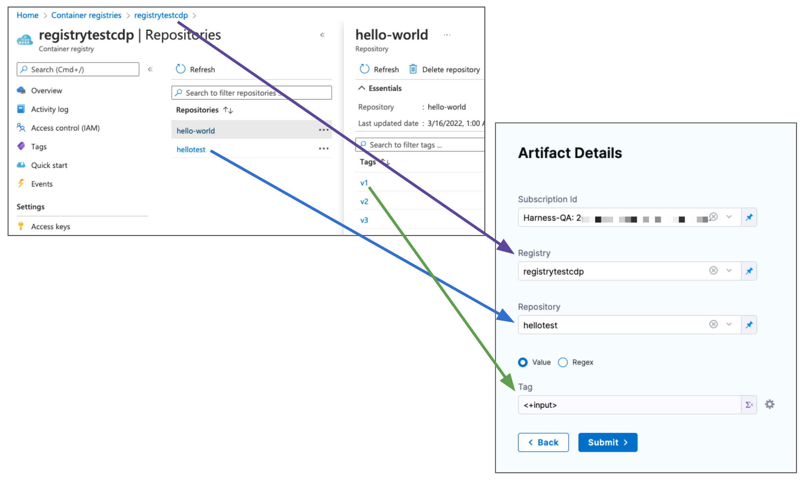

This topic describes how to add and configure a Harness Kubernetes Service.

A Kubernetes **Service** represents the app/microservice you are deploying using Harness Pipelines.

Each Stage's **Service Definition** includes the manifests and artifacts for the Service you are deploying in a specific Stage.

Setting up your Kubernetes Service Definition involves the following steps:

* [Step 1: Add Manifests for Your Service](kubernetes-services.md#lb-add-manifests-for-your-service)
* [Option: Add the Primary Artifact Source](kubernetes-services.md#option-add-the-primary-artifact-source)
* [Additional Settings and Options](kubernetes-services.md#additional-settings-and-options)

## Before You Begin

If you are new to Harness CD Pipelines, see:

* [CD Pipeline Basics](../../onboard-cd/cd-concepts/cd-pipeline-basics.md)
* [Kubernetes CD Quickstart](../../onboard-cd/cd-quickstarts/kubernetes-cd-quickstart.md)

## Visual Summary

Here's a quick video showing you how to add manifests and Values YAML files in Harness. It covers Kubernetes as well as other types like Helm Charts.

<!-- Video:
https://www.youtube.com/watch?v=dVk6-8tfwJc-->
<docvideo src="https://www.youtube.com/watch?v=dVk6-8tfwJc" />

## Add Manifests for Your Service

In a CD Stage **Service**, in **Manifests**, you add the specific manifests and config files your **Service Definition** requires.

Harness supports a number of Kubernetes manifest types and orchestration methods.


Here are the supported manifest types and how to set them up.

### Kubernetes Manifest

Harness supports Kubernetes deployments using Kubernetes manifests.

If this is your first time using Harness for a Kubernetes deployment, see [Kubernetes CD Quickstart](../../onboard-cd/cd-quickstarts/kubernetes-cd-quickstart.md).

For a task-based walkthroughs of different Kubernetes features in Harness, see [Kubernetes How-tos](/docs/category/kubernetes).

Add a Kubernetes ManifestYou can hardcode your artifact in your manifests, our add your artifact source to your **Service Definition** and then reference it in your manifests. See [Reference Artifacts in Manifests](kubernetes-services.md#reference-artifacts-in-manifests).

Let's take a quick look at adding Kubernetes manifests to your Stage.

In your CD stage, click **Service**.

In **Service Definition**, select **Kubernetes**.

In **Manifests**, click **Add Manifest**.

In **Specify Manifest Type**, select **K8s Manifest**, and then click **Continue**.

In **Specify K8s Manifest Store**, select the Git provider.

The settings for each Git provider are slightly different, but you simply want to point to the Git account For example, click GitHub, and then select or create a new GitHub Connector. See [Connect to Code Repo](../../../platform/7_Connectors/connect-to-code-repo.md).

Click **Continue**. **Manifest Details** appears.

In **Manifest Identifier**, enter an Id for the manifest. It must be unique. It can be used in Harness expressions to reference this manifest's settings.

For example, if the Pipeline is named **MyPipeline** and **Manifest Identifier** were **manifests**, you could reference the **Branch** setting using this expression:

* Within the Stage: `<+serviceConfig.serviceDefinition.spec.manifests.values.spec.store.spec.branch>`.
* Anywhere in the Pipeline (the Stage name is **deploy**): `<+pipeline.stages.deploy.spec.serviceConfig.serviceDefinition.spec.manifests.values.spec.store.spec.branch>`.

If you selected a Connector that uses a Git account instead of a Git repo, enter the name of the repo where your manifests are located in **Repository Name**.

In **Git Fetch Type**, select **Latest from Branch** or **Specific Commit ID**, and then enter the branch or commit Id for the repo.

For **Specific Commit ID**, you can also use a [Git commit tag](https://git-scm.com/book/en/v2/Git-Basics-Tagging).

In **File/Folder Path**, enter the path to the manifest file or folder in the repo. The Connector you selected already has the repo name, so you simply need to add the path from the root of the repo.

If you are using a values.yaml file and it's in the same repo as your manifests, in **Values YAML**, click **Add File**.

Enter the path to the values.yaml file from the root of the repo.

Here's an example with the manifest and values.yaml file added.


If you use multiple files, the highest priority is given from the last file, and the lowest priority to the first file. For example, if you have 3 files and the second and third files contain the same key:value as the first file, the third file's key:value overrides the second and first files.


Click **Submit**. The manifest is added to **Manifests**.

### Values YAML

Harness Kubernetes Services can use Values YAML files just like you would using Helm. Harness manifests can use [Go templating](#go_templating) with your Values YAML files and you can include [Harness variable expressions](../../../platform/12_Variables-and-Expressions/harness-variables.md) in the Values YAML files.

If you are using a Values YAML file and it's in the same repo as your manifests, you can add it when you add your manifests, as described above (**Values YAML** --> **Add File**).

If you are using a Values YAML file and it's in a separate repo from your manifests, or you simply want to add it separately, you can add it as a separate file, described below.

You cannot use Harness variables expressions in your Kubernetes object manifest files. You can only use Harness variables expressions in Values YAML files.Add a Values YAML fileWhere is your Values YAML file located?

* **Same folder as manifests:** If you are using a values.yaml file and it's in the same repo as your manifests, you can add it when you add your manifests, as described above (**Values YAML** --> **Add File**).
* **Separate from manifests:** If your values file is located in a different folder, you can add it separately as a **Values YAML** manifest type, described below.

In your CD stage, click **Service**.

In **Service Definition**, select **Kubernetes**.

In **Manifests**, click **Add Manifest**.

In **Specify Manifest Type**, select **Values YAML**, and click **Continue.**

In **Specify Values YAML Store**, select the Git repo provider you're using and then create or select a Connector to that repo. The different Connectors are covered in [Connect to a Git Repo](../../../platform/7_Connectors/connect-to-code-repo.md).

If you haven't set up a Harness Delegate, you can add one as part of the Connector setup. This process is described in [Kubernetes CD Quickstart](../../onboard-cd/cd-quickstarts/kubernetes-cd-quickstart.md), [Helm CD Quickstart](../../onboard-cd/cd-quickstarts/helm-cd-quickstart.md) and [Install a Kubernetes Delegate](../../../platform/2_Delegates/delegate-guide/install-a-kubernetes-delegate.md).

Once you've selected a Connector, click **Continue**.

In **Manifest Details**, you tell Harness where the values.yaml is located.

In **Manifest Identifier**, enter a name that identifies the file, like **values**.

If you selected a Connector that uses a Git account instead of a Git repo, enter the name of the repo where your manifests are located in **Repository Name**.

In **Git Fetch Type**, select a branch or commit Id for the manifest, and then enter the Id or branch.

For **Specific Commit ID**, you can also use a [Git commit tag](https://git-scm.com/book/en/v2/Git-Basics-Tagging).

In **File Path**, enter the path to the values.yaml file in the repo.

You can enter multiple values file paths by clicking **Add File**. At runtime, Harness will compile the files into one values file.

If you use multiple files, the highest priority is given from the last file, and the lowest priority to the first file. For example, if you have 3 files and the second and third files contain the same key:value as the first file, the third file's key:value overrides the second and first files.


Click **Submit**.

The values file(s) are added to the Service.

#### Values files in both the Manifests and Values YAML

If you have Values files in both the K8s Manifest **File/Folder Path** and the Values YAML, the Values YAML will overwrite any matching values in the Values YAML in the Manifest **File/Folder Path**.


### Helm Chart

Harness supports Helm Chart deployments. If this is your first time using Harness for a Helm Chart deployment, see [Helm Chart deployment tutorial](../../onboard-cd/cd-quickstarts/helm-cd-quickstart.md).

For a detailed walkthrough of deploying Helm Charts in Harness, including limitations and binary support, see [Deploy Helm Charts](../../cd-advanced/cd-helm-category/deploy-helm-charts.md). Here's a [video walkthrough](https://youtu.be/Wvr52UKDOJQ).

Add a Helm ChartIn your CD stage, click **Service**.

In **Service Definition**, select **Kubernetes**.

In **Manifests**, click **Add Manifest**.

In **Specify Manifest Type**, select **Helm Chart**, and click **Continue**.

In **Specify Helm Chart Store**, select HTTP Helm Repository, OCI Registry, a Git repo provider, or a cloud storage service (Google Cloud Storage, AWS S3) you're using.

For the steps and settings of each option, see the [Connect to an Artifact Repo](../../../platform/7_Connectors/connect-to-an-artifact-repo.md) or [Connect to a Git Repo](../../../platform/7_Connectors/connect-to-code-repo.md) How-tos.

If you are using Google Cloud Storage or Amazon S3, see [Cloud Platform Connectors](/docs/category/cloud-platform-connectors).

If you haven't set up a Harness Delegate, you can add one as part of the Connector setup. This process is described in [Helm CD Quickstart](../../onboard-cd/cd-quickstarts/helm-cd-quickstart.md) and [Install a Kubernetes Delegate](../../../platform/2_Delegates/delegate-guide/install-a-kubernetes-delegate.md).

Once your Helm chart is added, it appears in the **Manifests** section. For example:


### Kustomize

Harness supports Kustomize deployments.

If this is your first time using Harness for a Kustomize deployment, see the [Kustomize Quickstart](../../onboard-cd/cd-quickstarts/kustomize-quickstart.md).

For a detailed walkthrough of deploying Kustomize in Harness, including limitations, see [Use Kustomize for Kubernetes Deployments](../../cd-advanced/kustomize-howtos/use-kustomize-for-kubernetes-deployments.md).

Add a KustomizationIn your CD stage, click **Service**.

In **Service Definition**, select **Kubernetes**.

In **Manifests**, click **Add Manifest**.

In **Specify Manifest Type**, click **Kustomize**, and click **Continue**.

In **Specify Manifest Type**, select the Git provider.

In **Manifest Details**, enter the following settings, test the connection, and click **Submit**. We are going to provide connection and path information for a kustomization located at https://github.com/wings-software/harness-docs/blob/main/kustomize/helloWorld/kustomization.yaml.

* **Manifest Identifier:** enter **kustomize**.
* **Git Fetch Type:** select **Latest from Branch**.
* **Branch:** enter **main**.
* **Kustomize Folder Path:** kustomize/helloWorld. This is the path from the repo root.

The kustomization is now listed.


### Kustomize Patches

Add Kustomize PatchesIn the Stage's **Service**, in **Manifests**, click **Add Manifest**.

In **Specify Manifest Type**, select **Kustomize Patches**, and click **Continue**.

In **Specify Kustomize Patches Store**, select your Git provider and Connector. See [Connect to a Git Repo](../../../platform/7_Connectors/connect-to-code-repo.md).

The Git Connector should point to the Git account or repo where you Kustomize files are located. In **Kustomize Patches** you will specify the path to the actual patch files.

Click **Continue**.

In **Manifest Details**, enter the path to your patch file(s):

* **Manifest Identifier:** enter a name that identifies the patch file(s). You don't have to add the actual filename.
* **Git Fetch Type:** select whether to use the latest branch or a specific commit Id.
* **Branch**/**Commit Id**: enter the branch or commit Id.
* **File/Folder Path:** enter the path to the patch file(s) from the root of the repo. Click **Add File** to add each patch file. The files you add should be the same files listed in `patchesStrategicMerge` of the main kustomize file in your Service.

The order in which you add file paths for patches in **File/Folder Path** is the same order that Harness applies the patches during the kustomization build.Small patches that do one thing are recommended. For example, create one patch for increasing the deployment replica number and another patch for setting the memory limit.Click **Submit**. The patch file(s) is added to **Manifests**.

When the main kustomization.yaml is deployed, the patch is rendered and its overrides are added to the deployment.yaml that is deployed.

**How Harness uses patchesStrategicMerge:** If the `patchesStrategicMerge` label is missing from the kustomization YAML file, but you have added Kustomize Patches to your Harness Service, Harness will add the Kustomize Patches you added in Harness to the `patchesStrategicMerge` in the kustomization file. If you have hardcoded patches in `patchesStrategicMerge`, but not add these patches to Harness as Kustomize Patches, Harness will ignore them.

### OpenShift Template

For an overview of OpenShift support, see [Using OpenShift with Harness Kubernetes](../../cd-technical-reference/cd-k8s-ref/using-open-shift-with-harness-kubernetes.md).

Add an OpenShift TemplateIn your CD stage, click **Service**.

In **Service Definition**, select **Kubernetes**.

In **Manifests**, click **Add Manifest**.

In **Specify Manifest Type**, select **OpenShift Template**, and then click **Continue.**

In **Specify OpenShift Template Store**, select the Git provider where your template is located.

For example, click **GitHub**, and then select or create a new GitHub Connector. See [Connect to Code Repo](../../../platform/7_Connectors/connect-to-code-repo.md).

Click **Continue**. **Manifest Details** appears.

In **Manifest Identifier**, enter an Id for the manifest. It must be unique. It can be used in Harness expressions to reference this template's settings.

For example, if the Pipeline is named **MyPipeline** and **Manifest Identifier** were **myapp**, you could reference the **Branch** setting using this expression:

`<+pipeline.stages.MyPipeline.spec.serviceConfig.serviceDefinition.spec.manifests.myapp.spec.store.spec.branch>`

In **Git Fetch Type**, select **Latest from Branch** or **Specific Commit Id/Git Tag**, and then enter the branch or commit Id/[tag](https://git-scm.com/book/en/v2/Git-Basics-Tagging) for the repo.

In **Template** **File Path**, enter the path to the template file. The Connector you selected already has the repo name, so you simply need to add the path from the root of the repo to the file.

Click **Submit**. The template is added to **Manifests**.

### OpenShift Param

For an overview of OpenShift support, see [Using OpenShift with Harness Kubernetes](../../cd-technical-reference/cd-k8s-ref/using-open-shift-with-harness-kubernetes.md).

Add an OpenShift Param FileIn your CD stage, click **Service**.

In **Service Definition**, select **Kubernetes**.

In **Manifests**, click **Add Manifest**.

In **Specify Manifest Type**, select **OpenShift Param**, and then click **Continue.**

In **Specify OpenShift Param Store**, select the Git provider where your param file is located.

For example, click **GitHub**, and then select or create a new GitHub Connector. See [Connect to Code Repo](../../../platform/7_Connectors/connect-to-code-repo.md).

Click **Continue**. **Manifest Details** appears.

In **Manifest Identifier**, enter an Id for the param file. It must be unique. It can be used in Harness expressions to reference this param file's settings.

In **Git Fetch Type**, select **Latest from Branch** or **Specific Commit Id/Git Tag**, and then enter the branch or commit Id/[tag](https://git-scm.com/book/en/v2/Git-Basics-Tagging) for the repo.

In **Paths**, enter the path(s) to the param file(s). The Connector you selected already has the repo name, so you simply need to add the path from the root of the repo to the file.

Click **Submit**. The template is added to **Manifests**.

## Add the Primary Artifact Source

The **Artifacts** settings in the **Service Definition** allow you to select the artifacts for deployment instead of hardcoding them in your manifest and values YAML files.

Artifacts OverviewIf a Docker image location is hardcoded in your Kubernetes manifest (for example, `image: nginx:1.14.2`), then you can simply add the manifest to Harness in **Manifests** and Kubernetes will pull the image during deployment.

Alternatively, you can add the image location to Harness as an artifact in the **Artifacts**.


This allows you to reference the image in your manifests and Values files using the Harness expression `<+artifact.image>`.


```yaml
...  
image: <+artifact.image>  
...
```
You cannot use Harness variables expressions in your Kubernetes object manifest files. You can only use Harness variables expressions in Values YAML files.When you select the artifact repo for the artifact, like a Docker Hub repo, you specify the artifact and tag/version to use. You can select a specific tag/version, use a [Runtime Input](../../../platform/20_References/runtime-inputs.md) so that you are prompted for the tag/version when you run the Pipeline, or you can use an Harness variable expression to pass in the tag/version at execution.

Here's an example where a Runtime Input is used and you select which image version/tag to deploy.


With a Harness artifact, you can template your manifests, detaching them from a hardcoded location. This makes your manifests reusable and dynamic.

In **Artifacts**, you add connections to the images in their repos.

In **Artifacts**, click **Add Primary** **Artifact.**

Select the **Artifact Repository Type**.

### Docker

For details on all the Docker Connector settings, see [Docker Connector Settings Reference](../../../platform/7_Connectors/ref-cloud-providers/docker-registry-connector-settings-reference.md).

Add an Artifact from a Docker RegistryIn **Artifacts**, click **Add Primary** **Artifact.**

In **Artifact Repository Type**, click **Docker Registry**, and then click **Continue**.

The **Docker Registry** settings appear.

Select a [Docker Registry Connector](../../../platform/7_Connectors/ref-cloud-providers/docker-registry-connector-settings-reference.md) or create a new one.

Click **Continue**.

In **Image path**, enter the name of the artifact you want to deploy, such as **library/nginx**.

In **Tag**, enter or select the [Docker image tag](https://docs.docker.com/engine/reference/commandline/tag/) for the image.


Click **Submit**.

The Artifact is added to the Service Definition.

### Google Container Registry (GCR)

You connect to GCR using a Harness GCP Connector. For details on all the GCR requirements for the GCP Connector, see [Google Cloud Platform (GCP) Connector Settings Reference](../../../platform/7_Connectors/ref-cloud-providers/gcs-connector-settings-reference.md).

Add an Artifact from GCRIn **Artifacts**, click **Add Primary** **Artifact.**

In **Artifact Repository Type**, click **GCR**, and then click **Continue**.

In **GCR Repository**, select or create a [Google Cloud Platform (GCP) Connector](../../../platform/7_Connectors/ref-cloud-providers/gcs-connector-settings-reference.md) that connects to the GCP account where the GCR registry is located.

* **GCP GCR Permissions:** make sure the connected IAM User has the policies listed in [Google Cloud Platform (GCP) Connector Settings Reference](../../../platform/7_Connectors/ref-cloud-providers/gcs-connector-settings-reference.md).

Click **Continue**.

In **GCR Registry URL**, select the registry where the artifact source is located.

In **Image Path**, enter the name of the artifact you want to deploy.

Images in repos need to reference a path starting with the project ID that the artifact is in, for example: `myproject-id/image-name`.

In **Tag**, enter or select the [Docker image tag](https://docs.docker.com/engine/reference/commandline/tag/) for the image or select [Runtime Input or Expression](../../../platform/20_References/runtime-inputs.md).


If you use Runtime Input, when you deploy the Pipeline, Harness will pull the list of tags from the repo and prompt you to select one.

Click **Submit**.

The Artifact is added to the Service Definition.

### Google Artifact Registry

:::note

Currently, this feature is behind the feature flag `NG_GOOGLE_ARTIFACT_REGISTRY`. Contact [Harness Support](mailto:support@harness.io) to enable the feature.

:::

You connect to Google Artifact Registry using a Harness GCP Connector. 

For details on all the Google Artifact Registry requirements for the GCP Connector, see [Google Cloud Platform (GCP) Connector Settings Reference](../../../platform/7_Connectors/ref-cloud-providers/gcs-connector-settings-reference.md).

Add an Artifact from Google Artifact RegistryIn **Artifacts**, click **Add Primary** **Artifact.**

In **Artifact Repository Type**, click **Google Artifact Registry**, and then click **Continue**.

In **GCP Connector**, select or create a [Google Cloud Platform (GCP) Connector](../../../platform/7_Connectors/ref-cloud-providers/gcs-connector-settings-reference.md) that connects to the GCP account where the Google Artifact Registry is located. Ensure the GCP account it uses has the following roles:

* Artifact Registry Reader
* Artifact Registry Writer

Click **Continue**.

In **Artifact Details**, you are basically creating the pull command. For example:


```
docker pull us-central1-docker.pkg.dev/docs-play/quickstart-docker-repo/quickstart-image:v1.0
```

In **Artifact Source Name**, enter a name for the artifact.

In **Repository Type**, select the format of the artifact.

In **Project**, enter the name of the GCP project.

In **Region**, select the region where the repo is located.

In **Repository Name**, enter the name of the repo.

In **Package**, enter the artifact name.

In **Version Details**, select **Value** or **Regex**.

In **Version**, enter or select the [Docker image tag](https://docs.docker.com/engine/reference/commandline/tag/) for the image or select [Runtime Input or Expression](../../../platform/20_References/runtime-inputs.md).


If you use Runtime Input, when you deploy the Pipeline, Harness will pull the list of tags from the repo and prompt you to select one.

Click **Submit**.

The Artifact is added to the Service Definition.

### Amazon Elastic Container Registry (ECR)

You connect to ECR using a Harness AWS Connector. For details on all the ECR requirements for the AWS Connector, see [AWS Connector Settings Reference](../../../platform/7_Connectors/ref-cloud-providers/aws-connector-settings-reference.md).

Add an Artifact from ECRIn **Artifacts**, click **Add Primary** **Artifact.**

In **Artifact Repository Type**, click **ECR**, and then click **Continue**.

In **ECR Repository**, select or create an [AWS Connector](../../../platform/7_Connectors/add-aws-connector.md) that connects to the AWS account where the ECR registry is located.

* **AWS ECR Permissions:** make sure the connected IAM User has the policies listed in [AWS Connector Settings Reference](../../../platform/7_Connectors/ref-cloud-providers/aws-connector-settings-reference.md).

Click **Continue**.

In **Artifact Details**, select the region where the artifact source is located.

In **Image Path**, enter the name of the artifact you want to deploy.

In **Tag**, enter or select the [Docker image tag](https://docs.docker.com/engine/reference/commandline/tag/) for the image.


If you use Runtime Input, when you deploy the Pipeline, Harness will pull the list of tags from the repo and prompt you to select one.

Click **Submit**.

The Artifact is added to the Service Definition.

### Azure Container Registry (ACR)

You connect to ACR using a Harness Azure Connector. For details on all the Azure requirements for the Azure Connector, see [Add a Microsoft Azure Cloud Connector](../../../platform/7_Connectors/add-a-microsoft-azure-connector.md).

Add an Artifact from ACRIn **Artifacts**, click **Add Primary** **Artifact.**

In **Artifact Repository Type**, click **ACR**, and then click **Continue**.

In **ACR Repository**, select or create an [Azure Connector](../../../platform/7_Connectors/add-a-microsoft-azure-connector.md) that connects to the Azure account where the ACR registry is located.

* **Azure ACR Permissions:** make sure the Service Principal or Managed Identity has the [required permissions](../../../platform/7_Connectors/add-a-microsoft-azure-connector.md).

Click **Continue**.

In **Artifact Details**, select the Subscription Id where the artifact source is located.

In **Registry**, select the ACR registry to use.

In **Repository**, select the repo to use.

In **Tag**, enter or select the tag for the image.



If you use Runtime Input, when you deploy the Pipeline, Harness will pull the list of tags from the repo and prompt you to select one.

Click **Submit**.

The Artifact is added to the Service Definition.

### Nexus

You connect to Nexus using a Harness Nexus Connector. For details on all the requirements for the Nexus Connector, see [Nexus Connector Settings Reference](../../../platform/8_Pipelines/w_pipeline-steps-reference/nexus-connector-settings-reference.md).

Add an Artifact from NexusIn **Artifacts**, click **Add Primary** **Artifact.**

In **Artifact Repository Type**, click **Nexus**, and then click **Continue**.

In **Nexus Repository**, select of create a Nexus Connector that connects to the Nexus account where the repo is located. Click **Continue**.

* **Nexus Permissions:** make sure the Nexus user account has the permissions listed in [Nexus Connector Settings Reference](../../../platform/8_Pipelines/w_pipeline-steps-reference/nexus-connector-settings-reference.md).

The **Artifact Details** settings appear.

Select **Repository URL** or **Repository Port**.

* Repository Port is more commonly used and can be taken from the repo settings. Each repo uses its own port.
* Repository URL is typically used for a custom infrastructure (for example, when Nexus is hosted behind a reverse proxy).

In **Repository**, enter the name of the repo.

In **Artifact Path**, enter the path to the artifact you want.

In **Tag**, enter or select the [Docker image tag](https://docs.docker.com/engine/reference/commandline/tag/) for the image.


If you use Runtime Input, when you deploy the Pipeline, Harness will pull the list of tags from the repo and prompt you to select one.

Click **Submit**.

The Artifact is added to the Service Definition.

### Artifactory

You connect to Artifactory (JFrog) using a Harness Artifactory Connector. For details on all the requirements for the Artifactory Connector, see [Artifactory Connector Settings Reference](../../../platform/7_Connectors/ref-cloud-providers/artifactory-connector-settings-reference.md).

Add an Artifact from ArtifactoryIn **Artifacts**, click **Add Primary** **Artifact.**

In **Artifact Repository Type**, click **Artifactory**, and then click **Continue**.

In **Artifactory Repository**, select of create an Artifactory Connector that connects to the Artifactory account where the repo is located. Click **Continue**.

* **Artifactory Permissions:** make sure the Artifactory user account has the permissions listed in [Artifactory Connector Settings Reference](../../../platform/7_Connectors/ref-cloud-providers/artifactory-connector-settings-reference.md).

The **Artifact Details** settings appear.

In **Repository URL**, enter the URL from the `docker login` command in Artifactory's **Set Me Up** settings.


In **Repository**, enter the repo name. So if the full path is `docker-remote/library/mongo/3.6.2`, you would enter `docker-remote`.

In **Artifact Path**, enter the path to the artifact. So if the full path is `docker-remote/library/mongo/3.6.2`, you would enter `library/mongo`.

In **Tag**, enter or select the [Docker image tag](https://docs.docker.com/engine/reference/commandline/tag/) for the image.


If you use Runtime Input, when you deploy the Pipeline, Harness will pull the list of tags from the repo and prompt you to select one.

Click **Submit**.

The Artifact is added to the Service Definition.

### Github Packages

:::note

Currently, this feature is behind the feature flag `GITHUB_PACKAGES`. Contact [Harness Support](mailto:support@harness.io) to enable the feature.

:::

You can use Github Packages as artifacts for deployments.

Currently, Harness supports only the packageType as `docker(container)`. Support for npm, maven, rubygems, and nuget is coming soon. You connect to Github using a Harness Github Connector, username, and Personal Access Token (PAT).

Add an Artifact from Github PackagesIn **Artifacts**, click **Add Primary** **Artifact.**

In **Artifact Repository Type**, click **Github Package Registry**, and then click **Continue**.

In **Github Package Registry Repository**, select of create an Github Connector that connects to the Github account where the package repo is located. Click **Continue**.

* **Github Permissions:** make sure the Personal Access Token (PAT) has the `write:packages` and `read:packages` permissions.
* **API access:** ensure that you enable API access. You can use the Harness secret with the same PAT that you used for user authentication.

The **Artifact Details** settings appear.

In **Artifact Source Name**, enter a name for this artifact source.

In **Package Type**, select the type of package you are using.

In **Package Name**, enter the name of the package.

In **Version**, enter the version to use. If you use [Runtime Input](../../../platform/20_References/runtime-inputs.md), when you deploy the Pipeline, Harness will pull the list of tags from the repo and prompt you to select one.

Click **Submit**.

The Artifact is added to the Service Definition.

New to Github Packages? This [quick video](https://www.youtube.com/watch?v=gqseP_wTZsk) will get you up to speed in minutes.#### Custom Artifact Source

For enterprises that use a custom repository, Harness provides the Custom Artifact Source to add their custom repository to the Service.

To use this artifact source, you provide a script to query your artifact server via its API (for example, REST) and then Harness stores the output on the Harness Delegate in the Harness-initialized variable `$HARNESS_ARTIFACT_RESULT_PATH`.

The output must be a JSON array, with a mandatory key for a Build Number/Version. You then map a key from your JSON output to the Build Number/Version variable.

For steps on adding a Custom Artifact source, go to [Add a Custom Artifact Source for CD](../cd-services-general/add-a-custom-artifact-source-for-cd.md).

### Reference Artifacts in Manifests

Once you have added an artifact to the **Artifacts** section of the Service, you need to reference that artifact in the Values YAML file added in **Manifests**.

You cannot use Harness variables expressions in your Kubernetes object manifest files. You can only use Harness variables expressions in Values YAML files.Referencing Artifacts in ManifestsTo reference this artifact, in the Values YAML file, you reference the image in the Service Definition **Artifacts** section using the Harness variable `<+artifact.image>`.

For example, here's a reference in a Values file:

```yaml
...  
name: myapp  
replicas: 2  
  
image: <+artifact.image>  
...
```

That `<+artifact.image>` references the artifact listed as **Primary** in **Artifacts**. At deployment runtime, Harness resolves `<+artifact.image>` to the image from your artifact source.


In your Kubernetes manifests, you simply use a standard Go template reference to the image value from your values file: `{{.Values.image}}`:

```yaml
apiVersion: apps/v1  
kind: Deployment  
...  
    spec:  
      {{- if .Values.dockercfg}}  
      imagePullSecrets:  
      - name: {{.Values.name}}-dockercfg  
      {{- end}}  
      containers:  
      - name: {{.Values.name}}  
        image: {{.Values.image}}  
...
```
See [Example Manifests](../../cd-advanced/cd-kubernetes-category/add-artifacts-for-kubernetes-deployments.md#example-manifests) for more details.

If an artifact expression is a Values YAML file or Execution step, you will be prompted to select an artifact at runtime. This is true even if the Stage does not deploy an artifact (such as a Custom Stage or a Stage performing a [Kustomize](../../onboard-cd/cd-quickstarts/kustomize-quickstart.md) deployment). If you want to reference an artifact that isn't the primary deployment artifact without being prompted, you can use an expression with quotes, like `docker pull <+artifact<+".metadata.image">>`.

### Go Templating

Harness supports [Go templating](https://godoc.org/text/template) for Kubernetes manifests. So you can add one or more Values YAML files containing values for different scenarios, and then use Go templating in the manifest files to reference the values in the Values YAML files.

Built-in Go templating support enables you to use Kubernetes without the need for Helm.

For more information, see [Example Kubernetes Manifests using Go Templating](../../cd-technical-reference/cd-k8s-ref/example-kubernetes-manifests-using-go-templating.md).Let's look at a few Kubernetes templating examples.

Basic Values YAML and Manifests for Public ImageHere's the values YAML file:

```yaml
name: <+stage.name>  
replicas: 2  
  
image: <+artifact.image>  
# dockercfg: <+artifact.imagePullSecret>  
  
createNamespace: true  
namespace: <+infra.namespace>  
  
serviceType: LoadBalancer  
  
servicePort: 80  
serviceTargetPort: 80  
  
env:  
  config:  
    key1: value10  
  secrets:  
    key2: value2
```

Here's the manifest containing multiple objects referring to the values in the values YAML file:

```go
{{- if .Values.env.config}}  
apiVersion: v1  
kind: ConfigMap  
metadata:  
 name: {{.Values.name}}  
data:  
{{.Values.env.config | toYaml | indent 2}}  
---  
{{- end}}  
  
{{- if .Values.env.secrets}}  
apiVersion: v1  
kind: Secret  
metadata:  
 name: {{.Values.name}}  
stringData:  
{{.Values.env.secrets | toYaml | indent 2}}  
---  
{{- end}}  
  
{{- if .Values.dockercfg}}  
apiVersion: v1  
kind: Secret  
metadata:  
 name: {{.Values.name}}-dockercfg  
 annotations:  
 harness.io/skip-versioning: true  
data:  
 .dockercfg: {{.Values.dockercfg}}  
type: kubernetes.io/dockercfg  
---  
{{- end}}  
  
apiVersion: apps/v1  
kind: Deployment  
metadata:  
 name: {{.Values.name}}-deployment  
spec:  
 replicas: {{int .Values.replicas}}  
 selector:  
 matchLabels:  
 app: {{.Values.name}}  
 template:  
 metadata:  
 labels:  
 app: {{.Values.name}}  
 spec:  
 {{- if .Values.dockercfg}}  
 imagePullSecrets:  
 - name: {{.Values.name}}-dockercfg  
 {{- end}}  
 containers:  
 - name: {{.Values.name}}  
 image: {{.Values.image}}  
 {{- if or .Values.env.config .Values.env.secrets}}  
 envFrom:  
 {{- if .Values.env.config}}  
 - configMapRef:  
 name: {{.Values.name}}  
 {{- end}}  
 {{- if .Values.env.secrets}}  
 - secretRef:  
 name: {{.Values.name}}  
 {{- end}}  
 {{- end}}
```

### Pull an Image from a Private Registry

Typically, if the Docker image you are deploying is in a private registry, Harness has access to that registry using the credentials set up in the Harness Connector.

If some cases, your Kubernetes cluster might not have the permissions needed to access a private Docker registry. For these cases, the Values YAML file in Service Definition **Manifests** section must use the `dockercfg` parameter.

Use dockercfg in Values YAMLIf the Docker image is added in the Service Definition Artifacts section, then you reference it like this: `dockercfg: <+artifact.imagePullSecret>`.

This key will import the credentials from the Docker credentials file in the artifact.

Open the values.yaml file you are using for deployment.

Verify that `dockercfg` key exists, and uses the `<+artifact.imagePullSecret>` expression to obtain the credentials:

```yaml
name: <+stage.variables.name>  
replicas: 2  
  
image: <+artifact.image>  
dockercfg: <+artifact.imagePullSecret>  
  
createNamespace: true  
namespace: <+infra.namespace>  
...
```

### Reference dockercfg in Kubernetes Objects

Next, verify that the Deployment and Secret objects reference `dockercfg: {{.Values.dockercfg}}`.


```yaml
...  
{{- if .Values.dockercfg}}  
apiVersion: v1  
kind: Secret  
metadata:  
  name: {{.Values.name}}-dockercfg  
  annotations:  
    harness.io/skip-versioning: true  
data:  
  .dockercfg: {{.Values.dockercfg}}  
type: kubernetes.io/dockercfg  
---  
{{- end}}  
  
apiVersion: apps/v1  
kind: Deployment  
metadata:  
  name: {{.Values.name}}-deployment  
spec:  
  replicas: {{int .Values.replicas}}  
  selector:  
    matchLabels:  
      app: {{.Values.name}}  
  template:  
    metadata:  
      labels:  
        app: {{.Values.name}}  
    spec:  
      {{- if .Values.dockercfg}}  
      imagePullSecrets:  
      - name: {{.Values.name}}-dockercfg  
      {{- end}}  
      containers:  
      - name: {{.Values.name}}  
        image: {{.Values.image}}  
...
```
With these requirements met, the cluster imports the credentials from the Docker credentials file in the artifact.

### Option: Add Sidecars

You can use Harness to deploy both primary and sidecar Kubernetes workloads. Sidecar containers are common where you have multiple colocated containers that share resources.

See [Add a Kubernetes Sidecar Container](../../cd-advanced/cd-kubernetes-category/add-a-kubernetes-sidecar-container.md).

## Additional Settings and Options

This topic has covered the Kubernetes Service basics to get your started, but we've only scratched the surface of what you have do in Harness.

Once you're comfortable with the basics, here's some more options for you to review.

### Ignore a Manifest File During Deployment

You might have manifest files for resources that you do not want to deploy as part of the main deployment.

Instead, you can tell Harness to ignore these files and then apply them separately using the Harness [Apply](../../cd-technical-reference/cd-k8s-ref/kubernetes-apply-step.md) step. Or you can simply ignore them and deploy them later.

See [Ignore a Manifest File During Deployment](../../cd-advanced/cd-kubernetes-category/ignore-a-manifest-file-during-deployment.md) and [Kubernetes Apply Step](../../cd-technical-reference/cd-k8s-ref/kubernetes-apply-step.md).

### Harness Pipeline, Stage, Service, and Built-in Variables

You can use Pipeline, Stage, Service, and Built-in variables in your values YAML files and Service settings.

See [Built-in Harness Variables Reference](../../../platform/12_Variables-and-Expressions/harness-variables.md) or watch this [short video](https://youtu.be/lqbmO6EVGuU).

### Propagate and Override Artifacts, Manifests, and Service Variables

See [Add and Override Values YAML Files](../../cd-advanced/cd-kubernetes-category/add-and-override-values-yaml-files.md).

## Next Steps

Once you've configured your Service, you can move onto the Stage's Infrastructure settings and define the target Kubernetes cluster and namespace for your deployment.

See [Define Your Kubernetes Target Infrastructure](../../cd-infrastructure/kubernetes-infra/define-your-kubernetes-target-infrastructure.md).

## See Also

* [Create a Kubernetes Rolling Deployment](../../cd-execution/kubernetes-executions/create-a-kubernetes-rolling-deployment.md)
* [Create a Kubernetes Canary Deployment](../../cd-execution/kubernetes-executions/create-a-kubernetes-canary-deployment.md)
* [Create a Kubernetes Blue Green Deployment](../../cd-execution/kubernetes-executions/create-a-kubernetes-blue-green-deployment.md)

