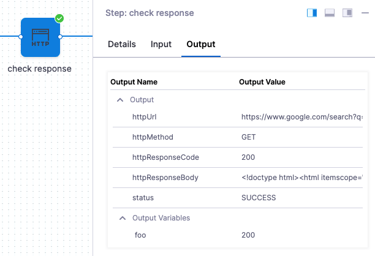

This topic describes the settings for the HTTP step.

You can use the HTTP step to run HTTP methods containing URLs, methods, headers, assertions, and variables.

## Name

The name of the step. You'll use this name when you reference this step's settings.

For example, if the step name is HTTP and you want to reference the URL entered in its **URL** setting, you would use:

`<+pipeline.stages.tooltips.spec.execution.steps.HTTP.spec.url>`

## Timeout

The timeout for this step. You can use:

* `w` for weeks
* `d` for days
* `h` for hours
* `m` for minutes
* `s` for seconds
* `ms` for milliseconds

The maximum is `53w`.

Timeouts can be set at the Pipeline level also.

## URL

The URL for the HTTP call.

## Method

The [HTTP method](https://restfulapi.net/http-methods/#summary) to use in the step.

## Request Body

The message body of the HTTP message.

## Assertion

The assertion is used to validate the incoming response. For example, if you wanted to check the health of an HTTP connection, you could use the assertion `<+httpResponseCode> == 200`.

The expression `<+httpResponseCode> == 200` will evaluate to true if the HTTP call returns a 200 code.

Expressions can use the following aliases to refer to the HTTP responses, URL, and method:

* `<+httpResponseCode>`
* `<+httpResponseBody>`

## Headers

Enter the media type for the message. For example, if you are using the GET method, the headers are used to specify the GET response body message type Harness will check for.

For example, in **Key**, enter `Token` .

In **Value**, enter `<+secrets.getValue("aws-playground_AWS_secret_key")>`.

Another example:

* **Key**: `variable:`
* **Value**: `var1,var2:var3`

## Output

Create output variables to be used by other steps in the stage. The **Value** setting can contain any HTTP step input, output, or response information.

You can also use ​JSON and XML functors in the values for the output variable. For example, `<+json.select("data.attributes.version_pins.mvn-service://new-construction-api", httpResponseBody)>`.

See [JSON and XML Functors](json-and-xml-functors.md).

## Step Execution Inputs and Outputs

Once you execute your Pipeline, the step displays its inputs and outputs and their values.

You can reference these anywhere in your Pipeline.

### Inputs

In the following examples, the Id of the HTTP step is `HTTP`.

| **Input Name** | **Input Reference Example** | **Input Value Example** |
| --- | --- | --- |
| identifier | `<+pipeline.stages.HTTP.spec.execution.steps.check_response.identifier>` | check\_response |
| name | `<+pipeline.stages.HTTP.spec.execution.steps.check_response.name>` | check response |
| timeout | `<+pipeline.stages.HTTP.spec.execution.steps.check_response.timeout>` | 10s |
| type | `<+pipeline.stages.HTTP.spec.execution.steps.check_response.type>` | Http |
| url | `<+pipeline.stages.HTTP.spec.execution.steps.check_response.spec.url>` | https://www.google.com/search?q= |
| method | `<+pipeline.stages.HTTP.spec.execution.steps.check_response.spec.method>` | GET |
| requestBody | `<+pipeline.stages.HTTP.spec.execution.steps.check_response.spec.requestBody>` | current+date |
| assertion | `<+pipeline.stages.HTTP.spec.execution.steps.check_response.spec.assertion>` | `<+httpResponseCode> == 200` |

### Outputs

In the following examples, the Id of the HTTP step is `HTTP`.

| **Output** | **Output Reference Example** | **Output Value Example** |
| --- | --- | --- |
| httpUrl | `<+pipeline.stages.HTTP.spec.execution.steps.HTTP.output.httpUrl>` | `https://www.google.com/search?q=` |
| httpMethod | `<+pipeline.stages.HTTP.spec.execution.steps.HTTP.output.httpMethod>` | `GET` |
| httpResponseCode | `<+pipeline.stages.HTTP.spec.execution.steps.HTTP.output.httpResponseCode>` | `200` |
| httpResponseBody | `<+pipeline.stages.HTTP.spec.execution.steps.HTTP.output.httpResponseBody>` | `Hello` |
| status | `<+pipeline.stages.HTTP.spec.execution.steps.HTTP.output.status>` | `SUCCESS` |

## Advanced Settings

In Advanced, you can use the following options:

* [Step Skip Condition Settings](../../../platform/8_Pipelines/w_pipeline-steps-reference/step-skip-condition-settings.md)
* [Step Failure Strategy Settings](../../../platform/8_Pipelines/w_pipeline-steps-reference/step-failure-strategy-settings.md)
* [Select Delegates with Selectors](../../../platform/2_Delegates/delegate-guide/select-delegates-with-selectors.md)

## Header Capability Check

When Harness runs an HTTP step and connects to a service, it checks to make sure that an HTTP connection can be established.

Some services require that HTTP headers are included in connections. Without the headers, the HTTP connections fail and simple HTTP verification cannot be performed.

Harness performs an HTTP header capability check for any header requirements on the target service.

If the target host server requires headers and you do not include headers in the **Headers** setting of the HTTP step, the Harness Delegate will fail the deployment with the error `No eligible Delegates could perform this task` (`error 400`).

Simply add the required headers in **Headers**, and then run the deployment. Adding the headers will prevent the 400 error.

## See Also

* [Shell Script Step Reference](shell-script-step.md)
* [JSON and XML Functors](json-and-xml-functors.md)

