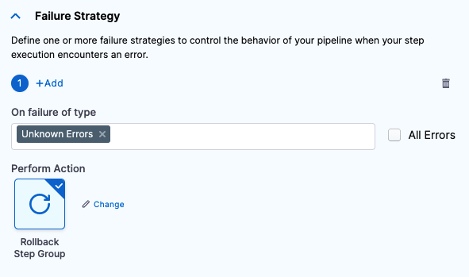

Steps can be added to Pipelines individually or as a step group.

Individual steps and steps in step groups can be run serially or in parallel.

Unlike individual steps, a step group can apply Conditional Execution (skip conditions), Failure Strategy, and Rollback steps to all steps in the group.

You can also run Pipeline **stages** in parallel. Deploy multiple services simultaneously and perform flow control using Barriers. See [Synchronize Deployments using Barriers](../../cd-deployments-category/synchronize-deployments-using-barriers.md).This topic describes how to add a Step Group in a stage.

## Before You Begin

* [Kubernetes CD Quickstart](../../onboard-cd/cd-quickstarts/kubernetes-cd-quickstart.md)
* [Add a Stage](../../../platform/8_Pipelines/add-a-stage.md)

## Limitations

* Currently, Harness supports step groups in CD stages only. CI stage support is coming soon.

## Visual Summary

This short video walks through step groups:

<!-- Video:
https://www.youtube.com/watch?v=J5eHYSbE8cg-->
<docvideo src="https://www.youtube.com/watch?v=J5eHYSbE8cg" />

## Review: Common Parallel Steps

Running steps in parallel can be beneficial in many ways, such as:

* Simulating load using multiple [HTTP steps](../../cd-execution/cd-general-steps/using-http-requests-in-cd-pipelines.md).
* Running multiple [Verify steps](../../cd-execution/cv-category/verify-deployments-with-the-verify-step.md) for different providers (AppDynamics, Splunk, Prometheus, etc).
* Running independent steps that don't need to be run serially.
* Running multiple Kubernetes [Apply](../cd-k8s-ref/kubernetes-apply-step.md) steps to deploy multiple Kubernetes resources at once.
* [Deleting](../../cd-execution/kubernetes-executions/delete-kubernetes-resources.md) multiple resources at once.
* Creating or updating multiple Jira issues using [Jira Create](../../cd-advanced/ticketing-systems-category/create-jira-issues-in-cd-stages.md) and [Jira Update](../../cd-advanced/ticketing-systems-category/update-jira-issues-in-cd-stages.md).
* Provisioning multiple resources using Terraform. See [Provision with the Terraform Apply Step](../../cd-advanced/terraform-category/run-a-terraform-plan-with-the-terraform-apply-step.md).
* Save time. You might have 5 steps but you can run steps 2 and 3 in parallel because they are independent. Step 4 is run once they have completed.

## Step 1: Add and Name the Step Group

In your stage, in **Execution**, click **Add Step** and then click **Step Group**.

The step group setting appear.

Enter a name for the step group.

## Option: Conditional Execution

A step group can have its own Conditional Execution settings separate from the Conditional Execution settings for the Stage. The Conditional Execution settings of the step group apply to all of its steps.

See [Step Skip Condition Settings](../../../platform/8_Pipelines/w_pipeline-steps-reference/step-skip-condition-settings.md).

The Conditional Execution settings of any step in a step group overrides the Conditional Execution settings of the step group.

If you do not use step group Conditional Execution settings, then the Stage's Conditional Execution settings are used.

## Option: Step Group Failure Strategy

A step group can have its own Failure Strategy separate from the Failure Strategy for the Stage.

The Failure Strategy can execute the Rollback steps for the step group.

The step group Rollback steps are only run if the Failure Strategy for the step group has **Rollback Step Group** selected.

See [Step Failure Strategy Settings](../../../platform/8_Pipelines/w_pipeline-steps-reference/step-failure-strategy-settings.md).

The Failure Strategy of any step in a step group overrides the Failure Strategy of the step group.

If you do not use a step group Failure Strategy, then the Stage's Failure Strategy is used.

## Step 2: Add Steps to the Step Group

Once the step group is added, in its **Execution** section, in the new step group, click **Add Step**.

Add any step and configure its **Advanced** settings.

A step's **Advanced** settings override the **Advanced** settings of the step group.

## Step 3: Add Rollback Steps

A step group can have its own Rollback steps separate from the Rollback steps for the Stage.

The step group Rollback steps are only run if the Failure Strategy for the step group has **Rollback Step Group** selected.

In the step group, click the Execution/Rollback toggle:

In the Rollback view, click **Add Step** to add a rollback step.

For example, you can use the Rolling Rollback step for a [Kubernetes Rollback](../cd-k8s-ref/kubernetes-rollback.md).

## Review: Reference Step Group Steps

You reference steps in step groups using the step group Id.

The FQN format is:

`<+pipeline.stages.[stage Id].spec.execution.steps.[step group Id].steps.[step Id].[step setting name]>`

For example, to reference the URL setting in an HTTP step in a step group with the Id `Group1`, the FQN would be:

`<+pipeline.stages.HTTP.spec.execution.steps.Group1.steps.OPTIONS.spec.url>`

## Notes

* When you run steps in parallel you cannot reference the outputs of one step in another step. The output for one step might not be available when another step requests it.
* Delegate Selectors can be configured for each step in the step group. You cannot configure a Delegate Selector at the group level.
* Step groups cannot have nested step groups, but you can put groups of steps next to each other in a step group:

The steps **in** each group run in parallel but each group runs serially.

