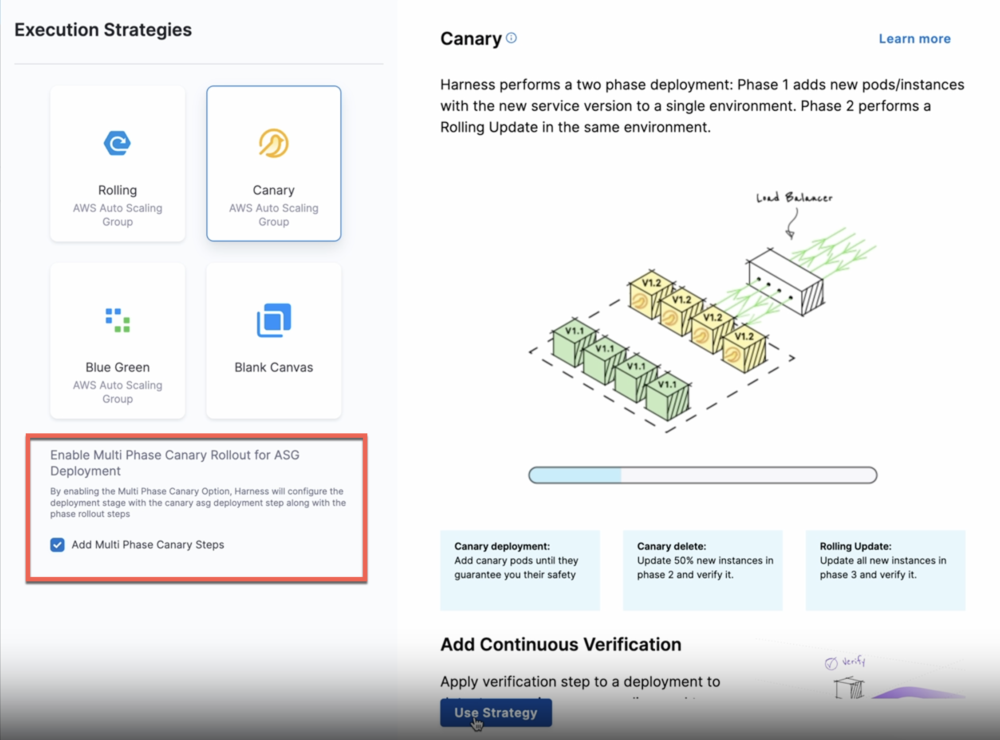
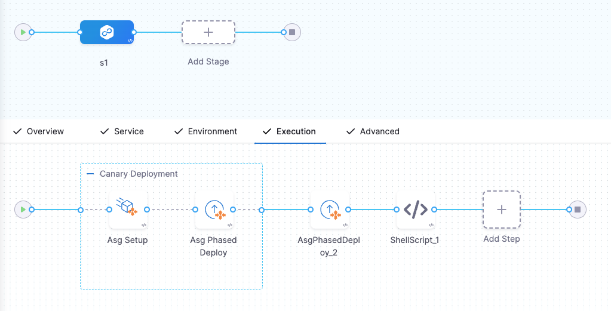
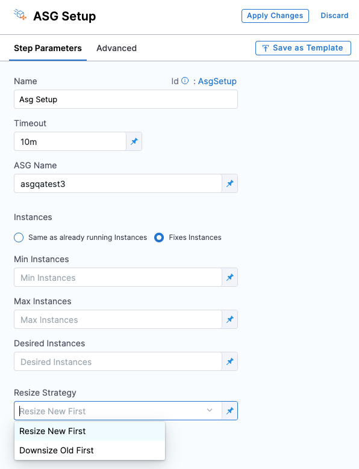
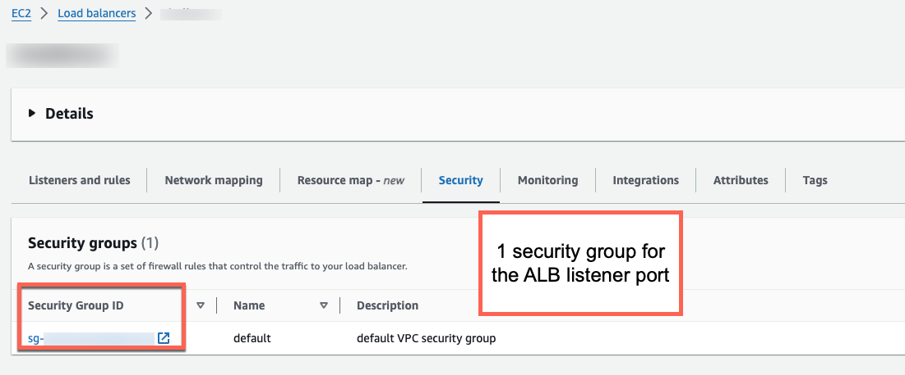
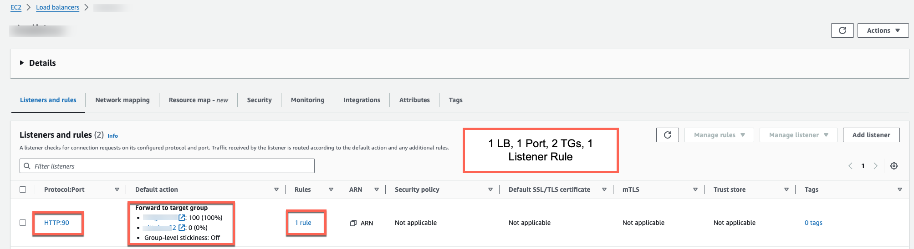

This topic explains how to deploy new AWS Auto Scale Groups (ASGs) and instances to Amazon Elastic Compute Cloud (EC2) using Harness.

## Deployment summary

Here's a high-level summary of the setup steps and how Harness deploys ASGs.

<details>
<summary>Harness setup summary</summary>

Here's a summary of how you set up ASG deployments in Harness:

1. Create the Harness ASG service.
   1. Add the launch template manifest file. 
   2. Add the ASG configuration manifest file. 
   3. Add scaling policies (optional).
   4. Add scheduled update group actions (optional).
   5. Add the user data script file (optional). 
   6. Add the AMI image to use for the ASG as an artifact.
2. Create the Harness ASG environment.
   1. Connect Harness to the AWS region where you want to deploy.
3. Define the Harness ASG pipeline execution.
   1. Select a deployment strategy (rolling, canary, blue-green) and Harness automatically creates the steps to deploy the new ASG.
4. Deploy the Harness pipeline.

</details>


<details>
<summary>Deployment summary</summary>

Here's a summary of how Harness deploys new ASG versions:

1. First deployment:
   1. Harness takes the launch template and ASG configuration files you provide and creates a new ASG and its instances in your AWS account and region. Harness creates a new launch template with name same as the ASG name and that launch template is applied to the new ASG.  
2. Subsequent deployments:
   1. Harness creates a new version of the launch template.
   2. Harness uses the new version of the launch template and other configurations to update the ASG. For example, if you also increased the desired capacity (`desiredCapacity`) for the ASG in your ASG configuration file, Harness will create a new version of the ASG with the new desired capacity and new launch template version.
   3. Instance refresh is triggered (a rolling replacement of all or some instances in the ASG).

Notes:
- ASG creation differs for rolling and blue green deployments:
  - For rolling, Harness updates the *existing* ASG with the new configuration.
  - For blue green, Harness creates a *new* ASG with a new revision suffix, like `asg-demo__2`. Once there are two ASGs (`asg-demo__1` and `asg-demo__2`) Harness alternately updates these *existing* ASGs with the new configuration on each successive deployment.

</details>

## AWS policy requirements

Your AWS IAM role associated with your Harness AWS connector must have the following required policies: 

<details>
<summary> Required Policies </summary>

Policy JSON:

```json
{
    "Version": "2012-10-17",
    "Statement": [
        {
            "Effect": "Allow",
            "Action": [
                "autoscaling:AttachLoadBalancers",
                "autoscaling:AttachLoadBalancerTargetGroups",
                "autoscaling:CreateAutoScalingGroup",
                "autoscaling:CreateOrUpdateTags",
                "autoscaling:DeleteAutoScalingGroup",
                "autoscaling:DeleteLifecycleHook",
                "autoscaling:DeletePolicy",
                "autoscaling:DeleteScheduledAction",
                "autoscaling:DeleteTags",
                "autoscaling:DescribeAutoScalingGroups",
                "autoscaling:DescribeInstanceRefreshes",
                "autoscaling:DescribeInstanceRefreshes",
                "autoscaling:DescribeLifecycleHooks",
                "autoscaling:DescribeLoadBalancers",
                "autoscaling:DescribeLoadBalancerTargetGroups",
                "autoscaling:DescribePolicies",
                "autoscaling:DescribeScheduledActions",
                "autoscaling:DescribeTags",
                "autoscaling:DetachLoadBalancers",
                "autoscaling:DetachLoadBalancerTargetGroups",
                "autoscaling:PutLifecycleHook",
                "autoscaling:PutScalingPolicy",
                "autoscaling:PutScheduledUpdateGroupAction",
                "autoscaling:SetDesiredCapacity",
                "autoscaling:StartInstanceRefresh",
                "autoscaling:UpdateAutoScalingGroup",
                "ec2:CreateLaunchTemplate",
                "ec2:CreateLaunchTemplateVersion",
                "ec2:DescribeLaunchTemplates",
                "ec2:DescribeLaunchTemplateVersions",
                "ec2:DescribeRegions",
                "ec2:DescribeImages",
                "ec2:RunInstances",
                "elasticloadbalancing:DescribeListeners",
                "elasticloadbalancing:DescribeLoadBalancers",
                "elasticloadbalancing:DescribeRules",
                "elasticloadbalancing:DescribeTargetHealth",
                "elasticloadbalancing:DescribeTargetHealth",
                "elasticloadbalancing:ModifyListener",
                "elasticloadbalancing:ModifyRule"
            ],
            "Resource": "*"
        }
    ]
}
```

</details>

Optionally, you can also give full access with just two policies: 

<details>
<summary>AmazonEC2FullAccess and DescribeRegions</summary>

- **Policy Name:** [AmazonEC2FullAccess](https://us-east-1.console.aws.amazon.com/iam/home#/policies/arn:aws:iam::aws:policy/AmazonEC2FullAccess).
- **Policy ARN:** arn:aws:iam::aws:policy/AmazonEC2FullAccess.
- **Description:** Provides full access to Amazon EC2 via the AWS Management Console.

Policy JSON:

```json
{  
  "Version": "2012-10-17",  
  "Statement": [  
    {  
      "Action": "ec2:*",  
      "Effect": "Allow",  
      "Resource": "*"  
    },  
    {  
      "Effect": "Allow",  
      "Action": "elasticloadbalancing:*",  
      "Resource": "*"  
    },  
    {  
      "Effect": "Allow",  
      "Action": "cloudwatch:*",  
      "Resource": "*"  
    },  
    {  
      "Effect": "Allow",  
      "Action": "autoscaling:*",  
      "Resource": "*"  
    }  
  ]  
}  
```

Harness needs a policy with the `DescribeRegions` action so that it can list the available regions for you when you define your target architecture.


:::note

The [DescribeRegions](https://docs.aws.amazon.com/AWSEC2/latest/APIReference/API_DescribeRegions.html) action is required for all AWS IAM roles used in Harness AWS connectors regardless of what AWS service you are using.

:::

Create a [Customer Managed Policy](https://docs.aws.amazon.com/IAM/latest/UserGuide/access_policies_managed-vs-inline.html#customer-managed-policies), add the `DescribeRegions` action to list those regions, and add that to any role used by the Cloud Provider.

```json
{  
    "Version": "2012-10-17",  
    "Statement": [  
        {  
            "Sid": "VisualEditor0",  
            "Effect": "Allow",  
            "Action": "ec2:DescribeRegions",  
            "Resource": "*"  
        }  
    ]  
}
```

</details>

:::note

Currently, Harness does not support ASG deployments with an OIDC-enabled AWS connector.

:::

## Harness ASG services

The Harness ASG service contains the following:

- Launch template.
- ASG configuration file.
- Scaling policies (optional).
- Scheduled update group action (optional).
- User Data script file.
- The AMI image to use for the ASG.

Harness supports standard ASG JSON formatted files. For more information, go to [Get started with Amazon EC2 Auto Scaling](https://docs.aws.amazon.com/autoscaling/ec2/userguide/get-started-with-ec2-auto-scaling.html) from AWS.

You can use remote files stored in a Git repo or the [Harness File Store](/docs/continuous-delivery/x-platform-cd-features/services/add-inline-manifests-using-file-store).

:::note

You can create a service when you are building the pipeline or separately in **Services**. In this topic, we walk through building the service separately. For more information, go to [CD pipeline modeling overview](/docs/continuous-delivery/get-started/cd-pipeline-modeling-overview).

:::


import Tabs from '@theme/Tabs';
import TabItem from '@theme/TabItem';


<Tabs>
  <TabItem value="YAML" label="YAML" default>


Here's an example where the configuration files are stored in the [Harness File Store](/docs/continuous-delivery/x-platform-cd-features/services/add-inline-manifests-using-file-store).

```yaml
service:
  name: svc-asg
  identifier: svcasg
  serviceDefinition:
    type: Asg
    spec:
      manifests:
        - manifest:
            identifier: launchTemplate
            type: AsgLaunchTemplate
            spec:
              store:
                type: Harness
                spec:
                  files:
                    - /asg/launchtemplate
        - manifest:
            identifier: launchConfig
            type: AsgConfiguration
            spec:
              store:
                type: Harness
                spec:
                  files:
                    - /asg/launchconfig
        - manifest:
            identifier: scalePolicy
            type: AsgScalingPolicy
            spec:
              store:
                type: Harness
                spec:
                  files:
                    - /asg/scalingPolicy.json
        - manifest:
            identifier: scheduledUpdateGroupAction
            type: AsgScheduledUpdateGroupAction
            spec:
              store:
                type: Harness
                spec:
                  files:
                    - /asg/scheduledUpdateGroupAction.json
      artifacts:
        primary:
          primaryArtifactRef: <+input>
          sources:
            - identifier: AMI-ARTIFACT
              spec:
                connectorRef: AWS_ASG_CONNECTOR
                region: us-east-1
                filters:
                  - name: ami-name
                    value: Returns local IP address at port 80
                version: Returns local IP address at port 80
              type: AmazonMachineImage
  gitOpsEnabled: false
```


</TabItem>
  <TabItem value="API" label="API">

Create a service using the [Create Services](https://apidocs.harness.io/tag/Services#operation/createServicesV2) API.

```yaml
curl -i -X POST \
  'https://app.harness.io/gateway/ng/api/servicesV2/batch?accountIdentifier=<Harness account Id>' \
  -H 'Content-Type: application/json' \
  -H 'x-api-key: <Harness API key>' \
  -d '[{
    "identifier": "svcasg",
    "orgIdentifier": "default",
    "projectIdentifier": "CD_Docs",
    "name": "svc-asg",
    "description": "string",
    "tags": {
      "property1": "string",
      "property2": "string"
    },
    "yaml": "service:\n  name: svc-asg\n  identifier: svcasg\n  serviceDefinition:\n    type: Asg\n    spec:\n      manifests:\n        - manifest:\n            identifier: launchTemplate\n            type: AsgLaunchTemplate\n            spec:\n              store:\n                type: Harness\n                spec:\n                  files:\n                    - /asg/launchtemplate\n        - manifest:\n            identifier: launchConfig\n            type: AsgConfiguration\n            spec:\n              store:\n                type: Harness\n                spec:\n                  files:\n                    - /asg/launchconfig\n        - manifest:\n            identifier: scalePolicy\n            type: AsgScalingPolicy\n            spec:\n              store:\n                type: Harness\n                spec:\n                  files:\n                    - /asg/scalingPolicy.json\n        - manifest:\n            identifier: scheduledUpdateGroupAction\n            type: AsgScheduledUpdateGroupAction\n            spec:\n              store:\n                type: Harness\n                spec:\n                  files:\n                    - /asg/scheduledUpdateGroupAction.json\n      artifacts:\n        primary:\n          primaryArtifactRef: <+input>\n          sources:\n            - identifier: AMI-ARTIFACT\n              spec:\n                connectorRef: AWS_ASG_CONNECTOR\n                region: us-east-1\n                filters:\n                  - name: ami-name\n                    value: Returns local IP address at port 80\n                version: Returns local IP address at port 80\n              type: AmazonMachineImage\n  gitOpsEnabled: false"
  }]'
```


</TabItem>
  <TabItem value="Terraform Provider" label="Terraform Provider">


For the Terraform Provider resource, go to [harness_platform_service](https://registry.terraform.io/providers/harness/harness/latest/docs/resources/platform_service).


```yaml
resource "harness_platform_service" "example" {
  identifier  = "identifier"
  name        = "name"
  description = "test"
  org_id      = "org_id"
  project_id  = "project_id"

  ## SERVICE V2 UPDATE
  ## We now take in a YAML that can define the service definition for a given Service
  ## It isn't mandatory for Service creation 
  ## It is mandatory for Service use in a pipeline

  yaml = <<-EOT
                service:
                  name: svc-asg
                  identifier: svcasg
                  serviceDefinition:
                    type: Asg
                    spec:
                      manifests:
                        - manifest:
                            identifier: launchTemplate
                            type: AsgLaunchTemplate
                            spec:
                              store:
                                type: Harness
                                spec:
                                  files:
                                    - /asg/launchtemplate
                        - manifest:
                            identifier: launchConfig
                            type: AsgConfiguration
                            spec:
                              store:
                                type: Harness
                                spec:
                                  files:
                                    - /asg/launchconfig
                        - manifest:
                            identifier: scalePolicy
                            type: AsgScalingPolicy
                            spec:
                              store:
                                type: Harness
                                spec:
                                  files:
                                    - /asg/scalingPolicy.json
                        - manifest:
                            identifier: scheduledUpdateGroupAction
                            type: AsgScheduledUpdateGroupAction
                            spec:
                              store:
                                type: Harness
                                spec:
                                  files:
                                    - /asg/scheduledUpdateGroupAction.json
                      artifacts:
                        primary:
                          primaryArtifactRef: <+input>
                          sources:
                            - identifier: AMI-ARTIFACT
                              spec:
                                connectorRef: AWS_ASG_CONNECTOR
                                region: us-east-1
                                filters:
                                  - name: ami-name
                                    value: Returns local IP address at port 80
                                version: Returns local IP address at port 80
                              type: AmazonMachineImage
                  gitOpsEnabled: false
              EOT
}
```


</TabItem>  
  <TabItem value="Harness Manager" label="Harness Manager">


To configure a Harness ASG service in the Harness Manager, do the following:

1. In your project, in CD (Deployments), select **Services**.
2. Select **Manage Services**, and then select **New Service**.
3. Enter a name for the service and select **Save**.
4. Select **Configuration**.
5. In **Service Definition**, select **AWS Auto Scaling Group**.
6. In **AWS ASG Configurations**, enter the following configuration files. 
  Only **Launch Template** and **ASG Configuration** are required.
   1. [Launch template](https://docs.aws.amazon.com/autoscaling/ec2/userguide/create-launch-template.html). Enter a standard AWS JSON or YAML formatted launch template. 
   2. In **ASG Configuration**, add a [ASG configuration file](https://docs.aws.amazon.com/codedeploy/latest/userguide/tutorials-auto-scaling-group-create-auto-scaling-group.html#tutorials-auto-scaling-group-create-auto-scaling-group-cli).
   3. [Scaling policy](https://docs.aws.amazon.com/autoscaling/ec2/userguide/examples-scaling-policies.html). This is optional.
   
   This is the same as the **Automatic scaling** option in the ASG console setup:

     

   1. [Scheduled update group action](https://docs.aws.amazon.com/autoscaling/ec2/userguide/ec2-auto-scaling-scheduled-scaling.html). This is optional.
   
   This is the same as the scheduled action in the ASG console setup:
   
     
   
   Next, in **Artifacts**, you add the private AMI image to use for the ASG instances.
7. In **Artifacts**, select **Add Artifact Source**.
8. In **Specify Artifact Repository Type**, select **Amazon Machine Image**, and select **Continue**.
9. In **Amazon Machine Image Repository**, in **AWS Connector**, select or create a Harness AWS connector, and then select **Continue**. Review [AWS policy requirements](#aws-policy-requirements) to ensure that the AWS credentials you provide are adequate.
10. In **Artifact Details**, enter a name to identify this AMI artifact in Harness.
11. In **Region**, select the region where the ASG is located.
12. In **AMI Tags**, add any AWS Tags that you are using to identify your AMI. For details on these key/value pairs, go to [Tagging Your Amazon EC2 Resources](https://docs.aws.amazon.com/AWSEC2/latest/UserGuide/Using_Tags.html) from AWS.
13. In **AMI Filters**, add AMI filters to locate the AMI resource. These are key/value pairs that identify the AMI Id. This must be a private AMI.
14. In **Version Details** and **Version**, specify the AMI version to use.
15. Select **Submit**.
16. Select **Save** to save the service.
    
    The Harness ASG service is complete. You can now use it in your Harness ASG pipelines.


</TabItem>
</Tabs>


### ASG Launch Template files

AWS does not have a dedicated public resource for Launch Template file formatting because Launch template creation is typically done using the AWS CLI, SDKs, or Management Console, which have their own syntax and methods for specifying the parameters. However, the AWS CLI [create-launch-template](https://docs.aws.amazon.com/cli/latest/reference/ec2/create-launch-template.html) command reference documentation provides a detailed description of the parameters that can be used when creating a launch template.

<details>
<summary>ASG Launch Template file example</summary>

```json
{
  "LaunchTemplateData": {
    "InstanceType": "t2.micro",
    "KeyName": "vit-cd-play"
  }
}
```
</details>


### ASG configuration files

AWS does not have a dedicated public resource for ASG configuration file formatting because ASG creation is typically done using the AWS CLI, SDKs, or Management Console, which have their own syntax and methods for specifying the parameters.

However, the AWS CLI [create-auto-scaling-group](https://docs.aws.amazon.com/cli/latest/reference/autoscaling/create-auto-scaling-group.html) command reference documentation provides a detailed description of the parameters that can be used when creating an ASG.

<details>
<summary>ASG configuration file example</summary>

```json
{
  "AutoScalingGroupName": "my-asg",
  "MinSize": 1,
  "MaxSize": 3,
  "DesiredCapacity": 2,
  "AvailabilityZones": ["us-west-2a", "us-west-2b"],
  "LaunchTemplate": {
    "LaunchTemplateId": "lt-0123456789abcdef0",
    "Version": "1"
  },
  "VPCZoneIdentifier": "subnet-0123456789abcdef0,subnet-0123456789abcdef1",
  "HealthCheckType": "EC2",
  "HealthCheckGracePeriod": 300,
  "Tags": [
    {
      "Key": "Environment",
      "Value": "Development",
      "PropagateAtLaunch": true
    }
  ]
}
```
</details>


### User Data

You can add standard AWS AMI user data to enter configuration scripts and directives that your AWS instance will run upon launch.

The resulting User Data container corresponds to the AWS Launch Instance wizard's **Advanced Details** > **User data** container.

The user data can be added using the Harness File Store or any Git provider.

- **What can I add in user data?** You can enter the same shell scripts and cloud-init directives that AWS will accept through its own UI. For details about scripting requirements, formatting, and options, see Amazon's EC2 [User Data and Shell Scripts](https://docs.aws.amazon.com/AWSEC2/latest/UserGuide/user-data.html#user-data-shell-scripts) documentation. When Harness creates a new instance, it will apply your defined user data.
- **Permissions for your user data:** If your user data is going to perform actions that require permissions, ensure that the IAM role assigned to the Harness Delegate(s) has the required roles and policies.

### Scaling Policy

Add a scaling policy to apply to the ASG that Harness will create during deployment.

You can use standard AWS scaling policies formatted in JSON. For example:

```json
{
  "policyName": "demoPolicy",
  "adjustmentType":"PercentChangeInCapacity",
  "scalingAdjustment":30
}
```

The scaling policy can be added using the Harness File Store or any Git provider.

### Scheduled Update Group Action

You can schedule scaling using a standard AWS scheduled action formatted in JSON. For example: 

```json
{
  "scheduledActionName": "scheduledActionName1",
  "startTime": "2030-03-31T08:00:00Z",
  "desiredCapacity": 2
}
```

The scaling policy can be added using the Harness File Store or any Git provider.

### AMI artifacts

Review the following information about the AMI artifacts you select in your ASG service.

#### Only private AMIs are supported

When you add an AMI artifact you must use a private AMI. Public AMIs from the AMI Catalog are not supported at this time.

In the AWS console, in EC2, private AMIs are listed in **Images** > **AMIs**.

#### Artifact AMI overrides config files AMIs

You can specify an AMI in the launch template used in the Harness service, but it will be overridden by the AMI specified in the Harness service **Artifacts** section.

The AMI specified in the Harness service **Artifacts** section is the same as selecting an AMI in the **Create launch template** wizard in the AWS console or `ImageId` in in the [create-launch-template](https://docs.aws.amazon.com/cli/latest/reference/ec2/create-launch-template.html) CLI command.  

### Using service variables in config file

Service variables are a powerful way to template your services or make them more dynamic.

In the **Variables** section of the service, you can add service variables and then reference them in any of the ASG configuration files you added to the service.

For example, you could create a variable named **desiredCapacity** and set its value as a [fixed value, runtime input, or expression](/docs/platform/variables-and-expressions/runtime-inputs/).

  

Next, in your ASG configuration file, you could reference the variable like this (see `<+serviceVariables.desiredCapacity>`):

```json
{
  "autoScalingGroupName": "lovish2-asg",
  "minSize": 1,
  "maxSize": 3,
  "desiredCapacity": <+serviceVariables.desiredCapacity>,
  "tags": [{"key": "key7", "value":  "value7"}, {"key": "key2", "value":  "value2"}],
  "availabilityZones": ["us-east-1a", "us-east-1b"]
}
```

Now, when you add that service to a pipeline, you will be prompted to enter a value for this variable in the pipeline **Services** tab. The value you provide is then used as the `desiredCapacity` in your ASG configuration.

## Harness ASG environments

The Harness ASG environment is where you specify production and non-production environment settings. 

You also add a infrastructure definition to define the region where you want to deploy the ASG.

:::note

You can create an environment when you are building the pipeline or separately in **Environments**. In this topic, we walk through building the environment separately. For more information, go to [CD pipeline modeling overview](/docs/continuous-delivery/get-started/cd-pipeline-modeling-overview).

:::


import Tabs3 from '@theme/Tabs';
import TabItem3 from '@theme/TabItem';


<Tabs3>
  <TabItem3 value="YAML" label="YAML" default>

Here's a YAML example of an ASG environment.

```yaml
environment:
  name: ASG
  identifier: ASG
  description: ""
  tags: {}
  type: Production
  orgIdentifier: default
  projectIdentifier: myProject
  variables: []
```


  </TabItem3>
  <TabItem3 value="API" label="API">


Create an environment using the [Create Environments](https://apidocs.harness.io/tag/Environments#operation/createEnvironmentV2) API.

```yaml
curl -i -X POST \
  'https://app.harness.io/gateway/ng/api/environmentsV2?accountIdentifier=<account_id>' \
  -H 'Content-Type: application/json' \
  -H 'x-api-key: <token>' \
  -d '{
    "orgIdentifier": "default",
    "projectIdentifier": "CD_Docs",
    "identifier": "ASG",
    "tags": {
      "property1": "",
      "property2": ""
    },
    "name": "ASG",
    "description": "",
    "color": "",
    "type": "PreProduction",
    "yaml": "environment:\n  name: ASG\n  identifier: ASG\n  tags: {}\n  type: PreProduction\n  orgIdentifier: default\n  projectIdentifier: CD_Docs\n  variables: []"
  }'
```


  </TabItem3>
  <TabItem3 value="Terraform Provider" label="Terraform Provider">


For the Terraform Provider resource, go to [harness_platform_environment](https://registry.terraform.io/providers/harness/harness/latest/docs/resources/platform_environment) and [harness_platform_environment_service_overrides](https://registry.terraform.io/providers/harness/harness/latest/docs/resources/platform_environment_service_overrides).

Here's an example of harness_platform_environment: 

```yaml
resource "harness_platform_environment" "example" {
  identifier = "ASG"
  name       = "ASG"
  org_id     = "default"
  project_id = "myproject"
  tags       = ["foo:bar", "baz"]
  type       = "PreProduction"

  ## ENVIRONMENT V2 Update
  ## The YAML is needed if you want to define the Environment Variables and Overrides for the environment
  ## Not Mandatory for Environment Creation nor Pipeline Usage

  yaml = <<-EOT
               environment:
                  name: ASG
                  identifier: ASG
                  description: ""
                  tags: {}
                  type: Production
                  orgIdentifier: default
                  projectIdentifier: myproject
                  variables: []
      EOT
}
```


  </TabItem3>
  <TabItem3 value="Harness Manager" label="Harness Manager">


To create an environment, do the following:

1. In your project, in CD (Deployments), select **Environments**.
2. Select **New Environment**.
3. Enter a name for the new environment.
4. In **Environment Type**, select **Production** or **Pre-Production**.
   The **Production** or **Pre-Production** settings can be used in [Harness RBAC](/docs/platform/role-based-access-control/rbac-in-harness) to restrict who can deploy to these environments.
5. Select **Save**. The new environment is created.

Pipelines require that an environment have an infrastructure definition. We'll cover that next.


  </TabItem3>
</Tabs3>


## Define the infrastructure

You define the target infrastructure for your deployment in the **Environment** settings of the pipeline stage. You can define an environment separately and select it in the stage, or create the environment within the stage **Environment** tab.

There are two methods of specifying the deployment target infrastructure:

- **Pre-existing:** the target infrastructure already exists and you simply need to provide the required settings.
- **Dynamically provisioned:** the target infrastructure will be dynamically provisioned on-the-fly as part of the deployment process.

For details on Harness provisioning, go to [Provisioning overview](/docs/continuous-delivery/cd-infrastructure/provisioning-overview).

### Pre-existing ASG infrastructure

To define the target ASG region, you add an infrastructure definition to a Harness environment. The infrastructure definition uses a Harness AWS connector and a region setting to define the deployment target.

You can use the same AWS connector you used when adding the AMI artifact in the Harness service. Ensure the AWS IAM user in the AWS connector credentials meets the [AWS policy requirements](#aws-policy-requirements).


import Tabs1 from '@theme/Tabs';
import TabItem1 from '@theme/TabItem';


<Tabs1>
  <TabItem1 value="YAML" label="YAML" default>


Here's a YAML example of an ASG infrastructure definition.

```yaml
infrastructureDefinition:
  name: asg-infra
  identifier: asginfra
  description: ""
  tags: {}
  orgIdentifier: default
  projectIdentifier: DoNotDelete_IvanBalan
  environmentRef: ASG
  deploymentType: Asg
  type: Asg
  spec:
    connectorRef: AWS_ASG_CONNECTOR
    region: us-east-1
  allowSimultaneousDeployments: false
```


  </TabItem1>
  <TabItem1 value="API" label="API">


Create an infrastructure definition using the [Create Infrastructure](https://apidocs.harness.io/tag/Infrastructures#operation/createInfrastructure) API.

```yaml
curl -i -X POST \
  'https://app.harness.io/gateway/ng/api/infrastructures?accountIdentifier=<account_Id>' \
  -H 'Content-Type: application/json' \
  -H 'x-api-key: <token>' \
  -d '{
    "identifier": "asginfra",
    "orgIdentifier": "default",
    "projectIdentifier": "CD_Docs",
    "environmentRef": "ASG",
    "name": "asginfra",
    "description": "",
    "tags": {
      "property1": "1",
      "property2": "2"
    },
    "type": "Asg",
    "yaml": "infrastructureDefinition:\n  name: asginfra\n  identifier: asginfra\n  description: \"\"\n  tags: {}\n  orgIdentifier: default\n  projectIdentifier: CD_Docs\n  environmentRef: ASG\n  deploymentType: Asg\n  type: Asg\n  spec:\n    connectorRef: AWS_ASG\n    region: us-east-2\n  allowSimultaneousDeployments: false"
  }'
```


  </TabItem1>
  <TabItem1 value="Terraform Provider" label="Terraform Provider">


For the Terraform Provider resource, go to [harness_platform_infrastructure](https://registry.terraform.io/providers/harness/harness/latest/docs/resources/platform_infrastructure).

Here's an example of harness_platform_infrastructure:

```json
resource "harness_platform_infrastructure" "example" {
  identifier      = "asginfra"
  name            = "asginfra"
  org_id          = "default"
  project_id      = "CD_Docs"
  env_id          = "ASG"
  type            = "Asg"
  deployment_type = "Asg"
  yaml            = <<-EOT
        infrastructureDefinition:
          name: asginfra
          identifier: asginfra
          description: ""
          tags: {}
          orgIdentifier: default
          projectIdentifier: CD_Docs
          environmentRef: ASG
          deploymentType: Asg
          type: Asg
          spec:
            connectorRef: AWS_ASG
            region: us-east-2
          allowSimultaneousDeployments: false
      EOT
}
```


  </TabItem1>
  <TabItem1 value="Harness Manager" label="Harness Manager">


To create the ASG infrastructure definition in an environment, do the following:

1. In your project, in CD (Deployments), select **Environments**.
2. Select the environment where you want to add the infrastructure definition.
3. In the environment, select **Infrastructure Definitions**.
4. Select **Infrastructure Definition**.
5. In **Create New Infrastructure**, in **Name**, enter a name for the new infrastructure definition.
6. In **Deployment Type**, select **AWS Auto Scaling Group**.
7. In **AWS Details**, in Connector, select or create a Harness AWS connector that connects Harness with the account where you want the ASG deployed.
   
   You can use the same AWS connector you used when adding the AMI artifact in the Harness service. Ensure the AWS IAM user in the AWS connector credentials meets the [AWS policy requirements](#aws-policy-requirements).
8. In **Region**, select the AWS region where you want the ASG deployed.
9. Optionally, in **Base ASG**, select an existing ASG as the base for new ASG deployments. Harness then clones the base ASG as a template to create a new ASG for the deployment. 
10. Select **Save**.

The infrastructure definition is added.


  </TabItem1>
</Tabs1>


### Dynamically provisioned ASG infrastructure

Here's a summary of the steps to dynamically provision the target infrastructure for a deployment:

1. **Add dynamic provisioning to the CD stage**:
   1. In a Harness Deploy stage, in **Environment**, enable the option **Provision your target infrastructure dynamically during the execution of your Pipeline**.
   2. Select the type of provisioner that you want to use.
   
      Harness automatically adds the provisioner steps for the provisioner type you selected.
   3. Configure the provisioner steps to run your provisioning scripts.
   4. Select or create a Harness infrastructure in **Environment**.
2. **Map the provisioner outputs to the Infrastructure Definition**:
   1. In the Harness infrastructure, enable the option **Map Dynamically Provisioned Infrastructure**.
   2. Map the provisioning script/template outputs to the required infrastructure settings.

#### Supported provisioners

The following provisioners are supported for Lambda deployments:

- Terraform
- Terragrunt
- Terraform Cloud
- CloudFormation
- Shell Script

#### Adding dynamic provisioning to the stage

To add dynamic provisioning to a Harness pipeline Deploy stage, do the following:

1. In a Harness Deploy stage, in **Environment**, enable the option **Provision your target infrastructure dynamically during the execution of your Pipeline**.
2. Select the type of provisioner that you want to use.
   
   Harness automatically adds the necessary provisioner steps.
3. Set up the provisioner steps to run your provisioning scripts.

For documentation on each of the required steps for the provisioner you selected, go to the following topics:

- Terraform:
  - [Terraform Plan](/docs/continuous-delivery/cd-infrastructure/terraform-infra/run-a-terraform-plan-with-the-terraform-plan-step)
  - [Terraform Apply](/docs/continuous-delivery/cd-infrastructure/terraform-infra/run-a-terraform-plan-with-the-terraform-apply-step)
  - [Terraform Rollback](/docs/continuous-delivery/cd-infrastructure/terraform-infra/rollback-provisioned-infra-with-the-terraform-rollback-step). To see the Terraform Rollback step, toggle the **Rollback** setting.
- [Terragrunt](/docs/continuous-delivery/cd-infrastructure/terragrunt-howtos)
- [Terraform Cloud](/docs/continuous-delivery/cd-infrastructure/terraform-infra/terraform-cloud-deployments)
- CloudFormation:
  - [Create Stack](/docs/continuous-delivery/cd-infrastructure/cloudformation-infra/provision-with-the-cloud-formation-create-stack-step)
  - [Delete Stack](/docs/continuous-delivery/cd-infrastructure/cloudformation-infra/remove-provisioned-infra-with-the-cloud-formation-delete-step)
  - [Rollback Stack](/docs/continuous-delivery/cd-infrastructure/cloudformation-infra/rollback-provisioned-infra-with-the-cloud-formation-rollback-step). To see the Rollback Stack step, toggle the **Rollback** setting.
- [Shell Script](/docs/continuous-delivery/cd-infrastructure/shell-script-provisioning)


#### Mapping provisioner output

Once you set up dynamic provisioning in the stage, you must map outputs from your provisioning script/template to specific settings in the Harness Infrastructure Definition used in the stage.

1. In the same CD Deploy stage where you enabled dynamic provisioning, select or create (**New Infrastructure**) a Harness infrastructure.
2. In the Harness infrastructure, in **Select Infrastructure Type**, select **AWS** if it is not already selected.
3. Enable the option **Map Dynamically Provisioned Infrastructure**.
   
   A **Provisioner** setting is added and configured as a runtime input.
4. Map the provisioning script/template outputs to the required infrastructure settings.

To provision the target deployment infrastructure, Harness needs specific infrastructure information from your provisioning script. You provide this information by mapping specific Infrastructure Definition settings in Harness to outputs from your template/script.

For ASG, Harness needs the following settings mapped to outputs:

- **Base ASG:** The base ASG is not used in the deployment. It is simply cloned in order for Harness to create a new ASG. Harness will use this existing ASG as a template, but it will not resize it all. The newly created ASG will have unique name, Min and Max instances, and Desired Capacity.

In the Harness Infrastructure Definition, in **Base ASG**, select the ASG to use as the base ASG.

<DocImage path={require('./static/8705496ace1f6b040eccc5b1fe4d6dae3b21cedb37ab383680b39ad41510c417.png')} width="60%" height="60%" title="Click to view full size image" />  


## Harness ASG pipelines

Once you have the service and environment created, you can create the pipeline.

:::note

You can create a service and environment when you are building the pipeline or separately in **Services** and **Environments**. In this topic, we walk through building these separately. For more information, go to [CD pipeline modeling overview](/docs/continuous-delivery/get-started/cd-pipeline-modeling-overview).

:::

The pipeline models the release process using execution steps, triggers, and other settings. For more information, go to [CD pipeline modeling overview](/docs/continuous-delivery/get-started/cd-pipeline-modeling-overview).


import Tabs2 from '@theme/Tabs';
import TabItem2 from '@theme/TabItem';


<Tabs2>
  <TabItem2 value="YAML" label="YAML" default>


Here's a pipeline with a service, environment, and ASG Rolling Deploy and ASG Rolling Rollback steps:

```yaml
pipeline:
  projectIdentifier: CD_Docs
  orgIdentifier: default
  tags: {}
  stages:
    - stage:
        name: DeployRolling
        identifier: Deploy
        description: ""
        type: Deployment
        spec:
          deploymentType: Asg
          service:
            serviceRef: svcasg
            serviceInputs:
              serviceDefinition:
                type: Asg
                spec:
                  artifacts:
                    primary:
                      primaryArtifactRef: <+input>
                      sources: <+input>
                  variables:
                    - name: desiredCapacity
                      type: String
                      value: <+input>
          environment:
            environmentRef: ASG
            deployToAll: false
            infrastructureDefinitions:
              - identifier: asginfra
          execution:
            steps:
              - step:
                  name: ASG Rolling Deploy
                  identifier: AsgRollingDeploy
                  type: AsgRollingDeploy
                  timeout: 10m
                  spec:
                    useAlreadyRunningInstances: false
                    skipMatching: true
            rollbackSteps:
              - step:
                  type: AsgRollingRollback
                  name: ASG Rolling Rollback
                  identifier: ASG_Rolling_Rollback
                  spec: {}
                  timeout: 10m
        tags: {}
        failureStrategies:
          - onFailure:
              errors:
                - AllErrors
              action:
                type: StageRollback
  identifier: ASGROLLING
  name: ASG-ROLLING
```


  </TabItem2>
  <TabItem2 value="API" label="API">


Create a pipeline using the [Create Pipeline](https://apidocs.harness.io/tag/Pipeline/#operation/postPipelineV2) API.

```json
curl -i -X POST \
  'https://app.harness.io/gateway/pipeline/api/pipelines/v2?accountIdentifier=<account_Id>&orgIdentifier=<org_Id>&projectIdentifier=<project_Id>' \
  -H 'Content-Type: application/yaml' \
  -H 'x-api-key: <token>' \
  -d 'pipeline:
    name: ASG Rolling
    identifier: ASG_Rolling
    projectIdentifier: CD_Docs
    orgIdentifier: default
    tags: {}
    stages:
      - stage:
          name: ASG Rolling
          identifier: ASG_Rolling
          description: ""
          type: Deployment
          spec:
            deploymentType: Asg
            service:
              serviceRef: AMI_Example
            environment:
              environmentRef: ASG
              deployToAll: false
              infrastructureDefinitions:
                - identifier: ASG_Infra
            execution:
              steps:
                - step:
                    name: Asg Rolling Deploy
                    identifier: AsgRollingDeploy
                    type: AsgRollingDeploy
                    timeout: 10m
                    spec:
                      useAlreadyRunningInstances: false
              rollbackSteps:
                - step:
                    name: Asg Rolling Rollback
                    identifier: AsgRollingRollback
                    type: AsgRollingRollback
                    timeout: 10m
                    spec: {}
          tags: {}
          failureStrategies:
            - onFailure:
                errors:
                  - AllErrors
                action:
                  type: StageRollback'
```


  </TabItem2>
  <TabItem2 value="Terraform Provider" label="Terraform Provider">


For the Terraform Provider resource, go to [harness_platform_pipeline](https://registry.terraform.io/providers/harness/harness/latest/docs/resources/platform_pipeline).

```json
resource "harness_platform_pipeline" "example" {
  identifier = "ASG_Rolling"
  org_id     = "default"
  project_id = "CD_Docs"
  name       = "ASG Rolling"
  yaml = <<-EOT
      pipeline:
        name: ASG Rolling
        identifier: ASG_Rolling
        projectIdentifier: CD_Docs
        orgIdentifier: default
        tags: {}
        stages:
          - stage:
              name: ASG Rolling
              identifier: ASG_Rolling
              description: ""
              type: Deployment
              spec:
                deploymentType: Asg
                service:
                  serviceRef: AMI_Example
                environment:
                  environmentRef: ASG
                  deployToAll: false
                  infrastructureDefinitions:
                    - identifier: ASG_Infra
                execution:
                  steps:
                    - step:
                        name: Asg Rolling Deploy
                        identifier: AsgRollingDeploy
                        type: AsgRollingDeploy
                        timeout: 10m
                        spec:
                          useAlreadyRunningInstances: false
                  rollbackSteps:
                    - step:
                        name: Asg Rolling Rollback
                        identifier: AsgRollingRollback
                        type: AsgRollingRollback
                        timeout: 10m
                        spec: {}
              tags: {}
              failureStrategies:
                - onFailure:
                    errors:
                      - AllErrors
                    action:
                      type: StageRollback
  EOT
}
```


  </TabItem2>
  <TabItem2 value="Harness Manager" label="Harness Manager">


To create an ASG pipeline, do the following:

1. In your project, in CD (Deployments), click **Pipelines**.
2. Select **Create a Pipeline**.
3. Enter a name for the pipeline and select **Start**.
4. Select **Add Stage**, and then select **Deploy**.
5. Enter a name for the stage.
6. In **Deployment Type**, select **AWS Auto Scaling Group**, and then select **Set Up Stage**.
7. In **Service**, select the service you created earlier, and then select **Continue**.
8. In **Environment**, select the environment you created earlier.
9. In **Specify Infrastructure**, select the infrastructure definition you created earlier, and then select **Continue**.
10. In **Execution Strategies**, select the execution strategy for your deployment, and then select **Use Strategy**.
    
    The steps for the deployment are generated automatically by Harness. You can add any additional steps you want by selecting **Add Step**.

    In **Rollback**, you can see the rollback steps.
11. Select **Save**. The pipeline is saved.


  </TabItem2>
</Tabs2>


## ASG pipeline execution strategies

Harness ASG deployments support the following [deployment strategies](/docs/continuous-delivery/manage-deployments/deployment-concepts):

- Rolling
- Canary
- Blue Green

### Rolling

The first ASG rolling deployment will deploy a new ASG with the number of desired instances you have defined in your ASG configuration file in the Harness service used in the pipeline. Any other configuration files in the service are also applied.

Subsequent deployments will deploy a new version of the same ASG with any changes you have made in the Harness service configuration files (launch template, ASG configuration, etc.). This is the same as using the **Edit** buttons in the AWS console and creating a new version of the ASG.

Here's a flowchart that explains how Harness performs rolling deployments:

<details>
<summary>Rolling deployments flowchart</summary>


</details>


import Tabs4 from '@theme/Tabs';
import TabItem4 from '@theme/TabItem';


<Tabs4>
  <TabItem4 value="Rolling Deploy step" label="Rolling Deploy step">


The Rolling Deploy step has the following options:

- **ASG Name:** Enter a name for the ASG that Harness will create.
- **Same as already running Instances** or **Fixed**:
  - Select **Fixed** to enforce a Max, Min, and Desired number of instances.Select **Same as already running Instances** to use scaling settings on the last ASG deployed by this Harness pipeline. If this is the first deployment and you select **Same as already running Instances**, Harness uses a default of Min 0, Desired 6, and Max 10. Harness does not use the Min, Max, and Desired settings of the base ASG.
- **Minimum Healthy Percentage (optional)**
  - The percentage of the desired capacity of the ASG that must pass the group's health checks before the refresh can continue. For more information, go to [Health checks for Auto Scaling instances](https://docs.aws.amazon.com/autoscaling/ec2/userguide/ec2-auto-scaling-health-checks.html) from AWS. If not specified, harness sets the default value for this field as 90% during rolling deployment and 100% during rollback.
- **Maximum Healthy Percentage (optional)**
  - The percentage of the desired capacity of the ASG that your ASG can increase to when replacing instances. For more information, go to [Instance refresh core concepts](https://docs.aws.amazon.com/autoscaling/ec2/userguide/instance-refresh-overview.html#instance-refresh-core-concepts) from AWS. If not specified, harness sets the default value for this field as 110% during rolling deployment and 200% during rollback.
- **Instance Warmup (optional)**
  - Go to [Set the default instance warmup for an Auto Scaling group](https://docs.aws.amazon.com/autoscaling/ec2/userguide/ec2-auto-scaling-default-instance-warmup.html?icmpid=docs_ec2as_help_panel) from AWS.
- **Skip Matching**
  - Choose whether AWS Auto Scaling skips replacing instances that match the desired configuration. If no desired configuration is specified, then it skips replacing instances that have the same launch template and instance types that the ASG was using before the instance refresh started. For more information, go to [Use an instance refresh with skip matching](https://docs.aws.amazon.com/autoscaling/ec2/userguide/asg-instance-refresh-skip-matching.html) from AWS.


<details>
<summary>YAML example</summary>

```yaml
          execution:
            steps:
              - step:
                  name: ASG Rolling Deploy
                  identifier: AsgRollingDeploy
                  type: AsgRollingDeploy
                  timeout: 10m
                  spec:
                    useAlreadyRunningInstances: false
                    skipMatching: true
```

</details>

#### Deployment logs

Here's an example of the log from a successful deployment.

<details>
<summary>ASG Rolling Deploy log example</summary>

```json
Deploy

Starting Rolling Deployment
Creating new version for launchTemplate demo-asg2
Created new version for launchTemplate demo-asg2
Getting Asg demo-asg2
Creating Asg demo-asg2
Waiting for Asg demo-asg2 to reach steady state
Polling every 20 seconds
Getting Asg demo-asg2
Getting Asg demo-asg2
0/2 instances are healthy
Getting Asg demo-asg2
2/2 instances are healthy
Created Asg demo-asg2 successfully
Getting Asg demo-asg2
Modifying scaling policies of Asg demo-asg2
Getting ScalingPolicies for Asg demo-asg2
No policies found which are currently attached with autoscaling group: [demo-asg2] to detach
No scaling policy provided which is needed be attached to autoscaling group: demo-asg2
Modified scaling policies of Asg demo-asg2 successfully
Modifying scheduled actions of autoscaling group demo-asg2
Getting ScheduledUpdateGroupActions for Asg demo-asg2
No scheduled actions found which are currently attached with autoscaling group: [demo-asg2] to detach
Attached scheduled action with name: scheduledActionName1
Modified scheduled actions of autoscaling group demo-asg2 successfully
Starting Instance Refresh for Asg demo-asg2
Waiting for Instance Refresh for Asg demo-asg2 to reach steady state
Polling every 20 seconds
Percentage completed: 0
Waiting for remaining instances to be available. For example: i-03e47024515f6d45a has insufficient data to evaluate its health with Amazon EC2.
Percentage completed: 0
Waiting for remaining instances to be available. For example: i-03e47024515f6d45a has insufficient data to evaluate its health with Amazon EC2.
Percentage completed: 0
Waiting for remaining instances to be available. For example: i-03e47024515f6d45a has insufficient data to evaluate its health with Amazon EC2.
Percentage completed: 0
Waiting for remaining instances to be available. For example: i-03e47024515f6d45a has insufficient data to evaluate its health with Amazon EC2.
Percentage completed: 100
Instance Refresh for Asg demo-asg2 ended successfully
Rolling Deployment Finished Successfully
```

</details>


  </TabItem4>
  <TabItem4 value="Rolling Rollback step" label="Rolling Rollback step">


If deployment failure occurs, the stage or step [failure strategy](/docs/platform/pipelines/failure-handling/define-a-failure-strategy-on-stages-and-steps) is initiated. Typically, this runs the Rolling Rollback step in the **Rollback** section of **Execution**.

During rollback of the first deployment, Harness deletes the ASG.

During rollback of subsequent deployments, Harness reverts the ASG to the previous state of ASG before deployment.

:::info note

During the rollback of the first deployment, Harness restores the ASG template version to the state of the last successful run without deleting it. This enhancement eliminates the downtime caused by the instance refresh during rollbacks, ensuring continuous service availability.
The minimum required delegate version to use this feature is `83900`.

Currently, this feature is behind the feature flag `CDS_ASG_ROLLOUT_ROLLBACK_INSTANCE_REFRESH`. Please contact [Harness support](mailto:support@harness.io) to enable this feature.
:::

Harness stores configurations of the ASG you are deploying twice: 
- First storage: Harness stores the ASG configuration at the start of deployment for rollback *during deployment*.
- Second storage: Harness stores the ASG configuration at the end of deployment for rollbacks *post deployment*.


</TabItem4>
</Tabs4>


### Canary

The ASG canary deployment uses two step groups:

1. Canary Deployment:
   1. **ASG Canary Deploy step:** deploys a new ASG version with the name of your ASG and the extension `__Canary`. The canary ASG version can use the `desiredCapacity` in your ASG configuration file or you can set it in the **Instances** setting in the ASG Canary Deploy step.
   2. **ASG Canary Delete step:** deletes the canary ASG.
2. Primary Deployment:
   1. **ASG Rolling Deploy step:**
      1. The first deployment will deploy a new ASG with the number of desired instances you have defined in your ASG configuration file in the Harness service used in the pipeline. Any other configuration files in the service are also applied.
      2. Subsequent deployments will deploy a new *version* of the same ASG with any changes you have made in the Harness service configuration files (launch template, ASG configuration, etc.). This is the same as using the **Edit** buttons in the AWS console and creating a new version of the ASG.

Here's what the two step groups look like:

  


import Tabs5 from '@theme/Tabs';
import TabItem5 from '@theme/TabItem';


<Tabs5>
  <TabItem5 value="ASG Canary Deploy step" label="ASG Canary Deploy step" default>


The ASG Canary Deploy step deploys a new ASG with the name of your ASG and the extension `__Canary`. 

In the ASG Canary Deploy step, in **Instances**, you can specify how many instances to use in this temporary ASG. 

The **Instances** replaces the `desiredCapacity` in your ASG configuration file.

<details>
<summary>ASG Canary Deploy step log example</summary>

```json
Getting Asg demo-asg2__Canary
Creating launchTemplate demo-asg2__Canary
Created launchTemplate demo-asg2__Canary successfully
Getting Asg demo-asg2__Canary
Creating Asg demo-asg2__Canary
Waiting for Asg demo-asg2__Canary to reach steady state
Polling every 20 seconds
Getting Asg demo-asg2__Canary
Getting Asg demo-asg2__Canary
0/1 instances are healthy
Getting Asg demo-asg2__Canary
1/1 instances are healthy
Created Asg demo-asg2__Canary successfully
Getting Asg demo-asg2__Canary
Deployment Finished Successfully
```

</details>


  </TabItem5>
  <TabItem5 value="ASG Canary Delete step" label="ASG Canary Delete step">


The ASG Canary Delete step deletes the temporary ASG created by the ASG Canary Deploy step.

<details>
<summary>ASG Canary Delete step log example</summary>

```json
Getting Asg demo-asg2__Canary
Deleting Asg demo-asg2__Canary
Waiting for deletion of Asg demo-asg2__Canary to complete
Polling every 20 seconds
Checking if Asg `demo-asg2__Canary` is deleted
Getting Asg demo-asg2__Canary
Checking if Asg `demo-asg2__Canary` is deleted
Getting Asg demo-asg2__Canary
Checking if Asg `demo-asg2__Canary` is deleted
Getting Asg demo-asg2__Canary
Checking if Asg `demo-asg2__Canary` is deleted
Getting Asg demo-asg2__Canary
Deleted Asg demo-asg2__Canary successfully
Deletion Finished Successfully
```
</details>


  </TabItem5>
  <TabItem5 value="ASG Rolling Deploy step" label="ASG Rolling Deploy step">


This is the standard Harness ASG Rolling Deploy step. For details, go to [Rolling](#rolling).


  </TabItem5>
  <TabItem5 value="Rollback steps" label="Rollback steps">


If deployment failure occurs, the stage or step [failure strategy](/docs/platform/pipelines/failure-handling/define-a-failure-strategy-on-stages-and-steps) is initiated. Typically, this runs the rollback steps in the **Rollback** section of **Execution**.

For ASG canary deployments there are two rollback steps:

- **ASG Canary Delete:** deletes the canary ASG (`[app_name]__canary`). 
- **ASG Rolling Rollback:** deletes the new state and returns state to the previous ASG version.


</TabItem5>
</Tabs5>

### Canary phased deployment

You can create a multi-phase workflow that progressively deploy your new instances to a new ASG incrementally using the ASG Phased Deploy step when creating a Canary deployment. 

When you select the Canary execution strategy for your pipeline, make sure to select the **Add Multi Phase Canary Steps** to enable phased deployment. 



A phased deployment uses two step groups:  
1. A Canary phase containing steps that define your ASG, deploy a percentage or partial count of the ASG's instances, and verify this partial deployment. You can add more Canary phases that expand the partial deployment.
2. A Primary phase that deploys your image to the full count of instances defined in your ASG.
   


Here're the steps we build:  

**ASG Setup:** 

This step will remove older non-used ASGs, and create new a new ASG with zero instances and desired launch template configuration. In this step, you can specify how many EC2 instances to launch in the ASG that Harness deploys at the end of the workflow. You can also specify the resizing order and steady state timeout of the instances.

The instance can be **Fixed Instances** and **Same as already running instances**. If you select same as already running instances, then Harness fetches the minimum, maximum, and desired capacity of current live ASG and use that for configuring this step.

There are two resize options:  
* Resize New First: Select to resize new ASG first and then downsize older ASG.
* Downsize Old First: Select to downsize older ASG first and then resize new ASG.



Here's a sample ASG Setup step YAML for the **Fixed Instances** option:  

```yaml
              - step:
                  type: AsgSetup
                  name: AsgSetup_1
                  identifier: AsgSetup_1
                  spec:
                    asgName: abcd
                    instances:
                      type: CurrentRunning
                    resizeStrategy: "resize_new_first"
                  timeout: 10m
```
Here's a sample ASG Setup step YAML for the **Same as already running instances** option:  

```yaml
          - step:
              type: AsgSetup
              name: AsgSetup_1
              identifier: AsgSetup_1
              spec:
                asgName: abcd
                instances:
                  type: Fixed
                  spec:
                    desired: 2
                    max: 3
                    min: 1
                resizeStrategy: "downsize_old_first"
              timeout: 10m
```


**ASG Phased Deploy:** 

In this step, you can specify the percentage or count of instances to deploy in this phase. When you add additional Canary phases, each phase automatically includes an ASG Phase Deploy, which you must configure with the count or percentage of instances you want deployed in that phase.

This step will resize the new ASG to desired instance, and then downsize the older ASG to desired instance. For example, increase the instance count of new ASG by 1, then decrease the instance count of older ASG by 1.

Here's a sample ASG Phased Deploy step YAML:  

```yaml
              - step:
                  type: AsgPhasedDeploy
                  name: AsgPhasedDeployStep_1
                  identifier: AsgPhasedDeployStep_1
                  spec:
                    instanceSelection:
                      type: Count
                      spec:
                        count: 1
                  timeout: 10m
```


**ASG Rollback:** 

This step will rollback to the initial setup (setup before ASG setup was created). Here, the new ASG is deleted and the old ASG is up-sized to its pre-deployment instance count.

Here's a sample ASG Rollback step YAML: 

```yaml
          - step:
              name: Asg Rollback
              identifier: AsgRollback
              type: AsgRollback
              timeout: 10m
              spec: {}
```


### Blue Green

An ASG Blue Green deployment uses two steps:

1. **ASG Blue Green Deploy step:**
   1. You specify the production and stage listener ports and rules to use.
   2. The new ASG is deployed to the stage target group.
2. **ASG Blue Green Swap Services step:**
   1. Harness modifies the ELB prod listener to forward requests to target groups associated with each new ASG version. 
   2. Harness swaps all traffic from stage to production listeners and ports. 
   3. Harness modifies the ELB stage listener to forward requests to target groups associated with old ASG version. 

The first ASG deployed is given a suffix using the format `[app_name]__1`, like `asgdemo__1`. The second ASG deployed is given the suffix `[app_name]__2`. 

Every subsequent deployment will simply create new versions of these ASGs instead of creating new ASGs. So the third deployment will create a new *version* of ASG `[app_name]__1`, route prod traffic to it, and route stage traffic to ASG `[app_name]__2`.


Here's a flowchart that explains how Harness performs Blue Green deployments:

<details>
<summary>Blue Green deployments flowchart</summary>


</details>

#### AWS Requirements

In addition to the requirements of the Harness ASG service and environment, an ASG Blue Green deployment requires you to set up the following resources up within AWS:

- A security group that allows inbound access to your Application Load Balancer's listener ports.
  
- A pair of target groups, typically staging (Stage) and production (Prod) both with the instance target type.
- An Application Load Balancer (ALB) with one listener rule for both your target groups.
  

Let's take a look at the first two deployments.

#### First Blue Green deployment

The first Blue Green deployment follows these steps:

1. ASG Blue Green Deploy step:
   1. Checks that listener ARN and listener rule ARN are valid.
   2. Fetches target groups' ARN.
   3. Creates launch template and ASG using the format `[app_name]__1`, like `asgdemo__1`.
   4. Sets the tag `BG_VERSION=BLUE` on new ASG.
2. ASG Blue Green Swap step:
   1. Not used as there is only one ASG at this point.

#### Second Blue Green deployment

At the start, the second Blue Green deployment will only have one prod ASG (the one deployed in the first Blue Green deployment). 

Harness will create a new ASG with the suffix `__2` and swap prod traffic to it. 

The second Blue Green deployment follows these steps:

1. ASG Blue Green Deploy step:
   1. Checks that listener ARN and listener rule ARN are valid.
   2. Fetches target groups' ARN.
   3. Creates launch template and new ASG using the format `[app_name]__2`, like `asgdemo__2`.
   4. Sets the tag `BG_VERSION=GREEN` on new ASG, for example, `asgdemo__2`.
2. ASG Blue Green Swap step swaps target groups and updates tags:
   1. Modifies the ELB prod listener to forward requests to target groups associated with new autoscaling group.
   2. Modifies the ELB stage listener to forward requests to target groups associated with the old autoscaling group.
   3. Updates tags of the autoscaling groups.

Now there are two ASGs being used: a prod and a stage ASG. Subsequent deployments will create a new *versions* of these ASGs and swap prod traffic to the new ASG version from the previous ASG.

Blue Green deployment steps:


import Tabs6 from '@theme/Tabs';
import TabItem6 from '@theme/TabItem';


<Tabs6>
  <TabItem6 value="ASG Blue Green Deploy step" label="ASG Blue Green Deploy step" default>


The ASG Blue Green Deploy step has the following settings:

- **ASG Name:** Enter a name for the ASG that Harness will create.
- **Same as already running Instances** or **Fixed**:
  - Select **Fixed** to enforce a Max, Min, and Desired number of instances.Select **Same as already running Instances** to use scaling settings on the last ASG deployed by this Harness pipeline. If this is the first deployment and you select **Same as already running Instances**, Harness uses a default of Min 0, Desired 6, and Max 10. Harness does not use the Min, Max, and Desired settings of the base ASG.
- **Load Balancer:** select the load balancer(s) to use.
- **Prod Listener:** provide the ARN for the listener to be used for prod traffic. (e.g. `arn:aws:elasticloadbalancing:us-east-2:999999999999:listener/app/[lbname]]/[lbref]/[listenerref]]`)
- **Prod Listener Rule ARN:** provide the ARN for the listener rule to be used for prod traffic. (e.g. `arn:aws:elasticloadbalancing:us-east-2:999999999999:listener/app/[lbname]]/[lbref]/[listenerref]/[ruleref]]`)
- **Stage Listener:** provide the ARN for the listener to be used for staging traffic. (e.g. `arn:aws:elasticloadbalancing:us-east-2:999999999999:listener/app/[lbname]]/[lbref]/[listenerref]]`)
- **Stage Listener Rule ARN:** provide the ARN for the listener rule to be used for staging traffic. (e.g. `arn:aws:elasticloadbalancing:us-east-2:999999999999:listener/app/[lbname]]/[lbref]/[listenerref]/[ruleref]]`)
  
  :::important
  There is only one listener rule for both target groups (stage and prod), and one listener ARN for a listener rule. Go to [AWS requirements](#aws-requirements) for more information.
  :::
  

Harness fetches these AWS settings using the Harness AWS connector you have set up in the **Infrastructure Definition** in the **Environment** section of the stage.


</TabItem6>
<TabItem6 value="ASG Blue Green Swap Services step" label="ASG Blue Green Swap Services step">


The ASG Blue Green Swap Services step has the following settings:

- **Downsize old ASG:** select this option to downsize the ASG that Harness swapped the traffic *from*. 
  
  For example, if there was an existing ASG named `asgdemo__1` and you deployed a new version of the ASG named `asgdemo__2` and swapped traffic to it, selecting **Downsize old ASG** will downsize `asgdemo__1`.


</TabItem6>
<TabItem6 value="ASG Blue Green Rollback step" label="ASG Blue Green Rollback step">


The ASG Blue Green Rollback rolls back the routes and ASG created/updated in the Blue Green deployment.

Harness stores configurations of the ASG you are deploying twice: 
- First storage: Harness stores the ASG configuration at the start of deployment for rollback *during deployment*.
- Second storage: Harness stores the ASG configuration at the end of deployment for rollbacks *post deployment*.


</TabItem6>
</Tabs6>


### Blue Green traffic shift options

There are two options for traffic-shifting with blue green deployments: instant and incremental.

#### Blue/Green with Instant Traffic Shift Summary

In this strategy, you specify production and stage listener ports and rules to use in the ASG Blue Green Deploy step. Next, the ASG Swap Services step swaps all traffic from stage to production.

A Blue/Green deployment reliably deploys your ASGs by maintaining new and old versions of ASGs. The ASGs run behind an Application Load Balancer (ALB) using two listeners, stage and prod. These listeners forward respectively to two target groups, stage and prod, where the new and old ASGs are run.

In the first stage of deployment, the new ASG is attached to the stage target group:

  

Blue/Green deployments are achieved by swapping routes between the target groupsalways attaching the new ASG first to the stage target group, and then to the prod target group:


#### Blue/Green with Incremental Traffic Shift Summary


Here's a demo video of Blue Green with incremental traffic shift summary:  

<!-- Video:
https://www.loom.com/share/5193b65dafa34d63921efc6f0c7fa798?sid=0ea60fd7-376d-4c92-a2ee-dfe47af6075b-->
<DocVideo src="https://www.loom.com/share/5193b65dafa34d63921efc6f0c7fa798?sid=0ea60fd7-376d-4c92-a2ee-dfe47af6075b" />


This deployment method lets you add **ASG Shift Traffic** steps to incrementally shift traffic from the Target Group used by the previous ASG to the Target Group used by the new ASG you are deploying.

With this strategy, you are not shifting traffic from stage and production environments. You are shifting traffic incrementally for a production environment. In this way, it is similar to a Canary strategy.

However, in a Canary deployment, the percentage of traffic that goes to the new ASG is determined by the number of instances (for example, 25% of 4 instances) or the forwarding policy of the load balancer.

With this Incremental Traffic Shift strategy, you are controlling the  percentage of traffic sent to the new ASG. For example, 25% of all traffic.

To use incremental traffic shift, do the following:

1. In the **ASG Blue Green Deploy** step, in **ASG Load Balancer**, select **Use Shift Traffic**.
2. Next, add multiple **ASG Traffic Shift** steps. Typically, users can add Approval step between the ASG Traffic Shift step as checks.
3. In the first ASG Traffic Shift step, in **New Autoscaling Group Weight**, enter the percentage of traffic you want shifted from the previous ASG to the new ASG you are deploying.
4. Continue setting any subsequent ASG Traffic Shift steps.

The **Downsize Old ASG at 0% weight** setting should only be selected for the ASG Traffic Weight step that shifts traffic to `100%` in its New Autoscaling Group Weight setting.

When this setting is enabled, the old ASG is downsized.


## Advanced settings for all steps

In the **Advanced** settings of all step, you can use the following options:

* [Delegate Selector](/docs/platform/delegates/manage-delegates/select-delegates-with-selectors)
* [Conditional Execution](/docs/platform/pipelines/step-skip-condition-settings)
* [Failure Strategy](/docs/platform/pipelines/failure-handling/define-a-failure-strategy-on-stages-and-steps)
* [Looping Strategy](/docs/platform/pipelines/looping-strategies/looping-strategies-matrix-repeat-and-parallelism)
* [Policy Enforcement](/docs/platform/governance/policy-as-code/harness-governance-overview)

## Notes

AWS has the following limitations to keep in mind:

- You are limited to creating 5000 launch templates per region and 10000 versions per launch template. For more information, go to [Launch an instance from a launch template](https://docs.aws.amazon.com/AWSEC2/latest/UserGuide/ec2-launch-templates.html) from AWS. 
- ASGs per region: 500.
- Launch configurations per region: 200.

## FAQs

For frequently asked questions about AWS deployments in Harness, go to [AWS deployment FAQs](/docs/continuous-delivery/deploy-srv-diff-platforms/aws/aws-deployment-faqs).

