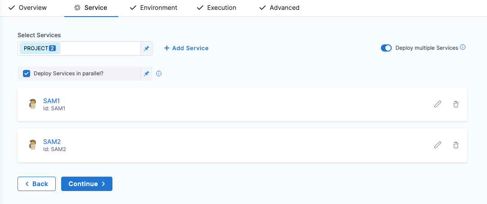
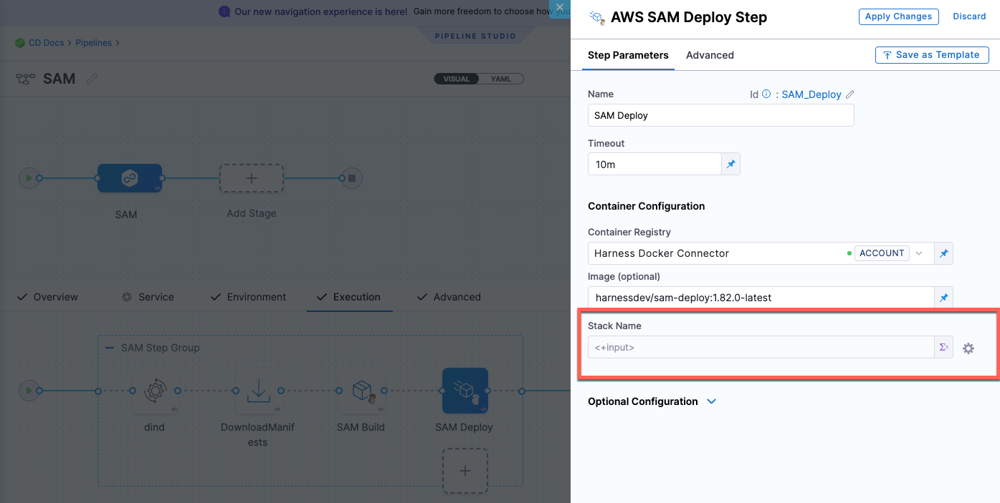

This article addresses some frequently asked questions about AWS deployments in Harness.

### How do ECS blue green deployments work?

ECS Blue/Green deployments use old and new versions of your service running behind the load balancer. Your ELB uses two listeners, Prod and Stage, each forwarding to a different target group where ECS services are run.

Blue/Green deployments are achieved by swapping listeners between the target groups, always pointing the Prod listener to the target group running the latest version.

In Harness, you identify which listeners are the Prod and Stage listeners. When Harness deploys, it uses the target group for the Stage listener (for example, target1) to test the deployment, verifies the deployment, and then swaps the Prod listener to use that target group. Next, the Stage listener now uses the old target group (target2).

When a new version of the service is deployed, the Stage listener and its target group (target2) are first used, then, after verification, the swap happens and the Prod listener forwards to target2 and the Stage listener now forwards to target1.


### How does ECS rollback work?

When an ECS deployment fails, the service tasks it was deploying are scaled down to 0.

The service is scaled to its pre-setup number of tasks.

If ECS Service Auto Scaling is configured, it is attached to the last production service at the end of the rollback.

For multi-phase deployments (Canary), not all phases are rolled back at once.

Phases are rolled back in the standard, reverse order. For example, in a 2 phase deployment with 2 rollback phases, the order is P1 → P2 → R2 → R1.

Phases are rolled back in this order regardless of whether ECS Service Auto Scaling is used.

### Can I run individual tasks separately?

Yes. In addition to deploying tasks as part of your standard ECS deployment, you can use the **ECS Run Task** step to run individual tasks separately as a step in your ECS stage.

The **ECS Run Task** step is available in all ECS strategy types.

An example of when you run a task separately is a one-time or periodic batch job that does not need to keep running or restart when it finishes.

### Can I use AWS Service Discovery?

Yes. Harness ECS deployments supports deploying of ECS services with AWS Service Discovery.

AWS Service Discovery is a cloud service provided by AWS that makes it easy for microservices applications to discover and communicate with each other. It enables you to manage and discover the addresses of the services within your microservices application without the need for hard-coded IP addresses or hostnames.

You can use AWS Service Discovery as part of the ECS service definition in Harness.

### Can I use ECS circuit breaker configurations?

Yes. Harness ECS rolling and canary deployments support AWS ECS circuit breaker configurations.

Circuit breaker configuration is implemented in the Harness ECS service **Service Definition**.

Harness deploys the tasks in the ECS service definition containing the circuit breaker configuration. Once deployed, the circuit breaker is activated.

During failure scenarios, ECS circuit breaker performs a rollback automatically based on the threshold configuration.

### What is a Lambda deployment?

In Harness, you specify the location of the function definition, artifact, and AWS account. Harness will deploy the Lambda function and automatically route the traffic from the old version of the Lambda function to the new version on each deployment.

**Looking for Serverless.com Framework Lambda?** Harness also supports Serverless.com Framework Lambda deployments. For more information, go to [AWS Lambda deployments (Serverless.com Framework)](/docs/continuous-delivery/deploy-srv-diff-platforms/serverless/serverless-lambda-cd-quickstart).

### What are the limitations?

- Harness' support only deploys and updates Lambda functions. Harness does not update auxiliary event source triggers like the API Gateway, etc.
- Currently, Lambda functions can be packaged as ZIP files in S3 Buckets or as containers in AWS ECR.
  - If Harness were to support another repository, like Nexus, when the container is fetched by the API, AWS spins up AWS resources (S3, ECR) anyways, and so Harness has limited support to S3 and ECR.
  - The containers must exist in ECR. Containers are not supported in other repositories.

### What are the function definition requirements?

Harness uses the AWS Lambda [Create Function API](https://docs.aws.amazon.com/lambda/latest/dg/API_CreateFunction.html) to create a new Lambda function in the specified AWS account and region.

The API takes a JSON object as input that defines the configuration settings for the Lambda function, such as the function name, runtime environment, handler function, memory allocation, and IAM role. This allows you to use the function definition as a configuration file in your Harness pipelines.

In Harness, you use a JSON configuration file to define the AWS Lambda you wish to deploy. This configuration lets you define all the function settings supported by the Create Function API.

The minimal requirements for an AWS Lambda function definition are:

- Function Name (`FunctionName`): A unique name for your Lambda function.
- Runtime (`Runtime`): The programming language and version that your function code is written in. Lambda supports multiple programming languages, including Node.js, Python, Java, C#, and Go.
- Handler (`Handler`): The name of the function within your code that Lambda should call when the function is invoked.
- AWS IAM role (`Role`): The IAM role that the function should use to access other AWS services or resources. You can create an IAM role specifically for the Lambda function, or you can reuse an existing IAM role if it has the necessary permissions.

For a full list of supported fields, go to [AWS Lambda Create Function Request](https://docs.aws.amazon.com/lambda/latest/dg/API_CreateFunction.html).

Harness supports all of the popular Git platforms for storing your function definition files.

### Can we deploy multiple stacks (multiple SAM build and deployments in a single pipeline) using a single service?

No. We support only one stack in the SAM Deploy step.

### There is an option to specify multiple manifest files on the service definition. Can we have both the stacks' manifests defined in the same service and use it (any suggestions and examples around this)?

It's not supported. We support deploying to one stack only in the SAM Deploy step. 

For this scenario, we suggest that you have one pipeline with two Deploy stages with two different services and stacks. 

Alternatively, you can have one pipeline with one Deploy stage and specify two different services in the **Service** tab, and in the **SAM Deploy** step > **Stack Name** field, select runtime input. 





### What is a Spot deployment in Harness?

You can deploy AWS ASGs using Harness and the Spot Elastigroup management platform.

### What are the limitations?

- Currently, Harness integrates with Spot only for Amazon Web Services (AWS) deployments by using Elastigroups.
- Spot Elastigroup deployments support AMI artifacts only.
- Spot Elastigroup deployments support only basic, canary, and blue green execution types.

### How to use the token for OCI repository in AWS ECR as the token expires every 12 hours by default?

1. Set up the AWS Secret Manager connector and save the ECR auth token into it.
2. Set up automatic token rotation (say at 10hr intervals) within AWS secret manager.
3. Have the Harness connector link to that AWS SecretManager secret to pull a fresh token every time.

### Can I encrypt the Token/Secret passed in the INIT_SCRIPT?

It cannot be encrypted directly but this can be achieved by creating the k8s secret for the credentials and referring them in the init script.

**example** -

``` aws_access_key=kubectl get secrets/pl-credentials --template={{.data.aws_access_key}} | base64 -d```
```aws_secret_key= kubectl get secrets/pl-credentials --template={{.data.aws_secret_key}} | base64 -d```

Another approach would be saving the value in Harness's secret manager/any other secret manager and referencing it in the script.
Check for more info in [Documentation](https://developer.harness.io/docs/platform/secrets/add-use-text-secrets).


### Can you provide an example of deploying the delegate in a task-definition for Amazon Elastic Container Service (Amazon ECS)?

Certainly! You can find a step-by-step guide on how to deploy the delegate in a task-definition for ECS on our [official documentation page](https://developer.harness.io/docs/platform/delegates/install-delegates/docker-delegate-to-ecs-fargate/).

Additionally, we have a GitHub repository with a Terraform module that demonstrates the process of [deploying the delegate in ECS Fargate](https://github.com/harness-community/terraform-aws-harness-delegate-ecs-fargate/tree/main). This resource can further assist you in implementing the delegate deployment.


### Is there a method to simulate CloudFormation changes without actually applying them?

Yes, you can achieve this by utilizing the Change Set Feature. First, create a change set to preview the changes that will be made. Once you are satisfied with the preview, you can execute the change set using the command: [aws cloudformation execute-change-set](https://docs.aws.amazon.com/cli/latest/reference/cloudformation/execute-change-set.html). This allows you to assess the impact of the changes before applying them.

### I'm trying to use a specific KMS key to encrypt my AWS Lambda's environment variables, but the Lambda seems to default to the AWS managed key. What could be the issue?

By default, AWS Lambda uses an AWS managed key for environment variable encryption. If you're specifying a KMS key using the kmsKeyArn parameter in the Lambda function definition YAML but still seeing the AWS managed key being used, it might be due to how the kmsKeyArn is defined in your YAML.

### How can I ensure that my specified KMS key is used to encrypt my Lambda's environment variables?

To make sure that your specified KMS key (kmsKeyArn) is used to encrypt your Lambda's environment variables, you need to ensure that the YAML key is written in camel case format, which is kmsKeyArn. Additionally, make sure that the KMS key ARN is accurate and accessible in your AWS account.

### Can you provide an example YAML snippet with the correct usage of kmsKeyArn for Lambda's environment variables?

```
functionName: "ff2"
handler: handler.hello
role: "arn:aws:iam::01447erole2"
runtime: nodejs14.x
kmsKeyArn: "arn:aws:kms:ue78fb6117cfd"   # Make sure the ARN is accurate
environment:
  variables:
    key: "val"
```

### How to fetch a PEM certificate from AWS Secrets Manager without losing its formatting?

In case of multi-line secrets please try and re-direct the output to a temp file and use that for base64.

### I am using AWS ASG template and would like to fetch "New ASG Name" while deployment/workflow/pipeline executes. Is it available in context? If yes then how can I get new asg name? 

We support both old and new ASG names via variable, which should help you with this use case to run custom scripting if required on old ASG.
 
Both new and old ASG: $\{ami.newAsgName}, $\{ami.oldAsgName} documented here:
https://developer.harness.io/docs/first-gen/firstgen-platform/techref-category/variables/built-in-variables-list#aws-amiasg-1


### Is there any way to increase task count of ECS service without ECS service deployment?

Currently, the task count of ECS cannot be changed without doing any deployment in Harness but changes can be made to ECS deployment directly on AWS.

### How to solve the following error? Invalid request: "Profile definition must end with ']"?

Harness Delegates do not control AWS profiles, this is likely configured manually through the delegate by the user and should be reviewed by the author.

### Can we skip manually creating the kubeconfig when using the native EKS deployment method in AWS, since we provide connection details in the AWS connector?

Yes, we do not need to create the kubeconfig file manually. We just need to have this binary installed on the delegate `aws-iam-authenticator`. Please refer more on this in the following [Documentation](https://developer.harness.io/docs/platform/connectors/cloud-providers/ref-cloud-providers/aws-connector-settings-reference/#connect-to-elastic-kubernetes-service-eks)


### What is the time parameter for AWS back-off strategy?

For AWS back-off strategy, parameters of time are in milliseconds. Please read more on this in the following [Documentation](https://developer.harness.io/docs/platform/connectors/cloud-providers/ref-cloud-providers/aws-connector-settings-reference/#aws-backoff-strategy/)


### Is there is an ECS DNS Blue/Green deployment similar to First-Gen in the Next-Gen?

In the next generation, we support the utilization of a `load balancer` with target groups for the switching between blue and green deployments.
Please read more on this in the following [Documentation](https://developer.harness.io/docs/continuous-delivery/deploy-srv-diff-platforms/aws/ecs/ecs-v2-summary/)
For First-Gen reference read the following [Documentation](https://developer.harness.io/docs/first-gen/continuous-delivery/aws-deployments/ecs-deployment/ecs-blue-green-workflows/#ecs-bluegreen-using-dns)


### How to create an AWS connector using aws-iam-authenticator on EKS Cluster with webIdentityToken?

Please read how to set AWS connector on EKS Cluster in this [Documentation](https://developer.harness.io/docs/platform/connectors/cloud-providers/ref-cloud-providers/aws-connector-settings-reference/#connect-to-elastic-kubernetes-service-eks)
Also, to align with AWS changes, it's important to note that the previous method of accomplishing this task has been deprecated in `kubectl version 1.21`. To address this, when utilizing the `Iam-authenticator plugin`, it is necessary to create a `Fargate profile` as part of the updated procedure.

### Is there a way to simply update the ECS scaling policy without redeploying the ECS service?

Many users opt for a shell script approach, where a configuration file is utilized and set as an environment variable. Subsequently, a shell script is crafted to execute the relevant AWS CLI commands, facilitating the update of scaling policies for a deployed service. This versatile method allows for customization and automation across various scenarios and configurations

### When working with SAM Templates, how can one specify the branch instead of the default master when providing a commit ID as a tag during the download manifests step, as it currently attempts to pull from the non-existent master branch?

In the Download Manifests step, you can specify the branch name by using the expression `<+pipeline.stages.STAGE_NAME.spec.serviceConfig.serviceDefinition.spec.manifests.MANIFEST_IDENTIFIER.spec.store.spec.branch>`. Replace `STAGE_NAME` with the name of your stage and `MANIFEST_IDENTIFIER` with the identifier of your manifest. You can then use this expression in the Branch/Commit Id field to specify the branch you want to pull from.
Please read more on this in the following [Documentation](https://developer.harness.io/docs/continuous-delivery/deploy-srv-diff-platforms/aws/aws-sam-deployments)

### We're working on a Harness Pipeline (To Create a JIRA Issue) and want to trigger it via a python script (on AWS Lambda). While triggering the pipeline We also need to send JIRA Issue Description data into it.  

You can use API to execute the pipeline [api](https://apidocs.harness.io/tag/Pipeline-Execute#operation/postPipelineExecuteWithInputSetList)

In the created pipeline you can add a Jira update step with the required details to update the issue [Doc](https://developer.harness.io/docs/continuous-delivery/x-platform-cd-features/cd-steps/ticketing-systems/update-jira-issues-in-cd-stages/)

### While creating an MSK connector role, we encountered the error "User: arn:aws:sts::44ddsnfjdnfs-deploy-cicd-role/AWSCloudFormation is not authorized to perform: iam:CreateRole..." with a Status Code 403. How can we resolve this issue?

The error indicates a permission issue related to IAM (Identity and Access Management) policies. Follow these steps to resolve the issue:

1. IAM Policy Review
2.IAM Permissions Boundary
3.Service Control Policies (SCP)
4.Policy Trust Relationships


### How do we know if a deployment is failing due to Service Control Policy implemented in our AWS account?

If there is any restriction from SCP you will get error with an explicit deny in a service control policy.

 User: arn:aws:iam::7799:user/JohnDoe is not authorized to perform: codecommit:ListRepositories because no service control policy allows the codecommit:ListRespositories action


### How does Harness provide enhanced control to users in the deployment sequence for applying autoscaling policies in ECS Blue-Green deployment?

 Harness exposes further control to users when in the deployment sequence they want to apply the autoscaling policies. This ensures that the existing containers are not impacted during release and after release it scales down based on traffic demand.
 Please read more on this in the following [Documentation](https://developer.harness.io/docs/continuous-delivery/deploy-srv-diff-platforms/aws/ecs/ecs-deployment-tutorial/#enable-auto-scaling-in-swap-step)


### How does Harness conduct pre-deployment validations and manage ECS Blue and Green services by updating tags based on target groups before initiating the deployment?

Harness performs some validations before the deployment. Before the deployment, Harness identifies ECS Blue and Green services based on the target group and updates tags accordingly. It then starts the deployment. One may enable the Feature Flag - `CDS_ECS_BG_VALIDATION` to use the feature on account. Please read more on this in the [Documentation](https://developer.harness.io/docs/continuous-delivery/deploy-srv-diff-platforms/aws/ecs/ecs-deployment-tutorial/#ecs-blue-green-service-validation).


### What does the below error in the Lambda function deployment signifies?

`aws/lambda/testLambda-dev already exists in stack arn:aws:cloudformation:us-east-2:xxxxxxxx...`

The error comes in scenario where there was a previous failed deployment but the logs still exist in the cloudwatch logs. We need to remove the log and try the deployment again.

### Is it required to have the delegate installed on a ECS cluster?

Delegate can be installed anywhere as long as it has access to the target Ecs cluster. Please read more on this in the following [Documentation](https://developer.harness.io/docs/continuous-delivery/deploy-srv-diff-platforms/aws/ecs/ecs-deployment-tutorial/#install-and-register-the-harness-delegate)


### Does aws secret manager supports IRSA?

We support RSA for secret manager authentication. We can use Assume role using STS option and configure our delegate for IRSA.

### Does Harness support SSH deployments using the GCP connector like AWS and Azure ?

No, this feature is yet to be supported. We suggest to use ssh key or user and password as datacenter as an alternative at the moment.

### Is the design of Basic intended to incorporate that behavior, similar to what is done in first Gen, where Ecs revisions are not utilized in the same manner as ECS?

Yes, the design of Basic includes that behavior because we manage the versions through the task name and handle versioning specifically for rollback purposes in first Gen, distinguishing it from the way Ecs revisions are managed. One needs to use rolling if they want harness to not perform the naming convention changes. Please read more on this in the following [Documentation](https://developer.harness.io/docs/continuous-delivery/deploy-srv-diff-platforms/aws/ecs/ecs-deployment-tutorial/)

### If we manually increase the task count in AWS directly? Or decrease as well, would it impact subsequent pipeline deployment?

It shouldn't impact except the fact that if the subsequent deployment has a different task count, it would override the existing one

### Is it required to have the delegate installed on a ECS cluster?

Delegate can be installed anywhere as long as it has access to the target Ecs cluster. Please read more on this in the following [Documentation](https://developer.harness.io/docs/continuous-delivery/deploy-srv-diff-platforms/aws/ecs/ecs-deployment-tutorial/#install-and-register-the-harness-delegate)

### How can one handle credentials rotation policies for AWS connectors that require access key id and secret access key without the usage of delegate?

While a functioning and stable delegate is imperative, it is advisable to prioritize its use. However, if there is a preference for connecting via platform, provided there is an external secrets manager in place and a streamlined process for automatic key updates within that system during rotations, integration through that avenue could be considered.
**Note** 
- Continuous Delivery cannot use the Platform based auth for all the connectors because the deployment jobs run on the delegate. Things like GitHub are feasible, but AWS, GCP, and Azure are not really possible because the credential exchange happens on the delegate


### Is the design of Basic intended to incorporate that behavior, similar to what is done in first Gen, where Ecs revisions are not utilized in the same manner as ECS?

Yes, the design of Basic includes that behavior because we manage the versions through the task name and handle versioning specifically for rollback purposes in first Gen, distinguishing it from the way Ecs revisions are managed. One needs to use rolling if they want harness to not perform the naming convention changes. Please read more on this in the following [Documentation](https://developer.harness.io/docs/continuous-delivery/deploy-srv-diff-platforms/aws/ecs/ecs-deployment-tutorial/)

### How can I reduce the number of AWS calls during deployment to mitigate issues?

You can optimize your deployment process by reducing the number of AWS calls. Refer to the AWS Connector Settings Reference for information on AWS backoff strategies. Implementing these strategies can help in managing AWS calls and potentially improve the execution of your deployment scripts.

### How can one use AWS CodeDeploy Template support at Harness?

The AWS CodeDeploy Deployment Template will allow us to set the infrastructure and the ability to fetch the instances deployed via AWS CodeDeploy.
Please read more on this in the following [Documentation](https://developer.harness.io/docs/continuous-delivery/deploy-srv-diff-platforms/custom-deployment-tutorial/#aws-codedeploy---deployment-template-sample)

### Does Harness provide AWS SAM and Serverless.com manifest from Harness File Store?

Yes, One can now download their AWS SAM & Serverless.com Manifests from the Harness File Store and AWS S3.
This is provided behind the `FF: CDS_CONTAINER_STEP_GROUP_AWS_S3_DOWNLOAD`
Please read more on this in the following [Documentation](https://developer.harness.io/docs/continuous-delivery/deploy-srv-diff-platforms/serverless/manifest-sources-for-serverless-lambda).

### Is there a way to switch aws accounts while using native terraform step?

Yes, Harness supports an AWS Connector to have the terraform plan and apply step assume a role to perform the provisioning of infrastructure.
Please read more on this in the following [Documentation](https://developer.harness.io/docs/continuous-delivery/cd-infrastructure/terraform-infra/run-a-terraform-plan-with-the-terraform-apply-step/#aws-connector-provider-credential-authentication-for-terraform-plan-and-apply-steps)

### Can we modify the audience in the generated JWT token to use it for purposes beyond AWS authentication?

Modifying the audience (aud) claim in a JWT means changing who the token is intended for. In AWS authentication, it typically specifies AWS services. However, you can adjust it for other systems or services as long as they understand and accept this change. Just make sure the system you're sending the token to knows how to handle the modified audience claim according to its own requirements and security rules. 


### How does the AWS connector currently handle OIDC authentication?

Users can now leverage the AWS connector to configure OIDC authentication.

This feature is currently behind the feature flag `CDS_AWS_OIDC_AUTHENTICATION`. Contact [Harness Support](mailto:support@harness.io) to enable the feature.

This only leverages the account ID parameter when Harness sends the token payload to the AWS STS service. For more information, go to [Harness AWS connector settings](https://developer.harness.io/docs/platform/connectors/cloud-providers/ref-cloud-providers/aws-connector-settings-reference/#harness-aws-connector-settings).


### How to efficiently extract specific tag values from JSON output, like querying an AWS ECR Repo via the AWS CLI, using the json.select feature with shell script variables or outputs?

The output variable cannot be used in the same step its created.
The output variables can be used within:
- the stage
- inside the pipeline
- inside a step group

Please read more on this in the following [Documentation](https://developer.harness.io/kb/continuous-delivery/articles/output-variable-for-powershell-script/)

### How to troubleshoot "Invalid request: Invalid Load balancer configuration in Service." error?

This can happen in following cases:
- No target groups attached to LB
- Multiple services attached to target groups
- Service is attached to both target groups
  
Please read more on ECS Blue-Green Steps in the following [Documentation](https://developer.harness.io/docs/continuous-delivery/deploy-srv-diff-platforms/aws/ecs/ecs-deployment-tutorial/#visual-summary)


### A pipeline of type ASG deployment has migrated from FirstGen to NextGen.  Is launch configuration not supported in NextGen?

Users migrating to NextGen from FirstGen will need to replace Launch Configuration with Launch Template. AWS provides the steps here: https://docs.aws.amazon.com/autoscaling/ec2/userguide/migrate-to-launch-templates.html


### A pipeline of type ASG deployment has migrated from FirstGen to NextGen.  In FirstGen, when providing the Base ASG, Harness could pick up the launch configuration from the base ASG and created a configuration for new ASG.  What needs to be changed to migrate the workflow to NextGen for ASG deployment which uses launch configuration instead of launch template?

There has been a redesign in ASG deployments as new features like Instance Refresh have emerged, while some features like Classic Load Balancer and Launch Configuration are being deprecated.
To address a migrated pipeline, users can take the following steps:
1.Migrate the current Launch Configuration to Launch Template. AWS provides the steps here: [AWS Launch Templates Migration Guide](https://docs.aws.amazon.com/autoscaling/ec2/userguide/migrate-to-launch-templates.html).
2. Once this is completed, everything should work seamlessly. However, the current pipeline will not function properly. To resolve this, we can create a new pipeline following the guidelines outlined here: [AWS ASG Tutorial for Canary Phased Deployment](https://developer.harness.io/docs/continuous-delivery/deploy-srv-diff-platforms/aws/asg-tutorial/#canary-phased-deployment). 


### Are there guidelines or recommendations for scaling up VM build infrastructures, such as those hosted on EC2, for individuals managing and configuring their own infrastructure?

Yes, you can scale up your AWS VM build infrastructure effectively by considering the following:

**Scaling Up**: Increase capacity by adding more templates, build nodes, and VMs to accommodate growing demands.
**Cost Optimization**: Implement cost-saving measures such as configuring the runner to hibernate AWS Linux and Windows VMs during idle periods, helping to reduce infrastructure costs.
For detailed setup and configuration instructions, please refer to [Set up an AWS VM Build Infrastructure](https://developer.harness.io/docs/continuous-integration/use-ci/set-up-build-infrastructure/vm-build-infrastructure/set-up-an-aws-vm-build-infrastructure/).


### Does Harness support the use of OpenID Connect(OIDC) for connecting to various systems such as Amazon Web Services(AWS) and Google Cloud Platform (GCP)?

Yes, we currently support OIDC integration for [Google Cloud Platform (GCP)](https://developer.harness.io/docs/platform/connectors/cloud-providers/ref-cloud-providers/gcs-connector-settings-reference/#use-openid-connect-oidc) and [Amazon Web Services (AWS)](https://developer.harness.io/docs/platform/connectors/cloud-providers/ref-cloud-providers/aws-connector-settings-reference/#credentials).

Additional support is coming soon, including facilitating authentication, short-lived token acquisition based on Harness context, and various operational tasks like deployment, builds, or secret retrieval within the respective cloud provider environments.


### What values should I enter for `provider url` and `audience` for the OIDC AWS connector?
Use the following values:
```
Provider URL - https://app.harness.io/ng/api/oidc/account/<YOUR_HARNESS_ACCOUNT_ID>
Audience: sts.amazonaws.com
```
### What authentication flows (grant types) are supported for AWS and GCP OIDC?
For the Kubernetes connector, we go through the client credentials. For AWS and GCP we have implemented it slightly differently. For AWS OIDC is also implicit - Use OIDC: Connect to AWS with OIDC. 

To do this you will need to create an OIDC identity provider in AWS and add it in a trust relationship with an IAM role you create that Harness will use to operate in AWS.

### What is the default duration for assuming the role in the AWS Java SDK?
The default duration for assuming the role in the aws-java-sdk is 15 minutes.

### What ECR permissions policy that Harness create as part of the AWS Lambda service deployment?
Harness creates the policy which is essential for performing various ECS-related actions like creating and updating services, tasks, and container instances.

### How to avoid Harness creating a permissions policy and applying it to an AWS ECR repository that we are specifying as an artifact location for our AWS Lambda deployment configuration in Harness. These permissions are creating Terraform state drift on the ECR repository?
To prevent Terraform state drift, we recommend that you create the ECR repository with the required permissions beforehand. This can be achieved by crafting an IAM policy that grants the necessary permissions and attaching it to the IAM role utilized by the ECS cluster.

Alternatively, you can prevent Harness from altering IAM policies by removing the relevant permissions from the Harness AWS connector. However, this could affect the functionality of your deployment pipeline.

### What is an ASG deployment?

Here's a summary of how Harness deploys new ASG versions:

1. First deployment:
   1. Harness takes the launch template and ASG configuration files you provide and creates a new ASG and its instances in your AWS account and region.
2. Subsequent deployments:
   1. Harness creates a new version of the launch template.
3. Harness uses the new version of the launch template to update the ASG. For example, if you increased the desired capacity (`desiredCapacity`) for the ASG in your ASG configuration file, Harness will create a new version of the ASG with the new desired capacity.
   1. Instance refresh is triggered (a rolling replacement of all or some instances in the ASG).

### What do I need for an ASG deployment?

1. For the Harness ASG service.
   1. Launch template.
   2. ASG configuration.
   3. Scaling policies (optional).
   4. Scheduled update group action (optional).
   5. The AMI image to use for the ASG as an artifact.
2. Harness ASG environment.
   1. AWS region where you want to deploy.
3. Harness ASG pipeline execution.
   1. Deployment strategy (rolling, canary, blue green). Harness automatically creates the steps to deploy the new ASG.

### What are the ASG deployment limitations?

AWS has the following limitations to keep in mind:

- You are limited to creating 5000 launch templates per region and 10000 versions per launch template. For more information, go to Launch an instance from a launch template from AWS.
- ASGs per region: 500.
- Launch configurations per region: 200.

### What is a Harness ECS deployment?

You can deploy images to your Amazon Elastic Container Service (ECS) cluster using rolling, canary, and blue green deployment strategies.

Harness supports standard ECS specifications:

* [RegisterTaskDefinition](https://docs.aws.amazon.com/AmazonECS/latest/APIReference/API_RegisterTaskDefinition.html)
* [CreateService](https://docs.aws.amazon.com/AmazonECS/latest/APIReference/API_CreateService.html)
* [RegisterScalableTarget](https://docs.aws.amazon.com/autoscaling/application/APIReference/API_RegisterScalableTarget.html)
* [PutScalingPolicy](https://docs.aws.amazon.com/autoscaling/application/APIReference/API_PutScalingPolicy.html)
* [RunTask](https://docs.aws.amazon.com/AmazonECS/latest/APIReference/API_RunTask.html)


### Can I perform auto scaling?

Yes. The ECS service(s) you deploy with Harness can be configured to use AWS Service Auto Scaling to adjust its desired ECS service count up or down in response to CloudWatch alarms. For more information on using Auto Scaling with ECS, go to [Target Tracking Scaling Policies](https://docs.aws.amazon.com/AmazonECS/latest/developerguide/service-autoscaling-targettracking.html) from AWS.

Before you set up Auto Scaling for the ECS service in Harness, you need to obtain the JSON for the Scalable Target and Scalable Policy resources from AWS.

The JSON format used in the **Auto Scaler Configurations** settings should match the AWS standards as described in [ScalableTarget](https://docs.aws.amazon.com/autoscaling/application/APIReference/API_ScalableTarget.html) and [ScalablePolicy](https://docs.aws.amazon.com/autoscaling/application/APIReference/API_ScalingPolicy.html).


### Can I deploy the same number of service instances as the previous deployments?

Yes. The **Same as already running instances** setting in **ECS Rolling Deploy** sets the number of desired ECS service instances for this stage to the same number as the already running instances. Essentially, it ignores the desired count in the Service Definition of the new deployment.

### Can I force a deployment?

Yes. By default, deployments aren't forced. You can use the **Force new deployment** setting in **ECS Rolling Deploy** to start a new deployment with no service definition changes. For example, you can update a service's tasks to use a newer Docker image with the same image/tag combination (`my_image:latest`) or to roll Fargate tasks onto a newer platform version.

### What is function definitions syntax?

- Harness expects camel case in the function definition.

- user can provide yaml or json in the function definition

'''
"vpcConfig": \{

"securityGroupIds": ["string"],

"subnetIds": ["string"]

'''

### Does Harness support viewing the rendered launch template for ASG deployments after all the Harness expressions have been evaluated?

No, Harness does not store the rendered launch template as an output variable, nor does it display the rendered launch templates in the console logs. We only indicate that the ASG configuration is created. For more details, go to [Harness ASG services](https://developer.harness.io/docs/continuous-delivery/deploy-srv-diff-platforms/aws/asg-tutorial/#harness-asg-services).


### IRSA Kubernetes deployment fails with an error: java.lang.IllegalStateException: Not a JSON Object: null.

For EKS cluster deployments through an AWS connector that uses IRSA-based authentication, if the above error is seen during the initialization of the Kubernetes Rollout step, execute into the delegate to check if the `aws-iam-authenticator` being used is compatible with the CPU architecture of the node where the delegate is running.

### How to validate if the aws-iam-authenticator installed on the delegate is correct and works as expected?

The `aws-iam-authenticator` generates a token that `kubectl` uses to authenticate with the target cluster. The Harness delegate runs the following command to generate a token in JSON format:

```
aws-iam-authenticator token -i <eks-cluster-name> --role arn:aws:iam::12345678:role/CrossAccountEKSRole
```

### When configuring the EKS infrastructure, the clusters are listed. However, when trying to deploy a service to the cluster, the Kubernetes deployment fails. Why does this happen?

When configuring the infrastructure, the AWS connector uses the AWS APIs to query the cluster. However, during the Kubernetes deployment, the deployment uses `kubectl` to communicate with the Kubernetes API server's endpoint to deploy the Kubernetes manifest. For the deployment to be successful, there must be network connectivity from the delegate to the Kubernetes API server endpoint. This connectivity might not exist if the cluster is private, so the delegate must reside in the same VPC as the cluster. For more details, go to [AWS documentation](https://docs.aws.amazon.com/eks/latest/userguide/cluster-endpoint.html#modify-endpoint-access).

### How is the kubeconfig file generated for Kubernetes deployments with cross-account STS IRSA-based connectors?

During the Kubernetes Rollout stage, the Harness Delegate generates the `kubeconfig` file using details from the infrastructure configured on the stage. The authentication token is generated using the `aws-iam-authenticator` command available on the delegate by passing the cross-account role and the cluster name.

### Will the kubeconfig file continue to exist on the delegate pods?

The `kubeconfig` generation process during deployment happens on the fly. The file is kept in a temporary location for the duration of the Kubernetes Rollout step, and is cleaned up once the step completes or fails.

### Does Harness support using IRSA with ECS for deployment?

No, IRSA is not used with ECS. Instead, ECS tasks get their own task roles, which is set up similar to IRSA. A delegate runs in ECS with a base role, and STS is used to assume a secondary role.

### Does Harness support using Serverless CLI on a delegate?

Yes, using the Serverless CLI on the delegate ensures that the delegate has the necessary permissions and environment setup. This includes adding node, Serverless, or AWS CLI to the delegate INIT script and managing STS/trust configurations appropriately for each environment and service role.

### Does Harness support conditional input variables based on previous selections?

No, currently Harness does not support dynamically showing different input variables based on previous selections during pipeline execution.
For more details, go to [Stage and step conditional execution settings](/docs/continuous-delivery/x-platform-cd-features/executions/step-and-stage-conditional-execution-settings/#and-execute-this-stage-only-if-the-following-jexl-condition-evaluates-to-true).

### Does Harness support displaying inputs only related to selected values in a pipeline?

No, Harness does not support conditional displaying input variables based on previous selections.

### Does Harness support using allowed values for dynamic input options?

Yes, you can use allowed values to specify different input options for a variable, though it does not fully cover dynamic input based on previous selections.

### Why is the run step failing with an NullPointerException error even though the correct roles are attached to the delegate 
```
Exception getAmazonEcrAuthToken
java.lang.NullPointerException: You must specify a value for roleArn and roleSessionName
```

Please check the AWS connector used if connectivity test work and also check the service account attached to delegate if that has correct role assigned to access the resource

Check to see if the AWS connector connectivity test passes. Also, check the service account attached to the delegate and see if it has the correct roles assigned to access the resource(s).

### How can we add mean duration for prod and non-prod pipelines in dashboards?

To get the mean duration for prod and non-prod pipelines, first create a measure to calculate the mean duration for the non-prod environment. Similarly, create a second measure for the prod environment. Finally, perform a table calculation on both custom measures and add them.

### We need to extract the project tags based on the project name. Is there an API to do it?

You can use: [API](https://apidocs.harness.io/tag/Project#operation/getProject) to get project details including tags.

### What happens when my ECS service tasks repeatedly fail to start?
When ECS service tasks repeatedly fail to start, they transition from PENDING to STOPPED without reaching the RUNNING state. The ECS service scheduler then throttles the restart attempts, incrementally increasing the time between restarts up to a maximum of 27 minutes. This helps manage the impact on your ECS cluster resources or Fargate infrastructure costs

### Will the ECS service ever stop retrying to start failing tasks?
No, Amazon ECS does not stop a failing service from retrying. The service will continue to attempt restarts indefinitely, but the time between attempts will increase incrementally if the tasks keep failing.

###  How can we stop my ECS service from being throttled?
To stop the throttling, you need to update your service to use a new task definition. This action will reset your service to a normal, non-throttled state immediately.

### What should I do if my service tasks are being throttled?
You should investigate and resolve the underlying issues causing the task failures. Common causes include insufficient resources, issues with pulling the Docker image, and insufficient disk space. Addressing these issues can help your tasks start successfully and avoid throttling.

### Do tasks that stop after reaching the RUNNING state trigger throttling?
No, tasks that are stopped after reaching the RUNNING state do not trigger the throttle logic or the associated service event message. For example, tasks stopped due to failed Elastic Load Balancing health checks or tasks that exit with a non-zero exit code after moving to the RUNNING state will not cause throttling.

### What can cause insufficient resources for ECS tasks?
Insufficient resources can be due to a lack of available ports, memory, or CPU units in your cluster. You will see an "insufficient resource" service event message if this is the problem. Ensure your cluster has adequate resources to accommodate your tasks.

### How does Amazon ECS notify me about service throttling?
If your service initiates the throttle logic, you receive a service event message stating that your service is unable to consistently start tasks successfully. This helps you identify when throttling is occurring so you can take corrective action.

### What are common causes of ECS service tasks failing to start?

Common causes includes Lack of resources (ports, memory, CPU units) in your cluster, Issues with pulling the Docker image due to incorrect image names, tags, or registry authentication problems, and Insufficient disk space on the container instance.

### Why am I getting an `Invalid Request: No manifests found` error? 
```
Invalid request: No manifests found in stage Deploy_AMI. AsgRollingDeploy step requires a manifest defined in stage service definition
```

This means that your Launch Template and ASG Configuration are not setup correctly in your service under AWS ASG Configurations.
