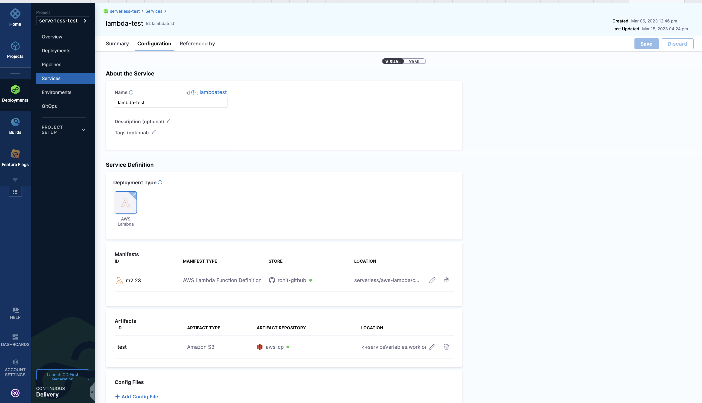
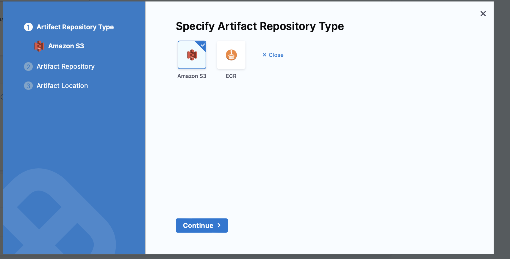
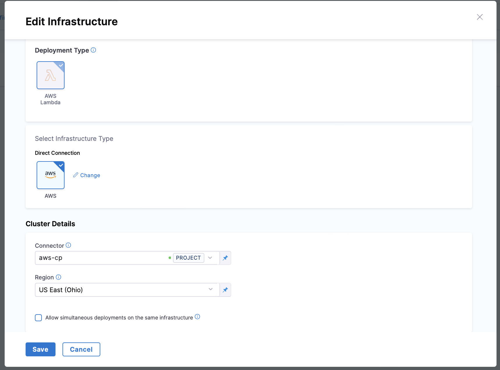

:::note

Currently, AWS Lambda support is behind the feature flag `NG_SVC_ENV_REDESIGN`. Contact [Harness Support](mailto:support@harness.io) to enable the feature.

:::

Harness supports the deployment of AWS Lambda functions. 

Harness Lambda support is designed to empower developers to launch their Lambda code with ease without having to manage the infrastructure components around AWS Lambda. 

In Harness, you specify the location of the function definition and artifact and AWS account and Harness will deploy the Lambda function and automatically route the traffic from the old version of the Lambda function to the new version on each deployment.

This topic covers the basics of Harness' Lambda support and provides examples on how to deploy your Lambda functions through Harness CD.

**Looking for Serverless.com Framework Lambda?** Harness also supports Serverless.com Framework Lambda deployments. For more information, go to [AWS Lambda deployments (Serverless.com Framework)](/docs/continuous-delivery/deploy-srv-diff-platforms/serverless-lambda-cd-quickstart).

## Important notes

- Harness can deploy a new Lambda function or update an existing Lambda function.
- Harness' support only deploys and updates Lambda functions. Harness does not update auxiliary event source triggers like the API Gateway, etc. 
- Currently, Lambda functions can be packaged as ZIP files in S3 Buckets or as containers in AWS ECR. 
  - If Harness were to support another repository, like Nexus, when the container is fetched by the API, AWS spins up AWS resources (S3, ECR) anyways, and so Harness has limited support to S3 and ECR.
  - The containers must exist in ECR. Containers are not supported in other repositories.

## AWS IAM permissions

To deploy a Lambda function, you would need an AWS Identity and Access Management (IAM) role with the necessary permissions. You will use that role in the credentials you supply to the Harness AWS connector.

<details>
<summary>AWS IAM permissions</summary>

Here are the minimum AWS IAM role policies that you would need to deploy a Lambda function:

- **IAMReadOnlyAccess**: Needed to verify required policies.
- **AWSLambdaRole**: Needed to invoke function.
- **AWSLambda_FullAccess** (previously AWSLambdaFullAccess): Needed to write to Lambda.
- **AmazonS3ReadOnlyAccess**: Needed to pull the function file from S3.
- **AmazonEC2ContainerRegistryReadOnly**: Needed to pull function container image from ECR. This policy provides read-only access to the ECR repository.

For example, if the role you created was named `LambdaTutorial`, you can attach the policies like this:

```
aws iam attach-role-policy --policy-arn arn:aws:iam::aws:policy/IAMReadOnlyAccess --role-name LambdaTutorial

aws iam attach-role-policy --policy-arn arn:aws:iam::aws:policy/service-role/AWSLambdaRole --role-name LambdaTutorial   

aws iam attach-role-policy --policy-arn arn:aws:iam::aws:policy/AWSLambdaFullAccess --role-name LambdaTutorial  

aws iam attach-role-policy --policy-arn arn:aws:iam::aws:policy/AmazonS3ReadOnlyAccess --role-name LambdaTutorial  
```

- **AWS Lambda Execution Role**: As a Lambda user, you probably already have the AWS Lambda Execution Role set up. If you do not, follow the steps in [AWS Lambda Execution Role](https://docs.aws.amazon.com/lambda/latest/dg/lambda-intro-execution-role.html) from AWS.

Here's an example IAM policy that includes the AWSLambdaExecutionRole, IAMReadOnlyAccess, AWSLambda_FullAccess, AmazonS3ReadOnlyAccess, and AmazonEC2ContainerRegistryReadOnly managed policies:

```json
{
    "Version": "2012-10-17",
    "Statement": [
        {
            "Sid": "IAMReadOnlyAccess",
            "Effect": "Allow",
            "Action": [
                "iam:Get*",
                "iam:List*",
                "iam:SimulateCustomPolicy"
            ],
            "Resource": "*"
        },
        {
            "Sid": "LambdaAccess",
            "Effect": "Allow",
            "Action": [
                "lambda:CreateFunction",
                "lambda:UpdateFunctionCode",
                "lambda:UpdateFunctionConfiguration",
                "lambda:PublishVersion",
                "lambda:CreateAlias",
                "lambda:Get*",
                "lambda:List*",
                "lambda:InvokeFunction",
                "lambda:DeleteFunction",
                "lambda:DeleteAlias",
                "lambda:DeleteFunctionConcurrency",
                "lambda:AddPermission",
                "lambda:RemovePermission",
                "lambda:EnableReplication",
                "lambda:DisableReplication",
                "lambda:GetFunctionCodeSigningConfig",
                "lambda:UpdateFunctionCodeSigningConfig",
                "lambda:GetCodeSigningConfig",
                "lambda:ListCodeSigningConfigs",
                "lambda:CreateCodeSigningConfig",
                "lambda:DeleteCodeSigningConfig",
                "lambda:UpdateFunctionEventInvokeConfig",
                "lambda:GetFunctionEventInvokeConfig",
                "lambda:ListFunctionsByCodeSigningConfig",
                "lambda:ListTags",
                "lambda:TagResource",
                "lambda:UntagResource"
            ],
            "Resource": "*"
        },
        {
            "Sid": "S3ReadOnlyAccess",
            "Effect": "Allow",
            "Action": [
                "s3:Get*",
                "s3:List*"
            ],
            "Resource": "*"
        },
        {
            "Sid": "ECRReadOnlyAccess",
            "Effect": "Allow",
            "Action": [
                "ecr:GetAuthorizationToken",
                "ecr:BatchCheckLayerAvailability",
                "ecr:GetDownloadUrlForLayer",
                "ecr:GetRepositoryPolicy",
                "ecr:DescribeRepositories",
                "ecr:ListImages",
                "ecr:DescribeImages",
                "ecr:BatchGetImage"
            ],
            "Resource": "*"
        },
        {
            "Sid": "LambdaRoleAccess",
            "Effect": "Allow",
            "Action": [
                "iam:PassRole"
            ],
            "Resource": "arn:aws:iam::*:role/service-role/AWSLambdaExecutionRole"
        }
    ]
}
```

</details>


The IAM role is used in Harness when you create an AWS connector. The AWS connector is used during deployment and the role is used by Harness to deploy your function in your AWS account.


## Visual summary

The following video describes an end-to-end Lambda deployment including all of the related Harness entities.

<docvideo src="https://www.loom.com/embed/12e4c1161e7e428ba6acf9ff168693c1" width="100%" height="600" />


## AWS connector for Lambda deployments

You need to add a Harness AWS Connector to connect Harness to your AWS account, fetch artifacts, and specify a region to deploy.

AWS connectors are used in your Harness service for the artifact you select in **Artifacts** and in the environment's **Infrastructure Definition**. 

You can use the same connector or different connectors, but ensure that the credentials provided for the artifact connector are sufficient to fetch the ZIP or image and the credentials provided for the infrastructure definition connector are sufficient to deploy to Lambda.

## Harness service configuration

When you create a Harness service, select **AWS Lambda** to define a service that represents the AWS Lambda function you want to deploy.



The service contains the function artifact in **Artifacts** and the function definition in **AWS Lambda Function Definition**.

### Artifacts

You can deploy Lambda functions packaged as ZIP files in S3 Buckets or as containers in AWS ECR. These are the only two artifact sources Harness supports today with AWS Lambda. 



The artifact defined in the Harness service is the equivalent to the `Code:ImageUri` in the definition. You omit the `Code:ImageUri` in the definition you add to the service in **AWS Lambda Function Definition** and Harness adds it at runtime using the artifact you added in the service. This allows you to specify the image more dynamically.

If you do use the `Code:ImageUri` in the definition, Harness ignores it and instead uses the artifact in **Artifacts**.


### Function definition

In **AWS Lambda Function Definition**, you specify your function definition.

Harness uses the AWS Lambda [Create Function API](https://docs.aws.amazon.com/lambda/latest/dg/API_CreateFunction.html) to create a new Lambda function in the specified AWS account and region. 

The API takes a JSON object as input that defines the configuration settings for the Lambda function, such as the function name, runtime environment, handler function, memory allocation, and IAM role. This allows you to use the function definition as a configuration file in your Harness pipelines.

In Harness, you use a JSON configuration file to define the AWS Lambda you wish to deploy. This configuration lets you define all the function settings supported by the Create Function API.

The minimal requirements for an AWS Lambda function definition are:

- Function Name (`FunctionName`): A unique name for your Lambda function.
- Runtime (`Runtime`): The programming language and version that your function code is written in. Lambda supports multiple programming languages, including Node.js, Python, Java, C#, and Go.
- Handler (`Handler`): The name of the function within your code that Lambda should call when the function is invoked.
- AWS IAM role (`Role`): The IAM role that the function should use to access other AWS services or resources. You can create an IAM role specifically for the Lambda function, or you can reuse an existing IAM role if it has the necessary permissions.

For a full list of supported fields, go to [AWS Lambda Create Function Request](https://docs.aws.amazon.com/lambda/latest/dg/API_CreateFunction.html).

Harness supports all of the popular Git platforms for storing your function definition files. 

Here is a NodeJS hello world function example:

```json
{
   "runtime": "nodejs14.x",
   "functionName": "Hello_World",
   "handler": "handler.hello",
   "role": "<YOUR_AWS_ARN>"
}
```

You can use Harness service variables in your function definition JSON.

Services variables allow your function definition to be reusable across multiple Lambda functions. 

You can override service variables using [Harness environment overrides](/docs/continuous-delivery/x-platform-cd-features/environments/create-environments). Overrides can also be used to change the function definition when it is deployed to different environments.

Here's a function definition example using service variables:

```json
{
  "functionName": "<+serviceVariables.functionName>",
  "runtime": "<+serviceVariables.runtime>",
  "handler": "<+serviceVariables.handler>",
  "role": "<+serviceVariables.roleARN>"
}
```

You can also deploy an existing function using its ARN. Here is an ECR Lambda function definition example that uses an existing ARN:

```json
{
  "functionName": "arn:aws:lambda:us-west-2:123456789012:function:my-function",
  "runtime": "nodejs14.x",
  "handler": "index.handler",
  "role": "arn:aws:iam::123456789012:role/my-lambda-role",
  "timeout": 30,
  "memorySize": 256
}

```

Even though you are only updating an existing function in the above example, you still need to include the artifact in the Harness service **Artifacts** section because the AWS API expects the `Code:ImageUri` in the definition. Harness will dynamically add the artifact in the `Code:ImageUri` at runtime.

### Updating existing functions

Typically, you will use Harness to deploy a new function and its future versions. You can also use Harness to update an existing function.

To update an existing function, the function definition you supply Harness must have a `FunctionName` that matches the name of the function you are updating in AWS and follow the [Create Function API](https://docs.aws.amazon.com/lambda/latest/dg/API_CreateFunction.html#SSS-CreateFunction-request-FunctionName) conventions.

You do not need to use the function ARN in the `FunctionName` of the function definition.

### Sample service YAML

Here is the YAML for a sample Harness Lambda service. 

You can see it uses `<+serviceVariables.workload_name>` for the file path of the S3 bucket containing the artifact ZIP file. This service variable allow you to select different artifacts at pipeline runtime.


```yaml
service:
  name: helloworld
  identifier: helloworld
  description: "Hello World AWS Lambda"
  tags: {}
  serviceDefinition:
    spec:
      manifests: # Harness introduces a function definition to define the properties of your AWS Lambda function
        - manifest:
            identifier: lambdaFunctionDefinition 
            type: AwsLambdaFunctionDefinition
            spec:
              store:
                type: Github
                spec:
                  connectorRef: rohitgithub
                  gitFetchType: Branch
                  paths:
                    - serverless/aws-lambda/createFunction.json
                  branch: master
      artifacts: # The artifact is the packaged .zip or Docker image you wish to deploy to AWS
        primary:
          primaryArtifactRef: <+input>
          sources:
            - spec:
                connectorRef: awscp
                bucketName: mylambda
                region: us-east-2
                filePath: <+serviceVariables.workload_name>
              identifier: test
              type: AmazonS3
      variables:
        - name: workload_name
          type: String
          description: "sample variable definition"
          value: workloadNameValue
    type: AwsLambda

```

### Service configuration using Harness API

You can configure the Harness AWS Lambda service using the [Create Service API](https://apidocs.harness.io/tag/Services#operation/createServiceV2). Ensure you specify the service type as `AwsLambda`

### Service configuration using Harness Terraform Provider

You can configure the Harness AWS Lambda service using the Harness Terraform Provider [service platform resource](https://registry.terraform.io/providers/harness/harness/latest/docs/resources/platform_service).

Here's an example of creating a service using the Terraform Provider.

```YAML
resource "harness_platform_service" "service" {
  identifier  = "helloworld"
  name        = "hello-world lambda"
  description = "lambda function"
  org_id      = "default"
  project_id  = "serverless"

  yaml = <<-EOT
            service:
              name: helloworld
              identifier: helloworld
              description: "Hello World AWS Lambda"
              tags: {}
              serviceDefinition:
                spec:
                  manifests: # Harness introduces a function definition to define the properties of your AWS Lambda function
                    - manifest:
                        identifier: lambdaFunctionDefinition 
                        type: AwsLambdaFunctionDefinition
                        spec:
                          store:
                            type: Github
                            spec:
                              connectorRef: rohitgithub
                              gitFetchType: Branch
                              paths:
                                - serverless/aws-lambda/createFunction.json
                              branch: master
                  artifacts: # The artifact is the packaged .zip or Docker image you wish to deploy to AWS
                    primary:
                      primaryArtifactRef: <+input>
                      sources:
                        - spec:
                            connectorRef: awscp
                            bucketName: sainathlambda
                            region: us-east-2
                            filePath: <+serviceVariables.workload_name>
                          identifier: test
                          type: AmazonS3
                  variables:
                    - name: workload_name
                      type: String
                      description: "sample variable definition"
                      value: workloadNameValue
                type: AwsLambda
              EOT
}
```

## Lambda environment and infrastructure definition

Define a Harness environment and infrastructure definition to tell Harness where to deploy the Lambda function service you created in Harness.

Here's an example of the YAML for an environment:

```YAML
environment:
  name: aws
  identifier: aws
  description: "sandbox aws account"
  tags: {}
  type: PreProduction
  orgIdentifier: default
  projectIdentifier: serverlesstest
  variables: []

```

In the environment, add an infrastructure definition.



Use a Harness AWS connector with an AWS IAM role that can perform the Lambda deployment. For details, go to [AWS IAM Permissions](#aws-iam-permissions) above.

Below is a YAML example for the infrastructure definition:

```yaml
infrastructureDefinition:
  name: aws-lambda
  identifier: awslambda
  description: ""
  tags: {}
  orgIdentifier: default
  projectIdentifier: serverlesstest
  environmentRef: aws
  deploymentType: AwsLambda
  type: AwsLambda
  spec:
    connectorRef: awscp
    region: us-east-2
  allowSimultaneousDeployments: false

```

## Lambda deployment steps

Once you have created the Harness service and environment for your deployment, you can model your pipeline in **Pipelines**.

Simply create a new **Deploy** stage, select AWS Lambda as the deployment type, and then use the service and environment you created. 

Harness includes execution steps to deploy your function:

- AWS Lambda Deploy
- AWS Lambda Rollback

These steps are added to your pipeline stage **Execution** automatically when you model your pipeline.

### AWS Lambda Deploy step

The AWS Lambda Deploy step requires no configuration because Harness handles the logic to deploy the artifact to the proper AWS account and region. 

Harness will deploy the Lambda function and automatically route the traffic from the old version of the Lambda function to the newly deployed one.

Here is the YAML of the AWS Lambda Deploy step. 


```yaml
            steps:
              - step:
                  name: Deploy Aws Lambda
                  identifier: deployawslambda
                  type: AwsLambdaDeploy
                  timeout: 10m
                  spec: {}
```

When the step executes Harness will save the information needed for rollback. Here's an example you can see when you deploy.

```
Preparing Rollback Data..

Fetching Function Details for function: test-lambda-10
Fetched Function Details for most recent deployed function test-lambda-10 

Function Version: 99 
FunctionARN: arn:aws:lambda:us-east-2:123456789:function:test-lambda-10:99 
CodeSha256: Sj0QxkDca5JABord90YoAC+123456789= 
Memory Size: 128 
Runtime: nodejs16.x 
CodeSize: 967 
Handler: handler.hello 
Architecture: [x86_64] 

Prepare Rollback Done.
```

Here's an example of a deployment log you can see when you deploy in Harness:

```
Deploying..

Aws Lambda Manifest Content 
{
   "runtime": "nodejs16.x",
   "functionName": "test-lambda-10",
   "handler": "handler.hello",
   "role": "arn:aws:iam::123456789:role/service-role/avengers-test-role-ypjbn4a8"
}
Function: [test-lambda-10] already exists. Update and Publish.
Existing Lambda Function Code Sha256: [123456789/aQ=].
Downloading AmazonS3 artifact with identifier: primary
S3 Object Path: lambda/lambda-cg-test.zip
Successfully downloaded artifact..
Verifying if status of function to be Successful
function: [test-lambda-10], status: [InProgress], reason: [The function is being created.]
Updated Function Code Sha256: [Sj0QxkDca5JABord90YoAC+123456789=]
Updated Function ARN: [arn:aws:lambda:us-east-2:123456789:function:test-lambda-10:101]
Verifying if status of function to be Successful
function: [test-lambda-10], status: [InProgress], reason: [The function is being created.]
Publishing new version
Published new version: [101]
Published function ARN: [arn:aws:lambda:us-east-2:123456789:function:test-lambda-10:101]
Successfully deployed lambda function: [test-lambda-10]

================================================================================
Aws Lambda Alias Manifest Content 
{
   "description": "creating alias",
   "name": "test-alias-2"
}

Create or Update Aliases for function test-lambda-10 with version 101. 

Updating Alias test-alias-2 for function test-lambda-10 with version 101. 

Updated Alias test-alias-2 for function test-lambda-10 with version 101. 

Done Creating Aliases
Done
```


### AWS Lambda Rollback Step

When a pipeline deployment fails, Harness will automatically roll back your Lambda function to the previous version using the AWS Lambda Rollback step. Harness remembers the successful version of the AWS Lambda service deployed and rollback for you. 

Here is the YAML for the AWS Lambda Rollback step. 


```yaml
            rollbackSteps:
              - step:
                  name: Aws Lambda rollback
                  identifier: awslambdarollback
                  type: AwsLambdaRollback
                  timeout: 10m
                  spec: {}
```

## Sample pipeline 

Here is the YAML for a sample pipeline:

```yaml
pipeline:
  name: lambda-deploy
  identifier: lambdaDeploy
  projectIdentifier: serverless
  orgIdentifier: default
  tags: {}
  stages:
    - stage:
        name: deploy lambda
        identifier: deploy
        description: "deploy lambda"
        type: Deployment
        spec:
          deploymentType: AwsLambda
          service:
            serviceRef: lambda
            serviceInputs:
              serviceDefinition:
                type: AwsLambda
                spec:
                  artifacts:
                    primary:
                      primaryArtifactRef: <+input>
                      sources: <+input>
          environment:
            environmentRef: aws
            deployToAll: false
            infrastructureDefinitions:
              - identifier: awslambda
          execution:
            steps:
              - step:
                  name: Deploy Aws Lambda
                  identifier: deployawslambda
                  type: AwsLambdaDeploy
                  timeout: 10m
                  spec: {}
                  when:
                    stageStatus: Success
                    condition: "false"
                  failureStrategies: []
              - step:
                  type: ShellScript
                  name: Echo Service variables
                  identifier: ShellScript
                  spec:
                    shell: Bash
                    onDelegate: true
                    source:
                      type: Inline
                      spec:
                        script: echo <+serviceVariables.workload_name>
                    environmentVariables: []
                    outputVariables: []
                  timeout: 10m
            rollbackSteps:
              - step:
                  name: Aws Lambda rollback
                  identifier: awslambdarollback
                  type: AwsLambdaRollback
                  timeout: 10m
                  spec: {}
        tags: {}
        failureStrategies:
          - onFailure:
              errors:
                - AllErrors
              action:
                type: StageRollback

```


