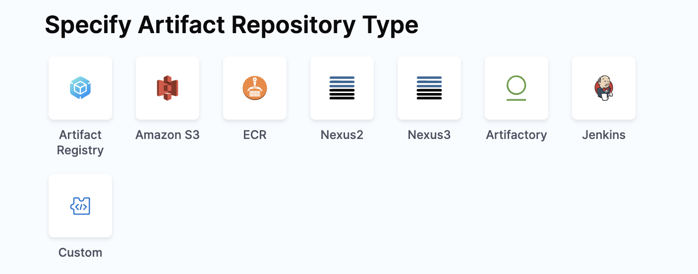
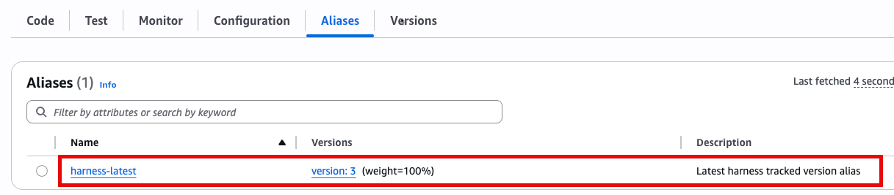
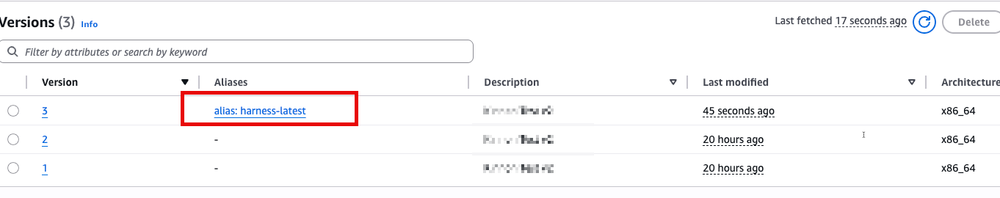

import Tabs from '@theme/Tabs';
import TabItem from '@theme/TabItem';

Harness simplifies the deployment of AWS Lambda functions, enabling developers to focus on code without managing the underlying infrastructure.

With Harness, you specify the function’s location, the artifact, and the AWS account, and Harness takes care of deploying the Lambda function. It will also automatically route traffic from the old version to the new version during each deployment.

This guide covers the fundamentals of Harness Lambda support, along with examples to help you deploy Lambda functions through Harness Continuous Delivery (CD).

**Looking for Serverless.com Framework Lambda?** Harness also supports Serverless.com Framework Lambda deployments. For more information, go to [AWS Lambda deployments (Serverless.com Framework)](/docs/continuous-delivery/deploy-srv-diff-platforms/serverless/serverless-lambda-cd-quickstart).

## Important notes

- Harness can deploy a new Lambda function or update an existing Lambda function.
- Harness' support only deploys and updates Lambda functions. Harness does not update auxiliary event source triggers like the API Gateway, etc.

## AWS IAM permissions

To deploy a Lambda function, you would need an AWS Identity and Access Management (IAM) role with the necessary permissions. You will use that role in the credentials you supply to the Harness AWS connector.

<details>
<summary>AWS IAM permissions</summary>

Here are the minimum AWS IAM role policies that you would need to deploy a Lambda function:

- **IAMReadOnlyAccess**: Needed to verify required policies.
- **AWSLambdaRole**: Needed to invoke function.
- **AWSLambda_FullAccess** (previously AWSLambdaFullAccess): Needed to write to Lambda.
- **AmazonS3ReadOnlyAccess**: Needed to pull the function file from S3.
- **AmazonEC2ContainerRegistryReadOnly**: Needed to pull function container image from ECR. This policy provides read-only access to the ECR repository.

For example, if the role you created was named `LambdaTutorial`, you can attach the policies like this:

```
aws iam attach-role-policy --policy-arn arn:aws:iam::aws:policy/IAMReadOnlyAccess --role-name LambdaTutorial

aws iam attach-role-policy --policy-arn arn:aws:iam::aws:policy/service-role/AWSLambdaRole --role-name LambdaTutorial

aws iam attach-role-policy --policy-arn arn:aws:iam::aws:policy/AWSLambdaFullAccess --role-name LambdaTutorial

aws iam attach-role-policy --policy-arn arn:aws:iam::aws:policy/AmazonS3ReadOnlyAccess --role-name LambdaTutorial
```

- **AWS Lambda Execution Role**: As a Lambda user, you probably already have the AWS Lambda Execution Role set up. If you do not, follow the steps in [AWS Lambda Execution Role](https://docs.aws.amazon.com/lambda/latest/dg/lambda-intro-execution-role.html) from AWS.

Here's an example IAM policy that includes the AWSLambdaExecutionRole, IAMReadOnlyAccess, AWSLambda_FullAccess, AmazonS3ReadOnlyAccess, and AmazonEC2ContainerRegistryReadOnly managed policies:

```json
{
  "Version": "2012-10-17",
  "Statement": [
    {
      "Sid": "IAMReadOnlyAccess",
      "Effect": "Allow",
      "Action": ["iam:Get*", "iam:List*", "iam:SimulateCustomPolicy"],
      "Resource": "*"
    },
    {
      "Sid": "LambdaAccess",
      "Effect": "Allow",
      "Action": [
        "lambda:CreateFunction",
        "lambda:UpdateFunctionCode",
        "lambda:UpdateFunctionConfiguration",
        "lambda:PublishVersion",
        "lambda:CreateAlias",
        "lambda:Get*",
        "lambda:List*",
        "lambda:InvokeFunction",
        "lambda:DeleteFunction",
        "lambda:DeleteAlias",
        "lambda:DeleteFunctionConcurrency",
        "lambda:AddPermission",
        "lambda:RemovePermission",
        "lambda:EnableReplication",
        "lambda:DisableReplication",
        "lambda:GetFunctionCodeSigningConfig",
        "lambda:UpdateFunctionCodeSigningConfig",
        "lambda:GetCodeSigningConfig",
        "lambda:ListCodeSigningConfigs",
        "lambda:CreateCodeSigningConfig",
        "lambda:DeleteCodeSigningConfig",
        "lambda:UpdateFunctionEventInvokeConfig",
        "lambda:GetFunctionEventInvokeConfig",
        "lambda:ListFunctionsByCodeSigningConfig",
        "lambda:ListTags",
        "lambda:TagResource",
        "lambda:UntagResource"
      ],
      "Resource": "*"
    },
    {
      "Sid": "S3ReadOnlyAccess",
      "Effect": "Allow",
      "Action": ["s3:Get*", "s3:List*"],
      "Resource": "*"
    },
    {
      "Sid": "ECRReadOnlyAccess",
      "Effect": "Allow",
      "Action": [
        "ecr:GetAuthorizationToken",
        "ecr:BatchCheckLayerAvailability",
        "ecr:GetDownloadUrlForLayer",
        "ecr:GetRepositoryPolicy",
        "ecr:DescribeRepositories",
        "ecr:ListImages",
        "ecr:DescribeImages",
        "ecr:BatchGetImage"
      ],
      "Resource": "*"
    },
    {
      "Sid": "LambdaRoleAccess",
      "Effect": "Allow",
      "Action": ["iam:PassRole"],
      "Resource": "arn:aws:iam::*:role/service-role/AWSLambdaExecutionRole"
    }
  ]
}
```

</details>

The IAM role is used in Harness when you create an AWS connector. The AWS connector is used during deployment and the role is used by Harness to deploy your function in your AWS account.

## Interactive guide

<Tabs>
<TabItem value="Interactive guide">

Here is an interactive guide to setup your Cloud Run Service pipeline.

<iframe 
	src="https://app.tango.us/app/embed/93c10145-4a18-4834-a2a4-d8a91a0f348a" 
	style={{ minHeight: '800px'}} 
	sandbox="allow-scripts allow-top-navigation-by-user-activation allow-popups allow-same-origin" 
	security="restricted" 
	title="Setting Up GCR Sample Pipeline in Harness" 
	width="100%" 
	height="100%" 
	referrerpolicy="strict-origin-when-cross-origin" 
	frameborder="0" 
   webkitallowfullscreen="webkitallowfullscreen" 
   mozallowfullscreen="mozallowfullscreen" 
	allowfullscreen="allowfullscreen"
></iframe>
</TabItem>
</Tabs>

## AWS connector for Lambda deployments

You need to add a Harness AWS Connector to connect Harness to your AWS account, fetch artifacts, and specify a region to deploy.

AWS connectors are used in your Harness service for the artifact you select in **Artifacts** and in the environment's **Infrastructure Definition**.

You can use the same connector or different connectors, but ensure that the credentials provided for the artifact connector are sufficient to fetch the ZIP or image and the credentials provided for the infrastructure definition connector are sufficient to deploy to Lambda.

OIDC connectors are also supported for Lambda deployments, and this functionality is available starting with **delegate version 851xx or later**.

## Harness service configuration

When you create a Harness service, select **AWS Lambda** to define a service that represents the AWS Lambda function you want to deploy.

The service contains the function artifact in **Artifacts** and the function definition in **AWS Lambda Function Definition**.

### Artifacts

You can deploy **Lambda functions** packaged as **ZIP files** in **Amazon S3 Buckets** or as **containers** in **AWS ECR**. Artifacts can be stored in the following repositories:

- **Amazon S3**
- **ECR**
- **Nexus2**
- **Nexus3**
- **Artifactory**
- **Jenkins**
- **Custom**



The artifact defined in the Harness service is the equivalent to the `Code:ImageUri` in the definition. You omit the `Code:ImageUri` in the definition you add to the service in **AWS Lambda Function Definition** and Harness adds it at runtime using the artifact you added in the service. This allows you to specify the image more dynamically.

If you do use the `Code:ImageUri` in the definition, Harness ignores it and instead uses the artifact in **Artifacts**.

### Function definition

In **AWS Lambda Function Definition**, you specify your function definition.

Harness uses the AWS Lambda [Create Function API](https://docs.aws.amazon.com/lambda/latest/dg/API_CreateFunction.html) to create a new Lambda function in the specified AWS account and region.

The API takes a JSON object as input that defines the configuration settings for the Lambda function, such as the function name, runtime environment, handler function, memory allocation, and IAM role. This allows you to use the function definition as a configuration file in your Harness pipelines.

In Harness, you use a JSON configuration file to define the AWS Lambda you wish to deploy. This configuration lets you define all the function settings supported by the Create Function API.

**Harness Support for Tag Management**

:::note
Currently, the tag management feature is behind the feature flag `CDS_AWS_LAMBDA_ECS_TAG_SUPPORT`. Contact [Harness Support](mailto:support@harness.io) to enable the feature.
:::

Harness supports managing AWS Lambda function tags, allowing users to create, update, and delete tags as part of their function definition. Tags help with resource organization, cost allocation, and security policies.

The minimal requirements for an AWS Lambda function definition are:

- Function Name (`FunctionName`): A unique name for your Lambda function.
- Runtime (`Runtime`): The programming language and version that your function code is written in. Lambda supports multiple programming languages, including Node.js, Python, Java, C#, and Go.
- Handler (`Handler`): The name of the function within your code that Lambda should call when the function is invoked.
- AWS IAM role (`Role`): The IAM role that the function should use to access other AWS services or resources. You can create an IAM role specifically for the Lambda function, or you can reuse an existing IAM role if it has the necessary permissions.
- Tags (Optional): key-value pairs used for organizing resources, applying policies, and cost allocation.

For a full list of supported fields, go to [AWS Lambda Create Function Request](https://docs.aws.amazon.com/lambda/latest/dg/API_CreateFunction.html).

Harness supports all of the popular Git platforms for storing your function definition files.

<details>
<summary>Sample Lambda function</summary>

Here is a NodeJS hello world function example:

```json
{
  "runtime": "nodejs14.x",
  "functionName": "Hello_World",
  "handler": "handler.hello",
  "role": "<YOUR_AWS_ARN>"
}
```
</details>

<details>
<summary>Sample Lambda function with tags</summary>

Here is a NodeJS hello world function with tags example:

```json
{
  "runtime": "nodejs14.x",
  "functionName": "Hello_World",
  "handler": "handler.hello",
  "role": "<YOUR_AWS_ARN>",
  "tags": {
    "Environment": "Production",
    "Project": "test-project",
    "Owner": "DevOps"
  }
}
```

</details>

:::note

Every field name in the function definition must be written in camel case, with the first letter in lowercase.

:::

:::important
Role ARN is a required field when creating a Lambda function for the first time. It is not required when updating existing functions.
:::

You can use Harness service variables in your function definition JSON.

Services variables allow your function definition to be reusable across multiple Lambda functions.

You can override service variables using [Harness environment overrides](/docs/continuous-delivery/x-platform-cd-features/environments/create-environments). Overrides can also be used to change the function definition when it is deployed to different environments.

<details>
<summary>Sample function definition using service variables</summary>

Here's a sample function definition using service variables:

```json
{
   "functionName": "<+serviceVariables.functionName>",
   "handler": "<+serviceVariables.handler>",
   "memorySize": "<+serviceVariables.memorySize>",
   "runtime": "<+serviceVariables.runtime>",
   "timeout": "<+serviceVariables.timeout>",
    "environment": {
        "variables": {
            "VariablesName1": "<+serviceVariables.variableName1>",
            "VariablesName2": "<+serviceVariables.variableName2>"
        }
    },
   "role": "<+serviceVariables.roleARN>"
}
```

</details>

You can also deploy an existing function using its ARN. Here is an ECR Lambda function definition example that uses an existing ARN:

<details>
<summary>Sample ECR Lambda function definition example that uses an existing ARN</summary>

```json
{
  "functionName": "arn:aws:lambda:us-west-2:123456789012:function:my-function",
  "runtime": "nodejs14.x",
  "handler": "index.handler",
  "role": "arn:aws:iam::123456789012:role/my-lambda-role",
  "timeout": 30,
  "memorySize": 256
}
```

</details>


Even though you are only updating an existing function in the above example, you still need to include the artifact in the Harness service **Artifacts** section because the AWS API expects the `Code:ImageUri` in the definition. Harness will dynamically add the artifact in the `Code:ImageUri` at runtime.

### Updating existing functions

Typically, you will use Harness to deploy a new function and its future versions. You can also use Harness to update an existing function.

To update an existing function, the function definition you supply Harness must have a `FunctionName` that matches the name of the function you are updating in AWS and follow the [Create Function API](https://docs.aws.amazon.com/lambda/latest/dg/API_CreateFunction.html#SSS-CreateFunction-request-FunctionName) conventions.

You do not need to use the function ARN in the `FunctionName` of the function definition.

Tag updates: If you need to modify the metadata for your function, you can update the tags without redeploying the function.

### Sample service YAML

Here is the YAML for a sample Harness Lambda service.

<details>
<summary>Sample Service yaml</summary>

You can see it uses `<+serviceVariables.workload_name>` for the file path of the S3 bucket containing the artifact ZIP file. This service variable allow you to select different artifacts at pipeline runtime.

```yaml
service:
  name: helloworld
  identifier: helloworld
  description: "Hello World AWS Lambda"
  tags: {}
  serviceDefinition:
    spec:
      manifests: # Harness introduces a function definition to define the properties of your AWS Lambda function
        - manifest:
            identifier: lambdaFunctionDefinition
            type: AwsLambdaFunctionDefinition
            spec:
              store:
                type: Github
                spec:
                  connectorRef: rohitgithub
                  gitFetchType: Branch
                  paths:
                    - serverless/aws-lambda/createFunction.json
                  branch: master
      artifacts: # The artifact is the packaged .zip or Docker image you wish to deploy to AWS
        primary:
          primaryArtifactRef: <+input>
          sources:
            - spec:
                connectorRef: awscp
                bucketName: mylambda
                region: us-east-2
                filePath: <+serviceVariables.workload_name>
              identifier: test
              type: AmazonS3
      variables:
        - name: workload_name
          type: String
          description: "sample variable definition"
          value: workloadNameValue
    type: AwsLambda
```

</details>

### Service configuration using Harness API

You can configure the Harness AWS Lambda service using the [Create Service API](https://apidocs.harness.io/tag/Services#operation/createServiceV2). Ensure you specify the service type as `AwsLambda`

### Service configuration using Harness Terraform Provider

You can configure the Harness AWS Lambda service using the Harness Terraform Provider [service platform resource](https://registry.terraform.io/providers/harness/harness/latest/docs/resources/platform_service).

<details>
<summary>Sample yaml for creating a service using the Terraform Provider</summary>

Here's an example of creating a service using the Terraform Provider.

```YAML
resource "harness_platform_service" "service" {
  identifier  = "helloworld"
  name        = "hello-world lambda"
  description = "lambda function"
  org_id      = "default"
  project_id  = "serverless"

  yaml = <<-EOT
            service:
              name: helloworld
              identifier: helloworld
              description: "Hello World AWS Lambda"
              tags: {}
              serviceDefinition:
                spec:
                  manifests: # Harness introduces a function definition to define the properties of your AWS Lambda function
                    - manifest:
                        identifier: lambdaFunctionDefinition
                        type: AwsLambdaFunctionDefinition
                        spec:
                          store:
                            type: Github
                            spec:
                              connectorRef: rohitgithub
                              gitFetchType: Branch
                              paths:
                                - serverless/aws-lambda/createFunction.json
                              branch: master
                  artifacts: # The artifact is the packaged .zip or Docker image you wish to deploy to AWS
                    primary:
                      primaryArtifactRef: <+input>
                      sources:
                        - spec:
                            connectorRef: awscp
                            bucketName: sainathlambda
                            region: us-east-2
                            filePath: <+serviceVariables.workload_name>
                          identifier: test
                          type: AmazonS3
                  variables:
                    - name: workload_name
                      type: String
                      description: "sample variable definition"
                      value: workloadNameValue
                type: AwsLambda
              EOT
}
```

</details>

## Define the infrastructure

You define the target infrastructure for your deployment in the **Environment** settings of the pipeline stage. You can define an environment separately and select it in the stage, or create the environment within the stage **Environment** tab.

There are two methods of specifying the deployment target infrastructure:

- **Pre-existing**: the target infrastructure already exists and you simply need to provide the required settings.
- **Dynamically provisioned**: the target infrastructure will be dynamically provisioned on-the-fly as part of the deployment process.

For details on Harness provisioning, go to [Provisioning overview](/docs/continuous-delivery/cd-infrastructure/provisioning-overview).

### Pre-existing Lambda infrastructure

Define a Harness environment and infrastructure definition to tell Harness where to deploy the Lambda function service you created in Harness.

<details>
<summary>Sample YAML for an environment</summary>

Here's an example of the YAML for an environment:

```YAML
environment:
  name: aws
  identifier: aws
  description: "sandbox aws account"
  tags: {}
  type: PreProduction
  orgIdentifier: default
  projectIdentifier: serverlesstest
  variables: []

```
</details>

In the environment, add an infrastructure definition.

Use a Harness AWS connector with an AWS IAM role that can perform the Lambda deployment. For details, go to [AWS IAM Permissions](#aws-iam-permissions) above.

<details>
<summary>Sample YAML example for the infrastructure definition</summary>

Below is a YAML example for the infrastructure definition:

```yaml
infrastructureDefinition:
  name: aws-lambda
  identifier: awslambda
  description: ""
  tags: {}
  orgIdentifier: default
  projectIdentifier: serverlesstest
  environmentRef: aws
  deploymentType: AwsLambda
  type: AwsLambda
  spec:
    connectorRef: awscp
    region: us-east-2
  allowSimultaneousDeployments: false
```

</details>

### Dynamically provisioned Lambda infrastructure

Here is a summary of the steps to dynamically provision the target infrastructure for a deployment:

1. **Add dynamic provisioning to the CD stage**:

   1. In a Harness Deploy stage, in **Environment**, enable the option **Provision your target infrastructure dynamically during the execution of your Pipeline**.
   2. Select the type of provisioner that you want to use.

      Harness automatically adds the provisioner steps for the provisioner type you selected.

   3. Configure the provisioner steps to run your provisioning scripts.
   4. Select or create a Harness infrastructure in **Environment**.

2. **Map the provisioner outputs to the Infrastructure Definition**:
   1. In the Harness infrastructure, enable the option **Map Dynamically Provisioned Infrastructure**.
   2. Map the provisioning script/template outputs to the required infrastructure settings.

#### Supported provisioners

The following provisioners are supported for Lambda deployments:

- Terraform
- Terragrunt
- Terraform Cloud
- CloudFormation
- Shell Script

#### Adding dynamic provisioning to the stage

To add dynamic provisioning to a Harness pipeline Deploy stage, do the following:

1. In a Harness Deploy stage, in **Environment**, enable the option **Provision your target infrastructure dynamically during the execution of your Pipeline**.
2. Select the type of provisioner that you want to use.

   Harness automatically adds the necessary provisioner steps.

3. Set up the provisioner steps to run your provisioning scripts.

For documentation on each of the required steps for the provisioner you selected, go to the following topics:

- Terraform:
  - [Terraform Plan](/docs/continuous-delivery/cd-infrastructure/terraform-infra/run-a-terraform-plan-with-the-terraform-plan-step)
  - [Terraform Apply](/docs/continuous-delivery/cd-infrastructure/terraform-infra/run-a-terraform-plan-with-the-terraform-apply-step)
  - [Terraform Rollback](/docs/continuous-delivery/cd-infrastructure/terraform-infra/rollback-provisioned-infra-with-the-terraform-rollback-step). To see the Terraform Rollback step, toggle the **Rollback** setting.
- [Terragrunt](/docs/continuous-delivery/cd-infrastructure/terragrunt-howtos)
- [Terraform Cloud](/docs/continuous-delivery/cd-infrastructure/terraform-infra/terraform-cloud-deployments)
- CloudFormation:
  - [Create Stack](/docs/continuous-delivery/cd-infrastructure/cloudformation-infra/provision-with-the-cloud-formation-create-stack-step)
  - [Delete Stack](/docs/continuous-delivery/cd-infrastructure/cloudformation-infra/remove-provisioned-infra-with-the-cloud-formation-delete-step)
  - [Rollback Stack](/docs/continuous-delivery/cd-infrastructure/cloudformation-infra/rollback-provisioned-infra-with-the-cloud-formation-rollback-step). To see the Rollback Stack step, toggle the **Rollback** setting.
- [Shell Script](/docs/continuous-delivery/cd-infrastructure/shell-script-provisioning)

#### Mapping provisioner output

Once you set up dynamic provisioning in the stage, you must map outputs from your provisioning script/template to specific settings in the Harness Infrastructure Definition used in the stage.

1. In the same CD Deploy stage where you enabled dynamic provisioning, select or create (**New Infrastructure**) a Harness infrastructure.
2. In the Harness infrastructure, in **Select Infrastructure Type**, select **AWS** if it is not already selected.
3. Enable the option **Map Dynamically Provisioned Infrastructure**.

   A **Provisioner** setting is added and configured as a runtime input.

4. Map the provisioning script/template outputs to the required infrastructure settings.

To provision the target deployment infrastructure, Harness needs specific infrastructure information from your provisioning script. You provide this information by mapping specific Infrastructure Definition settings in Harness to outputs from your template/script.

For Lambda, Harness needs the following settings mapped to outputs:

- Region

:::note
Ensure the **Region** setting is set to the **Expression** option.
:::

<details>
<summary>Sample for CloudFormation template that provisions the infrastructure</summary>

For example, here's a snippet of a CloudFormation template that provisions the infrastructure for a Lambda deployment and includes the required outputs:

```yaml
AWSTemplateFormatVersion: "2010-09-09"
Description: CloudFormation template for provisioning a Lambda function

Resources:
  MyLambdaFunction:
    Type: AWS::Lambda::Function
    Properties:
      FunctionName: MyLambdaFunction
      Runtime: python3.8
      Handler: index.handler
      Role: !GetAtt MyLambdaExecutionRole.Arn
      Code:
        ZipFile: |
          def handler(event, context):
              return {
                  'statusCode': 200,
                  'body': 'Hello from Lambda!'
              }

  MyLambdaExecutionRole:
    Type: AWS::IAM::Role
    Properties:
      AssumeRolePolicyDocument:
        Version: "2012-10-17"
        Statement:
          - Effect: Allow
            Principal:
              Service: lambda.amazonaws.com
            Action: sts:AssumeRole
      Path: /
      Policies:
        - PolicyName: MyLambdaPolicy
          PolicyDocument:
            Version: "2012-10-17"
            Statement:
              - Effect: Allow
                Action: logs:CreateLogGroup
                Resource: !Sub "arn:aws:logs:${AWS::Region}:${AWS::AccountId}:*"
              - Effect: Allow
                Action:
                  - logs:CreateLogStream
                  - logs:PutLogEvents
                Resource: !Sub "arn:aws:logs:${AWS::Region}:${AWS::AccountId}:log-group:/aws/lambda/MyLambdaFunction:*"

Outputs:
  region_name:
    Value: !Ref AWS::Region
    Description: AWS region where the Lambda function is deployed
```

</details>

In the Harness Infrastructure Definition, you map outputs to their corresponding settings using expressions in the format `<+provisioner.OUTPUT_NAME>`, such as `<+provisioner.region_name>`.

<figure>

<DocImage path={require('./static/7513c63ecb793e3daf74f30fc73b204e5801a49fe3d10f2e20d726c8745573c4.png')} width="60%" height="60%" title="Click to view full size image" />

<figcaption>Figure: Mapped outputs.</figcaption>
</figure>

## Lambda deployment steps

Once you have created the Harness service and environment for your deployment, you can model your pipeline in **Pipelines**.

Simply create a new **Deploy** stage, select AWS Lambda as the deployment type, and then use the service and environment you created.

Harness includes execution steps to deploy your function:

- AWS Lambda Deploy
- AWS Lambda Rollback

These steps are added to your pipeline stage **Execution** automatically when you model your pipeline.

### AWS Lambda Deploy step

The AWS Lambda Deploy step requires no configuration because Harness handles the logic to deploy the artifact to the proper AWS account and region.

Harness will deploy the Lambda function and automatically route the traffic from the old version of the Lambda function to the newly deployed one.

Here is the YAML of the AWS Lambda Deploy step.

```yaml
steps:
  - step:
      name: Deploy Aws Lambda
      identifier: deployawslambda
      type: AwsLambdaDeploy
      timeout: 10m
      spec: {}
```

When the step executes Harness will save the information needed for rollback. 

<details>
<summary>Example of Preparing Rollback Data </summary>

Here's an example you can see when you deploy.
```
Preparing Rollback Data..

Fetching Function Details for function: test-lambda-10
Fetched Function Details for most recent deployed function test-lambda-10

Function Version: 99
FunctionARN: arn:aws:lambda:us-east-2:123456789:function:test-lambda-10:99
CodeSha256: Sj0QxkDca5JABord90YoAC+123456789=
Memory Size: 128
Runtime: nodejs16.x
CodeSize: 967
Handler: handler.hello
Architecture: [x86_64]

Prepare Rollback Done.
```
</details>

<details>
<summary>Sample execution logs</summary>

Here's an example of a deployment log you can see when you deploy in Harness:

```
Deploying..

Aws Lambda Manifest Content
{
   "runtime": "nodejs16.x",
   "functionName": "test-lambda-10",
   "handler": "handler.hello",
   "role": "arn:aws:iam::123456789:role/service-role/avengers-test-role-ypjbn4a8"
}
Function: [test-lambda-10] already exists. Update and Publish.
Existing Lambda Function Code Sha256: [123456789/aQ=].
Downloading AmazonS3 artifact with identifier: primary
S3 Object Path: lambda/lambda-cg-test.zip
Successfully downloaded artifact..
Verifying if status of function to be Successful
function: [test-lambda-10], status: [InProgress], reason: [The function is being created.]
Updated Function Code Sha256: [Sj0QxkDca5JABord90YoAC+123456789=]
Updated Function ARN: [arn:aws:lambda:us-east-2:123456789:function:test-lambda-10:101]
Verifying if status of function to be Successful
function: [test-lambda-10], status: [InProgress], reason: [The function is being created.]
Publishing new version
Published new version: [101]
Published function ARN: [arn:aws:lambda:us-east-2:123456789:function:test-lambda-10:101]
Successfully deployed lambda function: [test-lambda-10]

================================================================================
Aws Lambda Alias Manifest Content
{
   "description": "creating alias",
   "name": "test-alias-2"
}

Create or Update Aliases for function test-lambda-10 with version 101.

Updating Alias test-alias-2 for function test-lambda-10 with version 101.

Updated Alias test-alias-2 for function test-lambda-10 with version 101.

Done Creating Aliases
Done
```

</details>


### AWS Lambda Rollback Step

When a pipeline deployment fails, Harness will automatically roll back your Lambda function to the previous version using the AWS Lambda Rollback step. Harness remembers the successful version of the AWS Lambda service deployed and rollback for you.

Here is the YAML for the AWS Lambda Rollback step.

```yaml
rollbackSteps:
  - step:
      name: Aws Lambda rollback
      identifier: awslambdarollback
      type: AwsLambdaRollback
      timeout: 10m
      spec: {}
```

### Rollback for Artifacts Larger Than 50 MB

:::note

Rollback support for artifacts larger than 50 MB stored in S3 is currently behind the feature flag `CDS_AWS_LAMBDA_ROLLBACK_V2`. Contact [Harness Support](mailto:support@harness.io) to enable the feature.

This features requires delegate version `857xx` or later.
:::

#### Prerequisites

Ensure that the IAM role or user associated with the deployment has the following **AWS Lambda permissions** to manage function aliases:

- `lambda:CreateAlias` – Allows creation of a new alias.
- `lambda:UpdateAlias` – Allows updating an existing alias to point to a different version.
- `lambda:DeleteAlias` – Allows deletion of an alias.

Harness uses **Lambda function aliases** to support rollback workflows. During deployment, Harness creates or updates an alias to point to the latest function version. If a rollback is triggered, the alias is redirected to the previously deployed version—restoring the last known good state.

In this case, Harness will create an alias called `harness-latest`, which will facilitate the rollback process.  It is only created when the rollback function is used with the Feature Flag enabled. It is highly recommended that customers do not modify this alias, as it may disrupt the expected state.   Please note that even if you are not using Artifacts larger than 50MB, the Rollback process will remain the same and will utilize Aliases once the flag is enabled.

The alias will appear within Lambda as per the example below:





:::info
Harness manages aliases only for deployments performed through Harness. Creating the alias that points to the latest deployed version is also gated by the same feature flag `CDS_AWS_LAMBDA_ROLLBACK_V2`. 

Harness tracks only the versions deployed via Harness, and rollback is supported only for these deployments. These aliases are used exclusively for rollback operations.
:::

**Process and Function**

- **Deploying without Feature Enabled**:  
  If you deploy an artifact larger than 50 MB **without** enabling the feature flag, the deployment will succeed, but the rollback will **fail**. Harness cannot trace previous artifact versions in this mode.

- **Initial Deployment Process**:  
  If the feature flag is enabled and this is your **first deployment**, Harness creates new aliases. Since there’s no version history, a rollback will effectively do nothing.

- **Subsequent Deployment Process**:  
  If the feature flag is enabled and this is **not your first deployment**, Harness can track previous versions. On rollback, the alias is pointed to the previously deployed version, restoring the earlier state successfully.

- **Enabling flag for Pre-Existing Lambda Deployments**:  
  Customers can also enable this feature flag if they already have deployments enabled.  The next deployment will then be tagged with the alias, and then, the process will follow the same flow.

With the feature flag enabled and the appropriate permissions in place, you can deploy Lambda artifacts of any size from S3, with Harness managing deployment and rollback reliably.

## Lambda Functions Deployment Sample 

To see an example of how to deploy Lambda Functions using Harness, visit the [Harness Community Repository](https://github.com/harness-community/harnesscd-example-apps/tree/master/aws-lambda).

This repository provides a ready-to-use sample application and the necessary configuration files to help you get started quickly.


## FAQs

For frequently asked questions about AWS deployments in Harness, go to [AWS deployment FAQs](/docs/continuous-delivery/deploy-srv-diff-platforms/aws/aws-deployment-faqs).

