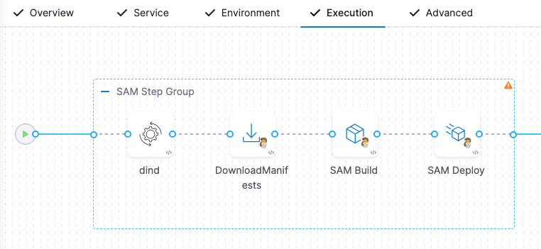

:::note

Currently, AWS SAM support is behind the feature flags `CDS_CONTAINER_STEP_GROUP` and `CDP_AWS_SAM`. Contact [Harness Support](mailto:support@harness.io) to enable the feature.

:::

Harness supports AWS SAM (Serverless Application Model) deployments. SAM is an open-source framework provided by Amazon Web Services (AWS) that simplifies the deployment and management of serverless applications on AWS. It is an extension of AWS's infrastructure-as-code service, CloudFormation.

For SAM deployments in Harness, add your SAM directory to Harness and select the target region. Harness will perform the SAM build and deploy.

## Deployment summary

SAM deployments involve the following:

1. Create Harness SAM service.
   1. Add your SAM directory.
   2. Add a values.yaml file (optional). Harness supports Go templating with SAM templates and values.yaml files.
2. Create Harness SAM environment.
   1. Define the target infrastructure by adding a Harness AWS connector with the necessary AWS permissions for the deployment and a target AWS region.
3. Create Harness SAM pipeline stage.
   1. Select the Harness SAM service to use.
   2. Select the Harness SAM environment to use.
   3. Define deployment strategy. Harness automatically generates the steps required to deploy your SAM template.
4. Deploy pipeline.


## Supported integrations

For details on AWS support in Harness, including tooling, limitations, and repositories, go to [Supported CD features and integrations](/docs/continuous-delivery/cd-integrations).

## Important notes

- Harness supports Go templating with SAM templates and values.yaml files.
- Currently, you cannot add artifacts to your Harness SAM service.
- The Harness AWS connector used in the Infrastructure Definition for the SAM stage must use the **AWS Access Key** option for credentials. The **Assume IAM role on Delegate** and **Use IRSA** options are not supported for SAM deployments.
- You can manage whether Harness performs the SAM build within an ephemeral Docker container in a Kubernetes cluster using the `--use-container` option in the Harness SAM Build step. You can manage the Kubernetes settings for these steps as needed.

## Demo Video
<docvideo src="https://www.loom.com/share/477c342c400a49dfa88d7b818eb3b605?sid=a21d7c2c-f3e5-4a54-bcd9-2837c278105e" />


## AWS permissions

When you set up the Harness environment for your deployment, you must add a Harness AWS connector to the Harness environment Infrastructure Definition. Typically, the AWS connector uses the access and secret keys for an AWS IAM user (there are other options). The permissions added to the IAM user account must permit whatever AWS service changes you are performing in your SAM template.

<details>
<summary>Common SAM permissions</summary>

- **IAM role for SAM deployment:** You need an IAM role with the necessary permissions to deploy AWS SAM applications. This role should include permissions for interacting with AWS CloudFormation, AWS Lambda, Amazon API Gateway, and other AWS services your application relies on.
- **CloudFormation permissions:** The IAM role should have permissions to create, update, and delete CloudFormation stacks. This includes permissions for creating and managing CloudFormation templates, stack resources, and stack policy.
- **Lambda function permissions:** The IAM role should have appropriate permissions for creating and managing Lambda functions. This includes permissions for creating, updating, and deleting Lambda functions, as well as permissions for viewing and modifying function configurations, policies, and execution roles.
- **API Gateway permissions:** If your SAM application uses Amazon API Gateway for creating REST APIs, the IAM role should have permissions to manage API Gateway resources. This includes permissions for creating and managing APIs, methods, stages, deployment, and integration configurations.
- **S3 bucket permissions:** If your SAM application requires storing artifacts or deployment packages in Amazon S3, the IAM role should have permissions to read and write to the specific S3 buckets used for storing deployment artifacts.
- **CloudWatch logs permissions:** If your SAM application generates logs that are stored in Amazon CloudWatch Logs, the IAM role should have permissions to create and write logs to the specified log groups.
- **Other service-specific permissions:** Depending on the services your SAM application interacts with (for example, DynamoDB, SNS, SQS, etc.), you may need to include additional permissions specific to those services.

The most common roles for SAM are:

- AWSLambdaFullAccess
- AWSCloudFormationFullAccess
- AmazonS3FullAccess
- AmazonAPIGatewayAdministrator

For more details, go to [Managing resource access and permissions](https://docs.aws.amazon.com/serverless-application-model/latest/developerguide/sam-permissions.html) from AWS.

</details>


## AWS SAM service

Harness supports standard SAM templates. You can add your SAM directory in the Harness SAM service. 

:::note

For information on general service settings, go to [Services and environments basics](/docs/continuous-delivery/get-started/services-and-environments-overview).

:::

To add your template, do the following:

1. In your Harness project, in **Deployments**, select **Services**.
2. Select **New Service**.
3. Name the service and select **Save**.
4. In **Deployment Type**, select **AWS SAM**.
5. In **Manifests**, select **Add Manifest**.
6. In **Specify Manifest Type**, select **AWS SAM Directory**, and then select **Continue**.
7. In **Specify AWS SAM Directory Store**, select your Git provider. You can also use the [Harness File Store](/docs/continuous-delivery/x-platform-cd-features/services/add-inline-manifests-using-file-store).
8. Select or create a new Harness Git connector to your Git provider, and then select **Continue**.
9. In **Manifest Details**, enter the following:
   1.  **Manifest Identifier:** Enter a name for the template.
   2.  **Git Fetch Type:** Select how you want to fetch the template.
   3.  **Branch**/**Commit Id:** Enter the branch name or commit Id.
   4.  **File/Folder Path:** Enter the path to the template from the root of the repository.
10. Select **Submit**.

### Values YAML

You can also add a values.yaml file to use Go templating in your SAM template. Go templating allows you to select different values.yaml files for different environments, etc.

Your values.yaml file can use standard Go formatting, like this:

```yaml
runtime: nodejs18.x
```

Your template references the values.yaml file using the format `{{.Values.KEY}}`. Here's an example using `{{.Values.runtime}}`:

```yaml
...
  StockCheckerFunction:
    Type: AWS::Serverless::Function # More info about Function Resource: https://docs.aws.amazon.com/serverless-application-model/latest/developerguide/sam-resource-function.html
    Properties:
      CodeUri: functions/stock-checker/
      Handler: app.lambdaHandler
      Runtime: {{.Values.runtime}}
      Architectures:
        - x86_64
...
```

### Variables

You can create service variables, and then use them in the values.yaml file you added.

You simply use a service variable reference as the value:

```yaml
runtime: <+serviceVariables.runtime>
```

You can only use service variable references in the values.yaml file.

For information on how to override service variables at the environment level, go to [Services and environments basics](/docs/continuous-delivery/get-started/services-and-environments-overview).

## AWS SAM environment

:::note

For information on general environment settings, go to [Services and environments basics](/docs/continuous-delivery/get-started/services-and-environments-overview).

:::

To create an environment, do the following:

1. In your Harness project, in **Deployments**, select **Environments**.
2. Select **New Environment**, name the environment, select its **Environment Type**, and then select **Save**.

Next you will add the SAM infrastructure definition.


### AWS SAM infrastructure definition

The SAM infrastructure definition is the target AWS account and region for the SAM deployment.

1. In the environment, select **Infrastructure Definitions**.
2. Select **Infrastructure Definitions**.
3. Name the infrastructure definition and, in **Deployment Type**, select **AWS SAM**.
4. In **Connector**, select or create a Harness AWS connector. Ensure the IAM account uses the required permissions for the operations your SAM template requires.
5. In **Region**, select the target region.
6. Select **Save**.

When a pipeline stage uses this infrastructure definition, it will deploy your SAM template changes in the target region.

## AWS SAM stage

Now that you have your SAM service and environment, you can create your SAM pipeline.

When you add a Deploy stage to a pipeline, you can select the AWS SAM deployment type. 

1. In your Harness project, in **Deployments**, create or open a pipeline.
2. Select **Add Stage**, and then select **Deploy**.
3. Name your stage.
4. In **Deployment Type**, select **AWS SAM**, and then select **Set Up Stage**.
5. In **Service**, select the SAM service to use, and then select **Continue**.
6. In **Environment**, select the SAM environment and infrastructure definition to use, and then select **Continue**.
7. Select the [deployment strategy](/docs/continuous-delivery/manage-deployments/deployment-concepts) to use, and then select **Use Strategy**.

## AWS SAM basic strategy and steps

The basic strategy consists of the following execution setup:

- **SAM step group:** Uses your Kubernetes cluster as a step runtime infrastructure.
  - **DinD Background step:** Creates a Docker in Docker container for the each step's execution resources.
  - **Download Manifests step:** Fetches your SAM template.
  - **SAM Build step:** Runs a [SAM build](https://docs.aws.amazon.com/serverless-application-model/latest/developerguide/sam-cli-command-reference-sam-build.html).
  - **SAM Deploy step:** Runs a [SAM deploy](https://docs.aws.amazon.com/serverless-application-model/latest/developerguide/sam-cli-command-reference-sam-deploy.html).

  

These steps are described in detail below.

### SAM step group

Harness automatically generates a containerized step group containing the steps needed for the SAM build and deploy.

When the step group setting **Enable container based execution** is enabled, the step group is containerized. When it is disabled, the Harness Delegate performs all tasks on its host system.

You need to configure the following mandatory settings:

- **Kubernetes Cluster:** Add a Harness [Kubernetes Cluster connector](https://developer.harness.io/docs/platform/connectors/cloud-providers/ref-cloud-providers/kubernetes-cluster-connector-settings-reference/) to connect to the cluster that will be used as the runtime step infrastructure.
- **Namespace:** Enter the name of the cluster namespace to use.

### Harness Docker Hub connector and image for all steps

The DinD Background, SAM Build, and SAM Deploy steps are containerized. In each step, you must provide a Harness connector to a container registry and an image for the container the step uses.

When you create the **Execution** section of your stage the first time and select the Basic strategy, Harness supplies the container registry connector and image for each step automatically.

You can add/select a different container registry connector and image for each step, but the image should support the SAM template operations you are deploying.

### DinD Background step

Let's review the SAM deployment's use of the DinD Background step:

1. Open the **dind** Background step. The automatically generated step is named `dind`.
2. In **Container Registry**, the Harness container registry connector is already set up. You can add/select your own container registry connector if you like.
3. In **Image**, you can see the `docker:dind` Docker in Docker image is set up.
   
   The remaining settings on optional.

### Download manifests step

The Download Manifests step fetches the SAM template in the Harness service you selected for this stage. This step does not require configuration. 

Here's an example of the step tasks:

1. **Git initialization:** The command `git init` is executed to initialize a new Git repository.
2. **Setting remote origin:** The command `git remote add origin <repository-url>` is executed to set the remote origin for the Git repository.
3. **Fetching remote branches:** The command `git fetch --depth=50 origin +refs/heads/main:` is executed to fetch the remote branches from the origin.
4. **Checking out main branch:** The command `git checkout -b main origin/main` is executed to create and switch to a new branch named `main` based on the remote branch `origin/main`.


### SAM Build step

The SAM Build step performs a standard [SAM build](https://docs.aws.amazon.com/serverless-application-model/latest/developerguide/sam-cli-command-reference-sam-build.html) as well as setting up the container environment, resolving expressions in the SAM template, and building the SAM application using the specified dependencies and Docker container image.

To configure the SAM Build step, do the following:

1. Open the SAM Build step.
2. In **Container Registry**, you can see that the Harness Docker Registry connector is already set up.
3. In **Image**, you can see a SAM build image is already set up. For example, `harnessdev/sam-build:1.82.0-latest`. Harness will automatically populate this setting, but you can use a different image.

#### AWS SAM build command options (required)

The [--use-container](https://docs.aws.amazon.com/serverless-application-model/latest/developerguide/sam-cli-command-reference-sam-build.html) option is set up by Harness automatically. This command ensures that AWS SAM packages and builds the application code inside a Docker container that is configured with the necessary dependencies and runtime environment specified in the AWS SAM template.

:::caution

Do not remove this command. It is required for the current beta of this feature. It will be optional in future releases.

:::

#### SAM build docker container registry (required for beta)

In **SAM Build Docker Container Registry**, you can use the same Harness Docker Registry connector automatically set up in the **Container Registry** setting or add/select your own connector.

:::caution

Do not remove this connector. It is required for the current beta of this feature. It will be optional in future releases.

:::

#### Step execution summary

Here's a summary of the step's tasks that you will see in the step log once its run:

1. **Setting up environment:** 
   1. Changes the current directory, such as `m1/SAM/sam-nodejs-multi-step`.
   2. The command `docker ps` is executed to check if Docker is running, but no containers are listed.
2. **Exporting variables:** 
   1. Several environment variables are set using the `export` command, including `PLUGIN_SAM_TEMPLATE_FILE_PATH`, `PLUGIN_VALUES_YAML_FILE_PATH`, and `PLUGIN_VALUES_YAML_CONTENT`. These variables are exported to be used in subsequent commands.
3. **Resolving expressions in SAM template:**
   1. The command `/opt/harness/client-tools/go-template/v0.4.1/go-template -t template.yaml -f values.yaml -o .` is executed to resolve expressions in the SAM template file based on the values provided in values.yaml.
   2. The resolved SAM template content is displayed in the log before and after expression resolution.
4. **Building SAM application code:**
   1. The command `java -jar /opt/harness/sam-build.jar` is executed to build the SAM application.
   2. The SAM CLI collects telemetry data, and it provides a link to learn more about telemetry. 
   3. The Docker container `image public.ecr.aws/sam/build-nodejs18.x:latest-x86_64` is fetched to build the SAM application. 
   4. A builder is used to pack, install dependencies, and clean up the environment for each template function.
5. **Build result:**
   1. The build is marked successful, and the built artifacts are located in the `.aws-sam/build` directory.
   2. The built SAM template is located at `.aws-sam/build/template.yaml`.


### SAM Deploy step

The SAM Deploy step performs a standard [SAM deploy](https://docs.aws.amazon.com/serverless-application-model/latest/developerguide/sam-cli-command-reference-sam-deploy.html).

To configure the SAM Deploy step, do the following:

1. Open the SAM Deploy step.
2. In **Container Registry**, you can see that the Harness Docker Registry connector is already set up.
3. In **Image**, you can see a SAM deploy image is already set up. For example, `harnessdev/sam-build:1.82.0-latest`. Harness will automatically populate this setting, but you can use a different image.
4. In Stake Name, enter the name of the CloudFormation stack that will be created or updated as part of the deployment process.

Here's a summary of the step's tasks that you will see in the step log once its run:

1. The `aws configure` authentication steps are executed.
2. The directory is changed to the working directory, such as `m1/SAM/sam-nodejs-multi-step`.
3. The command `docker ps` is executed.
4. The command `java -jar /opt/harness/sam-deploy.jar` is executed.
5. Information about SAM CLI telemetry collection is displayed.
6. Information about the managed S3 bucket is displayed.
7. Details of the deployment are displayed, including stack name, region, and other parameters.
8. The deployment is initiated.
9. The SAM deployment is successful.

## Deploy the pipeline

Now that the pipeline is complete, you can deploy it.

1. Select **Run**, and then select **Run Pipeline** to initiate the deployment.
2. Observe the execution logs as Harness deploys the template and checks for a successful deployment.

In the SAM Deploy step logs, you can see the CloudFormation events from stack operations and CloudFormation outputs from the deployment stack.

If the deployment is successful, you will see:

```
Successfully created/updated stack - STACK_NAME
...
SAM Deploy Successful
```


