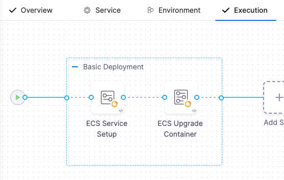
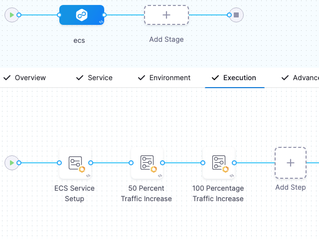

You can deploy ECS services using a basic strategy with phased traffic shifting and scaling, incrementally increasing the new service instances while decreasing the old service instances.

This topic explains the differences between a standard basic strategy and one with phased traffic shifting  and scaling, and explains how to set up a basic strategy with phased traffic shifting and scaling.

## Standard basic vs phased

You have two strategy options when performing an ECS basic deployment in Harness: standard basic and basic with phased traffic shift and scaling.

### Standard basic strategy

In a standard ECS basic deployment, Harness deploys the ECS service using your ECS service definition in an ECS Service Setup step, and then upgrades the container using a ECS Upgrade Container step to a percentage of the ECS service definition `desiredCount` or to a specific number of instances.

  


### Basic with phased traffic shifting and scaling

Basic with phased traffic shifting and scaling is the same as standard basic but includes multiple ECS Upgrade Container steps, each deploying a percentage of the desiredCount until it reaches 100% or a specific number of instances.

Here's a video overview:

<!-- Video:
https://www.loom.com/share/9ba108c0fc84403795895261c5671a02?sid=004122a0-66a2-4f67-9f7e-f7039da7c22e-->
<docvideo src="https://www.loom.com/share/9ba108c0fc84403795895261c5671a02?sid=004122a0-66a2-4f67-9f7e-f7039da7c22e" />

Here's a pipeline that demonstrates a ECS deployment with phased traffic shifting. There are two `EcsUpgradeContainer` steps. 

The first `EcsUpgradeContainer` step upgrades the container to 50% of the `desiredCount` in the ECS service definition, and the next `EcsUpgradeContainer` step upgrades the container to 100%.


<details>
<summary>ECS basic strategy with phased traffic shifting sample pipeline YAML</summary>

```yaml
pipeline:
  name: EcsPipeline
  identifier: EcsPipeline
  projectIdentifier: default
  orgIdentifier: default
  tags: {}
  stages:
    - stage:
        name: ecs
        identifier: ecs
        description: ""
        type: Deployment
        spec:
          deploymentType: ECS
          service:
            serviceRef: EcsService1_B5
          execution:
            steps:
              - step:
                  type: EcsServiceSetup
                  name: ECS Service Setup
                  identifier: EcsServiceSetup_1
                  spec:
                    resizeStrategy: ResizeNewFirst
                  timeout: 10m
              - step:
                  type: EcsUpgradeContainer
                  name: 50 Percent Traffic Increase
                  identifier: EcsUpgradeContainer_1
                  spec:
                    newServiceInstanceCount: 50
                    newServiceInstanceUnit: Percentage
                  timeout: 10m
              - step:
                  type: EcsUpgradeContainer
                  name: 100 Percentage Traffic Increase
                  identifier: EcsUpgradeContainer_2
                  spec:
                    newServiceInstanceCount: 100
                    newServiceInstanceUnit: Percentage
                  timeout: 10m
            rollbackSteps:
              - step:
                  type: EcsBasicRollback
                  name: EcsBasicRollback_1
                  identifier: EcsBasicRollback_1
                  spec: {}
                  timeout: 10m
          environment:
            environmentRef: EcsEnv_yV
            deployToAll: false
            infrastructureDefinitions:
              - identifier: EcsInfra_Jf
        tags: {}
        failureStrategies:
          - onFailure:
              errors:
                - AllErrors
              action:
                type: StageRollback
        variables:
          - name: runTaskName
            type: String
            description: ""
            value: runTask-auto
          - name: runTaskCount
            type: Number
            description: ""
            value: 1
          - name: var1
            type: String
            description: ""
            value: ecs-auto-iG
```


</details>


The ECS basic strategy with phased traffic shifting and scaling performs the following steps:

1. **ECS Service Setup step:** Create a new ECS service with 0 instances.
2. **First ECS Upgrade Container step:** Upgrade instances of new service by X% (or count) and decrease instances of old service by Y% (or count).
   1. (Optional) Perform Harness [Continuous Verification (CV)](/docs/continuous-delivery/verify/cv-getstarted/verify-deployments-with-the-verify-step). Once CV is performed, step 2 is run again.
3. **Additional ECS Upgrade Container step(s):** ECS Upgrade Container: Upgrade new service to 100% (or count) and old service to 0% (or count).

  

## Set up basic with phased traffic shifting

To set up an ECS basic deployment with phased traffic shifting and scaling, do the following:

1. Add an ECS stage to your pipeline.
2. Add a Harness service in the stage **Service**.
3. Add a Harness environment and infrastructure in the stage **Environment**.
4. Select the basic deployment strategy in the stage **Execution**.
5. Configure the **ECS Service Setup** step, described below.
6. Configure the first **ECS Upgrade Container** step, described below.
7. Add and configure additional **ECS Upgrade Container step(s)**, described below.

## ECS Service Setup step

The ECS Service Setup step uses the ECS service definition in the stage's **Service** setting to create a new ECS service with 0 instances.

The ECS Service Setup step has the following settings.

### Resize Strategy

You can define whether to upsize the new service first or downsize old service first in later steps. By default, Harness upsizes the new service first.

### Same as already running instances

When the **Same as already running instances** is selected, the new ECS service is deployed with same instances as the old service after the deployment is completed.

## First ECS Upgrade Container step

The ECS Upgrade Container step upgrades the number instances of the new service by X% (or count) and decrease instances of old the service by Y% (or count).

### Instance Count and Instance Unit

**Instance Count** specifies desired count for new service. The default is 100 percent. 

For phased traffic shifting, enter an incremental percentage (or count), such as 50 percent. Subsequent ECS Upgrade Container steps can increase the percentage until it reaches 100 percent or the full count you desire.

**Percentage** refers to a percentage of the `desiredCount` in the ECS service definition you are using.

**Count** overrides the `desiredCount` in the ECS service definition you are using.

### Downsize Instance Count and Downsize Instance Count Unit

**Downsize Instance Count** specifies the instance count/percentage for the old service. 


## Adding ECS Upgrade Container steps for traffic shifting and scaling

To perform phased traffic shifting and scaling, you use multiple ECS Upgrade Container steps, each incrementing the instance count/percentage until it reaches 100% or a specific count.

If you use percentage, then you are increasing the number of instances by a percentage of the `desiredCount` in the ECS service definition you are deploying.

If you use count, you are overriding the `desiredCount` in the ECS service definition with a specific instance count.

## Advanced settings

All steps include the following **Advanced** settings:

* [Delegate Selector](https://developer.harness.io/docs/platform/delegates/manage-delegates/select-delegates-with-selectors/)
* [Conditional Execution](https://developer.harness.io/docs/platform/pipelines/w_pipeline-steps-reference/step-skip-condition-settings/)
* [Failure Strategy](https://developer.harness.io/docs/platform/pipelines/w_pipeline-steps-reference/step-failure-strategy-settings/)
* [Looping Strategy](https://developer.harness.io/docs/platform/pipelines/looping-strategies-matrix-repeat-and-parallelism/)
* [Policy Enforcement](https://developer.harness.io/docs/platform/governance/policy-as-code/harness-governance-overview/)


