This topic shows you how to deploy images to your Amazon Elastic Container Service (ECS) cluster using a Rolling Deployment strategy in Harness.

See [Notes](#notes) below for details on other ECS deployment settings and behavior.

## Visual summary

<!-- Video:
https://harness-1.wistia.com/medias/vtlwxnczyh-->
<docvideo src="https://harness-1.wistia.com/medias/vtlwxnczyh" />

## Overview

In this topic, you'll learn how to:

* Set up AWS IAM and ECS for Harness ECS deployments.
* Install and register a Harness Delegate for ECS deployments.
* Connect Harness with AWS, your ECS clusters, and Docker Hub.
* Add your Docker image to Harness.
* Define your ECS container and service specs in Harness.
* Create and deploy an ECS Rolling deployment.


## AWS IAM requirements

Create a custom managed policy for Harness. This policy allows Harness to perform ECS tasks. You will attach it to the IAM User you use to connect Harness with AWS.  

The custom managed policy should have the following permissions:  

```json
 {  
    "Version": "2012-10-17",  
    "Statement": [  
        {  
            "Effect": "Allow",  
            "Action": [  
                "ecr:DescribeRepositories",  
                "ecs:ListClusters",  
                "ecs:ListServices",  
                "ecs:DescribeServices",  
                "ecr:ListImages",  
		"ecr:DescribeImages",
                "ecs:RegisterTaskDefinition",  
                "ecs:CreateService",  
                "ecs:ListTasks",  
                "ecs:DescribeTasks",  
                "ecs:DeleteService",  
                "ecs:UpdateService",  
                "ecs:DescribeContainerInstances",  
                "ecs:DescribeTaskDefinition",  
                "application-autoscaling:DescribeScalableTargets",  
                "application-autoscaling:DescribeScalingPolicies",  
                "iam:ListRoles",  
                "iam:PassRole"  
            ],  
            "Resource": "*"  
        }  
    ]  
}
```

<details>
<summary>Permissions review</summary>

|                   Permission                    |                                                                                                               How does Harness use it?                                                                                                               |
| ----------------------------------------------- | ---------------------------------------------------------------------------------------------------------------------------------------------------------------------------------------------------------------------------------------------------- |
| `ecr:DescribeRepositories`                        | Lists the ECR images so Harness can fetch an image from ECR and pass the tag details in for deployment with the Task Definition. Harness needs to query the ECR Repos so users can select an image.                                           |
| `ecs:ListClusters`                                | In the Harness infrastructure definition, when a user passes in an AWS connector and a region, Harness can list the set of ECS clusters in that region via a drop down. Harness also uses this permission when performing instance sync and surfacing up instance data. |
| `ecs:ListServices`                                | Harness uses this permission to list the set of services that are deployed in the cluster. It helps Harness identify the service Harness deployed.                                                                                                                   |
| `ecr:ListImages`                                  | Lists the images from the selected ECR repo during artifact selection.                                                                                                                                                                                |
| `ecs:DescribeServices`                            | Gets details of the services Harness deployed on the cluster to check steady state.                                                                                                                                                             |
| `ecs:RegisterTaskDefinition`                      | Creates a task definition during deployment.                                                                                                                                                                           |
| `ecs:CreateService`                               | Creates a service definition in ECS.                                                                                                                                                                                    |
| `ecs:DescribeTasks`                               | Describes the tasks on the cluster.                                                                                                                                                                                                           |
| `ecs:ListTasks`                                   | Lists the tasks that have been deployed and capture the revision.                                                                                                                                                      |
| `ecs:DeleteService`                               | When Harness deploys a new service Harness deletes the older version of service.                                                                                                                                                                            |
| `ecs:UpdateService`                               | When Harness deploys an ECS service Harness updates the existing service and configures a revision.                                                                                                                                                      |
| `ecs:DescribeContainerInstances`                  | Harness uses this to surface up the container image information about what container was deployed and show it on the Harness Service Dashboard.                                                                                                                          |
| `ecs:DescribeTaskDefinition`                      | Describes the Task Definition Harness deployed. Harness collects the revision data for rollback purposes. Harness also uses it to understand the current state of the ECS cluster.                                                                       |
| `application-autoscaling:DescribeScalableTargets` | Describes the scalable targets Harness deploys with the ECS service. This permission can be removed if the user doesn’t leverage scalable targets.                                                                                                      |
| `application-autoscaling:DescribeScalingPolicies` | Describes the scaling policies associated with the deployed ECS service. This permission can be removed if the user doesn’t leverage scaling policies.                                                                                            |
| `iam:ListRoles`                                   | Lists roles. Harness uses the role associated with the Harness connector for deployment.                                                                                                                                                                     |
| `iam:PassRole`                                    | Harness passes the role with the ECS deployment.                                                                                                                                                                                                          |

</details>


When you do your own deployments, you might need additional permissions added to this policy. It depends on your Task Definition. Alternately, you can use [AmazonECS\_FullAccess](https://docs.amazonaws.cn/en_us/AmazonECS/latest/developerguide/security-iam-awsmanpol.html).

1. Create or edit an IAM user and attach the custom managed policy you create above. In this example, we'll name this policy **HarnessECS**.
2. Generate an access key for the IAM user for connecting Harness to AWS ECS. In the IAM User, click **Security credentials** and then in **Access keys** create and save the key. You will use the Access key ID and Secret access key in the Harness AWS connector later.

Now that you have all the AWS credentials configured, you can create or select an ECS cluster to use for your deployment.

## Set up your ECS cluster

Next, let's define the target cluster.

The cluster must meet the following specs:

* EC2 Linux + Networking cluster.
* The ECS Cluster must have a minimum of 8GB memory for the Delegate. A m5.xlarge minimum is suggested.
* 2 registered container instances.
* The custom role described above.

You will select this cluster later when your define the target Infrastructure Definition for the CD stage in your Harness Pipeline.

### Install and register the Harness delegate

The Harness delegate is a software service you install in your environment. It connects to the Harness Manager and performs ECS tasks. You can install the delegate anywhere that has connectivity to your AWS account, even locally on your computer.

If you're new to Harness, read [Harness Platform architecture](/docs/getting-started/harness-platform-architecture) to learn about how Harness uses a delegate to perform deployment tasks.

1. Follow the steps in [Delegate installation overview](https://developer.harness.io/docs/platform/Delegates/install-delegates/overview) to install a Harness delegate.

When you are done setting up the delegate and it has registered with Harness, you'll see the delegate's tags on the delegates list page:

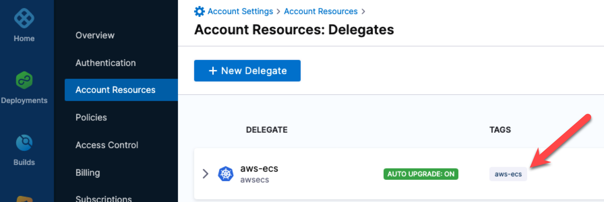

Take note of that tag name. You will use it in your Harness AWS connector and ECS Rolling Deploy step to ensure that Harness uses that delegate when performing deployments.

## Create the Harness ECS pipeline

1. In your Harness Project, click **Deployments**.
2. Click **Pipelines**, and then click **Create a Pipeline**.
3. Enter a name for the Pipeline and then click **Start**.
4. Click **Add Stage**.
5. Click **Deploy**.
6. In **Stage Name**, enter a name.
7. In **Deployment Type**, click **Amazon ECS**, and then click **Set Up Stage**.

Here's a quick summary:


The new stage is created. Next, you add a Harness service to represent the app you're deploying, and configure the service with the ECS Task Definition, Service Definition, and artifact for deployment.

## Add the Harness service

A Harness service represents the app you are deploying. It contains any supporting files and the artifact image.

For more information about services, see [Services and Environments Overview](/docs/continuous-delivery/get-started/services-and-environments-overview).

1. In **Service**, click **New Service**.
2. In **Name**, enter a name.

You can see that an ECS service contains the following:

* Task Definition
* Service Definition
* Scalable Target (Optional)
* Scaling Policy (Optional)
* Artifacts

For this example, we'll set up the Task Definition, Service Definition, and Artifacts.

## Add the task definition

Harness has full support for ECS task definitions. You simply provide Harness with a task definition and it will implement it.

There are two ways to add the ECS task definition to the Harness service:

- **Task Definition**: Add a connection to the task definition file in a remote Git repository, local [Harness File Store](/docs/continuous-delivery/x-platform-cd-features/services/add-inline-manifests-using-file-store/), or object storage (AWS S3).
- **Task Definition ARN**: Add the task definition ARN. 
  - The task definition ARN points to an existing task created and available in the AWS cluster with the required definition.
  - The task definition will be fetched using the task ARN provided and added to the ECS service configuration provided in the Harness ECS service **Service Definition**.
  - During deployment, the required task is deployed with the desired count provided in the **Service Definition**. 

:::note

When a task definition ARN is provided instead of a task definition spec, a force deployment is enabled for rolling deployments by default. When you perform a force deployment, ECS terminates the running tasks associated with the service and replaces them with tasks using the new task definition.

:::

If you are new to ECS, review the AWS documentation on [ECS Task Definitions](https://docs.aws.amazon.com/AmazonECS/latest/developerguide/task_definitions.html).

Let's look at an example using a task definition file in the [Harness File Store](/docs/continuous-delivery/x-platform-cd-features/services/add-inline-manifests-using-file-store).

1. In **Task Definition**, click **Add Task Definition**.  
  You specify what Task Definition to use in the **ECS Task Definition Store**.

  

  You can use a remote repo, but for this example we'll use the built-in Harness file manager, [Harness File Store](/docs/continuous-delivery/x-platform-cd-features/services/add-inline-manifests-using-file-store).
2. Select **Harness**, and then select **Continue**.
3. In **Task Definition**, select **Add Task Definition**.
4. In **Specify ECS Task Definition Store**, select **Harness**, and select **Continue**.
5. In **Manifest Details**, enter a name for the task definition.
6. In **File/Folder Path**, select **Select**. The Harness File Store appears.
7. Create a new folder.
8. In the new folder, create a new file named **RegisterTaskDefinitionRequest.yaml**.
9. Paste the following Task Definition into the file, select **Save**, and then select **Apply Selected**.
   1. Replace the two `<Role ARN>` with the ARN for the **ecsInstanceRole** used for your cluster. See [Amazon ECS Instance Role](https://docs.aws.amazon.com/batch/latest/userguide/instance_IAM_role.html) from AWS. 
   2. When you are done, in **Manifest Details**, select **Submit**. 

JSON Example:
```json
{  
   "ipcMode": null,  
   "executionRoleArn": "<Role ARN>",  
   "containerDefinitions": [  
       {  
           "dnsSearchDomains": null,  
           "environmentFiles": null,  
           "entryPoint": null,  
           "portMappings": [  
               {  
                   "hostPort": 80,  
                   "protocol": "tcp",  
                   "containerPort": 80  
               }  
           ],  
           "command": null,  
           "linuxParameters": null,  
           "cpu": 0,  
           "environment": [],  
           "resourceRequirements": null,  
           "ulimits": null,  
           "dnsServers": null,  
           "mountPoints": [],  
           "workingDirectory": null,  
           "secrets": null,  
           "dockerSecurityOptions": null,  
           "memory": null,  
           "memoryReservation": 128,  
           "volumesFrom": [],  
           "stopTimeout": null,  
           "image": "<+primary.artifact.image>",  
           "startTimeout": null,  
           "firelensConfiguration": null,  
           "dependsOn": null,  
           "disableNetworking": null,  
           "interactive": null,  
           "healthCheck": null,  
           "essential": true,  
           "links": null,  
           "hostname": null,  
           "extraHosts": null,  
           "pseudoTerminal": null,  
           "user": null,  
           "readonlyRootFilesystem": null,  
           "dockerLabels": null,  
           "systemControls": null,  
           "privileged": null,  
           "name": "nginx"  
       }  
   ],  
   "placementConstraints": [],  
   "memory": "512",  
   "taskRoleArn": "<Role ARN>",  
   "family": "fargate-task-definition",  
   "pidMode": null,  
   "requiresCompatibilities": [  
       "FARGATE"  
   ],  
   "networkMode": "awsvpc",  
   "runtimePlatform": null,  
   "cpu": "256",  
   "inferenceAccelerators": null,  
   "proxyConfiguration": null,  
   "volumes": []  
}
```
YAML Example:
```yaml
ipcMode:  
executionRoleArn: <Role ARN>  
containerDefinitions:  
- dnsSearchDomains:  
 environmentFiles:  
 entryPoint:  
 portMappings:  
 - hostPort: 80  
   protocol: tcp  
   containerPort: 80  
 command:  
 linuxParameters:  
 cpu: 0  
 environment: []  
 resourceRequirements:  
 ulimits:  
 dnsServers:  
 mountPoints: []  
 workingDirectory:  
 secrets:  
 dockerSecurityOptions:  
 memory:  
 memoryReservation: 128  
 volumesFrom: []  
 stopTimeout:  
 image: <+primary.artifact.image>  
 startTimeout:  
 firelensConfiguration:  
 dependsOn:  
 disableNetworking:  
 interactive:  
 healthCheck:  
 essential: true  
 links:  
 hostname:  
 extraHosts:  
 pseudoTerminal:  
 user:  
 readonlyRootFilesystem:  
 dockerLabels:  
 systemControls:  
 privileged:  
 name: nginx  
placementConstraints: []  
memory: '512'  
taskRoleArn: <Role ARN>  
family: fargate-task-definition  
pidMode:  
requiresCompatibilities:  
- FARGATE  
networkMode: awsvpc  
runtimePlatform:  
cpu: '256'  
inferenceAccelerators:  
proxyConfiguration:  
volumes: []
```

The `image: <+primary.artifact.image>` setting instructs Harness to pull the image you add to the Service **Artifacts** section and use it for deployment. You do not have to add an image in **Artifacts** and reference it using `<+primary.artifact.image>`. You can hardcode the `image` instead or use a [Harness variable](https://developer.harness.io/docs/platform/Variables-and-Expressions/harness-variables) for the value that resolves to an image name at runtime. For this example, we will use `image: <+primary.artifact.image>` and an artifact.

The Task Definition is added to the Service.


## Add the Service definition

:::note

Ensure that the Service Definition `services` array (`{"services": []}`) is removed from the Service Definition you use in Harness. When you copy a Service Definition from ECS, the `services` array is typically included.

:::

Harness has full support for ECS Service definitions. You simply provide Harness with a service definition and it will implement it.

If you are new to ECS, please review the AWS documentation on [ECS Service Definitions](https://docs.aws.amazon.com/AmazonECS/latest/developerguide/service_definition_parameters.html).

1. In **Service Definition**, click **Add Service Definition**.
2. In **Specify ECS Service Definition Store**, click **Harness**, and click **Continue**.
3. In **Manifest Name**, enter **Service Definition**.
4. In **File/Folder Path**, click **Select**.
5. In the same folder you used earlier, add a file named **CreateServiceRequest.yaml** and paste in the following YAML, then click **Save**, and then click **Apply Selected**:

Replace `<Security Group Id>` and `<Subnet Id>` with the Ids from the ECS instances for your target ECS cluster.

JSON Example:

```json
{  
    "launchType": "FARGATE",  
    "serviceName": myapp,  
    "desiredCount": 1,  
    "networkConfiguration": {  
        "awsvpcConfiguration": {  
            "securityGroups": [  
                "<Security Group Id>"  
            ],  
            "subnets": [  
                "<Subnet Id>"  
            ],  
            "assignPublicIp": "ENABLED"  
        }  
    },  
    "deploymentConfiguration": {  
        "maximumPercent": 100,  
        "minimumHealthyPercent": 0  
    }  
}
```

YAML Example:

```yaml
launchType: FARGATE  
serviceName: myapp  
desiredCount: 1  
networkConfiguration:  
  awsvpcConfiguration:  
    securityGroups:  
    - <Security Group Id>  
    subnets:  
    - <Subnet Id>  
    assignPublicIp: ENABLED   
deploymentConfiguration:  
  maximumPercent: 200  
  minimumHealthyPercent: 100
```

The ECS Service Definition is now added to the Service.


Next, we'll add the Docker image artifact for deployment.

## Add the Docker image to deploy

1. In **Artifacts**, click **Add Primary Artifact**.
2. In **Specify Artifact Repository Type**, click **Docker Registry**, and click **Continue**.
3. In **Docker Registry Repository**, click **New Docker Registry Repository**.
4. In **Overview**, enter the name **Docker Hub**, and click **Continue**.
5. In **Docker Registry URL**, enter the following:
	1. **URL** `https://registry.hub.docker.com/v2/`.
	2. In **Authentication**, select **Anonymous**, and click **Continue**.
  
  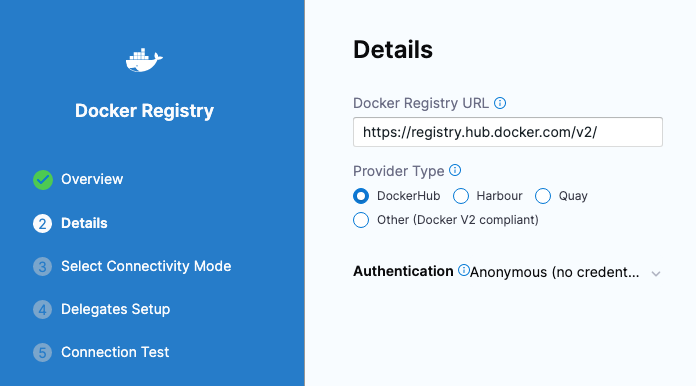

6. In **Connect to the provider**, click **Connect through a Harness Delegate**, and then click **Continue**.
7. In **Delegates Setup**, click **Only use Delegates with all of the following tags**, and then enter the tag of the Delegate you set up earlier.
8. Click **Save and Continue**.
9. After the test, click **Finish**.
10. Back in **Docker Registry Repository**, click **Continue**.
11. In **Artifact Details**, for **Image path**, enter the image path, such as `library/nginx`.
12. For **Tag**, change the setting to a **Fixed value**.

    
13. For example, select **perl**.

    

1.  Click **Submit**. The artifact is now added to the Service.
2.  Click **Save**. The Service is now added to the stage.
  
  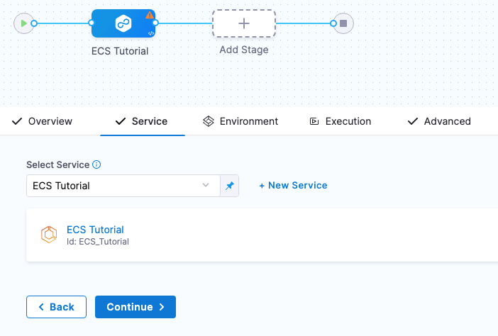  
1. Click **Continue** to add the target ECS cluster.

## Define the infrastructure

You define the target infrastructure for your deployment in the **Environment** settings of the pipeline stage. You can define an environment separately and select it in the stage, or create the environment within the stage **Environment** tab.

There are two methods of specifying the deployment target infrastructure:

- **Pre-existing**: the target infrastructure already exists and you simply need to provide the required settings.
- **Dynamically provisioned**: the target infrastructure will be dynamically provisioned on-the-fly as part of the deployment process.

For details on Harness provisioning, go to [Provisioning overview](/docs/continuous-delivery/cd-infrastructure/provisioning-overview).

### Pre-existing ECS infrastructure

In the **Environment** section of the stage you define the target ECS cluster for the deployment.

**Environments and Infrastructure Definitions:** A Harness Environment represents where you are deploying your application. Each Infrastructure Definition in an Environment defines the target VM/cluster/etc. where you plan to deploy your application. An Environment can contain multiple Infrastructure Definitions. When you select an Environment in a Pipeline, you can pick which Infrastructure Definition to use.

1. In **Specify Environment**, click **New Environment**.
2. In **New Environment**, enter the following:
	1. A name.
	2. Environment type.
3. Click **Save**.
4. In **Specify Infrastructure**, click **New Infrastructure**.
5. In **Create New Infrastructure**, in **Name**, enter a name.
6. For **Cluster Details**, see the following sections.

#### Connector

Create a Harness AWS Connector to connect to your AWS account using the IAM User you configured earlier in [AWS IAM requirements](##aws-iam-requirements).

1. In **Connector**, click **Select Connector**.
2. In **Create or Select an Existing Connector**, click **New Connector**.
3. In **AWS Cloud Provider**, in **Name**, enter  a name, and click **Continue**.
4. In Credentials, enter the following and click **Continue**:
	1. Select **AWS Access Key**.
	2. **Access Key:** enter the IAM User access key.
	3. **Secret Key:** add a new Harness Secret using the access key's secret key. Secrets are always stored in encrypted form and decrypted only when they are needed. To learn more about Harness secrets, go to [Harness Secrets Management Overview](/docs/platform/Secrets/Secrets-Management/harness-secret-manager-overview).
	4. **Test Region:** US East (Virginia).
5. In **Connect to the provider**, click **Connect through a Harness Delegate**, and then click **Continue**.
6. In **Delegates Setup**, click **Only use Delegates with all of the following tags**, and then enter the tag of the Delegate you set up earlier.
7. Click **Save and Continue**.
8. After the test, click **Finish**.

The Connector is added to your Infrastructure Definition.

#### Region

In **Region**, click **Select Region**, and then AWS region where your ECS cluster is located.

#### Cluster

1. Click in **Cluster** and select the target cluster. The list is populated using the AWS Connector you created.
2. Click **Save**. The Environment and Infrastructure Definition are listed.

  
3. Click **Continue** to choose the deployment strategy.

### Dynamically provisioned ECS infrastructure

:::note

Currently, the dynamic provisioning documented in this topic is behind the feature flag `CD_NG_DYNAMIC_PROVISIONING_ENV_V2`. Contact [Harness Support](mailto:support@harness.io) to enable the feature.

:::

Here is a summary of the steps to dynamically provision the target infrastructure for a deployment:

1. **Add dynamic provisioning to the CD stage**:
   1. In a Harness Deploy stage, in **Environment**, enable the option **Provision your target infrastructure dynamically during the execution of your Pipeline**.
   2. Select the type of provisioner that you want to use.
   
      Harness automatically adds the provisioner steps for the provisioner type you selected.
   3. Configure the provisioner steps to run your provisioning scripts.
   4. Select or create a Harness infrastructure in **Environment**.
2. **Map the provisioner outputs to the Infrastructure Definition**:
   1. In the Harness infrastructure, enable the option **Map Dynamically Provisioned Infrastructure**.
   2. Map the provisioning script/template outputs to the required infrastructure settings.

#### Supported provisioners

The following provisioners are supported for ECS deployments:

- Terraform
- Terragrunt
- Terraform Cloud
- CloudFormation
- Shell Script

#### Adding dynamic provisioning to the stage

To add dynamic provisioning to a Harness pipeline Deploy stage, do the following:

1. In a Harness Deploy stage, in **Environment**, enable the option **Provision your target infrastructure dynamically during the execution of your Pipeline**.
2. Select the type of provisioner that you want to use.
   
   Harness automatically adds the necessary provisioner steps.
3. Set up the provisioner steps to run your provisioning scripts.

For documentation on each of the required steps for the provisioner you selected, go to the following topics:

- Terraform:
  - [Terraform Plan](/docs/continuous-delivery/cd-infrastructure/terraform-infra/run-a-terraform-plan-with-the-terraform-plan-step)
  - [Terraform Apply](/docs/continuous-delivery/cd-infrastructure/terraform-infra/run-a-terraform-plan-with-the-terraform-apply-step)
  - [Terraform Rollback](/docs/continuous-delivery/cd-infrastructure/terraform-infra/rollback-provisioned-infra-with-the-terraform-rollback-step). To see the Terraform Rollback step, toggle the **Rollback** setting.
- [Terragrunt](/docs/continuous-delivery/cd-infrastructure/terragrunt-howtos)
- [Terraform Cloud](/docs/continuous-delivery/cd-infrastructure/terraform-infra/terraform-cloud-deployments)
- CloudFormation:
  - [Create Stack](/docs/continuous-delivery/cd-infrastructure/cloudformation-infra/provision-with-the-cloud-formation-create-stack-step)
  - [Delete Stack](/docs/continuous-delivery/cd-infrastructure/cloudformation-infra/remove-provisioned-infra-with-the-cloud-formation-delete-step)
  - [Rollback Stack](/docs/continuous-delivery/cd-infrastructure/cloudformation-infra/rollback-provisioned-infra-with-the-cloud-formation-rollback-step). To see the Rollback Stack step, toggle the **Rollback** setting.
- [Shell Script](/docs/continuous-delivery/cd-infrastructure/shell-script-provisioning)


#### Mapping provisioner output

Once you set up dynamic provisioning in the stage, you must map outputs from your provisioning script/template to specific settings in the Harness Infrastructure Definition used in the stage.

1. In the same CD Deploy stage where you enabled dynamic provisioning, select or create (**New Infrastructure**) a Harness infrastructure.
2. In the Harness infrastructure, in **Select Infrastructure Type**, select **AWS** if it is not already selected.
3. In **Cluster details**, enable the option **Map Dynamically Provisioned Infrastructure**.
   
   The **Cluster details** section adds a **Provisioner** setting and configures it as a runtime input.
4. Map the provisioning script/template outputs to the required infrastructure settings.

To provision the target deployment infrastructure, Harness needs specific infrastructure information from your provisioning script. You provide this information by mapping specific Infrastructure Definition settings in Harness to outputs from your template/script.

For ECS, Harness needs the following settings mapped to outputs:

- Region
- Cluster

:::note

Ensure the Region and Cluster settings are set to the **Expression** option.

:::

For example, here's a snippet of a CloudFormation template that provisions the infrastructure for an ECS deployment and includes the required outputs:

```yaml

AWSTemplateFormatVersion: '2010-09-09'
Description: CloudFormation template for provisioning ECS resources

Parameters:
  ClusterName:
    Type: String
    Description: Name of the ECS cluster

Resources:
  ECSCluster:
    Type: AWS::ECS::Cluster
    Properties:
      ClusterName: !Ref ClusterName

Outputs:
  region_name:
    Value: !Ref AWS::Region
    Description: AWS region where the ECS cluster is deployed

  cluster_name:
    Value: !Ref ECSCluster
    Description: Name of the provisioned ECS cluster

```


In the Harness Infrastructure Definition, you map outputs to their corresponding settings using expressions in the format `<+provisioner.OUTPUT_NAME>`, such as `<+provisioner.cluster_name>`.


<figure>

<docimage path={require('./static/07e9c5632b5454137282633a6b9526dce0a9bbcefc295ba80c31ce1578b00fdd.png')} width="60%" height="60%" title="Click to view full size image" />

<figcaption>Figure: Mapped outputs.</figcaption>
</figure>

## Define the Rolling deployment steps

1. In **Execution Strategies**, click **Rolling**, and click **Use Strategy**.

The **ECS Rolling Deploy** step is added automatically.

Now you're ready to deploy.

### ECS Rolling Rollback

Before you deploy, click **Rollback** and view the **ECS Rolling Rollback** step.

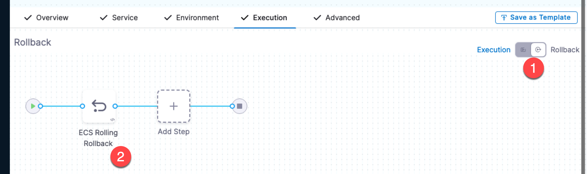

When you created the Execution, an ECS Rolling Rollback step is automatically added to the **Rollback** section of Execution.

If Harness needs to rollback and restore the ECS setup to its previous working version, or if you interrupt the deployment to roll it back manually, the first step is to roll back the ECS services.

When a rollback occurs, Harness rolls back all steps in the reverse order they were deployed. This is true for ECS services deployed to EC2 or Fargate clusters.

## Run the pipeline and verify deployment

1. Click **Save** and then click **Run**.
2. In the deployment execution, click the **ECS Rolling Deploy** step and review the following:

### Fetch manifests

The Delegate fetches the Task Definition and Service Definition you added to the Harness Service:


```
Fetching EcsTaskDefinition from Harness File Store  
  
Fetching EcsTaskDefinition files with identifier: task def  
Fetching following Files :  
- account:/ECS Tutorial/RegisterTaskDefinitionRequest.yaml  
Successfully fetched following files:   
- account:/ECS Tutorial/RegisterTaskDefinitionRequest.yaml  
  
Fetching EcsServiceDefinition from Harness File Store  
  
Fetching EcsServiceDefinition files with identifier: service def  
Fetching following Files :  
- account:/ECS Tutorial/CreateServiceRequest.yaml  
Successfully fetched following files:   
- account:/ECS Tutorial/CreateServiceRequest.yaml  
Fetched all manifests from Harness Store 
```

### Prepare rollback data

Harness collects the current state so it can roll back if the deployment fails.

### Deploy

Harness performs the deployment and checks to make sure the ECS service reaches steady state.

```
Creating Task Definition with family fargate-task-definition   
Created Task Definition fargate-task-definition:6 with Arn arn:aws:ecs:us-west-2:123456789:task-definition/fargate-task-definition:6..  
  
Deleting Scaling Policies from service myapp..  
Didn't find any Scaling Policies attached to service myapp   
  
Deregistering Scalable Targets from service myapp..  
Didn't find any Scalable Targets on service myapp   
Updating Service myapp with task definition arn:aws:ecs:us-west-2:123456789:task-definition/fargate-task-definition:6 and desired count 1   
Waiting for pending tasks to finish. 1/1 running ...  
Waiting for Service myapp to reach steady state   
...  
Service myapp reached steady state   
Updated Service myapp with Arn arn:aws:ecs:us-west-2:123456789:service/ecs-tutorial/myapp   
  
 Deployment Successful.
```

The key part to note is the AWS Events and the deployment Id (for example, 9219274889298964351). Harness starts tasks for the new version and scales the old tasks down to 0.

```
# AWS Event: 2022-10-06 23:03:45.606 (service myapp) updated computedDesiredCount for taskSet ecs-svc/9219274889298964351 to 1.  
# AWS Event: 2022-10-06 23:03:46.251 (service myapp) has started 1 tasks: (task f025d07bd780454b9f8e7cebac16aa20).  
# AWS Event: 2022-10-06 23:04:30.971 (service myapp) updated computedDesiredCount for taskSet ecs-svc/2991467373931924299 to 0.  
# AWS Event: 2022-10-06 23:05:02.54 (service myapp) has stopped 1 running tasks: (task 072854d473144d46a17fa4c7efb59c14).
```

You can see the same events in the AWS console for the ECS service:

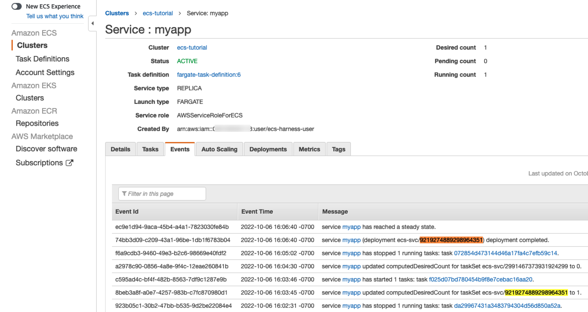

### ECS Rolling Deploy step output

1. In the ECS Rolling Deploy step, click **Output**. You can see the all of completed deployment details, such as version and Task Definition ARN (taskDefinitionArn).

You can copy any of these and use them in later steps in your pipeline.

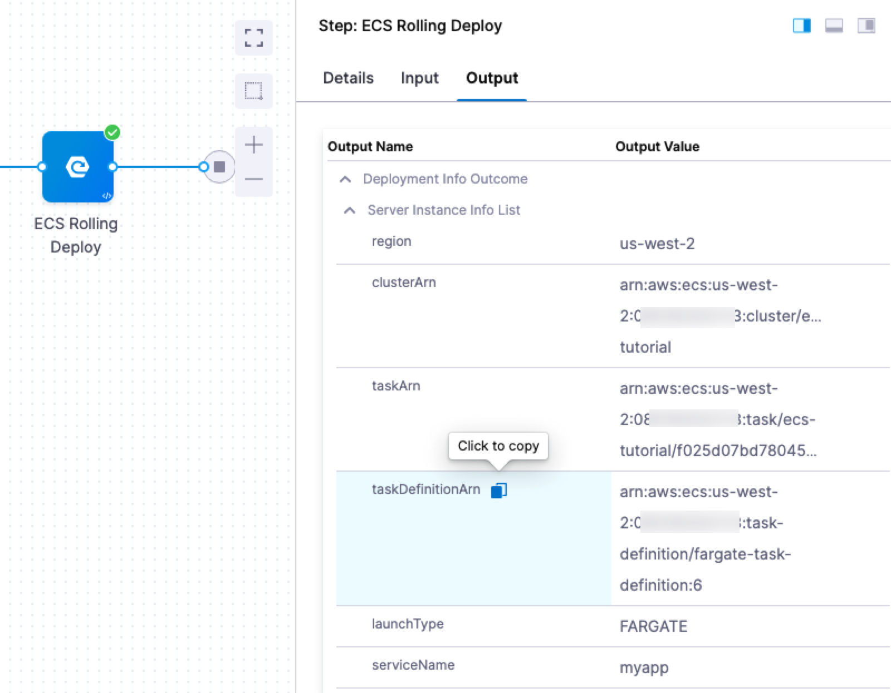

## Review

Congratulations. You successfully deployed an ECS service using Harness.

In this example, you learned how to:

* Set up AWS IAM and ECS for Harness ECS deployments.
* Install and register a Harness Delegate for ECS deployments.
* Connect Harness with AWS, your ECS clusters, and Docker Hub.
* Add your Docker images to Harness.
* Define your ECS container and service specs in Harness.
* Create and deploy an ECS Rolling deployment.

## Notes

See the following sections for information on other deployment strategies and steps.

### Harness supports JSON and YAML for all ECS manifests

You can use both JSON and YAML for your task and service definitions.

### ECS manifest examples

To ensure that your deployments are successful, please follow the AWS schema syntax for each manifest type:

* [RegisterTaskDefinition](https://docs.aws.amazon.com/AmazonECS/latest/APIReference/API_RegisterTaskDefinition.html)
* [CreateService](https://docs.aws.amazon.com/AmazonECS/latest/APIReference/API_CreateService.html)
* [RegisterScalableTarget](https://docs.aws.amazon.com/autoscaling/application/APIReference/API_RegisterScalableTarget.html)
* [PutScalingPolicy](https://docs.aws.amazon.com/autoscaling/application/APIReference/API_PutScalingPolicy.html)
* [RunTask](https://docs.aws.amazon.com/AmazonECS/latest/APIReference/API_RunTask.html)

### Configure ECS task definition in service only

The ECS task definition should only be added in the Harness service **Task Definition** section.

Harness doesn’t expect the task definition to be configured in the **ECS Service Definition** or **ECS Run Task Request Definition** (in ECS Run Task step) manifests.

Harness will ignore any task definition configured in the ECS Service Definition and/or ECS Run Task Request Definition.

### Supported stores for ECS manifests

Harness can fetch your task definitions, service definitions, scalable target and scaling policy configurations (in JSON or YAML) from the following stores:

- Harness File Store.
- AWS S3 buckets.
  - For S3, you use a Harness AWS Connector. The IAM role permissions required by Harness for S3 are described in [AWS Connector Settings Reference](/docs/platform/Connectors/Cloud-providers/ref-cloud-providers/aws-connector-settings-reference).
- Git providers.

### AWS Auto Scaling with ECS

The ECS service(s) you deploy with Harness can be configured to use AWS Service Auto Scaling to adjust its desired ECS service count up or down in response to CloudWatch alarms. For more information on using Auto Scaling with ECS, see [Target Tracking Scaling Policies](https://docs.aws.amazon.com/AmazonECS/latest/developerguide/service-autoscaling-targettracking.html) from AWS.

To configure Auto Scaling in Harness, you use **Scalable Target** and **Scaling Policy** settings in the Harness Service.

#### Scalable Target

The Scalable Target setting in the Harness Service specifies a resource that AWS Application Auto Scaling can scale. For more information, see [ScalableTarget](https://docs.aws.amazon.com/AWSCloudFormation/latest/UserGuide/aws-resource-applicationautoscaling-scalabletarget.html) from AWS.

Example:

```yaml
serviceNamespace: ecs  
scalableDimension: ecs:service:DesiredCount  
minCapacity: 1  
maxCapacity: 3
```

#### Scaling Policy

The Scaling Policy setting in the Harness Service defines a scaling policy that Application Auto Scaling uses to adjust your application resources. For more information, see [ScalingPolicy](https://docs.aws.amazon.com/AWSCloudFormation/latest/UserGuide/aws-resource-applicationautoscaling-scalingpolicy.html) from AWS.

Example:

```yaml
scalableDimension: ecs:service:DesiredCount  
serviceNamespace: ecs  
policyName: P1  
policyType: TargetTrackingScaling  
targetTrackingScalingPolicyConfiguration:  
  targetValue: 60  
  predefinedMetricSpecification:  
    predefinedMetricType: ECSServiceAverageCPUUtilization  
  scaleOutCooldown: 300  
  scaleInCooldown: 300
```

#### Collecting Auto Scaling resources

Before you set up Auto Scaling for the ECS service in Harness, you need to obtain the JSON for the Scalable Target and Scalable Policy resources from AWS.

The JSON format used in the **Auto Scaler Configurations** settings should match the AWS standards as described in [ScalableTarget](https://docs.aws.amazon.com/autoscaling/application/APIReference/API_ScalableTarget.html) and [ScalablePolicy](https://docs.aws.amazon.com/autoscaling/application/APIReference/API_ScalingPolicy.html).

To obtain the Scalable Target, connect to an EC2 instance in your VPC and enter the following:

`aws application-autoscaling describe-scalable-targets --service-namespace ecs`

For more information, see [describe-scalable-targets](https://docs.aws.amazon.com/cli/latest/reference/application-autoscaling/describe-scalable-targets.html) from AWS.

To obtain the Scalable Policy, enter the following:

`aws application-autoscaling describe-scaling-policies --service-namespace ecs`

For more information, see [describe-scaling-policies](https://docs.aws.amazon.com/cli/latest/reference/application-autoscaling/describe-scaling-policies.html) from AWS.

To create the Scalable Target and Scalable Policy resources, see the [register-scalable-target](https://docs.aws.amazon.com/cli/latest/reference/application-autoscaling/register-scalable-target.html) and [put-scaling-policy](https://docs.aws.amazon.com/cli/latest/reference/application-autoscaling/put-scaling-policy.html) commands from AWS.

### Same as already running instances

This setting in **ECS Rolling Deploy** sets the number of desired ECS service instances for this stage to the same number as the already running instances. Essentially, it ignores the desired count in the Service Definition of the new deployment.

### Force new deployment

This is the same as [forceNewDeployment](https://docs.aws.amazon.com/AmazonECS/latest/APIReference/API_UpdateService.html#ECS-UpdateService-request-forceNewDeployment) from AWS ECS:


> Determines whether to force a new deployment of the service. By default, deployments aren't forced. You can use this option to start a new deployment with no service definition changes. For example, you can update a service's tasks to use a newer Docker image with the same image/tag combination (`my_image:latest`) or to roll Fargate tasks onto a newer platform version.

:::note

When a task definition ARN is provided instead of a task definition spec, a force deployment is enabled for rolling deployments by default. When you perform a force deployment, ECS terminates the running tasks associated with the service and replaces them with tasks using the new task definition.

:::

### ECS Canary deployments

In an ECS Canary deployment, Harness deploys to 1 instance, deletes it, and then performs a Rolling deployment of the new version with full desired count.


The deployment follows this process:

1. ECS Canary Deploy step.
	1. Harness deploys the new version of the service to 1 instance.
	2. Harness names the service with a Canary suffix when it deploys it as part of this step. For example, if the service name is myapp, it will be called myappCanary.

	```
	Creating Task Definition with family fargate-task-definition   
	Created Task Definition fargate-task-definition:9 with Arn arn:aws:ecs:us-west-2:1234567890:task-definition/fargate-task-definition:9..  
	Creating Service myappCanary with task definition arn:aws:ecs:us-west-2:1234567890:task-definition/fargate-task-definition:9 and desired count 1   
	Waiting for pending tasks to finish. 0/1 running ...  
	Waiting for pending tasks to finish. 0/1 running ...  
	# AWS Event: 2022-10-07 00:05:14.665 (service myappCanary) has started 1 tasks: (task ab694b189d204d15950b0466c0e5bd10).  
	Waiting for pending tasks to finish. 0/1 running ...  
	Waiting for pending tasks to finish. 1/1 running ...  
	Waiting for Service myappCanary to reach steady state   
	Service myappCanary reached steady state   
	Created Service myappCanary with Arn arn:aws:ecs:us-west-2:1234567890:service/ecs-canary/myappCanary   
	  
	 Deployment Successful.
	```

2. You can add any verification or testing steps after the ECS Canary Deploy step.
3. ECS Canary Delete step.
	1. Harness deletes the service deployed with the preceding ECS Canary Deploy step.
	```
	Deleting service myappCanary..  
	Waiting for existing Service myappCanary to reach inactive state   
	Existing Service myappCanary reached inactive state   
	Canary service myappCanary deleted
	```
4. ECS Rolling Deploy.
	1. Harness performs a standard rolling deployment of the service to the desired count in the ECS Service Definition you added.

### ECS Blue Green deployments

ECS Blue/Green deployments use old and new versions of your service running behind the load balancer. Your ELB uses two listeners, Prod and Stage, each forwarding to a different target group where ECS services are run.

Blue/Green deployments are achieved by swapping listeners between the target groups, always pointing the Prod listener to the target group running the latest version.

In Harness, you identify which listeners are the Prod and Stage listeners. When Harness deploys, it uses the target group for the Stage listener (for example, **target1**) to test the deployment, verifies the deployment, and then swaps the Prod listener to use that target group. Next, the Stage listener now uses the old target group (**target2**).

When a new version of the service is deployed, the Stage listener and its target group (**target2**) are first used, then, after verification, the swap happens and the Prod listener forwards to **target2** and the Stage listener now forwards to **target1**.

To use ELB for Blue/Green deployment, you must have the following set up in AWS:

* **ELB** **Load Balancer** - An application load balancer must be set up in your AWS VPC. The VPC used by the ELB must have two subnets, each in a separate availability zone, which the ELB will use.
* **Two Listeners** - A listener checks for connection requests from clients, using the protocol and port that you configure, and forwards requests to one or more target groups, based on the rules that you define. Your load balancer must have two listeners set up: One listener for the production traffic (Prod) that points to one target group, and one listener for the stage traffic (Stage) that points to another target group.

You do not need to register instances for the target groups. Harness will perform that step during deployment.

For more information on ELB Application Load Balancers, see [What Is an Application Load Balancer?](https://docs.aws.amazon.com/elasticloadbalancing/latest/application/introduction.html) from AWS.

Application Load Balancer (ALB) and Network Load Balancer (NLB) are supported.##### Ports Used in Blue/Green Using ELB

There are three places where ports are configured in this deployment:

* Harness ECS Service's **Service Specification:** you will specify ports in the [Port Mappings](https://docs.aws.amazon.com/AmazonECS/latest/developerguide/task_definition_parameters.html#container_definition_portmappings) in the specification.  
The port number used here must also be used in the ELB Target Groups you use for Blue/Green.
* **Target Group** - You will create two target groups, and Harness will swap them to perform Blue/Green. When you create a target group, you will specify the same port number as the **Port Mappings** in the Container Specification in Service:

  
  Both target groups must use the same port number, which is also the same number as the **Port Mappings** in the Container Specification in Service.
* **ELB Listener** - In your ELB, you create a listener for each target group. Listeners also use port numbers, but these are simply entry points for the ELB. For example, one listener uses port 80, and the other listener uses 8080.

If the port number used in the Service Specification does not match the port number used in the target groups, you will see this error:


```
Error: No container definition has port mapping that matches the target port: 80 for target group:   
arn:aws:elasticloadbalancing:us-west-1:4xxxxxxx5317:targetgroup/target1/ac96xxxxxx1d16
```

Simply correct the port numbers and rerun the deployment.

#### Set Up AWS for Blue/Green Using ELB

To set up AWS for Blue/Green using ELB and Harness, do the following:

1. Ensure you have a Harness Delegate installed on an instance in the same VPC where your ECS cluster and load balancer are installed.
2. In the AWS EC2 console, click **Target Groups**.
  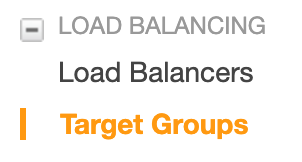
3. In Target Groups, click **Create target group**.
4. Give the target group a name, such as **target1**, and port **8080**.
5. Select the VPC where your ECS cluster instances will be hosted, and click **Create**.
6. Create a second target group using a new name, such as **target2**, use the same port number, **8080**, and the same VPC as the first target.

  It is important that you use the same port numbers for both target groups.When you are done, the target configuration will look something like this:

  

  Now that your targets are created, you can create the load balancer that will switch between the targets.
1. Create a Application Load Balancer. In the EC2 Console, click **Load Balancers**.

  
2. Click **Create Load Balancer**, and then under **Application Load Balancer**, click **Create**.

  

  You do not need to add listeners at this point. We will do that after the load balancer is created.

  Ensure that the VPC you select for the load balancer has two subnets, each in a separate availability zone, like the following:

  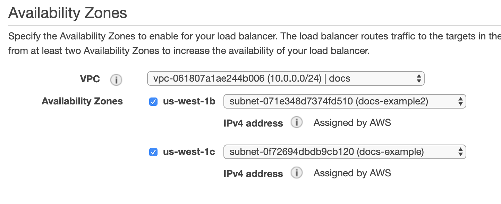

  Once your load balancer is created, you can add its Prod and Stage listeners.

1. In your load balancer, click its **Listeners** tab to add the targets you created as listeners.

  
2. Click **Add Listener**.
3. In the **Protocol : port** section, enter the port number for your first target, port **80**. Listeners do not need to use the same port numbers as their target groups.
4. In **Default action**, click **Add action**, and select **Forward to**, and then select your target

  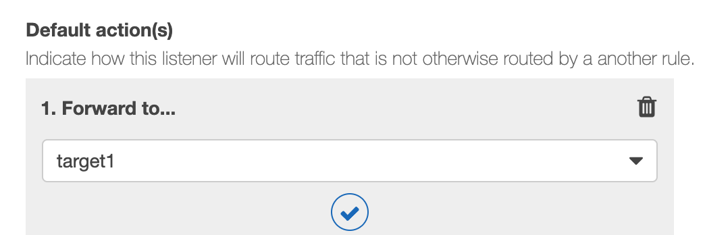
5. Click **Save**.
6. Repeat this process to add a listener using the other target you created, using a port number such as **8080**. When you are done you will have two listeners:

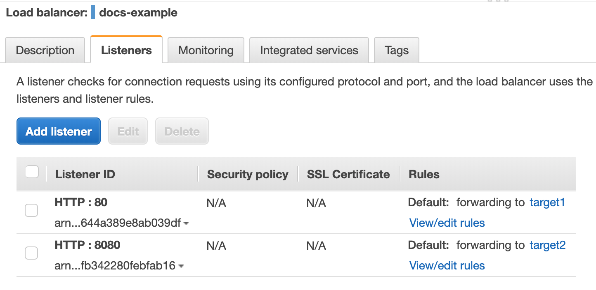

You AWS ELB setup is complete. Now you can set up you Harness Pipeline.

### ECS Blue Green Specification Examples

Here are some examples of the ECS Task Definition and ECS Service Definition for an ECS deployment.

ECS Task Definition:

Replace the two `<ecsInstanceRole Role ARN>` with the ARN for the **ecsInstanceRole** used for your cluster. See [Amazon ECS Instance Role](https://docs.aws.amazon.com/batch/latest/userguide/instance_IAM_role.html) from AWS.

```yaml
ipcMode:  
executionRoleArn: <ecsInstanceRole Role ARN>  
containerDefinitions:  
- dnsSearchDomains:  
  environmentFiles:  
  entryPoint:  
  portMappings:  
  - hostPort: 80  
    protocol: tcp  
    containerPort: 80  
  command:  
  linuxParameters:  
  cpu: 0  
  environment: []  
  resourceRequirements:  
  ulimits:  
  dnsServers:  
  mountPoints: []  
  workingDirectory:  
  secrets:  
  dockerSecurityOptions:  
  memory:  
  memoryReservation: 128  
  volumesFrom: []  
  stopTimeout:  
  image: <+primary.artifact.image>  
  startTimeout:  
  firelensConfiguration:  
  dependsOn:  
  disableNetworking:  
  interactive:  
  healthCheck:  
  essential: true  
  links:  
  hostname:  
  extraHosts:  
  pseudoTerminal:  
  user:  
  readonlyRootFilesystem:  
  dockerLabels:  
  systemControls:  
  privileged:  
  name: nginx  
placementConstraints: []  
memory: '512'  
taskRoleArn: <ecsInstanceRole Role ARN>  
family: sainath-fargate  
pidMode:  
requiresCompatibilities:  
- FARGATE  
networkMode: awsvpc  
runtimePlatform:  
cpu: '256'  
inferenceAccelerators:  
proxyConfiguration:  
volumes: []
```

The `image: <+primary.artifact.image>` setting instructs Harness to pull the image you add to the Service **Artifacts** section and use it for deployment. You do not have to add an image in **Artifacts** and reference it using `<+primary.artifact.image>`. You can hardcode the `image` instead or use a [Harness variable](/docs/platform/Variables-and-Expressions/harness-variables) for the value that resolves to an image name at runtime.ECS Service Definition:

Replace `<Security Group Id>` and `<Subnet Id>` with the Ids from the ECS instances for your target ECS cluster.


```yaml
launchType: FARGATE  
serviceName: myapp  
desiredCount: 2  
networkConfiguration:  
  awsvpcConfiguration:  
    securityGroups:  
    - <Security Group Id>  
    subnets:  
    - <Subnet Id>  
    assignPublicIp: ENABLED   
deploymentConfiguration:  
  maximumPercent: 200  
  minimumHealthyPercent: 100  
loadBalancers:  
- targetGroupArn: <+targetGroupArn>  
  containerName: nginx  
  containerPort: 80    
```

#### targetGroupArn is mandatory

You can see `targetGroupArn: <+targetGroupArn>` in the example above. For Harness Blue Green deployments, this is mandatory.

Harness will resolve the `<+targetGroupArn>` expression to the ARN of the first target group associated with the **Stage Listener Rule ARN** in the **ECS Blue Green Create Service** step.

#### ECS Blue Green Create Service step

Configure the following settings:

* **Elastic Load Balancer:** Click here and select the AWS load balancer you added. Harness uses the Delegate to locate the load balancers and list them in **Elastic Load Balancer**. If you do not see your load balancer, ensure that the Delegate can connect to the load balancers. Once the load balancer is selected, Harness will populate the Prod and Stage Listener drop-downs.
* **Prod Listener:** Select the ELB listener that you want to use as the Prod Listener.
* **Stage Listener:** Select the ELB listener that you want to use as the Stage Listener.
* **Prod Listener Rule ARN** and **Stage Listener Rule ARN**: If you are using [Listener Rules](https://docs.aws.amazon.com/elasticloadbalancing/latest/application/load-balancer-listeners.html#listener-rules) in your target groups, you can select them in **Production Listener Rule ARN** and **Stage Listener Rule ARN**.
	+ You must select a listener rule.
	+ Ensure the traffic that will use the rules matches the conditions you have set in the rules. For example, if you have a path condition on a rule to enable [path-based routing](https://docs.aws.amazon.com/elasticloadbalancing/latest/application/tutorial-load-balancer-routing.html), ensure that traffic uses that path.

Here's an example of the output of the step:


```
Creating Task Definition with family johndoe-fargate   
Created Task Definition johndoe-fargate:498 with Arn arn:aws:ecs:us-east-1:1234567890:task-definition/johndoe-fargate:498..  
  
Creating Stage Service abc__1 with task definition arn:aws:ecs:us-east-1:1234567890:task-definition/johndoe-fargate:498 and desired count 1   
Waiting for pending tasks to finish. 0/1 running ...  
Waiting for pending tasks to finish. 0/1 running ...  
Waiting for pending tasks to finish. 0/1 running ...  
# AWS Event: 2022-10-11 02:50:59.657 (service abc__1) has started 1 tasks: (task e8ffa30be4a848d387ab8ed66ba31417).  
Waiting for pending tasks to finish. 0/1 running ...  
Waiting for pending tasks to finish. 1/1 running ...  
# AWS Event: 2022-10-11 02:51:27.667 (service abc__1) registered 1 targets in (target-group arn:aws:elasticloadbalancing:us-east-1:1234567890:targetgroup/example-tg-ip-2/34b77f72b13e45f4)  
Waiting for Service abc__1 to reach steady state   
Service abc__1 reached steady state   
Created Stage Service abc__1 with Arn arn:aws:ecs:us-east-1:1234567890:service/example-test/abc__1   
  
Target Group with Arn: arn:aws:elasticloadbalancing:us-east-1:1234567890:targetgroup/example-tg-ip-2/34b77f72b13e45f4 is associated with Stage Service abc__1  
Tag: [BG_VERSION, GREEN] is associated with Stage Service abc__1
```
You can see the target is registered in the Target Groups associated with the Stage Listener selected, the new ECS service is deployed as the Stage Service, associated with the Target Group, and the Service is tagged with `BG_VERSION`, `GREEN`.

#### ECS Blue Green Swap Target step

The **ECS Blue Green Swap Target** step performs the Blue/Green route swap once the deployment is verified.

Typically, you will want to add one or more steps between the **ECS Blue Green Create Service** step and **ECS Blue Green Swap Target** step for verification.

When you deploy, Harness will use the target group for the **Stage Listener** from the **ECS Blue Green Create Service** step for deployment. After verifying the success of the deployment, the **ECS Blue Green Swap Target** step simply swaps the target groups between the listeners. Now, the target group with the latest version receives production traffic. The target group with the old version receives the stage traffic.

Here's an example of the output of the step:

```
Modifying ELB Prod Listener to Forward requests to Target group associated with new Service  
,TargetGroup: arn:aws:elasticloadbalancing:us-east-1:1234567890:targetgroup/example-tg-ip-2/34b77f72b13e45f4  
Modifying the default Listener: arn:aws:elasticloadbalancing:us-east-1:1234567890:listener/app/example-alb/8c164c70eb817f6a/83cbd24bc4f6d349   
 with listener rule: arn:aws:elasticloadbalancing:us-east-1:1234567890:listener-rule/app/example-alb/8c164c70eb817f6a/83cbd24bc4f6d349/a249570503765d2d   
 to forward traffic to TargetGroup: arn:aws:elasticloadbalancing:us-east-1:1234567890:targetgroup/example-tg-ip-2/34b77f72b13e45f4  
Successfully updated Prod Listener   
  
Modifying ELB Stage Listener to Forward requests to Target group associated with old Service  
,TargetGroup: arn:aws:elasticloadbalancing:us-east-1:1234567890:targetgroup/example-tg-ip-1/52b1f157d3240800  
Modifying the default Listener: arn:aws:elasticloadbalancing:us-east-1:1234567890:listener/app/example-alb/8c164c70eb817f6a/cfbb98e593af641b   
 with listener rule: arn:aws:elasticloadbalancing:us-east-1:1234567890:listener-rule/app/example-alb/8c164c70eb817f6a/cfbb98e593af641b/30983f6b6338ce10   
 to forward traffic to TargetGroup: arn:aws:elasticloadbalancing:us-east-1:1234567890:targetgroup/example-tg-ip-1/52b1f157d3240800  
Successfully updated Stage Listener   
  
Updating tag of new service: abc__1  
Updating service: abc__1 with tag: [BG_VERSION, BLUE]  
Successfully updated tag   
  
Swapping Successful. 
```

You can see the ELB **Prod Listener** is now forwarding requests to the Target Group used with the new service version deployed in the previous step (ECS Blue Green Create Service).

Also, the ELB **Stage** Listener is forwarding to the Target Group for the previous service version.

Lastly, the new ECS service is tagged with `BG_VERSION`, `BLUE`.

**Do not downsize old service:** Use this setting to choose whether to downsize the older, previous version of the service.

By default, the previous service is downsized to 0. The service is downsized, but not deleted. If the older service needs to be brought back up again, it is still available.

### ECS Rollbacks

When an ECS deployment fails, the service tasks it was deploying are scaled down to 0.

The service is scaled to its pre-setup number of tasks.

If [ECS Service Auto Scaling](https://docs.aws.amazon.com/AmazonECS/latest/developerguide/service-auto-scaling.html) is configured, it is attached to the last production service at the end of the rollback.

For multi-phase deployments (Canary), not all phases are rolled back at once.

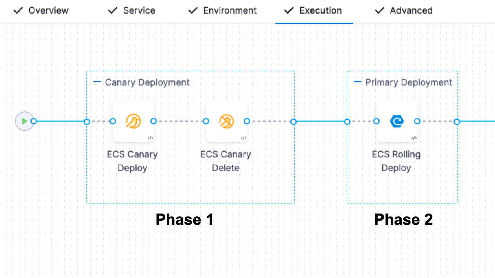

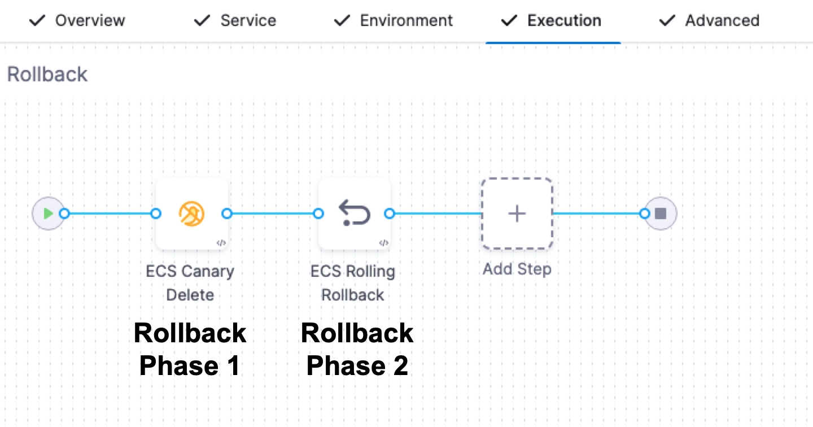

Phases are rolled back in the standard, reverse order. For example, in a 2 phase deployment with 2 rollback phases, the order is P1 → P2 → R2 → R1.

Phases are rolled back in this order regardless of whether ECS Service Auto Scaling is used.

### ECS Run Task step

In addition to deploying tasks as part of your standard ECS deployment, you can use the **ECS Run Task** step to run individual tasks separately as a step in your ECS stage.

The ECS Run Task step is available in all ECS strategy types.

An example of when you run a task separately is a one-time or periodic batch job that does not need to keep running or restart when it finishes.

For more information, see [Running tasks](https://docs.aws.amazon.com/AmazonECS/latest/developerguide/ecs_run_task.html) from AWS.

1. In your Harness ECS stage, in **Execution**, click **Add Step**, and then click **ECS Run Task**.   Using the **ECS Run Task** step is the same as running a task in the AWS console.
2. In **ECS Run Task Definition**, add a Task Definition to run. Here's an example:
```yaml
  ipcMode:  
  executionRoleArn: <ecsInstanceRole Role ARN>  
  containerDefinitions:  
  - dnsSearchDomains:  
    environmentFiles:  
    entryPoint:  
    portMappings:  
    - hostPort: 80  
      protocol: tcp  
      containerPort: 80  
    command:  
    linuxParameters:  
    cpu: 0  
    environment: []  
    resourceRequirements:  
    ulimits:  
    dnsServers:  
    mountPoints: []  
    workingDirectory:  
    secrets:  
    dockerSecurityOptions:  
    memory:  
    memoryReservation: 128  
    volumesFrom: []  
    stopTimeout:  
    image: <+primary.artifact.image>  
    startTimeout:  
    firelensConfiguration:  
    dependsOn:  
    disableNetworking:  
    interactive:  
    healthCheck:  
    essential: true  
    links:  
    hostname:  
    extraHosts:  
    pseudoTerminal:  
    user:  
    readonlyRootFilesystem:  
    dockerLabels:  
    systemControls:  
    privileged:  
    name: nginx  
  placementConstraints: []  
  memory: '512'  
  taskRoleArn: <ecsInstanceRole Role ARN>  
  family: fargate-task-definition  
  pidMode:  
  requiresCompatibilities:  
  - FARGATE  
  networkMode: awsvpc  
  runtimePlatform:  
  cpu: '256'  
  inferenceAccelerators:  
  proxyConfiguration:  
  volumes: []
```
3. In **ECS Run Task Request Definition**, you can customize how Amazon ECS places tasks using placement constraints and placement strategies just like using a **Capacity provider strategy** in the ECS console.


You can add the Task Definition and Task Request Definition using remote repos or the Harness File Store.

Here's an example (replace `<Security Group Id>` and `<Subnet Id>` with the Ids from the ECS instances for your target ECS cluster):

```yaml
launchType: FARGATE  
networkConfiguration:  
  awsvpcConfiguration:  
    securityGroups:  
    - <Security Group Id>  
    subnets:  
    - <Subnet Id>  
    assignPublicIp: ENABLED  
count: 1
```
For information on running ECS Tasks, go to the AWS docs [Run a standalone task in the classic Amazon ECS console](https://docs.aws.amazon.com/AmazonECS/latest/developerguide/ecs_run_task.html), [RunTask](https://docs.aws.amazon.com/AmazonECS/latest/APIReference/API_RunTask.html), and [Amazon ECS capacity providers](https://docs.aws.amazon.com/AmazonECS/latest/developerguide/cluster-capacity-providers.html).

#### Skip Steady-State Check

If you do not select this option, Harness will not check to see if the task was triggered.

If you do select this option, Harness will poll the ECS task to see if it triggered successfully.

### Support for ECS Deployments with AWS Service Mesh Configuration

Harness ECS Deployments supports deploying of ECS services with AWS Service Discovery.

AWS Service Discovery is a cloud service provided by AWS that makes it easy for microservices applications to discover and communicate with each other. It enables you to manage and discover the addresses of the services within your microservices application without the need for hard-coded IP addresses or hostnames.

You can use AWS Service Discovery as part of the ECS service definition in Harness.

Here are the steps required to configure a Service Discovery and deploy:

1. Create a namespace in AWS Cloud Map.
2. Create a Service Discovery with the above namespace and generate the ARN.
3. Provide the Service Discovery ARN in the service definition.

```
launchType: FARGATE
serviceName: ecs-svc-discovery
desiredCount: 1
networkConfiguration:
  awsvpcConfiguration:
    securityGroups:
    - sg-afc848e7 
    subnets:
    - subnet-9757dc98
    assignPublicIp: ENABLED 
deploymentConfiguration:
  maximumPercent: 100
  minimumHealthyPercent: 0
**serviceRegistries:**
  ** - registryArn: arn:aws:servicediscovery:us-east-1:1234567890:service/srv-xeycgshb42ydmokf**
```

With the above Service Registry ARN specified in the ECS service definition, deployed services are marked with Service Discovery.

### Support for circuit breaker configurations

:::note

Circuit breaker configuration can be applied to Harness ECS rolling and canary deployments only. **This feature is only available in Harness CD NextGen.**

:::


Harness ECS rolling and canary deployments support AWS [ECS circuit breaker configurations](https://docs.aws.amazon.com/AmazonECS/latest/developerguide/deployment-circuit-breaker.html).

AWS ECS circuit breaker logic determines whether the deployment will fail if the service can't reach steady state. During deployment, the failure state is identified based on a threshold. Circuit breaker creates the threshold configuration with the desired instance count configuration internally.

Circuit breaker configuration is implemented in the Harness ECS service **Service Definition**. 

<details>
<summary>Circuit breaker configuration example</summary>

See the `deployment-configuration` setting in the following example:

```json
"service": {
        "serviceArn": "arn:aws:ecs:us-east-1:1234567890:service/servicediscoverytest/ecs-service-discovery",
        "serviceName": "ecs-service-discovery",
        "clusterArn": "arn:aws:ecs:us-east-1:1234567890:cluster/servicediscoverytest",
        "loadBalancers": [],
        "serviceRegistries": [
            {
                "registryArn": "arn:aws:servicediscovery:us-east-1:1234567890:service/srv-xbnxncsqdovyuztm"
            }
        ],
        "status": "ACTIVE",
        "desiredCount": 1,
        "runningCount": 0,
        "pendingCount": 0,
        "launchType": "FARGATE",
        "platformVersion": "LATEST",
        "platformFamily": "Linux",
        "taskDefinition": "arn:aws:ecs:us-east-1:1234567890:task-definition/tutorial-task-def:1",
        "deploymentConfiguration": {
            "deploymentCircuitBreaker": {
                "enable": false,
                "rollback": false
            },
            "maximumPercent": 200,
            "minimumHealthyPercent": 100
        },
        "deployments": [
            {
                "id": "ecs-svc/0410909316449095426",
                "status": "PRIMARY",
                "taskDefinition": "arn:aws:ecs:us-east-1:1234567890:task-definition/tutorial-task-def:1",
                "desiredCount": 1,
                "deployment-configuration": "deploymentCircuitBreaker={enable=true,rollback=true}" ,
                "pendingCount": 0,
                "runningCount": 0,
...
```
</details>

Harness deploys the tasks in the above ECS service definition containing the circuit breaker configuration. Once deployed, the circuit breaker is activated. 

During failure scenarios, ECS circuit breaker performs a rollback automatically based on the threshold configuration.


### Overrides

Harness supports Harness ECS service configuration overrides to assist in managing different ECS configuration files for different environments, infrastrctures, etc. With overrides, you can override the service configuration and Harness will fetch the file and compute the variables at runtime when the service is deployed into a given environment, infrastructure definition pair.

You can override the:

- Task definition
- Service definition
- Scaling policy
- Scalable target

These overrides can be configured at the Harness environment's service-specific override level, as well as at the environment infrastructure definition level. 


