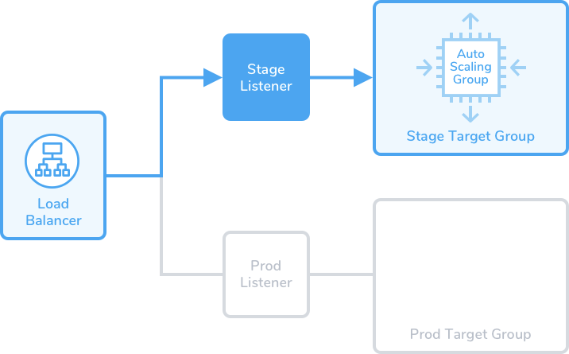
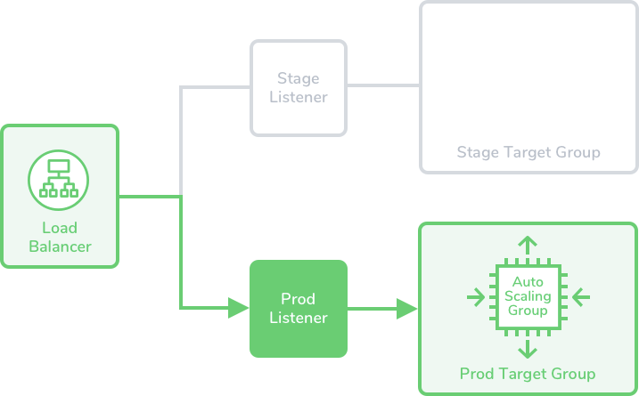

:::info

Currently, Spot Elastigroup support is behind the feature flag `SPOT_ELASTIGROUP_NG`. Contact [Harness Support](mailto:support@harness.io) to enable the feature.

:::

This topic describes how to deploy AWS ASG deployments using Harness and the Spot Elastigroup management platform. 

## Requirements and limitations

* Currently, Harness integrates with Spot only for Amazon Web Services (AWS) deployments by using Elastigroups. 
* Spot Elastigroup deployments support AMI artifacts only.
* Spot Elastigroup deployments support only Basic, Canary, and Blue Green execution types.
* Your spot account must be connected to the AWS cloud provider. For more information, go to [Connect your cloud account to Spot](https://docs.spot.io/connect-your-cloud-provider/aws-account).

## Connect to a Spot cloud provider

You can connect Harness to a Spot cloud provider by adding a [Harness Spot Elastigroup connector](/docs/platform/Connectors/Cloud-providers/add-a-spot-connector) or [AWS connector](/docs/platform/Connectors/Cloud-providers/add-aws-connector). 

To connect to a Spot cloud provider using Spot's API, go to [Spot API authentication](https://docs.spot.io/api/#section/Authentication).

To use an AWS connector, your spot account must first be connected to the AWS cloud provider. For more information, go to [Connect your cloud account to Spot](https://docs.spot.io/connect-your-cloud-provider/aws-account).

## Create the Harness Spot Elastigroup pipeline 

You can create a service and environment either when you are building the pipeline or separately in **Services** and **Environments**. This topic walks you through building these within a pipeline. 

The pipeline models the release process using execution steps, triggers, and other settings. For more information, go to [CD pipeline modeling overview](/docs/continuous-delivery/get-started/cd-pipeline-modeling-overview).

```mdx-code-block
import Tabs3 from '@theme/Tabs';
import TabItem3 from '@theme/TabItem';
```
```mdx-code-block
<Tabs3>
<TabItem3 value="Pipeline Studio" label="Pipeline Studio">
```

1. In your Harness Project, select **Deployments**.
2. Select **Pipelines**, and then select **Create a Pipeline**.
3. Enter the name **Spot Tutorial** for the pipeline, and then select **Start**.
4. Select **Add Stage**.
5. Select **Deploy**.
6. In **Stage Name**, enter **Spot Tutorial**.
7. In **Deployment Type**, select **Spot Elastigroup**, and then select **Set Up Stage**.

The new stage is created. Next, we'll add a Harness service to represent the application you're deploying, and configure the service with the Spot Elastigroup service definition, artifacts, environment definition, and infrastructure for deployment.

### Add a Harness service

Harness services represent your microservices or applications. You can add the same service to as many stages as you need. For more information, go to [services and environments overview](https://developer.harness.io/docs/continuous-delivery/onboard-cd/cd-concepts/services-and-environments-overview).

```mdx-code-block
import Tabs1 from '@theme/Tabs';
import TabItem1 from '@theme/TabItem';
```
```mdx-code-block
<Tabs1>
<TabItem1 value="YAML" label="YAML">
```

Here's a sample Spot service YAML: 

```
service:
  name: spot-svc
  identifier: spotsvc
  serviceDefinition:
    type: Elastigroup
    spec:
      artifacts:
        primary:
          primaryArtifactRef: <+input>
          sources:
            - identifier: spot_ami
              spec:
                connectorRef: org.AWSConnectorForAutomationTest
                region: us-east-1
                version: <+input>.allowedValues(asgAmi-Orderv2,asgAmi-Order)
              type: AmazonMachineImage
  gitOpsEnabled: false
```

```mdx-code-block
</TabItem1>
<TabItem1 value="Harness Manager" label="Harness Manager">
```

1. Select the **Service** tab, then select **Add Service**.  
2. Enter a service name. For example, spot-svc.
  
   Services are persistent and can be used throughout the stages of this pipeline or any other pipeline in the project.

3. In **Service Definition**, in **Deployment Type**, verify if **Spot Elastigroup** is selected.
4. In **Artifacts**, select **Add Artifact Source**.
5. In **Specify Artifact Repository Type**, select **Amazon Machine Image**, and then select **Continue**.
   
   :::important
   Spot Elastigroup deployments support AMI artifacts only.
   :::
   
6. In **Amazon Machine Image Repository**, select **New AWS Connector**.
7. Enter a name for the connector, and then select **Continue**.
8. In **Credentials**, select **AWS Access Key**.
9. In **Authentication**, select one of the following options.
    * **Plaintext** - Enter the [**Access Key** and **Secret Key**](https://docs.aws.amazon.com/IAM/latest/UserGuide/security-creds.html#access-keys-and-secret-access-keys). For Secret Key, you can either create a new secret or use an existing one. 
    * **Encrypted** - You can create or select a secret for your Access Key and Secret Key.
10. Select **Enable cross-account access (STS Role)** if you want to use one AWS account for the connection, but want to deploy or build in a different AWS account. 
    
    In this scenario, the AWS account used for AWS access in credentials will assume the IAM role you specify in cross-account role ARN setting. This option uses the [AWS Security Token Service (STS)](https://docs.aws.amazon.com/IAM/latest/UserGuide/id_credentials_temp.html) feature.
11. In **Test Region**, select an AWS region to test the credentials for this connector. 
12. In **Delegates Setup**, select **Only use Delegate with all of the following tags** and enter the name of the delegate created when creating the [Harness Spot Elastigroup connector](/docs/platform/Connectors/Cloud-providers/add-a-spot-connector).
13. Select **Save and Continue**
14.  After the connection test succeeds, select **Continue**.
15. In **Artifact Details**, enter the following details:
    1.  In **Artifact Source Identifier**, enter a name for the artifact.
    2.  In **Region**, select the region where the artifact is located. 
    3.  (Optional) In **AMI Tags**, add the tags used by your AMI. 
    4.  (Optional) In **AMI Filters**, add the AMI ID filters to locate the AMI resource.
    5.  In **Version Details**, select **Value** to enter the version number of the package you want to use. You can also select **Regex**, and then enter a tag regex to filter the package version.
    
    
16. Select **Submit**.
17. Select **Save** to save the service configuration.

```mdx-code-block
</TabItem1>    
</Tabs1>
```

### Add a Spot environment

Define the environment where you will deploy your application.

```mdx-code-block
import Tabs2 from '@theme/Tabs';
import TabItem2 from '@theme/TabItem';
```
```mdx-code-block
<Tabs2>
<TabItem2 value="YAML" label="YAML">
```

Here's a sample infrastructure definition YAML: 

```
infrastructureDefinition:
  name: spot-infra
  identifier: spotinfra
  description: ""
  tags: {}
  orgIdentifier: Ng_Pipelines_K8s_Organisations
  projectIdentifier: DoNotDelete_IvanBalan
  environmentRef: Spot
  deploymentType: Elastigroup
  type: Elastigroup
  spec:
    connectorRef: spotinstconn
    configuration:
      store:
        type: Harness
        spec:
          files:
            - /spot/spot-cfg
  allowSimultaneousDeployments: false
```

```mdx-code-block
</TabItem2>
<TabItem2 value="Harness Manager" label="Harness Manager">
```

1. In **Environment**, select **New Environment**.  
2. Enter the name **Spot**, and the select **Production** or **Pre-Production**.
4. Select **Save**.
5. In **Specify Infrastructure**, select **New Infrastructure**.
6. Enter a name, and then verify that the selected deployment type is **Spot Elastigroup**.
7. Select the [Spot connector](#connect-to-a-spot-cloud-provider) you created earlier.
8. In **Elastigroup Configuration**, select an Elastigroup configuration source file from the [Harness file store](/docs/continuous-delivery/x-platform-cd-features/services/add-inline-manifests-using-file-store/) or create a new file.
   
   <details>
   <summary>Sample Elastigroup configuration source file</summary>

   ```
   {
     "group": {
       "name": "spotinst__ser__env",
       "capacity": {
         "minimum": 1,
         "maximum": 1,
         "target": 1,
         "unit": "instance"
       },
       "strategy": {
         "risk": 100,
         "availabilityVsCost": "balanced",
         "drainingTimeout": 120,
         "fallbackToOd": true,
         "scalingStrategy": {},
         "persistence": {},
         "revertToSpot": {
           "performAt": "always"
         }
       },
       "compute": {
         "instanceTypes": {
           "ondemand": "t2.small",
           "spot": [
             "m3.medium",
             "t2.small",
             "t3.small",
             "t3a.small",
             "t2.medium",
             "t3.medium",
             "t3a.medium"
           ]
         },
         "availabilityZones": [
           {
             "name": "us-east-1a",
             "subnetIds": [
               "subnet-1f703d78"
             ]
           },
           {
             "name": "us-east-1b",
             "subnetIds": [
               "subnet-01bdf52f"
             ]
           },
           {
             "name": "us-east-1c",
             "subnetIds": [
               "subnet-33eaf779"
             ]
           },
           {
             "name": "us-east-1d",
             "subnetIds": [
               "subnet-c1ce809d"
             ]
           },
           {
             "name": "us-east-1e",
             "subnetIds": [
               "subnet-7427b64a"
             ]
           },
           {
             "name": "us-east-1f",
             "subnetIds": [
               "subnet-11efe81e"
             ]
           }
         ],
         "product": "Linux/UNIX",
         "launchSpecification": {
           "loadBalancersConfig": {
             "loadBalancers": [
               {
                 "name": "asg-tg6",
                 "arn": "arn:aws:elasticloadbalancing:us-east-1:1234567890:targetgroup/asg-tg6/3bcd13e204785948",
                 "type": "TARGET_GROUP"
               }
             ]
           },
           "securityGroupIds": [
            "sg-0cfbf142d42e37b24"
           ],
           "monitoring": false,
           "ebsOptimized": false,
           "imageId": "ami-0663143d1f1caa3bf",
           "keyPair": "satyam-aws-cross",
           "tenancy": "default"
         }
       },
       "scaling": {},
       "scheduling": {},
       "thirdPartiesIntegration": {}
    }
   }
   ```

   </details>
9. Select **Save**.

```mdx-code-block
</TabItem2>    
</Tabs2>
```

### Spot Elastigroup pipeline execution strategies

Now you can select a [deployment strategy](/docs/continuous-delivery/manage-deployments/deployment-concepts.md) for this stage of the pipeline.

:::info
Spot Elastigroup deployments support only Basic, Canary, and Blue Green execution types.
:::

```mdx-code-block
import Tabs from '@theme/Tabs';
import TabItem from '@theme/TabItem';
```
```mdx-code-block
<Tabs>
<TabItem value="Basic" label="Basic">
```
Spot Elastigroups perform the functions that Auto Scaling Groups perform in standard AMI deployments. By default, a Harness Spot Elastigroup Basic deployment pre-configures the following steps:

* Elastigroup Setup: Specify how many instances to launch, and their steady state timeout.
* Elastigroup Deploy: Specify how many instances to deploy, as a number or percentage of the Elastigroup parameters you've set up.

1. In Execution Strategies, select **Basic**, then select **Use Strategy**.
2. The basic execution steps are added. 
   
   

3. Select the **Elastigroup Setup** step to define **Step Parameters**.
    * **Name**: Enter the deployment step name.
    * **Timeout**: Set how long you want the Harness delegate to wait for the Spot cloud to respond to API requests before timeout.
    * **App Name**: Enter a name for the Elastigroup app name that Harness will create. For example, you can use Harness expressions, such as `<+project.identifier>_<+service.identifier>_<+env.identifier>_basic2`. You can select a fixed value, runtime input, or expression for this field. 
    * In **Instances**, select: 
       * **Same as already running instances**: Replicate the already running instances.
       * **Fixed**: Enter **Min Instances**, **Max Instances**, and **Desired Instances**.
4. Select the **Elastigroup Deploy** step to define **Step Parameters**.
    * **Name**: Enter the deployment step name.
    * **Timeout**: Set how long you want the Harness delegate to wait for the Spot cloud to respond to API requests before timeout.
    * **New Service**: Select:
        * **Percent**: Specify a percentage of the target instances that you set in the **Elastigroup Setup** step.
        * **Count**: Specify the exact number of instances. This cannot exceed the **Max Instances** that you set in the **Elastigroup Setup** step.
5. In the **Advanced** settings of all steps, you can use the following options:
    * [Delegate Selector](/docs/platform/delegates/manage-delegates/select-delegates-with-selectors/)
    * [Conditional Execution](/docs/platform/pipelines/w_pipeline-steps-reference/step-skip-condition-settings/)
    * [Failure Strategy](/docs/platform/pipelines/w_pipeline-steps-reference/step-failure-strategy-settings/)
    * [Looping Strategy](/docs/platform/pipelines/looping-strategies-matrix-repeat-and-parallelism/)
    * [Policy Enforcement](/docs/platform/Governance/Policy-as-code/harness-governance-overview)
5. Select **Apply Changes**. 
6. Select **Save**. 


```mdx-code-block
  </TabItem>
  <TabItem value="Canary" label="Canary">
```
Spot Elastigroups perform the functions that Auto Scaling Groups perform in standard AMI deployments. By default, Harness Spot Elastigroup Canary deployment pre-configures the following steps:

* Elastigroup Setup: Specify how many instances to launch, and their steady state timeout.
* Elastigroup Canary Deploy: Specify how many instances to deploy in this phase. When you add additional phases, each phase automatically includes a Elastigroup Deploy step, which you must configure with the count or percentage of instances you want deployed in that phase.
* Elastigroup Deploy: Specify how many instances to deploy, as a number or percentage of the Elastigroup parameters you've set up.

1. In **Execution Strategies**, select **Canary**, and then click **Use Strategy**.
2. The canary execution steps are added. 
   
   
3. Select the **Elastigroup Setup** step to define **Step Parameters**.
    * **Name**: Enter the deployment step name.
    * **Timeout**: Set how long you want the Harness delegate to wait for the Spot cloud to respond to API requests before timeout.
    * **App Name**: Enter a name for the Elastigroup app name that Harness will create. For example, `<+project.identifier>_<+service.identifier>_<+env.identifier>_basic2`. You can select a fixed value, runtime input, or expression for this field. 
    * In **Instances**, select: 
       * **Same as already running instances**: Replicate the already running instances.
       * **Fixed**: Enter **Min Instances**, **Max Instances**, and **Desired Instances**.
4. Select the **Elastigroup Canary Deploy** step to define **Step Parameters**.
    * **Name**: Enter the deployment step name.
    * **Timeout**: Set how long you want the Harness delegate to wait for the Spot cloud to respond to API requests before timeout.
    * **New Service**: Select:
        * **Percent**: Specify a percentage of the target instances that you set in the **Elastigroup Setup** step.
        * **Count**: Specify the exact number of instances. This cannot exceed the **Max Instances** that you set in the **Elastigroup Setup** step.
5. Select the **Elastigroup Deploy** step to define **Step Parameters**.
    * **Name**: Enter the deployment step name.
    * **Timeout**: Set how long you want the Harness delegate to wait for the Spot cloud to respond to API requests before timeout.
    * **New Service**: Select:
        * **Percent**: Specify a percentage of the target instances that you set in the **Elastigroup Setup** step.
        * **Count**: Specify an exact number of instances. This cannot exceed the **Max Instances** that you set in the **Elastigroup Setup** step.
6. In the **Advanced** settings of all steps, you can use the following options:
    * [Delegate Selector](/docs/platform/delegates/manage-delegates/select-delegates-with-selectors/)
    * [Conditional Execution](/docs/platform/pipelines/w_pipeline-steps-reference/step-skip-condition-settings/)
    * [Failure Strategy](/docs/platform/pipelines/w_pipeline-steps-reference/step-failure-strategy-settings/)
    * [Looping Strategy](/docs/platform/pipelines/looping-strategies-matrix-repeat-and-parallelism/)
    * [Policy Enforcement](/docs/platform/Governance/Policy-as-code/harness-governance-overview)
7. Select **Apply Changes**. 
8. Select **Save**. 

```mdx-code-block
  </TabItem>
  <TabItem value="Blue Green" label="Blue Green">
```

Spot Elastigroups perform the functions that Auto Scaling Groups perform in standard AMI deployments. 

<details>
<summary>AWS requirements</summary>

Make sure the following AWS requirements are met: 

* A pair of [Target Groups](https://docs.aws.amazon.com/elasticloadbalancing/latest/application/load-balancer-target-groups.html) (TG), typically staging (Stage) and production (Prod) both with the **instance** target type.
* A load balancer with listeners for both your Target Groups' ports.
* AWS ELB setup:
    * AWS Application Load Balancer (ALB) configured with one [Listener](https://docs.aws.amazon.com/elasticloadbalancing/latest/application/create-listener.html).
    * The Listener must have a [Rule](https://docs.aws.amazon.com/elasticloadbalancing/latest/application/listener-update-rules.html) redirecting to two [TGs](https://docs.aws.amazon.com/elasticloadbalancing/latest/application/load-balancer-target-groups.html).
    * A registered target instances for the TGs.
 
    

</details>

By default, Harness Spot Elastigroup Blue Green deployment pre-configures the following steps:

* Elastigroup Blue Green Stage Setup: Specify the production and stage listener ports and rules to use. The new Spot Elastigroup is deployed to the stage target group.
* Elastigroup Swap Route: 
   1. Harness modifies the Elastic Load Balancer (ELB) prod listener to forward requests to target groups associated with each new Spot Elastigroup version. 
   2. Harness swaps all traffic from stage to production listeners and ports. 
   3. Harness modifies the ELB stage listener to forward requests to target groups associated with old Spot Elastigroup version. 

This deployment method lets you add steps to incrementally shift traffic from the Target Group used by the previous Elastigroup to the Target Group used by the new Elastigroup you are deploying.

<details>
<summary>Traffic shift summary</summary>

In this strategy, you specify production and stage listener ports and rules to use in the Spot Elastigroup Blue Green Stage Setup step. Next, the Elastigroup Swap Route step swaps all traffic from stage to production.

A Blue Green deployment reliably deploys your Elastigroups by maintaining new and old versions of the Elastigroup. The Elastigroups run behind an ALB using two listeners, stage and prod. These listeners forward respectively to two target groups, stage and prod, where the new and old ASGs are run.

In the first stage of deployment, the new Elastigroup is attached to the stage TG:

  

Blue Green deployments are achieved by swapping routes between the TGs always attaching the new Elastigroup first to the stage TG, and then to the prod TG:

  

</details>

With this strategy, you are not shifting traffic from stage and production environments. You are shifting traffic incrementally for a production environment. In this way, it is similar to a Canary strategy.

However, in a Canary deployment, the percentage of traffic that goes to the new Elastigroup is determined by the number of instances or the forwarding policy of the load balancer.

With this incremental traffic shift strategy, you are controlling the percentage of traffic sent to the new Elastigroup.

  
1. In Execution Strategies, select **Blue Green**, and then click **Use Strategy**.
2. The blue green execution steps are added. 
   
   
3. Select the **Elastigroup Blue Green Stage Setup** step to define **Step Parameters**.
    * **Name**: Enter the deployment step name.
    * **Timeout**: Set how long you want the Harness delegate to wait for the Spot cloud to respond to API requests before timeout.
    * **App Name**: Enter a name for the Elastigroup app name that Harness will create. For example, `<+project.identifier>_<+service.identifier>_<+env.identifier>`. You can select a fixed value, runtime input, or expression for this field. 
    * In **Instances**, select: 
       * **Same as already running instances**: Replicate the already running instances.
       * **Fixed**: Enter **Min Instances**, **Max Instances**, and **Desired Instances**.
    * In **Connected Cloud Provider**, you can override the connector and region you selected in the service configuration. 
    * In **AWS Load Balancer Configuration**, select **Add** to add the ELB configuration: 
       * **AWS Load Balancer**: Select the load balancer to use.
       * **Prod Listener**: Select the listener to use for prod traffic.
       * **Prod Listener Rule ARN**: Select the ARN for the prod listener rule.
       * **Stage Listener**: Select the listener to use for stage traffic.
       * **Stage Listener Rule ARN**: Select the ARN for the stage listener rule.

4. Select the **Elastigroup Swap Route** step to define **Step Parameters**.
    * **Name**: Enter the deployment step name.
    * **Timeout**: Set how long you want the Harness delegate to wait for the Spot cloud to respond to API requests before timeout.
    * Select **Downsize old Elastigroup** to downsize the old Elastigroup.
5. In the **Advanced** settings of all steps, you can use the following options:
    * [Delegate Selector](/docs/platform/delegates/manage-delegates/select-delegates-with-selectors/)
    * [Conditional Execution](/docs/platform/pipelines/w_pipeline-steps-reference/step-skip-condition-settings/)
    * [Failure Strategy](/docs/platform/pipelines/w_pipeline-steps-reference/step-failure-strategy-settings/)
    * [Looping Strategy](/docs/platform/pipelines/looping-strategies-matrix-repeat-and-parallelism/)
    * [Policy Enforcement](/docs/platform/Governance/Policy-as-code/harness-governance-overview)
5. Select **Apply Changes**. 
6. Select **Save**.   

```mdx-code-block
</TabItem>    
</Tabs>
```

```mdx-code-block
</TabItem3>
<TabItem3 value="YAML" label="YAML">
```

Here's a YAML sample of a Spot Elastigroup pipeline using the Canary deployment strategy.

```
pipeline:
  name: Spot canary
  identifier: Spot_canary
  projectIdentifier: DoNotDelete_IvanBalan
  orgIdentifier: Ng_Pipelines_K8s_Organizations
  tags: {}
  stages:
    - stage:
        name: spot canary
        identifier: spot_canary
        description: ""
        type: Deployment
        spec:
          deploymentType: Elastigroup
          service:
            serviceRef: spotsvc
            serviceInputs:
              serviceDefinition:
                type: Elastigroup
                spec:
                  artifacts:
                    primary:
                      primaryArtifactRef: <+input>
                      sources: <+input>
          environment:
            environmentRef: Spot
            deployToAll: false
            infrastructureDefinitions:
              - identifier: spotinfra
          execution:
            steps:
              - step:
                  name: Elastigroup Setup
                  identifier: Elastigroup_Setup
                  type: ElastigroupSetup
                  timeout: 10m
                  spec:
                    name: <+project.identifier>_<+service.identifier>_<+env.identifier>
                    instances:
                      type: Fixed
                      spec:
                        min: 1
                        max: 2
                        desired: 2
                  failureStrategies: []
              - step:
                  type: ElastigroupDeploy
                  name: Elastigroup Canary Deploy
                  identifier: Elastigroup_Canary_Deploy
                  spec:
                    newService:
                      type: Count
                      spec:
                        count: 1
                  timeout: 15m
              - step:
                  type: ElastigroupDeploy
                  name: Elastigroup Deploy
                  identifier: Elastigroup_Deploy
                  spec:
                    newService:
                      type: Percentage
                      spec:
                        percentage: 100
                  timeout: 15m
            rollbackSteps:
              - step:
                  name: Elastigroup Rollback
                  identifier: Elastigroup_Rollback
                  type: ElastigroupRollback
                  timeout: 10m
                  spec: {}
        tags: {}
        failureStrategies:
          - onFailure:
              errors:
                - AllErrors
              action:
                type: StageRollback

```
```mdx-code-block
</TabItem3>    
</Tabs3>
```
Now the pipeline stage is complete and can be deployed. Select **Run** to run the pipeline. 