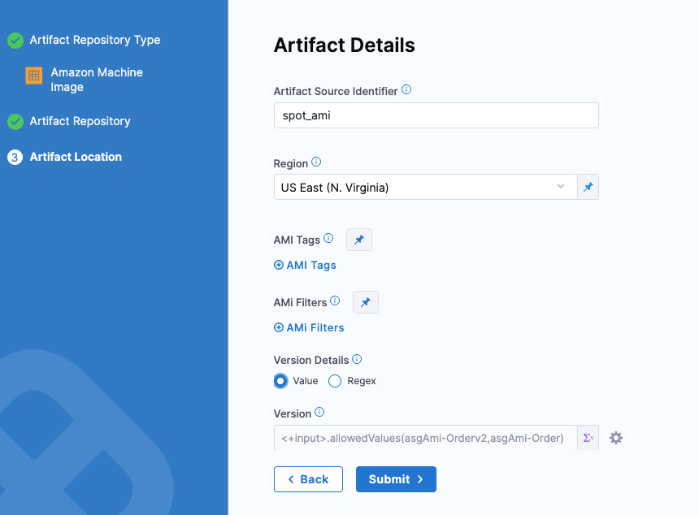
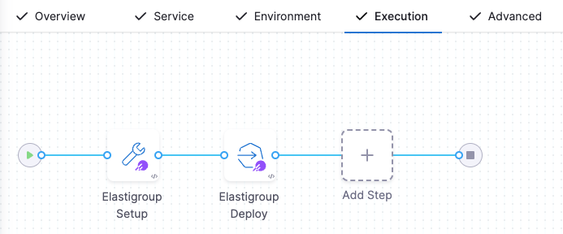
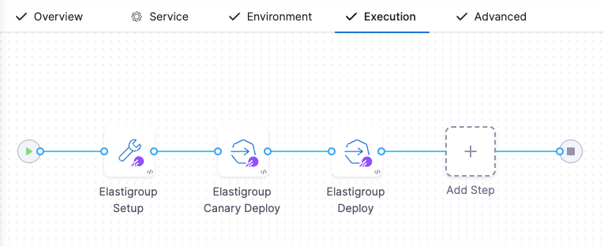
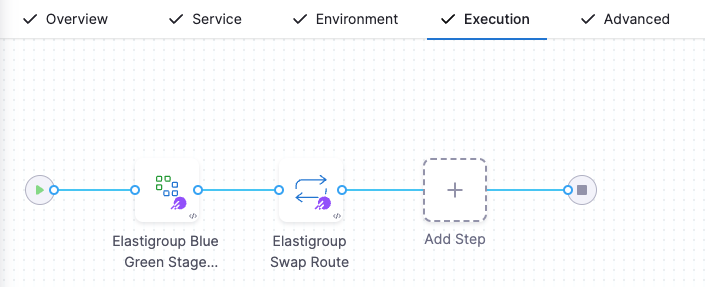
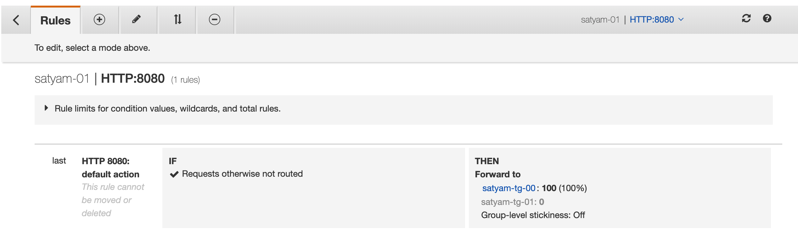

:::info

Currently, Spot Elastigroup support is behind the feature flag `SPOT_ELASTIGROUP_NG`. Contact [Harness Support](mailto:support@harness.io) to enable the feature.

:::

This topic describes how to configure and execute Amazon Machine Image (AMI) deployments through the Spot Elastigroup management platform. 

## Requirements and limitations

* Currently, Harness integrates with Spot only for Amazon Web Services (AWS) deployments by using Elastigroups. 
* Spot Elastigroup deployments support AMI artifacts only.
* Spot Elastigroup deployments support only Basic, Canary, and Blue Green execution types.
* Your spot account must be connected to the AWS cloud provider. For more information, go to [Connect your cloud account to Spot](https://docs.spot.io/connect-your-cloud-provider/aws-account).

## Connect to a Spot cloud provider

You can connect Harness to a Spot cloud provider by adding a Spot connector or an [AWS connector](/docs/platform/Connectors/Cloud-providers/add-aws-connector). 

To connect to a Spot cloud provider using API, go to [Spot API authentication](https://docs.spot.io/api/#section/Authentication).

To use an AWS connector, your spot account must first be connected to the AWS cloud provider. For more information, go to [Connect your cloud account to Spot](https://docs.spot.io/connect-your-cloud-provider/aws-account).

Perform the following steps to add a Spot connector.

1. Open a Harness project.
2. In **Project Setup**, select **Connectors**, then select **New Connector**.
3. In **Cloud Providers**, select **Spot**. The Spot connector settings appear. 
4. Enter a connector name and select **Continue**.
6. In **Authentication**, select one of the following options.
    * **Plaintext** - Enter the **Spot Account Id** and **API Token**. For API token, you can either create a new secret or use an existing one.
    * **Encrypted** - You can create or select a secret for your Spot account Id and API token.
7. Select **Continue**.
8. In **Connect to the provider**, select **Connect through a Harness Delegate**, and then select **Continue**.
   We don't recommend using the **Connect through Harness Platform** option here because you'll need a delegate later for connecting to your Spot cloud. Typically, the **Connect through Harness Platform** option is a quick way to make connections without having to use delegates.

   Expand the sections below to learn more about installing delegates.

<details>
<summary>Use the delegate installation wizard</summary>

1. In your Harness project, select **Project Setup**.
2. Select **Delegates**.
3. Select **Install a Delegate**.
4. Follow the delegate installation wizard.

Use this [delegate installation wizard video](https://www.youtube.com/watch?v=yLMCxs3onH8) to guide you through the process.

</details>

```mdx-code-block
import DelegateInstall from '/tutorials/platform/install-delegate.md';
```

<details>
<summary>Install a delegate using the terminal</summary>
<DelegateInstall />
</details>

To learn more, watch the [Delegate overview](https://developer.harness.io/docs/platform/delegates/delegate-concepts/delegate-overview) video.

9.  In **Set Up Delegates**, select the **Connect using Delegates with the following Tags** option and enter your delegate name.
10. Select **Save and Continue**.
11. Once the test connection succeeds, select **Finish**. The connector now appears in the **Connectors** list.

## Create the Harness Spot Elastigroup pipeline 

1. In your Harness Project, select **Deployments**.
2. Select **Pipelines**, and then select **Create a Pipeline**.
3. Enter the name **Spot Tutorial** for the pipeline, and then select **Start**.
4. Select **Add Stage**.
5. Select **Deploy**.
6. In **Stage Name**, enter **Spot Tutorial**.
7. In **Deployment Type**, select **Spot Elastigroup**, and then select **Set Up Stage**.

The new stage is created. Next, we'll add a Harness service to represent the application you're deploying, and configure the service with the Spot Elastigroup service definition, artifacts, environment definition, and infrastructure for deployment.

## Add a Harness service

Harness services represent your microservices or applications. You can add the same service to as many stages as you need. For more information, go to [services and environments overview](https://developer.harness.io/docs/continuous-delivery/onboard-cd/cd-concepts/services-and-environments-overview).

1. Select the **Service** tab, then select **Add Service**.  
2. Enter a service name. For example, spot-svc.
  
   Services are persistent and can be used throughout the stages of this pipeline or any other pipeline in the project.

3. In **Service Definition**, in **Deployment Type**, verify if **Spot Elastigroup** is selected.
4. In **Artifacts**, select **Add Artifact Source**.
5. In **Specify Artifact Repository Type**, select **Amazon Machine Image**, and select **Continue**.
   
   :::important
   Spot Elastigroup deployments support AMI artifacts only.
   :::
   
6. In **Amazon Machine Image Repository**, select **New AWS Connector**.
7. Enter a name for the connector, and then select **Continue**.
8. In **Credentials**, select **AWS Access Key**.
9. In **Authentication**, select one of the following options.
    * **Plaintext** - Enter the [**Access Key** and **Secret Key**](https://docs.aws.amazon.com/IAM/latest/UserGuide/security-creds.html#access-keys-and-secret-access-keys). For Secret Key, you can either create a new secret or use an existing one. 
    * **Encrypted** - You can create or select a secret for your Access Key and Secret Key.
10. Select **Enable cross-account access (STS Role)** if you want to use one AWS account for the connection, but want to deploy or build in a different AWS account. 
    
    In this scenario, the AWS account used for AWS access in credentials will assume the IAM role you specify in cross-account role ARN setting. This option uses the [AWS Security Token Service (STS)](https://docs.aws.amazon.com/IAM/latest/UserGuide/id_credentials_temp.html) feature.
11. In **Test Region**, select an AWS region to test the credentials for this connector. 
12. In **Delegates Setup**, select **Only use Delegate with all of the following tags** and enter the name of the delegate created in [connect to a Spot cloud provider (step 8)](#connect-to-a-spot-cloud-provider).
13. Select **Save and Continue**
14.  After the test connection succeeds, select **Continue**.
15. In **Artifact Details**, enter the following details:
    1.  In **Artifact Source Identifier**, enter a name for the artifact.
    2.  In **Region**, select the region where the artifact is located. 
    3.  (Optional) In **AMI Tags**, add the tags used by your AMI. 
    4.  (Optional) In **AMI Filters**, add the AMI ID filters to locate the AMI resource.
    5.  In **Version Details** select **Value** to enter the version number of the package you want to use. You can also select **Regex** and enter a tag regex to filter the package version.
    
    
16. Select **Submit**.
17. **Save** the service configuration.

### Sample service YAML

Here's a sample Spot service YAML: 

```
service:
  name: spot-svc
  identifier: spotsvc
  serviceDefinition:
    type: Elastigroup
    spec:
      artifacts:
        primary:
          primaryArtifactRef: <+input>
          sources:
            - identifier: spot_ami
              spec:
                connectorRef: org.AWSConnectorForAutomationTest
                region: us-east-1
                version: <+input>.allowedValues(asgAmi-Orderv2,asgAmi-Order)
              type: AmazonMachineImage
  gitOpsEnabled: false
```

## Add a Spot environment

Define the environment where you will deploy your application.

1. In **Environment >** **Specify Environment**, select **New Environment**.  
2. Enter the name **Spot** and select **Production** or **Pre-Production**.
4. Select **Save**.
5. In **Specify Infrastructure**, select **New Infrastructure**.
6. Enter a name, and then verify that the selected deployment type is **Spot Elastigroup**.
7. Select the [Spot connector](#connect-to-a-spot-cloud-provider) you created earlier.
8. In **Elastigroup Configuration**, select an Elastigroup configuration source file from the [Harness file store](/docs/continuous-delivery/x-platform-cd-features/services/add-inline-manifests-using-file-store/) or create a new file.
   
   <details>
   <summary>Sample Elastigroup configuration source file</summary>

   ```
   {
     "group": {
       "name": "spotinst__ser__env",
       "capacity": {
         "minimum": 1,
         "maximum": 1,
         "target": 1,
         "unit": "instance"
       },
       "strategy": {
         "risk": 100,
         "availabilityVsCost": "balanced",
         "drainingTimeout": 120,
         "fallbackToOd": true,
         "scalingStrategy": {},
         "persistence": {},
         "revertToSpot": {
           "performAt": "always"
         }
       },
       "compute": {
         "instanceTypes": {
           "ondemand": "t2.small",
           "spot": [
             "m3.medium",
             "t2.small",
             "t3.small",
             "t3a.small",
             "t2.medium",
             "t3.medium",
             "t3a.medium"
           ]
         },
         "availabilityZones": [
           {
             "name": "us-east-1a",
             "subnetIds": [
               "subnet-1f703d78"
             ]
           },
           {
             "name": "us-east-1b",
             "subnetIds": [
               "subnet-01bdf52f"
             ]
           },
           {
             "name": "us-east-1c",
             "subnetIds": [
               "subnet-33eaf779"
             ]
           },
           {
             "name": "us-east-1d",
             "subnetIds": [
               "subnet-c1ce809d"
             ]
           },
           {
             "name": "us-east-1e",
             "subnetIds": [
               "subnet-7427b64a"
             ]
           },
           {
             "name": "us-east-1f",
             "subnetIds": [
               "subnet-11efe81e"
             ]
           }
         ],
         "product": "Linux/UNIX",
         "launchSpecification": {
           "loadBalancersConfig": {
             "loadBalancers": [
               {
                 "name": "asg-tg6",
                 "arn": "arn:aws:elasticloadbalancing:us-east-1:839162981415:targetgroup/asg-tg6/3bcd13e204785948",
                 "type": "TARGET_GROUP"
               }
             ]
           },
           "securityGroupIds": [
            "sg-0cfbf142d42e37b24"
           ],
           "monitoring": false,
           "ebsOptimized": false,
           "imageId": "ami-0663143d1f1caa3bf",
           "keyPair": "satyam-aws-cross",
           "tenancy": "default"
         }
       },
       "scaling": {},
       "scheduling": {},
       "thirdPartiesIntegration": {}
    }
   }
   ```

   </details>
9. Select **Save**.

### Sample infrastructure definition YAML

Here's a sample infrastructure definition YAML: 
```
infrastructureDefinition:
  name: spot-infra
  identifier: spotinfra
  description: ""
  tags: {}
  orgIdentifier: Ng_Pipelines_K8s_Organisations
  projectIdentifier: DoNotDelete_IvanBalan
  environmentRef: Spot
  deploymentType: Elastigroup
  type: Elastigroup
  spec:
    connectorRef: spotinstconn
    configuration:
      store:
        type: Harness
        spec:
          files:
            - /spot/spot-cfg
  allowSimultaneousDeployments: false
```

## Spot Elastigroup execution strategies

Now you can select a [deployment strategy](/docs/continuous-delivery/manage-deployments/deployment-concepts.md) for this stage of the pipeline.

:::info
Spot Elastigroup deployments support only Basic, Canary, and Blue Green execution types.
:::

```mdx-code-block
import Tabs from '@theme/Tabs';
import TabItem from '@theme/TabItem';
```
```mdx-code-block
<Tabs>
<TabItem value="Basic" label="Basic">
```
Spot Elastigroups perform the functions that Auto Scaling Groups perform in standard AMI deployments. By default, Harness Spot Elastigroup Basic deployment pre-configure the following steps:

* Elastigroup Setup - Specify how many instances to launch, and their steady state timeout.
* Elastigroup Deploy - Specify how many instances to deploy, as a number or percentage of the Elastigroup parameters you've set up.

## Create a Basic deployment

1. In Execution Strategies, select **Basic**, then select **Use Strategy**.
2. The basic execution steps are added. 
   
   

3. Select the **Elastigroup Setup** step to define **Step Parameters**.
    * **Name** - Enter the deployment step name.
    * **Timeout** - Set how long you want the Harness delegate to wait for the Spot cloud to respond to API requests before timeout.
    * **App Name** - Enter a name for the Elastigroup app name that Harness will create. For example, `<+project.identifier>_<+service.identifier>_<+env.identifier>_basic2`. You can select a fixed value, runtime input, or expression for this field. 
    * In **Instances**, select: 
       * **Same as already running instances** to replicate the already running instances.
       * **Fixed** and enter **Min Instances**, **Max Instances**, and **Desired Instances**.
4. Select the **Elastigroup Deploy** step to define **Step Parameters**.
    * **Name** - Enter the deployment step name.
    * **Timeout** - Set how long you want the Harness delegate to wait for the Spot cloud to respond to API requests before timeout.
    * **New Service** - Select:
        * **Percent** to specify a percentage of the target instances that you set in the **Elastigroup Setup** step.
        * **Count** and specify an exact number of instances. This cannot exceed the **Max Instances** that you set in the **Elastigroup Setup** step.
5. (Optional) In the **Advanced** section of each step, configure the following options.
   - **Delegate Selector** - Select the delegate(s) you want to use to execute this step. You can select one or more delegates for each pipeline step. You only need to select one of a delegate's tags to select it. All delegates with the tag are selected.
   - **Conditional Execution** - Use the conditions to determine when this step is executed. For more information, go to [Conditional execution settings](/docs/platform/pipelines/w_pipeline-steps-reference/step-skip-condition-settings/).
   - **Failure Strategy** - Define the failure strategies to control the behavior of your pipeline when there is an error in execution. For more information, go to [Failure strategy references](/docs/platform/pipelines/w_pipeline-steps-reference/step-failure-strategy-settings/) and [Define a failure strategy](/docs/platform/Pipelines/define-a-failure-strategy-on-stages-and-steps).
   - **Looping Strategy** - Select matrix, repeat, or parallelism looping strategy. For more information, go to [Looping strategy](/docs/platform/pipelines/looping-strategies-matrix-repeat-and-parallelism/).
   - **Policy Enforcement** - Add or modify policy set. These policies will be evaluated after the step is complete. For more information, go to [Policy sets](/docs/platform/Governance/Policy-as-code/disable-a-policy-set).
6. Select **Apply Changes**. 
7. Select **Save**. 
   
Now the pipeline stage is complete and you can deploy. Select **Run** to run the pipeline. 

```mdx-code-block
  </TabItem>
  <TabItem value="Canary" label="Canary">
```
Spot Elastigroups perform the functions that Auto Scaling Groups perform in standard AMI deployments. By default, Harness Spot Elastigroup Basic deployment pre-configure the following steps:

* Elastigroup Setup - Specify how many instances to launch, and their steady state timeout.
* Elastigroup Canary Deploy - Specify how many instances to deploy in this phase. When you add additional phases, each phase automatically includes a Elastigroup Deploy step, which you must configure with the count or percentage of instances you want deployed in that phase.
* Elastigroup Deploy - Specify how many instances to deploy, as a number or percentage of the Elastigroup parameters you've set up.

## Create a Canary deployment

1. In **Execution Strategies**, select **Canary**, and then click **Use Strategy**.
2. The canary execution steps are added. 
   
3. Select the **Elastigroup Setup** step to define **Step Parameters**.
    * **Name** - Enter the deployment step name.
    * **Timeout** - Set how long you want the Harness delegate to wait for the Spot cloud to respond to API requests before timeout.
    * **App Name** - Enter a name for the Elastigroup app name that Harness will create. For example, `<+project.identifier>_<+service.identifier>_<+env.identifier>_basic2`. You can select a fixed value, runtime input, or expression for this field. 
    * In **Instances**, select: 
       * **Same as already running instances** to replicate the already running instances.
       * **Fixed** and enter **Min Instances**, **Max Instances**, and **Desired Instances**.
4. Select the **Elastigroup Canary Deploy** step to define **Step Parameters**.
    * **Name** - Enter the deployment step name.
    * **Timeout** - Set how long you want the Harness delegate to wait for the Spot cloud to respond to API requests before timeout.
    * **New Service** - Select:
        * **Percent** to specify a percentage of the target instances that you set in the **Elastigroup Setup** step.
        * **Count** and specify an exact number of instances. This cannot exceed the **Max Instances** that you set in the **Elastigroup Setup** step.
5. Select the **Elastigroup Deploy** step to define **Step Parameters**.
    * **Name** - Enter the deployment step name.
    * **Timeout** - Set how long you want the Harness delegate to wait for the Spot cloud to respond to API requests before timeout.
    * **New Service** - Select:
        * **Percent** to specify a percentage of the target instances that you set in the **Elastigroup Setup** step.
        * **Count** and specify an exact number of instances. This cannot exceed the **Max Instances** that you set in the **Elastigroup Setup** step.
6. (Optional) In the **Advanced** section of each step, configure the following options.
   - **Delegate Selector** - Select the delegate(s) you want to use to execute this step. You can select one or more delegates for each pipeline step. You only need to select one of a delegate's tags to select it. All delegates with the tag are selected.
   - **Conditional Execution** - Use the conditions to determine when this step is executed. For more information, go to [Conditional execution settings](/docs/platform/pipelines/w_pipeline-steps-reference/step-skip-condition-settings/).
   - **Failure Strategy** - Define the failure strategies to control the behavior of your pipeline when there is an error in execution. For more information, go to [Failure strategy references](/docs/platform/pipelines/w_pipeline-steps-reference/step-failure-strategy-settings/) and [Define a failure strategy](/docs/platform/Pipelines/define-a-failure-strategy-on-stages-and-steps).
   - **Looping Strategy** - Select matrix, repeat, or parallelism looping strategy. For more information, go to [Looping strategy](/docs/platform/pipelines/looping-strategies-matrix-repeat-and-parallelism/).
   - **Policy Enforcement** - Add or modify policy set. These policies will be evaluated after the step is complete. For more information, go to [Policy sets](/docs/platform/Governance/Policy-as-code/disable-a-policy-set).
7. Select **Apply Changes**. 
8. Select **Save**. 

Now the pipeline stage is complete and you can deploy. Select **Run** to run the pipeline. 

```mdx-code-block
  </TabItem>
  <TabItem value="Blue Green" label="Blue Green">
```
This deployment method lets you add steps to incrementally shift traffic from the Target Group used by the previous Elastigroup to the Target Group used by the new Elastigroup you are deploying.

With this strategy, you are not shifting traffic from stage and production environments. You are shifting traffic incrementally for a production environment. In this way, it is similar to a Canary strategy.

However, in a Canary deployment, the percentage of traffic that goes to the new Elastigroup is determined by the number of instances or the forwarding policy of the load balancer.

With this Incremental Traffic Shift strategy, you are controlling the percentage of traffic sent to the new Elastigroup.

## Requirements

* A pair of [Target Groups](https://docs.aws.amazon.com/elasticloadbalancing/latest/application/load-balancer-target-groups.html), typically staging (Stage) and production (Prod) both with the **instance** target type.
* A Load Balancer with listeners for both your Target Groups' ports.

## Create a Blue Green deployment
  
1. In Execution Strategies, select **Blue Green**, and then click **Use Strategy**.
2. The blue green execution steps are added. 
   
   
3. Select the **Elastigroup Blue Green Stage Setup** step to define **Step Parameters**.
    * **Name** - Enter the deployment step name.
    * **Timeout** - Set how long you want the Harness delegate to wait for the Spot cloud to respond to API requests before timeout.
    * **App Name** - Enter a name for the Elastigroup app name that Harness will create. For example, `<+project.identifier>_<+service.identifier>_<+env.identifier>_basic2`. You can select a fixed value, runtime input, or expression for this field. 
    * In **Instances**, select: 
       * **Same as already running instances** to replicate the already running instances.
       * **Fixed** and enter **Min Instances**, **Max Instances**, and **Desired Instances**.
    * In **Connected Cloud Provider**, you can override the connector and region you selected in the service configuration. 
    * Add **AWS Load Balancer Configuration**.
  
      You need the following AWS ELB setup:
        * AWS Application Load Balancer configured with one [Listener](https://docs.aws.amazon.com/elasticloadbalancing/latest/application/create-listener.html).
        * The Listener must have a [Rule](https://docs.aws.amazon.com/elasticloadbalancing/latest/application/listener-update-rules.html) redirecting to two [Target Groups](https://docs.aws.amazon.com/elasticloadbalancing/latest/application/load-balancer-target-groups.html) (TGs).
        * You will need registered target instances for the Target Groups.
        
        
4. Select the **Elastigroup Blue Green Stage Setup** step to define **Step Parameters**.
    * **Name** - Enter the deployment step name.
    * **Timeout** - Set how long you want the Harness delegate to wait for the Spot cloud to respond to API requests before timeout.
    * Select **Downsize old Elastigroup** to downsize the old Elastigroup.
5. (Optional) In the **Advanced** section of each step, configure the following options.
   - **Delegate Selector** - Select the delegate(s) you want to use to execute this step. You can select one or more delegates for each pipeline step. You only need to select one of a delegate's tags to select it. All delegates with the tag are selected.
   - **Conditional Execution** - Use the conditions to determine when this step is executed. For more information, go to [Conditional execution settings](/docs/platform/pipelines/w_pipeline-steps-reference/step-skip-condition-settings/).
   - **Failure Strategy** - Define the failure strategies to control the behavior of your pipeline when there is an error in execution. For more information, go to [Failure strategy references](/docs/platform/pipelines/w_pipeline-steps-reference/step-failure-strategy-settings/) and [Define a failure strategy](/docs/platform/Pipelines/define-a-failure-strategy-on-stages-and-steps).
   - **Looping Strategy** - Select matrix, repeat, or parallelism looping strategy. For more information, go to [Looping strategy](/docs/platform/pipelines/looping-strategies-matrix-repeat-and-parallelism/).
   - **Policy Enforcement** - Add or modify policy set. These policies will be evaluated after the step is complete. For more information, go to [Policy sets](/docs/platform/Governance/Policy-as-code/disable-a-policy-set).
6. Select **Apply Changes**. 
7. Select **Save**.   

Now the pipeline stage is complete and you can deploy. Select **Run** to run the pipeline. 

```mdx-code-block
</TabItem>    
</Tabs>
```