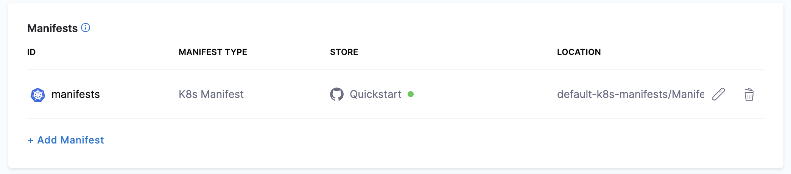
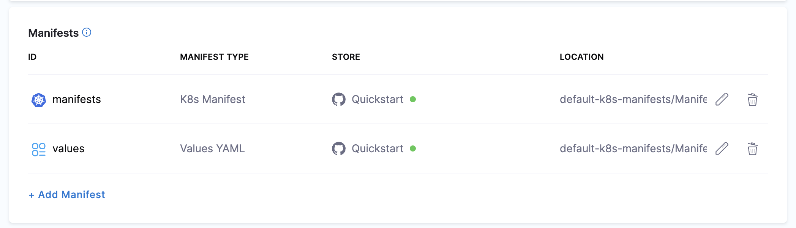
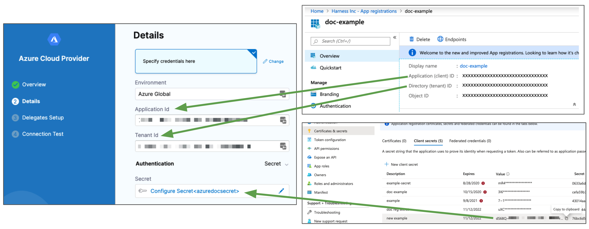
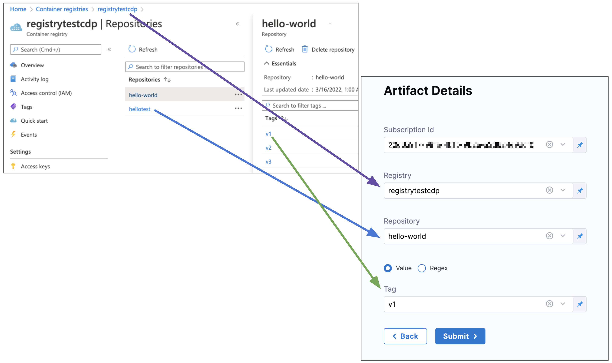
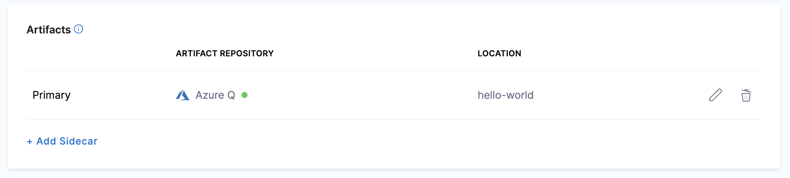
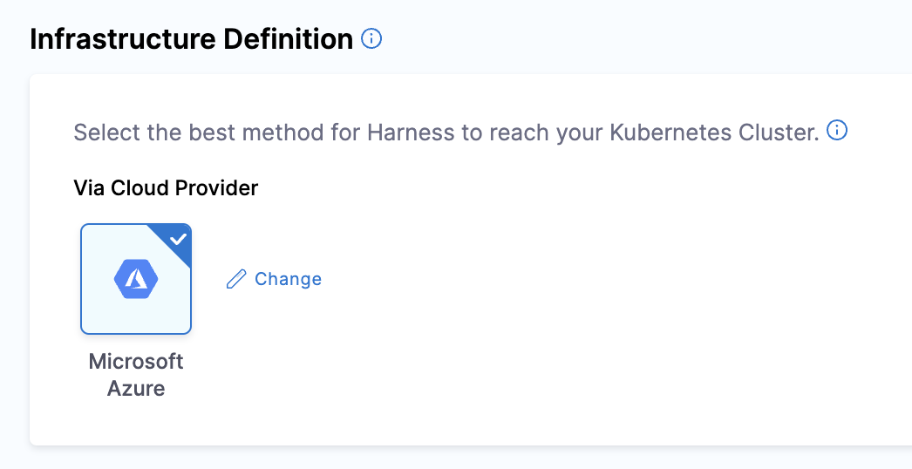
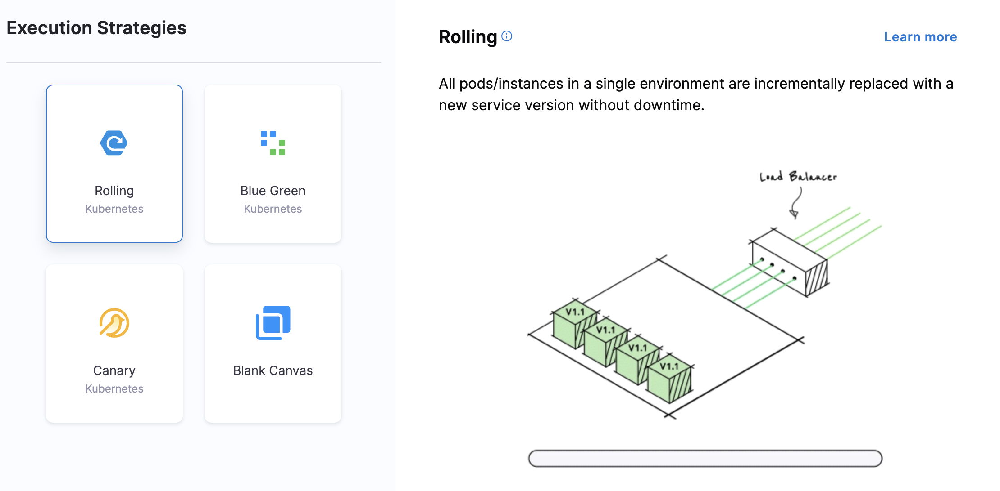

This quickstart deploys a Docker image in your Azure Container Registry (ACR) repo to your Azure Kubernetes Service (AKS) cluster. Once you've completed this quickstart, you'll be able to easily set up Harness for your own Azure dev, qa, and production deployments.

## Objectives

You'll learn how to:

* Set up an ACR to AKS Kubernetes Pipeline in Harness.
* Install and launch a Harness Kubernetes Delegate in your target AKS cluster.
* Connect Harness to your Azure account using a Harness Azure Connector.
* Run the new Kubernetes Pipeline and deploy a Docker image to your target cluster.

## Before you begin

Review [Harness Key Concepts](/docs/getting-started/learn-harness-key-concepts) to establish a general understanding of Harness.Make sure you have the following set up before you begin this quickstart:

* **GitHub account:** this quickstart uses publicly available manifests and values YAML files, but GitHub requires that you use a GitHub account for fetching files.
* **Azure ACR and AKS Permissions:** make sure you have a Service Principal or Managed Identity you can use to connect Harness to your Azure App registration, and that it has the required permissions:
	+ **ACR:** the **Reader** role must be assigned.
	+ **AKS:** the **Owner** role must be assigned.
	+ For a custom role, see the permissions in [Add a Microsoft Azure Cloud Connector](/docs/platform/Connectors/Cloud-providers/add-a-microsoft-azure-connector).

* **AKS Cluster:** you'll need a target AKS cluster for the deployment. Ensure your cluster meets the following requirements:
  * **Number of nodes:** 2.
  * **vCPUs, Memory, Disk Size:** 4vCPUs, 16GB memory, 100GB disk. In AKS, the **Standard DS2 v2** machine type is enough for this quickstart.
  * **Networking:** outbound HTTPS for the Harness connection to **app.harness.io**, **github.com**, and **hub.docker.com**. Allow TCP port 22 for SSH.

## Create the Deploy stage

Pipelines are collections of stages. For this quickstart, we'll create a new Pipeline and add a single stage.

:::note

**Create a Project for your new CD Pipeline:** if you don't already have a Harness Project, create a Project for your new CD Pipeline. Ensure that you add the **Continuous Delivery** module to the Project. See [Create Organizations and Projects](/docs/platform/organizations-and-projects/create-an-organization).In your Harness Project, click **Deployments**, and then click **Create a** **Pipeline**.

:::

1. In your Harness Project, click **Deployments**, and then click **Create a Pipeline**.
2. Enter the name **Azure Quickstart** and click **Start**.

  Your Pipeline appears.

  Do the following:

1. Click **Add Stage** and select **Deploy**.
2. Enter the name **Deploy Service**, make sure **Service** is selected, and then click **Set Up Stage**.
3. The new stage settings appear.
4. In **About the** **Service**, click **New Service**.
5. Give the Service the name **quickstart** and click **Save**.

:::note

Let's take a moment and review Harness Services and Service Definitions (which are explained below). Harness Services represent your microservices/apps logically. You can add the same Service to as many stages as you need. Service Definitions represent your artifacts, manifests, and variables physically. They are the actual files and variable values. 

By separating Services and Service Definitions, you can propagate the same Service across stages while changing the artifacts, manifests, and variables with each stage. Once you have created a Service, it is persistent and can be used throughout the stages of this or any other Pipeline in the Project.

::: 


## Add the manifest and values YAML

Next, we can add a Kubernetes manifest for our deployment. We'll use [publicly-available manifests and a values file](https://github.com/wings-software/harness-docs/tree/main/default-k8s-manifests/Manifests/Files) available from Harness.

1. In **Service Definition**, in **Deployment Type**, click **Kubernetes**.
2. In **Manifests**, click **Add Manifest**.
3. Select **K8s Manifest**, and click **Continue**.
4. In **Select K8sManifest Store**, click **GitHub**, and then click **New GitHub Connector**.
5. The **Git Connector** settings appear. Enter the following settings.
  1. **Name:** enter a name for the Connector, like **Quickstart**.**URL Type:** select **Repository**.**Connection Type:** select **HTTP**.**Git Repository URL:** enter `https://github.com/wings-software/harness-docs.git`.
  2. **Username and Token:** enter the username and a Github Personal Access Token for your Github account. You'll have to create a Harness secret for the password.
  3. In **Personal Access Token**, click **Create or Select a Secret**.
  4. Click **New Secret Text**.
  5. In **Secret Name**, enter a name for the secret like **github-pat**.
  6. In **Secret Value**, paste in a GitHub Personal access token. When you're logged into GitHub, these are typically listed at <https://github.com/settings/tokens>. For steps on setting up a GitHub PAT, see [Creating a personal access token](https://docs.github.com/en/authentication/keeping-your-account-and-data-secure/creating-a-personal-access-token) from GitHub.
  7. Ensure you PAT has the **repo** scope selected:
  
  
  
6. Click **Continue**.
7. In **Connect to the provider**, select **Connect through a Harness Delegate**, and click **Continue**. 
  
  Now we'll add a Harness Delegate to your Environment.
  
  The Harness Delegate is a software service you install in your environment that connects to the Harness Manager and performs tasks using your container orchestration platforms, artifact repositories, monitoring systems, etc.
  
3. In **Delegates Setup**, click **Install new Delegate**.

   Expand the section below to learn more about installing delegates.

   <details>
   <summary>Install a new delegate</summary>

    1. In **Delegates Setup**, select **Install new Delegate**. The delegate wizard appears.
    2. In the **New Delegate** dialog, in **Select where you want to install your Delegate**, select **Kubernetes**.
    3. In **Install your Delegate**, select **Kubernetes Manifest**.
    4. Enter a delegate name.
        - Delegate names must be unique within a namespace and should be unique in your cluster. 
        - A valid name includes only lowercase letters and does not start or end with a number. 
        - The dash character (“-”) can be used as a separator between letters.
    5. At a terminal, run the following cURL command to copy the Kuberntes YAML file to the target location for installation.

    `curl -LO https://raw.githubusercontent.com/harness/delegate-kubernetes-manifest/main/harness-delegate.yaml`

    6. Open the `harness-delegate.yaml` file. Find and specify the following placeholder values as described.

    | **Value** | **Description** |
    | :-- | :-- |
    | `PUT_YOUR_DELEGATE_NAME` | Name of the delegate. |
    | `PUT_YOUR_ACCOUNT_ID` | Harness account ID. |
    | `PUT_YOUR_MANAGER_ENDPOINT` | URL of your cluster. See the following table of Harness clusters and endpoints. |
    | `PUT_YOUR_DELEGATE_TOKEN` | Delegate token. To find it, go to **Account Settings** > **Account Resources**, select **Delegate**, and select **Tokens**. For more information on how to add your delegate token to the harness-delegate.yaml file, go to [Secure delegates with tokens](/docs/platform/delegates/secure-delegates/secure-delegates-with-tokens/). |

    Your Harness manager endpoint depends on your Harness SaaS cluster location. Use the following table to find the Harness manager endpoint in your Harness SaaS cluster.

    | **Harness cluster location** | **Harness Manager endpoint** |
    | :-- | :-- |
    | SaaS prod-1 | https://app.harness.io |
    | SaaS prod-2 | https://app.harness.io/gratis |
    | SaaS prod-3 | https://app3.harness.io |

    7. Install the delegate by running the following command:

    `kubectl apply -f harness-delegate.yaml`

    The successful output looks like this.
    
    ```
    namespace/harness-delegate-ng unchanged
    clusterrolebinding.rbac.authorization.k8s.io/harness-delegate-cluster-admin unchanged
    secret/cd-doc-delegate-account-token created
    deployment.apps/cd-doc-delegate created
    service/delegate-service configured
    role.rbac.authorization.k8s.io/upgrader-cronjob unchanged
    rolebinding.rbac.authorization.k8s.io/upgrader-cronjob configured
    serviceaccount/upgrader-cronjob-sa unchanged
    secret/cd-doc-delegate-upgrader-token created
    configmap/cd-doc-delegate-upgrader-config created
    cronjob.batch/cd-doc-delegate-upgrader-job created
    ```

   8. Select **Verify** to make sure that the delegate is installed properly.
   
   </details>
4. Back in **Set Up Delegates**, you can select the new Delegate. In the list of Delegates, you can see your new Delegate and its tags.
5. Select the **Connect using Delegates with the following Tags** option.
6. Enter the tag of the new Delegate and click **Save and Continue**.
7. In **Connection Test**, you can see that the connection is successful. Click **Finish**.
8. Back in **Specify K8s Manifest Store**, click **Continue**.
9. In **Manifest Details**, enter the following settings, test the connection, and click **Submit**.

  We are going to provide connection and path information for a manifest located at `https://github.com/wings-software/harness-docs/tree/main/default-k8s-manifests/Manifests/Files/templates`.
   1. **Manifest Identifier:** enter **manifests**.
   2. **Git Fetch Type:** select **Latest from Branch**.
   3. **Branch:** enter **main**.
   4. **File/Folder path:**`default-k8s-manifests/Manifests/Files/templates` 
  
  This is the path from the repo root. The manifest is now listed.

  

  Next, let's add the values.yaml file for the deployment.

  Harness supports Go templating with a Values YAML file by default so you can template your manifests. Also, you can use [Harness expressions](/docs/platform/Variables-and-Expressions/harness-variables) in your values.yaml file. 

  We will use a [values.yaml file](https://github.com/wings-software/harness-docs/blob/main/default-k8s-manifests/Manifests/Files/ng_values_dockercfg.yaml) that uses the `<+artifact.image>` expression to reference the artifact you will add later in **Artifacts**.
  
  <details>
  <summary>values YAML file</summary>

    ```yaml
    name: harness-quickstart  
    replicas: 1  
      
    image: <+artifact.image>  
    dockercfg: <+artifact.imagePullSecret>  
      
    createNamespace: true  
    namespace: <+infra.namespace>  
      
    # Service Type allow you to specify what kind of service you want.  
    # Possible values for ServiceType are:  
    # ClusterIP | NodePort | LoadBalancer | ExternalName  
    serviceType: LoadBalancer  
      
    # A Service can map an incoming port to any targetPort.  
    # targetPort is where application is listening on inside the container.  
    servicePort: 80  
    serviceTargetPort: 80  
      
    # Specify all environment variables to be added to the container.  
    # The following two maps, config and secrets, are put into a ConfigMap  
    # and a Secret, respectively.  
    # Both are added to the container environment in podSpec as envFrom source.  
    env:  
      config:  
        key1: value1  
      secrets:  
        key2: value2
    ```
  </details>

10. Click **Add Manifest**.
11. In **Specify Manifest Type**, select **Values YAML**, and click **Continue**.
12. In **Specify Values YAML Store**, select the same GitHub Connector you used for your manifests, and then click **Continue**.
   1. In **Manifest Details**, enter the following and click **Submit**.
   2. **Manifest Identifier:** `values`.
   3. **Git Fetch Type:** `Latest from Branch`.
   4. **Branch:** `main`.
   5. **File Path:** `default-k8s-manifests/Manifests/Files/ng_values_dockercfg.yaml`.

The values file is listed.



Next, let's add your artifact from ACR.

## Add the artifact

Now you can add an artifact from your ACR repo. We'll create a Harness Azure Connector to connect Harness with your ACR repo.

1. In **Artifacts**, click **Add Primary** **Artifact**.
2. In **Artifact Repository Type**, click **ACR**, and then click **Continue**.
3. In **ACR Repository**, click **New Azure Connector**.
4. Enter a name for the Connector, such as **Azure Quickstart**, and click **Continue**.
5. In **Details**, click **Specify credentials here**.
6. Enter the credentials for the Azure App registration you want to use. Here's an example of how App registration settings map to the Connector's **Details**:

  

   + **Azure ACR and AKS Permissions:** make sure the Service Principal or Managed Identity has the [required permissions](/docs/platform/Connectors/Cloud-providers/add-a-microsoft-azure-connector):
     
     + **ACR:** the **Reader** role must be assigned.
     + **AKS:** the **Owner** role must be assigned.
     + For a custom role, see the permissions in [Add a Microsoft Azure Cloud Connector](/docs/platform/Connectors/Cloud-providers/add-a-microsoft-azure-connector).
  
7. Click **Continue**.
8. In **Delegates Setup**, click **Only use Delegates with all of the following tags**, and then select the Delegate you added earlier.
9. Click **Save and Continue**.
10. The Connection Test is performed. Once it's completed, you'll be back in **ACR Repository**. Click **Continue**.
11. In **Artifact Details**, select the Subscription Id where the artifact source is located.
12. In **Registry**, select the ACR registry to use.
13. In **Repository**, select the repo to use.
14. In **Tag**, enter or select the tag for the image.

  Here's an example of how ACR settings map to **Artifact Details**:

  

15. Click **Submit**. The Artifact is added to the Service Definition.

  

  Now that the artifact and manifest are defined, you can define the target cluster for your deployment.

16. Click **Next** at the bottom of the **Service** tab.

## Define the infrastructure

You define the target infrastructure for your deployment in the **Environment** settings of the pipeline stage. You can define an environment separately and select it in the stage, or create the environment within the stage **Environment** tab.

There are two methods of specifying the deployment target infrastructure:

- **Pre-existing**: the target infrastructure already exists and you simply need to provide the required settings.
- **Dynamically provisioned**: the target infrastructure will be dynamically provisioned on-the-fly as part of the deployment process.

For details on Harness provisioning, go to [Provisioning overview](/docs/continuous-delivery/cd-infrastructure/provisioning-overview).

### Pre-existing AKS infrastructure

The target cluster is your own AKS cluster, hosted in your Azure cloud. This is where we will deploy your ACR image using the manifest you selected.

1. In **Infrastructure Details**, in **Specify your environment**, click **New Environment**. Just like with a Service, you can create a new Environment or selecting an existing one. We'll create a new one.
2. In **New Environment**, enter a name, select **Pre-Production**, and click **Save**. The new Environment appears.
3. In **Infrastructure Definition**, click **Microsoft** **Azure**.

  
1. In **Cluster details**, enter the following.
2. In **Connector**, click **Select a connector**.
3. Select the Azure Connector you added earlier, and then click **Apply Selected**.
4. In **Subscription Id**, select the Subscription where you AKS cluster is located.
5. In **Resource Group**, enter the resource group for your AKS cluster.
6. In **Cluster**, select the cluster name.
7.  In **Namespace**, enter an existing namespace, such as **default**.

Now that the stage's Infrastructure is complete, you can select the [deployment strategy](/docs/continuous-delivery/manage-deployments/deployment-concepts) for this stage of the Pipeline.

### Dynamically provisioned AKS infrastructure

:::note

Currently, the dynamic provisioning documented in this topic is behind the feature flag `CD_NG_DYNAMIC_PROVISIONING_ENV_V2`. Contact [Harness Support](mailto:support@harness.io) to enable the feature.

:::

Here is a summary of the steps to dynamically provision the target infrastructure for a deployment:

1. **Add dynamic provisioning to the CD stage**:
   1. In a Harness Deploy stage, in **Environment**, enable the option **Provision your target infrastructure dynamically during the execution of your Pipeline**.
   2. Select the type of provisioner that you want to use.
   
      Harness automatically adds the provisioner steps for the provisioner type you selected.
   3. Configure the provisioner steps to run your provisioning scripts.
   4. Select or create a Harness infrastructure in **Environment**.
2. **Map the provisioner outputs to the Infrastructure Definition**:
   1. In the Harness infrastructure, enable the option **Map Dynamically Provisioned Infrastructure**.
   2. Map the provisioning script/template outputs to the required infrastructure settings.

#### Supported provisioners

The following provisioners are supported for AKS deployments:

- [Terraform](/docs/continuous-delivery/cd-infrastructure/terraform-infra/terraform-provisioning-with-harness)
- [Azure Resource Manager (ARM)](/docs/continuous-delivery/cd-infrastructure/azure-arm-provisioning)
- [Azure Blueprint](/docs/continuous-delivery/cd-infrastructure/azure-blueprint-provisioning)
- [Shell Script](/docs/continuous-delivery/cd-infrastructure/shell-script-provisioning)

#### Adding dynamic provisioning to the stage

To add dynamic provisioning to a Harness pipeline Deploy stage, do the following:

1. In a Harness Deploy stage, in **Environment**, enable the option **Provision your target infrastructure dynamically during the execution of your Pipeline**.
2. Select the type of provisioner that you want to use.
   
   Harness automatically adds the necessary provisioner steps.
3. Set up the provisioner steps to run your provisioning scripts.

For documentation on each of the required steps for the provisioner you selected, go to the following topics:

- **Terraform:**
  - [Terraform Plan](/docs/continuous-delivery/cd-infrastructure/terraform-infra/run-a-terraform-plan-with-the-terraform-plan-step)
  - [Terraform Apply](/docs/continuous-delivery/cd-infrastructure/terraform-infra/run-a-terraform-plan-with-the-terraform-apply-step)
  - [Terraform Rollback](/docs/continuous-delivery/cd-infrastructure/terraform-infra/rollback-provisioned-infra-with-the-terraform-rollback-step). To see the Terraform Rollback step, toggle the **Rollback** setting.
- [Terragrunt](/docs/continuous-delivery/cd-infrastructure/terragrunt-howtos)
- [Terraform Cloud](/docs/continuous-delivery/cd-infrastructure/terraform-infra/terraform-cloud-deployments)
- [Azure Resource Management (ARM)](/docs/continuous-delivery/cd-infrastructure/azure-arm-provisioning)
- [Azure Blueprint](/docs/continuous-delivery/cd-infrastructure/azure-blueprint-provisioning)
- [Shell Script](/docs/continuous-delivery/cd-infrastructure/shell-script-provisioning)


#### Mapping provisioner output

Once you set up dynamic provisioning in the stage, you must map outputs from your provisioning script/template to specific settings in the Harness Infrastructure Definition used in the stage.

1. In the same CD Deploy stage where you enabled dynamic provisioning, select or create (**New Infrastructure**) a Harness infrastructure.
2. In the Harness infrastructure, in **Select Infrastructure Type**, select **Direct** or **Microsoft Azure**.
3. In **Cluster details**, enable the option **Map Dynamically Provisioned Infrastructure**.
   
   The **Azure Infrastructure details** section adds a **Provisioner** setting and configures it as a runtime input.
4. Map the provisioning script/template outputs to the required infrastructure settings.

To provision the target deployment infrastructure, Harness needs specific infrastructure information from your provisioning script. You provide this information by mapping specific Infrastructure Definition settings in Harness to outputs from your template/script.

For AKS, Harness needs the following settings mapped to outputs:

- Cluster (for Microsoft Azure connection type)
- Namespace

For example, here's a snippet of an ARM template that provisions the infrastructure for an AKS deployment and includes the required outputs:

```json

{
  "$schema": "https://schema.management.azure.com/schemas/2019-04-01/deploymentTemplate.json#",
  "contentVersion": "1.0.0.0",
  "parameters": {
    "clusterName": {
      "type": "string",
      "metadata": {
        "description": "Name of the AKS cluster."
      }
    },
...
  "outputs": {
    "cluster_name": {
      "type": "string",
      "value": "[parameters('clusterName')]"
    },
    "namespace_name": {
      "type": "string",
      "value": "default"
    }
  }
}

```


In the Harness Infrastructure Definition, you map outputs to their corresponding settings using expressions in the format `<+provisioner.OUTPUT_NAME>`, such as `<+provisioner.namespace_name>`.


<figure>

<docimage path={require('./static/1e16790b00a3b5b126e00a6ffa5cb23f18c3d899b0aa6f345b786cd6ba4631c7.png')} width="50%" height="50%" title="Click to view full size image" />  

<figcaption>Figure: Mapped outputs.</figcaption>
</figure>

## Add a Rollout Deployment step

1. Click **Continue**.
2. In **Execution Strategies**, select **Rolling**, and then click **Use Strategy**.

  
  
  The **Rollout Deployment** step is added.

  
  
  This is a standard [Kubernetes rolling update](https://kubernetes.io/docs/tutorials/kubernetes-basics/update/update-intro/). By default, Harness uses a `25% max unavailable, 25% max surge` strategy.

That's it. Now the Pipeline stage is complete and you can deploy.

## Deploy and review

1. Click **Save > Save Pipeline** and then **Run**.
2. Click **Run Pipeline**. Harness will verify the Pipeline and then run it.

You can see the status of the deployment, and pause or abort it.


Toggle **Console View** to watch the deployment with more detailed logging.

Click the **Rollout Deployment** step and expand **Wait for Steady State**.

You can see `deployment "[name]" successfully rolled out`.

Congratulations! The deployment was successful.

## Clean up

To delete the Harness Delegate from your Kubernetes cluster, go to [Delete a Delegate](/docs/platform/Delegates/manage-delegates/delete-a-delegate).

## Next steps

See [advanced Kubernetes](/docs/category/kubernetes) for other deployment features.

