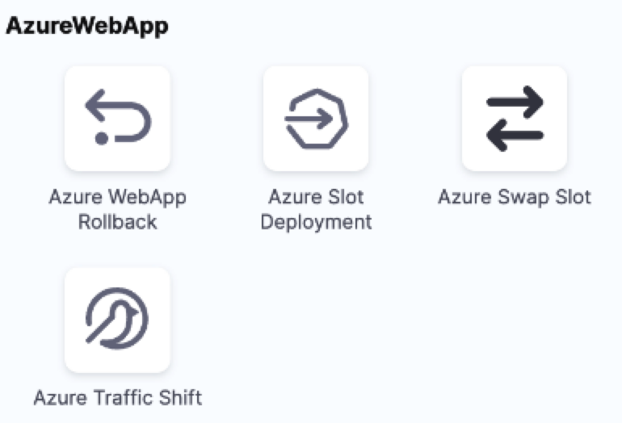

This article addresses some frequently asked questions about Azure deployments in Harness.


### Is this the right format to push a secret to the Azure key vault? secret.setVaule("azurevauly://avidentifier/pathToSecret", secretVaule)?
secret.setValue is not supported. Secrets can be referred to only using ```secret.getValue("azurevauly://avidentifier/pathToSecret")``` or `secret.getValue("secretIdentifierInHarness")`.

### Do we support nested AD groups syncing to Harness on AD SCIM sync?

Enabling Azure AD provisioning in Harness allows user provisioning from Azure AD. Users directly provisioned require group assignment in Harness, while Azure AD group members' group assignments are managed in Azure AD. For more details, go to [Provision users and groups using Azure AD SCIM](https://developer.harness.io/docs/platform/role-based-access-control/provision-users-and-groups-using-azure-ad-scim/)


### How do I pass --target-path to deploy the code into the different path in Azure Web App deployment?

Unfortunately, we currently don't have any parameters to pass the target path.


### How to deploy Azure SpringApps JAR via Harness CD?

You can take advantage of our ssh deployment and include a step to download the JAR.


### What is the correct url format for Azure Git repo to be used in git ops repository?

The url format for the Azure git repo to be specified in gitOps repository is below:
```
https://someuser@dev.azure.com/someuser/someproject/_git/test.git
```


### How can I deploy the application on a custom specified location in the Azure web app?

Currently, we don't have any facility to do the web app deployment in the custom-specified location in Azure. Alternatively, you can use the shell script step and use the Azure CLI to pass the required argument.

### How does the newly introduced support for Azure Logs as a Health Source in Harness contribute to service monitoring, particularly through the utilization of Cloud Metrics and Cloud Logs ? 

Harness has now launched support for Azure Logs Support as a Health Source for CV and has enabled for all accounts . Users can use Cloud Metrics and Cloud Logs to monitor their deployed service. This was a feature parity item with Harness First Gen. One may also follow the same in our [Documentation](https://developer.harness.io/docs/service-reliability-management/monitored-service/health-source/azurelogs/).


### Does the Azure connector support service principles?

Yes. We support System Assigned Managed Identity and User Assigned Managed Identity in the Azure Global and Government environments.
The service principal maps to a managed identity.


### Does Harness support Azure Container Apps ?
No, due to low customer request it is not on our road map. Please feel free to create a request for the same.
For more details, go to [CD integrations](https://developer.harness.io/docs/continuous-delivery/cd-integrations).


### Is there any internal or external documentation available for building and deploying updates for an Azure SQL Server database ?

No, We do not have a prescribed way to do this it would need to be their own scripts.


### How to prepare Azure VMSS Deployment in Harness ?

Harness provides a template specific to Azure VMSS Deployment which can be referred from the following [Custom Template Documentation](https://developer.harness.io/docs/continuous-delivery/deploy-srv-diff-platforms/custom-deployment-tutorial/#azure-vmss---deployment-template-sample).


### Why can't I deploy an ARM template?

If you are getting the below error when attempting to deploy ARM templates, it might be because `$schema` and `contentVersion` parameters have not been removed from the Parameters File yet. This is due to a limitation in the Azure Java SDK and REST API.

```
Status code 400, "{"error":{"code":"InvalidRequestContent","message":"The request content was invalid and could not be deserialized: 'Error converting value \"https://schema.management.azure.com/schemas/2015-01-01/deploymentParameters.json#\" to type 'Azure.Deployments.Core.Definitions.DeploymentParameterDefinition'. Path 'properties.parameters.$schema', line 1, position 6636.'."}}"
```

For an example of a valid Paramters File, go to [ARM parameter file](/docs/continuous-delivery/cd-infrastructure/azure-arm-provisioning/#arm-parameter-file).


### Why am I getting the error: "az command is not found"?
If you receive the below error:

```
az command not found
```
It indicates that the Azure CLI is not installed in your session. This typically happens when running a Shell Script step on the Delegate or when running a script in a CI Build Stage. To fix this, please make sure to install the Azure CLI on the Delegate. Go to [Add Your Custom Tools](https://developer.harness.io/docs/platform/delegates/install-delegates/install-a-delegate-with-3-rd-party-tool-custom-binaries/#add-your-custom-tools) for more information.


### Does the Azure connector support service principles? 

Yes. We support System Assigned Managed Identity and User Assigned Managed Identity in the Azure Global and Government environments.

The service principal maps to a managed identity.

### Does Harness support Azure Kubernetes Infrastructure for deployment targets?

Yes, we do support Azure Kubernetes Infrastructure for deployment targets.

For more information, go to [Deploy Azure ACR to Azure AKS](/docs/continuous-delivery/deploy-srv-diff-platforms/azure/azure-cd-quickstart).

### Does Harness work with Azure Key Vault?

Yes, we support Azure Key Vault today, which also supports service principles via Managed Identity. We can fetch secrets from your Key Vault. We will not create secrets directly in Key Vault.

For more information, go to [Add an Azure Key Vault secret manager](/docs/platform/secrets/secrets-management/azure-key-vault).

### Does Harness support deploying to VMs in Azure?

Yes, we do support the deployment of traditional (JAR, WAR, TAR, .ZIP) and Docker artifacts into Azure Managed VMs.

We can perform SSH deployments into Linux hosts managed by Azure.

For more information, go to:

- [VM deployments using SSH](/docs/continuous-delivery/deploy-srv-diff-platforms/traditional/ssh-ng)
- [Windows VM deployments using WinRM](/docs/continuous-delivery/deploy-srv-diff-platforms/traditional/win-rm-tutorial)


### Can I deploy Azure Web Apps?

Yes. Harness can deploy a Docker image or non-containerized artifact for your Azure Web App. You can deploy to slots, perform traffic shifting, and swap slots. Harness supports common deployment strategies (basic, canary, and blue green).

For more information, go to [Azure Web Apps deployments](/docs/continuous-delivery/deploy-srv-diff-platforms/azure/azure-web-apps-tutorial).

### What deployment strategies are supported?

Basic, canary, and blue green.

The Rolling strategy doesn't suit Azure Web App deployments, as they use slots for staging and production environments. The Rolling strategy uses a single environment and roll out a new app version incrementally.

### What limitations are there?

- App Service on Linux isn't supported on [Shared](https://azure.microsoft.com/pricing/details/app-service/plans/) pricing tier.
- You can't mix Windows and Linux apps in the same App Service plan.
- Within the same resource group, you can't mix Windows and Linux apps in the same region.
- Harness uses the Azure SDK among other methods and Authenticated proxy is not supported for Azure SDK. Consequently, you cannot use Azure connections for artifacts, machine images, etc, that require proxy authentication. This is an Azure limitation, not a Harness limitation. This is a known Azure limitation with Java environment properties and their SDK.

### How many Azure Web Apps execution steps are there?

There are 4 steps.

  

We support a basic Azure slot deployment, a canary deployment, and a blue green deployment of Azure Web Apps.

We also support automated rollback for Azure Web App.

For more information, go to [Azure Web Apps deployments](/docs/continuous-delivery/deploy-srv-diff-platforms/azure/azure-web-apps-tutorial).

### What is the correct deployment type for a Spring Boot JAR being deployed to Azure App Services in Harness?

The correct deployment type for a Spring Boot JAR being deployed to Azure App Services in Harness is Azure Web Apps.

###  What steps should be taken if the artifact shows up in the artifact feed but is not usable in the CD stage in Harness?

Verify that the artifact is of a supported type (e.g., Maven or Nuget) and follows the correct naming conventions. Refactor the mvn publish command if necessary to ensure it targets the correct artifact feed. Please follow more on this in [CD Artifact Sources](https://developer.harness.io/docs/continuous-delivery/x-platform-cd-features/services/artifact-sources/#package-type-support)

### How can one publish a Maven artifact to the artifact feed instead of another repository in Harness?

One can modify the `pom.xml` file to configure the mvn publish command to push to the desired artifact feed. This might involve changing the repository settings in the `pom.xml` to point to the correct artifact feed.