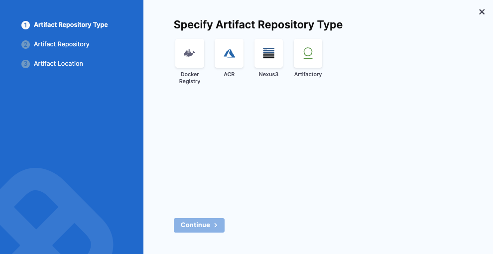

Harness now supports the deployment of Azure Functions, enabling you to automate and manage serverless function deployments to Azure with ease. 

:::note

Currently, this feature is behind the feature flag `CDS_AZURE_FUNCTION`. Contact [Harness Support](mailto:support@harness.io) to enable the feature.

:::

This topic walks you through setting up and running an Azure Functions deployment in Harness.

The basic steps are:

1. Specify the Azure Function artifact and configuration required for the function.
2. Connect Harness with your Azure subscription.
3. Define the target function in Harness and install a Harness Delegate to perform the deployment.
4. Define the steps for the different deployment strategies:
	- **Basic:** In a Basic deployment, all nodes(pods, instances, etc) within a single environment are replaced at the same time with new nodes containing the new service/artifact version.

## Step by Step Guide

<iframe src="https://app.tango.us/app/embed/42b00687-c903-46c5-96a5-33a4e8c273fd" style={{ minHeight: '800px' }}sandbox="allow-scripts allow-top-navigation-by-user-activation allow-popups allow-same-origin" security="restricted" title="Deploying Azure Functions with Harness" width="100%" height="100%" referrerpolicy="strict-origin-when-cross-origin" frameborder="0" webkitallowfullscreen="webkitallowfullscreen" mozallowfullscreen="mozallowfullscreen" allowfullscreen="allowfullscreen"></iframe>

## Azure Function pipeline stages

Azure deployments are performed using a CD stage with the deployment type **Azure Function**.

For more information on stages, go to [Add a Stage](/docs/platform/pipelines/add-a-stage) and [CD Pipeline modeling overview](/docs/continuous-delivery/get-started/cd-pipeline-modeling-overview).

## Azure Function Services

In Harness, the service represents your Azure Function.

You define the service for your deployment in the service settings of the pipeline stage. You can either define the service separately in your project's service section and select it in the stage, or create the service directly within the stage's service tab.

It is an artifact-based service, where a manifest is not required, and setting up Variables is optional.

:::note Info
The artifact must contain the Azure function app. For more information on how to create containerized function apps, go to [Azure Documentation](https://learn.microsoft.com/en-us/azure/azure-functions/functions-how-to-custom-container?tabs=core-tools%2Cacr%2Cazure-cli2%2Cazure-cli&pivots=azure-functions).

You can also deploy Azure Function Apps packaged as ZIP Bundles. For more information, refer to [Azure Documentation](https://learn.microsoft.com/en-us/azure/azure-functions/functions-deployment-technologies?tabs=windows#zip-deploy).

**Important:** When creating the Function App in Azure, ensure that you select the Container Apps Environment hosting plan. This is essential for deploying containerized Function Apps

:::

To add an artifact source, click on Add Artifact Source.

Currently, Harness supports Docker Registry, ACR, Nexus3, and Artifactory for artifact repositories. Choose where your artifact is stored, and click Continue.

Under Artifact Repository, configure your connector to connect to your artifact repository.

Under Artifact Location, specify the necessary details such as Artifact Source Identifier, Image Path, Tag, and click Submit.

You can also create and use a template for artifacts.

:::info
When you set **Artifact type = Other** for a private Docker registry, you will need to populate the PLUGIN_DOCKER_USERNAME and the full registry URL in the slot’s Full Image Name and Tag. To do so, add:
- PLUGIN_DOCKER_USERNAME: `<+secrets.getValue("account.ARTIFACTORY_SAAS_PROD_USERNAME")>`
- PLUGIN_DOCKER_CONTAINER_NAME: `https://<your-registry-url>/<repository>/<image>:<tag>`

in the Azure Deployment step so that your function can authenticate and pull the correct image.
:::

## Azure Function Environments 

Define the environment you want to use to deploy the Azure function.

You define the target infrastructure for your deployment in the **Environment** settings of the pipeline stage. You can either define the environment separately in your project's **Environments** section and select it in the stage, or create the environment directly within the stage's **Environment** tab.

## Azure Functions target infrastructure

For deploying Azure Functions, you need to specify the pre-existing target infrastructure:

For details on Harness provisioning, go to [Provisioning overview](/docs/continuous-delivery/cd-infrastructure/provisioning-overview).

### Pre-existing infrastructure

The target Azure environment for your Harness Azure Function deployment is defined in a Harness Environment's **Infrastructure**. You will provide the Azure Function name later in your stage's **Execution**.

You simply provide select or create an Azure Cloud Provider connector and then select the Azure Function's Subscription Id and Resource Group.

In your stage **Environment**, in **Specify Infrastructure**, you select an infrastructure or select **New Infrastructure** and define the infrastructure settings:

- **Connector**: Select or create an Azure Cloud Provider connector that connects to your Azure application and tenant Ids.

  For steps on setting up a new Azure Cloud Provider connector, go to [Add a Microsoft Azure Cloud Connector](/docs/platform/connectors/cloud-providers/add-a-microsoft-azure-connector).
- **Subscription Id**: Select the Azure subscription used by your Azure Function.
  
  The subscription is located in the Azure Function **Overview** section of the Azure portal.
  
  

- **Resource Group**: Select the resource group used by your Azure Function.
  
  The resource group is located in the Azure Function **Overview** section of the Azure portal.
  
  

Within the same resource group, you can't mix Windows and Linux apps in the same region. See [Limitations](https://docs.microsoft.com/en-us/azure/app-service/overview#limitations) from Azure.

:::info note
In the deploy steps under Container Configuration, specify the appropriate image based on your container registry:

1. [Docker Image for Azure Function Plugin](https://hub.docker.com/r/harness/azure-function-plugin/tags)
2. [ECR Image for Azure Function Plugin](https://gallery.ecr.aws/harness/harness/azure-function-plugin)
3. GAR Images for Azure Function Plugin:
   - Europe region: [GAR Image Repository for Azure Function Plugin (Europe)](https://console.cloud.google.com/artifacts/docker/gar-prod-setup/europe/harness-public/harness%2Fazure-function-plugin?inv=1&invt=Ab5cNA)

:::

## Azure function Deploy

In the execution tab of the pipeline stage, select **Add Step** and select **Azure function Deploy**.

Currently Azure function deployment supports basic and custom deployment strategy.

:::important Container Execution Requirements
The Azure Function Deploy step requires a containerized execution environment:

- If you select the **Basic** deployment strategy, Harness automatically adds a container Step Group with the Azure Function Deploy step inside it.

- If you select the **Custom** deployment strategy, you need to manually:
  1. Add a Step Group to your pipeline
  2. Enable the **Container** option in the Step Group
  3. Configure the Step Group to use your Kubernetes connector
  4. Add the Azure function Deploy step inside this Step Group

Failure to run the step in a containerized execution context will likely result in deployment failures.
:::

The Azure function Deploy step has the following settings:

 * **Name:** Enter a name for the step.
 * **Timeout:** Enter a minimum of **10m**. The slot deployment relies on Azure and can take time.
 * **Container Registry**: Specify the connector that connects to the azure infrastructure and container registry you wish to use.
 * **Image**: Specify the artifact image you want to run. 
 * **Function app**: Specify the Azure Container to be used.
 * **Deployment Slot:** Enter the name of the Source slot for the deployment. This slot is where Harness deploys the new Azure Function version. Make sure the slot you enter is running.

Additionally you can have optional configurations such as 
* **Pre-Execution Command:** A command that runs before the main execution starts.
* **Image Pull Policy:** Specifies when the container image should be pulled from the registry.
* **Run as User:** Configures the user identity under which the function or container should run, useful for security and access control.
* **Limit Memory:** Defines the maximum memory that can be allocated to the container or function during execution.
* **Limit CPU:** Sets a limit on the CPU usage for the function or container, ensuring the function does not consume excessive resources.
* **Deploy Command Options:** Options that can be passed to customize the deployment process
* **Environment Variables** Additional environment variables that you need to specify.

## Azure Function Rollback

Harness will try to recover the state before deployment.

For a Docker image deployment rollback, Harness will fetch the Web App details (artifact, app settings, connection strings, startup script) of the existing slot and use this data to bring the slot to its previous state.

For non-containerized artifact rollback, Harness will rollback to the last successful deployment done with Harness. Harness saves deployment details after a successful deployment and uses this data for rollback in the next deployment.

The Azure Function Rollback step has the following settings:

 * **Name:** Enter a name for the step.
 * **Timeout:** Enter a minimum of **10m**. The slot deployment relies on Azure and can take time.
 * **Azure Connector**: Specify the connector that connects to the azure infrastructure.
 * **Image**: Specify the artifact image you want to deploy.

Additionally you can have optional configurations such as 

 * **Image Pull Policy:** Specifies when the container image should be pulled from the registry.
* **Run as User:** Configures the user identity under which the function or container should run, useful for security and access control.
* **Limit Memory:** Defines the maximum memory that can be allocated to the container or function during execution.
* **Limit CPU:** Sets a limit on the CPU usage for the function or container, ensuring thee function does not consume excessive resources.

## Azure Function Deployment Sample 

To see an example of how to deploy Azure Functions using Harness, visit the [Harness Community Repository](https://github.com/harness-community/harnesscd-example-apps/tree/master/azure-function-deployment).

This repository provides a ready-to-use sample application and the necessary configuration files to help you get started quickly.
