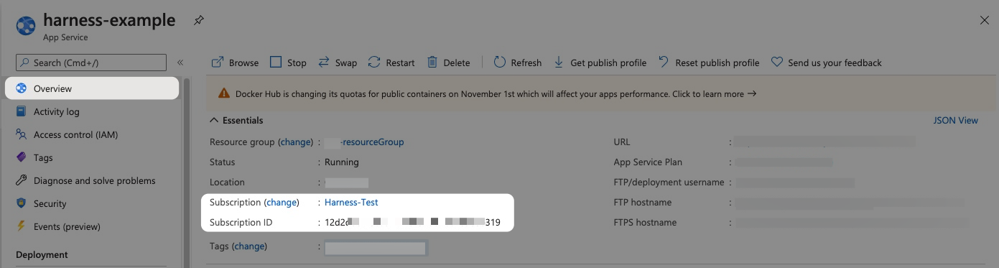
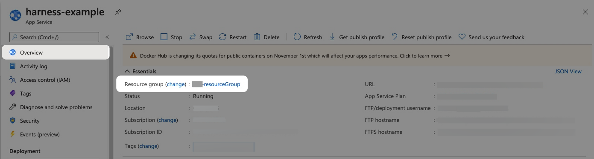

Harness now supports the deployment of Azure Functions, enabling you to automate and manage serverless function deployments to Azure with ease. 

This topic walks you through setting up and running an Azure Functions deployment in Harness.

The basic steps are:

1. Specify the Azure Function artifact and configuration required for the function.
2. Connect Harness with your Azure subscription.
3. Define the target function in Harness and install a Harness Delegate to perform the deployment.
4. Define the steps for the different deployment strategies:
	- **Basic:** In a Basic deployment, all nodes(pods, instances, etc) within a single environment are replaced at the same time with new nodes containing the new service/artifact version.

## Azure Function pipeline stages

Azure deployments are performed using a CD stage with the deployment type **Azure Function**.

For more information on stages, go to [Add a Stage](/docs/platform/pipelines/add-a-stage) and [CD Pipeline modeling overview](/docs/continuous-delivery/get-started/cd-pipeline-modeling-overview).

## Azure Function Services

In Harness, the service represents your Azure Function.

You define the service for your deployment in the service settings of the pipeline stage. You can either define the service separately in your project's service section and select it in the stage, or create the service directly within the stage's service tab.

It is an artifact-based service, where a manifest is not required, and setting up Variables is optional.

To add an artifact source, click on Add Artifact Source.

Currently, Harness supports Docker Registry, ACR, Nexus3, and Artifactory for artifact repositories. Choose where your artifact is stored, and click Continue.

Under Artifact Repository, configure your connector to connect to your artifact repository.

Under Artifact Location, specify the necessary details such as Artifact Source Identifier, Image Path, Tag, and click Submit.

You can also create and use a template for artifacts.

## Azure Function Environments 

Define the environment you want to use to deploy the Azure function.

You define the target infrastructure for your deployment in the **Environment** settings of the pipeline stage. You can either define the environment separately in your project's **Environments** section and select it in the stage, or create the environment directly within the stage's **Environment** tab.

## Azure Functions target infrastructure

There are two methods of specifying the deployment target infrastructure:

- **Pre-existing**: the target infrastructure already exists and you simply need to provide the required settings.
- **Dynamically provisioned**: the target infrastructure will be dynamically provisioned on-the-fly as part of the deployment process.

For details on Harness provisioning, go to [Provisioning overview](/docs/continuous-delivery/cd-infrastructure/provisioning-overview).

### Pre-existing infrastructure

The target Azure environment for your Harness Azure Function deployment is defined in a Harness Environment's **Infrastructure**. You will provide the Azure Function name later in your stage's **Execution**.

You simply provide select or create an Azure Cloud Provider connector and then select the Azure Function's Subscription Id and Resource Group.

In your stage **Environment**, in **Specify Infrastructure**, you select an infrastructure or select **New Infrastructure** and define the infrastructure settings:

- **Connector**: Select or create an Azure Cloud Provider connector that connects to your Azure application and tenant Ids.

  For steps on setting up a new Azure Cloud Provider connector, go to [Add a Microsoft Azure Cloud Connector](/docs/platform/connectors/cloud-providers/add-a-microsoft-azure-connector).
- **Subscription Id**: Select the Azure subscription used by your Azure Function.
  
  The subscription is located in the Azure Function **Overview** section of the Azure portal.
  
  

- **Resource Group**: Select the resource group used by your Azure Function.
  
  The resource group is located in the Azure Function **Overview** section of the Azure portal.
  
  

Within the same resource group, you can't mix Windows and Linux apps in the same region. See [Limitations](https://docs.microsoft.com/en-us/azure/app-service/overview#limitations) from Azure.

When you're done, infrastructure will look something like this:

### Dynamically provisioned Azure Function infrastructure

Here is a summary of the process to dynamically provision the target infrastructure for a deployment:

1. **Add dynamic provisioning to the CD stage**:

    

   1. In a Harness Deploy stage, in **Environment**, enable the option **Provision your target infrastructure dynamically during the execution of your Pipeline**.
   2. Select the type of provisioner that you want to use.
      Harness automatically adds the provisioner steps for the provisioner type you selected.
   3. Configure the provisioner steps to run your provisioning scripts.
   4. Select or create a Harness infrastructure in **Environment**.
2. **Map the provisioner outputs to the Infrastructure Definition**:
   1. In the Harness infrastructure, enable the option **Map Dynamically Provisioned Infrastructure**.
   2. Map the provisioning script/template outputs to the required infrastructure settings.

This process is explained in detail below.

#### Supported provisioners

The following provisioners are supported for Azure Function deployments:

- [Terraform](/docs/continuous-delivery/cd-infrastructure/terraform-infra/terraform-provisioning-with-harness)
- [Azure Resource Manager (ARM)](/docs/continuous-delivery/cd-infrastructure/azure-arm-provisioning)
- [Azure Blueprint](/docs/continuous-delivery/cd-infrastructure/azure-blueprint-provisioning)
- [Shell Script](/docs/continuous-delivery/cd-infrastructure/shell-script-provisioning)

#### Adding dynamic provisioning to the stage

To add dynamic provisioning to a Harness pipeline Deploy stage, in **Environment**, you enable the option **Provision your target infrastructure dynamically during the execution of your Pipeline**.

Next, you select the type of provisioner that you want to use. Harness automatically adds the necessary provisioner steps.

Finally, you set up the provisioner steps to run your provisioning scripts.

For documentation on each of the required steps for the provisioner you selected, go to the following topics:

- Terraform:
  - [Terraform Plan](/docs/continuous-delivery/cd-infrastructure/terraform-infra/run-a-terraform-plan-with-the-terraform-plan-step)
  - [Terraform Apply](/docs/continuous-delivery/cd-infrastructure/terraform-infra/run-a-terraform-plan-with-the-terraform-apply-step)
  - [Terraform Rollback](/docs/continuous-delivery/cd-infrastructure/terraform-infra/rollback-provisioned-infra-with-the-terraform-rollback-step). To see the Terraform Rollback step, toggle the **Rollback** setting.
- [Terragrunt](/docs/continuous-delivery/cd-infrastructure/terragrunt-howtos)
- [Terraform Cloud](/docs/continuous-delivery/cd-infrastructure/terraform-infra/terraform-cloud-deployments)
- [Azure Resource Management (ARM)](/docs/continuous-delivery/cd-infrastructure/azure-arm-provisioning)
- [Azure Blueprint](/docs/continuous-delivery/cd-infrastructure/azure-blueprint-provisioning)
- [Shell Script](/docs/continuous-delivery/cd-infrastructure/shell-script-provisioning)

#### Mapping provisioner output

Once you set up dynamic provisioning in the stage, you must map outputs from your provisioning script/template to specific settings in the Harness Infrastructure Definition used in the stage.

1. In the same CD Deploy stage where you enabled dynamic provisioning, select or create (**New Infrastructure**) a Harness infrastructure.
2. In the Harness infrastructure, in **Azure Infrastructure details**, enable the option **Map Dynamically Provisioned Infrastructure**.
   
   The **Azure Infrastructure details** section adds a **Provisioner** setting and configures it as a runtime input.
3. Map the provisioning script/template outputs to the required infrastructure settings.

To provision the target deployment infrastructure, Harness needs specific infrastructure information from your provisioning script. You provide this information by mapping specific Infrastructure Definition settings in Harness to outputs from your template/script.

For Azure function, Harness needs the following settings mapped to outputs:

- Subscription Id
- Resource Group
- Tags (optional)

## Azure function Deploy

In the execution tab of the pipeline stage, select *Add Step** and select **Azure function Deploy**.

Currently Azure function deployment supports basic and custom deployment strategy.

The Azure function Deploy step has the following settings:

 * **Name:** Enter a name for the step.
 * **Timeout:** Enter a minimum of **10m**. The slot deployment relies on Azure and can take time.
 * **Azure Connector**: Specify the connector that connects to the azure infrastructure.
 * **Image**: Specify the artifact image you want to deploy.
 * **Function app**: Specify the Azure Container to be used.
 * **Deployment Slot:** Enter the name of the Source slot for the deployment. This slot is where Harness deploys the new Azure Function version. Make sure the slot you enter is running.

Additionally you can have optional configurations such as 
* **Pre-Execution Command:** A command that runs before the main execution starts.
* **Image Pull Policy:** Specifies when the container image should be pulled from the registry.
* **Run as User:** Configures the user identity under which the function or container should run, useful for security and access control.
* **Limit Memory:** Defines the maximum memory that can be allocated to the container or function during execution.
* **Limit CPU:** Sets a limit on the CPU usage for the function or container, ensuring the function does not consume excessive resources.
* **Deploy Command Options:** Options that can be passed to customize the deployment process
* **Environment Variables** Additional environment variables that you need to specify.

## Azure Function Rollback

Harness will try to recover the state before deployment.

For a Docker image deployment rollback, Harness will fetch the Web App details (artifact, app settings, connection strings, startup script) of the existing slot and use this data to bring the slot to its previous state.

For non-containerized artifact rollback, Harness will rollback to the last successful deployment done with Harness. Harness saves deployment details after a successful deployment and uses this data for rollback in the next deployment.

The Azure Function Rollback step has the following settings:

 * **Name:** Enter a name for the step.
 * **Timeout:** Enter a minimum of **10m**. The slot deployment relies on Azure and can take time.
 * **Azure Connector**: Specify the connector that connects to the azure infrastructure.
 * **Image**: Specify the artifact image you want to deploy.

Additionally you can have optional configurations such as 

 * **Image Pull Policy:** Specifies when the container image should be pulled from the registry.
* **Run as User:** Configures the user identity under which the function or container should run, useful for security and access control.
* **Limit Memory:** Defines the maximum memory that can be allocated to the container or function during execution.
* **Limit CPU:** Sets a limit on the CPU usage for the function or container, ensuring the function does not consume excessive resources.

